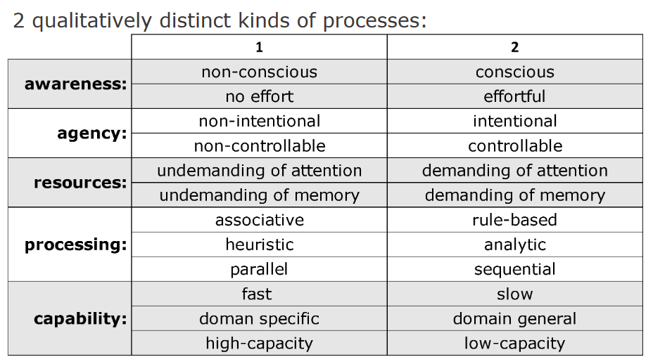
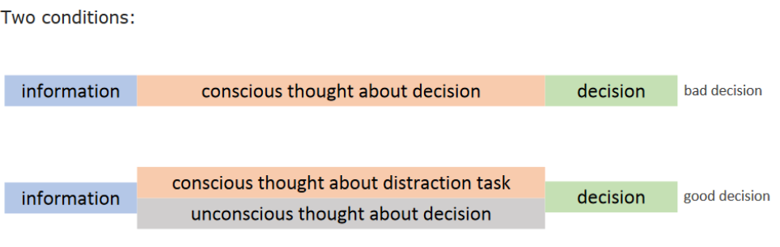
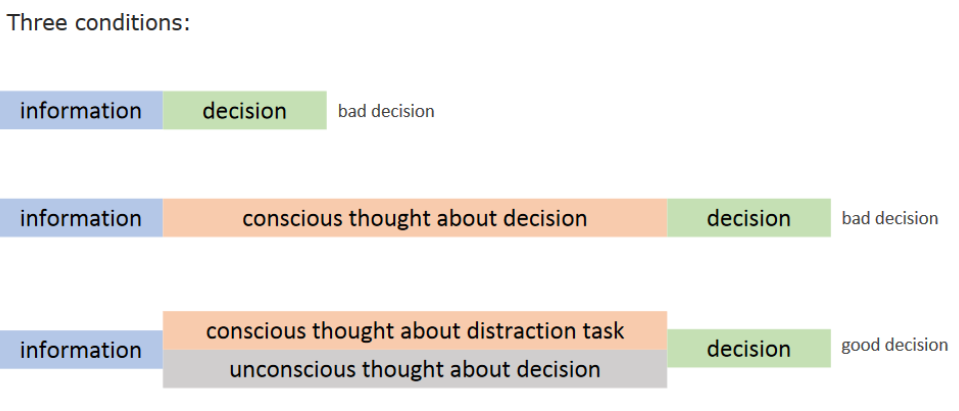
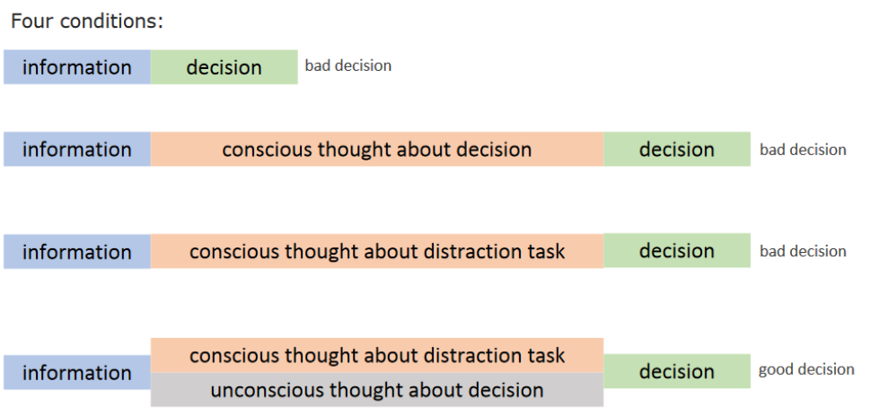

# [Cognitive Architecture](cog-decision.md)

Paul's PN: 6943696560

## Introduction

**Descriptive Claims:**
- Claims about what *is* the case.
- E.g. What people actually decide. What are the psychological processes leading to the decisions are. (Most students don't cheat on exams.) Paul *thinks*

**Normative Claims:**
- Claims that *ought* to be the case.
- E.g. You shouldn't cheat on exams. Paul *should*

**Replication Studies**
- Before people who did replications of classic studies and quoted multiple times were not rewarded because they wouldn't get any advancements in their career from it.
- However, people then began realizing that these classical theories and experiments actually didn't replicate.

---

- Review some of the different kinds of research questions that are examined in the field of judgement and decision making, and considering how the field may be pertinent to your own life in a variety of ways.
- Compare two of the major empirical approaches to studying and understanding everyday judgement and decision-making - the cognitive illusions approach and the fast-and-frugal approach.
- Consider arguments for and against whether dual-process models of reasoning can serve as an organizing framework for the field.
- Understood and compared three major types of decision-making models (i.e., descriptive, normative, and prescriptive), and how each type of model has distinct but important goals, and how they relate to one another.

## Dual Processing Model

### Key Terms

- Personal Decisions - Making choices that *are* essentially under our own control.
- Cognitive illusions - systematic ways in which people make errors in subjective judgement.
	- Visual perception, 3D-like images.
	- The point of cognitive illusions literature is to pinpoint the times when using these simple **affects** will lead to mistaken judgements.
- Affect - Something that can influence your decision making.
	- Feeling positively about a job, emotions.
	- People use affect much of the time to make judgements. (i.e. comedians making jokes vs decisions based on that comedian.)
- Fast-and-frugal approach (to judgement and decision making) - emphasized how the use of mental shortcuts is adaptive.
	- This leads to the best *balance* between minimizing the costs of cognitive processing and maximizing the accuracy of decisions.
	- Gigerenzer Approach! (Identifies how these shortcuts get people through complex decisions and also identifies them.)
- Computational capacity - There is a limited amount of information that we can process at a time. 
	- Mental shortcuts using the fast and frugal method help us navigate this shortcoming.
- **Dual-process models** - The most popular of organizing frameworks for organizing the findings of different mental shortcuts and the conditions in which they do and do not appear. [See More Below ↓](#dual-process-models)
- System 1; System 2 [See More Below ↓](#dual-process-models)
- Associative/ Rule-based
- Type 1; Type 2 processing
- Descriptive Models - Attempt to describe how people **actually** judge and decide, without saying whether it is good or bad. (Dual processing model falls into this category)
- Normative Models - Reflect the *optimal* or ideal decision-making. (Logical, consistent with one's past decisions and preferences, and takes all known relevant data into consideration)
	- Should get a person closest to achieving his or her own goals over the long run.
- Prescriptive Models - Recommend a particular way in which people ought to judge and decide. (May or may not be a normalized way, but thought to be an improvement)
	- *Think of doctors prescribing a general antibiotic for what seems like a normal viral infection.*
- Uncertainty - When a numerical, probabilistic prediction cannot be made because the events are relatively unique and past events are not relevant enough to provide appropriate data for calculating probabilities.
- Risk - The potential costs and benefits of that action. Defers from uncertainty in that risk refers to judging the likelihood of events for which past relevant numerical data are available.

---
### Why Study Cognition and Decision Making

- Figuring out how and why people make the decisions that they do is important not only from a public wellness perspective, but also to us personally as we live our lives.
	- Can help us make informed decisions for our lives and our careers.

### Dual Process Models

**Dual process models** are a broad group of theories suggesting that judgements and decisions are generally carried out via two distinct kinds of mental processes.

These two processes are commonly referred two as **systems**, or, *more recently*, **types** of processing.

#### System 1
- Traditionally meant to refer to fast, intuitive, parallel (i.e. simultaneous), automatic, emotion driven, and not always conscious driven.
- I.E. an unconscious stereotype

#### System 2
- Generally used to refer to cognitively taxing, deliberate, **serial**, controlled reason-driven, and/or consciously accessible processes.
- I.E. attempt to override that stereotype by consciously reasoning it is unfair to stereotype anyone.
- **System 2 processing can override system 1 processing**

---
> This Connects to [CogSci: The Rational Mind](../cog-sci/10-the-rational-mind.md)

---
### Sloman (1996)
- Suggested that the two systems in the Dual System Model followed two different properties.
- Before him, researchers treated judgements as only following one or the other. He argued that they have both systems for reasoning and that these systems could operate *simultaneously* in the same person.
- While the *associativity* model and the *rule-based* model theoretically **could** generate the same judgement, it does **not** necessary **have to**.

#### Associativity
- One of the systems (System 1) is based on similarities and statistical information.
- i.e. Classifying a robin as a robin because it is visually similar to our memories of a robin.

#### Rule Based
- The other system uses a set of logical rules, or rules of the social or natural world, or computer algorithms that minds use to compute decisions or judgement.
- i.e. Classifying a bird as a robin using the rules that define a robin.

### Stanovich and West (2000)

- Did a comprehensive review of the dual-process models that had been proposed over the years and noted the similarities.
- Coined the terms System 1 and System 2 to suggest that global distinctions could be made between these two clusters of processes.

---
#### Cognitive Reflection Test (CRT)
- Designed to detect individual differences in the use of System 1 vs System 2 processing.
- Introduced as a measure of the disposition to reflect on a question and resist reporting the first response that comes to mind.
- So many people had completed that test that they had to develop a second, alternative questionnaire to measure the same thing.

---

### Issues Arising with Dual Processing
- Sometimes critiqued for being vague and poorly defined.
- Became apparent that the proposed attributes of each system do not always co-occur.
	- Being fast, automatic and unconscious do not always coincide with also processing associatively.
	- It appears to be possible for deliberate and intuitive processing to be based on rules...

### Evans (2008)
- Suggested that the Dual Processing framework was still viable due to common elements to each process that could still be found in all the different dual-process theories.

Suggested the terms:

#### Type 1 Processing
- Automatic, non-conscious, and fast
- Instead of System 1

#### Type 2 Processing
- Deliberate, slow, conscious
- Perform reasoning and correct mistaken intuiutions.
- Imagine future possibilities
- Aide with complex verbal communication.
- Learn new skills
- **Only type 2 is** tied to our working memory
- Instead of System 2

These terms help to acknowledge that they reflect different  kinds of processing rather than entire systems of processing.

**Problems:** Does Type 2 processing tend to *correct* Type 1 judgements? Perhaps it might *rationalize* Type 1 answers or confabulate reasons?

---

### Cluster Problem
- Do attributes on each side (Type 1 or Type 2 Processes) *always* go together?
- Are some more fundamental than others.

---
*In the early days of the Dual-Processing model:*

- (Sloman) focused on the *style* of processing: Type 1 → associative, hence quick. Type 2 → Rule-based, hence slow.

---
### Evans and Stranovich (2013)
- Refined and narrowed the definition of dual-process models.
- Described type 1 as intuitive and type 2 as reflective.
- Identified a few attributes that can always be used to distinguish Type 1 processing from Type 2. 
	- Working memory distinction!
	- Type 1 processing includes automatic processing and processing done by habit.
	- Type 2 processing includes reflections and can be carried out in detachment from reality. (Hypothetical thinking, Thinking about the future)

> For more information on [memory](../cog-sci/8-memory.md).

---

During the first half of the 20th century:

- Behaviorist movement in psychology.
- Conscious and unconscious states were rejected.

During the latter half of the 20th century:

- More of an emphasis on mental states.

### The New Unconscious
- Aka "cognitive unconscious" / "adaptive unconscious"
- States unconscious are inherently inaccessible.
- They have not been repressed.
- They are not recoverable in therapy.
- The unconscious is efficient and sophisticated.
- It is like a sophisticated piece of software that runs in the background.

## Working Memory

### Baddeley and Hitch Working Memory Model

1. The **central executive** (attentional controller.)
2. The **phonological loop** (verbal and auditory information)
3. The **visuospatial sketchpad** (visual and spatial information)

**Baddeley (2000) added:**

4. **Episodic buffer** (memory store and integration of information from phonological loop and visuospatial sketchpad)

### Central Executive

Four primary functions of the central executive:

1. Focusing attention
2. Dividing attention
3. Switching between tasks
4. Interfacing with long-term memory.

### Phonological Loop

Comprised of 2 things:

1. Phonological store: A short-term sound-based store of speech and other sounds, that fades within a few seconds.
2. Articulatory rehearsal process: An articulatory loop that maintains information in the store (inhibits decay) by either vocal or subvocal rehearsal.

### Working Memory Capacity
- Attention appears to be necessary for consciousness.
- Baars (1988) suggests that conscious states are a subset of the contents of working memory.
- Mental states are conscious only when they are in the spotlight of attention and hence being "globally broadcast" to multiple cognitive systems.
	- By focusing our attention on something, we allow other cognitive systems to take heed of the thing as well.
- Conscious attention in working memory may use the same mechanism as perceptual attention.
- It has been suggested that attention biases sensory processing by enhancing the sensitivity of selected ground of neurons and suppressing the activity of others.

---
#### Problems

1. Do all the tasks above engaging working memory to some extent?

**Potential response from Evans (2019)**: "While Type 1 processes do not require the resources of working memory or controlled attention for their operation (or they would be Type 2) they do post their products into working memory in a way that many autonomous processes of the brain do not. Specifically, they bring to mind judgements or candidate responses of some kind accompanied by a feeling of confidence or rightness in that judgement, as proposed by Valerie Thompson and colleagues."

2. "**Dichotomizing variables**"

- Some of the attributes seem to fall at two ends of a continuous spectrum.
- On what basis can we dichotomize them?
- Who says where the distinction is?
	- There is a spectrum between no effort and effort. **Where do we draw the line???**

3. Interaction

- How do Type 2 Processes know how to switch on???
- Potential answers **below**

### Interaction Models

#### Parallel-Competitive Models
- Both Type 1 and Type 2 processes are engaged from start.
- Type 1 processes are faster so output a response before the slower Ttype 2 processes can complete.
- Additional Type 2 processing may occur if the two types of processing output conflicting responses.

#### Default-Interventionist (Serial) Models
- Type 11 but not Type 2 processes are engaged at the start
- Type 2 processes output a response
- If the response is *suspect*, Type 2 processing may occur.

---
> What is "*suspect*"?
> Fluency of an intuitive answer. The feeling of rightness.

---
#### De Neys (2012 Model)
- Multiple Type 1 processes might operate and yield conflicting answers.
- If they conflict, Type 2 processes are engaged.
- This is sometimes called a "hybrid" model.

---

### More Problems

4. Undiagnostic evidence

What evidence is there for dual-process theories vs one-process theories?

Take a task with an intuitive incorrect answer. **Reaction times show that incorrect answers are quicker**

- Cognitive load manipulations: Number of correct responses drop.

> Problem: These findings may also be explained by positing that there is one kind of process ("unimodels"), but the *degree* of processing drops.

- The attributes come on a spectrum and when you get a cognitive load manipulation, you are just affecting the *degree* of the processing, but not just engaging a different process altogether.

---

## Limitations of Conscious Thought

Poster Ratings: A → 7, B → 8, C → 7, D → 9, E → 9

### Introspection

Popular metaphor:

- The mind is a dark and mysterious place.
- Introspection is a flashlight that brings to attention thoughts, feelings, and cognitive processes that are normally hidden.
- Through introspection we can engage in an archaeological excavation of our minds, to better understand ourselves.
	- **However**, these digs are incomplete, as one can never uncover all there is to know about the past.

### Nisbett and Wilson (1977)
- We seem to have no direct awareness of processes such as perception and memory.

To show this...

#### Study 1: Two String Problem
- Two cords hung from ceiling.
- Task: Tie them together.
- However, holding one, you can not reach the other (even using the objects to extend your arm).
- Room contains objects such as clamps, pliers, etc...

#### Study 2: Word Associations

1. Memorize word pairs, e.g. (ocean - moon)
2. Later, perform a word association task, e.g. "Name a detergent" (target response = "tide")

**Semantic cueing** doubled the frequency of target responses, from 10% to 20%.

#### Conclusions
- People often not accurate about effects of stimuli on their response.
- They rely not on a memory of the process via introspection but a theory about the causal connection between stimuli and response.
- Reports are correct when the causal theory is incidentally correct.
- The theory may be cultural, psychological, or empirical.
- **"We tell more than we can know."**

#### Study 3: Order Effects
- Four identical pairs of stockings placed in store display table from left to right.
- When asked which was the best, the right one was over chosen.
- However, none of them listed position as a reason, but that they **chose based on color or softness.**

### Self Knowledge
- People often have difficulty verbalizing exactly why they feel the way they do.

According to Wilson:
- People do not have access to all the causes of their feelings.
- The reasons that come to mind are ones that are accessible in memory and seem plausible, relative to cultural or personal theories that can be wrong or, at best, incomplete.
- **Its not always advantageous to make decisions vigilantly.**

## Benefits of Unconscious Thought

### Unconscious Thought Theory (NO EVIDENCE TO SUPPORT)

1. **Unconscious-Thought Principle**

**Conscious Thought**: Task is focus of conscious attention.

**Unconscious Thought**: Deliberation without attention, when the task is *not* the focus of conscious attention.

E.g. Put aside major decisions for a few days ["An Incubation period"], and then, at a later moment, you suddenly realize your answer.

2. **Capacity Principle**

**Conscious thought**: has a low capacity that can only take into account a *subset* of the information. (Magic Number 7+-2)

**Unconscious Thought**: Much higher capacity.

3. **The Bottom-Up-Versus-Top-Down Principle**

**Conscious thought**: Guided by expectancies and schemas, prejudgment, biased. (*Jumps to conclusions*)

**Unconscious Thought**: Slowly integrates information to form a summary judgment.

4. **The Weighting Principle**

**Conscious Thought**: Often leads to suboptimal weighting because attention is drawn to features that are accessible, plausible, and easy to verbalize.

**Unconscious thought**: Weights the relative importance of multiple attributes.

5. **The Rule Principle**

**Conscious Thought**: Follows a strict set of rules and is precise. (*Can do math*)

**Unconscious Thought**: Cannot follow rules and gives rough estimates. (*Can not do math*)

6. **Convergence-Versus-Divergence Principle**

**Conscious Thought**: Focused and convergent.

**Unconscious Thought**: More divergent (creative?)

---

### The Deliberation Without Attention Hypothesis

**Conscious Thought**: Good when things are simple, and becomes worse as the complexity of the decision problem increases (from capacity principle)

**Unconscious Thought**: Always good; the quality of decisions is independent from the complexity of the problems (from top-down-versus-bottom-up principle and weighting principles)

**Prediction**: Unconscious thought will lead to better choices than conscious thought under complex circumstances.

---

2 Problems Arise from this 2 Condition Approach:

1. Perhaps conscious thought *decreases* decision quality.

- Effort and time dedicated to conscious thought might hinder recall of the decision-relevant information.
- Might focus on information that happens to be salient, etc...
- Participants might form a quick and accurate impression of the information, but participants who are asked to "think carefully" subsequently take this instruction to indicate that they should *rethink* their initial impression.

**Solution**: Have a third condition in which people choose immediately.

2. Distraction might be beneficial without unconscious thought.

- Allows for participants to have a fresh look at the information.

**Solution:** Add a "*mere distraction*" condition.

Distraction condition: After receiving the decision-relative information, participants are told before the distraction task that they have to make a decision later on.

Mere distraction condition: After receiving the decision-relative information, participants are told before the distraction task that they will not have to make a decision later on.

---

**Rationale:**

- In both conditions, there is no conscious thought about the decision (which might decrease decision quality).  
- In both conditions, there is distraction (which may increase decision quality).  
- The difference is that in one condition, participants have goal to make decision.

---

### Problems With The Researchers

1. Ecological Validity

- Most research is with students making hypothetical choices.
- Doctors and medical students had to provide a diagnosis for 6 simple and 6 complex clinical cases.
- **Doctors**: Simple cases showed no differences, Complexed ones: Did better in conscious thought condition.
- **Students**: Simple cases showed that the unconscious thought did better. *Complex cases showed no significant differences*
2. Replicability
	1. Not reporting experiments that did not show the desired results.

## Graphs

> A *graph*is a way of encoding **pairwise relationships** among objects.

#todo mhmmm

### Connectivity

- In graph applications, we are often interested in this question: is there a way to go from vertex `u` to vertex `w`?

#todo just review your shit on graphs.

### Stacks and Queues

- STacks and queues are common data structures.
- Both of them support operations: *push* and *pop* an element.
- The difference is:
	- Queues are FIFO (first in, first out): always pop the element that was pushed (enqueued) in the queue the earliest.
	- Stacks are LIFO (last in, first out): always pop the element that was pushed in the stack the latest.

### Graph Traversal

- Depth-first search (DFS) and breadth-first search (BFS) #todo just pop that shit in here

#### Depth First Search

#todo get the pseudocode.

#### Breadth First Search

#todo get the psuedocode

