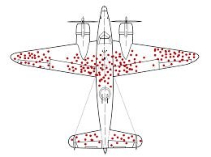

# [Ch10: The Rational Mind](cog-sci.md)

### Dual Systems Processing Model

- **System 1: Quick Decisions**
	- Gut reaction
	- Ex: Judging distance of an object, making a disgusted face, driving on a extremely familiar road.
- **System 2: Deliberate**
	- Conscious decisions
	- Ex: **filing taxes**, walking faster than your usual walking speed.

> This is all well and good, and can be very helpful in most cases. However, *errors* can occur when we use system 1 processing in places where we should have used system 2 instead.

---
For example: If it takes 5 machines 5 minutes to create 5 widgets, how long does it take 100 machines to make 100 widgets?
- Your system 1 will try to tell you that the answer should be 100 minutes, even though it really isn't. It is only after deliberating the question will you find that the answer is actually 5 minutes.

---

**Heuristics** - Rules of thumb. They are cognitive shortcuts. Judgement Heuristics Help us reduce complexed calculations.

### Heuristics

- **Representativeness  Heuristics**: The probability that one thing originates from something else.
	- When one thing closely resembles another, the representative heuristics tells us that these two things are closely related.
	- Ex: Steve is neat and tidy and likes to keep things very orderly and organized. If you were to guess, is Steve a airline pilot, a librarian, or a athlete?
		- **Most people** would guess a librarian in this situation, because we closely relate librarians with organization.

> **Base rate:** Due to us relying on a shortcut, we are not responsive to changes in **base rates**.

---

#### Gambler's Fallacy

- Misconception about how probability works.
- If there is a deviation in the chance, there will be a deviation in the other direction to even out.
- However, the issue is, every time a coin is flipped its 50/50 for heads or tails.

> Check out [Cog Decision: Probability](../cog-decision/probability.md#gamblers-fallacy) or [Cog Decision: Heuristics and Biases](../cog-decision/heuristics-biases.md#gamblers-fallacy).

---

**Availability Heuristics** - How people access the probability of something by how easily they are able to think of.
- However, just because something is easy to think of does not mean it is more probable...
- Ex: Are there more words that start with *k* or words that have *k* as the third letter?
	- If you thought more words start with *k*, you are wrong. The only reason you would think that is because it is a lot harder for us to think of those words in our memory, and its much easier to think of words that start with *k*.
- Ex: Plane crashes are so infrequent but because we see it on the news so often, we think of it as happening more often than they actually do.

> [See here](../cog-decision/heuristics-biases.md#the-availability-heuristic) for more information.

**Anchoring Heuristics** - Not really a rational underlying assumption. We are adjusting our estimates based on a initial estimate and a number range.
- Ex: When first asking "`Is a german car more or less expensive than $100,000?`" and then asking "`Is a german car more or less expensive than $20,000?`", the estimate is more likely to be closer to $100,000 when it should have no effect on the actual estimate.

> [See here](../cog-decision/heuristics-biases.md#anchoring-and-adjustment) for more information.

---

### Bounded Rationality

- We are semi-rational, but we're only irrational in predictable ways.
- Rational **enough** to get by.
- What is the most rational we can be without spending too much effort.
- The ability to make decisions quickly, even though not very accurate, helps maximize our efficiency.

---

**Gaze Heuristic** - The ability to coordinate the gaze angle with an object falling and you moving toward the object in order to arrive at the object at the correct time.

---

### Logic

First, what is logic (not the rapper)??
- Propositional logic is a way of representing ideas to test their validity.
- All about da **form**, but not the content.

#### What does Propositional Logic Contain?
- Propositions and logical operators. 
	- Propositions are true or false statements.
- Logical operators be like (^, v, ¬, →)

> For more on Propositions, go to [Discrete](../discrete-1/discrete-1.md#propositional-logic).

---
**To Make Decisions**, we need to make judgements about the options we have.
- We decide based on **epistemic** (rational beliefs) and **practical** (rational desires)
- *Epistemic Beliefs*: Consistent and accurate beliefs
- *Practical Rationality*: Choosing actions to achieve your goals
- When we don't have these rationalities, we turn into "money pumps".

> Some people believe that evolution selects for practical rationality, not epistemic. However, others believe both are necessary for survival.

---
###### Money pump
-*"money pumps"* - A pattern of intransitive or cyclic preferences causing a decision maker to be willing to pay repeated amounts of money to have these preferences satisfied without gaining any benefit.
	- Ex: The marketplace sells only apples and oranges. An apple and an orange cost a dollar each. **Bob** has $2. Bob prefers *an orange over that 1 dollar*, but *apples over an orange*, and *$1 over the apple*. However, the market has only orange left, and there is someone fighting with Bob for that orange. So, Bob buys the orange for `$1.10`. Then, someone willingly trades Bob a apple for that orange, and because *Bob prefers apples to oranges, he accepts*. Then, someone comes along and wants to buy the apple for a dollar. Because Bob prefers *$1 over an apple* he also accepts.
		- What is Bob, *aside from an idiot*? Ans: A money pump.

---
### Survivorship Bias
- The skewed perception by interpreting data of only the things that survived.
- Ex: War planes with diagrams of where the bullets most often hit. 

- Whilst some people may think the places where the most bullet marks were is where the plane needs the most reinforcement, it actually should be the areas that have no marks.
	- This is because those were the ones that weren't able to make it back, which means those are the most crucial to the flight of the plane.

### Computationally Intractable
- impossible to calculate (like possible games of chess or possible routes of 25 stops)
- Applies to the frame problem (how to computers deal with uncertainty and consequence?)

### Cheater Detection
- Evolution equipped us with a special cheater-detection module.
- This module searches for information that could reveal whether a given individual has cheated in a specific social exchange.