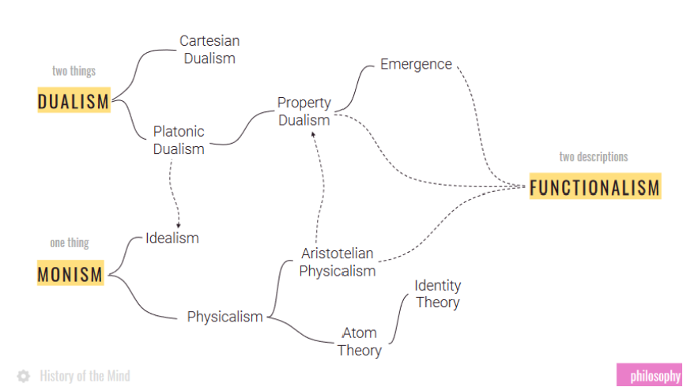
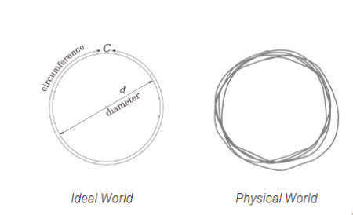
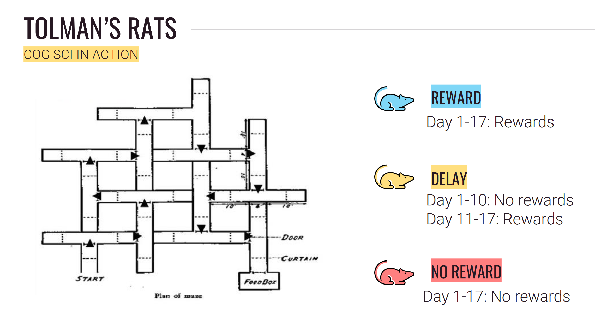
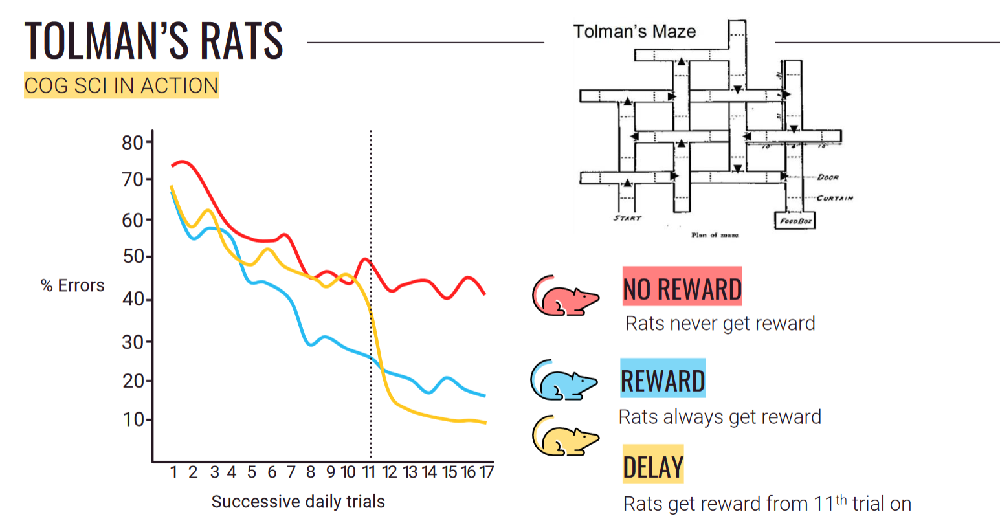
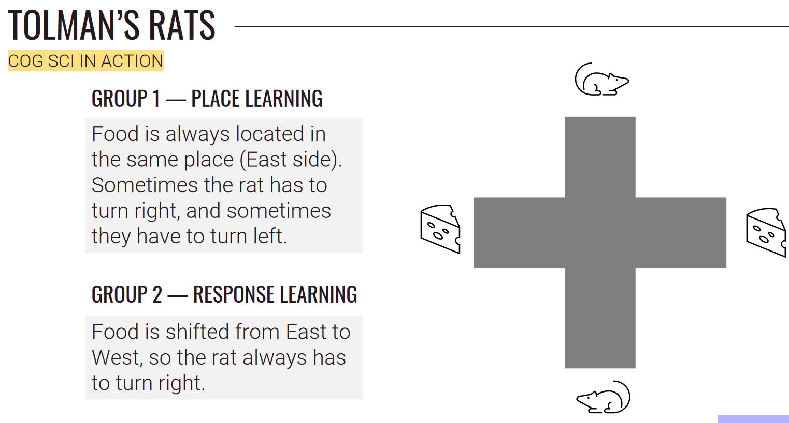
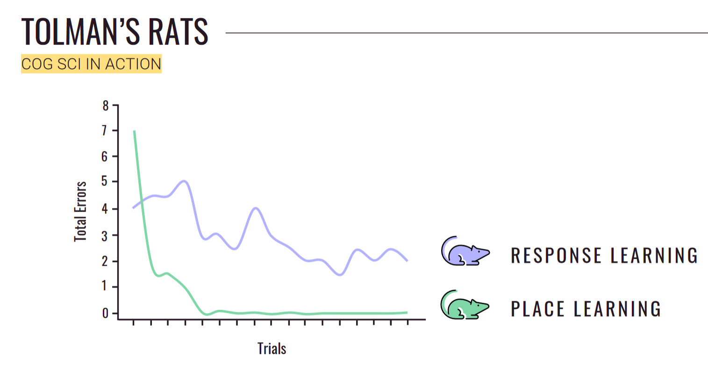

# [Ch2: History of the Mind](cog-sci.md)

### The Evolution of the two Beliefs

### Dualism

#### Platonic Dualism:

- Theory of Forms
- We are chained to the physical world where nothing is perfect.
- We have access to all knowledge in the world, and if we just *think* hard enough and in the right way, we can access the ideal world and learn anything.

#### Substance Dualism (Rene Descartes):

- Minds and bodies are made of different substances (Like literally.)
- He believed the mind was superior to the body.
- Influenced by Christianity.

**Res Extensa**: This is the physical stuff, the tangible stuff.

**Res Cognitans**: This is still a substance, like the thinky stuff, just a substance you can not see or touch.

Descartes came to this Substance Dualism through the:

---

#### Conceivability Argument:

- I can conceive hat I, a thinking thing, exist without my extended body existing.
- Anything I can conceive of is logically possible.
- If it is logically possible for X to exist without Y, then Y is not identical to Y. (If Superman (X) and Clark Kent (Y) are identical, if I kill superman (X) then Y better not show up)
- I, a thinking thing, am not identical with my extended body.

---

#### Problems with Dualism

**Dualism says what the mind is *not:***
- The mind is *not* the brain.
- The mind is *not* the body.
- The mind is somehow *different* and *separate* from the physical world.

**However**, if they are different and separate, how do they interact with each other?

---

#### Property Dualism:

**Biological Naturalism:**
- Mental state is what the brain does.
- Mental states are not identical to brain states, but they are causally reducible to brain states.

**Epiphenomenalism:**
- Mental states are caused by brain states, but they do not cause anything. They are causal dead ends.
- The mental states do not make you do anything, but whatever brain state causing your mental state makes you do things.

*Related: Illusionism*

**Panpsychism:**
- Mental states are an inherent property of matter or the organization of matter.
- There is like a atomic consciousness particle that everything is built out of and you can only get human consciousness with specific combination of these atomic consciousness particles.

---

### Monism

#### Idealism:

- Everything in the universe is mentall or mentally-constructed.

	*Reality is an illusion*
	
	*Maybe the universe itself is a pervasive consciousness that connects all minds and souls together*

(This is the first stop of Monism because it describes the world as all just a illusion of your senses. It's all just mental states, and nothing is *real*)

#### Physicalism

- Everything in the universe is *physical*

*Democritus'* Atom Theory:
- Everything in the unvierse is composed of *atoms*.
- The property of matter is the property of the atomic units they are made of.

*Modern* Identity Theory:
- Mental states are brain states.
- Being happy means you're in the happy brain states. (That's it)
- This is not compatible with Multiple Realizability (cus you can't have multiple Physical states corresponding to the same mental state when something like "happy" is tied to your brain state and we do not have the same brain as a dog)

*Aristotle*: "The distinction between mind and body is a distinction between **form** and **matter**.

---

#### Reductionism

"I do not deny that conscious mental states and events cause behavior, nor that they may be given functional characterizations. I deny only that this kind of thing exhausts their analysis." - **Thomas Nagel**

- Any reductionist program has to be based on an analysis of what is to be reduced.
- If the analysis leaves something out, the problem will be falsely posed- It is useless to base the defense of materialism on any analysis of mental phenomena that fails to deal explicitly with their subjective character.

**Thomas Nagel's** argument:

- You can imagine being a bat and doing bat things, but you are just imagining *you* being a bat, and not a *bat* being a bat.
- You have no idea what they feel, what they think and what they face daily.
- Why do you not know? There's something that's missing...

**Qualia**: An unfamiliar term for someting that could not be more familiar to each of us - the way things seem to us. (Or how it **feels** to be you)

	Quantifying Thought:
	Qualia and the Mind-Body problem leaves us in a pickle.
	How can we bridgeg the subjective-object divide and quantify thought?
	How can we get at cognition?
	
#### The human mind is a black box.
- We can put in a stimuli, and see the response, but we do not know what is going on inside the black box.

---

"A purely objective experimental branch of natural science. Its theoretical goal is the prediction and control of behavior. Introspection forms are not an essential part of its methods, nor is the scientific value of its data dependent upon the readiness with which they lend themselves to interpretation in terms of conscious." - John B. Watson

- We need to focus on what we observe.
- Introspection is not going to get us to an answer.
- Interested in what can be measured.

---

### Behaviorism
- The view that a mental state is a disposition to some behavior.

**Methodological Behaviorism**
- Science should focus on observable, measurable entities and behaviors.
	- Watson, Hull, Tolman
	
**Radical Behaviorism**
- Internal mental states exist but they are unimportant and not very explanatory.
	- B.F. Skinner

- "Maybe those internal states exist but who cares?"
	
**Analytical Behaviorism**
- Mental concepts refer to behavioral tendencies.
	- Ryle
	
- Mind states do not actually exist. Those are BS. The feeling of "happy" is really just referring to all the behaviors that are associated with happy.

---

### Functionalism

(Mental states defined by functional profiles (computational levels))

**It goes against Behaviorism**
- Mental states are internal states.

**It goes against Identity Theory**
- Mental states multiply realizable and that mental states are not identical to single unique physical states.

- Behaviors can occur without conditioning, neural mapping doesn't explain mental states because it's not known how it relates (unknown relationship between neural circuits + experience).
- Much more useful to explain things in terms of mental states. (ex: dialed 911 because you wanted to get help is a non-conditional behavior. You were not trained to do that through conditioning. Specific neural circuits are also unhelpful to study.)

### Timeline of the Cognitive Revolution

**1930** - E.C. Tolman and Honzik
- Introduction and removal of reward, and maze performance in rats.
- Wanted to figure out how animals learned.
- Beginning of the end for behaviorism.

**1948** - Claude Shannon
- Information Theory : A way of quantifying communication of information.

**1950** - Alan Turing
- *Computing Machinery and Intelligence*
- Turing test

**1956** - George Miller
- *The Magical Number Seven, Plus or Minus Two*
- The magical number seven refers to how much you can keep in your short term memory.
- George Miller quantified memory (literally) into what **number**.

**1957** - Noam Chomsky
- *Syntactic structures*, creates modern generative linguistics.
- He did some interesting work and came up with a metric for measuring the complexity of different computations.

---

#### E.C. Tolman's Rats

- Rats put into the maze
- They are divided into 3 different categories.

- The rats that never got rewards do no better than chance.
- The rats that always got a reward get better with time, ending at around 20% of an error rate.
- The rats that only got a reward after a delay, immediately got way better.
	- They were learning that entire time.
	
**This experiment proved that you can still learn things when you are not being rewarded.** 

#### How are the rats navigating the maze?

(What is the algorithm for the rats to solve the maze.)

- *Response Learning* - Learning by remembering a sequence of movements.
- *Place Learning* - Learning by remembering the spatial layout of the maze.

- Rats are not able to remember to always turn right.
- If you move the food, they do not know where the food is.

---