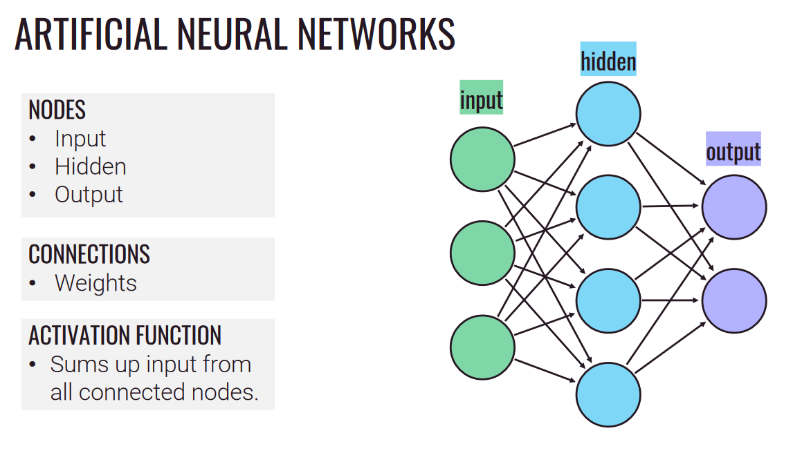
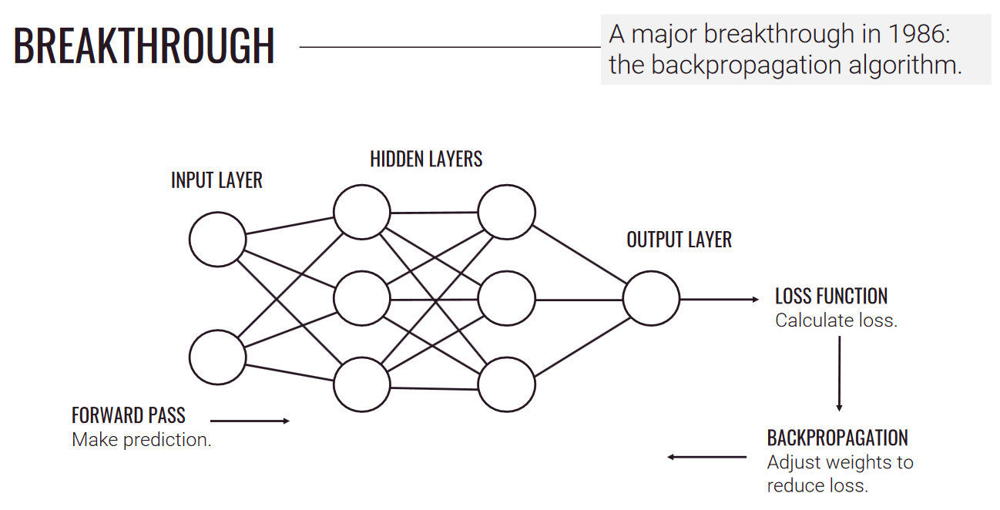

# [Ch4: Artificial Minds](cog-sci.md)

#### Artificial Intelligence
- A Turing machine is a symbolic processor that can compute anything.
- Does this mean everything a human mind can do, a Turing machine can do?
- Can computers have minds?

---

### History of Artificial Intelligence

**1936** - Alan Turing : Turing Machine

**1949** - Donald Hebb : Neural learning

**1951** - Marvin Minsky : First neural network

(*Between this time was the Dartmouth Conference when the term Artificial Intelligence was coined)

**1958** - Mark I Perceptron

**AI Winter 1** - Connectionism abandoned

**1986** - Rumelhart, Hinton & Williams : Backpropagation algorithm

**AI Winter 2** - Can machines think?

**2010** - Deep Learning Revolution : IBM Watson AlphaGo

---

#### The Frame Problem
- How can AI deal with uncertainty and irrelevance?

- Problem: The set of possible consequences is immense!

### The Great Debate

(Classical Computation VS Connectionism)

**Computational Theory of Mind**
- The algorithm are what matter -- and a symbolic processor like a Turing machine can compute *anything*.

**Connectionism**

- The brain is nothing like a Turing machine.
- We need a different architecture, something that imitates the architecture of the brain.

#### Reconstructing Cognition

**Maybe instead of these:**
- Thoughts
- Images
- Memories
- Language

**We just need:**
- Neurons

*if we just feed the AI with a load of data, maybe it'll just figure it out itself.* - **Emergence**

---

#### Hebbian Learning
- Neurons fire in all-or-nothing pulses.
- Neuropsychologist Donald Hebb formulates a rule to explain how neurons enable learning.
- Neurons that fire in synchrony strengthen their connections.

#### Mark I Perceptron
(First hardware implementation of a Perceptron.)

- "The embryo of an electronic computer that [the Navy] expects will be able to walk, talk, see, write, reproduce itself and be conscious of its existence."
- "It fell slightly short..."
- The Mark I Perceptron was built for image recognition: 400 photocells connected randomly to "neurons".

#### First AI Winter
- In **1969**: Marvin Minsky and Seymour Papert publish the book *Perceptrons*.
- They proved mathematically that there are several classes of computations that single-layer perceptrons cannot learn, including XOR.

- **Connectionism is abandoned**

---

#### In 1986...
- Major breakthrough with the Backpropagation algorithm.

----

### Three Types of Learning

#### Unsupervised Learning
- No training
- Clustering
- Association
- Dimensionality Reduction

#### Supervised Learning
- Training data plus human supervision.
- Classification
- Regression

#### Reinforcement Learning
- Using principles from behaviorism.
- Exploration of rewards.

---

#### Evaluating Connectionism

- Connectionism can do a lot, but on a core level it really is just statistics.
- Is there a limit to what neural networks can do?

**Strength**:
- Provides an attractive account of *concepts*.
	- Think about it, what is a chair?
- Graceful Degradation - Even if you take a few things away, the Connectionism algorithm can still perform pretty well.

**Weaknesses**:
- Unable to perform one-off learning.
	- Humans are good at learning from single examples. Neural networks typically require huge numbers of parameters and massive data sets.
- Mere association?
	- Can connectionism models truly master abstract rules or are they just learning associations?
	- Connectionism models sometimes have difficulty generalizing performance from training set.
- Lack of systematicity?
	- Thoughts are systematic.
	- If you can think 'John loves Mary', you can also think 'Mary loves John' even though they have different meanings.
	- There are predictable patterns in the thoughts we can understand.
- Lack of constitution.
	- Thoughts are constitutive. A and B are constituents of A&B.
	- Mortar & Pestle (but does not know they are two separate objects)

---

### Language of thought
- Thoughts are composed of language-like components with compositional structure.
- To what extent is your thoughts symbolically structured.

### The Great Debate
(Classical Computation vs Connectionism)

**Implementational Connectionism**

- Connectionism might be the implementational way to realize classical computational algorithm.

**Radical Connectionism**

- Reject classical computing and seek to eliminate the idea of symbolic processing completely and only use connectionist networks.
	
---