# [Assembly](comp-arch.md)

Human readable machine code is very limited in what it can do. *There is not much control flow*.

---

**Choice of what to experiment with**

MIPS (RISC-V), ARM, x86-64

### Assembly Instructions
- It's the bitstream representation of the instructions that tell the hardware what to do.
- These instructions and operations are basically being described as *numbers* being codified into machine language.
- It performs `fetch`, `decode`, `execute`, `memory`, `writeback`

### Preview of Microarchitecture

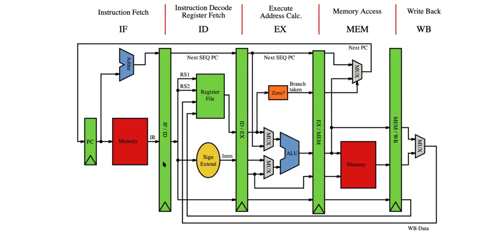

### C Code to Assembly
- You can use the iLab to generate Assembly code from your original C code.
- `gcc -S example.c`
  - This generates an intermediate output.
- Typically, you won't be expected to know how to write assembly code, but we study Assembly in order to understand how programs turn into instruction streams that are actually executable.

### Assembly Characteristics: Operations

- Performs arithmetic function on register or memory data.
- Transfer data between memory and register
  - Load data from memory into register
  - Store register data into memory
- Transfer control
  - Tell the program to break away from its natural sequential progress of the code.
  - Changes where the PC (Program Counter) points.

### Assembly Practice

Example:

```C
// This is the C code to swap two characters.
void swap(long* a, long* b) {
	long* t1 = *a;
	long* t2 = *b;
	*a = t1;
	*b = t2;
}
```

In assembly:

```assembly
swap_c:          		# This is a label, telling the hardware where the function starts.
	movq (%rdi), %rax    # movb means to movq something from a source to a destination
	movq (%rsi), %rdx	# The parenthesis tells the hardware it's a memory address, and you are deferencing it.
	movq %rdx, (%rsi)
	movq %rax, (%rdi)
	ret     			# The ret tells the hardware the function is over

```

**Taking a closer look**
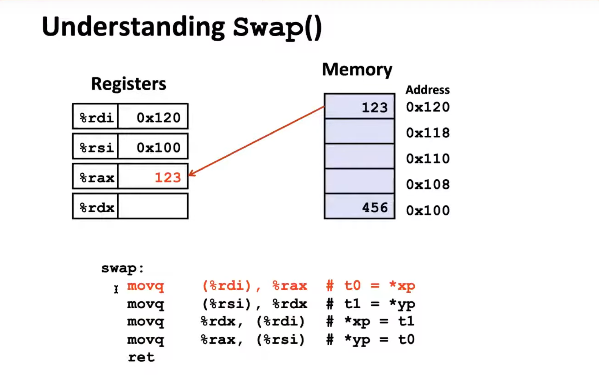

From Professor Huang's Lectures:

<iframe width="560" height="315" src="https://www.youtube.com/embed/PjNcmzv9gAo?si=JhUXPV6vTsDdMoG0&amp;start=2229" title="YouTube video player" frameborder="0" allow="accelerometer; autoplay; clipboard-write; encrypted-media; gyroscope; picture-in-picture; web-share" allowfullscreen></iframe>

### Data Size and x86-64 Registers
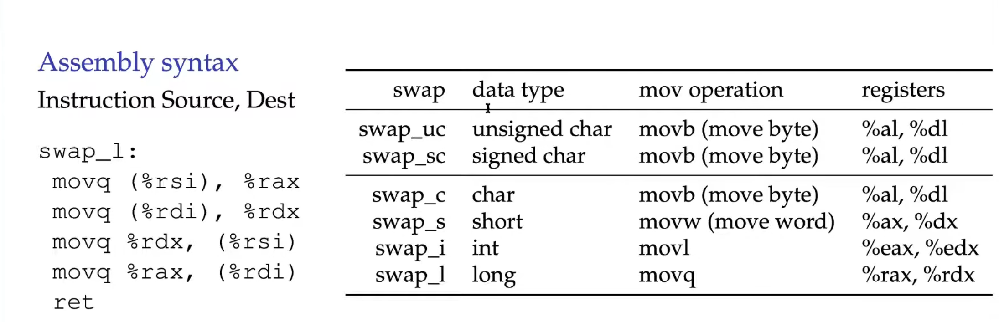

### Simple Memory Addressing Modes
- **Normal** (R) Mem[Reg[R]]
  - The Register R specifices the memory address.
  - Almost like pointer deferencing in C.

	movq (%rcx), %rax

- **Displacement** D(R) Mem[Reg[R]+D]
  - Register R specifies the start of memory Region
  - Constant displacement D specifies offset.
  - Like C Pointer arithmetics

	movq 8(%rbp), %rdx
	- Basically, *deference* the memory address of %rbp, add 8 to that memory address, and get the value at that new address.
	- Then, move that memory to the %rdx register.


### Complete Memory Addressing Modes

#### Most General Form
- D(Rb, Ri, S) Mem[Reg[Rb]+S*Reg[Ri] +D]
  - D: Constant displacement, can be 0, 1, 2, or 4 bytes.
  - Rb: Base register: Any of 16 integer registers.
  - Ri: Index register: Any except for **rsp**
  - S: Scale of 1, 2, 4, or 8
  
Ex: movq 4(%rdx, %rcx, 2), $rax
		
	So when it looks like this, the S (scaling factor is applied to the R2)
	Then, add the memory address of R1 with the new R2, then add your final displacement to this value.

	If %rdx contained 0x1000 and %rcx contained 0x0200:
	4(0x1000 + (0x0200 * 2)) = 0x1404
	0x1404 is the memory address you will look at.

### Address Computation Instruction

#### `leaq SRC, DST` (Load effective address)
- SRC is address mode express
- Set DST to address denoted by expression.

#### Uses
Computing addresses without a memory reference.
- E.g. p = &x[i];

Computing Arithmetic expressions of the form x+k*y
- Where k = 1,2, 4, or 8

Example of `leaq`:

	leaq (x, x, 2), %rax
	- This will become x + 2x = 3x, which is just multiplying your x value by 3.

---
### Some Arithmetic Operations

**`addq SRC, DST` 	DST = DST + SRC (Add)**\
**`subq SRC, DST` 	DST = DST - SRC (Subtract)**\
**`imulq SRC, DST` 	DST = DST * SRC (Multiply)**\
**`salq SRC, DST` 	DST = DST << SRC  (Shift left)**\
**`sarq SRC, DST` 	DST = DST >> SR (Shift right)**\
**`shr SRC, DST` 	DST = DST >> SRC  (Shift right)**\
**`xorq SRC, DST` 	DST = DST ^ SRC  (XOR)**\
**`andq SRC, DST` 	DST = DST & SRC (AND)**\
**`orq SRC, DST` 	DST = DST | SRC (OR)**

---

### Calling Convention: Argument Registers
- The caller uses registers to pass the first 6 arguments to the callee.
- **RDI**:
  - This register is typically used for the first argument or pointer argument. It's also used to return integer values from functions.
- **RSI**:
  - This register is typically used for the second argument or pointer argument. It's also used to return integer values from functions.
- **RDX**:
  - This register is typically used for the third argument or pointer argument. It's also used to return integer values from functions.
- **RCX**:
  - This register is typically used for the fourth argument or pointer argument. It's also used to return integer values from functions.
- **R8 and R9**:
  - Additional integers or pointer arguments are passed in R8 and R9 respectively.

**Ex:**

`int foo(int x, char c)`
- x is passed in RDI
- c is passed in RSI (This is passed in still because characters can be represented as integers.)

---

Note:
- All remaining arguments are passed on to the stack in reerse order so that they can be popped off the stack in that order.
  - For example: If we have an *7th* int and a *8th* int, we push the *8th* onto the stack first and then push the *7th* onto the stack. 
  - This allows us to use the *7th* argument first.
- The callee is responsible for preservin the value of registers `%rbp`, `%rbx`, and `%r12-r15`, as these registers are owned by the caller. Teh remaining registers are owned by the callee.
- The callee places its return value in `%rax` and is responsible for cleaning up its local variable as well as for removing the return address from the stack.
- The `call`, `enter`, `leave`, `ret` instructions make it easy to follow this calling convention.

---

## Machine Level Programming II: Control

### Control Flow
- Control flow is a *change* in the sequential order of instructions.
- This is done by changing the PC (Program Counter) to point to a different instruction. (*function calls pass control to the callee*)

### Processor State (x86-64, Partial)
- So we know that the *ALU* performs `+, -, *, /, %` operations.
- In order to do these operations, it has a small memory called the *operand* memory.
- TODO: ???

### Condition Codes (Implicit Setting)

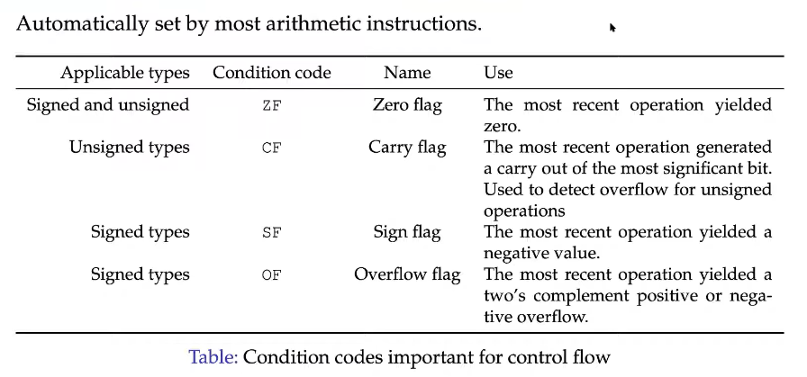
- Single bit registers
  - CF - Carry flag (For unsigned)
  - SF - Sign flag (For signed)
  - ZF - Zero flag
  - OF - Overflow flag (For signed)
- Implicitly set (think of it as a side effect) by arithmetic operations
- This is **not** set by `leaq`

### Condition Code (Explicit Setting: Compare)
- Explicit Setting by Compare instruction
  - `cmpq` Src2 , src1
  - Computes `src1 - src2` and sets condition codes accordingly.

**All the different cmp instructions for Assembly**

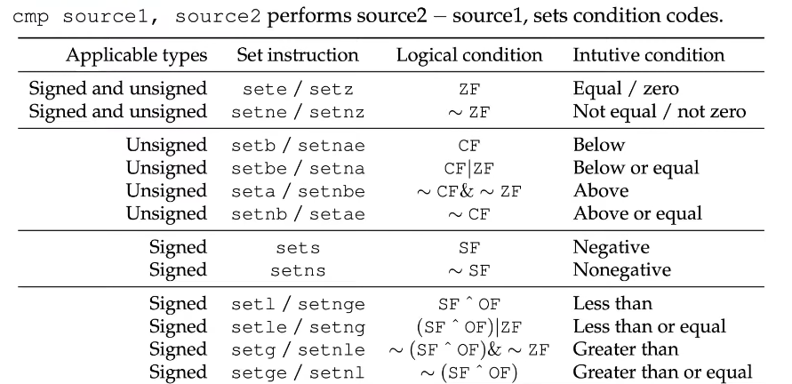

- `CF` set if carry out from most significant bit (unsigned comparisons)
- `ZF` set if src1 = src2
- `SF` set if (a-b) < 0 (signed comparisons)
- `OF` set if two’s complement overflow (signed comparisons)
#### Testing for Equality

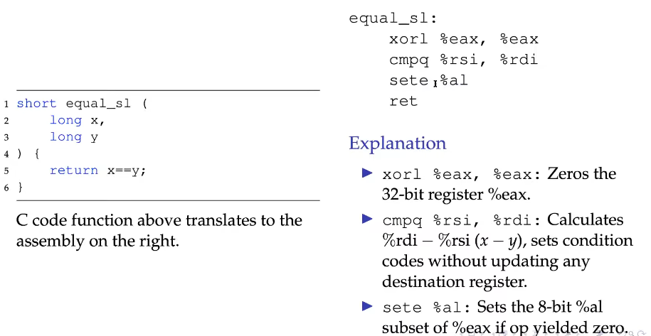

#### Example

```C
short below_ul (
	unsigned long x,
	unsigned long y
) {
	return x<y;
}
```

In C code, this is just a comparison between x and y. When translated to Assembly...
```ass
below_ul:
	xorl %eax, %eax
	cmpq %rsi, %rdi
	setb %al
	ret
```

How does this code actually test if `x < y`?
- It uses the condition codes...

Here's how:

> Pretend `x = 127` and `y = 128`
> Then the `cmpq` operation compares by doing 127-128...
> This gives -1, which sets the `CF` flag for unsigned values. (`CF = 1`)
> Then, the CF flag gets returned.
### Condition Code (Explicit Setting: Test)
- Explicit Setting by Test instruction
  - `testq` src2, src1
  - Computes src1 & src2 and is like computing Src1&Src2, but it does not store the result anywhere. (& is bitwise &)
- Sets condition codes based on value of Src1 & Src2.
- ZF set when Src1 & Src2 = 0
- SF set when Src1 & Src2 < 0

### Reading Condition Codes
- Using SetX instructions:
  - We can set low-order byte of destination to 0 or 1 based on combinations of condition codes.
  - Does not alter remaining 7 bytes.

### Branch Instructions

 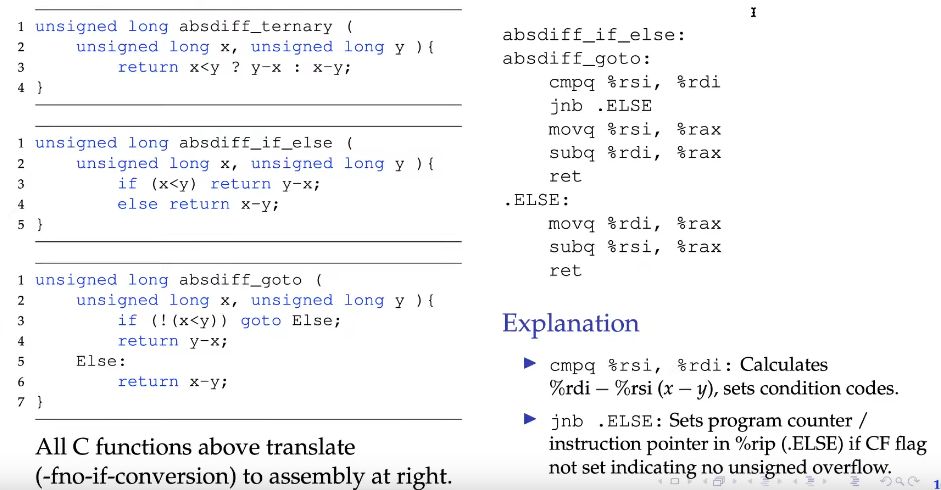

## Assembly: Loops, Switches, Functions

- for loops, while loops and do-while loops do not actually exist in C, but are just using the same `goto` statement if statements use.

The following is an example of the `goto` in C.
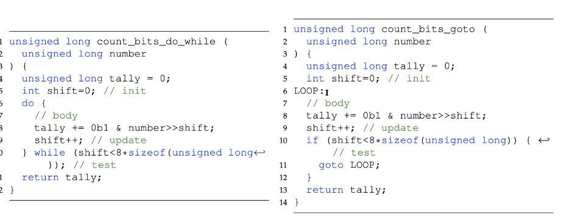

Then, in Assembly...

```assembly
count_bits_do_while:
	xorl %ecx, %ecx    # Init (int shift = 0;)
	xorl %eax, %eax    # Init (unsigned long tally = 0;)

.LOOP:
	movq %rdi, %rdx    # number
	shrq %cl, %rdx     # right shift (number>>shift)
	incl %ecx          # shift++;
	andl $1, %edx      # 0bl & number>>shift;
	addq %rdx, %rax    # tally += 0bl & number>>shift
	cmpl $64, %ecx     # shift<8*sizeof(unsigned long) (*** This will cmp based on the condition code outlined above. (return 0/1 which is passed to the next statement.))
	jne .LOOP          # goto LOOP (if CF is set, stop, else, keep going)
	ret                # return tally
```

---

### Switch Statements in Assembly

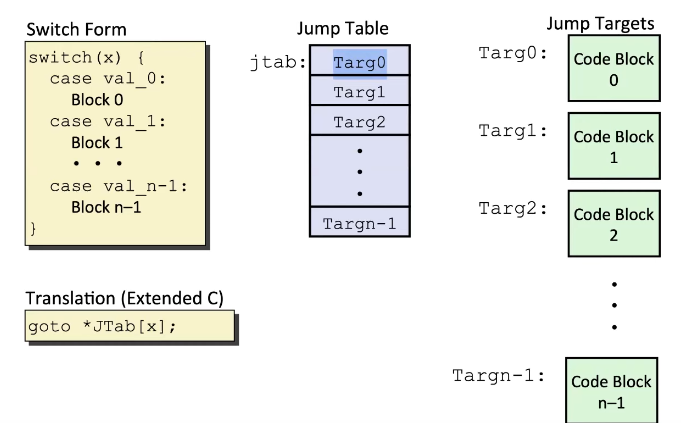
- In Assembly, switch statements get compiled into something called a "jump table". The jump table will contain the *jump targets*, which is where the different code blocks will be contained.

#### Example

```C
long switch_eg(long x, long y, long z) {
	long w = 1;
	switch (x) {
	...
	} return w;
}
```

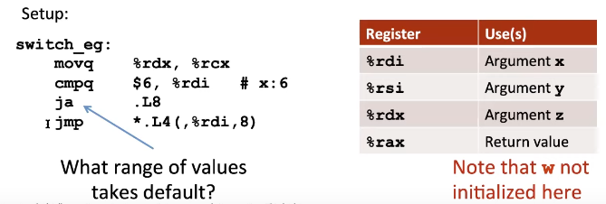

## Procedures and Function Calls: Transferring Control

---
#### Stack Based Languages
- **languages that support recursion**
	- e.g. C, Pascal, Java
	- Code must be *reentrant*, which means there can be multiple simultaneous instances of the same function.
- Need some place to store state of each instantiation
	- Args
	- Local variables
	- Return pointer
- **Stack discipline**
	- State for given instruction needed for limited time
		- From when called to when returned
	- Callee returns before caller does
- Stack allocated in **frames**
	- State for single procedure instantiation

### Stack Frames

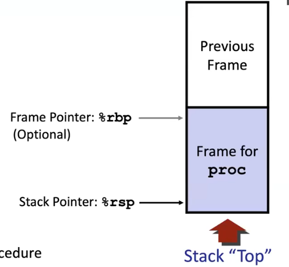
- **Contents**
	- Return information
	- Local storage (if needed)
	- Temporary space (if needed)
- **Management**
	- Space allocated when enter procedure
		- "*set-up code*" 
		- Include push by `call` instruction
	- Deallocate when `ret`
		- "Finish" code
		- Includes pop by `ret` instruction

>  **Note**: The `%rsp` register is a special register that always points to the top of the stack.
>  The `%rbp` register is optional, and points at where the stack frame ends.

> Stack Frames Do **not** have to be the same size. It always depends on how many variables each function uses.

### Stack Instructions: `push` and `pop`

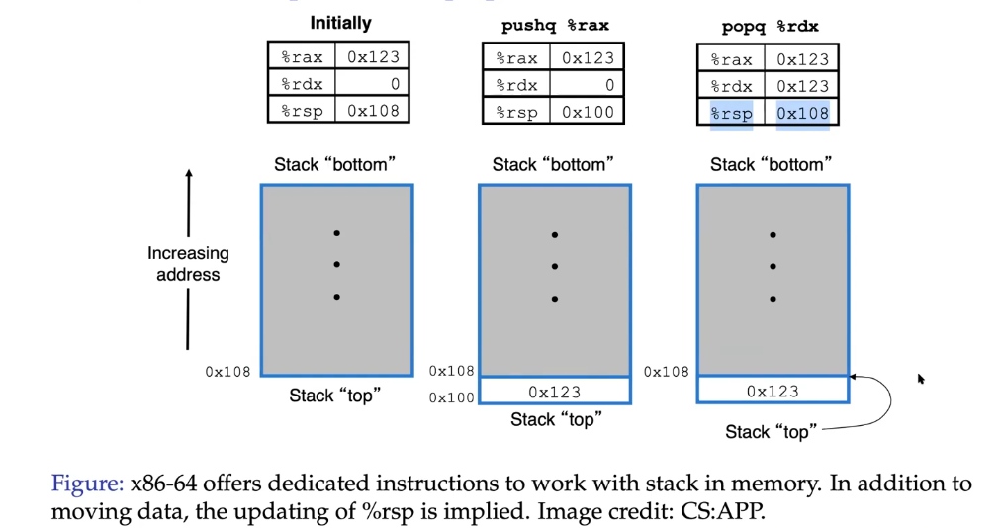
- When we call the instruction `pushq %rax`
	- We are telling the program to push the value in the `%rax` register onto the top of the stack. (*0x123*)
	- The stack will now have *grown downwards*
- When we call on `popq %rdx`
	- We are telling the program to pop the value at the top of the stack, `%rsp` tells us where the stack is at, and then store that information in the `%rdx` register.

> The **q** at the end of `pushq` and `popq` stands for *quadword*, which means it increments by 8-bytes, and decrements by 8-bytes.

---

### Procedures and Function Calls

To create the abstraction of functions, we need to:
- Transfer control to the function and back
- Transfer data to function (parameters)
- Transfer data from function (return type)

> Each time there is a transfer of control, we can easily see how it works, but in Assembly requires an update of the instruction pointer.

---
#### CPU and Memory in Support of Procedures and Functions
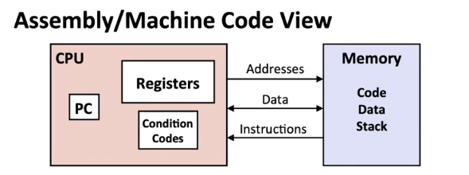

**States in the CPU**
- The `%rip` register is that special instructions pointer, or "Program counter"
- `%rsp` as stated before, is the stack pointer, which always points at the top of the stack.

**Relevant States in the Memory**
- The stack

---
#### Procedure for `call` and `ret`

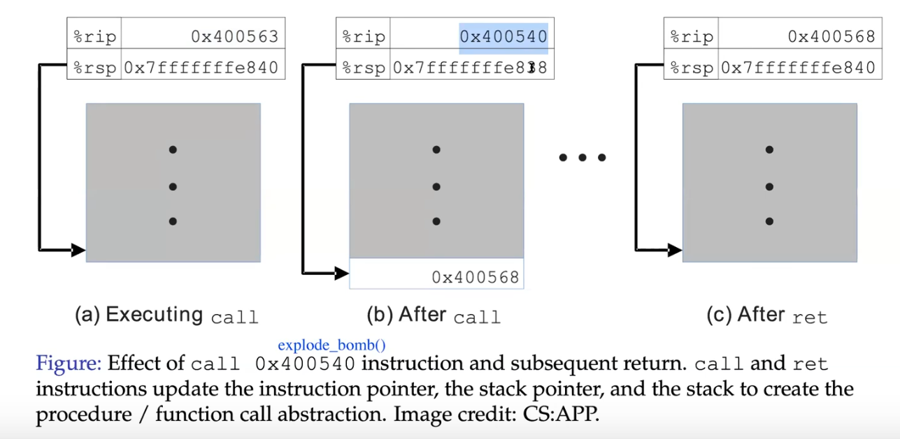
- When calling on a function, the `%rip` register will store the new address of the function that is trying to be run.
- However, the previous address of the `%rip` register can't just be forgotten.
	- So, that previous address gets stored onto the stack as the "bottom" of the stack frame.
### Register Saving Conventions

- **When procedure `yoo` calls `who`**:
	- `yoo` is the *caller*
	- `who` is the callee
- **Can registers be used for temporary storage?**
- 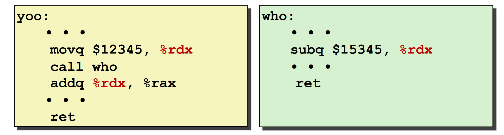

	- Contents of register `%rdx` overwritten by `who`
	- This could cause some trouble so we need to do something!
		- Need some coordination.

### x86-64/Linux Stack Frame
- **Current stack frame** ("Top" to bottom)
	- "Argument build": parameters for function about to call.
	- Local variables if they can't be kept in registers
	- saved register context
	- old frame pointer (*optional*)
- **caller stack frame**
	- Return address
		- Pushed by `call` instruction
	- Arguments for this call

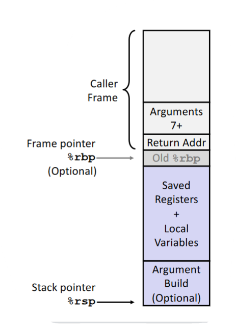

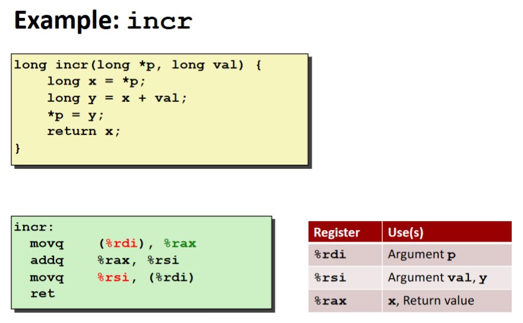

---
> Note: The register `%rax` is typically where the program looks for a return value.
> For 32-bit systems, this will be the `%eax` register.
---
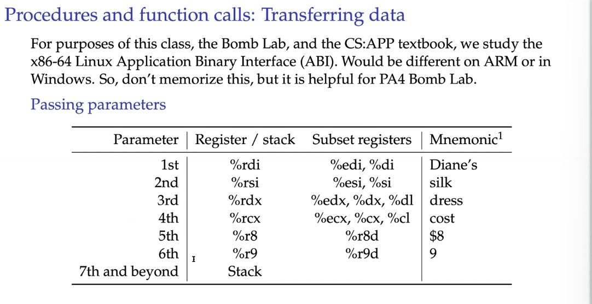

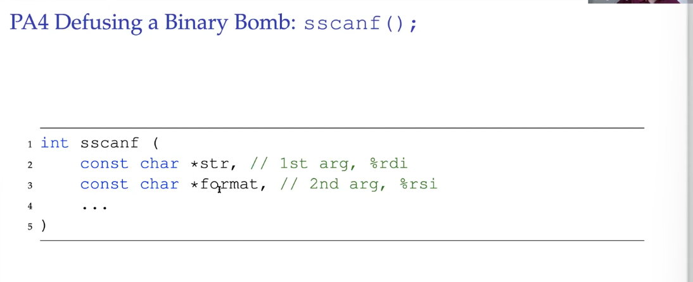

---

