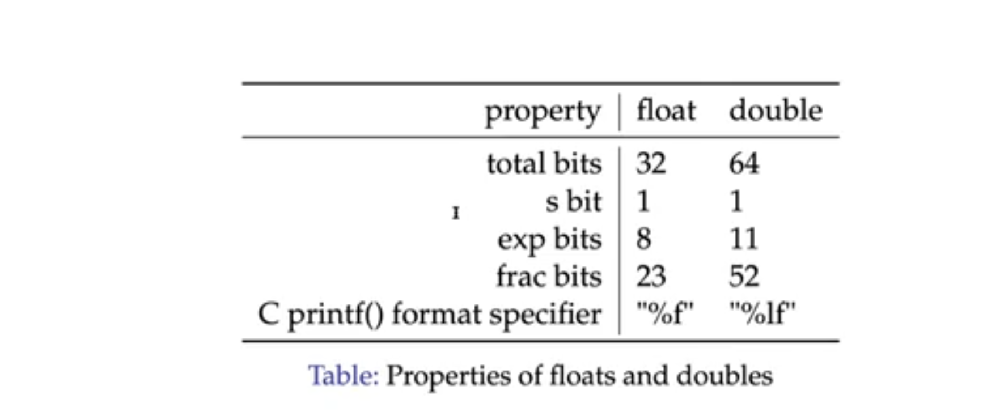

## Exam Format
- Not on Canvas
- Not open-note
- 60% on post-midterm topics
- Combination of short-answer, long-answer questions, **no multiple choice**

## Topics List
- VNM Model
- Compilation Method for C
- Memory Structure of C
- C Basics
- **Data Representation in Memory**
	- Basic mem. organization
	- Bits & Bytes
	- Binary, Hexadecimal
	- Representing unsigned ints, signed ints (all of em)
	- Representing text
	- Endianness
- IEEE754 Notation
	- Floats (32-bit) and doubles (64-bits)
	- **Conversion to/from floating point and understand signing**
	- Know denormalized numbers as well, not as important
- x86_64 Assembly
	- Convert basic C/assembly snippets to and from the other language
		- If statements, loops, calling convention, switch statements (jump table)
- Caching
	- Understand the purpose of caching, the caching model
	- Understand how a memory address maps into a location in a cache.
	- Simulate cache accesses given a list of memory addresses

---

## IEEE754
- Established standard for floating point arithmetic.
- There are two types of IEEE754 representations, normalized and denormalized. Both of these have different sizes for 32-bit systems as well as 64-bit systems. 
	- On a 32-bit system, the breakdown is **1 bit for sign, 8 bits for exponent field, and 23 bits for the *mantissa (Scientific Notational field basically)***. (Floats)
	- 64-bit system: **1 bit for sign, 11 bit exponent field, 52 bit fractional field.** (Doubles)

### To Convert A Number to IEEE754
- Take the number and represent it in binary (if negative just remove negative sign). (-500 -> 111110100₂)
- Take the binary representation and make it scientific notation. (111110100₂ -> 1.11110100 ✕ 2⁸)
- Apply the bias (bias = 2ⁿ⁻¹-1, *n is number of bits in the exponent field*) to the exponent (exp = E + bias = 8 + 127 = 135)
- Encode the bias in 8 bits. (10000111₂)
- Now put it all together. *The mantissa has an implied 1 in front.* (1_10000111_11110100...₂)

### To Convert IEEE754 to Number
- First unpack sign bit. (1_10000111_11110100 → sign bit = 1, **negative**)
- Next, unpack the exponent field. (10000111 = 135)
- Taking that number, remove the bias. (135 = E + bias. 135 -127= 8)
- With our exponent field unveiled, use it to convert the scientific notation to regular notation. (1.11110100 → 111110100)
- Next, find value of this and reapply the sign bit and you have your answer! (-500)

### Denormalized Numbers
- Denormalized numbers will **always** have a exponent field of all zeroes. (**E = 1 - Bias**)
- Fractional field is coded with an implied leading 0 instead.
- Cases:
	- Exp field all zeroes, frac field all zeroes: +0 and -0.
	- Exp field all 1s, frac field all zeroes: +∞ and -∞.
	- Exp field all 0s, frac field not zeroes: Numbers extremely close to 0. (2⁻¹²⁶)

## Assembly

### Registers

**Important Registers to Remember:**

- Storage registers:
	- `%rdi`, `%rsi`, `%rdx`, `%rcx`, `%r8`, `%r9`
	- `%rcx` C FOR COUNTER!!!
- Return register: `%rax` → 64-bit
	- Nested inside is the `%eax` register → lower 32-bits, `%ax` register → lower 16-bits
		- Nested inside the `%ax` register is two more registers, `%ah`, `%al` for higher 8 bits of `%ax` and the lower 8 bits.
- The storage registers are also divided into their 32-bit counterparts.

Need to know:

`mov` operations, `lea` operation, `xor` operation, `set` operations, `jmp` operation, `j_` conditional jump operations, `cmp` operation, `add`, `sub`

- Each of these operations can have a suffix attached to it...
	- `-b` : Byte, an operation on a single byte (char types)
	- `-w` : Word, an operation on two bytes (short types)
	- `-l` : Longword, an operation on 4 bytes (int types)
	- `-q` : Quadword, an operation on 8 bytes (long types)

The mov operation involves moving data from a SRC to a DEST. Ex: movl %e

## Caching

### Locality

The only reason why caching, and the ideal of laying out memory in a hierarchy works is due to the idea of locality. There are two distinct types of locality.

#### Spatial Locality

Spatial locality is the idea items close together in memory will be access in succession, and with a higher likelihood. 

Example of this is array accesses. This is the reason why cache block are even efficient.

#### Temporal Locality

Temporal locality is the idea that an item access will be accessed has a higher chance of being accessed again.

#### Review Session Questions

The variable **a** is an int pointer on the heap on a standard iLab system whose memory address is 