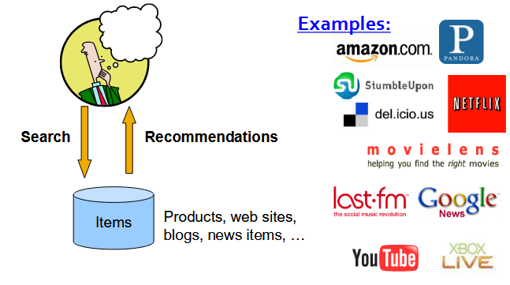

# [Recommender Systems](intro-ds)

## Recommendations

### Types of Recommendations
- Editorial and hand curated
	- List of favorites
	- List of "essential" items
- Simple aggregates
	- Top 10, Most popular, Recent Uploads
- Tailored to individual users
	- Amazon, Netflix, ...

### Formal Model

- `X` = set of *Customers*
- `S` = set of *Items*
- **Utility function:** $u: X * S \rightarrow R$.
	- `R` = set of ratings
		- `R` is a totally ordered set.
	- E.g., 0-5 stars, real number in `[0,1]`

## Gathering Ratings

### Explicit Feedback
- Ask people to rate items
- Doesn't work well in practice - people can't be bothered.

### Implicit Feedback
- Learn ratings from user actions.
	- E.g. purchase implies high rating.
- What about possible low ratings?

## Predicting Utilities

**Key problem:** Utility matrix `U` is *sparse*.

- Most people have not rated most items.
- **Cold Start:**
	- New items have no ratings
	- New users have no history
- **Four approaches** to recommender systems:
	- Content-based
	- Collaborative Filtering
	- Collaborative reasoning
	- Large Foundation Models

## Content Based Recommendations

**Main idea:** Recommend items to customer `x` *similar to previous items* rated highly by `x`.

- **Example**:
	- *Movie Recommendations:*
		- Recommend movies with same actors, director, genre, ...
	- *Websites, blogs, news:*
		- Recommend other sites with "similar" content...

#### Workflow
- Collect all the items that the user `x` has liked before.
- Create a *Item Profile*

#### Item Profile
- For each item, create an *item profile*.
- **Profile** is a set (vector) of features.
	- **Movies:** Author, title, actor, director....
	- **Text:** Set of "important" words in document,.
- **How to pick important features?**
	- Usual heuristic from text mining is **TF-IDF** (Term frequency \* Inverse Doc Frequency.)
		- Term...Feature
		- Document...Item

##### Sidenote: TF-IDF

$f_{ij}$ = Frequency of term (feature) *i* in doc (item) *j*.

$$TF_{ij}=\frac{f_{ij}}{max_{k}f_{kj}}$$

> *Note:* We normalize TF to discount for "longer" documents.

- $n_{i}$ = number of docs that mention term *i*
- *N* = total number of docs
	- $IDF_{i}=log(\frac{N}{n_{i}})$
- TF-IDF score: $w_{ij}=TF_{ij}*IDF_{i}$

> Doc profile = set of words with higher **TF-IDF** scores, together with their scores.

#### Use Profiles and Prediction
- **User profile possibilities:**
	- Weighted average of all rated item profiles.
	- **Variation:** Weight by the *top-rated* items.
	- ...
- **Prediction Heuristic:**
	- Given user profile `x` and item profile *i*, estimate: 
	- $u(x,i) = cos(x,i) = \frac{x*i}{||x||*||i||}$

> Key: Use the item profiles in order to build out a *user profile*

#### Pros: Content based Approach
- No need for data on other users.
	- No *sparsity problem*
- Able to recommend to users with unique tastes.
- Able to recommend new & unpopular items.
	- No *cold-start* item problem.
		- There are two types of *cold-start* problems. (**Cold-start** user and item)
- Able to provide explanations.
	- Can provide explanations of recommended items by *listing content-features* that caused an item to be recommended.

#### Cons: Content-based Approach

- Finding the appropriate features is hard.
	- E.g. images, movies, music.
- Recommendations for new users.
	- How to build a user profile?
- Overspecialization
	- Never recommends items outside user's content profile.
	- People may have multiple interests.
	- Unable to exploit quality judgments of other users.

## Collaborative Filtering
- Consider user `x`
- Find set `N` of other users whose ratings are "*similar*" to `x`'s ratings.
- Estimate `x`'s ratings based on ratings of users in `N`.

### Finding "Similar" Users
- Let $r_x$ be the vector of user `x`'s ratings.
- **Jaccard similarity measure**
	- *Problem:* Ignores the value of the rating.
- **Cosine similarity measure**
	- $sim(x,y) = cos(r_{x},r_{y}) = \frac{r_{x}*r_{y}}{||r_{x}||*||r_{y}||}$
	- **Problem:**
		- Treats missing ratings as "negative"
			- There should be a lot of shared ratings because in a massive database, there will be a LOT of 0's, as the users would not have rated every item, but would have more items unrated than rated.
				- This means, *more users* will have those 0's in common.
		- People's ratings scales are different.
			- Some people give 5 stars easier than others, so those 5 star ratings don't mean as much.
	- **Pearson correlation coefficient**
		- `Sₓᵧ` = items rated by both users `x` and `y`

$$sim(x,y) = \frac{\Sigma_{s \in S_{xy}}(r_{xs}-\bar{r_{x}})(r_{ys} - \bar{r_{y}})}{\sqrt{\Sigma_{s \in S_{xy}}(r_{xs}-\bar{r_{x}})^2}\sqrt{(r_{ys} - \bar{r_{y}})^2}}$$

#### Similarity Metric

#### Evaluation in RS

### Top N Recommendations
- Top-N Recommendation
	- Provide a length-N recommendation list for each user.
	- Examine the hit items in the recommendation list.

| Rank | Hit? |
| ---- | ---- |
| 1    |      |
| 2    | X    |
| 3    | X    |
| 4    | X    |
| 5    |      |

- Supposing we have `5` items provided for the user, *we call that our recommendation list.*
	- You can't guarantee those 5 are all correct.
	- *Examine which of those* 5 appears in the testing data set.
		- **Hit item**

---

- Confusion matrix

|                 | Reality             | Reality             |                           |
| --------------- | ------------------- | ------------------- | ------------------------- |
|                 | Actually right      | Actually wrong      |                           |
| Recommended     | True positive (tp)  | False Positive (fp) | **All Recommended items** |
| Not Recommended | False negative (fn) | True negative (tn)  |                           |
|                 | **All good items**  |                     |                           |

---

### Metrics: Precision and Recall

##### Precision
- A measure of exactness, determines the fraction of relevant items retrieved out of all items retrieved.
	- E.g. the proportion of recommended movies that are actually good...

$$TODO FILL$$

##### Recall
- A measure of completeness, determines the fraction of relevant items retrieved out of all relevant items.
	- E.g. the proportion of good movies out of all...

#todo fill out the equaiton

#### Precision vs Recall
- E.g. typically, there is a tradeoff between precision and recall.
- When a recommender system is tuned to increase precision, *recall* will be decreased. (or vice versa)
	- E.g. Recommend a lot of items.
		- **Recall** is high..
		- **Precision** may be very small...

#todo get the picture.

### $F_{1}$ Measure
- The `F₁` Measure attempts to combine Precision and Recall into a single value for comparison purposes.
	- The harmony mean of Precision and Recall.
	- May be used to gain a **more balanced view** of performance.

$$F_{1}=2*\frac{precision * recall}{precision+ recall}$$

- Optimal value = 1

