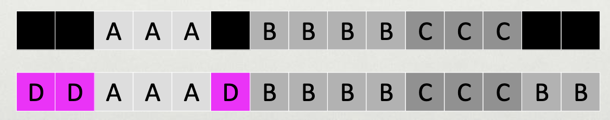
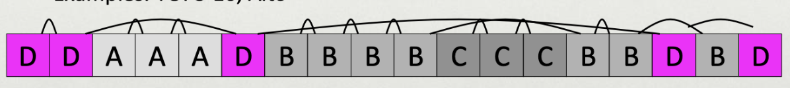
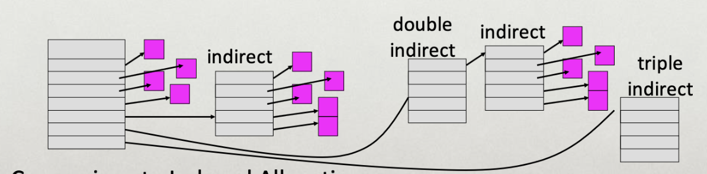
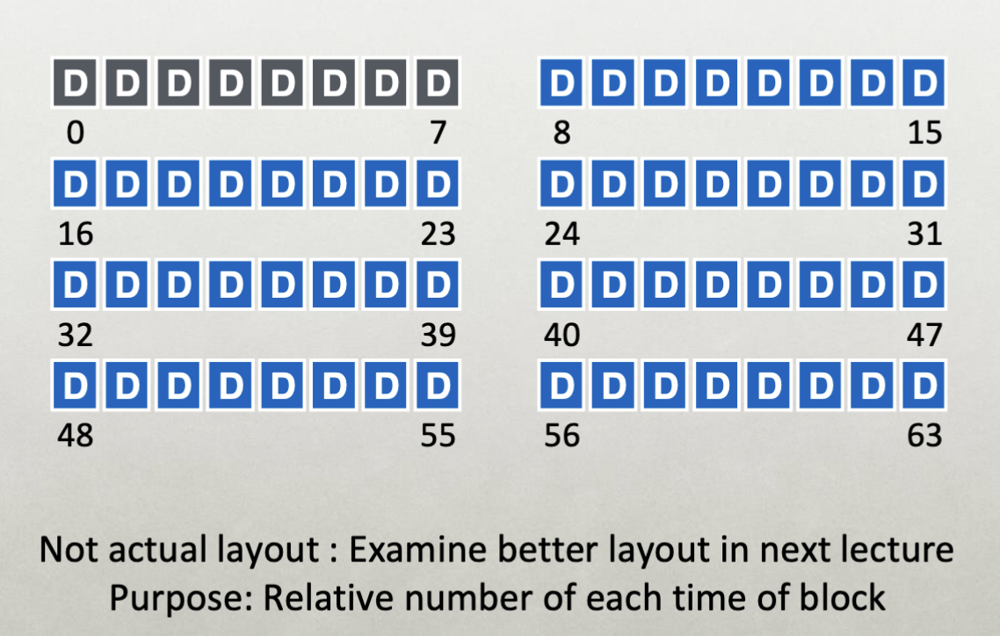
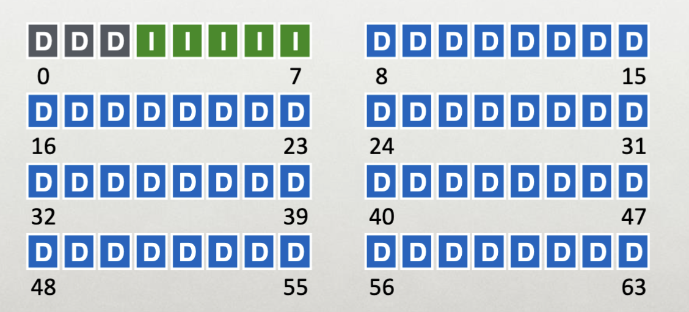
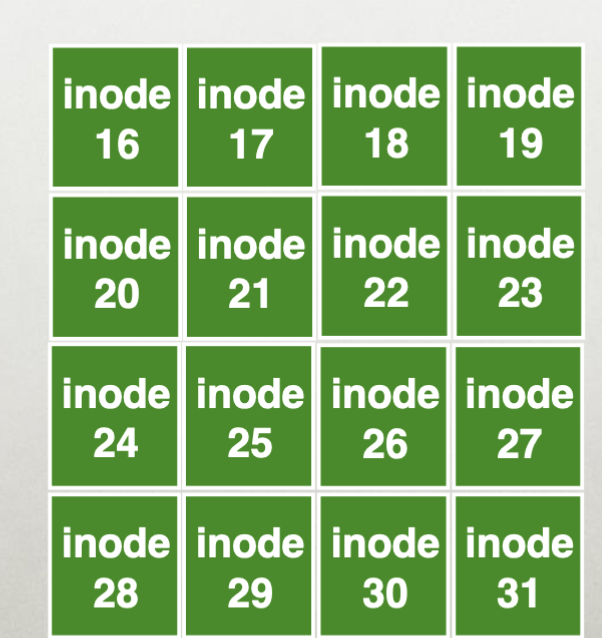
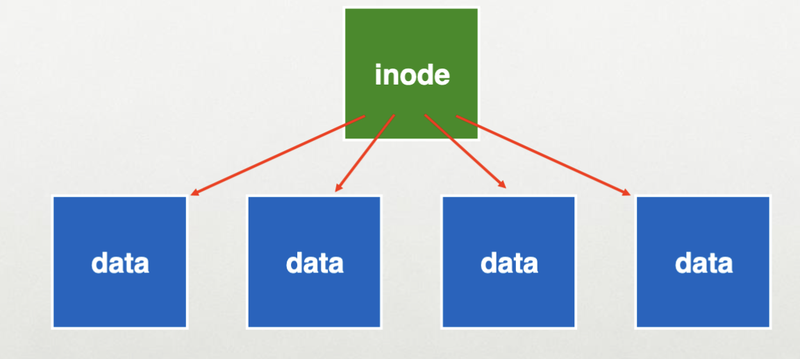
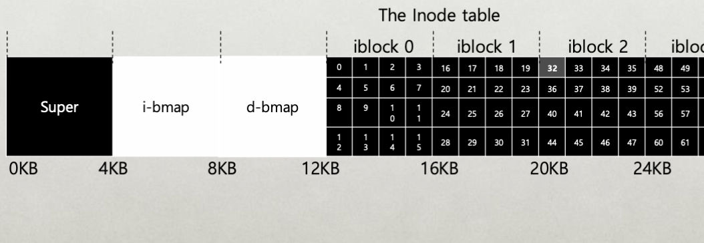
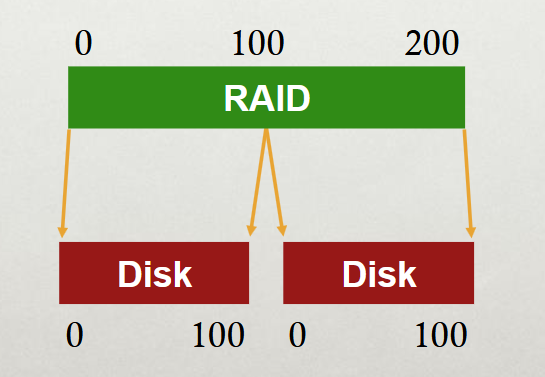
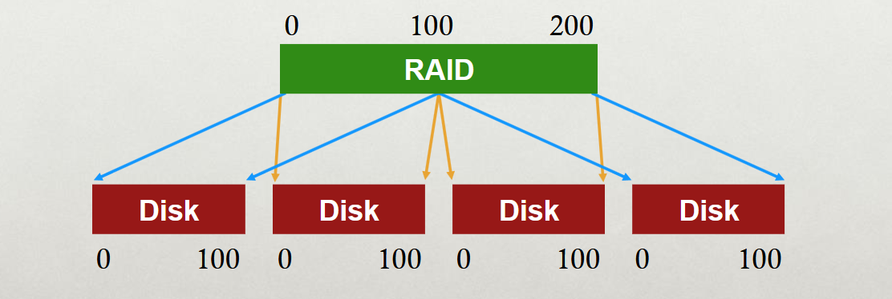

# File Systems

### File System Trend

- File systems have several layers. 

### Allocation Strategies

- Many different approaches:
	- Contiguous
	- Extent-based
	- Linked
	- File-allocation Tables
	- Indexed
	- Multi-level Indexed
- **Question:**
	- Amount of fragmentation (internal and external)
		- Free space that can't be used.
	- Ability to grow file over time?
	- Performance of sequential accesses (contiguous layout?)
	- Speed to find data blocks for random access?
	- Wasted space for meta-data overhead (everything that isn't data)?
		- Meta-data must be stored persistently too!

## Contiguous Allocation

Allocate each file to contiguous sectors on disk...

- Meta-data: *Starting block and size of*
- OS allocates by finding sufficient free space.
	- Must predict future size of file. (Show space be reserved?)
- Example: IBM OS/360

#### Problems?

- Fragmentation (Internal and external)?
- Ability to grow file over time?
	- Horrible external fragmentation (needs periodic compaction)
	- May not be able to without moving
- Seek cost for sequential accesses?
	- Excellent performance
	- Very simple calculation.
- Speed to calculate random accesses?
- Wasted space for meta-data?
	- Little overhead for metadata.

> The fragmentation is bad, growing the size of it is hard, but *everything else is good*

## Small Num of Extents

- Allocate multiple contiguous regions (extents) per file.
	- Meta-data: Small array (2-6) designating each extent.
		- Each entry: starting block and size.

#### Problems?

- Fragmentation (internal and external)?
	- Helps external fragmentation
- Ability to grow file over time?
	- Can grow (until run out of extents)
- Seek cost for sequential accesses?
	- Still good performance
- Speed to calculate random accesses?
	- Still a simple calculation.
- Wasted space for metadata?
	- Still small overhead for meta-data.

## Linked Allocation

- Allocate linked-list of *fixed-sized* blocks (multiple sectors)
	- Meta-data:
	- Examples: TOPS-10, Alto

#### Problems?

- Fragmentation (internal and external)?
	- Very good, no external fragmentation (use any block)
	- *Internal fragmentation:* Having to store pointers to another one.
- Ability to grow file over time?
	- Can grow easily.
- Seek cost for sequential accesses?
	- Depends on the data layout.
- Speed to calculate random accesses?
	- Ridiculously poor
- Wasted space for metadata?
	- Waste pointer per block. (Internal fragmentation)

## File-Allocation Table (FAT)

- Variation of Linked Allocation
- Keep linked-list information for all files in on-disk FAT table.
- Metadata: location of first block of file.
	- And, FAT table itself

#### Comparison

- Same basic advantages and disadvantages as linked allocation.
- *Disadvantage:* Read from two disk locations for every data read.
- *Optimization:* Cache FAT in main memory.
	- Advantage: Greatly improves random accesses.
	- What portions should be cached? Scale with larger file systems?

## Indexed Allocation

- Allocate fixed-size array of block pointers
	- Meta-data: Fixed-sized array of block pointers
	- Allocate space for pointers at file creation time.

##### Advantages

- No external fragmentation
- Files can be easily grown up to max file size
- Supports random access

##### Disadvantages

- Large overheads for meta-data:
	- Wastes space for unneeded pointers as *most files are small*.

### Multi-level Indexing

- Variation of Indexed Allocation
	- Dynamically allocate hierarchy of pointers to blocks as needed.
	- Metadata: Small number of pointers allocated statically.
		- Additional pointers to blocks of pointers.
	- Examples: UNIX FFS-based file systems, ext2, ext3.

#### Comparison

- **Advantage:** Does not waste space for unneeded pointers.
	- Still fast access for small files.
	- Can grow to what size??
- **Disadvantages:** Need to read indirect blocks of pointers to calculate addresses. (extra disk read)
	- Keep indirect blocks cached in main memory.

## Flexible # of Extents

- Modern file systems:
	- Dynamic multiple contiguous regions (extents) per file.
	- Organize extents into multi-level tree structure.
		- Each leaf node: starting block and contiguous size.
		- Minimize meta-data overhead when have few extents.
- Fragmentation: Both internal and external are reasonable.
- Ability to grow file over time: Can grow.
- Seek cost for sequential accesses: Still good performance.
- Speed to calculate random accesses: Depends on the size.
- Wasted space fr metadata: Relatively small overhead

## Data Blocks

- Everything is in a data block. 
- Think about it like our project 3, where we have a bunch of blocks, and some of the ones at the start store information about the other blocks. (*Inodes*)
	- Inode will contain all the information about the block.

### Inodes

- Every inode structure is the same.
- Does not matter if you create a directory, subdirectory, or a file, they're all files, so they will all have indoes.
- *Inodes are stored in order so its easy to do the calculations*

##### Direct vs Indirect Pointers

- A direct pointer in an inode points directly to a physical block in the memory.
	- A inode structure will have 16 direct pointers.
- An indirect pointer may point a physical block, but each entry in the physical block may point to another physical block of memory.
	- *You can also have a double indirect pointer or a triple indirect pointer*

#### One Inode Block

- Each inode is typically 256 bytes (depending on the FS, maybe 128 bytes)
- 4KB disk block.
- 16 inodes per inode block.

> When you systems like Linux, where everything is a file, you will have a lot of wasted space for the inodes.

- So, you want to put all of the inodes together in a single block.
- The inode will then point to where the block begins.

---

- Assume single level (just pointers to data blocks)
- What is the max file size?
	- Assume 256-byte inodes (all can be used for pointers)
	- Assume 4-byte addresses.
- How to get larger files?

		256/4 = 64
		64 * 4K = 256 KB!

---

Optimize for smaller blocks vs more indirect pointers.

---

###### Practice

Assume 256 byte inodes (16 inodes/block)

- What is the offset for inode with number 4?

![[imgs/real/practice-disk.png]]

	Since there are 16 inodes for block, and we know that the inodes start at block 3, it will be in block 3. 
	Then, the offset would be 256 bytes * the number of inodes (5, 0-indexed).

---

- Responsibility of the OS to copy the entire item to memory as the CPU can not access the disk itself, and these blocks are in the disk.

> Note for the project: You can not just take the cpu and point to the address of the block. You need to take that address, put the entire block into the memory, and THEN read it.

#### File Organization: The Inode

- Each inode is referred to by inode number.
	- By inode number, File system calculate where the inode is on the disk.
	- Ex: Inode number: 32
		- Calculate the offset into the inode region (`32 * sizeof(inode) (256 bytes)`) = 8192.
		- Add start address of the inode table (12KB) + inode region (8KB) = 20 KB.

#### Directories

> Access previous directories notes [here](../sys-prog/files.md#directories).

> File systems may vary

- Directories are for storing *directory entries* in data blocks.
- **Large directories** just use multiple data blocks.
- Use bit in inode to distinguish directories from files.

Various formats could be used...

- Lists
- B-trees

## Superblock

- Need to know basic FS configuration metadata, like:
	- Block size
	- \# of inodes.
- **Store this in the superblock**
- This is the first block in the disk. (Will contain all the information)
- *If this block is missing, that means you can't find anything in the file system.*

#### On Disk Structures

## File Operations

### Creating Files

	Create: /foo/bar

| data bmap | inode bmap | root inode | foo inode | foo inode | bar inode | root data | foo data |
| --------- | ---------- | ---------- | --------- | --------- | --------- | --------- | :------- |
|           |            | 1. read    |           |           |           |           |          |
|           |            |            |           |           |           | 2. read   |          |
|           |            |            | 3. read   |           |           |           |          |
|           |            |            |           |           |           |           | 4. read  |
|           | 5. read    |            |           |           |           |           |          |
|           | 6. write   |            |           |           |           |           |          |
|           |            |            |           |           |           |           | 7. write |
|           |            |            |           |           | 8. read   |           |          |
|           |            |            |           |           | 9. write  |           |          |
|           |            |            |           | 10. write |           |           |          |

1. Go to the `root` inode, read the contents of the root inode.
2. Find all and read all the data blocks for the root inode. 
3. Read `foo` inode, going to its data block.
4. Read it's data to see if the `bar` file already exists or not. If not...
5. Read the bmap to find a free inode in the bitmap.
6. Immediately write to it and reserve the `inode` so it can't be stolen.
7. Write the data for foo.
8. Every time file gets created, you need to read the `inode` to update the file creation time.
9. Update the file creation time.
10. Write the number of links to the foo inode.

### Opening Files

	open /foo/bar

| data bmap | inode bmap | root inode | foo inode | bar inode | root data | foo data | bar data |
| --------- | ---------- | ---------- | --------- | --------- | --------- | -------- | -------- |
|           |            | 1. read    |           |           |           |          |          |
|           |            |            |           |           | 2. read   |          |          |
|           |            |            | 3. read   |           |           |          |          |
|           |            |            |           |           |           | 4. read  |          |
|           |            |            |           | 5. read   |           |          |          |

- The first step to opening a file is *checking that the file exists*.

### Writing To Files

	write to /foo/bar

> *All assuming that the file exists and has been opened*

| data bmap | inode bmap | root inode | foo inode | bar inode | root data | foo data | bar data |
| --------- | ---------- | ---------- | --------- | --------- | --------- | -------- | -------- |
|           |            |            |           | 1. read   |           |          |          |
| 2. read   |            |            |           |           |           |          |          |
| 3. write  |            |            |           |           |           |          |          |
|           |            |            |           |           |           |          | 4. write |
|           |            |            |           | 5. write  |           |          |          |

1. Read `bar`'s inode, because it contains the info on where the blocks for `bar` are.
2. Read the data bitmap to find out where is the next *free* data block that is available.
3. Convert the bitmap and reserve it, **same reason** as when creating.
4. Write the contents of what we want to write directly to the data block.
	1. Otherwise, if you point `bar`'s inode to the data block before writing, your file will point to corrupted data and and also wastes a block. (If the system crashes)
	2. In the optimal scenario, we only waste a data block, but we don't point our `bar` inode to a corrupted block.
5. Actually write the inode to point to the data.

### Reading a File

	read /foo/bar

| data bmap | inode bmap | root inode | foo inode | bar inode | root data | foo data | bar data |
| --------- | ---------- | ---------- | --------- | --------- | --------- | -------- | -------- |
|           |            |            |           | 1. read   |           |          |          |
|           |            |            |           |           |           |          | 2. read  |
|           |            |            |           | 3. write  |           |          |          |

3. For the access time, in order to update it.

#### FUSE Filesystem

#todo get photo

- It is a mechanism to customize and build your own file system.
- The *FUSE module* in the kernel will translate the operations implemented by user space, it will redirect it to be using the standard file system calls.

##### `fuse_operations`

- Registering a bunch of function calls.

## RAID

> Redundant Array of Inexpensive Disks

- RAID is both transparent and deployable.
- Logical... #todo what?

### Why Multiple Disks

- Sometimes we want many disks -- why??
	- Capacity
	- Reliability
		- Disks have piss poor reliability. They fail very frequently because of the amount of write operations.
	- Performance
- Challenge: most file systems work on only one disks.

---

### RAID

> Combines a bunch of disks to offer better reliability and performance.

- Build logical disk from many physical disks.
- Be able to recover data from the disks even if one disk fails.

### General Strategy: Mapping

- Build fast, large disk from smaller ones.

---

> *Throughput*: Number of I/O Operations per second.

---

### General Strategy: Redundancy

- Add even more disk reliability.

> This uses half the disks as a failsafe. (RAID2)

#### Redundancy

- Trade-off to amount of redundancy.
- *Increase number of copies:*
	- Improve reliability (and maybe performance)
- Decrease number of copies (deduplication)
	- Improves space efficiency.

The standard is to have `2f + 1` copies of the data, where `f` is the "failures"

- If I can tolerate `f` failures in the system, I can recover from somewhere else.
- Recover from the point agreed upon by the different copies.
- Present user with the version of the copy.
- the `+1` ensures that there is a majority for choosing the agreed upon point.

### Reasoning About RAID

- **RAID:** system for mapping logical to physical blocks.
- **Workload:** types of reads/writes issued by applications (sequential vs. random)
- **Metric:** Capacity, reliability, performance.

#### Metrics

- Capacity: How much space can apps use?
- Reliability: How many disks can we safely lose?
	- Assuming fail stop!
- Performance: How long does each workload take?

> Normalize each to characteristics of one disk.

	N := Number of disks
	C := Capacity of disks #todo finish filling this in
	S := Sequential throughout of 1 disk
	R := Random throughput of 1 disk
	D := latency of one small I/O operation

### RAID0

> Striping

- Optimized for capacity. No redundancy.

#todo get the photo.

- The reason for the zigzag pattern of mapping is to be able to read and write in parallel.
- Ex: If your disk allows you to read two blocks concurrently, and your application would like to access blocks 0-3, you would need to issue 2 read requests.
	- Whereas for striping, you only need 1 request, as each one would be able to read 2 blocks.

#### Four Disk Striping

#todo get the photo

Given a logical address A, it is easy to find the block location of it:

	Disk = A % disk_count
	Offset = A / disk_count

*Variations:*

- Changing the chunk size of the stripes...

#todo get the photo.

#### RAID0 Analysis

- What is the capacity? `N*C`
- How many disks can fail? `0`
- Latency: `D`
- Throughput (Sequential, random)? `N*S`, `N*R`
	- Buying more disks improves throughput, but not latency!!

### RAID1

> Mirroring

#todo get the photo

- For every disk, use one disk as a mirror for the other one.

#### RAID1 Layout

- How many disks can fail in a 4 disk RAID1 setup? Best case: `2`

#### RAID1 Analysis

- What is the capacity: `N/2 * C`
- How many disks can fail: `1 or N/2`
- Latency (read, write)? `D` 
	- (Only D because it is the same value mirrored)
	- RAID4 requires 2D for write because of the calculation necessary for the next write.
- Throughput:
	- Sequential Read: `N*S`
	- Sequential Write: `(N/2)*S`
	- Random read: `N*R`
	- Random write: `(N/2)*R` (Synchronization costs)
		- You can not go and write something else to a mirroring disk, the throughput of that disk **must** be used to mirror the write of another disk.

#### Crashes

- What happens if a crash occurs before the changes get mirrored on the other disk?
- When two requests are made, there is no telling which one gets executed first?
- *RAID1* can not account for this.

##### Solution

- Problem: Consistent-update problem
- Use non-volatile RAM in RAID controller.
- Software RAID controllers (e.g. Linux md) don't have this option.

> *Million dollar solution lol*

### RAID4

> Strategy

- Use parity disk.
	- Use a disk as a parity disk which stores some calculated variables from all the other disks.
	- If one disk fails, you can use the parity values from this disk to regenerate the data.
- In algebra, if an equation has `N` variables, and `N-1` are known, you can often solve for the unknown.
	- So basically, if there are `N` disks, you can recover the failure of one disk with the `N-1` disks.

#### Example

> Simple additive parity.

#todo get the photo.

#### RAID4 Analysis

- What is the capacity? `(N-1)*C` (1 to store parity)
- How many disks can fail? `1`
- Latency? (Read, write) Read: `D` Write: `2D`
	- Write costs more because you must write to the parity disk.
- Throughput:
	- Sequential read: `(N-1)*S`
	- Sequential write: `(N-1)*S`
		- During sequential writes, the parity block gets changed too because of striping.
	- Random read: `(N-1)*R`
	- Random write: `R/2`
		- Because you need to read and write the parity block too.
		- You must wait for one random write (to a block) to finish and change the parity BEFORE you can write to another disk.
		- (The parity IS **ALSO** a disk, which only takes in 1 write at a time!!!)

#### Crashes

- If the system crashes, the disk that failed will be marked and using the parity/the other disks, you can recalculate the missing data.