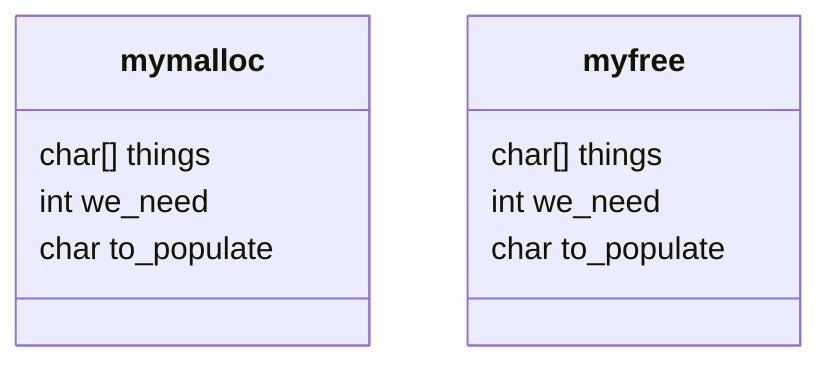

# [My Little Malloc](sys-prog.md)

Creation of a `mymalloc()` library for Rutgers University class: `01:198:214` - Systems Programming

Created by: **Emily Cao** (ec1042) and **Ivan Zheng** (iz60)



## Errors to Detect

1. Attempting to `malloc()` too much memory.
	- Return where the error occurred and how much they tried to allocate (_Attempt to allocate BYTE_SIZE from Line LINE_NUM_)
2. Attempt to `malloc()` more memory than is currently available.
	- Error occurs when allocating more memory that may not be available in a row.
	- malloc should return NULL and print a message `fprintf(stderr, ...)`
1. Attempt to free an address outside the heap.
	- Return the memory address ex: trying to free a local variable.
2. Attempt to free an address of a non-allocated objected. (Already freed object)
3. Atempt to free an address in the heap but not of an object.
	- Ex: having an array in the heap but trying to free just the 2nd object in the heap.

## Correctness Conditions

> how do you know that your code is good enough to submit?


- You will want to run tests to decide whether you wrote the library correctly.

**Testing Strategies**

1. Determine several requirements your library must satisfy
	1. library detects all required errors
	2. malloc should allocate memory
	3. free should deallocate memory
2. Figure out how to tell whether your requirements are satisfied. (*outside while loop condition for checking*)
3. Write code with test cases. (TEST CLIENT!!!) `atoi`
	- e.g. allocate the largest possible allocation and see if the next malloc fails
	- allocate all of memory, free it, allocate again
	- **Switch statements**
- **DYNAMIC ALLOCATION SECTION 9.9 in CS211 textbook**

**Performance Testing**

- Test the efficiency of you code
- memgrind.c measures the speed of your library. (Expose the inefficiency of your code)
	- Note time, run test 50 times, note time again. Subtract start time from end time and divide by 50.
	- If it still shows as 0, make it 100, 200, 500...
	- Report avg elapse time in ms.

**"Black box" and "white box" testing**

- **black Box:** Running test using only the public interface of a library. (Can't see inside)
	- `memtest.c` is an example of a black box test
- white box testing uses internal aspects (private) aspects of the library.
	- Use a little trick for `static` functions and the memory array: include `mymalloc.c` in your white box code.

**Other helpful tools:**

- Function that checks the integrity of the heap. (Does size of the chunks add up to the size of the heap?)
	- Negative size? Zero size??
	- Put at end of your malloc or free function in debug mode.
	- Are all the sizes reasonable?
	- Adjacent free blocks??
- Function that prints the structure of the heap
	- For each chunk, print its size and whether it is in use
	- And other information you find helpful

**Useful compiler options** *dont enable for performance testing*

`-g` - include debugging information (symbols)

`-fsanitize=address` - enables address sanitizer (ASAN) 

`-fsanitize=undefined` - enables the undefined behavior sanitizer (UBSan)

`-Wall` - Turn on more compiler warnings

`-std=99` - disable GCC extensions (Cheats that GCC allows but are not standard practice)

`-Wvla` - warn for variable-length arrays

`-O` - optimize code

`-O2` - optimize harder

---

## Important Variables

```C
#define MEMLENGTH 512
static double memory[MEMLENGTH];	// Usage of "static" makes the array private to this file.
// That is, it doesn't participate in linking
// We use "double" because it is 8-bytes and has 8-byte alignment.
```

## Steps

- Memory should be a single free block.
- When you get a call to `malloc()`, you should look through the memory and look for a portion of free blocks the object can fit into.
- As `malloc()` proceeds, we keep dividing the memory up into more and more blocks. (Don't forget the metadata)
- **Make sure you know where the memory begins and how big it is.**
- **The free block also requires metadata**
- "Large enough" means that we also have space for a new metadata block!
- It's okay if malloc returns a region larger than requested, but malloc **cannot** return one smaller than requested.
- In order to make `free()` safe, you need to look at all the blocks anyways.
- **No global variables aside from the stuff in the header**

### Coalescing
- Combining adjacent free blocks to make a bigger free block.
- *Coalesce function* (Do it in free, so whenever you free a block, you know the block that comes before and the block that comes after. If they are both free, then coalesce.)

### Metadata
- Up to us
- **Minimal**: Flag that says allocated or not allocated and how big the block is

> *TODO:* Discuss what we want in the metadata.

## Questions to Consider

- The argument to free must always be the address of the start of a block.
	- Your free needs to detect incorrect pointers and report them
	- How could you check whether an address is valid?
- Your own implementations of malloc and free must be *memory*-safe and never go past the end of your array.
	- Do you need to explicitly indicate that some block is the last block?

> Easiest Way: Loop through all the blocks and see if any begin with the address that you were given.

- **Can not** have initialization function.

> Header is all zeroes, probably first time malloc has been called.

## Git For Dummies

### For committing new files

> `git add *` - For when you add new files

### For committing edited files

> `git commit * -m [message]` - Replace message with some commit message
> `git push` - You need to push!!

### For fetching online updates

> `git fetch`

---

#todo

- make my helper functions `static`
- make a tester in my `makefile`
	- Ex: test: test-program
		- ./test-program > test2.out
		- **Compare output with pre-existing reference output**
		- diff test2.out test2.ref

---