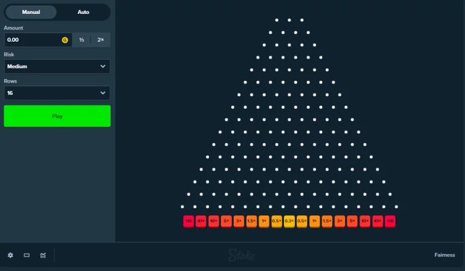

# [Choosing Resources](cog-decision)

## Bounded Rationality

### Classical Theories of Rational Choice
- Classical theories of rational choice given by von Neumann & Morgenstern (1944) made idealizations:
	- People have **complete knowledge** of all the options and their consequences.
	- People can do **complex calculations** to arrive at the optimal choice.

### Principles of Expected Utility Theory
- **Quantification:** We can express any given person's preferences numerically and call it utility.
- **Completeness:** The decision maker can state a preference for one of two outcomes, or that they are equally preferred.
- **Transitivity:** The decision maker's preferences are transitive (consistently ranked-order): if A is preferred to B, and B is preferred to C, then A is preferred to C.
- **Maximization:** The decision maker's goal in making a choice is to maximize utility.

In this **transitivity model:** Theoretically, if you prefer Beyonce over Rihanna, and Lady Gaga over Beyonce, you should theoretically prefer Lady Gaga over Rihanna.

#### Calculating Expected Utilities

Expected Utility (EU) of a scenario is: P(A) * Utility(A) + P(¬A) * Utility(¬A)

----

- Herbert Simon pointed out that for choices to be adaptive, they do not need to lead to the best possible situations. (*Maximizing*)
- They need only to lead to situations that are "good enough" (*Satisficing*)
- Perform more calculations than is needed is actually more costly (*timewise, energywise...*)
- A theory of rationality should take into account the **limited access to information** and the limited computational capacities that people actually possess in the kinds of environments in which we make choices.
- Such a theory would be a theory of "**bounded rationality**" (*Bounded by human limitations*)

---

- The notion of bounded rationality fits well with work on heuristics and helps to explain behavior that at *first glance* doesn’t seem to be rational.
- For example, sometimes we assume that providing more options or more information is better for decision-making. However, that is not always the case.
- When making decisions more complicated we must consider cognitive limitations. Consider, for example, the **choice overload effect**.

## Choice Overload
- The **choice overload affect** says that the complexity of the decision problem faced by an individual exceeds the individual's cognitive resources and is **detrimental** to choice.
- For instance, decision complexity caused by a large number of consumer options can lead to fewer sales.

### Iyengar & Lepper (2000)
- Offered free samples of 6 or 24 jams at a supermarket booth.
	- People were more likely to stop at booth with 6 samples (60% vs 40% of passersby)
	- Of those who tried jams, people more likely to buy from 6 sample booth (30% vs 3%)

### Moderating Factors
- More likely when people aren't very familiar with the things they are choosing between (and therefore don't already have a strong preference).
- More likely when under time pressure.
- More likely when items are difficult to compare.

### Satisficing vs Maximizing
- **Fewer options**: free rein to satisfice - and make a decision that will be good enough without requiring strenuous mental gymnastics.
- **Many options**: pressure to maximize and attempt the best-quality decision.

#### Schwartz et al (2002)
- Positively correlated with feeling regretful and with being perfectionistic.
- Negatively correlated with feeling happy, feeling satisfied with life, being optimistic, and having high self-esteem.
- They speculated that possessing the drive to maximize one's decisions makes it difficult to feel fully content with whatever the outcome may be.
- One is *more pleased* with the choice if they were not trying to maximize them at the time the choice was made.

## Nudge Theory

Decisions regarding whether and how to spend our resources of time, money, effort and opportunity can be swayed by others.

For example, tools traditionally used by governments include:

- Mandates and bans (e.g. *civil laws prevent theft and assualt*)
- Incentives and decentives (e.g. *subsidies for renewable fuels, taxes on tabacco products*)
- Advertising campaigns.

### Libertarian Paternalism
- In the past decade, a hugely influential approach to government has emerged: “libertarian paternalism”.  
- This new approach is the “nudge theory” of Richard Thaler and Cass Sunstein.  
- It seeks to use findings in behavioral science – concerning willpower and the effects of cognitive, emotional and social factors on decision making – to help people by orchestrating their choices in such a way that they are more likely to do  
what achieves their goals.  
- Choice architecture is the environment in which people make decisions.  
- Anyone who constructs that environment is a choice architect.

**Paternalism** - interference in the life of another person, without their consent, motivated by the belief that the interference will leave the person better-of.

#### What are Nudges?
- To qualify as a nudge, an initiative must not impose significant material incentives or disincentives.
	- A **subsidy** is not a nudge.
	- A **tax** is not a nudge.
	- A **fine** is not a nudge.
	- A **jail sentence** is not a nudge.

What, then, *is* a nudge? Sunstein points to the following:

- Default rules (e.g. automatic enrollment in programs)
- Simplifications (e.g. to promote take-up of programs)
- Using social norms (e.g. “most people pay their taxes on time”)
- Convenience (e.g. make certain options clearly visible)
- Disclosures (e.g. the costs associated with energy use)
- Warnings (e.g. health risks for cigarettes)
- Reminders (e.g. emails or text messages for overdue bills)  
- Information disclosures (e.g. releasing consumer information)  
- Elicit implementation intentions (e.g. “do you plan to vaccinate your child?”)
- Precommitment strategies (e.g. ask people to commit to a specific course of action at a precise future moment in time)

#### Wansink, Painter, and Ittersum (2001)
- Conducted a six-week long field study of six items on a menu at a faculty cafeteria. They replaced regular names with descriptive names.
- Whenever they made this change, there was an **increase in sales by 27%**.

#### Goncalves et al (2021)
- Social norm nudge for three months in a Portuguese supermarket and measured fruit and vegetable purchase quantities of 1636 customers using loyalty card data.
- They were they split into 3 groups based on how many fruits and vegetables they bought. (Soft buyers, Medium buyers, hard buyers)
- They then put a bunch of signs and images of fruit that said: "*The healthiest families of this store purchase at least eleven fruits and vegetables per visit. And you?*"
- They noticed that the soft buyers increased their fruits and vegetables purchasing by almost 60%.

#### Milkman et al (2022)
- Walmart pharmacy flu shot messages. (22 different messages)
- 29.4% in control condition received a flu shot. 

**Example Interventions:**

- Humor to increase memorability ("Did you hear about that joke about the flu? Nevermind, don't want to spread it around.")
- Social norms
- Prompting ppatients to text back if they planned to get a vaccine.
- 1 text vs 2 texts.

##### Results
Each of the 22 interventions significantly increased vaccination rates relative to the control conditions.

- The top-performing intervention produced a 2.9% increase in flu vaccinations (+9.9% from the control)
- This intervention included two text messages:
	- "It's flu season & you can get a flu shot at Walmart."
	- 72 hrs later: "A flu shot is waiting for you at Walmart."

###### Why?
- Milkman suggested that *ownership language* is important.
- Ownership Factor: Indicated the vaccine had "just been made available to you" and encouraged participants to "claim your dose."
- Video Factor: Provided link to 2-minute video.

> Evidence found that ownership language boosted appointment. (Dai et. al (2021))

### Mental Accounting
- Decisions about how we spend resources are influenced by where we think the resources come from.
- People mentally divide their wealth into:
	- Current income (paychecks, bonuses)
	- Current assets (savings, large windfalls)
	- Future wealth (retirement savings, future income)
- We are more likely to spend current income.

##### Study
- Studies in Japan found that an annual salary increase (current income) is more likely to be spent than an annual bonus (current assets), even if they are the same amount.
- It was found that the proportion of the money spent rather than saved was:
	- 0.437 for bonus income
	- 0.685 for nonbonus income.
- Perhaps it is better to move funds allocated for salary increases to routine bonuses to encourage employee saving.

## Sunk Costs
- When resources have already been spent:
	- Sunk costs should not factor into decisions about the future, but do.
	- We tend to make decisions based on past costs rather than based on whether or not the current and future costs will outweigh the benefits.

#### Susceptible
- Older children and adults tend to be more susceptible than younger children to the influence of sunk costs.

> Possible explanations: older children and adults have been socialized to follow the rule "Don't waste", whereas younger children have not yet been socialized to follow this rule.

#### Time vs Money
- People are used to keep track of money and thinking of it as a valuable commodity, but they aren't necessarily used to doing so for time.
- Soman (2001) had participants imagined that they had worked 15 hours for a theatre ticket and 5 hours for a rock concert ticket, and that they thought they would enjoy the rock concert more.
- People would choose the one that they thought they would enjoy more, even if they still spent the time already.

> Perhaps people do not account for money and time in the same way. Maybe focusing on time spent leads people to focus on emotional meaning and wellbeing. (Lee et al. 2015)

## Expected Utility Theory
- In expected utility theory:
	- The decision maker can state a preference for one of two outcomes, or that they are equally preferred.
	- The decision maker's preferences are transitive (consistently ranked-order): if A is preferred to B, and B is preferred to C, then A is preferred to C.

> If this does not follow, then you are a [money pump](../cog-sci/10-the-rational-mind#money-pump).

**Expected Value/Utilty**:

- When we make decisions, there are often conflicts between the desirability and probability of our options.
- When choosing a career, there may be tradeoffs in the likelihood and amounts of success in a field.

- We can express any given person's preferences numerically and call it the utility.
- We can calculate the expected utility of any gamble by taking each possible outcome of that gamble.
- Check out [Expected value](../discrete-2/discrete-2#expected-value)

### Symbols
- X ~ Y -> The agent (person) is indifferent between X and Y.
- X ≻ Y -> The agent (person) strictly prefers X over Y.
- X ≽ Y -> Weakly prefers X over Y.

### Gamba
- Gambles represent the fact that the consequences of choices are never certain.

### Framing
- Problems with expected utility theory:
	- Framing influences preferences between choices even when the choices are equivalent in expected value.

#### Framing Effects
- **Principle of Invariance:** The way in which choices are framed *shouldn't* matter.
	- However, framing *does* influence preferences between choices even when the choices are equivalent in expected value.
	- Framing in terms of *gain* leads people to be *risk-averse*
	- Framing in terms of *loss* leads people to be *risk-seeking*

##### Gain Framing
- Sure gain of $240 vs 25% chance to gain $1000 and a 75% chance to gain nothing.
	- People tended to prefer the sure gain of $240.

##### Loss Framing
- Sure loss of $750 vs 25% chance to lose $1000 and a 25% chance to lose nothing.
	- Now, people tended to prefer the chance.

### Risk Aversion
- Risk aversion is *demonstrated* when people refuse to play a fair gamble.
- A fair gamble has an expected value of zero, for example, tossing a fair coin for the following deal: Heads you lose $1,000, tails you win $1,000.
	- Expected value of this gamble is 0.

### Prospect Theory
- Prospect theory accounts for the **reference dependence** of people's choice under uncertainty.

**Prospect Theory** agrees with Expected Utility theory that choices involve maximizing expectations.

- However, must account for the fact that in actual decision-making evaluations of utilities and probabilities of outcomes are subject to cognitive ...

#### Choice Stages
- Framing phase: People *simplify* the prospects to make decisions less complex. (e.g. ignore very small probabilities)
- Valuation phase: The overall value (V) ...

