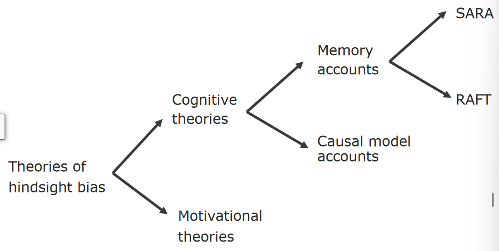

# [Learning and Prediction](../cog-decision/cog-decision)

Review: What is a heuristic?

- Gigerenzer's Definition: A heuristic is a cognitive rule of thumb.
- Kahneman's Definition: Answering more complexed questions by replacing it with a simpler one.

---

## Hindsight Bias

**Informally:** Cognitive illusion that one "knew all along".

**Formally:**

- Judgments of the probability of a specific outcome shift upwards once the outcome has been achieved.
- People tend not to be consciously aware that their judgments have changed after the fact.

### Creeping Determinism
- The tendency to judge that the outcome was relatively inevitable.
- "Once one knows what has happened, that occurrence seems relatively more inevitable than if one had not known what happened."
- That is, in hindsight, people tend to believe that the outcome **had** to occur, given the circumstances.
#### Questions
- Did you accurately predict the past two Super Bowls?
- Did you accurately predict the past two elections?
- Did you accurately predict how your stocks would perform?
- Did you accurately predict what would happen in Ukraine?

---

### History of Hindsight Bias

- **Yom Kippur War of 1973**
	- The failure of Israeli intelligence to anticipate the Egyptian-Syrian led surprise attack led to a political crisis.
	- Egyptian and Syrian build-ups prior to the attack were dismissed as exercises, and reports that Soviet advisers and diplomats had begun leaving the region were sat on until better intelligence could be gathered.
- **Almost like Ukraine**
	- Buildup to war was occurring at the border.
	- However, it was overlooked and no one thought that a war was actually going to occur until it did.
	- Then, political pundits went on air to say how they knew all along.

### Memory Paradigm
- **Fischhoff and Beyth (1975)**
- Clearest demonstration of "hindsight bias".
- President Nixon was about to leave for China and the Soviet Union.
- Asked people for probabilities of various possible outcomes. (e.g. Pres. Nixon will meet Chairman Mao; Pres. Nixon will announce that the trip was a success.)
- Two weeks after the trip, asked subjects to recall their predictions.

**Findings**: People's recollections changed to be closer to the outcome.

**Limitations**: It cannot be used for events that people did not judge in foresight.

### Hypothetical Paradigm
- A task that can be used with any event is to ask people what they would have predicted in a situation, had they been asked, after being told what had happened... I searched history books for the right kind of events."
- One group was asked to read about a battle between the British and the Gurkhas in the year 1814, then to predict the likelihood of several alternative outcomes...
- The other group was given an outcome and were told to rate the likelihood of the same outcomes as if they didn't know the actual outcome.

**Findings**: people that were given an outcome subsequently gave probabilities closer to that outcome than did people who didn't know the outcome.

---
### Hindsight Bias Appears to be Universal

- Pohl et al (2002) had 227 participants from one of four continents.
- It appeared around the same degree across countries and continents.

### Why is Hindsight Bias a Problem?

- Since people tend to think that they "*knew it all along*", they **won't learn from experience** that outcomes are difficult to predict.
- Thus, hindsight bias may lead people to be **overconfident** about their current decisions.

### Theories of Hindsight Bias

#### Motivation Theories
- One might be personally motivated to reinforce one's self image as a knowledgeable person.
- People have the need to feel as thought the are in control of important events.
- There can be a tendency for people to attribute their successes to internal, personal factors and their failures to external, situational factors (Miller & Ross 1975)

#### Cognitive Theories
- Memory accounts focus on the memory paradigm.
- **Core idea:** Memory retrieval involves reconstruction.

##### Memory Accounts

**Two main models:**
- *SARA* (Selective activation, reconstruction, anchoring)
	- How old was Nelson Mandela when he became president?
		- Activates memories of approximate ages of past presidents.
		- Activates images of Nelson Mandela (Has white hair)
		- **Leads to guess a bit higher** (*around 60*)

> When the correct answer (75) is revealed, it activates memories most relevant to correct answer.

> When asked to reconstruct earlier estimate, the reconstruction is influenced by the information that is now most strongly activated. **Hence**, the new estimate will be closer to the correct answer.

- *RAFT* (Reconstruction after feedback with take the best)
##### Causal Model

- a.k.a **sense making**
- Accounts focus on the hypothetical paradigm (where there is no initial judgment to remember)
- **Core idea:** When people are told the outcome, they construct causal models that explain the outcome.
- This might also help to explain creeping determinism.

### Yopchick & Kim (2012)

Found that when the description of the event was stripped of potential causes of the given outcome, people do not show hindsight.

### Conclusions
- People find it difficult to re-enact their own past states of knowledge.
- The knowledge that we now have reliably impacts our recollections of past knowledge.

## Reverse Hindsight Bias

- After learning the outcome of an event, people believe that they "never would have seen it coming..."
- In reverse hindsight bias, people's likelihood estimates of the actual outcome after the fact are even lower than estimates given by people who did not know the outcome at all.
- Occurs for very surprising events; if sense making is successful then hindsight bias occurs; if plausible causal models point to a different outcome, then reverse hindsight bias occurs.

## Outcome Bias

- Tendency, when judging the quality of a decision, to take the outcome into account in a way that is **irrelevant**.
- E.g. Decisions evaluated more favorably due to a positive outcome even if the outcome is by chance.
- *Underplays* the uncertainty of the situation.
- **Ex:** A physician decides to do a bypass operation where 8% of people do not survive, but which could increase life expectancy.

> **Outcome bias** may work in tandem with hindsight bias, making you think something was riskier than it was.

- Hence, you make think that the physician made a bad decision.
- **Decision makers who might have their decisions scrutinized may be reluctant to take nay risks, given hindsight bias and outcome bias.**

### Baron and Hershey's Study (1988)

> This one has been replicated.

#### Setup

- 692 participants via Mturk.
- **All told:**
	- A 55-year-old man had a heart condition.
	- He had to stop working because of chest pain.
	- He enjoyed his work and did not want to stop.
	- His pain also interfered with other things, such as travel and recreation.
	- A type of bypass operation would relieve his pain and increase his life expectancy from age 65 to age 70.
	- However, 8% of the people who have this operation die from the operation itself.
- **Task**: Evaluate the decision to go ahead with the operation.
- **Manipulations**: Told either the physician or the patient made the decision. Told either the outcome, either success or failure.
- *4 categories*, decision quality (correct or not), perceived outcome importance, perceived responsibility, perceived norms.

#### Results
- Decisions resulting in positive outcomes were evaluated as higher quality (M = 1.78) compared to those resulting in negative outcomes. (M = 0.68)
- Only 6% of participants thought outcomes are important when evaluating decision quality; **outcome bias may be unconscious.**

