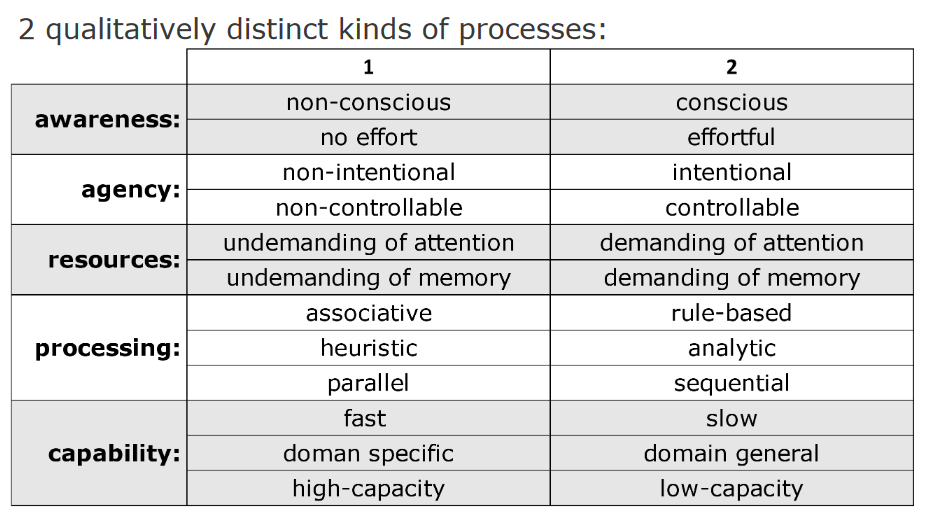
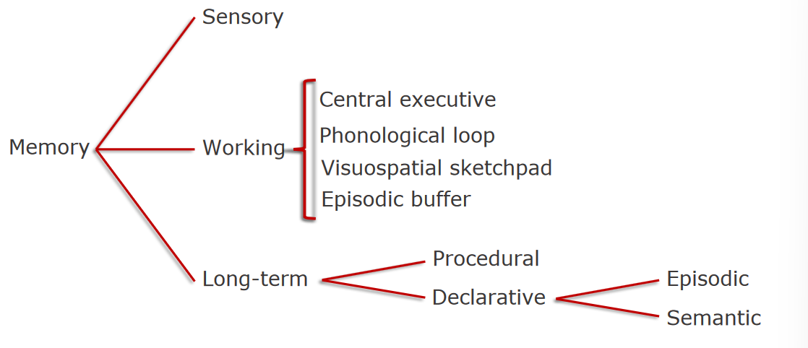

# Midterm Review

## Basics

> **Note:** Link to actual notes section [Here](cognitive-architecture#introduction).

#### Judgments
- Judgments are about what is the case.
- "Will it rain today?"

#### Decisions
- Decisions are about what action is performed.
- "Should I bring an umbrella?"

### Prominent Distinction in JDM Research

#### Descriptive Claims
- Claims about what *is* the case.
- "People think that hard work leads to success."

#### Normative Claims
- Claims about what *ought* to be the case.
- "People should believe that hard work is not the only thing that leads to success."

## Dual Process Theory

> **Note:** Actual notes linked [Here](cognitive-architecture#dual-processing-theory).

### Wason and Evans
- Introduced the "dual-process" theories of cognition.

In it, there are 2 qualitatively distinct kinds of processes:

### Type 1 Processes
- The popular story goes that Freud had discovered the unconscious while treating patients.
- However, research on the unconscious predates Freud.

#### History

**First half of 20th century:**

- Behaviorist movement in psych.
- Conscious and unconscious states were rejected.

**Second half of 20th century:**

- Cognitive revoltion.
- Mental representations regained respectability.
- Freud's psycho-analysis regarded as pseudo-science.

#### New Unconscious
- "The cognitive unconscious", or "adaptive unconscious".
- These states are not inherently accessible.
- It is very efficient and sophisticated but can go wrong under certain conditions. (*predictably wrong*)

### Type 2 Processing
- Allows us to perform reasoning and correct mistaken intuition.
- Imagine future possibilities.
- Aide complex verbal communication and learn new skills.

**These are *conscious* tasks...**

- Attention is also necessary for consciousness. **Bears (1988)**
	- Conscious states are a subset of the contents of the working memory.

### Issues with DPT

#### Clustering Problem
- Do the attributes *always* go on the same side?
- Are some more fundamental than others?
- **EX:** Heuristics are judged to be rapid, intuitive judgments, but it seems to be rule based.

##### Gave Birth to the Evans and Stranovich Model
- Type 2 Processes demand working memory.
- Working memory is limited capacity and slow.
- Working memory is correlated with conscious.

## Memory (M-WM Model)

> M-WM stands for **multicomponent working-memory model**

> **Notes:** More in-depth info from CDM is linked [here](cognitive-architecture#working-memory) and info from Intro is linked [here](../cog-sci/8-memory)

### Long Term Memory

#### Procedural/Implicit
- This is the memory of how to do something. (e.g. ride a bike)

#### Declarative/Explicit
- Memory of facts, strings of sounds and words.

> Declarative is further split into [**Episodic**](../cog-sci/cog-sci-finals#episodic) and [**Semantic**](../cog-sci/cog-sci-finals#semantics) memories.

### Initial Baddeley and Hitch Model
- The **central executive** (Attention controller)
- The **phonological loop** (Verbal and Auditory info)
- The **visuospatial sketchpad** (Visual and spatial information)

#### Baddeley (2000) Later Added
- The **episodic buffer** (memory store and integration of information from *phonological loop* and *visuospatial sketchpad*)

#### Central Executive
- Four primary functions
	- focusing attention
	- dividing attention
	- Switching between tasks
	- Interfacing with LTM

#### Phonological Loop
- **Phonological Store:** A short term sound-based store of speech and other sounds, that fades within a few seconds.
- **Articulatory rehearsal process**: An articulatory loop that maintains information in the store (inhibits decay) by either vocal or subvocal rehearsal. 

> Repetition of sounds will transfer them into LT - Declarative - M.

#### Visuospatial Sketch
- Temporary store for visual and spatial information.
	- **Visual**: the "what" info, identification of objects.
	- **Spatial**: the "where" information, identification of objects in space.

#### Episodic Buffer
- Working memory can hold more than would be expected based on just the phonological loop or visual sketch pad. (*People can remember long sentences.*)
- Further, phonological, visuospatial and long-term memory info need to be integrated at some point.
- Baddeley thus proposed the **episodic buffer** as the storage component of the central executive.
	- It **binds** and integrates the two other parts and traces from LTM.

### Problems
- **Cluster Problem:** Do all tasks in DPT engage working memory to some extent?
	- Evans (2019): Nah, Type 1 processes don't **post** into working memory.
- **Dichotomizing Variables:** Some attributes fall on two ends of a continuous spectrum. Where is the line drawn? **How can we draw a line???**
- **Undiagnosed evidence:** What evidence is there for DPT vs one-process theories?
	- Take a task with an intuitive incorrect answer.
	- Reaction times: Incorrect responses are quicker
	- Cognitive load manipulations: Number of correct responses drops.
	- Problem: These findings might also be explained by positing that there is one kind of process (“unimodels”), but the *degree* of processing drops.
- **Interaction**: How do Type 2 processes know how to switch on?
	- Do they monitor Type 1 processes?
	- If so, are Type 2 processes engaged from the start?

### Interactions

#### Parallel-Competitive Models
- Both Type 1 and Type 2 processes are engaged from the start.
- Type 1 is faster so output a response before the slower response finishes.
- If there is a conflict in the output, Type 2 processing does a check for errors.

#### Default-interventionist (Serial) Model
- Type 1 is engaged from the start but not Type 2.
- Type 1 process outputs a response and if it is sussy:
- Type 2 processing may occur.

De Neys (Hybrid) Model
- Multiple Type 1 processes are engaged at the start.
- If they come to conflicting results, Type 2 takes over.

---

#### What does Sussy Mean? (Suspect)
- Fluency of an intuitive answer (time it takes for it to come to mind) results in varying degrees of feelings of rightness.
- Feelings of rightness mediate Type 2 interventions.

---

## Unconscious Influences on Decision Making

### Nisbett & Wilson (1977)

- We seem to have no direct awareness of processes such as perception and memory.

#### Study 1:
- Cords tied to ceiling, task is to tie them together.
- Most participants were stumped until an experimenter "brushed" against the string, causing it to move.
- After a minute, they were able to solve the puzzle.
- When asked how they solved it, they never mentioned the "brushing."

#### Study 2: Word Association
- "Name a detergent" after memorizing a word pair like "ocean-moon"
- This is called *semantic cueing*, and it doubled the frequency of target responses from 10% to 20%.
- However, participants never mentioned the word pair, but mentioned other features instead.

### Benefits of Unconscious Thought

#### Unconscious Thought Principle

**Conscious Thought** - Task is the focus of conscious attention.

**Unconscious Thought** - This is deliberation without attention. ("Sitting on a decision")

#### Capacity Principle

**Conscious Thought** - Low capacity. "Working memory" and can only process 10-60 bits per second

**Unconscious Thought** - Much higher capacity. Entire system can calculate 11,200,000 bits per second.

#### Bottom-Up-vs-Top-Down Principle

**Conscious Thought** - Guided by expectancies and schemas, people often quickly form pre-judgments that work as an expectancy.

**Unconscious Thought** - Slowly integrates information to forma  summary judgment.

#### Weighting Principle

**Conscious Thought** - Leads to suboptimal weighting because attention is drawn to features that are easily accessible and easy to verbalize. (The paintings example)

**Unconscious Thought** - Weights the relative importance of multiple attributes.

#### Rule Principle

**Conscious Thought** - Follows Strict rules and is precise.

**Unconscious Thought** - Cannot follow rules and gives rough estimates.

> You can't do complexed math in your unconscious thought.

#### Convergence-Versus-Divergence Principle

**Conscious Thought** - Focused and convergent. *Unilateral*

**Unconscious Thought** - More divergent and creative.

### The deliberation-without-attention hypothesis

**Conscious thought:** - Good when things are simple, and becomes worse as the complexity of the decision problem increases (from capacity principle)

**Unconscious thought**:  
Always good; the quality of decisions made is independent from the complexity of the problems (from top-down-versus-bottom-up principle and weighting principle).  

> There are a few studies for this. (Apartments with desirable and none desirable features (Complex), Cars (Simple and Complex), Ikea vs Macy's)

## Replicability

Newell & Rakow (2011) reviewed 16 experimental studies from two labs, across a range of tasks, only one of which found any significant advantages for unconscious thought.

### Replication Crisis

- A lot of the work before 2010 was not replicable.
- There is a spreadsheet of which ones have been replicated and which have not.

