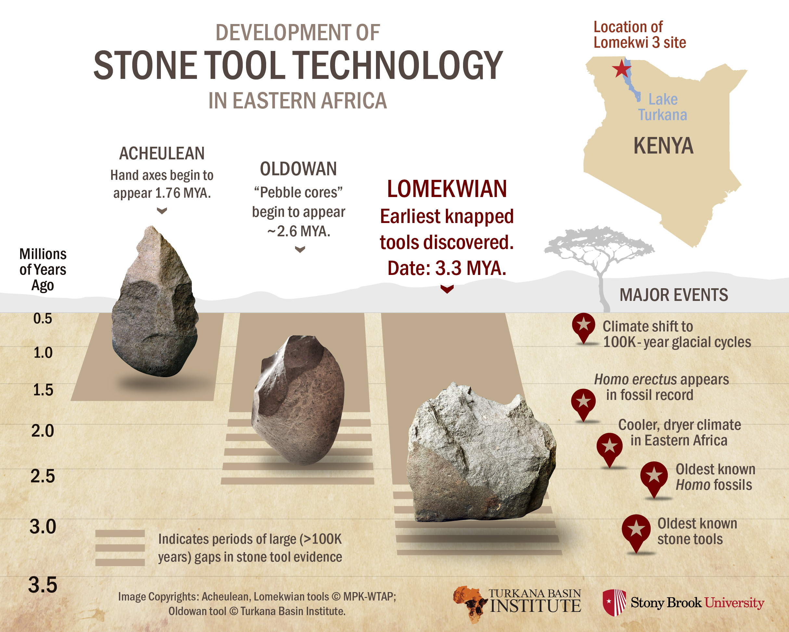

# [Emergence of the Mind](../cog-sci/cog-sci)

## Evolution

> We share our evolutionary tree with primates. What did we inherit from our common ancestor? What is new?

### Spandrels
- "Some traits are just by-products of something else favored by the environment." Stephen Jay Gould called these traits the "**spandrels**".
- Example: Chins? *Maaaaaybe*: Language

### Massive Modularity

---

"Consequently, the brain must be composed of a large collection of circuits, with different circuits specialized for solving different problems. You can think of each of these specialized circuits as a mini-computer that is dedicated to solving one problem. Such dedicated mini-computers are sometimes called modules. **There is, then, a sense in which you can view the brain as a collection of dedicated mini-computers - a collection of modules.** There must, of course, be circuits whose design is specialized for integrating the output of all these dedicated mini-computers to produce behavior."
- In simpler terms, the mind is just a bunch of **modules**, and individual parts.
- These modules evolved independently of one another.
- Each module can not update itself based on the information from another.

---

### Case Study

"There are two populations of Swainson's thrushes in Western Canada, each following a different migration route. Sometimes these two populations interact and interbreed, resulting in --"

```
Rest is in the slides
```

---

## Emergence of Humans
- Homo sapiens evolved into modern form about 200,000-300,000 years ago in Africa.

**Environment of Evolutionary Adaptation**
- Traits that made survival easier in this environment would pass the selectional filter.
- *Which traits would help early humans survive?*
	- Ex: Opposable thumbs, sweat glands

### Cursorial Hunters
- Humans were **cursorial hunters** in the EEA. (Cursorial=adapted to run)
- They hunted by running them to exhaustion. Sweat glands and bipedalism make this strategy viable.

### Evidence of Cognition
- How can we reconstruct the emergence of our cognitive abilities?



---

## Evolution of Intelligence

**Brain-body ratio:** the ratio of brain mass to body size.

Humans tend to have a brain-body ratio of about 2% (varies per person, some can go as low as 0%!) - but so do mice.

#### Encephalization Quotient (EQ)

> Normalized brain-body ratio

- Smaller animals tend to have larger brain body ratios, and larger animals have smaller ratios. However, the human brain is actually twice the ratio of an average animal our size, while the mice is half as large.

#### Neuron Count
- Instead of measuring brain mass, let's count neurons.
- Humans have about 16 billion neurons in our cerebrum.

---

> How does the cortex compare to the rest of the brain, by neuron count?
- Humans have more neurons overall, but the ratio is in line with other primates.
- Sooooo, the human brain is just a scaled-up primate brain.

---
### Eusociality
- Humans are highly social (eusocial) animals.

> We live in complex, hierarchal societies...

### Theory of Mind
- The ability to model other minds - to see the world from their perspective and understand their mental states.
- We all model the outside world via mental representations.
- We also model the internal mental states of other human beings.
	- *Ability to theorize what other minds want to do*

#### Case Study

"The western blue jay hides food in scattered caches in their territories. Jays will re-hide their food if they notice a dominant jay watching them."

- Only birds who have had the experience of stealing display this behavior!
- So, this Jay has a theory of mind. They may not be reasoning explicitly, but they are able to model another Jays mental state.

---

Why are humans so intelligent? Where did this come from?

**Cultural Intelligence Hypothesis**
- Social cognition precedes general intelligence.
- Ex: Theory of mind, cooperation, joint attention.

**General/Physical Intelligence Hypothesis**
- General intelligence precedes social intelligence.
- Ex: Object permanence, sense of numbers, causality.

#### Did Social Cognition come First?
- Humans are highly social animals.

---

