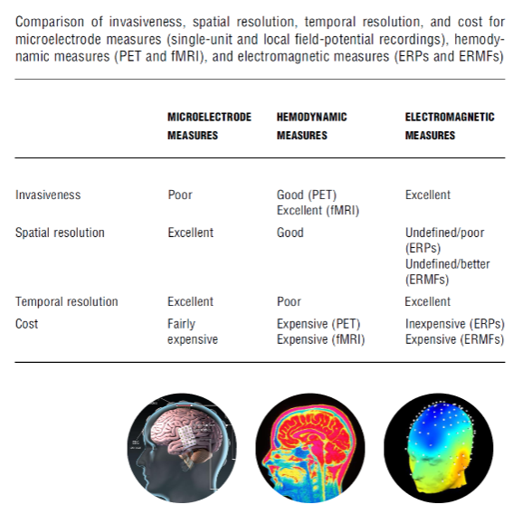
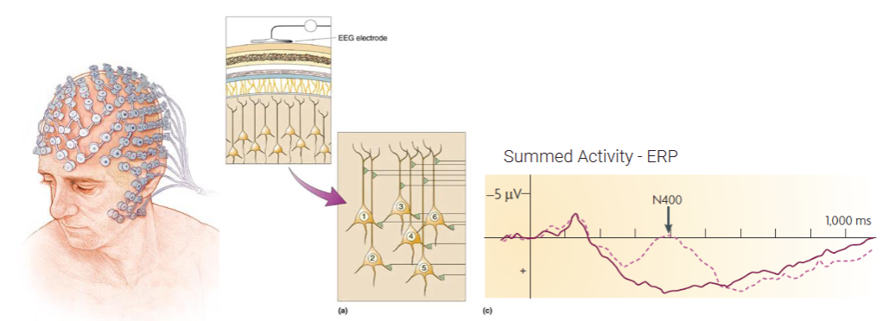
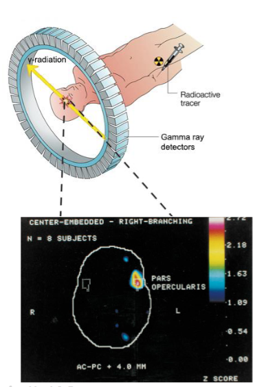
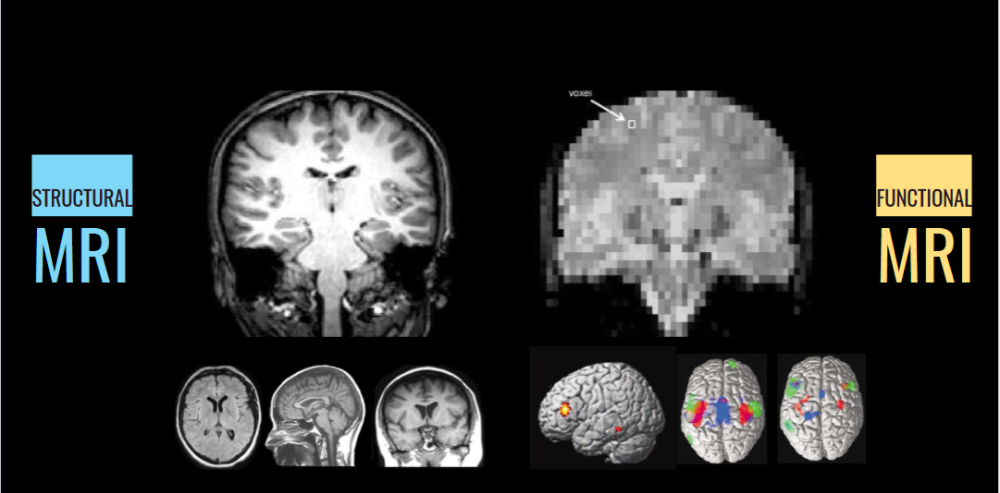

# [Ch5: Mind and Brain](../cog-sci/cog-sci)
- Why do we study the brain?
	- To understand the Brain
	- For clinical purposes
	- To build a brain 2.0
	- **To understand the mind**
- What are the techniques and tools for studying the brain?
- What can the brain tell us about the mind?

---

### Structure of the Brain:
- The brain is wrinkly.
- It's a bit more hard then you would think (not squishy).
- WHY IS IT WRINKLY??
	- For surface area!
		- It increases the surface area of a certain layer. (the cortex)
		- The cortex seems to be responsible for things like perception, understanding, and etc.
- There are different lobes in the brain:
	- Frontal Lobe: Responsible for emotions, decision making and organization.
	- Prefontal Cortex: Responsible for short term memory and ability to pay attention.
	- Temporal Lobe: Responsible for long term memory, language comprehension, and identifying and naming objects.
	- Motor Cortex: Responsible for movement and coordination.
	- Somatosensory Cortex: Responsible for sensations.
	- Parietal Lobe: Responsible for processing sensory information and spatial awareness.
	- Occipital Lobe: Responsible for processing visual information.
	- Cerebellum: Responsible for skill memory and movement coordination.
	- Brain Stem: Responsible for body basics such as heart rate and breathing. Also central to alertness and the ability to sleep.

---

### What's Going on in the Corpus Callosum??
- You have two hemispheres to the brain.
- The way they are connected is via the corpus callosum.
- There are certain functions that are localized on a certain hemisphere in your brain, but then are not able to communicate with the other.

#### WADA Test
- Cool test to determine the localization of the your functions.

#### Contralateral organization
- Your left and right hemispheres are responsible for the **opposite** function.
- Your right hemisphere is responsible for processing the left eye, and vice versa.

#### Right ear Advantage
- The place we process sound is the auditory cortex. It's very close to your ear.
- The right ear has an advantage because it sends a signal to the left hemisphere's auditory cortex and language is typically localized in the left hemisphere.

---

Phineas Gage
- He was a railroad worker who had a metal rod go through his frontal lobe.
- He survived, but his personality changed.

#### Double Dissociation
- Suppose a lesion in one part of the brain affects some cognitive task. What can we infer about the relationship between that area of the brain and the cognitive task?
  - We would infer that the area in the brain with the lesion is responsible for that cognitive task.
  - However, we can not infer that the area of the brain is *only* responsible for that cognitive task.
  
Hans-Lucas Teuber said...
- Double dissociations were "needed for conclusive proof of localization of function in the brain."

*What followed?*
- The fact that patient A is impaired on Task II supports the hypothesis that Task II is localized in an area including the site of patient A's lesion.
- Patient B's pattern of impairement and sparing provides evidence for two further hypotheses.
- First, the fact that patient B is unimpaired on Task II supports the hypothesis that the area in which Task II is localized does not extend as far as the site of patient B's lesion.
- Second, the fact that patient B is impaired on Task I supports the hypothesis that patient A's pattern of impairment and sparing is not to be explained by different levels of complexity for the two tasks.

---

### Measuring Brain Activity

### Electrophysiology
- Measures brain activity
- Neurons fire, sending electrical signals to connected neurons.

### Hemodynamics
- Energy to power brain activity.
- Neuronal activity > metabolic
demand for glucose and oxygen >
cerebral blood flow to active region

---

### EEG (Electroencephalography)
- Measures electrical activity in the brain.
- You see the data in real time.

There are two types of signals a neuron can fire:
- Action potential:
  - Within a neuron (fast 1msec)
- Postsynaptic potential:
  - Between neurons (slow 10s/ 100 msec)

#### Event related potentials
- Each EEG electrode records the average of many thousands of neurons.
- The ERP is the average of many EEG recordings.
  

### PET (Positron Emission Tomography)
- Measures blood flow in the brain.
- Can show which areas of the brain are active during a task by measuring regional Cererbral Blood Flow (rCBF).
- Spatial resolution: 4mm.
- Temporal resolution: Very bad, 30 seconds. (No measurements until 30 seconds after the task is performed)

Procedure:
- Inject radioactive tracer into bloodstream.
- Scanner detects radioactive decay.

### MRI and fMRI (Magnetic Resonance Imaging and Functional MRI)
- The MRI machine consists of a large superconducting magnet.
- The magnet aligns the protons in your body.
- A radio frequency pulse is applied to the body.
- The protons absorb the energy and flip.
- When the pulse is turned off, the protons relax and emit a radio signal in return, which can be easured.

However, for fMRI, the MRI machine is used to measure the blood flow in the brain. (We want this for COGSCI)

#### Functional MRI
- **BOLD** signal: Blood Oxygen Level Dependent
- No radioactive tracer needed.
- fMRI is correlative, but does not tell you that these brain regions are **necessary**.
- Doesn't tell anything about the cognitive *process*.

Data:
- Spatial resolution: 3-6mm
- Temporal resolution: 3-6 seconds

---