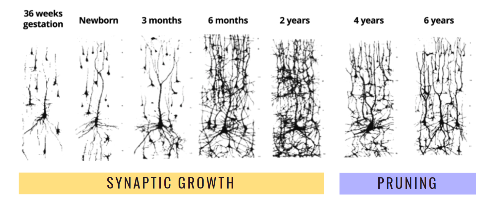

# [Ch9: The Origin of Minds](../cog-sci/cog-sci)

### Empiricism vs Nativism

#### Empiricism
- "Let us then suppose the mind to be " - John Locke
- Everything that can be learned is from getting input from the environment and using that input in certain ways.
- At birth we are a blank slate.
> There is an understanding and concept of learning.

#### Nativism
- "We come to know about the world by the power of our **native** intelligence" - Descartes
- We are boosted by existing knowledge about the world.

---

**Comparison**

| Empiricism                                                                            | Nativism                                                                                                |
| ------------------------------------------------------------------------------------- | ------------------------------------------------------------------------------------------------------- |
| Mind starts with what the world looks like.                                           | Mind starts with some basic idea of how the world works.                                                |
| Everything is learned exccept the simplest "sensations" and principle of association. | Some/many *innate* ideas built-in and different principles of learning built-in (like tools in a toolbox) |

---

> "The baby, assailed by eyes, ears, nose, skin, and entrails at once, feels it all as one great **blooming, buzzing confusion**" - William James

- First, the baby's mind goes through synaptic growth where the amount of neurons and synapses increase.
- Then, the baby's mind goes through synaptic pruning where the neurons that are not used are pruned away.

---

### What can babies do?
> Before 5 months, no reaching\
> Before 7 months, no locomotion *(being able to drag themselves or be able to move around more efficiently than before)*\
> Before 9-10 months, no pointing, talking

- However, they do observe, start learning and obesrving the world around them from birth.

**Babies look and orient to objects and sounds!**

---

### What do babies look at?

- Babies prefer stripes more than plain fields.
- They prefer high contrast over low contrast.
- Moving objects more than stationary arrays.
- Spheres more than discs.
- Pictures that relate to sounds they hear.
- New or surprising things.

---

### How to study babies?

#### High Amplitude Sucking
- Measures rate of sucking action on a pacifier outfitted with a sensor.

#### Head Turn Procedure
- Measures how long a baby keeps their head turned to an auditory stimulus at the side.

#### Looking Time Measures
- Measuring duration and proportion of baby's looks (looking time) to stimuli.

Also...

#### fNIRS (Functional Near-Infrared Spectroscopy)
- Measures brain activity using infrared lasers.
- Laser shone through the head can be used to estimate blood flow in the brain.

---

### What do babies know?
- Babies do not understand [amodal completion](#amodal-completion). (They do not have a bias.)
- **Continuity and Occlusion**: Using movement cues, babies can perceive an occluded stick as a whole.
- **Coherence**: Babies use motion cues to determine whether adjacent objects form a whole.
- **Object Permanence**: babies know that objects continue to exist when they are out of sight.
- **Physical and Psychological Causality**: Babies understand the concept of causality. They reason about agents(social beings) differently than they do about objects.
- **Pre-social Behavior**: Babies understand and show spontaneous pro-social behavior.

---

### Learning in Babies
- How do we know if baby's core knowledge is **innate** or **learned**?
- Babies have mental models of the world and have expectations about how the world works. Experiments that break these expectations can be used to study learning in babies.
- Domain specific learning: Learning about one domain does not transfer to another domain.

#### Case Study: Language

How do babies learn to speak???

**What babies need to learn**:
- Sounds
- Syllables
- Rhythms
 
 **Sensitivity**
- Babies start life with high sensitivity and then get locked in.
- It's like what happens with neuron trimming where the unused sensitivity to syllables get trimmed away.

#### Case Study: Counting
- Babies learn to count at around 4-5 years old.
- From 1-4, babies have issues with understanding the quantity that each of those words represent.
- However, after 4, they are able to understand the quantity without issue.

---