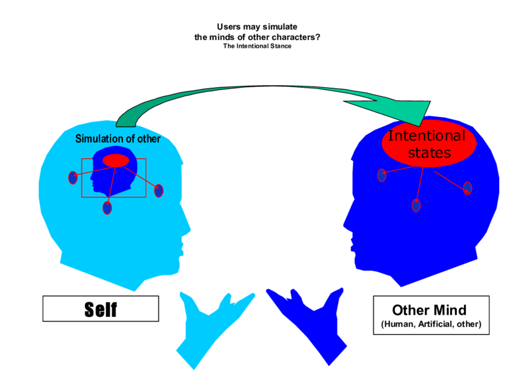

# Final Exam Study Guide For Cognitive Science

## Modules Involved
- Module 7: The Language Instinct
- Module 8: The Mind's Eye
- Module 9: The Power of Memory
- Module 10: Origins of Cognition
- Module 11: The Reasoning Mind
- Module 12: Emergence of the Mind

---
## Notes About Exam
- Not cumulative, only multiple choice and short answer questions.
- 3 Hour Exam, starts at **8am** on **December 19th** (fuck)
- 3x5 Index card still allowed for the exam.

---

## Terms to Know

### Module 7
- **Design features**: [See Below ↓](#Features-Of-Language)
- **Competence and performance**: *Competence* is knowing what to say. (Mental grammar). *Performance* is how you express it by coordinating your mental grammar with linguistic knowledge.
- **Mental grammar**: Every person has their own mental grammar. This mental grammar is unique to them alone, and telling them language is wrong is like telling them their morals are wrong. *It is correct to them!*
- **Recursion**: "*Infinite use of finite means.*" [Read more below ↓](#recursion).
- **Universal Grammar**: Some parts of mental grammar are innate. Certain grammatical structures and rules are innate across all languages. *Universal grammar* + *linguistic input* = *Fluent speaker*
- **Critical Period**: A period of time in a baby's development that is crucial to the development of a certain skill. (*Ex: Genie Wiley, severely abused and missed out on this critical period for language development.*)

### Module 8
- **Retina**: The light sensitive layer of tissue at the back of your eyeballs. It converts the light received through the eye's lens into electrical signals that the brain can interpret.
- **Rods and cones**: These are the *two* types of receptors in the retina that detect the light.
	- **Cones** are more numerous near the central region of vision and gives us *high res*. 
	- **Rods** are further away in the peripheral areas of the eye. 
		- *Rods only provide monochrome color information and are more sensitive at lower light levels, which causes colors to look washed out at night.*
- **Transduction**: The process of converting from one signal to another.
- **Prosopagnosia**: (Me like fr...) *Face blindness*. People can only recognize parts of the face rather than the entire face.
- **Blindsight**: If you damage your occipital lobe, you get a blindspot in your vision. Sensation and transduction are still happening. However, [perception](#module-8:-the-mind's-eye) is not happening. 
- **Parallel Processing**: Checking all items by representing them visually. Time does not increase even when set increases. In [Feature Integration Theory](#feature-integration-theory) this is usually when there is just 1 unique feature.
- **Serial Processing**: Sequential search. *There is two types*: Exhaustive and self-terminating.
	- Our brain uses exhaustive search algorithm. *How do we know?* When told to remember something that was not actually shown to them, they would take the same amount of time as it took them to find something that was in the set.

### Module 9
- **Sensory Memory**: Used for initial processing. *Unfiltered, large capacity and short durations*.
	- Helps us to encode information in mental representations for each modality.
- **Working Memory**: (a.k.a short-term memory) Used for accessing and manipulating information. *Some filtering, but very selective as the brain must decide which ones are most important.*
	- Short duration and small capacity
	- Rehearsal allows it to pass to long term.
- **Long-term Memory**: Storing information for later access. *Large capacity and long duration*
	- Typically organized by type of information rather than modality.
- **Recoding**: The process of encoding individual chunks of information into a higher-order chunk in order to help us commit memory into the long term.
- **Decay**: Information typically decays in 1-2 mins (short term) unless there is rehearsal. 
- **Rehearsal**: *Two types of rehearsals*
	- *Repetitive Rehearsal*: Repeating the same thing over and over in short term memory to commit it to long term memory
		- *Elaborative Rehearsal*: Connecting something in short term memory to something that is already in long-term memory.
- **Redintegration**: One memory is the cue to triggering another memory.
- **Pseudo-memory**: False memory you believe to be true.
- **Memory Schemas**:

### Module 10
- **Empiricism**: The idea that cognitive abilities in babies are all developed from after birth. *Everything* is learned except the simplest of "sensations" and principles of *association*. [See Below ↓](#empiricism)
- **Nativism**: Belief that cognitive abilities are inherent and all babies are born with their cognitive functions. [See Below ↓](#nativism)
- **Babbling**: *First steps toward language acquisition*. During the babbling phase, babies are able to vocalize any combination of syllables. As they test out these combinations, they slowly get locked in.
- **Speech rhythm**: Stress times, syllable times, mora times. Babies need to learn this as well.
- **Subitizing number system**: Distinguish from 1-3 objects. Typically, this is extremely fast and automatic. (*Used in language to count the number of subjects*) [How it relates to babies](#subitizing-number-system)
- **Approximate number system**: Approximation of larger number of items by ratios.

### Module 11
- **Heuristics**: *Rules of thumb*. Things that are generally true. In Cognitive science, these are typically thought of as *Cognitive shortcuts*. There are many different types. [See Heuristics ↓](#heuristics)
- **Gambler's Fallacy**: The misconception of chance, that since a certain odd has not hit for a long period of time, that there is a higher chance of it hitting the next time.
- **Bounded rationality**: We are *semi-rational* beings. This means we are only rational enough to get by. This is an evolutionary trick for us to make decisions quickly, even if they are not the most accurate, in order to help us **maximize efficiency.**
- **Frame problem**: *Consistency and Consequence checking are computationally intractable*, meaning it is virtually impossible to keep track of all the different possibilities. This relates to the **framing problem** we spoke about back in [Artificial Minds](../cog-sci/4-artificial-minds#the-frame-problem)
- **Wason Selection task**: Famous task to test people's understandings of propositional statements. *Series of 4 cards and you have to decide which to flip based on a [implication](../discrete-1/discrete-1#implications)*

### Module 12
- **Selection**: 
- **Environment of Evolutionary Adaptation (EEA)**: These were traits that made survival easier in the environment that would help pass the *selectional filter*.
- **Cursorial Hunting**: Running an animal to death. *Sweat glands and bipedalism made this viable*
- **Eusocial**: High social beings. 
- **Theory of mind**: The ability to model other minds. (Putting yourself in someone's shoes) [See below ↓](#theory-of-mind)

## Module 7: The Language Instinct

### Features of Language

- Mode: Can have more than one mode of expression (verbal speech, sign language, etc.)
- Meaning: Terms have specific semantic meaning
- **Arbitrariness**: You are unable to predict the meaning of a word based on how it sounds.
	- For example: The word *dog* does not give the mental image of a dog.
- Discreteness: languages are composed of atomic units
- Displacement: can talk about things not immediately present in scenario
- Productivity: Can create novel sentences
- Cultural transmission: Main way of acquiring a language is having it be transmitted to you. (You need to learn it from someone else)

### Structure of Language
- *Will be asked something on hierarchical structure*

- **Hierarchical Structure**: *Best way we have to represent human thought*
	- I have thought in my head, and I express my thought as **language**.
	- My thought has a hierarchical structure, but the language does not.
	- We care about the top-down structure of the language and what has the **highest relationship**

- **Tree Structure**
	- A sentence is made of **constituents** (group of words), so that the same sequence of words can have multiple meanings.

> **The Structure of human thought is *invariant***. (Everyone thinks in basically the same way, across languages)

### C-Command Relationship
- Up 1 level, then down
- When using the *self* pronoun, the sentence has to be in the correct *structural relationship* in order for the sentence to make sense.

### Recursion
- *Infinite use of finite means*
- You can keep on generating new sentences for **infinity**.
	- Ex: Bob's friend has an apple. → Bob's friend's friend has an apple. → Bob's friend's friend's friend has an apple.

---
## Module 8: The Mind's Eye
- **Important**: *difference between sensation and perception*
	- Sensation: Sensation is the raw detection of the stimulus. There is no understanding here of what the stimulus is.
	- Perception: Having some kind of understanding about the stimulus is perception.

---
#### Blind Spot
- Humans have a blind spot because cables are backwards.
- The cables have to punch back through your retina in order to feed information, causing a blind-spot.
### Top-Down Processing
- Filling in information using preconceptions.
- *Color constancy*, *Amodal Completion*
### Bottom-Up Processing
- Information flowing from the senses to perception.
- Data driven, you have no idea what you are looking at and let your senses do the work.

---
### Feature Integration Theory
- The fewer features you are looking for, the faster you will be.
- As you add distractors, if you are searching for multiple features, the search time will increase.
- However, if you are only searching for limited features, the number of distractors does not affect search time.
- When looking for something, you engage in a 3-step process.

**Step 1**: Really fast
- Identify single salient feature
- Such as identifying a blue circle in a sea of red circles.
- Nothing pops out

**Step 2**: Focused Attention
	- Slower, effortful, attentive
- More than one feature that is different, takes a lot longer and is harder.

**Step 3:** Object recognition

---

## Module 9: Memory

- **Important**: Might be asked to describe an algorithm for how you remember things that appear.
	- *Working memory*, *serial search*, *parallel search*
	- *Self-terminating search*, *exhaustive search* (we use exhaustive search)

#### Selective Attention
- When the brain decides what is important enough to process in working memory.

### Three Types of LTM

#### Episodic
- Memory of past experiences
- Declarative memory (easy to describe)

#### Semantics
- Memory of general facts and knowledge
- Declarative memory

#### Procedural
- Memory of how to do certain tasks
- Non-declarative memory

---
### Pseudo-memory

Why do we have it?

> Because of a concept called **Reconstruction**... Or the idea that when access a memory we are reconstructing and so it *changes* in a small way.
>  Reconstruction uses **memory schemas** to fill in the gaps in our memory.

#### Negative Trials
- Proved that we use exhaustive search.

---
## Module 10: The Origins of the Mind

- **Important**: What do babies know right away, and what do they need to learn.
- **Empiricism vs Nativism**

### Empiricism vs Nativism

#### Empiricism
- Everything that can be learned is from getting input from the environment and using that input in certain ways.
- At birth we are a blank slate.

#### Nativism

- “We come to know about the world by the power of our **native** intelligence” - Descartes
- We are boosted by existing knowledge about the world.

---
#### Synaptic Pruning
- Synaptic pruning is the second phase of a baby's neural development process.
- They first go through a process of *synaptic growth*, where the number of neurons that they possess increase.
- Then, they go through a phase of *synaptic pruning* which reduces the number of neurons they possess if they do not actively use it.

---
### Core Knowledge

Babies possess **core knowledge** of several different things. This core knowledge can be described as a "*set of fundamental cognitive systems/mechanism upon which we build and develop new cognitive abilities.*"
- These *systems* are usually the knowledge of **places, objects, numbers, agents, and social beings.**

### Subitizing Number System
- **Babies have an innate sense of numbers**
- Although babies can not express in words the number system, however, they have an innate ability to sense quantities between 0-4.

#### Cardinal Principle
- The idea that if you are referring to "one, two, three pigs", are you saying there is 3 pigs.

---
## Module 11: The Rational Mind

### Heuristics

#### Representative

- The probability that one thing originates from another is thought of as higher if they are similar or associated with one another.
- **Example**: We would more easily associate someone who is neat and organized as being a librarian rather than a pilot or a athlete.

#### Availability

- The easier it is to come up with examples of a something in our mind, the more likely we think that it is to happen. 
- **Example**: Plane crashes are so infrequent but because we see it on the news so often, we think of it as happening more often than they actually do.

#### Anchoring

- If you give someone an initial number, people tend to *anchor* onto that number and it influences them in their answers.

#### Recognition
- If you are able to recognize a certain name or feature more, you are more likely to choose that option.

### Epistemic and Practical Rationality
- Epistemic : Beliefs (Consistent and accurate beliefs)
- Practical : Desires (Consistent and accurate beliefs)
- Relates to the "money pumps"

### Dunning-Kruger Effect
- Confidence is (*mildly*) inversely correlated with actual knowledge.

---
## Module 12: Emergence of The Mind

### Spandrels

- Unexplainable and useless traits that do not have any specific evolutionary benefits but were just side affects from evolution. *By-product of something else favored by the environment.*
- *Language* may be an example of a spandrel. *Noam Chomsky argued that it was the result of an increased brain size and increasing complexity.*

### Massive Modularity
- The brains were individual modules that evolved independent of one another.
- Each of the modules can not update themselves with information from another. This is things like the *Color Constancy Effect* are able to work.

### Eusociality
- Humans are highly social (eusocial) animals.

> We live in complex, hierarchal societies...

**This means that we need...**
### Theory of Mind
- The ability to model other minds - to see the world from their perspective and understand their mental states.
- We all model the outside world via mental representations.
- We also model the internal mental states of other human beings.
	- *Ability to theorize what other minds want to do
- **Other animals also have theory of mind** *Blue jays*

#### Evolution of Intelligence
- The argument is between whether cultural/social intelligence or general/physical intelligence came first.
- If one did, then that implies that the other was just a spandrel.

---

- You are not born with theory of mind.
- You are very self-centered when you are a baby.

---

### Theory-Theory vs Simulation Theory

#### Simulation Theory

- Using yourself to simulate the knowledge of someone else.
- "What would they do?"

#### Theory-Theory
- Logical inferences
- Abstract theory of how people behave

### EQ