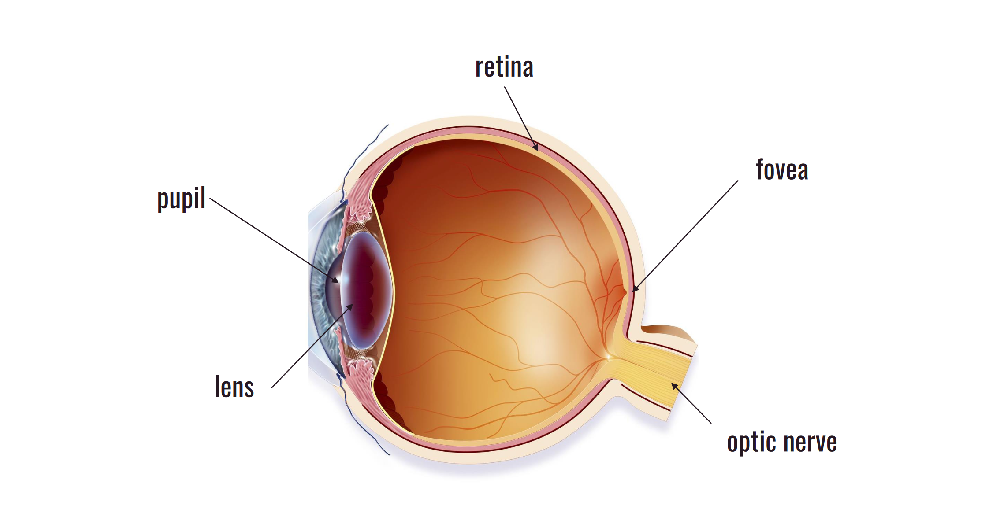
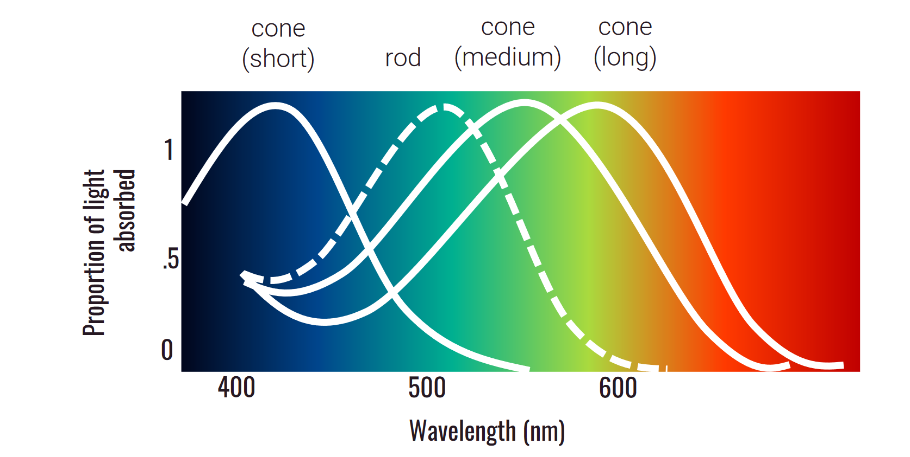

# Cognitive Science

Taught By Ryan Rhodes

Section Instructor: Preston Lennon (jpl214@ruccs.rutgers.edu)

----
**Table of Contents**
- [Cognitive Science](#cognitive-science)
	- [What is Cognitive Science?](#what-is-cognitive-science)
	- [Foundations of Cognitive Science](#foundations-of-cognitive-science)
		- [Multiple Realizability Thesis](#multiple-realizability-thesis)
		- [Brain State vs. Mental state](#brain-state-vs-mental-state)
		- [The *Mozart* of Cog Sci:](#the-mozart-of-cog-sci)
			- [As Defined by David Marr, there are 3 Levels of Analysis:](#as-defined-by-david-marr-there-are-3-levels-of-analysis)
		- [Levels of Analysis Case Study: Chess](#levels-of-analysis-case-study-chess)
		- [Case study: Cash Register](#case-study-cash-register)
		- [What's in your mind?](#whats-in-your-mind)
		- [Representation Systems](#representation-systems)
			- [Types of Mental Representations](#types-of-mental-representations)
			- [All mental Representations are:](#all-mental-representations-are)
			- [These Mental Representations:](#these-mental-representations)
		- [How Do you Experience Representation?](#how-do-you-experience-representation)
	- [History of the Mind](#history-of-the-mind)
		- [The Evolution of the two Beliefs](#the-evolution-of-the-two-beliefs)
		- [Dualism](#dualism)
			- [Platonic Dualism:](#platonic-dualism)
			- [Substance Dualism (Rene Descartes):](#substance-dualism-rene-descartes)
			- [Conceivability Argument:](#conceivability-argument)
			- [Problems with Dualism](#problems-with-dualism)
			- [Property Dualism:](#property-dualism)
		- [Monism](#monism)
			- [Idealism:](#idealism)
			- [Physicalism](#physicalism)
			- [Reductionism](#reductionism)
			- [The human mind is a black box.](#the-human-mind-is-a-black-box)
		- [Behaviorism](#behaviorism)
	- [Functionalism](#functionalism)
		- [Timeline of the Cognitive Revolution](#timeline-of-the-cognitive-revolution)
			- [E.C. Tolman's Rats](#ec-tolmans-rats)
			- [How are the rats navigating the maze?](#how-are-the-rats-navigating-the-maze)
	- [Computational Minds](#computational-minds)
			- [Meat Machines](#meat-machines)
		- [Computational Theory of Mind](#computational-theory-of-mind)
			- [Symbols](#symbols)
		- [Andy Clark](#andy-clark)
			- [Definitions of Computer](#definitions-of-computer)
		- [Computations are a FORMAL system](#computations-are-a-formal-system)
		- [The Halting Problem](#the-halting-problem)
		- [Turing Machine](#turing-machine)
	- [Artificial Minds](#artificial-minds)
			- [Artificial Intelligence](#artificial-intelligence)
		- [History of Artificial Intelligence](#history-of-artificial-intelligence)
			- [The Frame Problem](#the-frame-problem)
		- [The Great Debate](#the-great-debate)
			- [Reconstructing Cognition](#reconstructing-cognition)
			- [Hebbian Learning](#hebbian-learning)
			- [Mark I Perceptron](#mark-i-perceptron)
			- [First AI Winter](#first-ai-winter)
			- [In 1986...](#in-1986)
		- [Three Types of Learning](#three-types-of-learning)
			- [Unsupervised Learning](#unsupervised-learning)
			- [Supervised Learning](#supervised-learning)
			- [Reinforcement Learning](#reinforcement-learning)
			- [Evaluating Connectionism](#evaluating-connectionism)
		- [Language of thought](#language-of-thought)
		- [The Great Debate](#the-great-debate-1)
	- [Mind and Brain](#mind-and-brain)
		- [Structure of the Brain:](#structure-of-the-brain)
		- [What's Going on in the Corpus Callosum??](#whats-going-on-in-the-corpus-callosum)
			- [WADA Test](#wada-test)
			- [Contralateral organization](#contralateral-organization)
			- [Right ear Advantage](#right-ear-advantage)
			- [Double Dissociation](#double-dissociation)
	- [Measuring Brain Activity](#measuring-brain-activity)
		- [Electrophysiology](#electrophysiology)
		- [Hemodynamics](#hemodynamics)
		- [EEG (Electroencephalography)](#eeg-electroencephalography)
			- [Event related potentials](#event-related-potentials)
		- [PET (Positron Emission Tomography)](#pet-positron-emission-tomography)
		- [MRI and fMRI (Magnetic Resonance Imaging and Functional MRI)](#mri-and-fmri-magnetic-resonance-imaging-and-functional-mri)
			- [Functional MRI](#functional-mri)
	- [Midterm](#midterm)
	- [The Language Instinct](#the-language-instinct)
		- [Why language?](#why-language)
		- [What is language?](#what-is-language)
		- [Competence and Performance](#competence-and-performance)
		- [Core of Language](#core-of-language)
			- [What do we do with Language?](#what-do-we-do-with-language)
			- [Socially-Determined Conventions](#socially-determined-conventions)
		- [Chomsky](#chomsky)
		- [Language Is Heirarchical](#language-is-heirarchical)
		- [Recursion in Language](#recursion-in-language)
		- [Verbal Behavior](#verbal-behavior)
		- [Poverty of the Stimulus](#poverty-of-the-stimulus)
		- [Eric Lenneberg](#eric-lenneberg)
		- [What happens when the Critical Period is Missed?](#what-happens-when-the-critical-period-is-missed)
			- [The Tragedy of Genie Wiley](#the-tragedy-of-genie-wiley)
		- [Home Sign](#home-sign)
		- [Nicaraguan Sign Language](#nicaraguan-sign-language)
	- [The Mind's Eye (Perception)](#the-minds-eye-perception)
		- [How do we perceive?](#how-do-we-perceive)
			- [Sight](#sight)
			- [Blind Spots](#blind-spots)
			- [Sensation](#sensation)
		- [Processing](#processing)
			- [Bottom-Up Processing](#bottom-up-processing)
			- [Top-Down Processing](#top-down-processing)
			- [Modal Completion](#modal-completion)
			- [Color Constancy Effect](#color-constancy-effect)
			- [Amodal Completion](#amodal-completion)
	- [Origins of the Mind](#origins-of-the-mind)
		- [Empiricism vs Nativism](#empiricism-vs-nativism)
			- [Empiricism](#empiricism)
			- [Nativisim](#nativisim)
		- [What can babies do?](#what-can-babies-do)
		- [What do babies look at?](#what-do-babies-look-at)
		- [How to study babies?](#how-to-study-babies)
			- [High Amplitude Sucking](#high-amplitude-sucking)
			- [Head Turn Procedure](#head-turn-procedure)
			- [Looking Time Measures](#looking-time-measures)
			- [fNIRS (Functional Near-Infrared Spectroscopy)](#fnirs-functional-near-infrared-spectroscopy)
		- [What do babies know?](#what-do-babies-know)

## What is Cognitive Science?

- Cognitive Science is the science of the mind.
- You need a set of cognitive laws in order to explain how it is that anything on this planet is capable of thinking.
- Amended 9/29 : Cognitive Science looks into computational laws that govern our world, not physical or natural laws.

**ChatGPT Rules**
- Create your own prompt
- Share the prompt with the Prof
- Evaluate the responses to the prompts

----

**What is it REALLY?**

Cognitive science is the *interdisciplinary* study of the mind (or minds) as an **information processor**.

- It's the study of the mind, not the brain. (It's different trust)
- We think of the mind as more of a ***computer***.
- We are here to **ask** questions.

**It is The Intersections of 6 Fields:**

**Philosophy**:
- Raises questions
- Defines Concepts
- Gives us directions

**Psychology**:
- Focus on mental processes.
- Learning, memory, attention

**Neuroscience**:
- Focuses on the *brain*
- Maps mental processes to physical structures

**Computer science**:
- Creating artificial minds
- Defines old problems in new ways

**Linguistics**:
- Models language as a cognitive system

**Anthropology**:
- Gives us a scope of human culture, behavior, thought

**While original diagrams were all hexagons with these 6 fields, we can really also add:**

- **Economics**
- **Engineering** (robotics, AI in robots)
- **Biology** (Biological system, animal cognition)
- **Education**
- **Genetics**
- **Sociology**

**The Different Stages of Cog Sci**

1. Theorizing
2. Documenting
3. Experimenting
4. Engineering

---

## Foundations of Cognitive Science

What *is* a mind?

Functionalism:

- "What makes something a thought, desire, pain (or anyy other type of mental state) depends not on its internal constitution, but solely on its function, or the role it plays, in the cognitive system of which it is a part."

### Multiple Realizability Thesis
- **Three acceptable ways to describe this**
	- It can be realized by, instantiated by, executed by, implemented by.
- All mental kinds are multiply realizable by distinct physical kinds.
	- There are many ways to reach a specific type of mental state.
- If a given mental kind is multiply realizable by distinct physical kinds, then it cannot be identical to any specific physical kind.
- No mental kind is identical to any specific physical kind.

- Think about it like a game being ported between console and PC. The underlying code might be "different", but the game is still the same at the very top despite being not the same.

(Technically you can also give a computer "pain". You don't really know if your computers really feel "pain")

### Brain State vs. Mental state

- We can think of the brain as the "hardware" and we can think of the mental state as the "software".

---

**Cognitive Science** is the study of the mind as "information processing".

We think about minds in the same way we think about the computer with I/O.

Everything you do has to be able to be described as "computations".  	

---

### The *Mozart* of Cog Sci:

"If one hopes to achieve a full understanding of a system as complicated as a nervous system, a developing embryo, a set of metabolic pathways, a boottle of gas, or even a large computer, then one must be prepared to contemplate different kinds of explanation at different levels of description that are linked, at least in principle, into a cohesive whole, eevn if linking the levels in complete detail is impractical." - David Marr, *Vision* (1982)

#### As Defined by David Marr, there are 3 Levels of Analysis:

**Computational Level** (top level/computational theory level):

(Anthropology, Philosophy, Linguistics, Computer Science)

- What is the goal of the system?
- What will have been done or accomplished after the system has run its course?
- What will the output of the computation look like?

Models:
- Relate input to Output
- Specify structure and relationships within the complex system.

**Algorithmic Level** (The How level):

(Computer Science, Psychology)
- What steps are taken to accomplish that goal?
- What kinds of representations are created?
- What operations are performed?

**Implementational Level** (How is it physically implemented):

(Neuroscience)
- What is the physical system that executes the steps?
- How are the steps executed, physically?
- What brain regions are active during cognitive tasks?
- What are the physical processes?

---

### Levels of Analysis Case Study: Chess

- Computational Level
	- What is the goal?
	- In order to understand the goal "checkmating the king", you need to know the entire theory of chess in order to explain it.
- Algorithmic Level
	- How do you win?
	- You can not make specific steps. You need a way of pattern recognition. 
- Implementation Level
	- How is chess physically implemented?
	
### Case study: Cash Register

- Computational level
	- The purpose the cash register is to take the value of everything you want to buy and add it together for the cashier.
	
- Algorithmic Level
	- Commutativity and Associativity
	- Representation
	- Algorithm
	
	- "There is a trade-off, any particular representation makes certain information explicit at the expense of information that is pushed into the background and might be hard to recover." - David Marr
		- Examples of this: Tallies, Roman numerals

---

### What's in your mind?
- Actions : When you move, walk, run, driving.
- Perception: To do action, you really do need perception. To smell, to see, to hear
- Memory: You need to remember things like what you learn in this class.
- Language: We use language every day, it's a cognitive system.
- Decision:  You need to decide which classes to take, whether to come in this morning.
- Reason: How to rationale. 
- Creativity: Ability to create things and do novel things contained in your mind.
- Emotions

---

Everything in your mind can be described as **Computation representation**.

### Representation Systems
- There is an *indirect* relation between the signal and the system. It needs to be *anticipatory*
	- (There needs to be ***Storage*** for the representation system)
	- For example, a plant responding to the sun is not a representation system because it responds to the sun hitting its leaves, but doesn't store that information.
- something *stands in* for the signal
	- Using some sort of symbols to stand in for the signal.
	- If that plant encoded something in their molecules to remember when the sun comes out.
- the stand ins are part of a larger representation *scheme*
	- There are many other purposes for stand in.
	- For example, when you take a photo of someone, that is a representation system because the stand-in (the photo encoded onto your phone) can be used to recognize the person, to set as their profile, etc...
	
The human mind is a representational system that uses symbols and concepts to stand in for things in the world.

**Bearer**: The bearer realizes the representation.

- This is where the stand-in happens.
- Bearer sees cat. Can not fit cat in your head.
- The stand-in for cat gets encoded in your brain.

**Referent**: The thing in the external world that the representation stands for.

- The cat is the bearer.
	
**Content**: The content is the stand-in for the real world item.

**Intentionality**: The mental content has a relationship to the real world referent.

---

#### Types of Mental Representations
- Imagistic -----> Picture of money
- Propositional -----> "Money"
- Symbolic ------> $

**Propositional**:
- Sentence like structure.
- Truth value: can be *true* or *false*.
- Objects of "propositional attitudes".
- Specify some way the world *could* be.

**Symbolic**:
- A symbol  stands for an idea or object but does not have a genuine resemblance.

#### All mental Representations are:

**Digital**:
- Discrete
- Categorical
- e.g: numbers, specific hexcodes.

**Analog**:
- Continuous
- Spectrum
- e.g: stopwatch

- **Weber's Law**: The discriminability of any two magnitudes is a function of their ratio.

---

#### These Mental Representations:

Allow us to:
- Picture objects and situations.
- Reason about objects and abstract ideas.
- Plan and carry out appropriate actions.
- Communicate with others.
- Engage in forms of social cooperation.

### How Do you Experience Representation?

**Cartesian Theater** :

- This is the philosophical idea that there is a "inner theater" that plays in the mind, which is watched by a "little man" or *homunculus*. However, then there's another little man in the little man's head, and so on...

- This Cartesian Theater has a **grounding problem**.

## History of the Mind

### The Evolution of the two Beliefs

### Dualism

#### Platonic Dualism:

- Theory of Forms
- We are chained to the physical world where nothing is perfect.
- We have access to all knowledge in the world, and if we just *think* hard enough and in the right way, we can access the ideal world and learn anything.

#### Substance Dualism (Rene Descartes):

- Minds and bodies are made of different substances (Like literally.)
- He believed the mind was superior to the body.
- Influenced by Christianity.

**Res Extensa**: This is the physical stuff, the tangible stuff.

**Res Cognitans**: This is still a substance, like the thinky stuff, just a substance you can not see or touch.

Descartes came to this Substance Dualism through the:

---

#### Conceivability Argument:

- I can conceive hat I, a thinking thing, exist without my extended body existing.
- Anything I can conceive of is logically possible.
- If it is logically possible for X to exist without Y, then Y is not identical to Y. (If Superman (X) and Clark Kent (Y) are identical, if I kill superman (X) then Y better not show up)
- I, a thinking thing, am not identical with my extended body.

---

#### Problems with Dualism

**Dualism says what the mind is *not:***
- The mind is *not* the brain.
- The mind is *not* the body.
- The mind is somehow *different* and *separate* from the physical world.

**However**, if they are different and separate, how do they interact with each other?

---

#### Property Dualism:

**Biological Naturalism:**
- Mental state is what the brain does.
- Mental states are not identical to brain states, but they are causally reducible to brain states.

**Epiphenomenalism:**
- Mental states are caused by brain states, but they do not cause anything. They are causal dead ends.
- The mental states do not make you do anything, but whatever brain state causing your mental state makes you do things.

*Related: Illusionism*

**Panpsychism:**
- Mental states are an inherent property of matter or the organization of matter.
- There is like a atomic consciousness particle that everything is built out of and you can only get human consciousness with specific combination of these atomic consciousness particles.

---

### Monism

#### Idealism:

- Everything in the universe is mentall or mentally-constructed.

	*Reality is an illusion*
	
	*Maybe the universe itself is a pervasive consciousness that connects all minds and souls together*

(This is the first stop of Monism because it describes the world as all just a illusion of your senses. It's all just mental states, and nothing is *real*)

#### Physicalism

- Everything in the universe is *physical*

*Democritus'* Atom Theory:
- Everything in the unvierse is composed of *atoms*.
- The property of matter is the property of the atomic units they are made of.

*Modern* Identity Theory:
- Mental states are brain states.
- Being happy means you're in the happy brain states. (That's it)
- This is not compatible with Multiple Realizability (cus you can't have multiple Physical states corresponding to the same mental state when something like "happy" is tied to your brain state and we do not have the same brain as a dog)

*Aristotle*: "The distinction between mind and body is a distinction between **form** and **matter**.

---

#### Reductionism

"I do not deny that conscious mental states and events cause behavior, nor that they may be given functional characterizations. I deny only that this kind of thing exhausts their analysis." - **Thomas Nagel**

- Any reductionist program has to be based on an analysis of what is to be reduced.
- If the analysis leaves something out, the problem will be falsely posed- It is useless to base the defense of materialism on any analysis of mental phenomena that fails to deal explicitly with their subjective character.

**Thomas Nagel's** argument:

- You can imagine being a bat and doing bat things, but you are just imagining *you* being a bat, and not a *bat* being a bat.
- You have no idea what they feel, what they think and what they face daily.
- Why do you not know? There's something that's missing...

**Qualia**: An unfamiliar term for someting that could not be more familiar to each of us - the way things seem to us. (Or how it **feels** to be you)

	Quantifying Thought:
	Qualia and the Mind-Body problem leaves us in a pickle.
	How can we bridgeg the subjective-object divide and quantify thought?
	How can we get at cognition?
	
#### The human mind is a black box.
- We can put in a stimuli, and see the response, but we do not know what is going on inside the black box.

---

"A purely objective experimental branch of natural science. Its theoretical goal is the prediction and control of behavior. Introspection forms are not an essential part of its methods, nor is the scientific value of its data dependent upon the readiness with which they lend themselves to interpretation in terms of conscious." - John B. Watson

- We need to focus on what we observe.
- Introspection is not going to get us to an answer.
- Interested in what can be measured.

---

### Behaviorism
- The view that a mental state is a disposition to some behavior.

**Methodological Behaviorism**
- Science should focus on observable, measurable entities and behaviors.
	- Watson, Hull, Tolman
	
**Radical Behaviorism**
- Internal mental states exist but they are unimportant and not very explanatory.
	- B.F. Skinner

- "Maybe those internal states exist but who cares?"
	
**Analytical Behaviorism**
- Mental concepts refer to behavioral tendencies.
	- Ryle
	
- Mind states do not actually exist. Those are BS. The feeling of "happy" is really just referring to all the behaviors that are associated with happy.

---

## Functionalism

(Mental states defined by functional profiles (computational levels))

**It goes against Behaviorism**
- Mental states are internal states.

**It goes against Identity Theory**
- Mental states multiply realizable and that mental states are not identical to single unique physical states.

- Behaviors can occur without conditioning, neural mapping doesn't explain mental states because it's not known how it relates (unknown relationship between neural circuits + experience).
- Much more useful to explain things in terms of mental states. (ex: dialed 911 because you wanted to get help is a non-conditional behavior. You were not trained to do that through conditioning. Specific neural circuits are also unhelpful to study.)

### Timeline of the Cognitive Revolution

**1930** - E.C. Tolman and Honzik
- Introduction and removal of reward, and maze performance in rats.
- Wanted to figure out how animals learned.
- Beginning of the end for behaviorism.

**1948** - Claude Shannon
- Information Theory : A way of quantifying communication of information.

**1950** - Alan Turing
- *Computing Machinery and Intelligence*
- Turing test

**1956** - George Miller
- *The Magical Number Seven, Plus or Minus Two*
- The magical number seven refers to how much you can keep in your short term memory.
- George Miller quantified memory (literally) into what **number**.

**1957** - Noam Chomsky
- *Syntactic structures*, creates modern generative linguistics.
- He did some interesting work and came up with a metric for measuring the complexity of different computations.

---

#### E.C. Tolman's Rats

- Rats put into the maze
- They are divided into 3 different categories.

- The rats that never got rewards do no better than chance.
- The rats that always got a reward get better with time, ending at around 20% of an error rate.
- The rats that only got a reward after a delay, immediately got way better.
	- They were learning that entire time.
	
**This experiment proved that you can still learn things when you are not being rewarded.** 

#### How are the rats navigating the maze?

(What is the algorithm for the rats to solve the maze.)

- *Response Learning* - Learning by remembering a sequence of movements.
- *Place Learning* - Learning by remembering the spatial layout of the maze.

- Rats are not able to remember to always turn right.
- If you move the food, they do not know where the food is.

---

## Computational Minds

#### Meat Machines
- The fact that it is meat does not matter, what matters is the machine.

### Computational Theory of Mind
- The brain is merely a meat machine.
- The mental processes are computations.
- A machine computes an algorithm: roughly an explicit, step-by-step procedure for answering some questions or solving some problem.
- The algorithm maps structural states of a physical system as an input to other structural states.

#### Symbols
- Crucial for Turing computation
- The mind contains symbols ($$$)
- Symbols have two features at least:
	- Formal properties: How the symbol is shaped
	- Semantic properties: How the symbol represents the world.

- What is so powerful about Turing computation is that there can then be transitions between arrangements of symbols in virtue of their formal properties that nonetheless respect their semantic properties.

### Andy Clark
- The mind is not *like* a computer, it **is** a computer.

#### Definitions of Computer

**Functional**
- Someone/something that performs mathematical operations.

**Churchland + Seinowski (1992)**
- Something can only be identified as a computer if inputs + outputs can be usefully + systematically interpreted as representing ordered pairs of some function of interest.
	- Input/output mapping, interpret as how it describes as interesting function.
	
### Computations are a FORMAL system
- Extremely rule-based operations where the content does not matter as much as the rules. (Board games, **discrete mathematics(ugh)**) Even if all content is replaced, all arguments will still hold so long as rules apply.
	- This goes against *Identity theory* because this is saying that the physical makeup of something does not matter, only how it works.

### The Halting Problem
- Some programs, given some inputs, will complete and give a good output. Some programs, given some inputs, will get stuck in an infinite loop. --> **Turing Machine**

---

### Turing Machine

**It contains**:
- An infinite tape
- A read/write head
- An alphabet of Symbols
- A set of instructions (the machine table)

**His Impact**:
- The Turing Machine formalized algorithms and is the basis of all modern computing.
- Turing has been influential not just for computer science, but for cognitive science as a whole.

**Computability (Church-Turing Thesis)**:
- "No computational procedure will be considered as an algorithm unless it can be represented as a Turing Machine."
- "A function is effectively calculable if its values can be found by some purely mechanical process."

## Artificial Minds

#### Artificial Intelligence
- A Turing machine is a symbolic processor that can compute anything.
- Does this mean everything a human mind can do, a Turing machine can do?
- Can computers have minds?

---

### History of Artificial Intelligence

**1936** - Alan Turing : Turing Machine

**1949** - Donald Hebb : Neural learning

**1951** - Marvin Minsky : First neural network

(*Between this time was the Dartmouth Conference when the term Artificial Intelligence was coined)

**1958** - Mark I Perceptron

**AI Winter 1** - Connectionism abandoned

**1986** - Rumelhart, Hinton & Williams : Backpropagation algorithm

**AI Winter 2** - Can machines think?

**2010** - Deep Learning Revolution : IBM Watson AlphaGo

---

#### The Frame Problem
- How can AI deal with uncertainty and irrelevance?

- Problem: The set of possible consequences is immense!

### The Great Debate

(Classical Computation VS Connectionism)

**Computational Theory of Mind**
- The algorithm are what matter -- and a symbolic processor like a Turing machine can compute *anything*.

**Connectionism**

- The brain is nothing like a Turing machine.
- We need a different architecture, something that imitates the architecture of the brain.

#### Reconstructing Cognition

**Maybe instead of these:**
- Thoughts
- Images
- Memories
- Language

**We just need:**
- Neurons

*if we just feed the AI with a load of data, maybe it'll just figure it out itself.* - **Emergence**

---

#### Hebbian Learning
- Neurons fire in all-or-nothing pulses.
- Neuropsychologist Donald Hebb formulates a rule to explain how neurons enable learning.
- Neurons that fire in synchrony strengthen their connections.

#### Mark I Perceptron
(First hardware implementation of a Perceptron.)

- "The embryo of an electronic computer that [the Navy] expects will be able to walk, talk, see, write, reproduce itself and be conscious of its existence."
- "It fell slightly short..."
- The Mark I Perceptron was built for image recognition: 400 photocells connected randomly to "neurons".

#### First AI Winter
- In **1969**: Marvin Minsky and Seymour Papert publish the book *Perceptrons*.
- They proved mathematically that there are several classes of computations that single-layer perceptrons cannot learn, including XOR.

- **Connectionism is abandoned**

---

#### In 1986...
- Major breakthrough with the Backpropagation algorithm.

----

### Three Types of Learning

#### Unsupervised Learning
- No training
- Clustering
- Association
- Dimensionality Reduction

#### Supervised Learning
- Training data plus human supervision.
- Classification
- Regression

#### Reinforcement Learning
- Using principles from behaviorism.
- Exploration of rewards.

---

#### Evaluating Connectionism

- Connectionism can do a lot, but on a core level it really is just statistics.
- Is there a limit to what neural networks can do?

**Strength**:
- Provides an attractive account of *concepts*.
	- Think about it, what is a chair?
- Graceful Degradation - Even if you take a few things away, the Connectionism algorithm can still perform pretty well.

**Weaknesses**:
- Unable to perform one-off learning.
	- Humans are good at learning from single examples. Neural networks typically require huge numbers of parameters and massive data sets.
- Mere association?
	- Can connectionism models truly master abstract rules or are they just learning associations?
	- Connectionism models sometimes have difficulty generalizing performance from training set.
- Lack of systematicity?
	- Thoughts are systematic.
	- If you can think 'John loves Mary', you can also think 'Mary loves John' even though they have different meanings.
	- There are predictable patterns in the thoughts we can understand.
- Lack of constitution.
	- Thoughts are constitutive. A and B are constituents of A&B.
	- Mortar & Pestle (but does not know they are two separate objects)

---

### Language of thought
- Thoughts are composed of language-like components with compositional structure.
- To what extent is your thoughts symbolically structured.

### The Great Debate
(Classical Computation vs Connectionism)

**Implementational Connectionism**

- Connectionism might be the implementational way to realize classical computational algorithm.

**Radical Connectionism**

- Reject classical computing and seek to eliminate the idea of symbolic processing completely and only use connectionist networks.
	
---

## Mind and Brain

- Why do we study the brain?
	- To understand the Brain
	- For clinical purposes
	- To build a brain 2.0
	- **To understand the mind**
- What are the techniques and tools for studying the brain?
- What can the brain tell us about the mind?

---

### Structure of the Brain:
- The brain is wrinkly.
- It's a bit more hard then you would think (not squishy).
- WHY IS IT WRINKLY??
	- For surface area!
		- It increases the surface area of a certain layer. (the cortex)
		- The cortex seems to be responsible for things like perception, understanding, and etc.
- There are different lobes in the brain:
	- Frontal Lobe: Responsible for emotions, decision making and organization.
	- Prefontal Cortex: Responsible for short term memory and ability to pay attention.
	- Temporal Lobe: Responsible for long term memory, language comprehension, and identifying and naming objects.
	- Motor Cortex: Responsible for movement and coordination.
	- Somatosensory Cortex: Responsible for sensations.
	- Parietal Lobe: Responsible for processing sensory information and spatial awareness.
	- Occipital Lobe: Responsible for processing visual information.
	- Cerebellum: Responsible for skill memory and movement coordination.
	- Brain Stem: Responsible for body basics such as heart rate and breathing. Also central to alertness and the ability to sleep.

---

### What's Going on in the Corpus Callosum??
- You have two hemispheres to the brain.
- The way they are connected is via the corpus callosum.
- There are certain functions that are localized on a certain hemisphere in your brain, but then are not able to communicate with the other.

#### WADA Test
- Cool test to determine the localization of the your functions.

#### Contralateral organization
- Your left and right hemispheres are responsible for the **opposite** function.
- Your right hemisphere is responsible for processing the left eye, and vice versa.

#### Right ear Advantage
- The place we process sound is the auditory cortex. It's very close to your ear.
- The right ear has an advantage because it sends a signal to the left hemisphere's auditory cortex and language is typically localized in the left hemisphere.

---

Phineas Gage
- He was a railroad worker who had a metal rod go through his frontal lobe.
- He survived, but his personality changed.

#### Double Dissociation
- Suppose a lesion in one part of the brain affects some cognitive task. What can we infer about the relationship between that area of the brain and the cognitive task?
  - We would infer that the area in the brain with the lesion is responsible for that cognitive task.
  - However, we can not infer that the area of the brain is *only* responsible for that cognitive task.
  
Hans-Lucas Teuber said...
- Double dissociations were "needed for conclusive proof of localization of function in the brain."

*What followed?*
- The fact that patient A is impaired on Task II supports the hypothesis that Task II is localized in an area including the site of patient A's lesion.
- Patient B's pattern of impairement and sparing provides evidence for two further hypotheses.
- First, the fact that patient B is unimpaired on Task II supports the hypothesis that the area in which Task II is localized does not extend as far as the site of patient B's lesion.
- Second, the fact that patient B is impaired on Task I supports the hypothesis that patient A's pattern of impairment and sparing is not to be explained by different levels of complexity for the two tasks.

---

## Measuring Brain Activity

### Electrophysiology
- Measures brain activity
- Neurons fire, sending electrical signals to connected neurons.

### Hemodynamics
- Energy to power brain activity.
- Neuronal activity > metabolic
demand for glucose and oxygen >
cerebral blood flow to active region

---

### EEG (Electroencephalography)
- Measures electrical activity in the brain.
- You see the data in real time.

There are two types of signals a neuron can fire:
- Action potential:
  - Within a neuron (fast 1msec)
- Postsynaptic potential:
  - Between neurons (slow 10s/ 100 msec)

#### Event related potentials
- Each EEG electrode records the average of many thousands of neurons.
- The ERP is the average of many EEG recordings.
  

### PET (Positron Emission Tomography)
- Measures blood flow in the brain.
- Can show which areas of the brain are active during a task by measuring regional Cererbral Blood Flow (rCBF).
- Spatial resolution: 4mm.
- Temporal resolution: Very bad, 30 seconds. (No measurements until 30 seconds after the task is performed)

Procedure:
- Inject radioactive tracer into bloodstream.
- Scanner detects radioactive decay.

### MRI and fMRI (Magnetic Resonance Imaging and Functional MRI)
- The MRI machine consists of a large superconducting magnet.
- The magnet aligns the protons in your body.
- A radio frequency pulse is applied to the body.
- The protons absorb the energy and flip.
- When the pulse is turned off, the protons relax and emit a radio signal in return, which can be easured.

However, for fMRI, the MRI machine is used to measure the blood flow in the brain. (We want this for COGSCI)

#### Functional MRI
- **BOLD** signal: Blood Oxygen Level Dependent
- No radioactive tracer needed.
- fMRI is correlative, but does not tell you that these brain regions are **necessary**.
- Doesn't tell anything about the cognitive *process*.

Data:
- Spatial resolution: 3-6mm
- Temporal resolution: 3-6 seconds

---

## Midterm

[Midterm Review Page](https://ivanz505.github.io/runb-notes/cog-sci/midterm1)

---

## The Language Instinct

### Why language?

"Cognitive science *is* linguistics, plus a little vision." - Jerry Fodor

- Language is important to how the mind works.

### What is language?

There are 7 essential features to language:

> 1. Mode = Can have more than one mode of expression (verbal speech, sign language, etc.)
> 2. Meaning = Terms have specific semantic meaning
> 3. Arbitrariness = Terms are arbitrary + have an arbitrary relationship with meaning
> 4. Discreteness = languages are composed of atomic units
> 5. Displacement = can talk about things not immediately present in scenario
> 6. Productivity = Can create novel sentences
> 7. Cultural transmission = Main way of acquiring a language is having it be transmitted to you. (You need to learn it from someone else)

**Case Study: Bees!**
- **Mode:** they dance in order to communicate
- **Meaning:** 
- **Arbitrariness:** 
- **Displacement:**

### Competence and Performance
- **Competence**
  	> **Knowing what to say**\
	> Subconscious knowledge of language

- **Performance**
	> **Being able to say it**\
	> Coordinating your linguistic knowledge with your other cognitive systems.

---

### Core of Language

- **Sounds:** (Phonology)
  - Inventory sequences
- **Words:** (Morphology)
  - Word forms, word parts, word building
- **Sentences:** (Syntax)
  - Word order, sentence structure
- **Meaning:** (Semantics)
  - Word meaning, sentence meaning

---

#### What do we do with Language?
- Communicate
- Think to ourselves
- Preserve information
- Refer to things in the world
- Assert beliefs and propositions that have truth values
- Be creative

#### Socially-Determined Conventions
- Languages, like English are social entities, created collectively by groups of individuals to facilitate communication betwene themselves and their fellows.
- Thus, what words belong to the language (what they mean and how they sound) and what rules govern how those words can be combined (their grammatical and syntactic rules) are matters of social convention.
- Langauge, in this picture, are like other rule-governed social structures: chess, legal system, codes of etiquette.
- Things can shift over time, and are prone to change.

### Chomsky
- For Chomsky (1965), language is a psychological entity- it exists in the mind of the speaker and nowhere else.

### Language Is Heirarchical

### Recursion in Language
- There is infinite use of finite means.
- There are some rules of language where the input for one rule may generate an output where the output can be the input for another rule.

### Verbal Behavior

**The Behaviorist View**:
- A child learns language through punishment and reward. 
- The child is rewarded when they say the right things (fed food) and when they don't say the right thing, they are punished (not fed food what they want).
- **The Issue**
  - Children are still fed even when they don't say the right thing.
  - Children do not actually correct their grammar when they are corrected.

### Poverty of the Stimulus
- The stimulus the learner is exposed to is not rich enough to account for the knowledge the learner acquires.

### Eric Lenneberg

Biologically Controlled Behaviors
- The behavior emerges before it is necessary.
- Its appearance is not the result of conscious decision.
- Its emergence is not directly triggered by external events.
- Direct teaching and intensive practice have relatively little effect on its emergence.
- There is a regular sequence of "milestones" as the behavior develops.
- There is likely a **critical period** for the acquisition of the behavior.

### What happens when the Critical Period is Missed?

#### The Tragedy of Genie Wiley
- Genie was severely abused and missed out on the critical period for language.

### Home Sign

### Nicaraguan Sign Language
- If kids are not exposed to language, they will create their own.
- The first generation of kids created a language that was very simple.
- The second generation of kids created a language that was more complex and containing all the features of a language.

1980 - First school for the deaf in Nicaragua

	First Gen: home sign
	Second Gen: Full blown language

## The Mind's Eye (Perception)
- What is the purpose of perception?
- How do we process information from the senses?
- How do we use that information?

---

**Sensation vs Perception**

- Very distinct differences.
- Sensation is the raw detection of the stimulus. There is no understanding here of what the stimulus is.
- Having some kind of understanding about the stimulus is perception.

### How do we perceive?

#### Sight

- Your eyeball is just a big ball of gooey stuff.
- The purpose of the eyeball is to take in light and convert it into neural signals.
- The signal actually comes in upside down, but you're wired to flip it right side up.

#### Blind Spots
- There is a blind spot in your eye where the optic nerve is.
- You do not notice this because your brain fills in the gap.
- This blind spot occurs because there are no photoreceptors in that area due to our optic nerve being there.

#### Sensation

- Transduction
  - the conversion of a signal from one form to another.

Photoreceptor Cells

### Processing

#### Bottom-Up Processing
- Information flowing from the senses to perception.
- Data driven, you have no idea what you are looking at and let your senses do the work.

#### Top-Down Processing
- Information flowing from world knowledge to perception.
- You know what things should look like so you can fill in the gaps.

#### Modal Completion
- Your mind establishes a contour or edge that does not actually exist.
- Not aided by anything.

#### Color Constancy Effect
- Your mind is able to adjust for the lighting in the room.
- In fact, it likes to subtract the shadow from something to get the true color of the object.
- Tints are also auto-corrected like that.

#### Amodal Completion
- The completion of a contour or edge that is occluded by another object.

## Origins of the Mind

### Empiricism vs Nativism

#### Empiricism
- "Let us then suppose the mind to be " - John Locke
- Everything that can be learned is from getting input from the environment and using that input in certain ways.
- At birth we are a blank slate.
> There is an understanding and concept of learning.

#### Nativisim
- "We come to know wabout the world by the power of our **native** intelligence" - Descartes
- We are boosted by existing knowledge about the world.

---

**Comparison**

| Empiricism                                                                            | Nativism                                                                                                |
| ------------------------------------------------------------------------------------- | ------------------------------------------------------------------------------------------------------- |
| Mind starts with what the world looks like.                                           | Mind starts with some basic idea of how the world works.                                                |
| Everything is learned exccept the simplest "sensations" and principle of association. | Some/many *innate* ideas built-in and different principles of learning built-in (like tools in a toolbox) |

---

> "The baby, assailed by eyes, ears, nose, skin, and entrails at once, feels it all as one great **blooming, buzzing confusion**" - William James

- First, the baby's mind goes through synaptic growth where the amount of neurons and synapses increase.
- Then, the baby's mind goes through synaptic pruning where the neurons that are not used are pruned away.

---

### What can babies do?
> Before 5 months, no reaching\
> Before 7 months, no locomotion *(being able to drag themselves or be able to move around more efficiently than before)*\
> Before 9-10 months, no pointing, talking

- However, they do observe, start learning and obesrving the world around them from birth.

**Babies look and orient to objects and sounds!**

---

### What do babies look at?

- Babies prefer stripes more than plain fields.
- They prefer high contrast over low contrast.
- Moving objects more than stationary arrays.
- Spheres more than discs.
- Pictures that relate to sounds they hear.
- New or surprising things.

---

### How to study babies?

#### High Amplitude Sucking
- Measures rate of sucking action on a pacifier outfitted with a sensor.

#### Head Turn Procedure
- Measures how long a baby keeps their head turned to an auditory stimulus at the side.

#### Looking Time Measures
- Measuring duration and proportion of baby's looks (looking time) to stimuli.

Also...

#### fNIRS (Functional Near-Infrared Spectroscopy)
- Measures brain activity using infrared lasers.
- Laser shone through the head can be used to estimate blood flow in the brain.

---

### What do babies know?
- Babies do not understand [amodal completion](#amodal-completion). (They do not have a bias.)
- **Continuity and Occlusion**: Using movement cues, babies can perceive an occluded stick as a whole.
- **Coherence**: Babies use motion cues to determine whether adjacent objects form a whole.
- **Object Permanence**: babies know that objects continue to exist when they are out of sight.
- **Physical and Psychological Causality**: Babies understand the concept of causality. They reason about agents(social beings) differently than they do about objects.
- **Pre-social Behavior**: Babies understand and show spontaneous pro-social behavior.

---
