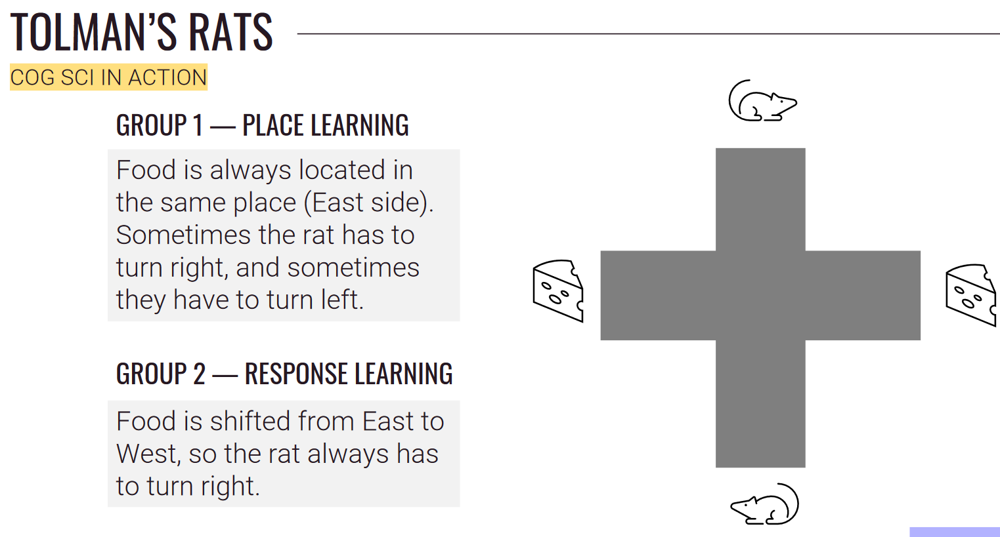
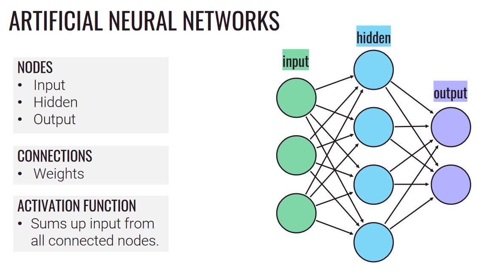
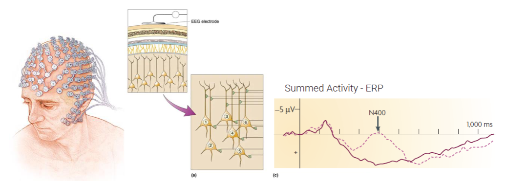

# [Midterm 1](../cog-sci/cog-sci)

## Key Terms

### Module 1 - Introduction
- **Mind:** Minds are different from brain. It is not the physical stuff, but the thinky stuff. In CogSci, we study the mind as an information processor. `See definition below ↓`
- **Interdisciplinary:** Comprising of more than one field of study. CogSci is a *interdisciplinary* study of the mind. There are [multiple fields](#interdisciplinarity-of-cogsci) that contribute to CogSci.
- **Information Processing:** The term information processing refers to the *computation* of information as a I/O pair, like a computer.
- **Functionalism:** See [Functionalism Section Below ↓](#functionalism)

### Module 2 - Foundation
- **Aphantasia:** The mental incapacity to visualize things in your mind.
- **Digital vs Analog representation:** [See Section Below ↓](#digital-vs-analog-representations)
- **Algorithm:** An explicit, step-by-step procedure for answering some questions or solving some problems.
- **Weber's Law:** The discriminability of any two magnitudes is a function of their ratios.
  - In other words, the proportion of the difference between two stimuli and the background is what matters, not the absolute difference.
  - Ex: a quiet library suddenly having someone talking above a whisper is more noticeable than another person starting to yell in a concert.
- Representation Tradeoff: [See Section Below ↓](#representations)

### Module 3 - History
- **Grounding problem:** How you ground your experiences in the physical world. How are you actually experiencing a representation? (*remember the little man and the infinite regress*)
- **Qualia:** You will never know what it is like to be someone else. The term *qualia* is used to describe the subjective experience of something.
- **Latent learning:** Learning that occurs without any obvious reinforcement of the behavior or associations that are learned. Opposes the idea of behaviorism. (*see [Tolman's Rats](#tolmans-rats) below*)

### Module 4 - Computational Mind?
- **CTM (Computational Theory of Mind):** The idea that the mind is a computer as an information processor. Goes hand in hand with functionalism.
- **Turing Machine:** [See Section Below ↓](#turing-machines)
- **Church-Turing Thesis:** 
  - No computational procedure will be considered an algorithm unless it can be represented as a [Turing machine](#turing-machines).
  - A function can be calculable if its values can be found by some purely mechanical process.
- **Information systems:** [See Section Below ↓](#simulation-vs-instantiation)
- **The Frame Problem:** How does the machine know waht is relevant and irrelevant to the task at hand? (Problem is there is a *ton*)

### Module 5 - Artificial Minds
- **Connectionism:** The idea that the mind is a network of interconnected nodes that are constantly changing their connections. (*see [Artificial Neural Networks](#artificial-neural-networks) below*)
- **Emergence:** When the components of a system produce a behavior that is not present in the components themselves.
- **Hebbian Learning:** Neurons that fire together, wire together. 
  - If two neurons are active at the same time, then the connection between them is strengthened.
- Perceptron (***PURGED***)
- **Backpropagation:** Major breakthrough that got us out of the first AI winter.
  - This involved adjusting the weight values for different nodes in the neural network to get the correct output. [See Section Below ↓](#backpropagation)
- **Graceful Degradation:** Even when quite a bit of information is taken away from a system, the connectionism algorithm will still function.
- **Systematicity:** Thoughts are systematic, meaning that if you are capable of thinking "Mary loves John", then you are also capable of thinking "John loves Mary", even though they have two different meanings.
  - These predictable patterns are what make the thoughts we have systematic.
  - Another example: 
    - "Who is the father of Mary's child?" and "Who is the child of Mary's father?" are two different questions, but they have the same answer.
- **Language of Thought Hypothesis:** Thoughts are composed of language-like components with compositional structure.
  - To what extent is your thoughts symbolically structured.
  - As the name suggests, what language is your thought??

### Module 6 - Mind and Brain
- **Cortex:** The outer layer of the brain. The one that gets all folded up and wrinkly.
  - *It is important because the cortex seems to be responsible for the cool thinky stuff like perception and understanding.*
- **Contralateral:** Your left and right hemispheres of your brain are responsible for the *opposite* side of your body.
  - Your right hemisphere is responsible for processing the left eye, and vice versa.
- **Localization:** The idea that different parts of the brain are responsible for different functions. 
  - However, this it is not as simple as that. Other parts of the brain may also contribute.
  - Also, the part of the brain a certain function is localized to may be different for different people.
- **Hemodynamics:** When you use the flow of the blood in order to determine the activity of the brain.
- **Right Ear Advantage:** The right ear is better at processing speech than the left ear. Because in majority of people, speech is localized in the left hemisphere of the brain, which is responsible for the right ear as well.

----

## Interdisciplinarity of CogSci

**Philosophy**:

|                  |                  |                    |
| ---------------- | ---------------- | ------------------ |
| Raises questions | Defines Concepts | Gives us direction |

**Psychology**:

|                           |                             |
| ------------------------- | --------------------------- |
| Focus on mental processes | Learning, memory, attention |

**Neuroscience**:

|                      |                                              |
| -------------------- | -------------------------------------------- |
| Focuses on the brain | Maps mental processes to physical structures |

**Computer science**:

|                           |                                  |
| ------------------------- | -------------------------------- |
| Creating artificial minds | Defines old problems in new ways |

**Linguistics**:

|                                       |
| ------------------------------------- |
| Models language as a cognitive system |

Anthropology:

| Gives us a scope of human culture, behavior, thought |
| ---------------------------------------------------- |

**While original diagrams were all hexagons with these 6 fields, we can really also add:**
- Economics
- Engineering (robotics, AI in robots)
- Biology (Biological system, animal cognition)
- Education
- Genetics
- Sociology

## Multiple Realizability
- A single mental state can be realized by many different physical states.
- This means that the study of minds goes beyond just human minds.
- No mental kind is identical to any specific physical kind.

## Functionalism
- "What makes something a thought, desire, pain (or any other type of metal state) depends not on its internal constitution, but solely on its function, or the role it plays, in the cognitive system of which it is a part." - Janet Putnam
- Mental states are defined by the **functional profiles** or **Computational levels**. `See below ↓`

## Three Levels of Analysis
- **Computational Level**: What is the task that the system is performing and why?
- **Algorithmic Level**: How does the system perform this task?
  - These are the specific steps that the system takes to perform the task.
- **Implementation Level**: How is the system physically realized?
  - The implementation level is the only level that is concerned with the physical world.

## Representations
- Representations are the things that stand for other things.
- Representations of numbers could be the number of fingers you're holding up, our number system, or the tally marks on a piece of paper.
  - Each type of representation gives up something in order to gain something else.
  - Ex: Tally marks are easy to make, easy to add, but hard to sum up if you have a lot of them.

### Mental Representations
- Most mental representations have a *referent* in the real world that the representation stands in for.
  - e.g. Professor Ryan's cat
- The representation has content.
- The bearer of the representation is the thing that realizes the representation.
  - e.g. Professor Ryan's brain

**Examples of Mental Representations**
- Imagistic representations
  - e.g. (Insert picture of money here)
- Propositional representations
  - e.g. "money"
- Symbolic representations
  - e.g. "$"

#### Aphantasia in Mental Representation
- Aphantasia tells us that every person's mental representations are different.
- Although they can not visualize things, they are still good at tasks that may require visualization, meaning that they are using a different type of mental representation.

#### Digital vs. Analog Representations
- Digital representations are discrete and symbolic.
  - e.g. Binary
- Analog representations are continuous spectrum.
  - e.g. Color spectrum

## Mind and Body

**Need to Know**:
- Know the difference between Dualism and Monism
- **Platonic Dualism** - There is a ideal world and then our physical world. The ideal world is perfect and the us in the ideal world has access to all the knowledge in the world. When we think hard enough and in the right way, we are able to access this knowledge.
- **Aristotelian Physicalism:** The distinction between mind and body is the distinction between **form** and **matter**. The mind is just the form of the body.
- **Cartesian Dualism:** The mind and body are made of different substances, literally thinky stuff and gooey stuff.
- **Idealism:** The mind is the only thing that exists and everything you think you know about the world is just a figment of your imagination.
- **Physicalism:** Everything in the world is physically constructed. 
- **Identity Theory:** Mental states are brain states. 
- **Reductionism** - Reducing everything down to the simplest possible explanation.

## Behaviorism
- Only way to learn was behavior and punishment.

**Types of Behaviorism**
- Methodological behaviorism
  - They exist and are important.
- Radical behaviorism
  - They exist but are not important.
- Analytical behaviorism
  - They do not exist so they are not important.
  
## Tolman's Rats

**Experiment**

**Results**

**Finding Rat's Algorithm**

**Results**

**Why it matters** : At this time nobody could figure out how to observe an algorithm in the mind. This was a breakthrough as they just modelled out the algorithm that the rats were using.

## Simulation vs Instantiation

- What makes a computer a computer is not what it is made of, but what it does.
  - Information processing is what it does.
  - A *simulated* computer, is STILL a computer, because what matters is its information processing profile.
- For non-informational systems, what matters is what it is made of.
  - e.g. A simulated car is not a car.
  - e.g. A simulated pizza is NOT a pizza. (I can't eat it)

## Turing Machines
- A Turing Machine is a theoretical machine that can compute anything that is computable.

**Components**
- It has a theoretically infinite tape.
- It has a read/write head that can read and write to the tape.
- It has an alphabet of symbols that it can read and write.
- It has a machine table that tells it what to do based on the symbol it reads and the state it is in.

## Backpropagation

- By comparing the desired outputs to the achieved system outputs, the systems can be tuned to adjust and narrow down the difference between the two as much as possible.

---

### Computability
- A problem is computable if there is a Turing Machine that can solve it.
- This means that, if the Turing Machine is able to compute anything, then you can be computed.

## Chinese Room Argument
- The Chinese Room Argument is an argument against the idea that a computer can think.
- The argument is that a computer can not think because it is just a symbol manipulator.
  - There is no understanding of the symbols.

## Classical Computationalism vs Connectionism

**Computational Theory of Mind vs Connectionism**

| Computational Theory of Mind | Connectionism               |
| ---------------------------- | --------------------------- |
| Symbolic representations     | Distributed representations |
| Serial processing            | Parallel processing         |
| Explicit rules               | Implicit rules              |

## Artificial Neural Networks

## Neuroimaging

### fMRI
- MRI machine is just a giant superconducting magnet that aligns all the protons in your body in the same direction.
- A radio frequency pulse is then sent through the body, which the protons absorb and then they flip.
- After the pulse is turned off, the protons relax back to their original state, emitting a radio frequency signal.
- Now, the **fMRI** uses the MRI machine to measure the blood flow in the brain.

---

- BOLD signal: Blood Oxygen Level Dependent
- No radioactive tracer needed.
- fMRI is correlative, but does not tell you that these brain regions are necessary.
- Doesn’t tell anything about the cognitive process.

Data:

    Spatial resolution: 3-6mm
    Temporal resolution: 3-6 seconds

### EEG (Electroencephalography)
- A EEG scan is not very invasive, being able to measure brain activity from the scalp.
- It is also extremely quick, being able to measure brain activity in real time.

#### Event related potentials

- Each EEG electrode records thousands of neurons firing, and takes the sum of those recordings.
- The event related potential is the average of the EEG recordings over many trials.