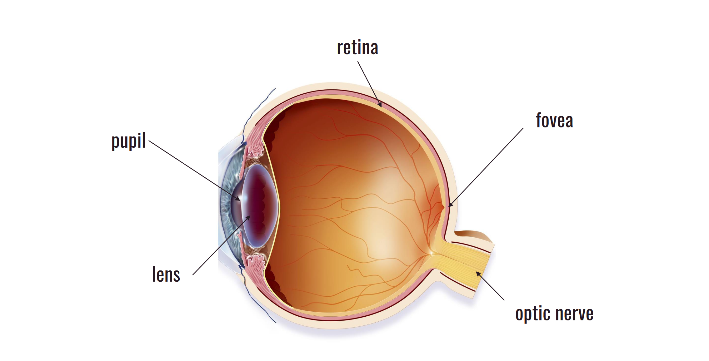
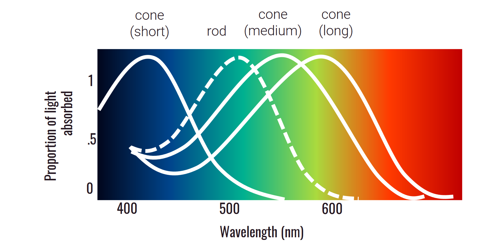

# [Ch7: The Mind's Eye](../cog-sci/cog-sci)

- What is the purpose of perception?
- How do we process information from the senses?
- How do we use that information?

---

**Sensation vs Perception**

- Very distinct differences.
- Sensation is the raw detection of the stimulus. There is no understanding here of what the stimulus is.
- Having some kind of understanding about the stimulus is perception.

### How do we perceive?

#### Sight

- Your eyeball is just a big ball of gooey stuff.
- The purpose of the eyeball is to take in light and convert it into neural signals.
- The signal actually comes in upside down, but you're wired to flip it right side up.

#### Blind Spots
- There is a blind spot in your eye where the optic nerve is.
- You do not notice this because your brain fills in the gap.
- This blind spot occurs because there are no photoreceptors in that area due to our optic nerve being there.

#### Sensation

- Transduction
  - the conversion of a signal from one form to another.

Photoreceptor Cells

### Processing

#### Bottom-Up Processing
- Information flowing from the senses to perception.
- Data driven, you have no idea what you are looking at and let your senses do the work.

#### Top-Down Processing
- Information flowing from world knowledge to perception.
- You know what things should look like so you can fill in the gaps.

#### Modal Completion
- Your mind establishes a contour or edge that does not actually exist.
- Not aided by anything.

#### Color Constancy Effect
- Your mind is able to adjust for the lighting in the room.
- In fact, it likes to subtract the shadow from something to get the true color of the object.
- Tints are also auto-corrected like that.

#### Amodal Completion
- The completion of a contour or edge that is occluded by another object.