


# Design and Analysis of Computer Algorithms

## Introduction

> The [Course site](https://sites.google.com/views/rutgers-cs344-s25)

- Textbook - *Algorithm Design*

#### Grading

- `1000` total points plus bonuses.
	- Homework: `300` points.
	- Midterms: `200 x 2` points plus bonuses.
	- Final: `300` points plus bonuses.
- A curve may be applied depending on the grades.


#### Homework Policy

- Each homework assignment can be done in groups of at most three students.
- Please submit only one copy per group and mention the names and NetIs of all members of the group.
- **Must be written in LaTeX!**
- Grading only counts for completion!!!

#### Exam Policy

- Three exams, midterms are in class.
- All exams are closed book.
- Exam questions will come from lectures homework assignments and exercises in our textbook.
- There will be bonus problems and the max score will be around 130%.

### Why Algorithms

- Cus they interesting.
- Algorithms and the ideas behind them are useful for real-life scenarios.
- They are important (for other courses, research, job interviews, ...)

#### Problem Solving

- Solve many problems.
- *Pattern recognition*.

### First Example: Stable Matching

> The 2012 Nobel Prize in Economics was awarded to Lloyd Shapley and Alvin Roth, for "*the theory of stable allocations and the practice of market design.*"

#### Matching

- There are `n` students applying for jobs/internships. There are `n` positions. Find a bijection (perfect matching) between students and positions.
- Notable examples: the National Resident Matching Program (NRMP) matches U.S. med schools to students.


#### Quiz

> How many perfect matchings are there between `n` students and `n` jobs?

Ans: `n!` - `100 * 99 * 98 * ...`


#### Preference

- Not every matching is good.
- Both sides will have a preference: for example: in job markets, students have preferred jobs, and jobs have preferred students.
- It seems bad if a student and a job are not matched together, but they prefer each other to their current match.
- We will formalize this idea:

#### Notation

- Following the textbook notation, there is:
	- A set $M = {M_1, M_2, ..., M_n}$ of `n` men, and
	- A set $W = {W_1, W_2, ..., W_n}$ of `n` women.
- A perfect matching can be viewed as a bijection $f: M \rightarrow W$. It's inverse is $f^{-1}: W \rightarrow M$. 
- Every person will have their own preferences:
	- Each man `m` ranks all women using a total order $\succ_m$  on `W`. ($w\succ_m w'$ means that `m` prefers `w` to `w'`)
	- Every woman `w` ranks all men using a total order $\succ_w$ on `M`.

#### Stability

> Given a perfect matching $f: M \rightarrow W$, an *unstable* pair is a pair of man `m` and woman `w` who **are not matched together, but prefer each other to their current match;** that is:

$$w \succ_{m} f(m) ; m \succ_{w}f^{-1}(w)$$

- A preference even if they are not matched together. This is an *unstable match.*
	- They must both be unhappy to be an unstable match.
- A perfect matching is *stable* if it has no unstable pairs.

##### Do Stable Matchings Always Exist?

- A priori, it seems unclear whether stable matchings always exist in every instance.
- **Every instance** admits at least *one stable matching.*


#### Gale-Shapley Algorithm

> The Gale-Shapley Algorithm will help find a stable matching and prove that every instance will admit at least one stable matching.


```pseudocode
Initially all m ∈ M and w ∈ W are free  

**while** (there is a free man m who has not proposed to every woman) 
**do**
	Let w be the highest-ranked woman in m’s 
	preference list to whom m has not yet proposed  
	**if** w is free **then**  
		(m, w) become engaged  
	**else** // (w is currently engaged to m′)  
		**if** w prefers m′ to m **then**  
			m remains free  
		**else** // (w prefers m to m′)  
			(m, w) become engaged  
			m′ becomes free  
		end if  
	end if  
end while  
Output the engaged pairs

```

##### Observation

**Lemma:** Gale-Shapley Algorithm outputs a perfect matching.

**Proof:** First, no person can be simultaneously matched with multiple partners at any time. Therefore, we only need to show that there are `n` engaged pairs at the end. Prove by contradiction and suppose that there are at most `n-1` engaged pairs at the end. Then there must be $m \in M$ and $w \in W$ who are free at the end. `m` must have proposed to `w` and therefore `w` must be engaged after that. This contradicts with `w` being free at the end.

---

**Fact:** Once $w \in W$ is engaged, her matches can only get better and better.

---

##### Theorem

> Gale_Shapley outputs a *stable* matching.

- **Proof**:

We need to prove that output matching is stable. Prove by contraction, and suppose that:

- *(m, w)* are matched and *(m', w')* are matched;
- *(m, w')* is an unstable pair: `m` prefers `w'` to `w` and `w'` prefers `m` to `m'`.

Since `m` prefers `w'` to `w` we know `m` must have proposed to `w''`. Therefore, after that, according to the preference of `w'`, her partner must be at least as good as `m`. Therefore, `w'` must prefer `m'` to `m`, leading to a contradiction.

#### Men-Optimality of Gale-Shapley

- **Question:** When there are multiple stable matchings, which one will gale-Shapley pick?
- **Definition:** We call `w` a *valid partner* of `m` (and `m` a *valid partner* of `w`) if (`m,m`) are matched in at least one stable matching.

> In Gale-Shapley, every $m \in M$ is matched with his best valid partner (according to `m`).

#### Women-Pessimality of Gale-Shapley

- **Theorem:** In Gale-Shapley, every $w \in W$ is matched with her worst valid partner (according to `w`).

> **Summary:** Stable matchings always exist, and can be found by the Gale-Shapley algorithm. It is optimal for the proposing side amog all stable matchings.

## Running Time Analysis

### Time Efficiency of an Algorithm

- An algorithm takes an input, *performs some operations*, and then gives an output.
- Even if two algorithms achieve the same function, one of them can be **faster** than the other.
- How do we compare these algorithms and answer which one is faster?

#### Worst-case Analysis

- We will focus on the *worst-case* analysis of running time:
	- For each input size *n*, what is the maximum possible running time *`T(n)`*?
- In other words, `T(n)` is a guarantee that as long as the input size is `n`, the running time will be at **most** `T(n)`.

> You can also define a "average-case" running time. However, worst-case analysis is more widely accepted and captures reality pretty well. **Exception, the simplex algorithm**

#### Focusing on Large Inputs

- We will focus on the situation when the inputs are large: How fast does the running time `T(n)` grow as a function of the input size `n` when $n \rightarrow \infty$?
- For most (if not all) algorithms covered in this course, their performance in the limit ($n \rightarrow \infty$) can usually capture their performance for smaller `n` too.

#### Ignoring the Constant

- We will often ignore the constants in the running time: 
	- $T(n) = f(n)$ and $T(n) = 10f(n)$ are considered to be similar.
	- The exact constants usually depend on the exact implementation.

### Different Running Times

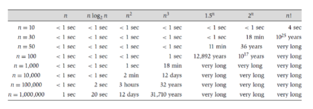

### Assumptions Before Introducing Big O Notation

- Fix an algorithm. Let $T(n)$ be its worst-case running time when the input size is `n`.
- We are interested in the behavior of functions when $n \rightarrow \infty$, and we assume that the functions `f(n)`, `g(n)`, ... are positive (b.c. they are running time.)

### Big O Notation

- We define `O(n)` as the class of functions `g(n)` that satisfy:

$$\limsup_{n \rightarrow \infty} \frac{g(n)}{f(n)} < +\infty. \quad ($\limsup_{n \rightarrow \infty} \frac{g(n)}{f(n)} := \lim_{n\to\infty}\sup_{n' \geq n} \{\frac{g(n')}{f(n')}\})$$ 

- In other words, `O(f(n))` is the class of functions `g(n)` where there is a constant $c \in \mathbb{R}^{+}$ and a number $N\in \mathbb{N}$, so that as long as $n \geq N$, we have $g(n) \leq c*f(n)$.
- In other words, `O(f(n))` is the class of functions `g(n)` where there is a constant $c \in \mathbb{R}^+$, so that for all sufficiently large `n` we have $g(n) \leq c * f(n)$.

> Intuitively, this means $f(n) \in O(g(n))$ means that `f(n)` (ultimately) grows at most as fast as `g(n)`, ignoring the constant.

##### Example

If $f(n)=3n^{2} + 100 n + 7$ and $g(n)=n^2$, then we can write $f(n) \in Og(gn(n))$, or $3n^{2}+100n+7 \in O(n^2)$.

- For example, `O(n)` is the class of functions that grow at most linearly, and `O(n^2)` is the class of functions that grow at most quadratically.
- We will say, for example, an algorithm runs in `O(n)` (or `O(n^2)`, etc...) time to characterize/classify its running time.

### The Notations

#### $\Omega$

> Define $\Omega (f(n))$ as the class of functions $g(n)$ that satisfy $f(n) \in O(g(n))$ (grows at least as fast (bad) as `f(n)`)

#### $\omicron$

> Define $\omicron(f(n))$ as the class of functions `g(n)` that satisfy $\lim_{n\to\infty}\frac{g(n)}{f(n)} = 0$ (grows strictly slower than `f(n)`).

#### $\omega$

> Define $\omega(f(n))$ as the class of functions `g(n)` that satisfy $f(n) \in \omicron(g(n))$ (grows strictly faster than `f(n)`).

#### $\theta$

> Define $\theta(f(n))$ as the class of functions `g(n)` that satisfy $g(n) \in O(f(n))$ and $f(n) \in O(g(n))$ (same growth rate as `f(n)`).

---

##### A Note on `O` and $\theta$

- Many people use `O(f(n))` to refer to $\theta(f(n))$.
- For example, "*sorting `n` numbers via pairwise comparisons must take at least $O(n \log{n})$ time.*" is generally understandable but inaccurate.
	- As Professor Wang says, **please try to use these notations accurately**!!!


### Common Running Times

- For every function `f(n)` above `g(n)` in the list below, we have `f(n) = o(g(n))`.
	- $1$ (constant)
	- $\log_2 \log_2 n$ (double logarithmic)
	- $\log_2 n$ (logarithmic)
	- $\log_{2}^c n$ for a constant c > 1 (polylogarithmic)
	- $n^c$ for a constant c > 0 (polynomial)
	- $a^n$ for a constant a > 1 (exponential)
	- $n!$ (factorial)

### Polynomial Time

> A running time `T(n)` is called *polynomial time* if $T(n) = O(n^c)$.

- Polynomial time is an important concept and is quite robust across different computing models. For example, (a bit informally), polynomial time on a Turing machine is the same as polynomial time in any common programming language.
- If the input size doubles, a polynomial-time algorithm only becomes a constant ($2^c$) times slower (in terms of upper bounds $O(n^c)$). Some people use the word "efficient" to refer to polynomial time.

## Binary Search

**Problem:** We are given `n` integers in weakly increasing order $a_1 \leq a_2 \leq ... \leq a_n$ (stored in an array) and a query $q \in \mathbb{Z}$. Decide whether there is a number $a_i$ in the array that is equal to `q`.

```pseudocode
l = 1, r = n  
while l ≤ r do  
	Let m be ⌊(l + r)/2⌋  
	if am = q then  
		Return “Yes”  
	else if am < q then  
		l ← m + 1  
	else (am > q)  
		r ← m − 1  
	end if  
end while  
Return “No”
```

> The running time is $O(\log n)$. 

## Graphs

> For previous notes on graphs, check out [Discrete 2](../archives/discrete-2/discrete-2#graphs)

- To reiterate what we've learned in the past, **graphs** are a way of encoding *pairwise relationships* among objects.
- This means, A graph `G = (V,E)` consists of a set `V` of vertices and a set `E` of edges.
	- The *vertices `V`* encode the objects.
	- The *edges `E`* encode the *pairwise relationships*. These edges may or may not have directions or weights. The graph with undirected (resp. directed) edges are called undirected (resp. directed) graphs.
		- *Directed graphs can also be called digraphs.*

#### Example of Graph

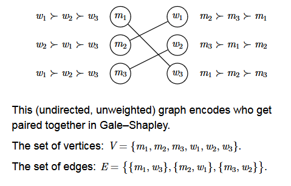

- Other examples may include online social networks: The vertices are users and a directed edge from a person `a` to another person `b` means that `a` follows `b`.
- Or, course scheduling, where the vertices are courses and a undirected edge between that wo courses means there is a conflict between the two.

### Connectivity

> In graph applications, we are often interested in this question: Is there a way to go from vertex `u` to vertex `v`?

#### Walks and Simple Paths

- In an undirected graph `G`, a *walk*`O` is a (finite for our purposes) sequence of vertices ($v_1, v_2, ..., v_k$) with the property that each consecutive pair is joined by an edge in `G`.
	- For a digraph, this definition is the same, except that the consecutive pair must be joined by an edge from $v_i$ to $v_{i+1}$.
- In unweighted graphs, the *length* of a walk is `k-1`, the number of edges in it.

##### Simple Path

> A walk is then called a *simple path* if all vertices on `P` are distinct from one another.


- A walk `P` is then called a cycle if it is also a *simple path*, with the start and end vertices being the same.

##### Quiz

How many walks and simple paths of length 3 are there in the following directed graph?


	Walks: 4 * 3 * 3 * 3
	Simple Paths: 4 * 3 * 2 * 1

#### Graph Connectivity in Undirected Graphs

- The vertices in any *undirected* graph can be divided into *connected components*. Vertices can reach each other via walks if and only if they are in the same connected component. A graph is called **connected** if it has only one connected component. 
- Formally, in an undirected graph, we write `u ~ v` if there is a walk from vertex `u` to vertex `v`. The binary relation `~` is an *equivalence relation* because it is:
	- Reflexive: `u ~ u` for any vertex `u`.
	- Symmetric: If `u ~ v` then `v ~ u`.
	- Transitive: If `u ~ v` and `v ~ w`. then `u ~ w`.
- Each equivalence class is a connected component.

#### Forests and Trees

- A **forest** is an undirected graph without cycles.
- A **tree** is a connected undirected graph without cycles.

> Naturally speaking, a forest is a disjoint union of trees.

##### Quiz

If there are 3 possible trees of 3 vertices, how many possible trees of 4 vertices are there?

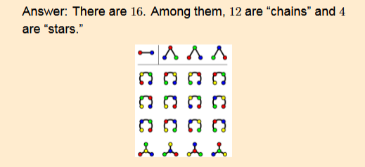

> Cayley's Formula: There are $n^{n-2}$ trees of `n` vertices.

#### Degrees

> In a undirected graph, the *degree*of a vertex is the number of incident edges it has. (An edge from a vertex to itself should be counted twice)

- The sum of the degrees for all vertices in a undirected graph is ALWAYS even.
- In a directed graph, the *outdegree* of a vertex is the number of incident outgoing edges it has, and the indegree of a vertex is the number of incident incoming edges it has. The sum of the outdegrees for all vertices is always equal to the sum of the indegrees.

### Graph Searching

#### Depth First Search

```pseudocode
Initialize S to be a stack with one element s  
while S is not empty do  
	Take a vertex u from the stack S  
	if visited[u] = false then  
		visited[u] = true  
		for each edge (u, v) incident to u do  
			Add v to the stack S  
		end for  
	end if  
end while
```

#### Breadth-First Search

```pseudocode
Initialize Q to be a queue with one element s  
while Q is not empty do  
	Take a vertex u from the queue Q  
	for each edge (u, v) incident to u do  
		if discovered[v] = false then  
			discovered[v] = true  
			Add v to the queue Q  
		end if  
	end for  
end while
```

#### Comparisons between BFS and DFS

- An adjacency matrix takes $O(n^2)$ space. It is easy to check in *O(1)* time whether there is an edge from `u` to `v`.
- An adjacency list takes $O(n+m)$ space. If `m` is much smaller than $n^2$, adjacency lists might perform better than adjacency matrices in many algorithms.
- In the rest of the course, we assume by default that graphs are represented by adjacency lists.
- Both DFS and BFS will run in $O(n^2)$ (and not better) time if using adjacency matrix representation. Both DFS and BFS will run in $O(n+m)$ time if using adjacency list representation.

### Adjacency Lists

> The *adjacency list* representation of a graph is an array `Adj`, where for each vertex `v`, `Adj[v]` contains a list of vertices to which `v` has (outgoing) edges.

- If the graph is directed, one can also maintain an array of incoming edges to each vertex if needed in the algorithm.

### Strongly Connected Components

> The vertices in any *directed* graph can be divided into **strongly connected components**.

1. `u` can reach `v` in a walk and...
2. `v` can reach `u` in a walk.

- A graph is called *strongly connected* if it has only one strongly connected component.

Formally, in a directed graph, we write `u ~ v` if they are in the same strongly connected component. This binary relation `~` is an *equivalence relation* because it is:

- Reflective: `u ~ v` for any vertex `u`.
- Symmetric: If `u ~ v`, then `v ~ u`.
- Transitive: If `u ~ v` and `v ~ w`, then `u ~ w`.

Every equivalence class is a strongly connected component.

### Topological Sorting

> In a directed graph, a *topological ordering* is an ordering $v_1, v_2, ...,v_n)$ of the vertices, so that every edge that goes from $v_i$ to $v_j$ must satisfy $i < j$.

- A directed graph has a topological ordering if and only if it is a directed acyclic graph (DAG).
	- A *DAG* is a directed graph **without** cycles.
	- For example, the prerequisite graph for courses should be a DAG, otherwise the courses in a cycle can never be taken.

#### Topological Sorting Algorithm

- To compute a topological ordering of a graph `G`, we repeatedly do the following steps.
	- Find a vertex `v` with no incoming edges and order it first.
	- Delete `v` and the edges incident to it from `G`.
- This can be done in $O(n + m)$ time if we maintain the indegrees of each vertex.

## Sorting

### Divide and Conquer

##### Quiz: A Tiling Problem

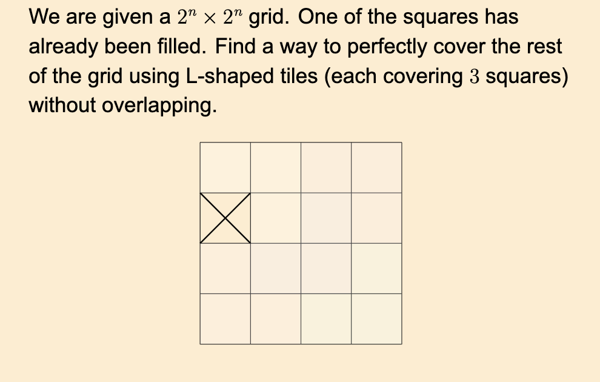

- In order to solve this problem, we need to break it down into quadrants.
- When `n=1`, a single tile is enough. If `n>1`, we must divide the grid into four quadrants, putting a tile in the center touching the three quadrants without an "X" and recurse.

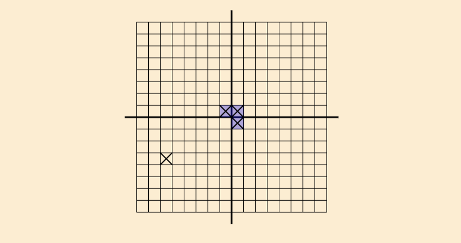

##### Quiz: Fast Exponentiation

> Suppose we need to compute $a^n \mod p$, the remainder after dividing $a^n$ by `p`, for positive integers `a`,`n`,`p`. Can we do it in $O(\log n)$ time (if `a` and `p` are constants)?

Answer:

- If `n` is even, then:
	- $a^n \mod p = (a^{n/2}\mod p)^2 \mod p$.
- If `n` is odd, then:
	- $a^n \mod p = ((a^{\frac{n-1}{2}} \mod p)^2 * a) \mod p$

#### Fast Exponentiation

```pseudo
procedure Exp(a,n,p)       > Compute a^n mod p
	if n <= 1 then
		return a^n mod p
	endif
	b <- Exp (a, [n/2], p)
	if `n` is even then
		Return b^2 mod p
	else
		return b^2 *a mod p
	endif
end procedure
```

#### Sorting in $O(n \log n)$ Time
- We need to sort `n` distinct numberes in increasing order.
- We have seen in a previous lecture that any comparison-based sorting algorithm must take $\Omega(n \log n)$ time in the worst case.
- In this lecture, we will present *two* comparison-based sorting algorithms that run in $n \log n)$ time. Hence their running times are optimal up to constatns.

### Mergesort

> Mergesort involves sorting the first half, then the second half, and then merging the two halves to get a sorted array.

```pseudo
procedure Mergesort(l, r)
	if l >= r then
		Return
	endif
	m <- [(l + r)/2]       > `m` is the midpoint
	Mergesort(l, m)
	Mergesort(m+1, r)
	Merge the two sorted lists. (a_l, ..., a_m) and (a_m+1, ..., a_r)
end procedure
```

#### Merging
- To merge two sorted lists, we can view the two lists as stacks/queues and pop the smaller element each time.

##### Example
- The list are `(4,7,9,10)` and `(2,3,8,15)`. We first compare `4` and `2` and pop the smaller one, `2` from the second list. Next we compare `4` and `3` and. pop the smaller one, `3` from the second list...

#### Time Complexity

Let `T(n)` be the worst-case time complexity to mergesort `n` numbers. We (roughly) have the *recurrence relation*:

$$T(n) = 2T(n/2) + O(n)$$

This solves to $T(n)=O(n\log n)$.

It is important to know how to solve recurrence relations. We will provide a pictorial illustration and a formal proof this time.

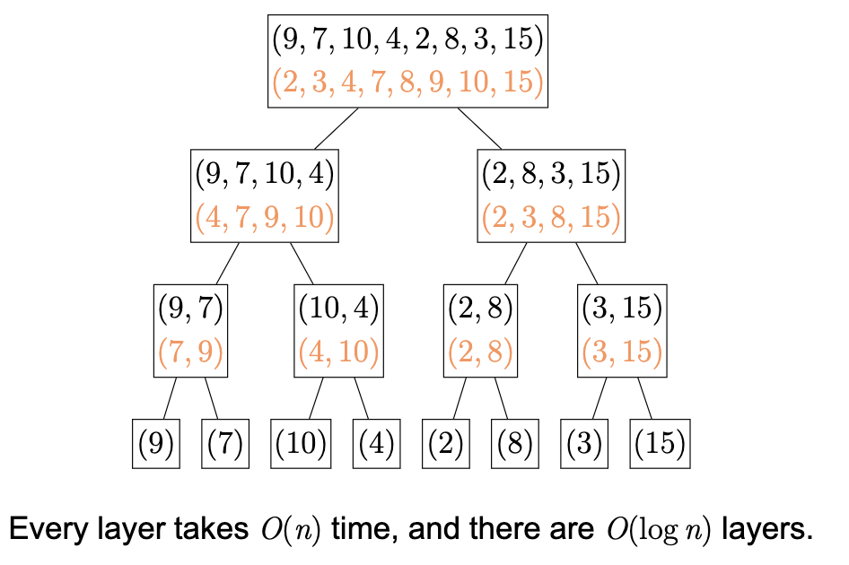

##### Time Complexity Proof

More formally, we have (for all `n > 1` and a constant `c`)

$$T(n) \leq T(n/2) + T(n/2) + cn$$

- and $T(1) \leq c$ and $T(2) \leq c$ and $T(3) \leq c$.
- We postulate that $T(n) \leq 3cn\ln n$ for all `n >= 2` and prove it by *strong induction*.

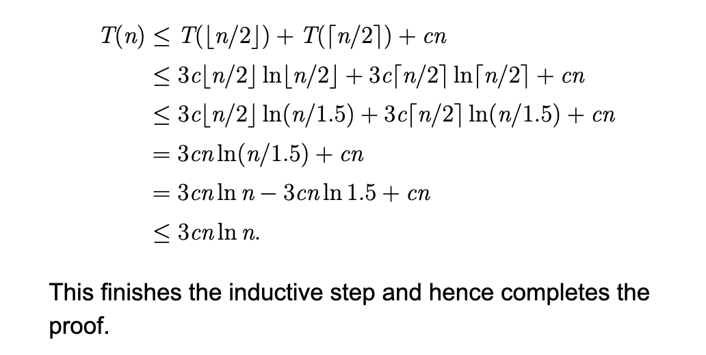

### Quicksort

```pseudo
procedure Quicksort(l, r)
	if l >= r then
		Return
	end if
	Find the median `p` in (a_l, ... , a_r) where p is the "pivot"
	Rearrange (a_l, ..., a_r) and put the number smaller than `p` left to `p` and the numbers larger than `p` right of `p`.
	Let `m` be the index of `p` after the rearrangement.
	Quicksort(l, m-1)
	Quicksort(m+1, r)
end procedure
```

Assume for now we can find the median in linear time.

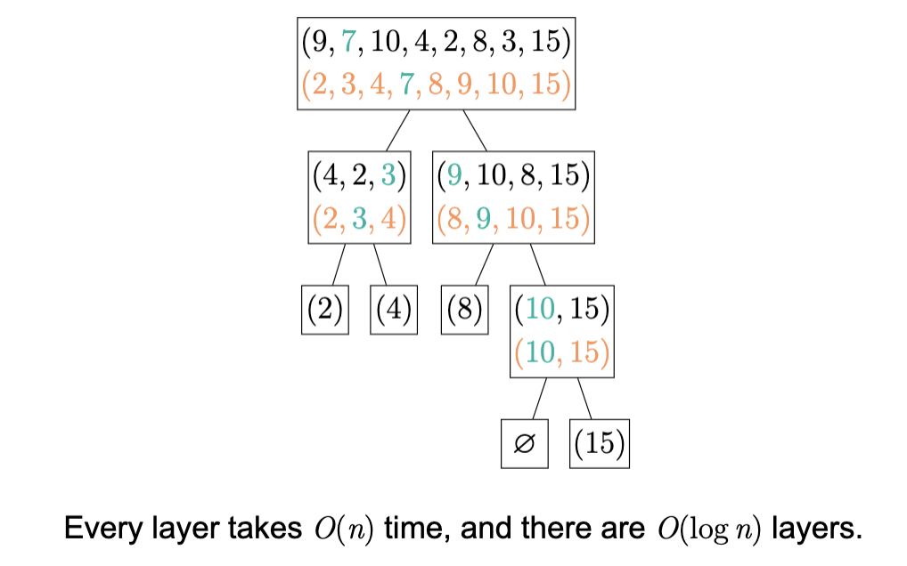

### Median of Medians

- In general, how to find the `k`-th largest element in a set of size `n`?
- This can be done in `O(n)` time using an algorithm called *median of medians*.
- The running time of *quicksort* is hence:
	- $T(n) = 2T(n/2) + O(n)$
- which solves to $T(n) = O(n \log n)$

```pseudo
procedure MoM((a_1, ..., a_n), k)        > Find the k-th smallest
	if n <=10 then
		Brute force and return the solution
	end if
	Divide `a` into `n/5` groups of 5 numbers.
	Let `M` be the medians of each group.           > |M| = n/5
	Find the median of `M` using MoM(M, |M|/2), call it `b` and let its rank in `a` be `k'`.
	If k' >= k then
		Remove everything larger than `b` in `a`
		Return MoM(a', k)
	else
		Remove everything smaller than `b` in `a`, get `a'`
		Return MoM(a', k-k')
	end if
end procedure
```

##### Quiz: Rank of `b`

- Show that the rank of `b` is between `0.3n` and `0.7n`. In other words, $o.3n <=k'<=0.7n$.

Answer: `k' >= 0.3n` because in half the `0.2n` groups, at least 3 elements are smaller than `b`.

`k' <= 0.7n` because in half the `0.2n` groups, at least 3 elements are larger than `b`.

#### Time Complexity of MoM

- Finding the median of meidans takes $T(0.2n)$ time.
- The rank of `b` is between 0.3n and 0.7n, and so recursion takes at most $T(0n.7n)$ time.
- The time complexity isL $T(n) = T(0.2n) + T(0.7n) + O(n)$.

##### Mathematical Induction

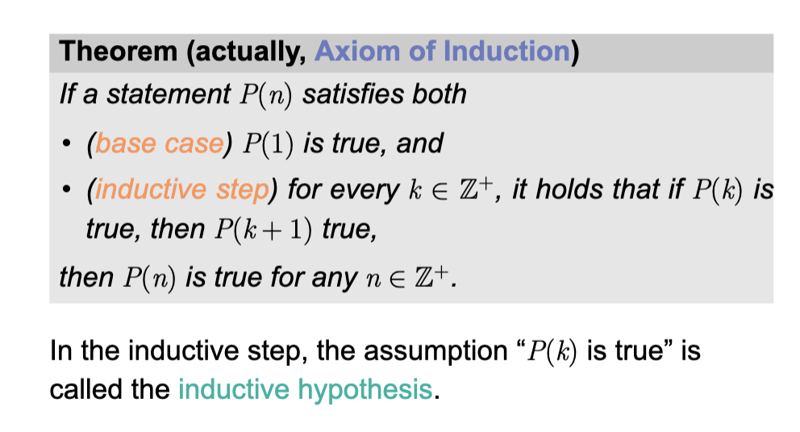

##### Strong Induction

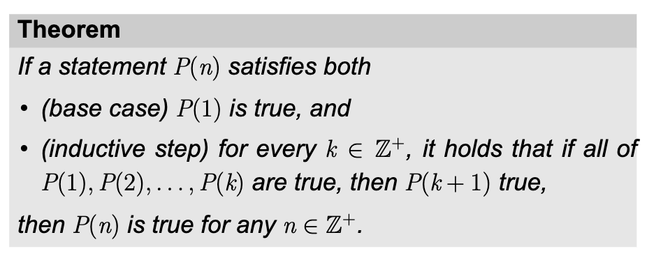

#### Comments on Quicksort

- We can find the median in linear time and use that as the pivot, but in practice, people usually use a *uniformly random element from the current range* as the pivot.
- Random-pivot quicksort can guarantee a running time of $O(n\log n)$ in *expectation*, but the worst-case time will be $\Theta(n^2)$. In practice it is likely faster than median-pivot quicksort due to its smaller time complexity constant.
- Alternatively, we can do this: run random-pivot quicksort and count thenumber of steps, if ti takes too long then fall back to median-pivot quicksort.
	- This method guarantees a worst-case running time of $O(n \log n$) while having a small time complexity constant.

#### Running time of Random Pivot Quicksort

The expected number of comparisons is:

$$\sum_{i=1}^{n}\sum_{i+1}^{n}Pr[i \text{ and } j \text{ are compared }] = \sum_{i=1}^{n}\sum_{i+1}^{n} \frac{2}{j-i+1}$$

$$= 2n \sum_{t=2}^{n} \frac{1}{t}=O(n \log n)$$

> Hence the expected running time of random-pivot quicksort is $O(n \log n)$.

---

##### Example

- Given an array of `n` distinct integers, find the `k`-th smallest one.

> This can be done in $O(n)$ time via *median of medians*.

### Stooge Sort

- Stooge sort is an interesting way to sort `n` numbers.
- The algorithm is very simple. For simplicity, we add to the array at most two $+\infty$'s so that now `n` is a multiple of 3.
	- Recursively sort the first $\frac{2n}{3}$ numbers.
	- Recursively sort the last $\frac{2n}{3}$ numbers.
	- Recursively sort the first $\frac{2n}{3}$ numbers.

#### Time Complexity of Stooge Sort

- The time complexity of Stooge Sort is $T(n) = 3T (\frac{2n}{3})+ O(1)$.
- How to solve this?
- One can still guess and prove by induction, but there is a tool called the *master theorem*.

### The Master Theorem

- In the recurrence relation $T(n) = aT(n/b) + f(n)$ if $a \le 1$ and $b > 1$ are constants and $f(n) \geq 0$, then let $c_{crit} = \log_{b}a$ and we have the following:
	- If $f(n) = O(n^c)$ for $c < c_{crit}$, then $T(n) = \Theta(n^{c_{crit}})$.
	- If $f(n) = \Theta(n^{c_{crit}}* \log^{k}n)$ for a constant $k > -1$, then $T(n) = \Theta(n^{c_{crit}} * \log^{k+1}n)$. 
	- If $f(n) = \Omega(n^c)$ for $c > c_{crit}$ and `f(n)` *satisfies the regarality condition $a*f(n/b) \leq k*f(n)$ for all sufficiently large `n` and some constant $k < 1$*, then $T(n) = \Theta(f(n))$.

> The master theorem is not hard to prove using induction, but is a very useful shortcut for many recurrence relation.

### Closest Pair of Points

> **Problem:** Given `n` points on a Euclidean plane, fine the pair of points with the smallest Euclidean distance.

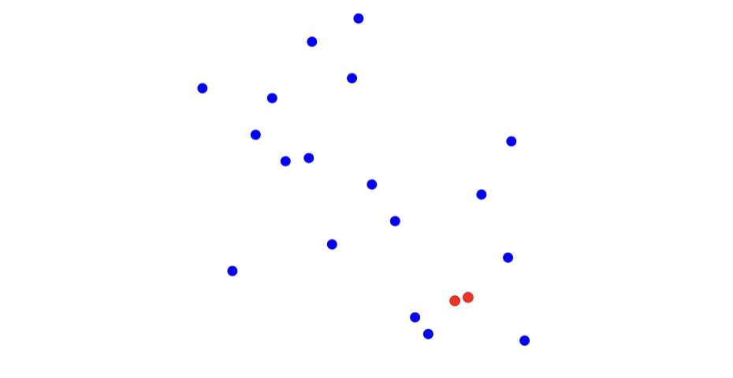

#### Brute Force

The brute force approach takes $O(n^2)$ time.

> Is there a faster algorithm??

#### Ideas

- Maybe it helps to divide the points into subsets.
- The closest pair of points are either in the same subset or in different subsets.
- Recursively solve the problem in each subset, and then find the closest pair of points that come from two different subsets.

##### Divide into Clusters

- Try dividing into two subsets??
- How do we select the two subsets?
	- Since we want the *closest* pair, it makes sense to put the poitns that are close together into the same subset/cluster.
	- A simple guess is to draw a line to divide the points into two halves. Each half is a cluster.

##### Applying the Ideas

```pseudo
procedure Closest(P)       > finding the closest pair in `P`
	if |P| <= 10 THEN
		Enumerate all pairs and return the closest pair.
	end if
	Draw a line `l` that cuts `P` into two clusters P_1 and P_2.
	Closest(P_1) and get distance `d_1`
	Closest(P_2) and get distance `d_2`.
	Compute the closest pair between P_1 and P_2.
end procedure
```

> This way, we only need to compute the closest pair between $P_1$ and $P_2$ if the distance is less than $min(d_1, d_2)$.

#### More Ideas

- Only need to compute the closest pair between $P_1$ and $P_2$ if the distance is less than $d = \min(d_1,d_2)...$.
- Only need to consider points that are less than `d` away from the separating line `l`.

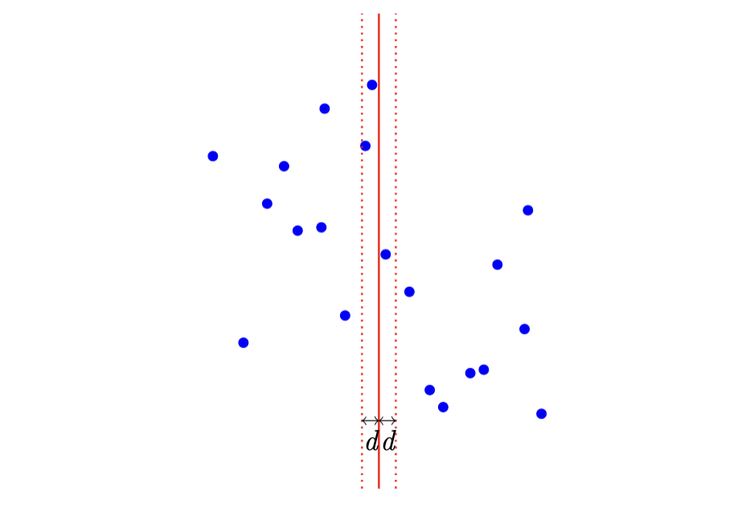

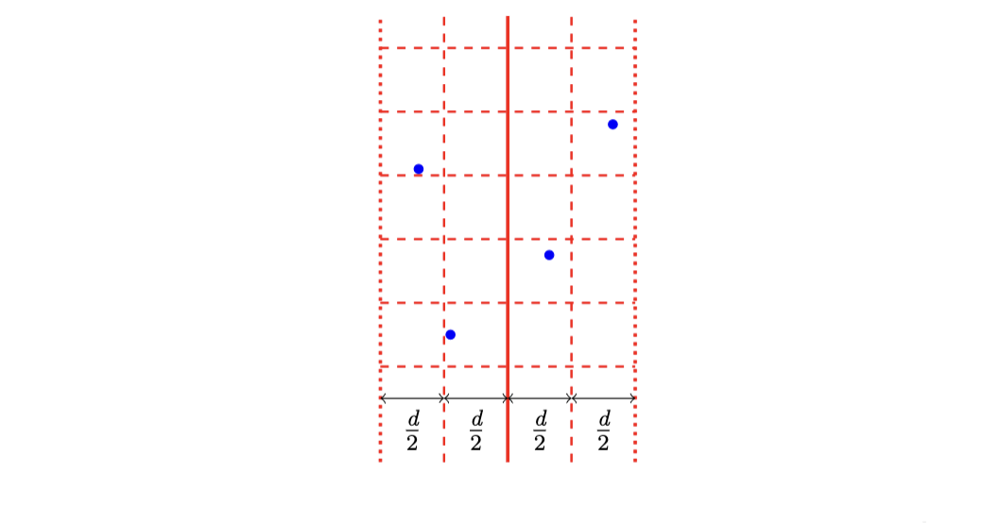

> There is at most one point in each square of side length $\frac{d}{2}$.

```pseudo
procedure Closest(P)        > Find the closest pair in `P`
	if |P| <=10 then
		Enumerate all pairs and return the closest pair
	end if
	Draw a verticle line `l` that cuts `P` into `P_1` and `P_2`
	Closest(P_1) and get distance `d_1`
	Closest(P_2) and get distance `d_2`
	Let `d <- min(d_1, d_2)`
	Focus on the points `Q` in the tape
	Sort `Q` according to their `y`-coordinate
	Check each point in `Q` with the next `11` points in `Q` and update `d`
	Return `d`
end procedure
```

##### Improving the Time Complexity

- It takes `O(n \log n)` time to sort the points at each step.
- Improvement: Sort the points according to their `y`-coordinates in advance, and pass down the sorted array to the recursive calls.

## Polynomial Multiplication

### Problem Statement

- Recall that a univariate *polynomial* `A` of degree at most `n` can be written as:

$$A(x) = a_n * x^n + a_{n-1} * x^{n-1} + ... + a_1 + x + a_0$$

$a_n, a_{n-1}, ..., a_0$ are its coefficients (integers or real numbers).

> Problem: Given two polynomials `A,B` of degree at most `n`, compute their product `AB`.

	n=2. Let A = x²+3x+7 and B = 7x+3. We need to compute AB=7x³+24x²+58x+21.


### Integer Multiplication

- Polynomial multiplication algorithms are useful for multiplying two large integers.

#### Example

> Suppose that we need to compute `137 * 73`. We can construct $A = x^3 +3x + 7$ and $B=7x + 3$ (where `x=10`). Then we compute $AB=7x^3 + 24x^2 + 58x + 21$ and plug in `x = 10`.

Even when the two numbers are large (of `n` digits), there can only be a few nonzero ($O(n \log n)$) digits in the last step, so the last step does not take much time!

### Natural Algorithm

A natural way to compute polynomial multiplication is to use its expansion:

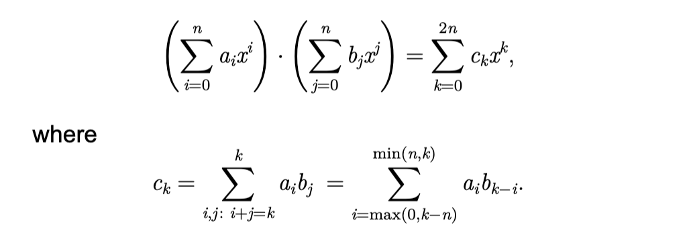


> The (worst-case) running time is `ϴ(n²)`.

### Long Multiplication

0 In the case of integer multiplication, we probably know the *long multiplication*. It can take $\Theta(n^2)$ time.

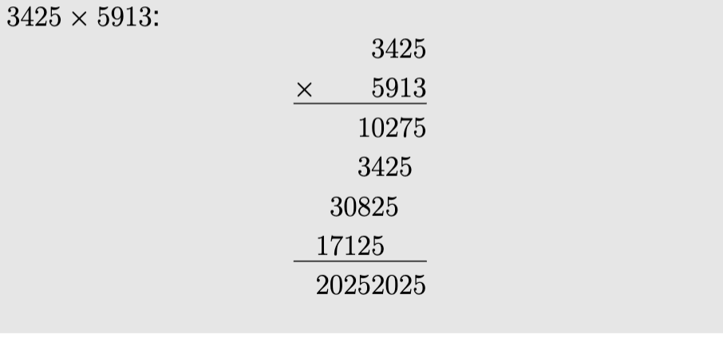

#### Divide and Conquer

> Using divide and conquer, we can create an algorithm that runs in ο(n²) time.

We can "divide" any polynomial of degree `2n-1` into two polynomials of degree `n-1`:

$$A=a_{2n-1}x^{2n-1}+a_{2n-2}x^{2n-2}+...+a_1x + a_0$$

$$= (a_{2n-1}x^{n-1}+a_{2n-2}x^{n-2}+...+a_n)x^n$$
$$+ (a_{n-1}x^{n-1}+ a_{n-2}x^{n-2}+...+a_0$$
$$=A_{high}x^n+A_{low}$$

Then we can compute polynomial multiplication using:

$$AB = A_{high}B_{high}x^{2n}+(A_{high}B_{low}+ A_{low}B_{high})x^n + A_{low}B_{low}$$

> This formula reduces the input size from (2n-1) to (n-1), but there are `4` subproblems.

The running time is: $T(n) = 4T(n/2)+O(n)$.

### Karatsuba Algorithm

> The Karatsuba Algorithm computes $A_{high}B_{high}$, $A_{low}B_{low}$, and $(A_{high}+A_{low})(B_{high}+B_{low})$, and then takes it in order to compute:

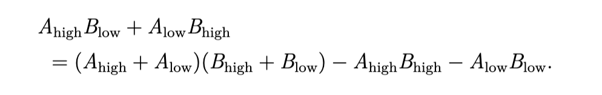

The running time of this algorithm is: $T(n)=3T(n/2) + O(n)$. This is because there are three subproblems of polynomial multiplication of half input size, and the rest are addition and subtraction that only takes linear time.

#### Karatsuba Algorithm Example

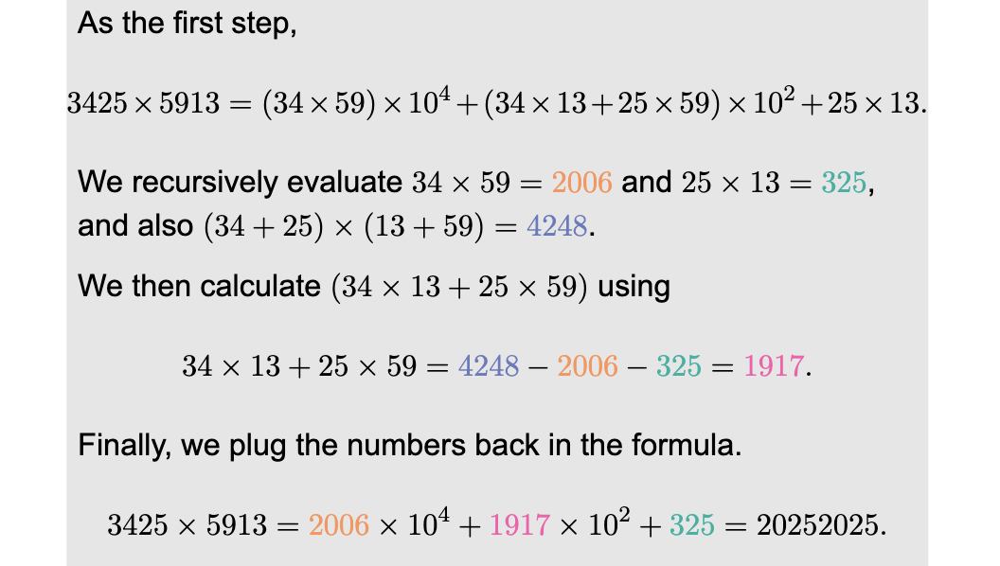

#todo there is still so much fdkajfdkfa

### Fast Fourier Transform

> Also known as *FFT*. It is a very useful algorithm, but requires some knowledge on complex numbers.

#### Facts about Complex Numbers

> Let ℂ be the set of complex numbers. It is a number field, and one can do addition / subtraction / multiplication / division, similar to other number fields like ℚ and ℝ.

- Any complex number can also be written as `a + bi`, where `a ∈ ℝ` is the real part, and `b ∈ ℝ` is the imaginary part. The constant `i` is the imaginary unit. *i²=-1*.

##### Eulers Formula

For any *θ ∈ ℝ*,

$$e^{\theta i}= \cos \theta + i \sin \theta$$

For example,

$$e^{\frac{\pi i}{2}}=i, \space e^{\pi i} = -1, \space$$

## Dynamic Programming

- Talk about dynamic programming introduction
- Some examples
- Longest increasing subsequence.

### Number Pyramid


#important LIS w <= k positions apart very sim to midterm problem??

brute forcing is like a question on the midterm, improving it would be a bonus

dp transition function

