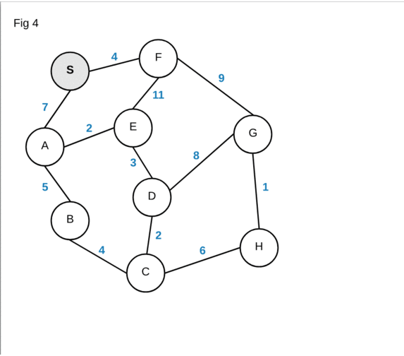

# Midterm 2 Review Notes

## Minimum Spanning Trees

> A *minimum spanning tree* (MST) is a spanning tree that connects every single vertex in a graph with the minimum sum of weights.

### Important Properties

##### The Cut Property

- A cut of a graph divides the graph into two separate groups. The Cut property states that the **smallest** edge that goes between the two groups will always be in the Minimum Spanning Tree.

##### The Cycle Property

- A **cycle** in a graph is a walk that has the starting vertex as the ending vertex as well. If the graph has a cycle, then the largest weighted edge in the cycle **cannot** be in the MST.

### Important Data Structures

#### Fibonacci Heap

> A Fibonacci Heap is a ingenious data structure that uses *amortized* running time by being lazy in the insertion and paying for it in the minimum finding process. 

- The Fibonacci Heap relies on a linked list of binomial trees, allowing most operations to be accomplished in `O(1)` time.

### Algorithms for MSTs

#### Prim's Algorithm

> Prim's Algorithm chooses an arbitrary starting vertex to begin, and *continuously chooses* the smallest edge that connects the reachable section of the graph to the unreachable.

- **Time Complexity:** `O(m log m)`

---

##### Prim's Algorithm w/ Fibonacci Heap

- By using a Fibonacci heap with Prim's algorithm, you can decrease the runtime of the algorithm.
	- The altered algorithm will maintain the *distance* from each vertex to *every other vertex*. (Insert-key)
	- In each step, find the vertex with the smallest distance (Find-key, *accomplishable in constant time*), add it to the solution, and delete it in the Fibonacci heap.
	- Next, check the edges incident to the one we just deleted, and update every distance. (decrease-key)
- **Time Complexity:** `O(e + v log v)` ← `e` is the number of edges, `n` is the number of vertices.

---

#### Kruskal's Algorithm

> Kruskal's Algorithm sorts the edges in increasing order by weight, and continuously selects the **lowest weighted edge** that connects two unconnected vertices and doesn't form a cycle.

- **Time Complexity:** `O(m log m)` using a union-find data structure.

#### Borůvka's Algorithm

> Borůvka's Algorithm starts every vertex off in a separate group. In every round, it chooses the smallest edge that connects two separated groups and connects them together.

- **Time Complexity:** `O(m*r)` ← `m` is the number of edges in the graph, and `r` is the number of rounds the algorithm will run.
	- *Note:* In a normal run of the algorithm, `r` will equal `log n`, as each round will reduce the number of groups by 1/2.

## Shortest Path

> Shortest Path problems involve, as the name suggests, finding the shortest path from one vertex to another vertex.

### Dijkstra's Algorithm

> Dijkstra's Algorithm is a shortest path algorithm that does not work on negative weights, and finds the shortest path from a *starting vertex* to **one** ending vertex.

- Dijkstra's works by choosing the smallest overall weight of the path at each round and taking that path, adding the new edge it took and calculating the new overall weights.

- **Time Complexity:** `O(n²)` ← `n` is the number of vertices.

---

##### Dijkstra's with Fibonacci Heap

- Using a Fibonacci heap, you can lower the running time to `O(m + n log n)`, where `m` is the edges in the graph, and `n` is the number of vertices.

---

### Bellman-Ford Algorithm

> The Bellman-Ford Algorithm is s shortest path algorithm that calculates the shortest path from one vertex to every other vertex. It works for negative weights.

- The Algorithm works by maintaining the smallest path weights from a vertex `s` to every other vertex in an array, starting out the array with infinity as the values.
	- *Note:* The first index is the starting vertex, and will always have a value of 0.
	- *Note:* If there are 6 vertices, the algorithm will run for 5 iterations.
- In each iteration of the array, it will find the out-edges from that vertex and replace the weight of the shortest path if the new value is smaller.

> **Bellman-Ford** does not work for negative cycles, and will detect the negative cycle if it still has not terminated after `n` cycles.

- **Time Complexity:** `O(nm)` ← `n` is the number of vertices, `m` is the number of edges.

### Floyd-Warshall Algorithm

> The Floyd-Warshall Algorithm is a dynamic programming shortest path algorithm that calculates the shortest path between *every* pair of vertices.

- Floyd-Warshall operates by keeping track of a `n` by `n` matrix (`n` is the number of vertices) with zeroes on the diagonals (no vertex in a simple graph has a edge to itself) and beginning with ∞ for everything else.
- In each iteration, it will allow the use of more and more nodes until it has found the shortest path. (Check [here](https://en.wikipedia.org/wiki/Floyd%E2%80%93Warshall_algorithm#Algorithm) for a better explanation)

> https://youtu.be/4OQeCuLYj-4?si=Y73wemww0paEMi3M

