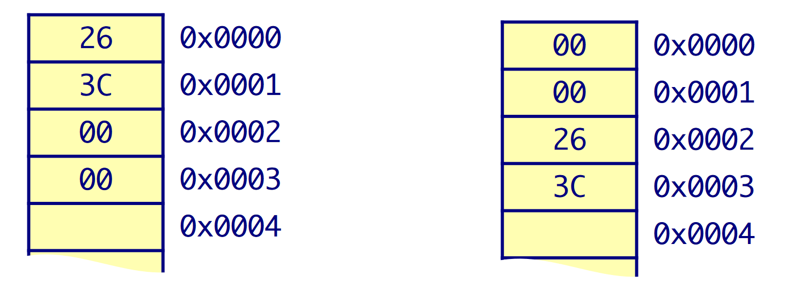

# [Data Representation in Memory](../comp-arch/comp-arch)
#### Byte-Oriented Memory Organization
- **Modern processors: Byte-Addressable Memory**
	- Conceptually a very large array of bytes.
	- Each byte has a unique address.
	- Processor *address space* determines *address range*.
		- 32-bit address space has 2^32 unique addresses: 4GB max.
			- 0x00000000 to 0xffffffff
		- 64-bit address space has 2^64 unique addresses
		
	- Address space size is not the same as processor size!
		- The original Nintendo was an 8-bit processor with a 16-bit address space.
		
### Why use Bits and Binaries?

- Digital transistors operate in high and low voltage ranges.
- Voltage Range dictates binary value on wire.
	- High voltage range (e.g. 2.8V to 3.3V) is a logic 1.
	- Low voltage range (e.g. 0.0V to 0.5V) is logic 0.
	- Voltages in between are indefinite values.
		- The values the in between states take depend on your processor.
- Ternary or Quaternary systems have practicality problems.

### Bits and bytes

- **Computers Use Bits:
	- a "bit" is a base-2 digit.
	- It can only be 0 or 1.
	
- **Single bit offers limited range, so grouped in bytes**
	- 1 byte = 8 bits.
	- a single datum may use multiple bytes.
- **Data representation 101:**
	- Given *N* bits, can represent 2^N unique values.
		- Letters of the alphabet?
		- Colors?

### Encoding Byte values
- **Processors generally use multiples of bytes**
	- common sizes: 1,2, 4, 8 or 16 bytes.
- 1 byte = 8 bits.

**They can be interpreted in many ways!!**

- For example: consider byte: 0101010101_2 (base 2 because it's a binary string)
	- As ASCII text: "U"
	- As Integer: 85_10
	- As IA32 Instruction: pushl %ebp
	- The 86th byte of memory in a Computer
	- A medium gray pixel in a gray-scale image
	- Etc...
	
---

### Binary is Hard to represent!

(Since it can be represented in so many ways)

**Problem with binary - cumbersome to use**
- e.g. appx. how big is: 1110101010101011₂?
- It would take forever to calculate each time.

**Let's Define a larger Base so that:**

 R¹ = 2ˣ

- For equivalence, R and x must be initegers - then 1 digit in R equals x bits.
- Equivalence allows direct conversion between representations.
- Two options closest to decimal:
  - Octal: 8¹ = 2³ (Base 8)
  - Hexadecimal: 16¹ = 2⁴
  
#### So, in order to use it, we change it into a different representation.
- Octal
- Hexadecimal numbers
- Decimals

**Octal and Hexadecimal are closer in size to decimal, BUT...**
- Octal : 8/3 = 2.67 octal digits per byte - BAD
- Hex: 8/4 = 2 octal digits per byte - GOOD

***We will run into alignment issues if we use the octal system... So, Hexadecimal is better***

---

#### Expressing Byte Values

- **Common ways of expressing a byte**
  - Binary: 00000000₂ to 11111111₂
  - Decimal: 0₁₀ to ...

---

**Binary Workshop**

I Have 4 bits to work with (I can represent 2⁴ unique digits.)

	1011 => (1 * 2³) + (0 * 2²) + (1 * 2¹) + (1 * 2⁰) => 11

---

#### Convert Bteween Binary and Hex
- Convert hex to binary
  - Simply replace each hex digit with its equivalent 4-bit binary sequence.
		
		Example:

		6D19F3C₁₆ → Convert to base 2.

		6: 0110 | D: 1101 | 1: 0001 | 9: 1001 | F: 1111 | 3: 0011 | C₁₆: 1100₂

- Convert Binary to Hexadecimal
  - Starting from the radix point, replace each sequence of 4 bits with the equivalent hexadecimal digits.
  - Each **DIGIT** corresponds with 4 bits of information.

---

### Signed VS Unsigned
- Positive numbers are typically "unsigned".
- Negative numbers are "signed"

#### Unsigned Integers - Binary

- **Computers store Unsigned integer numbers in Binary (base-2)
  - Binary numbers use place valuation notation, just like decimal.
  - Decimal value of *n*-bit unsigned binary number:

	`value₁₀ = (n-1)∑(i=0) aᵢ*2ⁱ`

	| 0   | 1   | 1   | 1   | 0   | 1   | 0   | 1   |
	| --- | --- | --- | --- | --- | --- | --- | --- |
	| 2⁷  | 2⁶  | 2⁵  | 2⁴  | 2³  | 2²  | 2¹  | 2⁰  |

	This is all equal to:
	
		(0 * 2⁷) +  (1 * 2⁶) + (1 * 2⁵) + (1 * 2⁴) + (0 * 2³) + (1 * 2²) + (0 * 2¹) + (1 * 2⁰) = 

#### Unsigned Integers - Hexadecimals
- Commonly used for converting hexadecimal numbers
  - Hexadecimal numbers is an "equivalent" representation to binary, so often need to determine decimal value of a hex number.
    - `value₁₀ = (n-1)∑(i=0) aᵢ*16ⁱ`
  - However, remember that there are letters `A-F` which correspond to `10-15` respectively.

#### Unsigned Integers - Convert Decimal to Base-R

- Also need to convert decimal numbers to desired base.
- Algorithm to convert it:
  
	1. Assign decimal number to NUM.
	2. Divide NUM by R
      	1. Save the remainder REM as next least significant digit.
      	2. Assign quotient Q as new NUM
	3. Repeat step b) until quotient is 0.

	Example (Binary):

		52₁₀ = ?₂

		52/2 = 26 r 0 -> First bit
		26/2 = 13 r 0 -> Second bit
		13/2 = 6 r 1 -> Third bit
		6/2 = 3 r 0 -> Fourth bit
		3/2 = 1 r 1 -> Fifth Bit
		1/2 = 0 r 1 -> Sixth Bit

		So total: 110100

	Example (Hexa):

		437₁₀ = ?₁₆

		437/16 = 27 r 5 -> First digit
		27/16 = 1 r 11 -> Second
		1/16 = 0 r 1 -> Most significant digit

		So in Hexa: 1B5₁₆
	
## Negative numbers

**4 Bits** is called a *nibble*.

**8 bits** is called a *byte* (ahaha).

### First Form
- In the case of negative numbers, one form is that 4 bits are allocated for negative numbers.
- The first bit of the sequence keeps track of whether or not the number is negative.
  - For example: `-5 : 1101`

|     | (-?) | 2²  | 2¹  | 2¹  |
| --- | ---- | --- | --- | --- |
| -0  | 1    | 0   | 0   | 0   |
| -1  | 1    | 0   | 0   | 1   |
| -2  | 1    | 0   | 1   | 0   |
| -3  | 1    | 1   | 0   | 1   |
| -4  | 1    | 1   | 1   | 0   |
| -5  | 1    | 1   | 0   | 1   |
| -6  | 1    | 1   | 1   | 0   |
| -7  | 1    | 1   | 1   | 1   |

For this method... **there is a problem**:
- You can not do addition between positive and negative binary numbers.
	- Example: 
  
			-7 + 7
			(This should equal zero)

			Let's represent it as binary.

			1111 + 0111 = (1)0110 (1 gets deleted) Not correct.

### Complement Method of Representing Negatives
- You flip the bits.

|     | 2³  | 2²  | 2¹  | 2¹  |
| --- | --- | --- | --- | --- |
| -0  | 1   | 1   | 1   | 1   |
| -1  | 1   | 1   | 1   | 0   |
| -2  | 1   | 1   | 0   | 1   |
| -3  | 1   | 1   | 0   | 0   |
| -4  | 1   | 0   | 1   | 1   |
| -5  | 1   | 0   | 1   | 0   |
| -6  | 1   | 0   | 0   | 1   |
| -7  | 1   | 0   | 0   | 0   |

- This method flips the bits so:
  - Normally 0 is represented as `0000`, but in the complement, it will be represented as `1111`.

**Addition with this method:**

	-7 + 7 = 0

	1000 + 0111 = 1111 = -0 (very close!)

	-3 + 5 = 2

	1100 + 0101 = (1)0001 (1 gets deleted again) Value is 1 (Off by 1)

Why is it off??
- It's off by 1 because of the value -0 in the complement form.
- So what should we do?
  - Remove the damn -0.

### New Twos Complement Form

|     | 2³  | 2²  | 2¹  | 2¹  |
| --- | --- | --- | --- | --- |
| -1  | 1   | 1   | 1   | 1   |
| -2  | 1   | 1   | 1   | 0   |
| -3  | 1   | 1   | 0   | 1   |
| -4  | 1   | 1   | 0   | 0   |
| -5  | 1   | 0   | 1   | 1   |
| -6  | 1   | 0   | 1   | 0   |
| -7  | 1   | 0   | 0   | 1   |
| -8  | 1   | 0   | 0   | 0   |

#### Addition again with this form:

	-7 + 7 = 0
	1001 + 0111 = (1)0000 (1 gets discarded again), this gets us the actual result (0)

	-3 + 5 = 2
	1101 + 0101 = (1)0010 (1 gets discarded), this gets us 2 (actual result)

---

### Signed Integers - Binary
- Signed binary integers converts half of range as negative
- Signed representation identical, except for most significant bit.
  - For signed binary most significant bit indicates sign.
    - 0 for nonnegative
    - 1 for negative
  - **must know number of bits** for signed representation.

### Signed Integers - Convert to/from Decimal
- Convert Signed binary int to decimal
  - Easy – just use place value notation
- Convert Decimal to Signed Binary Integer
	- MUST know number of bits in signed representation
	- Algorithm:

		1. Convert magnitude (abs val) of decimal number to unsigned binary
		2. Decimal number originally negative?
      		1. If positive, conversion is done
      		2. If negative, perform negation on answer from part a)
            	-  zero extend answer from a) to N bits (size of signed repr)
         		- negate: flip bits and add 1

### Signed Integers - Convert Decimal to Base-R

TODO : FILL OUT

## Representing Strings

### Strings in C
- Represented by array of characters
- Each character encoded in ASCII format
  - Standard 7-bit encoding of character set
  - Character “0” has code 0x30
- String should be null-terminated
  - Final character = 0
- ASCII characters organized such that:
  - Numeric characters sequentially increase from 0x30
	- Digit i has code 0x30+i
- Alphabetic characters sequentially increase in order
	- Uppercase chars ‘A’ to ‘Z’ are 0x41 to 0x5A
	- Lowercase chars ‘a’ to ‘z’ are 0x61 to 0x7A
- Control characters, like `<RET>`, `<TAB>`, `<BKSPC>`, are 0x00 to 0x1A

#### Limitations of ASCII
- 7-bit encoding limits set of characters to 2⁷ = 128
- 8-bit extended ASCII exists, but still on 2⁸ = 256 characters
- Unable to represent most other languages in ASCII.

**How to fix this??**

### Unicode
- First 128 characters are ASCII format
- UTF-8: 1-byte version
- UTF-16: 2-byte version
  - Allows: 2¹⁶= 65,536 unique characters

### Endianness
- Recall that memory is byte-addressable
  - Four bytes in a 32-bit integer, which order are they stored with?

**There are two ways to store : `unsigned X = 15398; // 0x00003C26`**

- Little endian
  - Least significant bits stored first in memory
  - x86 uses this representation
- Big endian
  - Most significant bits stored first in memory.

#### Why does Endianness Matter?
- The CPU is designed to work with whichever the system it has
  - ex: reads, writes, arithmetic will all work correctly.
- But what about sending data to other computers?
  - Need a standard representation for compatibility.
  - Most network standards are big-endian.
  - Sender-receiver must agree to a mutual endianness.
- Some files have byte-order marks (BOM)
  - It is a speciail character or sequence of bytes placed at the begiinning of a text file to indicate the byte order (endianness) and character encoding used withint he file.
  - The primary purpose of a BOM is to help software correctly interpret and process the text data, especially when dealing with multi-byte character encodings like UTF-16, UTF-32.

### Basic Processor Organization

- Register file (active data)
- Arithmetic Logic Unit (ALU)
  - Performs signed and unsigned arithmetic
  - Performs logic operations
  - Performs bitwise operations

### Boolean Algebra
- Developed by George Boole in 19th cetnry.
  - Algebraic representation of logic.
    - He encoded "True" as 1 and "False" as 0.

#### General Boolean Algebras
- Operate on Bit Vectors
  - Operations applied bitwise
  - Bitwise-AND operator: `&`
  - Bitwise-OR operator: `|`
  - Bitwise-XOR operator: `^`
  - Bitwise-NOT operator: `~`

Example:

	  01101001    01101001
	& 01010101  | 01010101
	= 01000001  = 01111101

