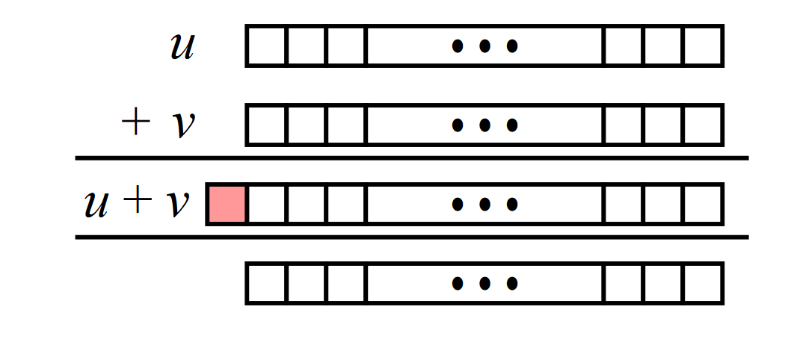
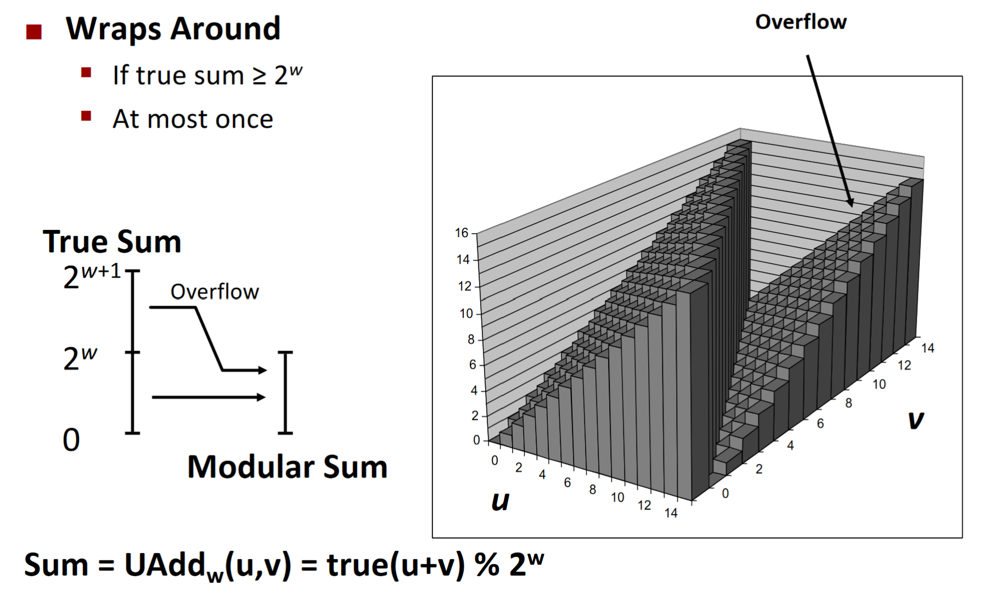
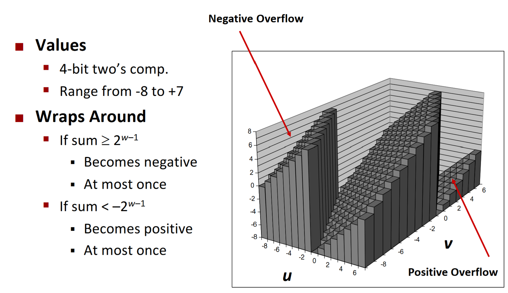
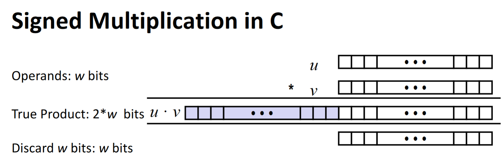
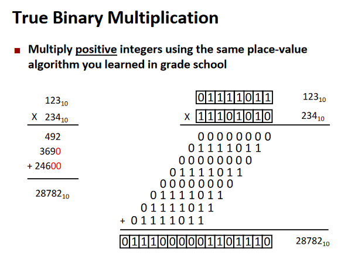

# [Bit-level Operations in C](../comp-arch/comp-arch)

- Operations `&, |, ~, ^`, Available in C
  - Apply to any "integral" data type
    - long, int short, char, unsigned
  - View arguments as bit vectors
  - Arguments applied bit-wise
  - It looks at your argument as a **BIT**, which is different.

#### Contrast: Logic Operations in C
- Contrast to Logical operators:
  - &&, ||, !
    - View 0 as "false"
    - Anthing nonzero as "True"
    - Always return 0 or 1
    - *early termination*
- Examples (`char` data type):
  - !0x41 → 0x00
  - !0x00 → 0x01
  - !!0x41 → 0x01

### Bitwise Operations: Applications
- Bit fields
  - One byte can fit up to eight options in a single field
  - Example: `char flags = 0x1 | 0x4 | 0x8`

### Shift Operations
- **Left Shift**: x << y
  - Shift bit-vector x left of y places
    - Throw away extra bits on left
  - Fill with 0's on the right.

Example:

| Argument `x` | 01100010         |
| ------------ | ---------------- |
| << 3         | 00010 → 00010000 |

- **Right Shift**: x >> y
- Shift bit-vector x right y positions
- There are **two** types of right shifts
  - *Logical Right Shift*:
    - Fill with 0's on the left
  - *Arithmetic Right Shift*:
    - Replicate most significant bit on the right

Example:

| Argument `x` | 01100010          |
| ------------ | ----------------- |
| Log. >> 2    | 011000 → 00011000 |
| Arith. >> 22 | 011000 → 00011000 |

Example 2:

| Argument `x` | 10100010 |
| ------------ | -------- |
| << 3         | 00010000 |
| log. >> 2    | 00101000 |
| arith. >> 2  | 11101000 |

- **Undefined behavior**
  - Shift amount < 0 or >= word size

#### Bitwise-NOT Operator: One's Complement
- Negate a number by taking 2's complement
  - Fliip bits (one's complement)
    - ~x + 1 == ~x

---

### Unsigned Addition

- Operands: *w* bits
- True Sum: *w+1* bits
- Discard Carry: *w* bits

**Addition Operation**
- Carry output dropped at end of addition
- Valid **ONLY** if true sum is within w-bit range.

Example:

	1111 + 0001 = 10000 → True value
	However, 1 gets dropped because out of range.
	Gives us 0000.

Example 2:

	110₁₀: 01101110
	202₁₀: 11001010
	     =100111000 = 00111000 → 56₁₀

	NOT VALID

#### VIsualizing Unsigned Addition
- There is a wraparound or overflow. Once you go over 255, it will wrap back to 0.

### Two's complement Addition
- Operands: *w* bits
- True Sum: *w+1* bits
- Discard Carry: *w* bits

**Signed/Unsigned adds have Identical Bit-level behavior**

**The Only difference is our interpretation of the sign bit value**

#### Signed Addition

Example 1:

	98₁₀: 01100010
	74₁₀: 01001010
	     =10101100 = 1101100 →(First bit is negative) -84₁₀

	NOT VALID in 8-bit signed range (172 > 127)

Example 2:

	-30₁₀: 11100010
	-40₁₀: 11011000
	      =110111010 = 10111010 → -70₁₀
	
	VALID in 8-bit signed range (-70 < -128)

#### Visualizing Signed Addtion

### Multiplication
- Goal: Computing Product of *w*-bit operands x,y
  - This can either be signed or unsigned.
- But, exact results can be bigger than *w* bits
  - *Unsigned*: Up to 2*w* bits
    - Result range 0 ≤ x * y ≤ (2ʷ-1)² = 2ʷ-2ʷ⁺¹+1
  - Two’s complement min (negative): Up to 2w-1 bits
    - Result range: x * y ≥ (–2ʷ⁻¹)*(2wʷ⁻¹-1) = –2²ʷ⁻² + 2ʷ⁻¹
  
**Unsigned**

**Signed**

#### In Binary
- It's like how you multiply normally. Each digit at a time.
  

### Division

#### Unsigned Power of 2 Division
- Division by power of 2 is equivalent to right shift
  - x / 2ⁿ = x >> n
  - Uses *logical* right shift
	- Fill with 0's on the left. Check out [Right shift](#shift-operations)
