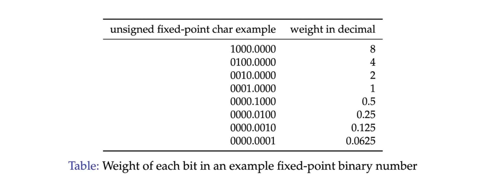
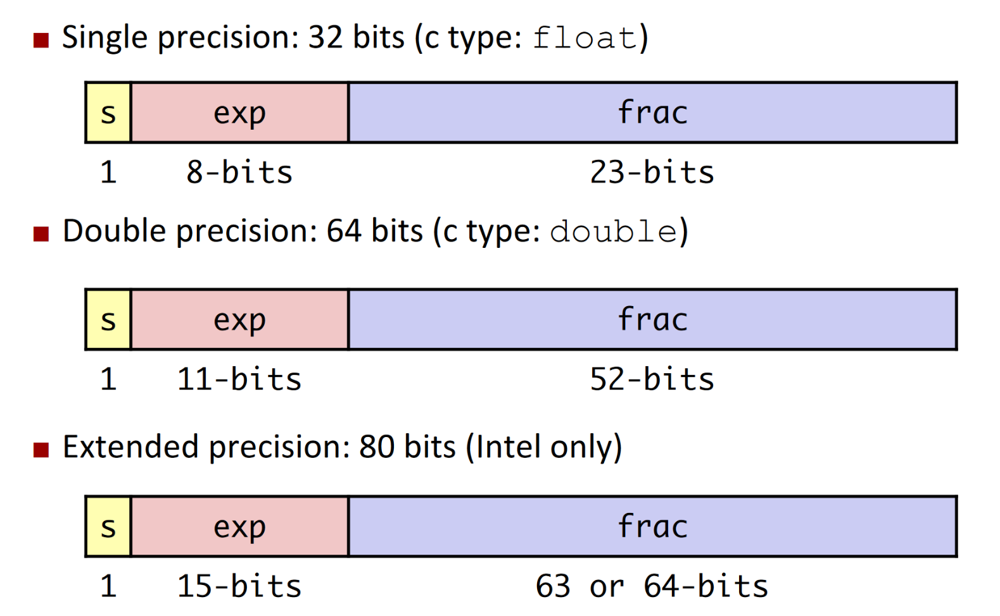
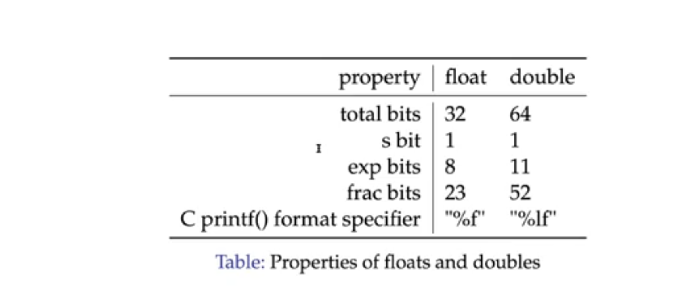
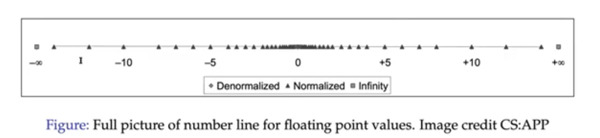
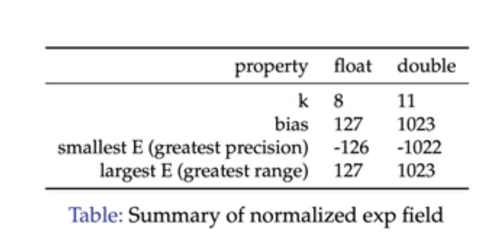
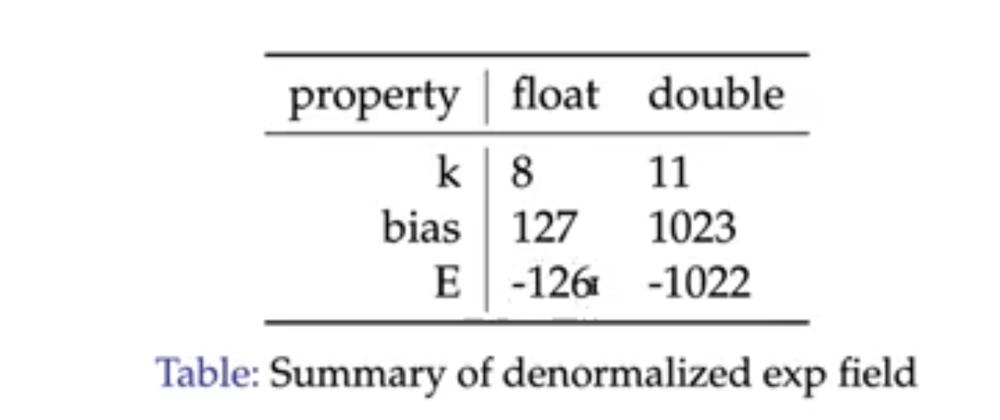
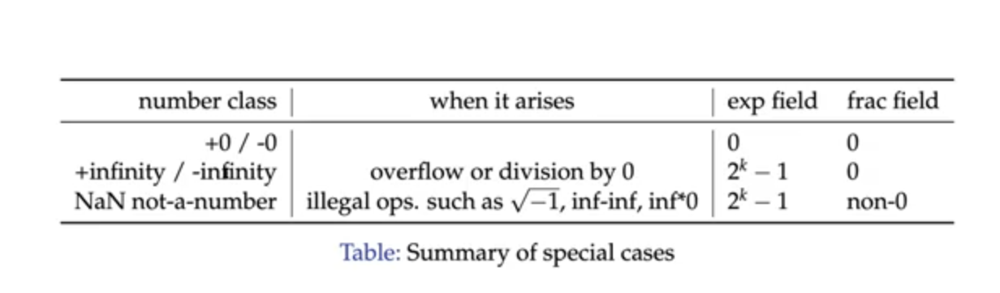

# [Floating Points](../comp-arch/comp-arch)

### Background: Fractional Binary Numbers

Value: 5³/₄ = 101.11₂ → 4 + 1 + ¹/₂ + ¹/₄

**For unsigned fixed-point fractional binary representation:**

- There is, as implied by the term **fixed-point** a fixed number of bits to the left of the decimal point and a fixed number of bits to the right.

So this will look something like this:

	1 1 1 1 . 1 1 1 1

**Weights**:

#### Limitations of Fixed-Point
- Can only represent numbers of the form x/2ᵏ (Some power of 2)
- Can not represent numbers with very large magnitude (great range) or very small magnitude (great precision)

### Floating Point Definition
- The floating point representation is similar to scientific notation
	- > 1.25 * 10³ = 1250\
		> 2.78 * 10⁻² = 0.0278
	- In scientific notation, we have 3 components:
		- Sign
		- Significand (Mantissa)
		- Exponent
- Floating points are basically this exact concept except with an efficient binary format.
  - Uses base-2 instead of base-10
  - Places restrictions on how certain values are represented.
  - Deals with finiteness of representation.

### Types of Floating Points
**Before 1985**:
- Many different floating point formats.
- Specialized machines such as Cray supercomputers had their own formats.
- Some machines with specialized floating point have had to be kept alive to support legacy software.

**IEEE Standard 754**
  - Established in 1985 as uniform standard for floating point arithmetic.
    - Before that, many idiosyncratic formats.
  - Supported by all major CPUs and programming languages.
  - It was designed for good numerical properties.

### Levels of Precision
- Due to the finiteness of data, we can not represent all real numbers.
- That said, we have some options for precision of floating point numbers.

**Single Precision:**
- Single precision is a `float` data type.

**Double Precision:**
- Double precision is a `double` data type.
- 8 bytes and 64 bits long.
- Offers more precision than single precision.

*As you can notice, most of the bits is dedicated to the fractional bit, which is what allows for greater precision.*

### IEEE 754 Number Line
- The IEEE 754 Encoding allows for trade-offs between range and precision.
- There are special *denormalized* values that allow for extreme precision (when trying to represent numbers extremely close to 0) as well as ones that can represent infinity.
  - There is a specific string of bits to represent positive and negative infinity.

### Representation

> **Numerical Form**\
> (-1)ˢ * `M` * 2ᴱ\
> Sign bit `s` determines whether the number is negative or positive.
> Significand (Mantissa) `M` is a fractional binary number in the range `[1,2)`.
> Exponent `E` weights value by power of two. (Describes how much we will shift the number by.)

#### Normalized Form

- **Exponent Field**
  - A number is part of the normalized numbers if the exponent is `0 < exp < 2ⁿ-1`
    - `exp` us a k-bit unsigned integer.
  - Then, because we need to represent both positive and negative exponents, we need to have a bias.
    - Bias = 2ⁿ⁻¹ - 1
    - Bias is the *k*-bit unsigned integer: 011...111₂
  - ***To sum it up***
    - `exp = E + Bias`

Example:

	Convert 12.375 to a single precision floating point number.

	Sign is positive, so s = 0
	Next, write the binary encodign for the 12.375, which is 1100.011₂
	Next, you normalize it into scientific notation, which makes it 1.100011 * 2³ (Now you have your mantissa and exponent)
	** However now you have to encode your exponent into the exponent field.
	exp = E * bias = 3 + 127 (Single precision) = 130₁₀ = 10000010₂

	**Now to encode the mantissa
	When encoding the mantissa for 12.375, you have to drop the leading 1, so you get 100011.
	Then, pad the rest of the bits with 0's until you get 23 bits.
	10001100000000000000000₂

	Finally, you put it all together.
	0 10000010 10001100000000000000000₂

#### Denormalized Form
- For denornmalized numbers, the exponent field is all 0's.

The rules here are slightly different, but there is still a bias.

- Bias = 2ⁿ⁻¹ - 1
- Bias is the *n*-bit unsigned integer: 011...111₂
- ***To sum it up***
  - `E = 1 - Bias`

**Denormalized Frac Field**
- Does not follow the same rules as normalized form.
- The leading value is always 0, but it never gets dropped.

Example:

	Convert -0.013 to a single precision floating point number.

	First the sign bit = 1.

	Next, we need to change it to binary. However, 0.013 is not a power of 2, so we need to convert it to a power of 2.
	0.013 ≈ 0.00000011010₂
	= 1.1010 * 2⁻⁷

	What will be the exponent field no?
	exp = E + bias = -7 + 127 = 120₁₀ = 01111000₂

