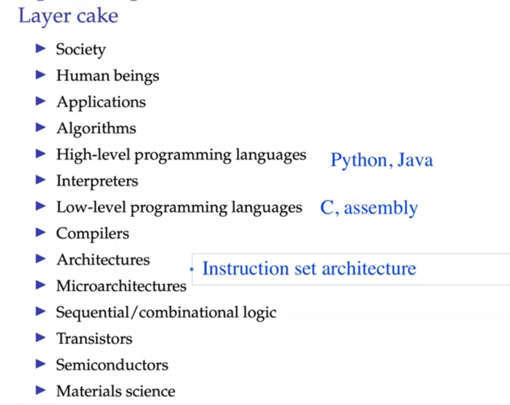
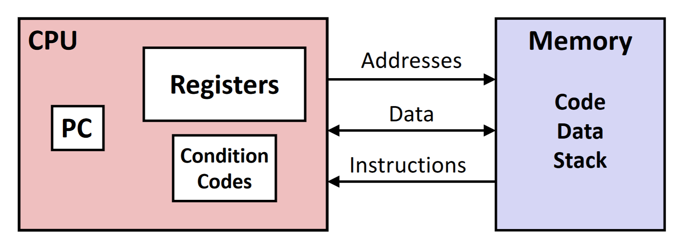

# [Computer Organization](../comp-arch/comp-arch)

### Why is Instruction Set Architecture Important?
- It is the interface between hardware and low-level software.
- Software is varied and can change.
- However, hardware is standard, and fixed.
  
**ISA Can be Traced Back to the 1940's**

Fred Brooks and the IBM 360:
- IBM was selling computers with different capacities.
- However, Fred Brooks had the brilliant idea to make the interface to the hardware is standardized so that hardware can be compile once and ran on all IBM machines.
- That was how the IBM 360 ISA came about.

---

### Computer Architecture (ISA) Classifications

#### CISC - Complex Instruction Set Computers
- Complex instructions targeting efficient program representation
- variable-length instructions
- versatile addressing modes
- specialized instructions and registers implement complex tasks.
- **NOT** optimized for speed - tend to be SLOW.

> Secret: Inside the processor, the CISC instructions are broken down into more elementary instructions.

#### RISC - Reduced Instruction Set Computers
- Small set of simple isntructions targeting high speed implementation
- fixed-length instructions
- simple addressing modes
- many general-purpose registers
- Leads to **FAST** hardware implementations but less memory efficient.

---

#### Is x86 CISC? How does it get speed?
- In order to match the speeds of RISC processors, x86 processors draw a lot more wattage.
- CISC instruction sets make implementation difficult.
  - In order to translate instructions into simpler micro-operations, the CISC system uses somethign called a *microengine*.
  - The microengine is a hardware component that translates the CISC instructions into simpler micro-operations.
  - The reason this CISC instruction set is viable is because of the market share.
- Compararable performance to RISC processors, but at a higher cost.

### Assembly/Machine Code View

#### Programmer-Visible State
- **PC: Program Counter**
  - Address of next instruction to execute
  - Called "RIP" (x86-64)
- **Register file**
  - Heavily used program data
- **Condition codes**
  - Status information about most recent arithmetic or logical operation
  - Used by conditional branch instructions
- **Memory**
  - Byte-addressable array of bytes or words
  - Code and data segments
  - Stack to support procedures
