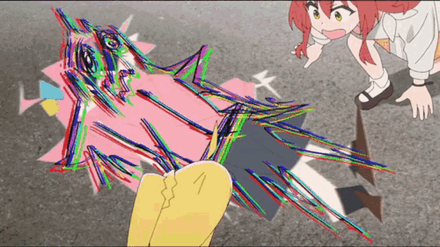
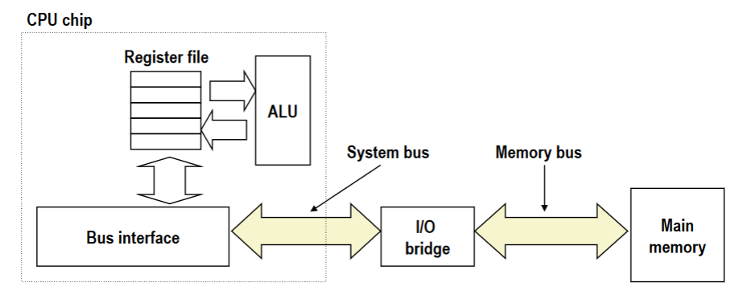
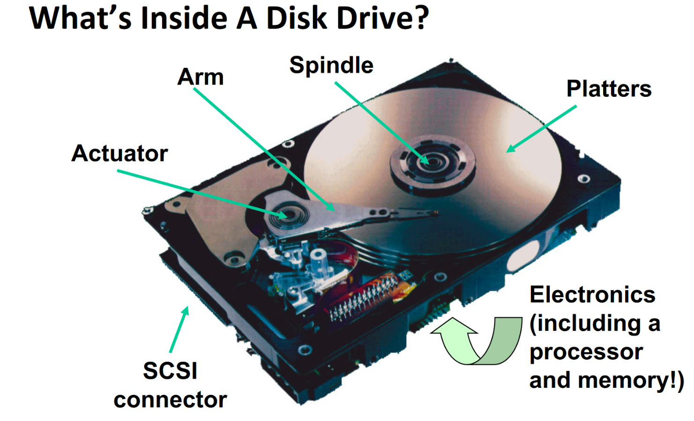
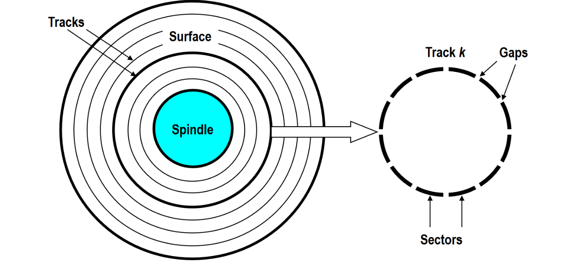
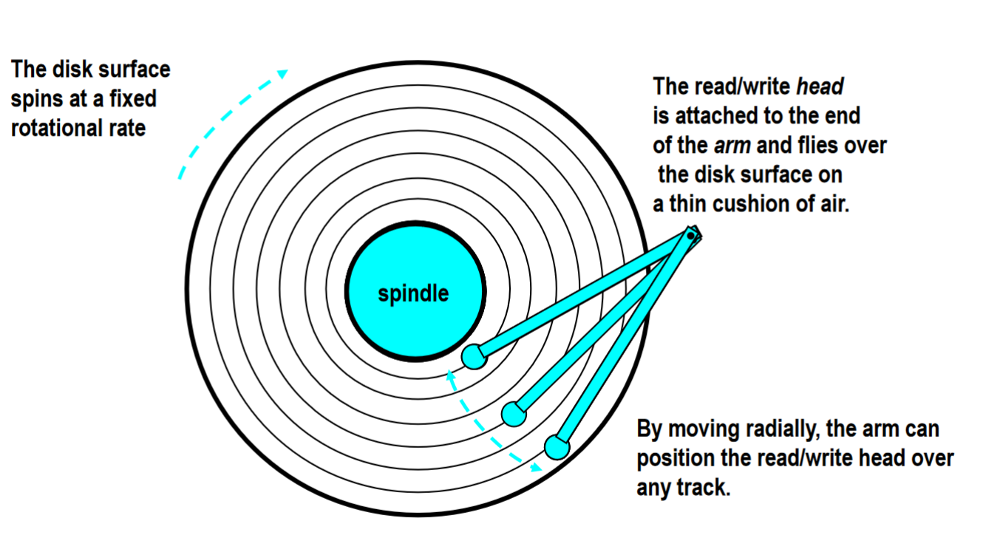
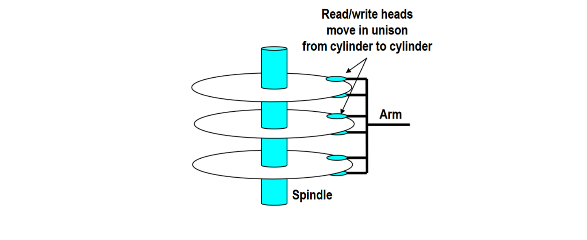

# Memory Hierarchy

---
## Storage Technology and Trends

### Random-Access Memory (RAM)

- **Key features**
	- **RAM** is traditionally packaged as a chip.
	- Basic storage unit is normally a *cell* (one bit per cell).
	- Multiple RAM chips form a memory
- **RAM comes in two varieties**
	- SRAM (Static RAM)
	- DRAM (Dynamic RAM)

#### Nonvolatile Memories

- DRAM and SRAM are volatile memories
	- This means that they will lose information if they are powered off.
- **Nonvolatile memories retain their values even if they are powered off**
	- Read-only memory (**ROM**): Programmed during production
	- Programmable ROM (**PROM**): Can be programmed once.
	- Erasable PROM (**EPROM**): Can be bulk erased (UV, X-Ray)
	- Electrically erasable PROM (EEPROM): Electronic erase capability
	- Flash memory: EEPROMs with partial (block-level) erase capability
		- Wears out after about 100,000 erasures.
- **Uses for nonvolatile memory**
	- Firmware programs stored in the ROM (BiOS, controllers for disks, network cards, graphic accelerators, security subsystems, ...)
	- Solid state disks (Replace rotating disks in thumb drives, smart phones, mp3 players, tablets, laptops, ...)
	- Disk caches.

---

### Bus Structure

Not that bus...

- A **bus** is a collection of parallel wires that carry address, data, and control signals.
- Buses are typically shared by multiple devices.

---
#### Memory Read Transactions

**Load operation:** `movq A, %rax`

1. CPU places address A on the memory bus.
2. The main memory will read the address `A` from the memory bus, and retrieve the associated value in memory for the address and place it onto the bus.
3. CPU will read the value and copy it into the register `%rax`.
	- *Reminder: `%rax` register is for returning values.*

#### Memory Write Transactions

**Store operation:** `movq %rax, A`

1. CPU places a address `A` on the bus. Main memory will read this address and wait for the corresponding data value to arrive from the `%rax` register.
2. CPU will place the data value onto the bus.
3. The main memory will read the data value from the bus and store it at address `A`

---

### Disk Drives

#### Disk Geometry
- Disks consist of **platters**, each with two surfaces. 
- Each surface consists of concentric rings called **tracks**.
- Each **track** consists of **sectors** separated by **gaps**.

### Disk Capacity
- **Capacity**: Maximum number of bits that can be stored.
	- Vendors typically express capacity in units of GB (Gigabytes) where 1 GB = 10⁹ bytes.
- **Capacity is usually determined by these factors**
	- *Recording density* (bits/in): number of bits that can be squeezed into a 1 inch segment of a track.
	- *Track Density* (tracks/in): number of tracks that can be squeezed into a 1 inch radial segment.
	- *Areal Density* (bits/in²): Product of recording and track densities.

### Recording Zones
- Modern disks partition tracks into disjoint subsets called **recording zones**
	- Each track in the zone has the same number of sectors, determined by the circumference of the innermost track. 
	- Each zone has a different number of sectors/tracks, outer zones have more sectors/tracks than the inner zones.
	- So, we use the **average** number of sectors/tracks when computing the capacity.

### Disk Operation

#### Single View

#### Multi-View

