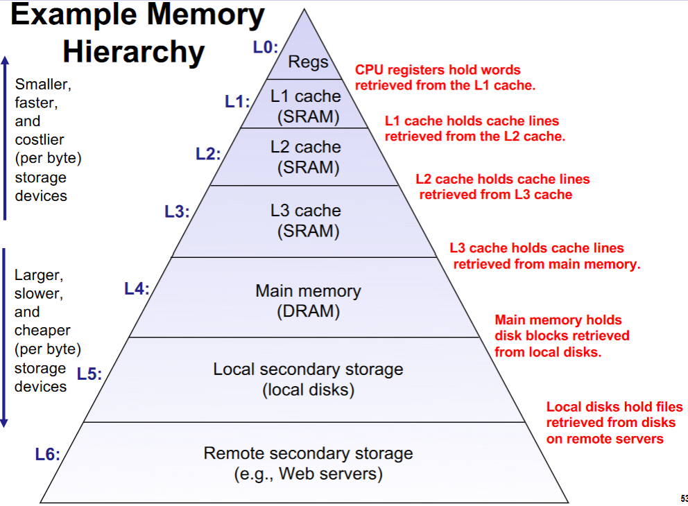
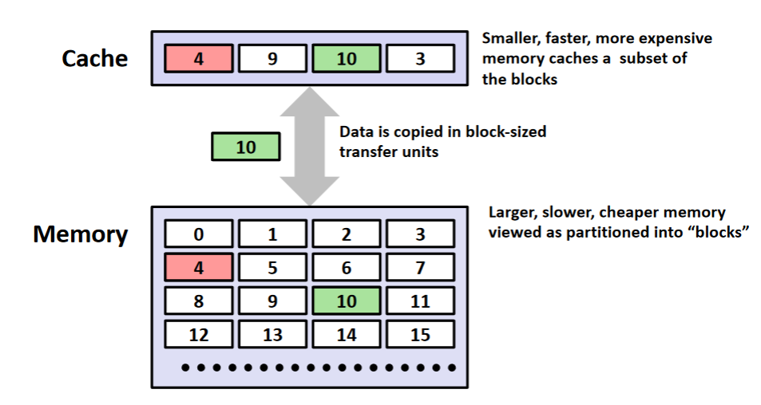

# Memory Hierarchy

---
## Storage Technology and Trends

### Random-Access Memory (RAM)


- **Key features**
	- **RAM** is traditionally packaged as a chip.
	- Basic storage unit is normally a *cell* (one bit per cell).
	- Multiple RAM chips form a memory
- **RAM comes in two varieties**
	- SRAM (Static RAM)
	- DRAM (Dynamic RAM)

#### Nonvolatile Memories

- DRAM and SRAM are volatile memories
	- This means that they will lose information if they are powered off.
- **Nonvolatile memories retain their values even if they are powered off**
	- Read-only memory (**ROM**): Programmed during production
	- Programmable ROM (**PROM**): Can be programmed once.
	- Erasable PROM (**EPROM**): Can be bulk erased (UV, X-Ray)
	- Electrically erasable PROM (EEPROM): Electronic erase capability
	- Flash memory: EEPROMs with partial (block-level) erase capability
		- Wears out after about 100,000 erasures.
- **Uses for nonvolatile memory**
	- Firmware programs stored in the ROM (BiOS, controllers for disks, network cards, graphic accelerators, security subsystems, ...)
	- Solid state disks (Replace rotating disks in thumb drives, smart phones, mp3 players, tablets, laptops, ...)
	- Disk caches.

---

### Bus Structure


Not that bus...


- A **bus** is a collection of parallel wires that carry address, data, and control signals.
- Buses are typically shared by multiple devices.

---
#### Memory Read Transactions

**Load operation:** `movq A, %rax`

1. CPU places address A on the memory bus.
2. The main memory will read the address `A` from the memory bus, and retrieve the associated value in memory for the address and place it onto the bus.
3. CPU will read the value and copy it into the register `%rax`.
	- *Reminder: `%rax` register is for returning values.*

#### Memory Write Transactions

**Store operation:** `movq %rax, A`

1. CPU places a address `A` on the bus. Main memory will read this address and wait for the corresponding data value to arrive from the `%rax` register.
2. CPU will place the data value onto the bus.
3. The main memory will read the data value from the bus and store it at address `A`

---

### Disk Drives


#### Disk Geometry
- Disks consist of **platters**, each with two surfaces. 
- Each surface consists of concentric rings called **tracks**.
- Each **track** consists of **sectors** separated by **gaps**.


### Disk Capacity
- **Capacity**: Maximum number of bits that can be stored.
	- Vendors typically express capacity in units of GB (Gigabytes) where 1 GB = 10⁹ bytes.
- **Capacity is usually determined by these factors**
	- *Recording density* (bits/in): number of bits that can be squeezed into a 1 inch segment of a track.
	- *Track Density* (tracks/in): number of tracks that can be squeezed into a 1 inch radial segment.
	- *Areal Density* (bits/in²): Product of recording and track densities.

### Recording Zones
- Modern disks partition tracks into disjoint subsets called **recording zones**
	- Each track in the zone has the same number of sectors, determined by the circumference of the innermost track. 
	- Each zone has a different number of sectors/tracks, outer zones have more sectors/tracks than the inner zones.
	- So, we use the **average** number of sectors/tracks when computing the capacity.

### Disk Operation

#### Single View


#### Multi-View


---

## Locality
- **Principle of Locality:** Programs tend to use data and instructions with addresses near or equal to those they have used recently.

**Temporal Locality:**
- Recently referenced items are likely to be referenced again in the near future.

**Spatial Locality:**
- Items with nearby addresses tend to be referenced close together in time.

### Examples of Locali

```C
sum = 0;
for(i=0;i<n;i++) {
	sum+= a[i];
}
return sum;
```

- **Data references**
	- Reference array elements in succession (stride-1 reference pattern). → *spatial locality*
	- Reference variable `sum` each iteration. → *Temporal locality*
- **Instruction references**
	- Reference instructions in sequence. → *spatial locality*
	- Cycle through loop repeatedly.  → *temporal locality*

---
## Memory Hierarchies

- **Some fundamental and enduring properties of hardware and software:**
	- Fast storage technologies cost more per byte, have less capacity, and require more power (*which generates more heat*)
	- The gap between CPU and main memory speed is widening.
	- Well-written programs tend to exhibit good locality.


## Caches

- **Cache** is a smaller, faster storage device that acts as a staging area for a subset of the data in a larger, slower device.
- **Fundamental idea of memory hierarchy**:
	- For each k, the faster, smaller, device at level k serves as a cache for the larger, slower deice working at level k+1.
- **Why do memory hierarchies work?**
	- Because of locality, programs tend to access the data at level k more often than they access the data at level k+1.
	- This, the storage at level k+1 can be slower, and thus larger and cheaper per bit.
- **Big idea:** The memory hierarchy creates a large pool of storage that costs as much as the cheap storage near the bottom, but that serves data to programs at the rate of the fast storage near the top.



### Cache Miss
- Data in Block b is needed...
- However, Block b is **not** in the cache: *Miss!*
- Block b is fetched from the memory.
- Block b is stored in cache...
	- **Placement policy:** determines where b goes
	- **Replacement policy:** determines which block gets evicted (victim)

### Cache Performance Metrics
- **Miss rate**
	- Fraction of memory references not found in cache (misses/accesses) = 1-hit rate
	- Typical numbers (in percentages):
		- 3-10% for L1
		- Can be quite small (e.g. < 1%) for L2, depending on size, etc.
- **Hit Time**
	- - Time to deliver a line in the cache to the processor
		- Includes time to determine whether the line is in the cache.
	- Typical numbers
		- 4 clock cycles for L1
		- 10 clock cycles for L2
- **Miss penalty**
	- Additional time required because of a miss
		- Typically between 50-200 cycles for main memory (Trends toward increasing.)