# Memory Hierarchy

---
## Storage Technology and Trends

### Random-Access Memory (RAM)


- **Key features**
	- **RAM** is traditionally packaged as a chip.
	- Basic storage unit is normally a *cell* (one bit per cell).
	- Multiple RAM chips form a memory
- **RAM comes in two varieties**
	- SRAM (Static RAM)
	- DRAM (Dynamic RAM)

#### Nonvolatile Memories

- DRAM and SRAM are volatile memories
	- This means that they will lose information if they are powered off.
- **Nonvolatile memories retain their values even if they are powered off**
	- Read-only memory (**ROM**): Programmed during production
	- Programmable ROM (**PROM**): Can be programmed once.
	- Erasable PROM (**EPROM**): Can be bulk erased (UV, X-Ray)
	- Electrically erasable PROM (EEPROM): Electronic erase capability
	- Flash memory: EEPROMs with partial (block-level) erase capability
		- Wears out after about 100,000 erasures.
- **Uses for nonvolatile memory**
	- Firmware programs stored in the ROM (BiOS, controllers for disks, network cards, graphic accelerators, security subsystems, ...)
	- Solid state disks (Replace rotating disks in thumb drives, smart phones, mp3 players, tablets, laptops, ...)
	- Disk caches.

---

### Bus Structure


Not that bus...


- A **bus** is a collection of parallel wires that carry address, data, and control signals.
- Buses are typically shared by multiple devices.

---
#### Memory Read Transactions

**Load operation:** `movq A, %rax`

1. CPU places address A on the memory bus.
2. The main memory will read the address `A` from the memory bus, and retrieve the associated value in memory for the address and place it onto the bus.
3. CPU will read the value and copy it into the register `%rax`.
	- *Reminder: `%rax` register is for returning values.*

#### Memory Write Transactions

**Store operation:** `movq %rax, A`

1. CPU places a address `A` on the bus. Main memory will read this address and wait for the corresponding data value to arrive from the `%rax` register.
2. CPU will place the data value onto the bus.
3. The main memory will read the data value from the bus and store it at address `A`

---

### Disk Drives


#### Disk Geometry
- Disks consist of **platters**, each with two surfaces. 
- Each surface consists of concentric rings called **tracks**.
- Each **track** consists of **sectors** separated by **gaps**.


### Disk Capacity
- **Capacity**: Maximum number of bits that can be stored.
	- Vendors typically express capacity in units of GB (Gigabytes) where 1 GB = 10⁹ bytes.
- **Capacity is usually determined by these factors**
	- *Recording density* (bits/in): number of bits that can be squeezed into a 1 inch segment of a track.
	- *Track Density* (tracks/in): number of tracks that can be squeezed into a 1 inch radial segment.
	- *Areal Density* (bits/in²): Product of recording and track densities.

### Recording Zones
- Modern disks partition tracks into disjoint subsets called **recording zones**
	- Each track in the zone has the same number of sectors, determined by the circumference of the innermost track. 
	- Each zone has a different number of sectors/tracks, outer zones have more sectors/tracks than the inner zones.
	- So, we use the **average** number of sectors/tracks when computing the capacity.

### Disk Operation

#### Single View


#### Multi-View


---

### Locality
- **Principle of Locality:** Programs tend to use data and instructions with addresses near or equal to those they have used recently.

**Temporal Locality:**
- Recently referenced items are likely to be referenced again in the near future.

**Spatial Locality:**
- Items with nearby addresses tend to be referenced close together in time.

### Examples of Locali

```C
sum = 0;
for(i=0;i<n;i++) {
	sum+= a[i];
}
return sum;
```

- **Data references**
	- Reference array elements in succession (stride-1 reference pattern). → *spatial locality*
	- Reference variable `sum` each iteration. → *Temporal locality*
- **Instruction references**
	- Reference instructions in sequence. → *spatial locality*
	- Cycle through loop repeatedly.  → *temporal locality*

---
## Memory Hierarchies

- **Some fundamental and enduring properties of hardware and software:**
	- Fast storage technologies cost more per byte, have less capacity, and require more power (*which generates more heat*)
	- The gap between CPU and main memory speed is widening.
	- Well-written programs tend to exhibit good locality.


## Caches

- **Cache** is a smaller, faster storage device that acts as a staging area for a subset of the data in a larger, slower device.
- **Fundamental idea of memory hierarchy**:
	- For each k, the faster, smaller, device at level k serves as a cache for the larger, slower deice working at level k+1.
- **Why do memory hierarchies work?**
	- Because of locality, programs tend to access the data at level k more often than they access the data at level k+1.
	- This, the storage at level k+1 can be slower, and thus larger and cheaper per bit.
- **Big idea:** The memory hierarchy creates a large pool of storage that costs as much as the cheap storage near the bottom, but that serves data to programs at the rate of the fast storage near the top.


### Cache Hit


- When the data in a certain block that the CPU is looking for is in the cache.
- If it is in cache, its a **hit**.
- The time it takes for the request to the cache and for cache to transfer block to CPU, that is the **hit time**.

### Cache Miss
- Data in Block b is needed...
- However, Block b is **not** in the cache: *Miss!*
- Block b is fetched from the memory.
- Block b is stored in cache...
	- **Placement policy:** determines where b goes
	- **Replacement policy:** determines which block gets evicted (victim)

---
### Cache Performance Metrics
- **Miss rate**
	- Fraction of memory references not found in cache (misses/accesses) = 1-hit rate
	- Typical numbers (in percentages):
		- 3-10% for L1
		- Can be quite small (e.g. < 1%) for L2, depending on size, etc.
- **Hit Time**
	- - Time to deliver a line in the cache to the processor
		- Includes time to determine whether the line is in the cache.
	- Typical numbers
		- 4 clock cycles for L1
		- 10 clock cycles for L2
- **Miss penalty**
	- Additional time required because of a miss
		- Typically between 50-200 cycles for main memory (Trends toward increasing.)

#### Think about those Numbers
- **Huge difference between a hit or a miss**
	- Could be 100x, if just L1 and main memory
- **Would you believe 99% hit rate is twice as good as 97%?**
	- Consider...
		- Cache hit time: 1 cycle
		- Cache miss time: 100 cycles
	- Average access time: 
		- 97% : 1 cycle + 0.03 * 100 = 4 cycles
		- 99% : 1 cycle + 0.01 * 100 cycles = 2 cycles
	- **This is why miss rate is used instead of "hit rate"**

----

### General Cache Concept
- We are performing a **(%4)** operation on the block number and using that to determine which column in the cache to replace.

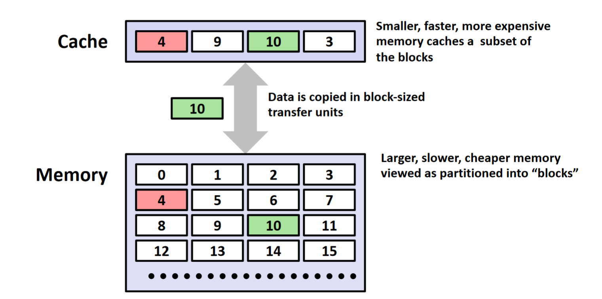

### Types of Cache Misses
- **Cold miss**
	- Cold misses occur because cache is empty
- **Conflict miss**
	- Most cache limit blocks at level k+1 to a small subset (sometimes a singleton) of the block positions at level k.
		- E.g. Block i at level k+1 must be placed in block (i%4) at level k.
	- Conflict misses occur when the level k cache is large enough, but multiple data objects all map to the same level k block.
- **Capacity Miss**
	- Occurs when the set of active cache blocks (working set) is larger than the cache.

#### Cold Miss
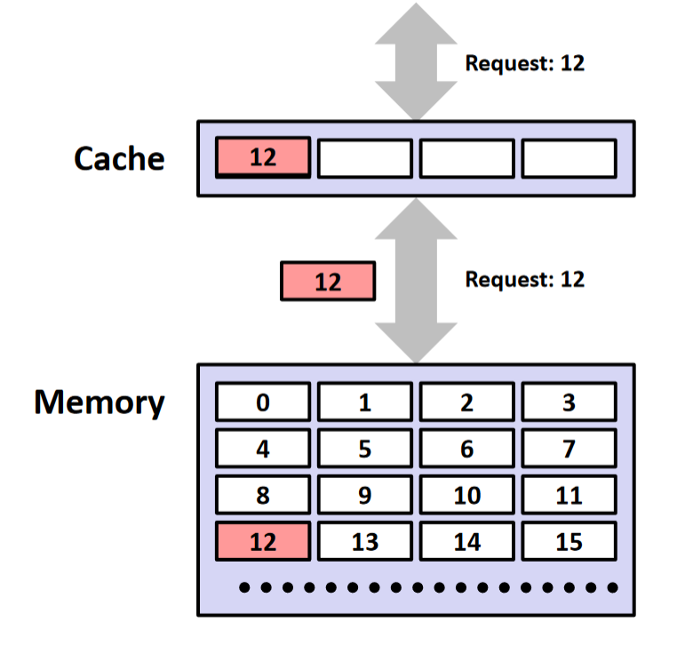
- Data in Block b is needed
- Block b is not in cache: **miss!**
- Block B is fetched from memory...

#### Capacity Miss
#### Conflict Miss
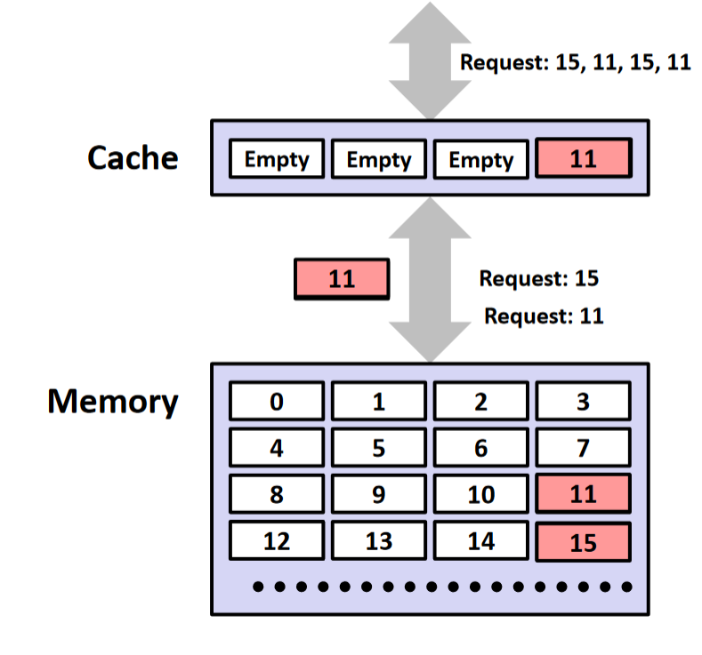
- Data in blocks that map to same location in cache.
- Blocks can not be in cache at the same time.
- You are not using all the blocks because requests keep mapping the same blocks in cache due to conflicts with **modulus.**

---

### Cache Organization

**Block size: (B)** Unit of transfer between cache and memory
- Given in bytes and always a power of 2 (e.g. 64B)
- Blocks consist of adjacent bytes (differ in address by 1)
	- Spatial locality: *only reason why caching works!*
- **Offset field**
	- Low-order **log₂(B)** = *b* bits of address tell you which byte within a block.
		- (Address) % 2ⁿ = *n* lowest bits of address.
	- (Address) modulo (# of bytes in a block.)

> So, to figure out the block number to put a certain bit sequence in you would first calculate the offset, lop off the offset, and then the remaining bit pattern is your block pattern.

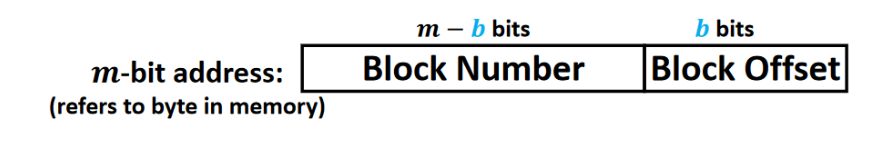
So...

**Block number**: Calculable with what we said above.

**Offset number:** Just subtract the block number from the size of the actual bit address.

#### What's a cache block?
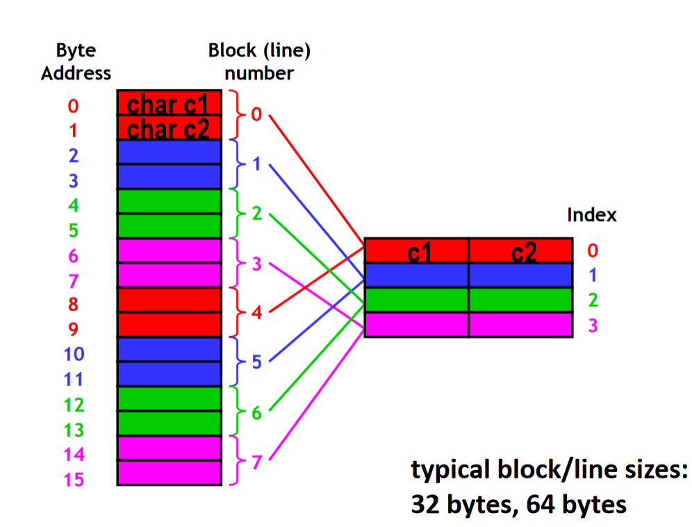
- The cache block will store multiple bytes of memory on the same block.

#### Example Question
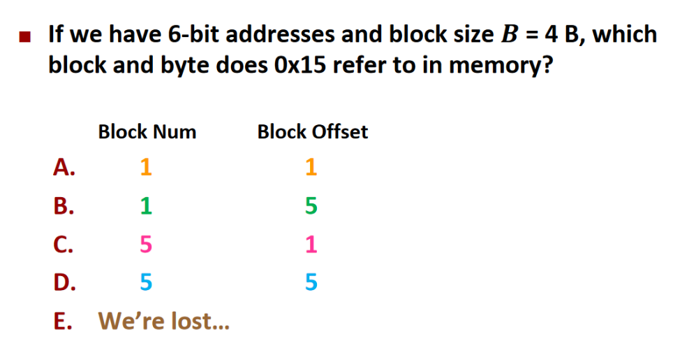

Ans: **C**

---

### Cache Organization 2
- **Cache Size (C): Amount of data that cache can store**
	- Cache can only hold so much data (subset of next level)
	- Given bytes (C) or number of blocks (lines (C/B)
- **Where should data go in the cache?**
	- We need a mapping from memory addresses to specific locations in the cache to make checking the cache for an address **fast.**
- **What is the data structure that provides fast lookup?**
	- Hash tables!!!!

### Hashing Memory Addresses for Cache
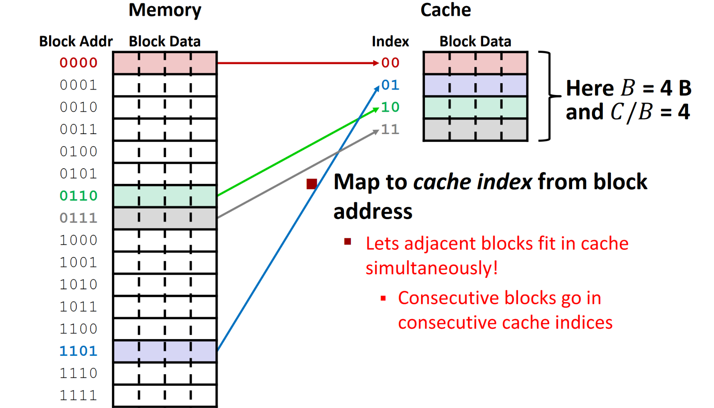

**Puzzle**:

	Starting off with empty cache.
	Fetch Address 10 (Miss!)
	Fetch Address 11 (Hit!)
	Fetch Address 12 (Miss!)

> In this situation, fetching address 10 results in a [**cold miss**](#Types-of -Cache-Misses). This fetches the block containing address 10 from the memory and puts it on the cache. 
> Then, Address 11 was a hit, meaning that address 11 is in the same block as address 10. 
> However, Address 12 results in a miss, meaning address 12 is not in the same block as address 11 and 10.

---
### Tag Differentiate Blocks in Same Index

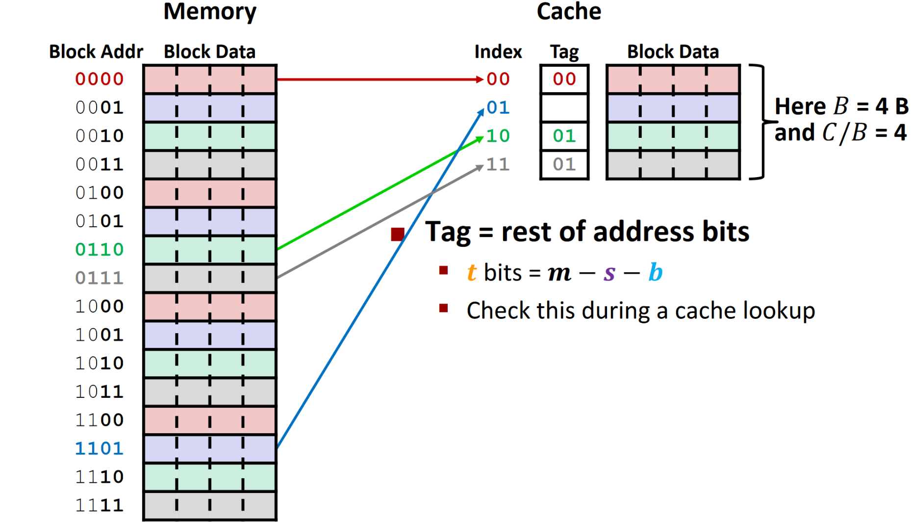

---

### Checking for a Requested Address

- **CPU sends address request for chunk of data**
	- Address and requested data are not the same thing!
	- Ex: Your friend ≠ their phone number...
- **TIO Address breakdown**

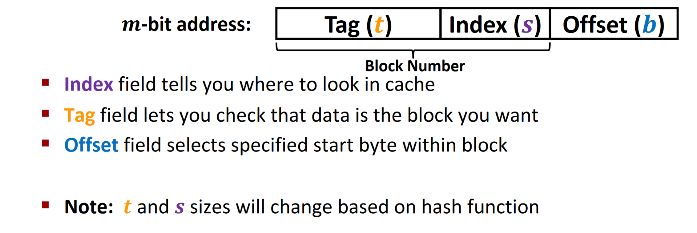

**Example**

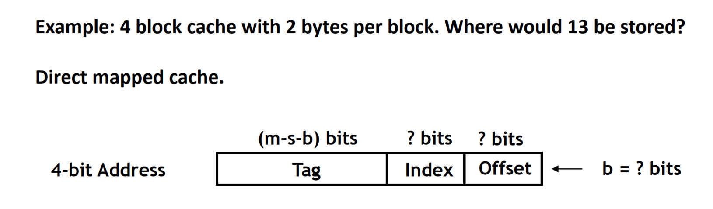

	Calculate Offset bit: log₂(Block size) = log₂(2) = 1 (Offset bit size)
	Calculate index bits size: # of bits it takes to store addresses of your cache size: 4 blocks in cache, so 2 bits to store that address.
	Tag: Remaining bits... 4-3 = 1... 1 bit tag.

	T: 1
	I: 2
	O: 1

	So, the address 13 would be stored at 1101, or at block 6, which would have an index of 10 and a tag of 1.

---

## Types of Caches

### Direct-Mapped Cache

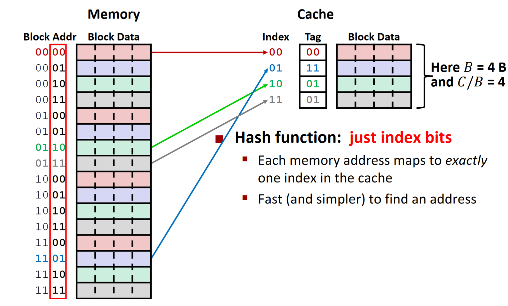

- Direct mapped cache is just the TIO formatted cache that we have been looking at earlier.

#### Problem with Direct-Mapped Cache
- What will happen when we have to access the following... 2, 6, 2, , ....
- Both of those will map to index `10` in the cache, which results in [conflict misses](#types-of-cache-misses)...
- The rest of the cache goes *unused!*

### Associativity **IMPORTANT!!!**
- What if we could store data in any place in the cache?
	- More complicated hardware = more power consumed, slower.
- So, we combine associativity and direct-mapping:
	- Each address maps to exactly one *set*
	- Each set can store block in more than one *way*

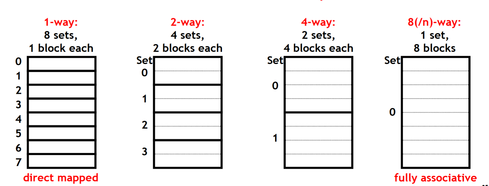

> Basically, think of the cache as being split into different arrays that use linear probing to take the blocks in memory that would map to the same cache address and be able to fit more of them in one single "set."

### Set Associative Cache Replacement

- Any empty block in the correct set may be used for storing data.
- if there are no empty blocks, which one should we replace?

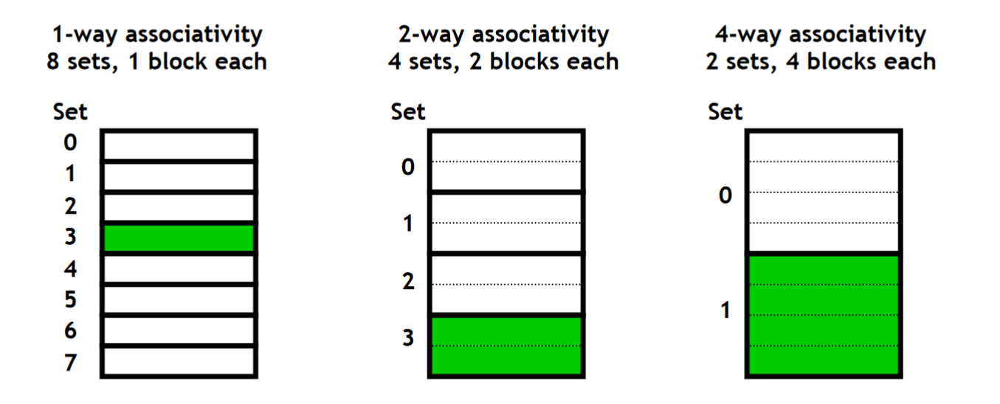

- In a 2-way or greater, **We must replace something, but what?**
	- Cache typically use something close to **Least recently used (LCU)**
	- It kicks out the block that was least recently used.

## General Cache Organization

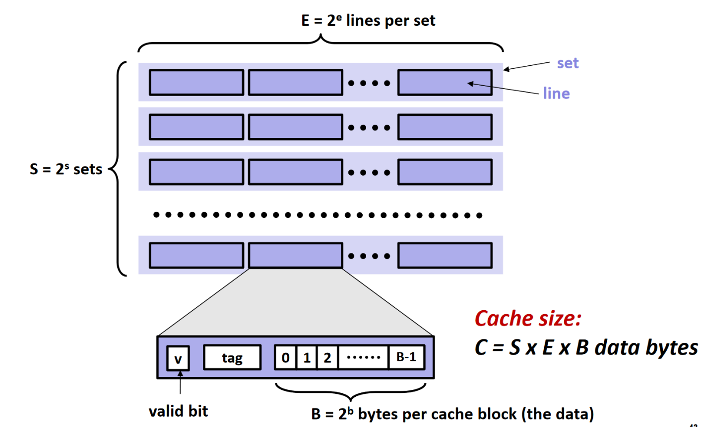

- The cache contains a valid bit at the beginning of each set.
	- Because even when the cache is "empty", it could just contain a bunch of garbage values.
	- To differentiate, the CPU sets a valid bit to keep track of which is what.

### Writing Data

- **Multiple copies of data exists**
	- L1, L2, L3, Main memory, disk
	- It must keep some form of consistency when writing data.
- There is also a **write-hit** and **write-miss**

#### Write Hit
- **Write-through** (write immediately to memory)
- **Write-back** (defer writing to memory until replacement of line)
	- Need a dirty bit (line different from memory or not)

#### Write Miss
- Write-allocate (load into cache, update line in cache)  
	- Good if more writes to the location follow  
- No-write-allocate (writes straight to memory, does not load into cache)  
- **Typical**  
	- Write-through + No-write-allocate
	- **write-back** + **write-allocate**

