# [Computer Architecture Midterm](../comp-arch/comp-arch)

## Computer Overviews
- There are two types of computers...
  - Fixed Computers: Computers that are designed to do a specific task and have their programs built in when manufactured. (e.g. calculators)
  - Stored computers: Computers that can be programmed to do different tasks. (e.g. PCs)

### The Von Neumann Model

According to the Von Neumann Model, a computer consists of the following components:
- A single, shared memory for programs and data
- A single bus for memory access (read/write on only 1 bus)
- An arithmetic unit (ALU)
- A program control unit (PCU)

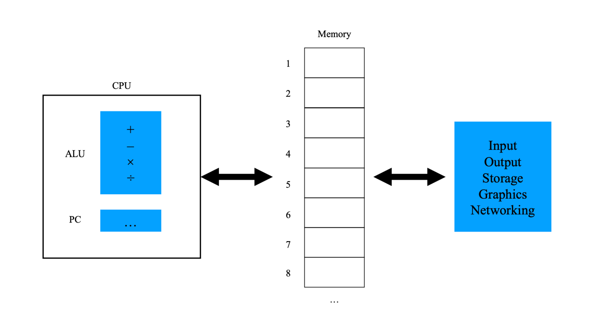

**Problems with the Von Neumann Model**
- The Von Neumann Model is not scalable. The bus is a bottleneck for the system.
- The instructions and the operations could only be operated one at a time.

### The Harvard Model
- The Harvard Model corrects this problem by having separate buses for instructions and data.

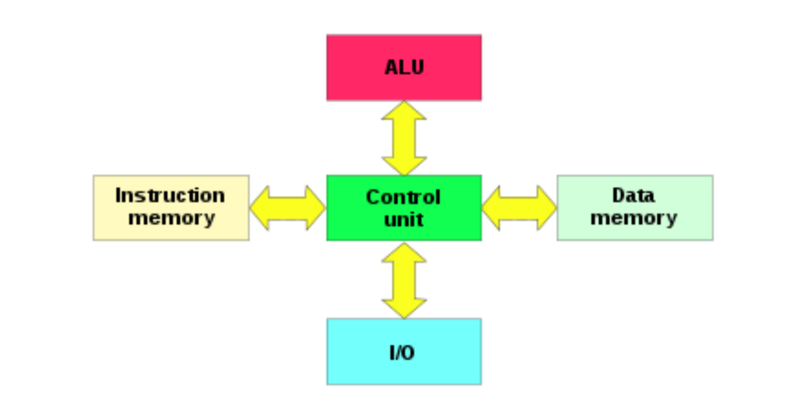

## C Programming

### Compilation Process Overview

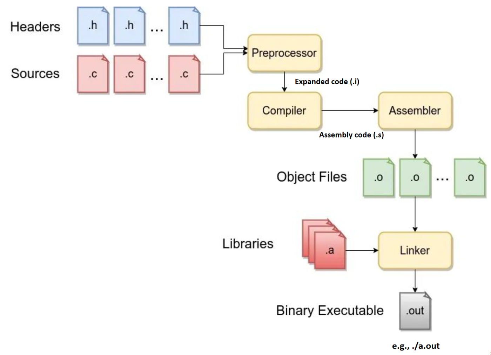

**Preprocessing**
- Comments in the source files are removed
- Macros are expanded
- Inclusion of header files (.h)
- Conditional compilation
  - `#ifdef`, `#ifndef`, `if`, `#else`, `#endif`, `elif`

After preprocessing, the file has a `.i` extension.

**Compilation**
- The preprocessed file is converted into assembly code
- The output will produce another intermediate file with a `.s` extension
- *Syntax errors and warnings are reported at this stage*

**Assembler**
- The assembly code is converted into (object) machine code using the assembler.
- The assembler will produce an object file with a `.o` extension.
  - The assembler will name the file the same name as the source code.
  - e.g. `hello.c` will produce `hello.o`

**Linker**
- The linker will link the object files together with the object code from the libraries.
  - e.g. using `printf()` calls the `printf()` function from the `stdio.h` library, which needs to be linked in the linker.
- The linker then generates a executable file.

### Memory Layout

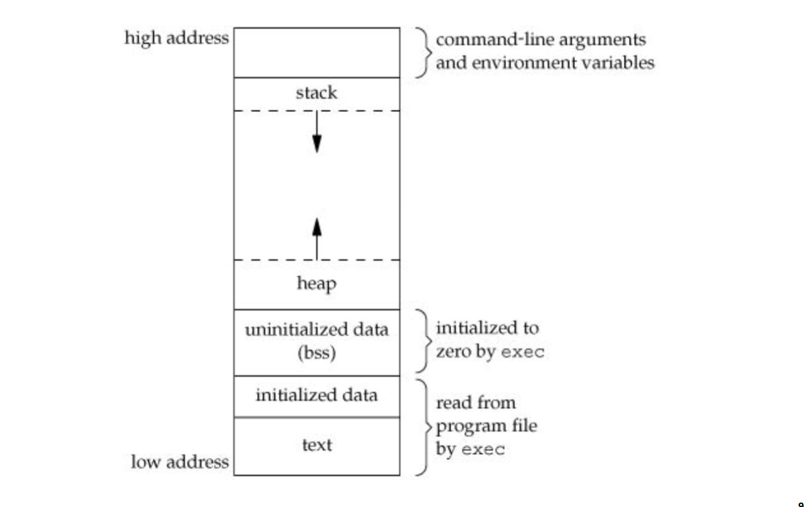

**Text Segment**
- The text segment contains the machine code of the program in a read-only format for the CPU.
- Code and constants, like string literals, are stored here.
- It is a shared segment.

**Data Segment**
- The data segment is divided into two parts, the initialized data segment and the uninitialized data segment.
- The initialized data segment contains the global variables and the static variables that are initialized (or contain a value).
- The uninitialized data segment contains the global variables and the static variables that are uninitialized (or are set to 0).
  
**Stack Segment**
- The stack is used for function calls and memory allocation for local variables.
- Each function call creates a stack frame, which contains the local variables and the return addresses.
- The stack operates in a LIFO (Last In First Out) manner.
- The stack is usually of a limited size so it is unsuitable for larger data types.

**Heap Segment**
- The heap is a dynamically allocated playground for memory.
- It is very suitable for holding larger data types and can be managed through the use of `malloc()`, `calloc()`, `realloc()` and `free()`.
- Memory allocated on the heap persists until it is freed and is not automatically managed.

**Cmd Line Args and Env Variables**
- The command line arguments and environment variables are stored in the higher address, above the stack.

### C Language Basics

[See the C Language Basics](basics-of-c.md)

## Data Representation in Memory

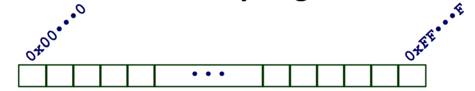

**Conceptually:** Memory is a large array of bytes, with each index being a memory address 1 byte apart.

- In a 32-bit system, there are 2³² unique memory addresses.
  - `0x00000000` to `0xffffffff` (in decimal: 0 to 4,294,967,295)
- In a 64-bit system, there are 2⁶⁴ unique memory addresses.
  - `0x0000000000000000` to `0xfffffffffffffff` (in decimal: 0 to 18,446,744,073,709,551,615)

### Bits

- A bit is the smallest unit of data in a computer.
- It's value can be either 0 or 1. That's it.

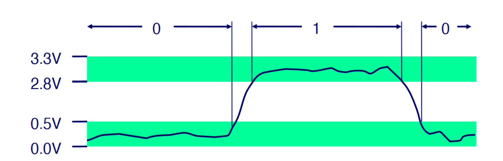

Voltage Range dictates Binary Value on wire
- High voltage range (e.g. 2.8V to 3.3V) is a logic 1
- Low voltage range (e.g. 0.0V to 0.5V) is a logic 0
- Voltages in between are indefinite Values
  - In many different systems, this indefinite voltage range represents the previous definite value.

### Bytes

- Due to the limited representational power of a bit, we group bits together to form a byte.
- A byte is 8 bits.
- A single datum could use multiple bits.

**When encoding bytes:**

1 Byte / 8 bits:
- In Binary: 00000000₂ → 11111111₂

### Number Representational Formats

- Due to the cumbersome nature of trying to count binary, it is easier to use something closer to our decimal system, which is base 10.

For comparison, the binary system is base 2.

---
*In order to find a larger base, we need to find a power of 2 that is closest to the base.*

We use the equation: `R¹=2ⁿ`
- `R¹` is representative of one digit in the number system.
- `n` is the number of bits per digit.
- `2` is the base of the binary system, 0 or 1.

---

**There are two types of number representational formats closest to decimal:**
- Octal : Base 8 : 2³ (3 bits per digit)
- Hexadecimal : Base 16 : 2⁴ (4 bits per digit)

#### Octal or Hexadecimal?

---

    Binary: 1010011101010001011101011₂
    Octal: 123521353₈
    Hexadecimal: 14EA2EB₁₆
    Decimal: 21930731₁₀

Both of these are closer in size to decimal however, which one is superior???
- To see this, let's compare how many digits of each representational system we can fit into a byte.

**Octal**:
- As 1 octal digit takes 3 bits and 1 byte contains 8 bits, 8/3 = 2.667 octal digits per byte. (*not good*)
**Hexadecimal**:
- As 1 hexadecimal digit takes up 4 bits, and 1 byte contains 8 bits, 8/4 = 2 hexadecimal digits per byte. (*very good*)

#### Expressing Byte Values with Our Representational Formats
- Binary: 00000000₂ → 11111111₂
- Octal: 000₂ → 377₂
- Hexadecimal: 00₁₆ → FF₁₆
  - Base-16 format uses the letters A-F to represent the values 10-15.
- Decimal: 0₁₀ → 255₁₀

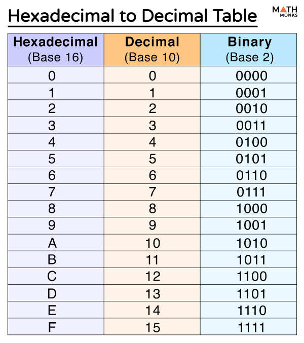

#### Converting From Binary to Hexadecimal
- Easy, simply group the binary digits into groups of 4 and convert each group into a hexadecimal digit.
- To convert from hexadecimal to binary, simply convert each hexadecimal digit into 4 binary digits and slap em together.

## Representing Integers

### Unsigned Integers:
- Computers store integers in binary representation(base-2).
- Binary numbers use place value notations, just like decimal numbers. 
- For example, in the ones place for base-10, it's the value of the digit times 10⁰, in the tens place, it's the value of the digit times 10¹, etc.
- For binary (base-2) numbers, it's the value of the digit times 2⁰, 2¹, 2², etc.

---

*To translate from any base-R to decimal, we use the following equation:*

**value₁₀ = ∑(aᵢ * Rⁱ)** where the upper limit of the summation is `n-1` where n is the number of digits in the number and our initial index is 0.

---

*To translate from decimal to any base-R, we follow the following steps:*
- Divide the decimal number by your `R` value.
- Your remainder is your rightmost digit.
- Then, take the quotient and divide by `R` again.
- Repeat until the quotient is 0.

---

#### Unsigned Integer Ranges
- Unsigned integers are represented in binary, and are always positive.
- Due to the minimum value always 0, the maximum value is 2ⁿ-1, where n is the number of bits used to represent the number.
  
(Each bit can be either 0 or 1, so 2 possibilities per bit)

    For char: (Unsigned char is 1 byte) 2⁸-1 = 255 unique values
    For int: (Unsigned int is 4 bytes) 2³²-1 = 4,294,967,295 unique values
    For short: (Unsigned short is 2 bytes) 2¹⁶-1 = 65,535 unique values

### Signed Integers:
- For signed integers, half of the range is converted to negative. (Most significant bit represents the sign)

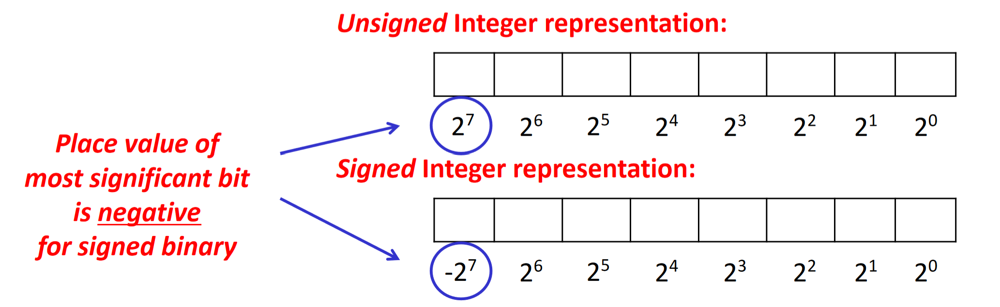

### Ways to Represent Signed Integers

**Sign-Magnitude**
- The most significant bit represents the sign of the number.
- The rest of the bits represent the magnitude of the number the same way as it would in unsigned.

**One's Complement**
- The most significant bit represents the sign of the number.
- For the rest of the  bits, each bit is flipped for a certain magnitude.
  - Example: To show -1 in 1's Complement with 4 bits, -1₁₀ = 1110₂

**Two's Complement**
- 2's Complement is basically the 1's complement, except you add 1 to the number.
- This is to account for the fact that 0 has two representations in 1's complement. (0000₂ and 1111₂)
  - Example: To show -1 in 2's Complement with 4 bits, -1₁₀ = 1111₂


#### Signed Integer Ranges
- Given a representation of *n* bits, minimum value is always going to be: 1000...000₂ = -2ⁿ⁻¹ (Most significant bit is 1, rest are 0) **using 2's complement*
- The max value is going to be: 0111.111₂ = 2ⁿ⁻¹-1 (Remember there's 1 less value because of 0)

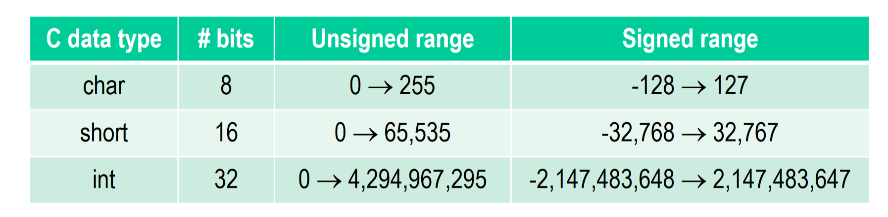

## String Representation

---
*Note: The following representations are all in hexadecimal.*

---

- Strings in C are represented technically just arrays of characters.
- Strings are always null terminating, ending with `0x00` (null)

### ASCII

2 Types of ASCII:
- 7-bit ASCII: 0x00 to 0x7F : 128 characters
- 8-bit ASCII: 0x00 to 0xFF : 256 characters

*Very Limited!*

- The numerical digits start with `0x30` (0) and end with `0x39` (9)
- The uppercase letters start with `0x41` (A) and end with `0x5A` (Z)
- The lowercase letters start with `0x61` (a) and end with `0x7A` (z)
- Control characters start with `0x00` (null) and end with `0x1F` (unit separator)


### Unicode

3 Types of Unicode:

- UTF-8: 1 byte version of Unicode, capable of representing 2⁸ = 256 characters
- UTF-16: 2 byte version of Unicode, capable of representing 2¹⁶ = 65,536 characters
- UTF-32: 4 byte version of Unicode, capable of representing 2³² = 4,294,967,296 characters

## Endianness
- Memory is byte-addressable, which means that each byte has a unique address.

There are two ways to store `unsigned X = 15398; // 0x00003C26`:


---
*Note to self:*

Hexadecimal takes 4-bits to represent a single digit, so 2 hexadecimal digits = 1 byte, meaning you can fit 2 hexadecimal digits into a byte. [Check here if still uncertain](#octal-or-hexadecimal)

#### Little Endian
- Least significant byte is stored in the lowest address.
- x86 is little endian.

#### Big Endian
- Most significant byte is stored in the lowest address.

## Bitwise Operations
- There are 4 boolean operators in C:
  - `&` : AND
  - `|` : OR
  - `^` : XOR
  - `~` : NOT

Bitwise operations with each:

**&**:

      00110101
    & 11010111
    ------------
      00010101

**|**:

      00110101
    | 11010111
    ------------
      11110111


**^**:

      00110101
    ^ 11010111
    ------------
      11100010

**~**:
  
    ~00110101 = 11001010

---

**Bit-level operations can be applied to any *integral* data type.**
- `long`, `short`, `int`, `char`, `unsigned`, etc.

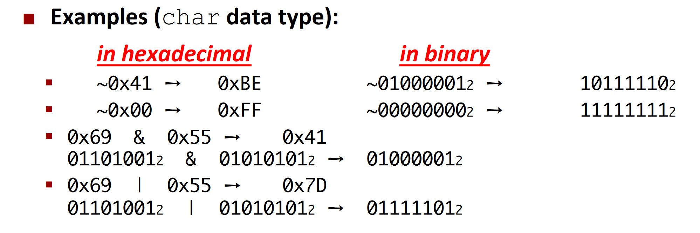

**Using bitwise negation to properly negate a integer**
- In two's complement: `~x + 1 = -x`
- In one's complement: `~x = -x`

### Bitwise Flags
- Bitwise flags are used to store multiple boolean values in a single variable.
- One byte is capable of storing 8 boolean values.

**For example:**

By defining a `char flag`, we now have access to the size of `char` (1 byte)'s number of boolean representations.
- `char flag = 0x1 | 0x4 | 0x8`
  - This is equivalent to (in boolean values) `flag = 00001101₂`
  - Then, you can use bitwise operations to see if a certain bit in the flag is true.
    - ```C
      if (flag & 0x1) {
        // First bit is true!
      } else {
        // First bit is false!
      }
      ```

### Shift Operations
- Shift operations are used to shift the bits of a number to the left or right.

#### Left Shift (<< *points to left*)
- Delete *x* number of leftmost bits, and add *x* number of 0's to the rightmost bits.
- Example: `11110001 << 2 = 11000100`

#### Right Shift (>> *points to right*)

Logical Right Shift:
- Delete *x* number of rightmost bits, and add *x* number of 0's to the leftmost bits.
- Example: `10110101 >> 2 = 00101101`

Arithmetic Right Shift:
- Delete *x* number of rightmost bits, and add *x* number of the leftmost bit to the left.
- Example: `10110101 >> 2 = 11101101`

*If shift amount is 0 or ≥ bit-size, behavior is undefined.*

## Arithmetics

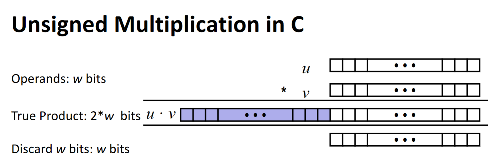

Signed Multiplication requires extension of the sign bit.

Example:

    1001 (-7) * 1010 (-6) =

            11111001
            * 11111010 =
            ------------
            00000000
           111110010
          0000000000
         11111001000
        111110010000
       1111100100000
      11111001000000
     111110010000000
    ----------------
    (Cutoff)00101010


`10011010₂ = -38₁₀`

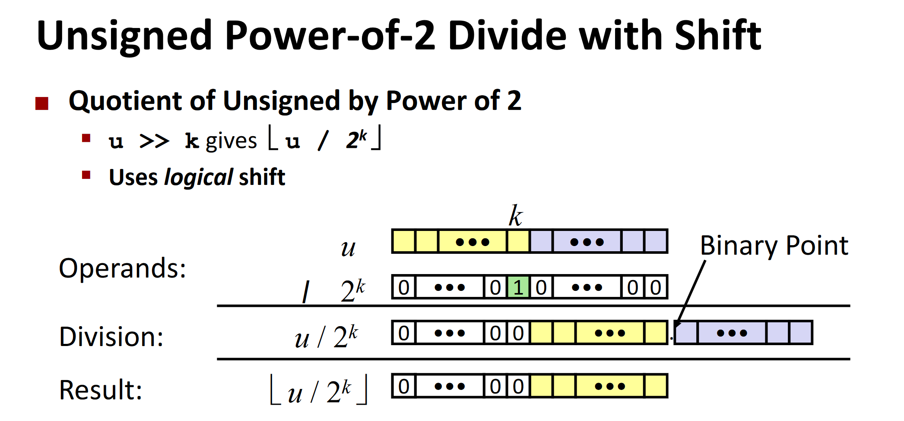

Signed division requires biasing in order to round to the correct direction. 

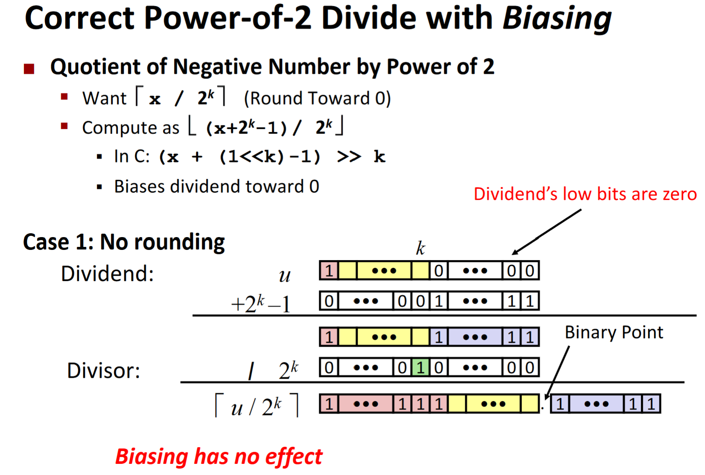