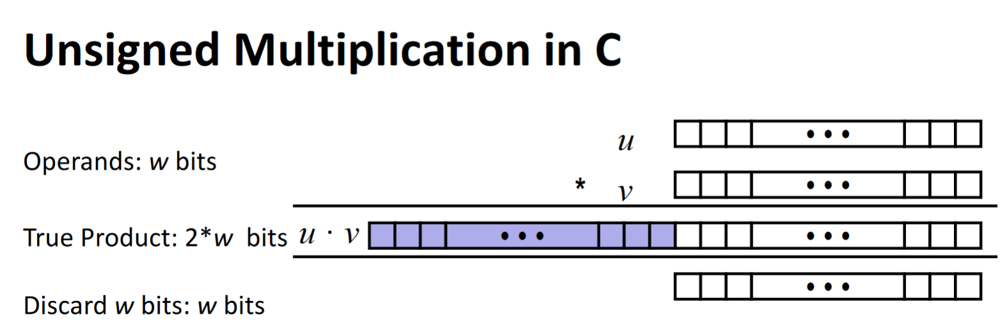
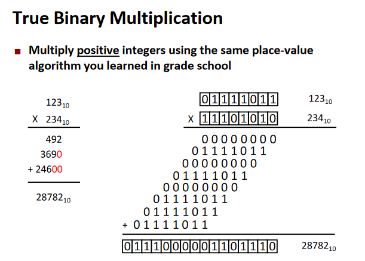
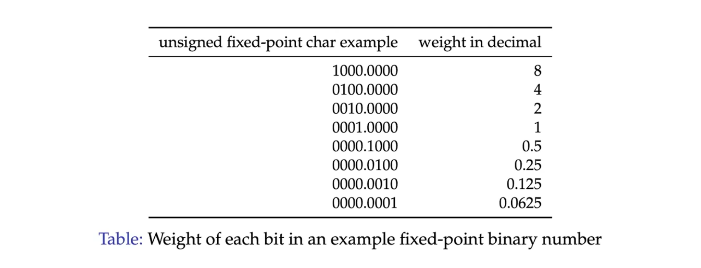
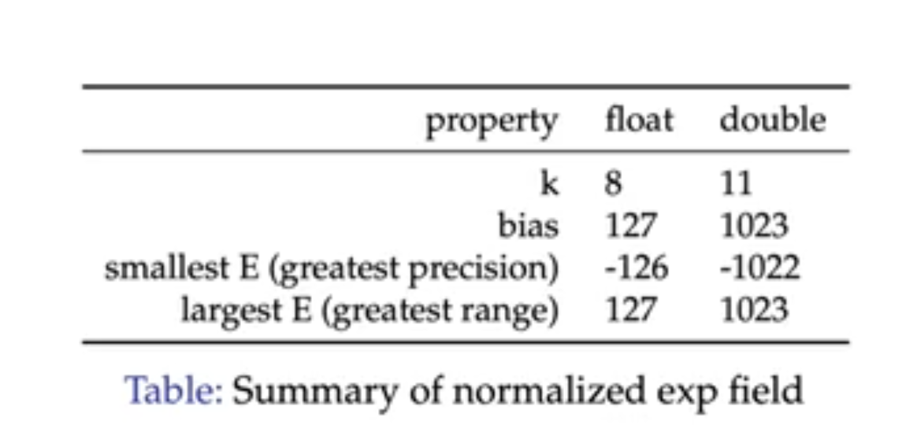
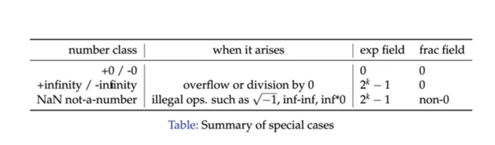
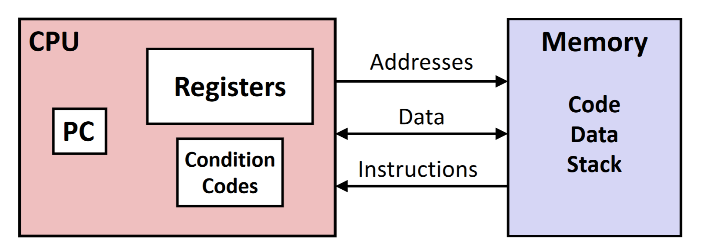

# Computer Architecture

Taught By Kania Jay

----

- [Computer Architecture](#computer-architecture)
	- [Course Logistics](#course-logistics)
		- [What is a Computer?](#what-is-a-computer)
			- [Fixed computers](#fixed-computers)
			- [Stored Computers](#stored-computers)
			- [The Von Neumann Model](#the-von-neumann-model)
			- [High Level to Low Level](#high-level-to-low-level)
			- [Harvard Architecture](#harvard-architecture)
			- [The Operating Systems](#the-operating-systems)
			- [Moore's Law](#moores-law)
	- [The Overview of Comp Arch](#the-overview-of-comp-arch)
		- [5 Great Realities of Systems](#5-great-realities-of-systems)
		- [Memory Hierarchy (More to come)](#memory-hierarchy-more-to-come)
		- [How Source Code Becomes Executable](#how-source-code-becomes-executable)
		- [Preprocessing Phase](#preprocessing-phase)
		- [Compiler](#compiler)
		- [Assembler](#assembler)
		- [Linker](#linker)
	- [Data Representation in Memory](#data-representation-in-memory)
			- [Byte-Oriented Memory Organization](#byte-oriented-memory-organization)
		- [Why use Bits and Binaries?](#why-use-bits-and-binaries)
		- [Bits and bytes](#bits-and-bytes)
		- [Encoding Byte values](#encoding-byte-values)
		- [Binary is Hard to represent!](#binary-is-hard-to-represent)
			- [So, in order to use it, we change it into a different representation.](#so-in-order-to-use-it-we-change-it-into-a-different-representation)
			- [Expressing Byte Values](#expressing-byte-values)
			- [Convert Bteween Binary and Hex](#convert-bteween-binary-and-hex)
		- [Signed VS Unsigned](#signed-vs-unsigned)
			- [Unsigned Integers - Binary](#unsigned-integers---binary)
			- [Unsigned Integers - Hexadecimals](#unsigned-integers---hexadecimals)
			- [Unsigned Integers - Convert Decimal to Base-R](#unsigned-integers---convert-decimal-to-base-r)
	- [Negative numbers](#negative-numbers)
		- [First Form](#first-form)
		- [Complement Method of Representing Negatives](#complement-method-of-representing-negatives)
		- [New Twos Complement Form](#new-twos-complement-form)
			- [Addition again with this form:](#addition-again-with-this-form)
		- [Signed Integers - Binary](#signed-integers---binary)
		- [Signed Integers - Convert to/from Decimal](#signed-integers---convert-tofrom-decimal)
		- [Signed Integers - Convert Decimal to Base-R](#signed-integers---convert-decimal-to-base-r)
	- [Representing Strings](#representing-strings)
		- [Strings in C](#strings-in-c)
			- [Limitations of ASCII](#limitations-of-ascii)
		- [Unicode](#unicode)
		- [Endianness](#endianness)
			- [Why does Endianness Matter?](#why-does-endianness-matter)
		- [Basic Processor Organization](#basic-processor-organization)
		- [Boolean Algebra](#boolean-algebra)
			- [General Boolean Algebras](#general-boolean-algebras)
	- [Bit-Level operations in C](#bit-level-operations-in-c)
			- [Contrast: Logic Operations in C](#contrast-logic-operations-in-c)
		- [Bitwise Operations: Applications](#bitwise-operations-applications)
		- [Shift Operations](#shift-operations)
			- [Bitwise-NOT Operator: One's Complement](#bitwise-not-operator-ones-complement)
		- [Unsigned Addition](#unsigned-addition)
			- [VIsualizing Unsigned Addition](#visualizing-unsigned-addition)
		- [Two's complement Addition](#twos-complement-addition)
			- [Signed Addition](#signed-addition)
			- [Visualizing Signed Addtion](#visualizing-signed-addtion)
		- [Multiplication](#multiplication)
			- [In Binary](#in-binary)
		- [Division](#division)
			- [Unsigned Power of 2 Division](#unsigned-power-of-2-division)
	- [Midterm Review](#midterm-review)
	- [Floating Points](#floating-points)
		- [Background: Fractional Binary Numbers](#background-fractional-binary-numbers)
			- [Limitations of Fixed-Point](#limitations-of-fixed-point)
		- [Floating Point Definition](#floating-point-definition)
		- [Types of Floating Points](#types-of-floating-points)
		- [Levels of Precision](#levels-of-precision)
		- [IEEE 754 Number Line](#ieee-754-number-line)
		- [Representation](#representation)
			- [Normalized Form](#normalized-form)
			- [Denormalized Form](#denormalized-form)
		- [Computer Architecture (ISA) Classifications](#computer-architecture-isa-classifications)
			- [CISC - Complex Instruction Set Computers](#cisc---complex-instruction-set-computers)
			- [RISC - Reduced Instruction Set Computers](#risc---reduced-instruction-set-computers)
			- [Is x86 CISC? How does it get speed?](#is-x86-cisc-how-does-it-get-speed)
		- [Assembly/Machine Code View](#assemblymachine-code-view)
			- [Programmer-Visible State](#programmer-visible-state)

---

## Course Logistics

**Grading:**
- Exams (45%)
	- Midterm : 20%
	- Final : 25%
	- No make-ups
	
- Assigments (35%):
	- Submissions tested on iLab.
	- Due at 2 AM

- Some quizzes and stuff (5%)

### What is a Computer?

There are two Types of computers:

#### Fixed computers
- Programs are loaded onto the computer at manufacturing. (e.g. Calculator)

**vs**

#### Stored Computers
- Like computers nowadays.

#### The Von Neumann Model
A Computer is:

- A single, shared memory for programs and data, a single bus for memory access, an arithmetic unit, and a program control unit.
- The problem with this model was that there was only one line from instructions to memory.
- The instructions and operations could only be operated on one at a time.

#### High Level to Low Level

- Human legible code, such as Java and Python are high level languages, which means that it needs to be converted into Assembly Language and then machine language.

#### Harvard Architecture

- Separation of the different memory types moving the instruction memory and data memory to be separate.
- The problem with this architecture is the size and power consumption of this model because of having two physical memories.

#### The Operating Systems
- Programs run on the hardware, calling into OS for some services.
- On modern systems, OS and hardware collaborate for some features.

#### Moore's Law
- Gordon E. Moore was an Intel Engineer who noticed something.
- Observed that the number  of transistors on a chip doubles every 18 months.
- Exponential growth is seen almost everywhere.

rawr

## The Overview of Comp Arch

- Systems Knowledge
	- How hardware (processors, memories, disk drives, network infrastructure) plus software (operating systems, compilers, libraries, network protocols) combine to support the execution of application programs.
	- Programmmer centric
	
### 5 Great Realities of Systems

1. Ints are not Integers, Floats are not Reals
	- They have limits to how much value they can store and how they can store it.
	- Can not assume all "usual" mathematical properties.
		- Mathematical computations and representations of numbers are finite. (ints can only store so many bytes of data)
	- Integer operations satisfy "ring" properties
		- Commutativity, associativity, distributivity
	- Floating point operations satisfy "ordering" properties.

2. You've got to know Assembly
	- You might not have to write programs in assembly but still.
	- Understanding assembly is key to machine-level execution model.
		- Behavior of programs in presence of bugs.
			- High level language models break down.
		- Tuning program performance
			- Understand optimization done / not done by the compiler
			- Understand sources of program inefficiency.
		- Creating / fighting malware
			- x86 assembly is the language of choice.
			
3. Memory Matters
	- Memory is not unbounded
		- It must be allocated and managed
		- Many applications are memory dominated
	- Memory referencing bugs are especially pernicious
		- Effects are distant in both time and space
	- Memory Performance is not uniform
		- Cache and virtual memory effects can greatly affect program performance.
		- TODO: Get this
		
	Why is this a problem?
	
	- C and C++ does not provide any memory protection
		- Out of bounds array references
		- Invalid pointer values
		- Abuses of malloc/free
	- Nasty bugs can occur
	
4. There's more to performance ????? TODO: Complete

5. Comptuers do more than execute Programs
	- They need to get data in and Out
		- I/O system critical to program reliability and performance
	- They communicate with each other over networks
		- Many system-level issues arise in the presence of networks.

How a Computer Turns on
1. Power supply is clicked
2. The ROM initiates the bootloader associated with the operating System into memory.
3. The bootloader then finds the storage location of the operating system in the hard drive, initiating the kernel.

How a Program Gets Executed

Fetch --> Decode --> Execute

- Fetch: Grabs the snippet of the program from the disk, moving it to RAM and then moving it to the CPU.
- Decode: Identify the snippet of the program.
- Execute

### Memory Hierarchy (More to come)

- Registers
	- Fastest memory
	- Small
	- Inside the CPU
	- Used for storing the most important data.

---

### How Source Code Becomes Executable

- Source code is written in a high level language.
- The preprocessing stage is where the preprocessor replaces the macros with the actual code.
- The compiler then converts the code into assembly code.
- The assembler then converts the assembly code into machine code.
- The linker then links the machine code with the libraries and other code.
- After the linking, the executable is created.

### Preprocessing Phase
- First phase that takes the source code as input.
  - Includes the header files and replaces the macros with the actual code.
  - The output of this phase is the expanded source code.
  - Removes comments and whitespace.
  - Conditional compilation.
    - #ifdef, #ifndef, #else, #endif, #if, #elif
  - Stored in a file with the extension .i

To use it in iLab:

`gcc -E <input_file> -o <output_file>`

### Compiler
- Second phase that takes the expanded source code as input.
  - Converts the code into assembly code.
  - The output of this phase is the assembly code.
  - Stored in a file with the extension .s

### Assembler
- Third phase that takes the assembly code as input.
  - Converts the assembly code into machine code.
  - The output of this phase is the object code.
  - Stored in a file with the extension .o

### Linker
- Fourth phase that takes the object code as input.
  - Links the object code with the libraries and other code.
  - The output of this phase is the executable.
  - Stored in a file with the extension .out

---

## Data Representation in Memory

#### Byte-Oriented Memory Organization
- **Modern processors: Byte-Addressable Memory**
	- Conceptually a very large array of bytes.
	- Each byte has a unique address.
	- Processor *address space* determines *address range*.
		- 32-bit address space has 2^32 unique addresses: 4GB max.
			- 0x00000000 to 0xffffffff
		- 64-bit address space has 2^64 unique addresses
		
	- Address space size is not the same as processor size!
		- The original Nintendo was an 8-bit processor with a 16-bit address space.
		
### Why use Bits and Binaries?

- Digital transistors operate in high and low voltage ranges.
- Voltage Range dictates binary value on wire.
	- High voltage range (e.g. 2.8V to 3.3V) is a logic 1.
	- Low voltage range (e.g. 0.0V to 0.5V) is logic 0.
	- Voltages in between are indefinite values.
		- The values the in between states take depend on your processor.
- Ternary or Quaternary systems have practicality problems.

### Bits and bytes

- **Computers Use Bits:
	- a "bit" is a base-2 digit.
	- It can only be 0 or 1.
	
- **Single bit offers limited range, so grouped in bytes**
	- 1 byte = 8 bits.
	- a single datum may use multiple bytes.
- **Data representation 101:**
	- Given *N* bits, can represent 2^N unique values.
		- Letters of the alphabet?
		- Colors?

### Encoding Byte values
- **Processors generally use multiples of bytes**
	- common sizes: 1,2, 4, 8 or 16 bytes.
- 1 byte = 8 bits.

**They can be interpreted in many ways!!**

- For example: consider byte: 0101010101_2 (base 2 because it's a binary string)
	- As ASCII text: "U"
	- As Integer: 85_10
	- As IA32 Instruction: pushl %ebp
	- The 86th byte of memory in a Computer
	- A medium gray pixel in a gray-scale image
	- Etc...
	
---

### Binary is Hard to represent!

(Since it can be represented in so many ways)

**Problem with binary - cumbersome to use**
- e.g. appx. how big is: 1110101010101011₂?
- It would take forever to calculate each time.

**Let's Define a larger Base so that:**

 R¹ = 2ˣ

- For equivalence, R and x must be initegers - then 1 digit in R equals x bits.
- Equivalence allows direct conversion between representations.
- Two options closest to decimal:
  - Octal: 8¹ = 2³ (Base 8)
  - Hexadecimal: 16¹ = 2⁴
  
#### So, in order to use it, we change it into a different representation.
- Octal
- Hexadecimal numbers
- Decimals

**Octal and Hexadecimal are closer in size to decimal, BUT...**
- Octal : 8/3 = 2.67 octal digits per byte - BAD
- Hex: 8/4 = 2 octal digits per byte - GOOD

***We will run into alignment issues if we use the octal system... So, Hexadecimal is better***

---

#### Expressing Byte Values

- **Common ways of expressing a byte**
  - Binary: 00000000₂ to 11111111₂
  - Decimal: 0₁₀ to ...

---

**Binary Workshop**

I Have 4 bits to work with (I can represent 2⁴ unique digits.)

	1011 => (1 * 2³) + (0 * 2²) + (1 * 2¹) + (1 * 2⁰) => 11

---

#### Convert Bteween Binary and Hex
- Convert hex to binary
  - Simply replace each hex digit with its equivalent 4-bit binary sequence.
		
		Example:

		6D19F3C₁₆ → Convert to base 2.

		6: 0110 | D: 1101 | 1: 0001 | 9: 1001 | F: 1111 | 3: 0011 | C₁₆: 1100₂

- Convert Binary to Hexadecimal
  - Starting from the radix point, replace each sequence of 4 bits with the equivalent hexadecimal digits.
  - Each **DIGIT** corresponds with 4 bits of information.

---

### Signed VS Unsigned
- Positive numbers are typically "unsigned".
- Negative numbers are "signed"

#### Unsigned Integers - Binary

- **Computers store Unsigned integer numbers in Binary (base-2)
  - Binary numbers use place valuation notation, just like decimal.
  - Decimal value of *n*-bit unsigned binary number:

	`value₁₀ = (n-1)∑(i=0) aᵢ*2ⁱ`

	| 0   | 1   | 1   | 1   | 0   | 1   | 0   | 1   |
	| --- | --- | --- | --- | --- | --- | --- | --- |
	| 2⁷  | 2⁶  | 2⁵  | 2⁴  | 2³  | 2²  | 2¹  | 2⁰  |

	This is all equal to:
	
		(0 * 2⁷) +  (1 * 2⁶) + (1 * 2⁵) + (1 * 2⁴) + (0 * 2³) + (1 * 2²) + (0 * 2¹) + (1 * 2⁰) = 

#### Unsigned Integers - Hexadecimals
- Commonly used for converting hexadecimal numbers
  - Hexadecimal numbers is an "equivalent" representation to binary, so often need to determine decimal value of a hex number.
    - `value₁₀ = (n-1)∑(i=0) aᵢ*16ⁱ`
  - However, remember that there are letters `A-F` which correspond to `10-15` respectively.

#### Unsigned Integers - Convert Decimal to Base-R

- Also need to convert decimal numbers to desired base.
- Algorithm to convert it:
  
	1. Assign decimal number to NUM.
	2. Divide NUM by R
      	1. Save the remainder REM as next least significant digit.
      	2. Assign quotient Q as new NUM
	3. Repeat step b) until quotient is 0.

	Example (Binary):

		52₁₀ = ?₂

		52/2 = 26 r 0 -> First bit
		26/2 = 13 r 0 -> Second bit
		13/2 = 6 r 1 -> Third bit
		6/2 = 3 r 0 -> Fourth bit
		3/2 = 1 r 1 -> Fifth Bit
		1/2 = 0 r 1 -> Sixth Bit

		So total: 110100

	Example (Hexa):

		437₁₀ = ?₁₆

		437/16 = 27 r 5 -> First digit
		27/16 = 1 r 11 -> Second
		1/16 = 0 r 1 -> Most significant digit

		So in Hexa: 1B5₁₆
	
## Negative numbers

**4 Bits** is called a *nibble*.

**8 bits** is called a *byte* (ahaha).

### First Form
- In the case of negative numbers, one form is that 4 bits are allocated for negative numbers.
- The first bit of the sequence keeps track of whether or not the number is negative.
  - For example: `-5 : 1101`

|     | (-?) | 2²  | 2¹  | 2¹  |
| --- | ---- | --- | --- | --- |
| -0  | 1    | 0   | 0   | 0   |
| -1  | 1    | 0   | 0   | 1   |
| -2  | 1    | 0   | 1   | 0   |
| -3  | 1    | 1   | 0   | 1   |
| -4  | 1    | 1   | 1   | 0   |
| -5  | 1    | 1   | 0   | 1   |
| -6  | 1    | 1   | 1   | 0   |
| -7  | 1    | 1   | 1   | 1   |

For this method... **there is a problem**:
- You can not do addition between positive and negative binary numbers.
	- Example: 
  
			-7 + 7
			(This should equal zero)

			Let's represent it as binary.

			1111 + 0111 = (1)0110 (1 gets deleted) Not correct.

### Complement Method of Representing Negatives
- You flip the bits.

|     | 2³  | 2²  | 2¹  | 2¹  |
| --- | --- | --- | --- | --- |
| -0  | 1   | 1   | 1   | 1   |
| -1  | 1   | 1   | 1   | 0   |
| -2  | 1   | 1   | 0   | 1   |
| -3  | 1   | 1   | 0   | 0   |
| -4  | 1   | 0   | 1   | 1   |
| -5  | 1   | 0   | 1   | 0   |
| -6  | 1   | 0   | 0   | 1   |
| -7  | 1   | 0   | 0   | 0   |

- This method flips the bits so:
  - Normally 0 is represented as `0000`, but in the complement, it will be represented as `1111`.

**Addition with this method:**

	-7 + 7 = 0

	1000 + 0111 = 1111 = -0 (very close!)

	-3 + 5 = 2

	1100 + 0101 = (1)0001 (1 gets deleted again) Value is 1 (Off by 1)

Why is it off??
- It's off by 1 because of the value -0 in the complement form.
- So what should we do?
  - Remove the damn -0.

### New Twos Complement Form

|     | 2³  | 2²  | 2¹  | 2¹  |
| --- | --- | --- | --- | --- |
| -1  | 1   | 1   | 1   | 1   |
| -2  | 1   | 1   | 1   | 0   |
| -3  | 1   | 1   | 0   | 1   |
| -4  | 1   | 1   | 0   | 0   |
| -5  | 1   | 0   | 1   | 1   |
| -6  | 1   | 0   | 1   | 0   |
| -7  | 1   | 0   | 0   | 1   |
| -8  | 1   | 0   | 0   | 0   |

#### Addition again with this form:

	-7 + 7 = 0
	1001 + 0111 = (1)0000 (1 gets discarded again), this gets us the actual result (0)

	-3 + 5 = 2
	1101 + 0101 = (1)0010 (1 gets discarded), this gets us 2 (actual result)

---

### Signed Integers - Binary
- Signed binary integers converts half of range as negative
- Signed representation identical, except for most significant bit.
  - For signed binary most significant bit indicates sign.
    - 0 for nonnegative
    - 1 for negative
  - **must know number of bits** for signed representation.

### Signed Integers - Convert to/from Decimal
- Convert Signed binary int to decimal
  - Easy – just use place value notation
- Convert Decimal to Signed Binary Integer
	- MUST know number of bits in signed representation
	- Algorithm:

		1. Convert magnitude (abs val) of decimal number to unsigned binary
		2. Decimal number originally negative?
      		1. If positive, conversion is done
      		2. If negative, perform negation on answer from part a)
            	-  zero extend answer from a) to N bits (size of signed repr)
         		- negate: flip bits and add 1

### Signed Integers - Convert Decimal to Base-R

TODO : FILL OUT

## Representing Strings

### Strings in C
- Represented by array of characters
- Each character encoded in ASCII format
  - Standard 7-bit encoding of character set
  - Character “0” has code 0x30
- String should be null-terminated
  - Final character = 0
- ASCII characters organized such that:
  - Numeric characters sequentially increase from 0x30
	- Digit i has code 0x30+i
- Alphabetic characters sequentially increase in order
	- Uppercase chars ‘A’ to ‘Z’ are 0x41 to 0x5A
	- Lowercase chars ‘a’ to ‘z’ are 0x61 to 0x7A
- Control characters, like `<RET>`, `<TAB>`, `<BKSPC>`, are 0x00 to 0x1A

#### Limitations of ASCII
- 7-bit encoding limits set of characters to 2⁷ = 128
- 8-bit extended ASCII exists, but still on 2⁸ = 256 characters
- Unable to represent most other languages in ASCII.

**How to fix this??**

### Unicode
- First 128 characters are ASCII format
- UTF-8: 1-byte version
- UTF-16: 2-byte version
  - Allows: 2¹⁶= 65,536 unique characters

### Endianness
- Recall that memory is byte-addressable
  - Four bytes in a 32-bit integer, which order are they stored with?

**There are two ways to store : `unsigned X = 15398; // 0x00003C26`**

- Little endian
  - Least significant bits stored first in memory
  - x86 uses this representation
- Big endian
  - Most significant bits stored first in memory.

#### Why does Endianness Matter?
- The CPU is designed to work with whichever the system it has
  - ex: reads, writes, arithmetic will all work correctly.
- But what about sending data to other computers?
  - Need a standard representation for compatibility.
  - Most network standards are big-endian.
  - Sender-receiver must agree to a mutual endianness.
- Some files have byte-order marks (BOM)
  - It is a speciail character or sequence of bytes placed at the begiinning of a text file to indicate the byte order (endianness) and character encoding used withint he file.
  - The primary purpose of a BOM is to help software correctly interpret and process the text data, especially when dealing with multi-byte character encodings like UTF-16, UTF-32.

### Basic Processor Organization

- Register file (active data)
- Arithmetic Logic Unit (ALU)
  - Performs signed and unsigned arithmetic
  - Performs logic operations
  - Performs bitwise operations

### Boolean Algebra
- Developed by George Boole in 19th cetnry.
  - Algebraic representation of logic.
    - He encoded "True" as 1 and "False" as 0.

#### General Boolean Algebras
- Operate on Bit Vectors
  - Operations applied bitwise
  - Bitwise-AND operator: `&`
  - Bitwise-OR operator: `|`
  - Bitwise-XOR operator: `^`
  - Bitwise-NOT operator: `~`

Example:

	  01101001    01101001
	& 01010101  | 01010101
	= 01000001  = 01111101

## Bit-Level operations in C
- Operations `&, |, ~, ^`, Available in C
  - Apply to any "integral" data type
    - long, int short, char, unsigned
  - View arguments as bit vectors
  - Arguments applied bit-wise
  - It looks at your argument as a **BIT**, which is different.

#### Contrast: Logic Operations in C
- Contrast to Logical operators:
  - &&, ||, !
    - View 0 as "false"
    - Anthing nonzero as "True"
    - Always return 0 or 1
    - *early termination*
- Examples (`char` data type):
  - !0x41 → 0x00
  - !0x00 → 0x01
  - !!0x41 → 0x01

### Bitwise Operations: Applications
- Bit fields
  - One byte can fit up to eight options in a single field
  - Example: `char flags = 0x1 | 0x4 | 0x8`

### Shift Operations
- **Left Shift**: x << y
  - Shift bit-vector x left of y places
    - Throw away extra bits on left
  - Fill with 0's on the right.

Example:

| Argument `x` | 01100010         |
| ------------ | ---------------- |
| << 3         | 00010 → 00010000 |

- **Right Shift**: x >> y
- Shift bit-vector x right y positions
- There are **two** types of right shifts
  - *Logical Right Shift*:
    - Fill with 0's on the left
  - *Arithmetic Right Shift*:
    - Replicate most significant bit on the right

Example:

| Argument `x` | 01100010          |
| ------------ | ----------------- |
| Log. >> 2    | 011000 → 00011000 |
| Arith. >> 22 | 011000 → 00011000 |

Example 2:

| Argument `x` | 10100010 |
| ------------ | -------- |
| << 3         | 00010000 |
| log. >> 2    | 00101000 |
| arith. >> 2  | 11101000 |

- **Undefined behavior**
  - Shift amount < 0 or >= word size

#### Bitwise-NOT Operator: One's Complement
- Negate a number by taking 2's complement
  - Fliip bits (one's complement)
    - ~x + 1 == ~x

---

### Unsigned Addition

- Operands: *w* bits
- True Sum: *w+1* bits
- Discard Carry: *w* bits

**Addition Operation**
- Carry output dropped at end of addition
- Valid **ONLY** if true sum is within w-bit range.

Example:

	1111 + 0001 = 10000 → True value
	However, 1 gets dropped because out of range.
	Gives us 0000.

Example 2:

	110₁₀: 01101110
	202₁₀: 11001010
	     =100111000 = 00111000 → 56₁₀

	NOT VALID

#### VIsualizing Unsigned Addition
- There is a wraparound or overflow. Once you go over 255, it will wrap back to 0.

### Two's complement Addition
- Operands: *w* bits
- True Sum: *w+1* bits
- Discard Carry: *w* bits

**Signed/Unsigned adds have Identical Bit-level behavior**

**The Only difference is our interpretation of the sign bit value**

#### Signed Addition

Example 1:

	98₁₀: 01100010
	74₁₀: 01001010
	     =10101100 = 1101100 →(First bit is negative) -84₁₀

	NOT VALID in 8-bit signed range (172 > 127)

Example 2:

	-30₁₀: 11100010
	-40₁₀: 11011000
	      =110111010 = 10111010 → -70₁₀
	
	VALID in 8-bit signed range (-70 < -128)

#### Visualizing Signed Addtion

### Multiplication
- Goal: Computing Product of *w*-bit operands x,y
  - This can either be signed or unsigned.
- But, exact results can be bigger than *w* bits
  - *Unsigned*: Up to 2*w* bits
    - Result range 0 ≤ x * y ≤ (2ʷ-1)² = 2ʷ-2ʷ⁺¹+1
  - Two’s complement min (negative): Up to 2w-1 bits
    - Result range: x * y ≥ (–2ʷ⁻¹)*(2wʷ⁻¹-1) = –2²ʷ⁻² + 2ʷ⁻¹
  
**Unsigned**

**Signed**

#### In Binary
- It's like how you multiply normally. Each digit at a time.
  

### Division

#### Unsigned Power of 2 Division
- Division by power of 2 is equivalent to right shift
  - x / 2ⁿ = x >> n
  - Uses *logical* right shift
	- Fill with 0's on the left. Check out [Right shift](#shift-operations)

## Midterm Review

[Comp Arch Midterm Review](https://ivanz505.github.io/runb-notes/comp-arch/comp-arch-midterm1)

---

## Floating Points

### Background: Fractional Binary Numbers

Value: 5³/₄ = 101.11₂ → 4 + 1 + ¹/₂ + ¹/₄

**For unsigned fixed-point fractional binary representation:**

- There is, as implied by the term **fixed-point** a fixed number of bits to the left of the decimal point and a fixed number of bits to the right.

So this will look something like this:

	1 1 1 1 . 1 1 1 1

**Weights**:

#### Limitations of Fixed-Point
- Can only represent numbers of the form x/2ᵏ (Some power of 2)
- Can not represent numbers with very large magnitude (great range) or very small magnitude (great precision)

### Floating Point Definition
- The floating point representation is similar to scientific notation
	- > 1.25 * 10³ = 1250\
		> 2.78 * 10⁻² = 0.0278
	- In scientific notation, we have 3 components:
		- Sign
		- Significand (Mantissa)
		- Exponent
- Floating points are basically this exact concept except with an efficient binary format.
  - Uses base-2 instead of base-10
  - Places restrictions on how certain values are represented.
  - Deals with finiteness of representation.

### Types of Floating Points
**Before 1985**:
- Many different floating point formats.
- Specialized machines such as Cray supercomputers had their own formats.
- Some machines with specialized floating point have had to be kept alive to support legacy software.

**IEEE Standard 754**
  - Established in 1985 as uniform standard for floating point arithmetic.
    - Before that, many idiosyncratic formats.
  - Supported by all major CPUs and programming languages.
  - It was designed for good numerical properties.

### Levels of Precision
- Due to the finiteness of data, we can not represent all real numbers.
- That said, we have some options for precision of floating point numbers.

**Single Precision:**
- Single precision is a `float` data type.

**Double Precision:**
- Double precision is a `double` data type.
- 8 bytes and 64 bits long.
- Offers more precision than single precision.

*As you can notice, most of the bits is dedicated to the fractional bit, which is what allows for greater precision.*

### IEEE 754 Number Line
- The IEEE 754 Encoding allows for trade-offs between range and precision.
- There are special *denormalized* values that allow for extreme precision (when trying to represent numbers extremely close to 0) as well as ones that can represent infinity.
  - There is a specific string of bits to represent positive and negative infinity.

### Representation

> **Numerical Form**\
> (-1)ˢ * `M` * 2ᴱ\
> Sign bit `s` determines whether the number is negative or positive.
> Significand (Mantissa) `M` is a fractional binary number in the range `[1,2)`.
> Exponent `E` weights value by power of two. (Describes how much we will shift the number by.)

#### Normalized Form

- **Exponent Field**
  - A number is part of the normalized numbers if the exponent is `0 < exp < 2ⁿ-1`
    - `exp` us a k-bit unsigned integer.
  - Then, because we need to represent both positive and negative exponents, we need to have a bias.
    - Bias = 2ⁿ⁻¹ - 1
    - Bias is the *k*-bit unsigned integer: 011...111₂
  - ***To sum it up***
    - `exp = E + Bias`

Example:

	Convert 12.375 to a single precision floating point number.

	Sign is positive, so s = 0
	Next, write the binary encodign for the 12.375, which is 1100.011₂
	Next, you normalize it into scientific notation, which makes it 1.100011 * 2³ (Now you have your mantissa and exponent)
	** However now you have to encode your exponent into the exponent field.
	exp = E * bias = 3 + 127 (Single precision) = 130₁₀ = 10000010₂

	**Now to encode the mantissa
	When encoding the mantissa for 12.375, you have to drop the leading 1, so you get 100011.
	Then, pad the rest of the bits with 0's until you get 23 bits.
	10001100000000000000000₂

	Finally, you put it all together.
	0 10000010 10001100000000000000000₂

#### Denormalized Form
- For denornmalized numbers, the exponent field is all 0's.

The rules here are slightly different, but there is still a bias.

- Bias = 2ⁿ⁻¹ - 1
- Bias is the *n*-bit unsigned integer: 011...111₂
- ***To sum it up***
  - `E = 1 - Bias`

**Denormalized Frac Field**
- Does not follow the same rules as normalized form.
- The leading value is always 0, but it never gets dropped.

Example:

	Convert -0.013 to a single precision floating point number.

	First the sign bit = 1.

	Next, we need to change it to binary. However, 0.013 is not a power of 2, so we need to convert it to a power of 2.
	0.013 ≈ 0.00000011010₂
	= 1.1010 * 2⁻⁷

	What will be the exponent field no?
	exp = E + bias = -7 + 127 = 120₁₀ = 01111000₂

### Computer Architecture (ISA) Classifications

#### CISC - Complex Instruction Set Computers
- Complex instructions targeting efficient program representation
- variable-length instructions
- versatile addressing modes
- specialized instructions and registers implement complex tasks.
- **NOT** optimized for speed - tend to be SLOW.

#### RISC - Reduced Instruction Set Computers
- Small set of simple isntructions targeting high speed implementation
- fixed-length instructions
- simple addressing modes
- many general-purpose registers
- Leads to **FAST** hardware implementations but less memory efficient.

---

#### Is x86 CISC? How does it get speed?
- In order to match the speeds of RISC processors, x86 processors draw a lot more wattage.
- CISC instruction sets make implementation difficult.
  - In order to translate instructions into simpler micro-operations, the CISC system uses somethign called a *microengine*.
  - The microengine is a hardware component that translates the CISC instructions into simpler micro-operations.
  - The reason this CISC instruction set is viable is because of the market share.
- Compararable performance to RISC processors, but at a higher cost.

### Assembly/Machine Code View

#### Programmer-Visible State
- **PC: Program Counter**
  - Address of next instruction to execute
  - Called "RIP" (x86-64)
- **Register file**
  - Heavily used program data
- **Condition codes**
  - Status information about most recent arithmetic or logical operation
  - Used by conditional branch instructions
- **Memory**
  - Byte-addressable array of bytes or words
  - Code and data segments
  - Stack to support procedures
