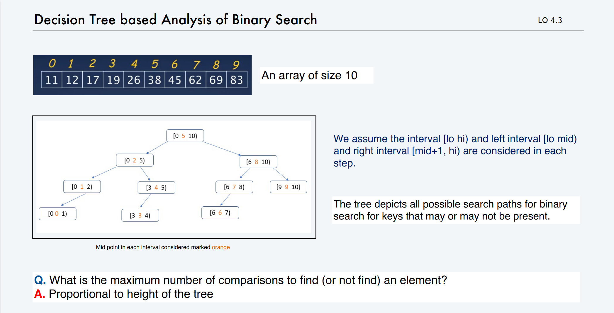

<style>.markdown-body {font-family:"Times New Roman", Times, serif;}</style>

CS112 - Data Structures
===

Review of CS111
---

### In the Java Virtual Machine (JVM):

 Stack:
- The stack holds the primitive data type directly in the stack.


	- They are "stacked" in the stack.
	- If they are not a primitive data type, then the stack holds the location of the variable in the "HEAP".
	- The size of items in the stack can  NOT change.

Heap:

- The heap is basically just a jumbo of data with different variables in the stack pointing to the heap.
- The abstract data types are stored in the heap.

Union Find
---

Today, we will see 3 algorithms that have different runtimes.

### Connectivity Problem:
1. m vertices
2. 2 operations:
	- Connect two vertices
	- Is there a path between the two vertices?

#### Algorithm 1 (Quick-find):
- The data structure used to implement this will be a array.
- the nodes p and q are connected if and only if they have the same id.
##### Operation 1: Union.

----

To merge components containing p and q, change all entries whose id equals id[p] to id[q].

----

- Start off with an array. Each number is a vertice.

| Vertice     | 0 | 1 | 2 | 3 | 4 | 5 | 6 | 7 | 8 | 9 |
|-------------|---|---|---|---|---|---|---|---|---|---|
| Data Stored | 0 | 1 | 2 | 3 | 4 | 5 | 6 | 7 | 8 | 9 |

1. Connect (3,4), the value under 3 gets replaced by the 4.

| Vertice     | 0 | 1 | 2 | 3       | 4 | 5 | 6 | 7 | 8 | 9 |
|-------------|---|---|---|---------|---|---|---|---|---|---|
| Data Stored | 0 | 1 | 2 | ***4*** | 4 | 5 | 6 | 7 | 8 | 9 |

2. Connect (2,8), the value under 2 gets replaced by the 8.

| Vertice     | 0 | 1 | 2       | 3 | 4 | 5 | 6 | 7 | 8 | 9 |
|-------------|---|---|---------|---|---|---|---|---|---|---|
| Data Stored | 0 | 1 | ***8*** | 4 | 4 | 5 | 6 | 7 | 8 | 9 |


3. Now, if I merge (4, 9), then then **all values** of 4 in the array gets changed.

| Vertice     | 0 | 1 | 2 | 3       | 4       | 5 | 6 | 7 | 8 | 9 |
|-------------|---|---|---|---------|---------|---|---|---|---|---|
| Data Stored | 0 | 1 | 8 | ***9*** | ***9*** | 5 | 6 | 7 | 8 | 9 |

##### Operation 2: Find.
- First, you look up the first value. (Ex: Does 4 connect to 9?)
- The value stored at 4 is 9.
- Next, you find the value at 9, which is still 9.
- Compare the two, and you will find that they **do** connect.

---

For the second operation, we want it to be faster.

Instead, we don't store the id of the vertice in the array.

**A parent is the one we designate as the representative of the family.**

##### Example:

| Vertice     | 0 | 1 | 2 | 3 | 4 | 5 | 6 | 7 | 8 | 9 |
|-------------|---|---|---|---|---|---|---|---|---|---|
| Data Stored | 0 | 1 | 9 | 4 | 9 | 6 | 6 | 7 | 8 | 9 |

Parents:

	0 - is 0's parent
	1 - is 1's parent
	3 - is the child of 4
	4 - is the child of 9
	5 - is the child of 6
	6 - the parent of 5
	7 - is 7's parent
	8 - is 8's parent
	9 - is it's own parent

#### Quick Union - Lazy Approach:
- Uses a integer array id[] of size N.
- So a better way to think of it is:
	- **Root** of i is id[id[...id[i]...]].
- Lookup occurs by finding the root parent of the number.
- Example: To find whether 2 and 3 are connected, look for the root of 2 first.
	- The root of 2 is 9, 9 is the parent.
  - Look for the root of 3. 3 points to 4, which then points to 9, making the root of 3 be 9.
  - Therefore, 2 is connected to 3.
- ***In layman's terms***: Instead of replacing the ids with the same ones, we just attach it without changing it.


#### Weighted Quick Union
- Modify quick-union to avoid tall trees.
- Keep track of the size of each tree (number of elements)
- Always link root of smaller tree to root of larger tree.

##### Analysis:
- Depth of any node (*x*) is *log n*. (log base 2)
	- Everytime you connect two trees, you will have one tree point to another tree. 

### Cost Model

| algorithm            | initialize | union   | find    |
|----------------------|------------|---------|---------|
| quick find           | n          | n       | 1       |
| quick union          | n          | n       | n       |
| weighted quick union | n          | *log n* | *log n* |

#### If you ALWAYS connect the smaller tree to the bigger tree, you will always have a better running time.


### The Problem with Arrays
- When your array is full and you want to make a new array, to copy things over to the new array, the array takes O(n) time to copy everything over.

#### Instead, we can use:

## Linked Lists
- Empty
- Nodes linked together

### So, what is a Node?
- A node has 2 pieces.
	- It has the data piece, and the link part, which will allow us to link to the next.


```Java

public class Node {
	int data; // This will be the data stored.
	Node next; // This will point to the next node.
	
	Node() {
		data = 0;
		next = null;
		}

	public static void main(String[] args) {
		Node f = new Node(); // Here the data is (0, null)
		f.data = 31;	// The data now becomes (31, null)
		Node s = new Node(); // Here the data is (0, null)
		s.data = 8; // s = (8, null)
		f.next = s;	// Use this to update the address containted in variable f.
		// f now becomes (31, s)
		}
	}

```

## Recitation #1

**Tilde Notation**: Basically Big O except keeping coefficient.

## Stacks and Queues

#### Fundamental data types
- Value: Collection of objects
- Operations: add, remove, iterate, test if empty
- Intent is clear when we add

### Stack
- It's like a stack of books.
- Each variable gets stacked on top of each other.
- Adding to the top of the stack is called "push"
- To remove an item from the top of the stack is called "pop"

**Overflow**: When you try to add an item into an stack with no space

**Underflow** : When you try to take an object out of a stack with nothing in it.

What happens if the array overflows? You must resize:

**Increasing array for a stack:**

There are two ways you can go about it.

1) Increase it by one.
	- Which means each time you push a new item, you'd have to make a new array and copy everything over. This is terrible and ends up being n time for each item leading to quadratic time.
2) Double it.
	- By doubling it, you're essentially paying for more so that you dont have to keep adding. Much better than incrementing by one.

**Decreasing array**:
- You should only decrease the array when the array is one-quarter full.

**So!!**

The most efficient way for stacks is:

- push() double size of array s[] when array is full.
- pop() halve size of the array s[] when the array is a quarter full.

**Stack implementation: resizing arrays vs Linked List**:

Linked list implementation:
- Every operation takes constant time in the worst case.
- Uses extra time and space to deal with the links.

Resizing-array implementation:
- Every operation takes constant amortized(buying more so u got leftover space) time.
- Less wasted space


### Queue
- Many Different types of queues.
- Last in First Out (LIFO), the oldest item in the queue will be the first one out.
- First in First Out (FIFO), the newest item in the queue will be the first one out.
- Removing an item from the queue is called **dequeue**,, inserting is called **enqueue**.


## Recitation #1
- Quick Find - Time Complexity is O(1)
- Quick Union - Time Complexity is O(n)


### Building a Decision Tree

- Decision tree is a theoretical tool used to analyze the running time of algorithms. It illustrates the possible execturions on inputs.
- You have to build the tree by running the algorithm.
	- So for each item, you start building that item.
	- The middle point is the middle point and you start building off of that.

Here is an Example:

<br>



#### Worst Case Comparisons:


Worst Case for successful Search:
- Average the number of comparisons for successful searches.

| Index   | # of comparisons |
|---------|------------------|
| 5       | 1                |
| 2       | 2                |
| 8       | 2                |
| 1       | 3                |
| 4       | 3                |
| 7       | 3                |
| 9       | 3                |
| 0       | 4                |
| 3       | 4                |
| 6       | 4                |
| ------- | 29/10 = 2.9      |

Worst Case for Unsuccessful Search:
- If we don't know how many keys are being searched, we can only affirm that the average will be between 3-4.

### Binary Search Trees

- At this point, we know different data structures, arrays and linked lists.

Why are arrays good:

	- Arrays are fast.
	- Array reads occur in O(1) time.
	- If you have a index for something in the array, reading it occurs in constant time.

Why are Linked lists good:

	- Linked lists can add unlimited items in O(n) time as long as you can find the end.
	- Especially using binary search on a linked list.
         - Linked lists that implement binary search run in O(n log n) time. 


## Symbol Table

### ArrayList<key, value>
- Stores a key/value pair
	- In a ArrayList, the first key is the index in the array.
	- The second key is the value.
- However, ArrayLists are slow, very very slow. The worst case for finding something in a 2D array would be O(n^2).
- The running time to add to a ArrayList is linear, or O(n).
	- That is slowwww.

Symbol Lists in general uses the same <key, value> pairing that exists in ArrayLists. 

However, usually, the key is not the "index of the array" but something unique to identify you...

**Store** <key, value>

A Symbol Table API:

```

public class ST<key extends Comparable<key>, Value>

	ST()		// create an empty symbol table

	void put(Key key, Value val)	// insert key-value pair

	Value get(Key key) 	// value paired with key

	boolean contains(Key key)	// is there a value paired with key?
	
	Iterable<Key> keys()	//all the keys in the symbol table.

	void delete(Key key)

	boolean isEmpty()

	int size()

```

### Binary Search Tree (BST)


In a Binary Search Tree, each node will have to keep track of the:
- key
- value
- left node
- right node

#### The Best case:
- When you have a very full tree where the height of the tree is log(n), then that is also the amount of time it would take to find something.
- O(log n) for insert
- O(log n) for search

#### The Worst Case:
- When you have a very skewed list, the length of time to find something is O(n) time.
- This means that it take O(n) time for both insert and search.
- This is fixable!!

In order to Insert:

Step 1: Search until it fails.
Step 2: Insert at failure point.

| 0 | 1 | 2 | 3 | 4 | 5 | 6 | 7 | 8 | 9 |
|---|---|---|---|---|---|---|---|---|---|
| 5 | 5 | 3 | 3 | 4 | 5 | 6 | 5 | 3 | 9 |

| 0 | 1 | 2 | 3 | 4 | 5 | 6 | 7 | 8 | 9 |
|---|---|---|---|---|---|---|---|---|---|
| 7 | 5 | 8 | 3 | 4 | 2 | 6 | 1 | 8 | 9 |


### Ways to Traverse a BST

1. In order traversal
- Outputs the data in order.


### Data Structures S22 Review

Problem 1:

a)

n=10
| when i is | j will run | runs n times |
|-----------|------------|--------------|
| 0         | 9          | n-1          |
| 1         | 8          | n-2          |
| 2         | 7          | n-3          |

ITS A GODDAMN TRIANGLE DAWG!!!!

The loop is run (n-1)*n/2 times. The outside for is (n-1) times multiplied by the inside for loop which is (n/2) times.

b) Runs inside for loop n/2*(n-1) times with 2 array accesses per time. Giving us n for the inner for loop. The outer for loop runs n-1 times with 4 array accesses per time giving us 4n-4 added to n(n-1) which gives us n^2-3n-4.

c) ~n^2

d) O(n^2)

Problem 2:

a)

| 0 | 1 | 2 | 3 | 4 | 5 | 6 | 7 | 8 | 9 |
|---|---|---|---|---|---|---|---|---|---|
| 5 | 5 | 3 | 3 | 4 | 5 | 6 | 5 | 3 | 9 |

b) INCORRECT

| 0 | 1 | 2 | 3 | 4 | 5 | 6 | 7 | 8 | 9 |
|---|---|---|---|---|---|---|---|---|---|
| 7 | 5 | 8 | 3 | 4 | 2 | 6 | 1 | 8 | 9 |


Problem 3:

a)

3 5 4
16
0

b) eueuq dna kcats

c) For 13524 to become possible, you would need the first iteration to be true, printing out 1. Then, you would need the second iteration to return false, to push 2 into the stack. Next, 3 must return true, which it can. Afterwards, 4 must return false and get pushed into the stack. Lastly, 5 would need to be printed out with randomBool returning true. However, you would not be able to get 24 as 2 is further down the stack than 4 is meaning 4 would be printed first.

d) That is possible, following the same logic as before 135 can all be printed out with a true boolean and 42 comes out in the right order.

Problem 4:

a)

for(Node ptr = uniqueColorList; ptr.next != null; ptr = ptr.next) {
	if(ptr.pixel.equals(color)) {
		return true;
		}
}
return false;

b)

Node ptr = uniqueColorList;
uniqueColorList = new Node();
uniqueColorList.pixel = color;
uniqueColorList.next = ptr;

Problem 5:

a) 5

b) (3+3+3+1+2+3+3)/7 = 2.something

WRONG!!!! Beware of the left or right branch!!!

c) O(n) if the tree is extremely scewed, making it need O(n) comparisons needed to find the node to remove.

d) B

WRONG!!! Dont be lazy just draw it out bro...
