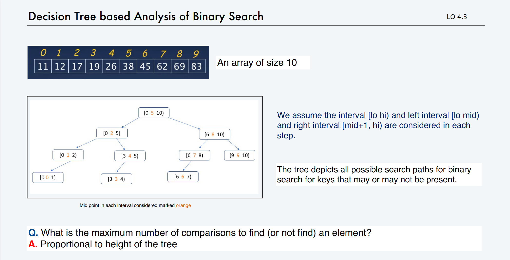
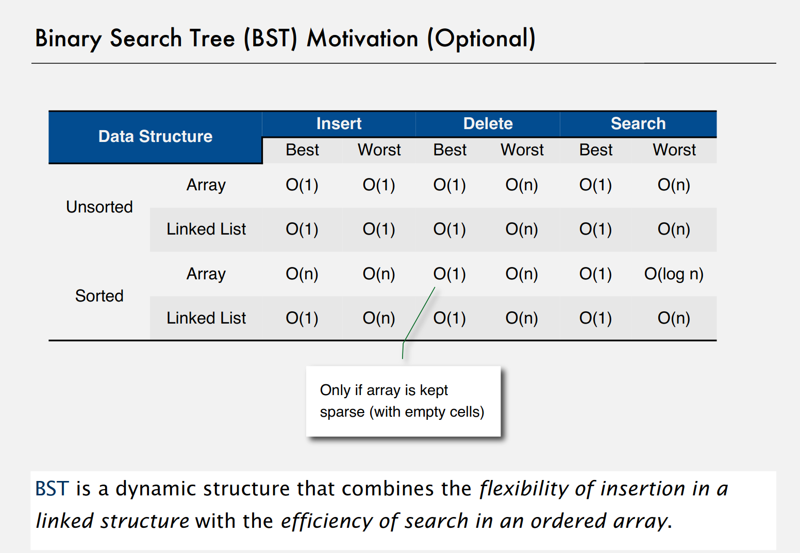
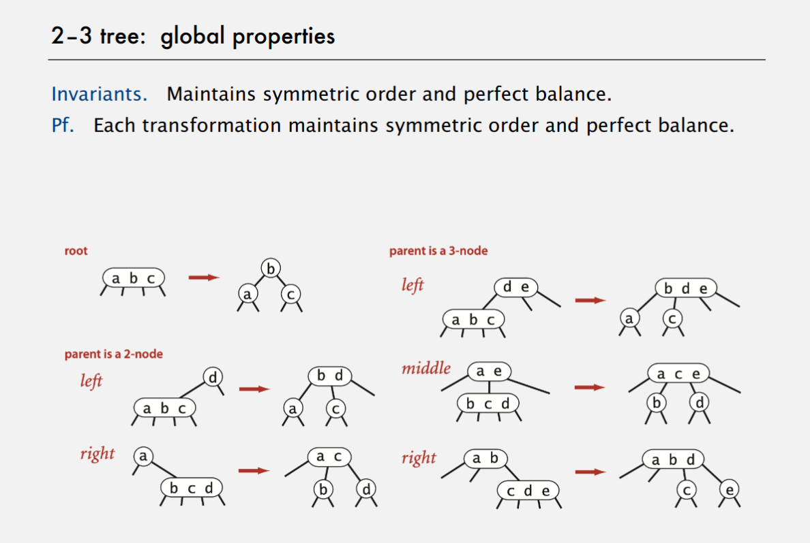
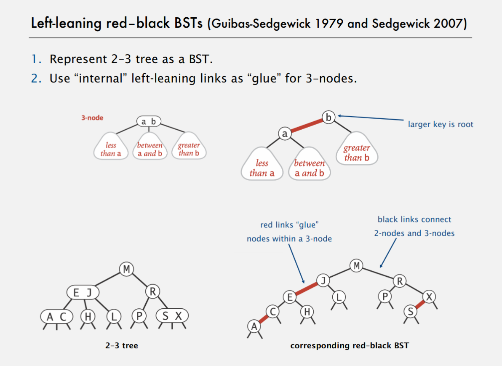
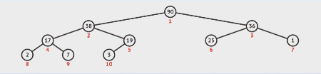
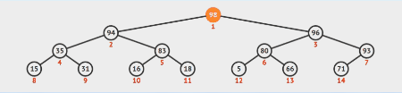
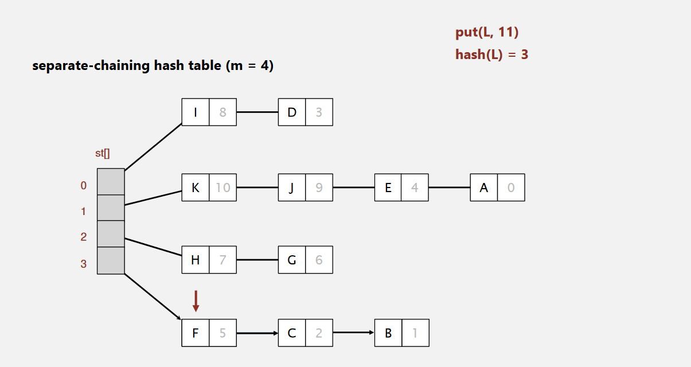
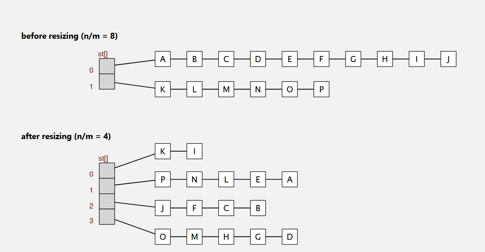

<style>.markdown-body {font-family:"Times New Roman", Times, serif;}</style>

CS112 - Data Structures
===

Review of CS111
---

### In the Java Virtual Machine (JVM):

 Stack:
- The stack holds the primitive data type directly in the stack.


	- They are "stacked" in the stack.
	- If they are not a primitive data type, then the stack holds the location of the variable in the "HEAP".
	- The size of items in the stack can  NOT change.

Heap:

- The heap is basically just a jumbo of data with different variables in the stack pointing to the heap.
- The abstract data types are stored in the heap.

Union Find
---

Today, we will see 3 algorithms that have different runtimes.

### Connectivity Problem:
1. m vertices
2. 2 operations:
	- Connect two vertices
	- Is there a path between the two vertices?

#### Algorithm 1 (Quick-find):
- The data structure used to implement this will be a array.
- the nodes p and q are connected if and only if they have the same id.
##### Operation 1: Union.

----

To merge components containing p and q, change all entries whose id equals id[p] to id[q].

----

- Start off with an array. Each number is a vertice.

| Vertice     | 0   | 1   | 2   | 3   | 4   | 5   | 6   | 7   | 8   | 9   |
| ----------- | --- | --- | --- | --- | --- | --- | --- | --- | --- | --- |
| Data Stored | 0   | 1   | 2   | 3   | 4   | 5   | 6   | 7   | 8   | 9   |

1. Connect (3,4), the value under 3 gets replaced by the 4.

| Vertice     | 0   | 1   | 2   | 3       | 4   | 5   | 6   | 7   | 8   | 9   |
| ----------- | --- | --- | --- | ------- | --- | --- | --- | --- | --- | --- |
| Data Stored | 0   | 1   | 2   | ***4*** | 4   | 5   | 6   | 7   | 8   | 9   |

2. Connect (2,8), the value under 2 gets replaced by the 8.

| Vertice     | 0   | 1   | 2       | 3   | 4   | 5   | 6   | 7   | 8   | 9   |
| ----------- | --- | --- | ------- | --- | --- | --- | --- | --- | --- | --- |
| Data Stored | 0   | 1   | ***8*** | 4   | 4   | 5   | 6   | 7   | 8   | 9   |


3. Now, if I merge (4, 9), then then **all values** of 4 in the array gets changed.

| Vertice     | 0   | 1   | 2   | 3       | 4       | 5   | 6   | 7   | 8   | 9   |
| ----------- | --- | --- | --- | ------- | ------- | --- | --- | --- | --- | --- |
| Data Stored | 0   | 1   | 8   | ***9*** | ***9*** | 5   | 6   | 7   | 8   | 9   |

##### Operation 2: Find.
- First, you look up the first value. (Ex: Does 4 connect to 9?)
- The value stored at 4 is 9.
- Next, you find the value at 9, which is still 9.
- Compare the two, and you will find that they **do** connect.

---

For the second operation, we want it to be faster.

Instead, we don't store the id of the vertice in the array.

**A parent is the one we designate as the representative of the family.**

##### Example:

| Vertice     | 0   | 1   | 2   | 3   | 4   | 5   | 6   | 7   | 8   | 9   |
| ----------- | --- | --- | --- | --- | --- | --- | --- | --- | --- | --- |
| Data Stored | 0   | 1   | 9   | 4   | 9   | 6   | 6   | 7   | 8   | 9   |

Parents:

	0 - is 0's parent
	1 - is 1's parent
	3 - is the child of 4
	4 - is the child of 9
	5 - is the child of 6
	6 - the parent of 5
	7 - is 7's parent
	8 - is 8's parent
	9 - is it's own parent

#### Quick Union - Lazy Approach:
- Uses a integer array id[] of size N.
- So a better way to think of it is:
	- **Root** of i is id[id[...id[i]...]].
- Lookup occurs by finding the root parent of the number.
- Example: To find whether 2 and 3 are connected, look for the root of 2 first.
	- The root of 2 is 9, 9 is the parent.
  - Look for the root of 3. 3 points to 4, which then points to 9, making the root of 3 be 9.
  - Therefore, 2 is connected to 3.
- ***In layman's terms***: Instead of replacing the ids with the same ones, we just attach it without changing it.


#### Weighted Quick Union
- Modify quick-union to avoid tall trees.
- Keep track of the size of each tree (number of elements)
- Always link root of smaller tree to root of larger tree.

##### Analysis:
- Depth of any node (*x*) is *log n*. (log base 2)
	- Everytime you connect two trees, you will have one tree point to another tree. 

### Cost Model

| algorithm            | initialize | union   | find    |
| -------------------- | ---------- | ------- | ------- |
| quick find           | n          | n       | 1       |
| quick union          | n          | n       | n       |
| weighted quick union | n          | *log n* | *log n* |

#### If you ALWAYS connect the smaller tree to the bigger tree, you will always have a better running time.


### The Problem with Arrays
- When your array is full and you want to make a new array, to copy things over to the new array, the array takes O(n) time to copy everything over.

#### Instead, we can use:

## Linked Lists
- Empty
- Nodes linked together

### So, what is a Node?
- A node has 2 pieces.
	- It has the data piece, and the link part, which will allow us to link to the next.


```Java

public class Node {
	int data; // This will be the data stored.
	Node next; // This will point to the next node.
	
	Node() {
		data = 0;
		next = null;
		}

	public static void main(String[] args) {
		Node f = new Node(); // Here the data is (0, null)
		f.data = 31;	// The data now becomes (31, null)
		Node s = new Node(); // Here the data is (0, null)
		s.data = 8; // s = (8, null)
		f.next = s;	// Use this to update the address containted in variable f.
		// f now becomes (31, s)
		}
	}

```

## Recitation #1

**Tilde Notation**: Basically Big O except keeping coefficient.

## Stacks and Queues

#### Fundamental data types
- Value: Collection of objects
- Operations: add, remove, iterate, test if empty
- Intent is clear when we add

### Stack
- It's like a stack of books.
- Each variable gets stacked on top of each other.
- Adding to the top of the stack is called "push"
- To remove an item from the top of the stack is called "pop"

**Overflow**: When you try to add an item into an stack with no space

**Underflow** : When you try to take an object out of a stack with nothing in it.

What happens if the array overflows? You must resize:

**Increasing array for a stack:**

There are two ways you can go about it.

1) Increase it by one.
	- Which means each time you push a new item, you'd have to make a new array and copy everything over. This is terrible and ends up being n time for each item leading to quadratic time.
2) Double it.
	- By doubling it, you're essentially paying for more so that you dont have to keep adding. Much better than incrementing by one.

**Decreasing array**:
- You should only decrease the array when the array is one-quarter full.

**So!!**

The most efficient way for stacks is:

- push() double size of array s[] when array is full.
- pop() halve size of the array s[] when the array is a quarter full.

**Stack implementation: resizing arrays vs Linked List**:

Linked list implementation:
- Every operation takes constant time in the worst case.
- Uses extra time and space to deal with the links.

Resizing-array implementation:
- Every operation takes constant amortized(buying more so u got leftover space) time.
- Less wasted space


#### Parameterized Stacks:
- Add a type parameter in the stack initialization so that it only accepts a certain type. This allows us to get a compile time error instead of a runtime error.
- These are called generic types, which is better than strings.
- Helps handle multiple types of data.
- Parameterized stacks only work with linked lists. The arrays in Java do not allow for generic types to initialize arrays.

#### Autoboxing:
- Java helps you deal with primitive types.

Wrapper style:
- Each primitive type has a **wrapper** object type.
- Ex: *Integer* is the wrapper type for *int*.

**Autoboxing**: Automatic cast between a primitive type and its wrapper.


### Queue
- Many Different types of queues.
- Last in First Out (LIFO), the oldest item in the queue will be the first one out.
- First in First Out (FIFO), the newest item in the queue will be the first one out.
- Removing an item from the queue is called **dequeue**,, inserting is called **enqueue**.


## Recitation #1
- Quick Find - Time Complexity is O(1)
- Quick Union - Time Complexity is O(n)


### Building a Decision Tree

- Decision tree is a theoretical tool used to analyze the running time of algorithms. It illustrates the possible execturions on inputs.
- You have to build the tree by running the algorithm.
	- So for each item, you start building that item.
	- The middle point is the middle point and you start building off of that.

Here is an Example:

<br>



#### Worst Case Comparisons:


Worst Case for successful Search:
- Average the number of comparisons for successful searches.

| Index   | # of comparisons |
| ------- | ---------------- |
| 5       | 1                |
| 2       | 2                |
| 8       | 2                |
| 1       | 3                |
| 4       | 3                |
| 7       | 3                |
| 9       | 3                |
| 0       | 4                |
| 3       | 4                |
| 6       | 4                |
| ------- | 29/10 = 2.9      |

Worst Case for Unsuccessful Search:
- If we don't know how many keys are being searched, we can only affirm that the average will be between 3-4.

### Binary Search Trees

- At this point, we know different data structures, arrays and linked lists.

Why are arrays good:

	- Arrays are fast.
	- Array reads occur in O(1) time.
	- If you have a index for something in the array, reading it occurs in constant time.

Why are Linked lists good:

	- Linked lists can add unlimited items in O(n) time as long as you can find the end.
	- Especially using binary search on a linked list.
         - Linked lists that implement binary search run in O(n log n) time. 


## Symbol Table

### ArrayList<key, value>
- Stores a key/value pair
	- In a ArrayList, the first key is the index in the array.
	- The second key is the value.
- However, ArrayLists are slow, very very slow. The worst case for finding something in a 2D array would be O(n^2).
- The running time to add to a ArrayList is linear, or O(n).
	- That is slowwww.

Symbol Lists in general uses the same <key, value> pairing that exists in ArrayLists. 

However, usually, the key is not the "index of the array" but something unique to identify you...

**Store** <key, value>

A Symbol Table API:

```

public class ST<key extends Comparable<key>, Value>

	ST()		// create an empty symbol table

	void put(Key key, Value val)	// insert key-value pair

	Value get(Key key) 	// value paired with key

	boolean contains(Key key)	// is there a value paired with key?
	
	Iterable<Key> keys()	//all the keys in the symbol table.

	void delete(Key key)

	boolean isEmpty()

	int size()

```

## Binary Search Tree (BST)



In a Binary Search Tree, each node will have to keep track of the:
- key
- value
- left node
- right node

#### The Best case:
- When you have a very full tree where the height of the tree is log(n), then that is also the amount of time it would take to find something.
- O(log n) for insert
- O(log n) for search

#### The Worst Case:
- When you have a very skewed list, the length of time to find something is O(n) time.
- This means that it take O(n) time for both insert and search.
- This is fixable!!

In order to Insert:

Step 1: Search until it fails.
Step 2: Insert at failure point.

| 0   | 1   | 2   | 3   | 4   | 5   | 6   | 7   | 8   | 9   |
| --- | --- | --- | --- | --- | --- | --- | --- | --- | --- |
| 5   | 5   | 3   | 3   | 4   | 5   | 6   | 5   | 3   | 9   |

| 0   | 1   | 2   | 3   | 4   | 5   | 6   | 7   | 8   | 9   |
| --- | --- | --- | --- | --- | --- | --- | --- | --- | --- |
| 7   | 5   | 8   | 3   | 4   | 2   | 6   | 1   | 8   | 9   |


### Ways to Traverse a BST

1. In order traversal
- Outputs the data in order.


### Data Structures S22 Review

Problem 1:

a)

n=10
| when i is | j will run | runs n times |
| --------- | ---------- | ------------ |
| 0         | 9          | n-1          |
| 1         | 8          | n-2          |
| 2         | 7          | n-3          |

ITS A GODDAMN TRIANGLE DAWG!!!!

The loop is run (n-1)*n/2 times. The outside for is (n-1) times multiplied by the inside for loop which is (n/2) times.

b) Runs inside for loop n/2*(n-1) times with 2 array accesses per time. Giving us n for the inner for loop. The outer for loop runs n-1 times with 4 array accesses per time giving us 4n-4 added to n(n-1) which gives us n^2-3n-4.

c) ~n^2

d) O(n^2)

Problem 2:

a)

| 0   | 1   | 2   | 3   | 4   | 5   | 6   | 7   | 8   | 9   |
| --- | --- | --- | --- | --- | --- | --- | --- | --- | --- |
| 5   | 5   | 3   | 3   | 4   | 5   | 6   | 5   | 3   | 9   |

b) INCORRECT

| 0   | 1   | 2   | 3   | 4   | 5   | 6   | 7   | 8   | 9   |
| --- | --- | --- | --- | --- | --- | --- | --- | --- | --- |
| 7   | 5   | 8   | 3   | 4   | 2   | 6   | 1   | 8   | 9   |

correct answer:

| parent | 0   | 1   | 2   | 3   | 4   | 5   | 6   | 7   | 8   | 9   |
| ------ | --- | --- | --- | --- | --- | --- | --- | --- | --- | --- |
| -      | 7   | 5   | 8   | 3   | 4   | 8   | 6   | 5   | 8   | 9   |


c)

Draw out a tree first! Really helps.

| parent | 0   | 1   | 2   | 3   | 4   | 5   | 6   | 7   | 8   | 9   |
| ------ | --- | --- | --- | --- | --- | --- | --- | --- | --- | --- |
| -      | 0   | 0   | 0   | 3   | 4   | 1   | 6   | 0   | 2   | 9   |

| size | 0   | 1   | 2   | 3   | 4   | 5   | 6   | 7   | 8   | 9   |
| ---- | --- | --- | --- | --- | --- | --- | --- | --- | --- | --- |
| -    | 6   | 2   | 2   | 1   | 1   | 1   | 1   | 1   | 1   | 1   |


Problem 3:

a)

3 5 4
16
0

b) eueuq dna kcats

c) For 13524 to become possible, you would need the first iteration to be true, printing out 1. Then, you would need the second iteration to return false, to push 2 into the stack. Next, 3 must return true, which it can. Afterwards, 4 must return false and get pushed into the stack. Lastly, 5 would need to be printed out with randomBool returning true. However, you would not be able to get 24 as 2 is further down the stack than 4 is meaning 4 would be printed first.

d) That is possible, following the same logic as before 135 can all be printed out with a true boolean and 42 comes out in the right order.

Problem 4:

a)

for(Node ptr = uniqueColorList; ptr.next != null; ptr = ptr.next) {
	if(ptr.pixel.equals(color)) {
		return true;
		}
}
return false;

b)

Node ptr = uniqueColorList;
uniqueColorList = new Node();
uniqueColorList.pixel = color;
uniqueColorList.next = ptr;

Problem 5:

a) 5

b) (3+3+3+1+2+3+3)/7 = 2.something

WRONG!!!! Beware of the left or right branch!!!

c) O(n) if the tree is extremely scewed, making it need O(n) comparisons needed to find the node to remove.

d) B

WRONG!!! Dont be lazy just draw it out bro...

### Fall 2022 Practice Exam:

Problem 1:

a) 2*rows*cols
b) ~2*rows*cols
c) O(rows*cols)

Problem 2:

a) A for loop using sequential search on the unsorted array  of size A. Inside the for loop, for each of the items in the unsorted array, we will use binary search to look for that item in the sorted array. This would give us a runtime of O(n*logm).

b) O(n*logm)

Problem 3:

| a) Yes | b) Yes | c) No | d) Yes | e) Yes | f) No | g) 4 |
| ------ | ------ | ----- | ------ | ------ | ----- | ---- |

a) add s = copy;

b) The worst case runtime for push would be O(n) and that would be if the array was full.

c) 4

Problem 5:

a) O(1) because inserting a node only requires making a new node linked to the element after the reference to the end of the list and then relinking the reference to that new node.

b) O(n) if the algorithm traverses the entire linked list before finding the item. Ex: if it goes left first, and the item you want to insert is the largest in the linked list.
 

### 2-3 Trees

- The problem with BSTs is that it could take UP TO linear time to delete and search.
- We need a data structure that GUARANTEES logarithmic time.
- We call these balanced trees.
- The 2-3 Tree has 2 types of nodes:
	- A 2 node, where there is a node has one key and 2 children.
	- A 3 node, where there is a node has two keys and 3 children.
		- In a 3 node, the left leaf contains all numbers smaller than the first key.
		- The middle leaf contains all the values between the first and second key.
		- The right leaf contains values greater than the second key.
- 2-3 Trees maintain a symmetrical order.
- They maintain a perfect balance, meaning that one side will not get significantly longer than the other.



#### When you insert into a 3-node:
- You first turn turn the 3-node into a 4-node **temporarily**.
- This means that the 3-node now has 3 keys, making it a 4-node.
- Absolutely not acceptable so what you do is you pass the middle key up to the parent branch.
- If the parent is a 3-node, you keep passing it up the tree.
	- If not a 3-node and is a 2-node, you can just insert it and make the 2-node a 3-node.
- If the 3-node is the root of the tree, you pass the middle key up and make it the new root by making a new node! (**Only time you make a new node!!**)

### Red-black BSTs

#### Left Leaning Red-Black Trees
- Now, the problem with the 2-3 tree is that it is difficult to implement!
- To make it simple, they thought, how can they represent a 3-node with a 2-node?
- In order to accomplish this, you split the 3-node into 2 different nodes that are linked together with a <b style="color: red">red</b>.
- The larger key becomes the top item of the red-black tree and the smaller key gets connected to the LEFT with a <b style="color: red">red</b> link.



What's important to realize for the height is:
- In a 2-3 Tree, the height is of at most log_2(n). In best case, log_3(n).
- In the Red-Black tree, you need to think about the red links as **horizontal** meaning that the height would still be of log_2(n) at worst case
- But even if you didn't do that and counted the red links:

#### Left Leaning Red-black trees are EQUIVALENT to a BST such that:
1) No nodes have 2 red links connected to it. (Left leaning)
2) Every path from root to null has the same number of blacck links
	- This means there is perfect black balance.
3) All the red links lean left.

#### Left leaning Red-black Tree Inserting
- In order to insert into a 2-node, you need to:
1) Do a BST insert
2) Color the new link Red
3) Make sure that you follow all of the equivalence statements above.
4) If the parent realizes it has 2 red links, then it flips the colors of its 2 children links and flips itself. See image. Then it changes it's link to it's own parent to the opposite color.
5) Then, the parent's parent (grandparent) realizes there's a problem and flips it again.

### <b style="color: green">Really fucking important: 2 red links = a 4-node!!!</b>

#### There are 3 Different operations in order to Sort out a LLRB BST:

- Flip the colors of the links of a parent.
- Rotate right
- Rotate left

#### Elementary red-black BST operations

- **Left rotation**: Orient a (temporarily) right leaning red link to lean left.

TODO: Find image

- **Right rotation**: Orient a left leaning red link (temporarily) right.

### Collections
- A **collection** is a data type that stores a group of items.

| data type      | core operations            | data structures    |
| -------------- | -------------------------- | ------------------ |
| stack          | push, pop, peek            | linked list, array |
| queue          | enqueue, dequeue, peek     | linked list, array |
| priority queue | insert, remove, peek       | binary heap, BST   |
| symbol table   | put, get, contains, delete | BST, hash table    |
| set            | add, remove, contains      | BST, hash table    |

The challenge is to find the right data structure for the right job and efficiently implement it.

| Implementation  | INSERT | DELETE-MAX | MAX   |
| --------------- | ------ | ---------- | ----- |
| unordered array | 1      | N          | N     |
| ordered array   | N      | 1          | 1     |
| goal            | log N  | log N      | log N |

Solution: "locally" ordered array, a.k.a. binary heap.

#### A Complete Binary Tree

Binary tree: empty or node with links to left and right binary trees.

Complete binary tree: Every level (except possibly the last) is completely filled, and all nodes are as far left as possible.

Properties:
- Height of a complete binary tree of size N is log N.
- Height increases only when n is a power of 2.
- Number of nodes in a complete binary tree of height h is 2^h - 1.

#### Binary Heap
- Array representation of a heap-ordered complete binary tree.

Heap-ordered binary tree: 
- Keys in nodes
- Parent's key no smaller than children's keys.

Array Reprensentation:
- Indices start at 1.
- Takes nodes in level order.
- No explicit links .
needed

Why does an array for max priority queue not start at 0?
- Because then the parent of a node at index k would be at index (k-1)/2, which is not an integer.
- Or, you can look at it this way, if you start at k=0, the left index would be 2k, and the right index would be 2k+1. This is not possible!!!

#### To Insert:



#### To Build:


#### To Delete Max:



## Hash Tables

#### Overview:
- Hash functions
- separate chaining
- linear probing
- context

Hash Tables attempt to insert, delete, and search for items in constant time.

Hash Tables use arrays and indices but uses something called a hash function to determine the index.

#### General Idea:
- If keys are small integers, we can use an array to implement a symbol table.
- Intepret key as an array index and store the value associated with key i in array position i.
- The issue is that you would need a table of size 2^32 to store 4-byte integers (too large)

### Hashing: Basic Plan
- Save items in a **key-indexed table** (index is a function of the keys).
- **Hash function**: Method for computing array index from key.

#### Issues:
- Computing the hash function.
  - The hash function has to be FAST! So, it can not take too long.
- Equality test: Method for checking whether two keys are equal.
- Collision resolution: Algorithm and data structure to hande two keys that hash to the same array index.
  - The two techniques:
    - Linear probing: If the index is taken, then you go to the next index and check if it's taken. If it is, then you go to the next index and so on.
    - Separate chaining: If the index is taken, then you make a linked list at that index and add the new key to the linked list.

### Hash Function

---

- **Hash function**: Maps keys to integers in a fixed range.

- `hash(key) = (key) % M`

#### Computing the Hash Function

**Idealistic goal**: Scramble the keys uniformly to produce a table index.

- It should be deterministic -- same key always maps to same index.
- Efficiently computable
- Each table index should be equally likely for each key!!

#### Uniform Hashing Assumption
- Each key is equally likely to hash to an integer between 0 and M-1.

Example: Throwing balls uniformly at random into m bins. Should be an equal chance to land in any of the bins.

### Separate-chaining Symbol Table

---

Use an array of linked lists to implement a symbol table.
- Hash: map key to integer i between 0 and M-1.
- Insert: put at front of ith chain if not already in chain.
- Search: Sequential search in ith chain.



#### Separate Chaining: Insertion
- Insertion is easy. Just add the new key to the front of the linked list.
- m = 2, `hash(key) = (key) % M`
- We want the strings to be as short as possible so that the search time is as fast as possible.

#### Rehashing in a Separate Chaining Hash Table

Goal: Average length of list *n / m* is constant.
- Double table size when average length of list *n / m* exceeds a constant *t* usually 8.
- Halve table size when average length of list *n / m* is less than a constant *t* usually 2.
- Note: Need to rehash all keys when resizing.



