# Introduction to Discrete Structures 1

Propositional Logic
---
The Foundation for Writing Proofs:

Axioms 
- Are statements that can be used without any proof.
- 
Propositions
- are a statement that can be either true or false.
- They can be verified using axioms.
- Propositions do  not contain variables that need to be defined.

Propositional Logic is what we use to determine the truth of a proposition.


Which of these are propositions?
1. Please do your homework - Not a proposition (It is a imperative)
2. Sky is blue - Proposition
3. If it rains, roads will be wet - Proposition
4. If pigs fly, then your account won't get hacked - Proposition
5. If all humans are mortal and all Greeks are human, then all Greeks are mortal. - Proposition
6. Are you interested in CS 205? - Not a Proposition

---

Atomic and Compound Propositions
- A single proposition may be represented as a propositional variable.
- An atomic proposition is a single proposition.
- A compound proposition is one that combines atomic propositions using logical operators. (Such as "and" or "^" in symbols)

---

Negation of a Proposition
1. n >= 1 ---> negation ---> n < 1
2. n >= 1 and n is prime ---> negation ---> n is less than 1 and is not prime

---

Three Logicians walk into a bar.

The bartender asks if they want a drink.

The first logician says "I dont know."

The second logician says "I dont know."

The third logician says "Yes."

---

**Logical Operators**:

**AND**: "^"

**Logical Operator: OR**: "v"

- Logical or is also called disjunction.


**Exclusive Or**: "⊕"

**NEGATION**: "¬"

- Ovserve either a proposition is true or false and swaps it.

**IMPLICATION**: -->

**BICONDITIONAL**: <-->


---

Truth Tables for the following propositional statements, where p,q,r are propositions.

1. (P ^ Q) v r

| p   | q   | (p ^ q) |
| --- | --- | ------- |
| T   | T   | T       |
| T   | F   | F       |
| F   | T   | F       |
| F   | F   | F       |


---


Satisfiability
- A compound proposition is satisfiable if and only if there exists at least one assignment to the propositional variables that makes the entire proposition true.
- In a truth table this is a line that is true.
- For example, exclusive OR had two such assignments.


More Satisfiability
- p v negation p is always going to evaluate to True as either p itself is true, or the negation of p is true.
- p ^ negation p is always going to evaluate to False as a statement can not be both true and false.

Examples:
1. ¬p v ( p ^ q ) This is  satisfiable.
2. ( p v q ) ^ ¬p ^ ¬q ---> This is not satisfiable.


---

**Consistency**:
- A set of compound propositions are consistent if there exists truth assignments such that all propositions are satisfied at the same time.
- First, we will show how two compound propositions using the atomic propositions p and q, are consistent.
- Then we will introduce a third proposition to show when they are no longer consistent.


| p   | q   | p v q | p v ¬q | ¬p  |
| --- | --- | ----- | ------ | --- |
| T   | T   | T     | T      | F   |
| T   | F   | T     | T      | F   |
| F   | T   | T     | F      | T   |
| F   | F   | F     | T      | T   |


---

Is the following set of statements consistent?

	Statement 1: p ^ q
	Statement 2: p v ¬q 
	Statement 3: ¬q 
| p   | q   | p^q | p v ¬q | ¬q  |
| --- | --- | --- | ------ | --- |
| T   | T   | T   | T      | F   |
| T   | F   | F   | T      | T   |
| F   | T   | F   | F      | F   |
| F   | F   | F   | T      | T   |

Not consistent.

---

**Implications**:
- An implication is a compound proposition using propositions, p and q, stated as if p then q or p implies q.
- p is called the premise or sufficient condition for q.
- q is called the conclusion for necessary condition : p.
- This means that if p is true, q HAS to be true.
- However, if p is not true, q can STILL be true.

| p   | q   | p => q |
| --- | --- | ------ |
| T   | T   | T      |
| T   | F   | F      |
| F   | T   | T      |
| F   | F   | T      |

**Implication: Converse**
- Give an implication p, implies q, the converse is q implies p.
- If an implication is true, its converse does not need to be true.

| p   | q   | p => q | q => p |
| --- | --- | ------ | ------ |
| T   | T   | T      | T      |
| T   | F   | F      | F      |
| F   | T   | T      | T      |
| F   | F   | T      | T      |
|     |     |        |        |
- Let's consider the following truth table:

	- Example: Let x and y be real numbers with y not equal to zero.
         - p = "x is rational and y is rational"
         - ¬p = "x is not rational, or y is not rational."
         - q = "x/y is rational."
         - ¬q = "x/y is not rational."

| p   | q   | p => q | ¬p => ¬q |
| --- | --- | ------ | -------- |
| T   | T   | T      | T        |
| T   | F   | F      | T        |
| F   | T   | T      | F        |
| F   | F   | T      | T        |

**Implication: Inverse**
- Give an implication, p implies q, the inverse is not p implies not q.
- If an implication is true, its inverse need not be true.
- However, if the converse of an implication is true, than the inverse is true and vice versa.

| p   | q   | p => q | ¬p => ¬q |
| --- | --- | ------ | -------- |
| T   | T   | T      | T        |
| T   | F   | F      | T        |
| F   | T   | T      | F        |
| F   | F   | T      | T        |

**Implication: Contrapositive**
- Give an implication p implies q, the **contrapositive** is not q implies not p.
- If an implication is true, its contrapositive is true and vice versa.
- This can be used in prove by contraposition.

#### Recitation 1

Proposition Statements

1) p ^ (q v r)


| p   | q   | r   | q v r | p ^ (q v r) |
| --- | --- | --- | ----- | ----------- |
| F   | F   | F   | F     | F           |
| F   | F   | T   | T     | F           |
| F   | T   | F   | T     | F           |
| T   | F   | F   | F     | F           |
| F   | T   | T   | T     | F           |
| T   | F   | T   | T     | T           |
| T   | T   | F   | T     | T           |
| T   | T   | T   | T     | T           |

Question: Given integer n, write all possible assigments from a(1) to a(n).

	For n=1:

	a(1) is: T/F

	For n=2:

	Write a(n-1) twice: <br>
	a(2) is: <br>
	T(from a(1)) - F
	F(from a(1))- F
	T(from a(1))- T
	F(from a(1))- T

2) (p ^ q) v (p ^ r)

| p   | q   | r   | p ^ q | p ^ r | (p ^ q) v (p ^ r) |
| --- | --- | --- | ----- | ----- | ----------------- |
| T   | T   | T   | T     | T     | T                 |
| T   | T   | F   | T     | F     | T                 |
| T   | F   | T   | F     | T     | T                 |
| T   | F   | F   | F     | F     | F                 |
| F   | T   | T   | F     | F     | F                 |
| F   | T   | F   | F     | F     | F                 |
| F   | F   | T   | F     | F     | F                 |
| F   | F   | F   | F     | F     | F                 |

**Proposition hunt**:

	P: You get an A in finals.
	Q: You do every exercise in the textbook.
	R: You get an A in the class.

	a) You get A in class (R), but you do not do every exercise in textbook. (¬Q)
		R ^ ¬Q
	b) You get A on the finals, you do every exercise in textbook, and you get A in class.
		P ^ Q ^ R
	c) To get a A in class, it is necessary to get an A on finals.
		R -> P
	d) You get a A on final, but you don't do every exercise in the textbook, nevertheless, you get A in class.
		P ^ ¬Q ^ R

Exercise: There are three students in a class (A, B, C) each can vote YES or NO on an issue. Create a truth table for the boolean function which takes as an input the votes and returns whether or not an even number of votes was casted.

(¬A ^ B ^ C) v (¬A ^ ¬B ^ ¬C) v (A ^ ¬B ^ C) v (A ^ B ^ ¬C)

or the better one:

¬((A ⊕ B ⊕ C) v (A ^ B ^ C))

	Why is this better?
	This is a better answer because with the ex-or you can just count the number of trues and falses and if the number of trues is even, then the result is true. 
	
	The ex-ors will return true if there are exactly 1 Yes. The other side will give a true if there are exactly 3 yes. Then, the negation outside cancels it out, making the statement return false, which is what we want.

| A   | B   | C   | A ^ B ^ ¬C | A ^ ¬B ^ C | ¬A ^ B ^ C | ¬A ^ ¬B ^ ¬C |
| --- | --- | --- | ---------- | ---------- | ---------- | ------------ |
| T   | T   | T   | F          | F          | F          | F            |
| T   | T   | F   | T          | F          | F          | F            |
| T   | F   | T   | F          | T          | F          | F            |
| T   | F   | F   | F          | F          | F          | F            |
| F   | T   | T   | F          | F          | T          | F            |
| F   | T   | F   | F          | F          | F          | F            |
| F   | F   | T   | F          | F          | F          | F            |
| F   | F   | F   | F          | F          | F          | T            |

----

Applications of Propositions
---

### Biconditional Implications: If and only if
- p <=> q is the bicondition implication between p and q.
- Biconditional implication is true only if an implication and it's converse are both true. (So, if p implies q and q also implies p)

| p   | q   | p <=> q |
| --- | --- | ------- |
| T   | T   | T       |
| T   | F   | F       |
| F   | T   | F       |
| F   | F   | T       |

#### Examples:

Convert the following statements to logical propositions.

1. Roads will be wet, if it rains.

	q => p

2. students will pass the exam if he studies tonight.

	q => p

3. you can only pass the exam if you study tonight. **hard**

	| p   | q   | Statement |
	| --- | --- | --------- |
	| T   | T   | T         |
	| T   | F   | F         |
	| F   | T   | T         |
	| F   | F   | T         |

	p => q


4. It is below freezing and snowing.

	p ^ q

5. It is either below freezing or snowing, but not both.

	p ⊕ q

6. I will go to class if I feel like it.

	p => q

	| p   | q   | statement |
	| --- | --- | --------- |
	| T   | T   | T         |
	| T   | F   | F         |
	| F   | T   | T         |
	| F   | F   | T         |

#### More complex example

Convert the following statement:

	You can access internet from campus only if you are a computer science major or you are not a freshman.

	p => q v ¬r

#### Even more examples

Are these system specifications consistent?
- When the system software is being upgraded (p), users can not access the file system (¬p). (p -> ¬q)


| p   | q   | r   | p -> ¬q | q -> r | ¬r -> ¬p |
| --- | --- | --- | ------- | ------ | -------- |
| T   | T   | T   | F       | T      | T        |
| T   | T   | F   | F       | F      | T        |
| T   | F   | T   | T       | T      | T        |
| T   | F   | F   | T       | T      | F        |
| F   | F   | F   | T       | T      | T        |
| F   | T   | T   | T       | T      | T        |
| F   | T   | F   | T       | F      | T        |
| F   | F   | T   | T       | T      | T        |


| p   | q   | p ^ q | p ^ ¬q | ¬q  |
| --- | --- | ----- | ------ | --- |
| T   | T   | T     | F      | F   |
| T   | F   | F     | T      | T   |
| F   | T   | F     | F      | F   |
| F   | F   | F     | F      | T   |

### Logic Gates
- A logic gate is a big part of computer hardware design.

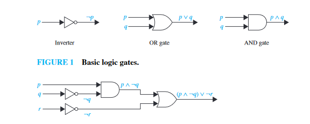

#### todo  finish this

| p   | q   | s1  | s2  |
| --- | --- | --- | --- |
| 0   | 0   | 0   | 0   |
| 0   | 1   | 0   | 1   |
| 1   | 0   | 0   | 1   |
| 1   | 1   | 1   | 1   |

### Sensor network

Requirement: Assuming there is a 3-sensor network. If 2 or more of the sensors are true, then we must send TRUE to the control station.

Design a logic circuit that meets these requirements.

(¬p ^ q ^ r) v (p ^ ¬q ^ r) v (p ^ q ^ ¬r) v (p ^ q ^ r)

----

---


	There are many ways of saying p => q:
	- If p, then q
	- p implies q
	- p is sufficient for q
	- q is necessary for p
	- q whenever p
	- q if p
	- q when p
	- p only if q
	- q is a sufficient condition for p
	- p is a necessary condition for q
	- q unless ¬p

----
----

#### Convert the following statements to logical propositions.

- Roads will be wet, if it rains.

	q => p

- students will pass the exam if he studies tonight.

	q => p

- you can only pass the exam if you study tonight. (**hard**)

	p => q

- It is below freezing and snowing.

	p ^ q

- It is either below freezing or snowing, but not both.

	p ⊕(exclusive or) q

- I will go to class if I feel like it.

	p => q

----
----

### De Morgan's Laws

- ¬(p ^ q) = ¬p v ¬q
- ¬(p v  q) = ¬p ^ ¬q


### Quiz 1

Covers 3 things: Propositions, Propositional equivalences

### Propositional Equivalences

---
Definitions:

Tautology: A compound proposition that is always true, regardless of the truth values of the propositional variables it contains.

Contradiction: A compound proposition that is always false.

Contingency: A compound proposition that is neither a tautology nor a contradiction.

---

Precedence Rules of Logical Operators:

- **Operator precedence** is an ordering of logical operators designed to allow dropping of the parenthesis in logical expressions.
	1. ¬
	2. ^
	3. v
	4. =>, <=>
	5. ( )

- **Unparenthesized statements** associate the expression with the one with higher precedence.
  - For example, p ^ q v r is equivalent to (p ^ q) v r.
  - p v q ^ r is equivalent to p v (q ^ r).
- All operators are **right associative**. Which means you start putting the parenthesis around the ones furthest to the right.

---

Workshop:

Identify each of the following as tautology, contradiction or contingency.

1. p ^ q ^ ¬p

	Contradiction

2. (p ^ q) v ¬p

	Contingency

3. p => ¬p

	Contingency

| p   | p => ¬p |
| --- | ------- |
| T   | F       |
| F   | T       |

### Logical Equivalence (≡)
- Two compond propositions p and q are logically equivalent if p <=> q is a tautology.

Examples: 

#### p => and ¬p v q are logically equivalent.

| p   | q   | p => q | ¬p v q |
| --- | --- | ------ | ------ |
| T   | T   | T      | T      |
| T   | F   | F      | F      |
| F   | T   | T      | T      |
| F   | F   | T      | T      |

	Notice that these two have the same table.

	This means one can be substituted for the other one.

#### Find a logically equivalent implication to p v ¬q

	How to look at it...

	p => ¬q
	¬(¬p) => ¬q
	and then it becomes
	¬p => ¬q

	Which is the same as:

	q => p

#### Show that p v ¬p => q and q are logically equivalent

Talking way:

	p v ¬p => q
	p v ¬p is a Tautology
	True implies q is always q.

The Proof Way:

	p v ¬p => q ≡ q
	r ≡ p v ¬p
	r => q
	(Math Stuff)
	¬r v q

	Now Take r
	¬r ≡ ¬(p v ¬q)

	(De Morgan's Law)
	≡ ¬p ^ ¬(¬p)
	≡ ¬p ^ p which is F

	Go back to ¬r v q
	Replace ¬r with F.

	F v q which is just q.

## Important MEMORIZE
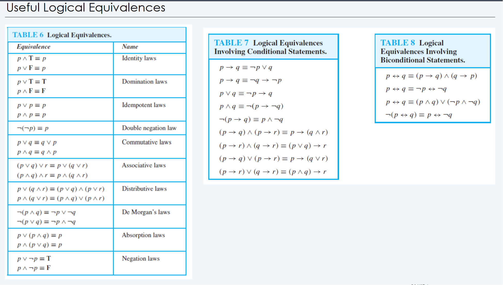

Find the negations of the following statements using DeMorgan's Law and/or logical equivalences.

- If it rains roads will be wet.

		p => q
		¬(p => q) ≡ ¬(¬p v q)
		≡ ¬(¬p) ^ ¬q
		≡ p ^ ¬q
		≡ q => p

- You can take CS 205 only if you are a junior

		p => q
		¬(p => q) ≡ ¬(¬p v q)
		≡ ¬(¬p) ^ ¬q
		≡ p ^ ¬q
		≡ q => p

### Proving Propositional Equivalences using Rules

- A method of proof where result is obtained by applying known equivalences.

Show ¬(p => q) and p ^ ¬q are logically equivalent.

	¬(p => q) ≡ ¬(¬p v q)
	≡ ¬(¬p) ^ ¬q
	≡ p ^ ¬q

### Fermats Last Theorem

- While a^2 + b^2 = c^2 can give you infinitely many combinations of a, b, c, you can not find any integers a, b, c such that a^n + b^n = c^n for any n > 5.

----

## Predicates

### What are Predicates and why do we Need them?

---

**When do propositions fail?**

If I say:
- All candy made with chocolates is delicious.
- M&Ms are made with chocolate.

Does it follow that M&M's are delicious?

We are unable to model this relationship with propositions, hence the need for predicates.

---

- A **predicate** is a proposition that depends on some state of its propositional variables.

- Statements involving variables, such as ` x < 2` and `x + y = z` are often found in mathematical assertions, in computer programs and in system specifications. The statements are neither true nor false when the values of the variables aren't specified.

- The statement "x is less than 2" has two parts. First, the variable x is the subject of the statement. The second part, the predicate "is less than 2" refers to the property that the subject of our statement can have. The predicate "is less than 2" can be denoted by P(x), where **P** denotes the predicate and x the variable.

- As you can tell, `P(x)` looks like a function.

#### Propositional Functions
- Propositional functions become propositions (and have truth values) when their variables are each replaced by a value form the domain (or bound by a quantifier).
- The statement `P(x)` is said to be the value of the propositional function *P* at *x*.

**Example**:

Let P(x) denote `x > 0` and the domain (usually denoted with `U`) be integers. Then:

- P(-3) is *false*
- P(0) is *false*
- P(3) is *true*

----

Predicate logic includes:
- Variables : x, y, z, these are the subjects of the statement.
- Predicate : A property that the variables can have. (x is greater than 3)
- Quantifiers : 

Example: Every computer connected to the university network is functioning properly

*is expressed as*

if n is a computer AND n is connected to university network, then n is functioning properly.

P(n) ^ Q(n) => R(n)

	Notation:
	- P(x) is a predicate that involves the propositional variable x.
	- P(x,y) is a predicate that involves the propositional variables x and y.
	- In general, P(x1, x2, ...., xn) is a predicate that involves the propositional variables x1, x2, ...., xn.

---

#### Workshops for Predicates

1. Let P(x) : x >= 3. What are the values of P(4), P(-1), P(10).

	P(4) = T
	P(-1) = F
	P(10) = T

2. Let P(x, y) : "x is a city in state y". Give two examples where P(x,y) is true and false.

	True: P(Chicago, Illinois), P(New York, New York)
	False: P(Chicago, New York), P(New York, Illinois)
	
3. Let `x + y = z` be denoted by *R(x, y, z)* and *U* (for all three variables) be the integers. Find these truth values.

	P(2, -1, 5) is *false*
	P(3, 4, 7) is *true*
	P(x, 3, z) is **not a proposition** because it does not have a singular true or false value.

---

### Compound Expressions
- Connectives from propositional logic carry over to predicate logic.
- So, `P(x)` denotes "x > 0," find these truth values.

	P(3) v P(-1) --> T v F --> T
	P(3) ^ P(-1_ --> T ^ F --> F
	
- Expressions with variables are not propositions and therefore do not have truth values. Ex: `P(3) ^ P(y)`


There are **preconditions** and **post-conditions**.

- Preconditions are the conditions that must be met before the predicate is evaluated.
- Postconditions are the conditions that are evaluated after the predicate is evaluated.

---

Useful domains for predicates:

`N`: The set of natural numbers {0, 1, 2, 3, ...}

`Z`: The set of integers {..., -2, -1, 0, 1, 2, ...}

`Q`: The set of rational numbers {m/n where m and n are integers}

`R`: The set of real numbers

----

Workshop:


	Precondition: Assert(x=a, y=b)
	x=x+y
	y=y-x
	x=x-y
	Postcondition: Assert(x=?, y=?)
	x = 2a+b
	y = -a
	
| x    | y   |
| ---- | --- |
| a+b  | b   |
| a+b  | -a  |
| 2a+b | -a  |

Let the precondition for the code by (x>=0) && y>=0. WHat is a post conditions for the following code?

```Java

int f(int x, int y) {
	int r = 1;
	while(y>1) {
		if(y%2==1) {
			r = x *r;
		} 
		x = x*x;
		y = y/2;
}	
	return r*x;
}

```

| x   | y   | r   |
| --- | --- | --- |
| 2   | 3   | 1   |
| 4   | 1   | 2   |

return 8

## Quantifiers

**Quantifiers** express the truth of a proposition over a domain.

There are two types of quantifiers:
- **Universal Quantifier (∀)**: Expresses the truth of a predicate over an entire domain.

  - A predicate P(x) is true for all x in X.
- **Existential Quantifier (∃)**: Expresses the truth of a predicate for at least one instance.
  - There exists some x, such that P(x) is true. ∃xP(x)
  
| Universal Quantifier                                                   | Existential Quantifier                                                     |
| ---------------------------------------------------------------------- | -------------------------------------------------------------------------- |
| ∀                                                                      | ∃                                                                          |
| "for all"                                                              | "for some"                                                                 |
| When **TRUE**: When P(x) is true for every `x` in the domain.          | When **TRUE**: There is an `x` (any `x`) in the domain where P(x) is true. |
| When **FALSE**: When there is a `x` in the domain where P(x) is false. | When **FALSE**: When P(x) is false for every `x` in the domain.            |
| ∀xP(x) ≡ P(x1) ^ P(x2) ^ ... ^ P(xn) | ∃xP(x) ≡ P(x1) v P(x2) v ... v P(xn) |

---	

### The Uniqueness Quantifier (∃!)
- This quantifier says that there is uniquely **1** value in the domain for which P(x) is true.

---

### DeMorgan's Law for Quantifiers

#### ¬∃xP(x) ≡ ∀x¬P(x)
- True when P(x) is *FALSE* for every `x`.
- *FALSE* when there is an `x` for which P(x) is *TRUE*.

#### ¬∀xP(x) ≡ ∃x¬P(x)
- *TRUE* when there is an `x` for which P(x) is *FALSE*.
- *FALSE* when P(x) is *TRUE* for every `x`.

---

Workshop

	Someone knows more than two other people.

	Use the negation.

	P(x, y) = "x does not know y"


Consider the following predicates:

	P(x) : x is a baby
	Q(x) : x is logical
	R(x) : x can manage a lion
	S(x) : x is despised

Assume that the domain consists of all people. Express each of the following using quantifiers and logical connectives.

1. All babies are illogical

	P(x) => ~Q(x)

2. Nobody is despised who can manage a lion

	~S(x) => R(x)
	
### Nested Quantifiers

#### Every real number has an additive inverse...

∀x∃y : (x + y = 0)

*Is this true?*

	Doamin: All real #s. *Reasoning + Proof*
	(You can not prove this for EVERY real number cus they are not exhaustive.)

	Instead...
	x = {0, 1, 2} - This means you are saying for all `x` in your set that x + y =0.

#### Example:

Let `P(x, y)` denote "xy = yx". Assume the domain is the real numbers.

Is `∀x∀y P(x, y)` true?

	What does this statement actually mean?
	- For all real numbers x, all real numbers y, when multiplied by x, would be equal to y * x. (xy = yx)

	This is TRUE, cus commutative property of multiplication. (Not formal proof)

Is `∀y∀x P(x, y)` true?

	What does this statement mean?
	- For all real numbers y, all real numbers x, when multiplied by y, would be equal to x * y. (yx = xy)

#### Example 2:

Let `Q(x, y)` denote `"x + y = 5"`. Assume that the domain is all real numbers.

1. Is `∀x∃y Q(x, y)` true?

		What is this saying?
		- For all real numbers (x), there exists some y such that x + y = 5.

		This is TRUE.

2. Is `∃y∀x Q(x, y)` true?

		What is this saying?
		- This is slightly different. This is saying that there exists some value (y) such that for ALL real numbers (x) x + y = 5.

		This is FALSE.

#### Translating Nested Quantifiers

Translate "The sum of two positive integers is always positive" into a logical expression.

	Let P(x, y) be x + y > 0 in ∈ ℤ⁺.
	∀x∀y P(x, y)

### Rules of Inference


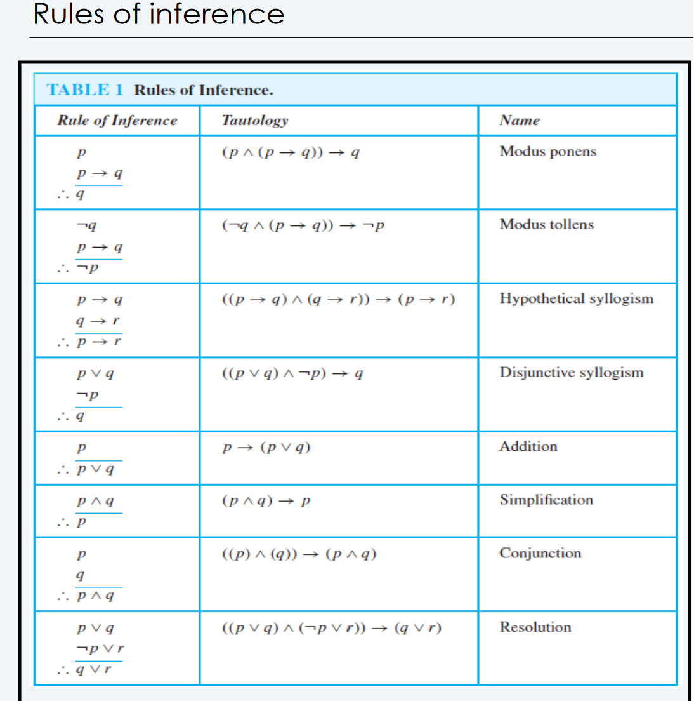

---

**Arguments**: a sequence of propositions (p₁, p₂, ...)

	(p₁ ^ p₂ ^ ... ^ pₙ) → q ----> Where q is the conclusions.

**Valid Argument**: The premises imply the conclusion.

**Modus Ponens** :

	Given p → q, if p is true, then q is true.

	As a Tautology: ((p → q) ^ p) → q

**Modus Tollens** :

	Given p → q, if ¬q, then ¬p.

	As a Tautology: ((p → q) ^ ¬q) → ¬p


**Hypothetical Syllogism** :

	Given p → q and q → r, p → r.

	((p → q) ^ (q → r)) → (p → r)

**Disjunctive Syllogism** :

	Given p v q, if ¬p, then q.

	((p v q) ^ ¬p) → q

**Addition**:

	Given p, then p v q is true. (Makes sense cus p is always true.)

**Simplification** :

	Given p ^ q, then q (or p) both work.

**Conjunction** :

	Given that p is true and q is true, then p ^ q is also true.

**Resolution** :

	Given ¬p v r and p v q, then q v r.


## Introduction to Proofs

### What are proofs?
- A mathematical proof of a proposition is a chain of logical deductions leading to the proposition from a base set of axioms.

#### Lemmas
- Lemmas are a simple statement that can be shown to be true in just a few steps (like helper functions). Lemma’s are used to simplify the steps in the proof.

Simple Lemma. If n2 is even, then n is even.

#### Theorem
- Theorems are a major statement that can be shown to be true. Lemmas may be used in proving the theorem.

#### Corollary
- Corollary is a result that can be established directly from a theorem that has been proved.

---

**Types of Proofs**

- Proof by evidence
- Proof by picture
- Geometric proof
- Proof by experiment
- Direct Proofs
- Proof by contraposition
- Proof by contradiction
- Inductive Proofs

---

### Direct Proofs

- In a direct proof, we assume the premise (P) is true and use logic and the rules of inference to show that the conclusion (Q) follows.

---

Necessary Definitions for Direct Proofs

**Definition 1:** 

- The integer n is even if there exists an integer k such that n = 2k, and n is odd if there exists an integer k such that n = 2k + 1. (Note that every integer is either even or odd, and no integer is both even and odd.) Two integers have the same parity when both are even or both are odd; they have opposite parity when one is even and the other is odd.

---

#### Example of Direct Proof:
- Give a direct proof of the theorem, If n is an odd integer, then n² is odd.

		We assume n is odd.
		Then, by definition, n = 2k + 1 for ∃k ∈ ℤ.
		So, to show that n² is odd, we just have to square both sides. (n² = (2k + 1)²)
		That becomes n² = 4k² + 4k + 1
		Then, you make make that into n² = 2(2k² + 2k) + 1
		And because 2k² + 2k is still just k (k is any number in ℤ)...
		2(2k² + 2k) + 1 ≡ 2k + 1, which is the def. of being odd.
		n² is odd.

### Proof By contraposition

(Reminder) : p → q ≡ ¬q → ¬p
- In a proof by contraposition, of (p → q), we assume the negation of the conclusion (¬q) to be true. Then, following logic and rules of inference, we show that the negation of the premise (¬p) follows.

#### Example of Proof by Contraposition:
- Let y ≠ 0. If x/y is irrational, then either x is irrational or y is irrational.

		1. Take the opposite of the conclusion (¬q)
		2. ¬q is x is rational and y is rational.
		3. Now prove ¬p
		4. if you have ∃ p₁, p₂, q₁, q₂ ∈ ℤ such that q₁, q₂ ≠ 0
		5. x = p₁/q₁ and y = p₂/q₂
		6. Then, x/y = p₁q₂/p₂q₁ and since p₂q₁ ≠ 0, x/y is rational.

### Proof By Contradiction

- In a proof by contradiction, you instead assume the opposite of the premise. (¬p). By showing a contradiction when trying to prove ¬p, you have proven p.

## Sets
- A *set* is an unordered collection of objects, called *elements* or *members* of the set. A set is said to *contain* it's elements.
- You can imagine it as a bag, and the elements in it as the things in the bag.
- The order of the set and repetition does not matter. SO..
  - {1, 3, 5, 7} = {7, 5, 3, 1} = {1, 1, 3, 5, 7, 7, 7, 7, 7, 7, 7, 7}

Examples:

	A = Students in the class
	B = {1, 3, 5, 7}
	ℤ = Set of all integers

---
We write a ∈ A to show that a is an element of the set A.

The notation a ∌ A denotes that a is not an element of A.

---

### Set as Mathematical Numbers
- Much of discrete math is devoted to the study of discrete structures, used to represent discrete objects.
- Many important discrete structures are built using **sets**, which are a collection of objects.
- Among the discrete structures built from sets are combinations, unordered collections of objects used extensively in counting;
- **Relations** are sets of ordered pairs that represent relationships between objects; graphs, sets of
vertices and edges that connect vertices;
- Finite state machines, used to model computing machines are represented by a set of states.

---

#### Subset of Set
- A is a subset of B, which means that A is contained in B, if every element (x) of A is also an element of B.
- A ⊆ B means that A is a subset of B.
- A ⊈ B means that A is not a subset of B.

#### Empty Set
- The empty set is the set that contains no elements. It is denoted by Φ or {}.
- `{Φ}` is the set of an empty set. It's like having a box inside a box.
  - *Technically*, the outside box is not empty because it has the box inside, just like how the outside set is not empty because it has the empty set inside.
- When asked how many elements are in the empty set, it's asking how many elements are in the box. The answer is 1.

So then...

	Is Φ ⊂ {1, 2, 3}?
	(What does it mean to be a subset?)
	Since there *are* no elements in Φ, it is a subset of {1, 2, 3}, because there are no x in Φ that you can check.

	This is VACUOUSLY TRUE. (Nothing to check)

#### Set Equality
- Two sets are said to be equal if they have the same elements. That is, ∀a ∈ A, a ∈ B and vice cersa.

#### Ordered Pairs
- An ordered pair is a pair of objects in a specific order.
- For example:
  - `(1, 2)` is an ordered pair.
  - `(2, 1)` is a different ordered pair.
  - `(a, b) = (c, d)` if and only if `a = c` and `b = d`.
    - The a and b could come from different sets for example `(3, Apple)`.
  
### Cartesian product of Two Sets (Cross product)
- Cartesian product of two sets A × B is the set of all pairs in the form (a, b) where a is an element of A and b is an element of B.
- Defining some relation between A and B.
- The coordinate plane is an example of a cartesian product of two sets. (x, y) which is an ordered pair of a particular cross product.

Example:

	Given 3 sets, P(rofessors) = {p1, p2}, S(tudents)={s1, s2, s3} and C(ourses) = {c1, c2, c3}
	Find P x S and S x C

	P x S :
	P x S = { {p1, s1}, {p1, s2}, {p1, s3}, {p2, s1}, {p2, s2}, {p2, s3} }

	S x C:
	S x C = { {s1, c1}, ..., {s3, c3} }

Example 2:

	{a, b} X {1, 2} =
	{ {a, 1}, {a, 2}, {b, 1}, {b, 2} }

#### Relations
- A relation R from a set A to a set B is a subset of the cartesian product A x B.
  - ie: (a, b) are relations where (a, b) ∈ A x B.
  - It is some collection that is in the cartesian product but does not have to be the entirety.

#### Set Builder Notation vs Set Roster Notation
- Set roster notation is a way to describe a set by listing the elements of the set. `{0, 2, 4, ...}` -> The ... means that the set goes on forever.
- Set builder notation is a way to describe a set by listing the properties that its members must satisfy.
- For example, the set of all even integers can be described as `{x | x = 2k for some k ∈ ℤ}`.

#### Set Operations
- Unions (⋃) : Is basically a massive "or" sign. It's the set of all elements that are in either set.
- Intersection (⋂) : Is basically a massive "and" sign. It's the set of all elements that are in both sets.


### The Size and Cardinality of a Set

**For any set**:
- The set can be finite (n number of elements)
- Countably infinite (it can be ennumerated) : ℕ, ℕ⁺, ℤ, ℚ
- Uncountably infinite (it can not be ennumerated) : ℝ, ℝ⁺, ℝ-ℚ (set of Irrational numbers)

If we had a function:

	f:S → ℕ⁺
	Then, S is countably infinite.
	S is a bijection because it is a one-to-one and onto correspondence.

Proving a set is countable:

Set of all even numbers are countable:

	S = {n | n = 2k for some k ∈ ℕ}
	Then you need to prove that there is a surjection and a injection.

	Prove surjection:
	f(n) → n/2
	Prove injection:
	f(n) = f(m) → n/2 = m/2 → n = m
	Then, f is a bijection.

If A and B are countable sets, then A ∪ B is also countable:

	Proof by cases:

	Case 1: A, B are finite, A = {a₁,...,aₙ}, B = {b₁, ... , bₙ}
	Then, A ∪ B = {a₁, ... , aₙ, b₁, ... , bₙ}
	Then, A ∪ B is finite.

	Case 2: A is countable, B is finite, A = {a₁, ...}, B = {b₁, ... , bₙ}
	Then, A ∪ B = {b₁, ... , bₙ, a₁, ...}
					1 2 3... n, n+1, ...
	Then, A ∪ B is countable.

	Case 3: A, B are countable, A = {a₁, ...}, B = {b₁, ...}
	Then, A ∪ B = {a₁, ... , b₁, ...}
					1 3 5 ...2 4 6 ...	
	Then, A ∪ B is countable.

- Let *S* be a set. If there are exactly *n* distinct elements in *S* where *n* is a nonnegative integer, we say that *S* is a *finite set* and that *n* is the *cardinality* of S. The cardinality is denoted by `|S|`.

#### Power Set of a Set
- Given a set *S* the *power set* of *S* is the set of all subsets of the set *S*. The power set of *S* is denoted by `P(S)`.

**Power sets** are of size 2ⁿ where n is the size of the set.

	Example:
	If the set A = {1}
	Then the P(A) = {Φ, 1}
	Then P(P(A)) = {Φ, {1}, {Φ} {{1}}}

### Proofs Involving Sets
- For all proofs, start with assumption, the definition, and then go into manipulating the definitions.
- In order to prove the set `A = B`:
  - You must prove ∀x ∈ A ↔ x ∈ B.

Example: Suppose that

	A = {n ∈ ℤ | n = 4p, p ∈ ℤ}
	B = {n ∈ ℤ | n = 2q, q ∈ ℤ}

	Prove A ⊆ B.

	Let x ∈ A
	Then, x = 4p for p ∈ ℤ
	Then x = 2(2p) for 2p ∈ ℤ
	Then x = 2q for q = 2p ∈ ℤ
	Then x ∈ B
	A ⊆ B

Prove (A ∩ B)̄ ⊆ Ā ∪ B̄

	x ∈ A ∩ B → x ∈ U - (A ∩ B)
	→ x ∉ A or x ∉ B
	→ x ∈ Ā or x ∈ B̄
	→ x ∈ Ā ∪ B̄

Question: Show that (A ∩ B) ∪ A = A

So, you need to prove x ∈ (A ∩ B) ∪ A.

	(A ∩ B) ∪ A → (A ∩ B) or x ∈ A
	→ (x ∈ A and x ∈ B) or x ∈ A.
	→ (p and q) or p = P
	P is the statement x ∈ A.

## Functions

The formal definition of a function:
- Let X and Y be non-empty sets. A function **F** from X to Y is an assignment of **exactly one** element of Y to each element of X.
- A function can also be defined as the subset of A X B.
- We write `f(x) = y` if y is the unique element of Y assigned by the function f to element x of X. We write f : X → Y to indicate a function from X to Y.

#### Properties of Functions
- For every element x ∈ A, there is an element y ∈ B such that (a, b) ∈ F.
  - Or that (x,y) is inside your function.
- If (x, y) ∈ F and (x, z) ∈ F, then y = z.
  - This is because a function can only have one output for each input.
- 

## Sequences and Reoccurances

### Sequences
- A sequence is a function from a subset of integers (usually ℕ or ℕ⁺) to a set S. We use the notation aₙ to denote the image of n. We can aₙ the nth term of the sequence.

#### Example of a Sequence

The sequence: bₖ = (-1)ᵏ(3k)

	This would give you: {3, -6, 9, -12, ...}

- The sequence of even integers is a function from ℕ⁺ to ℤ. The nth term of the sequence is 2n.
  - Represented as aₙ = 2n
- aₙ = (-1)ⁿ → is called a oscillating sequence.
  - {1, -1, 1, -1, ...}

### Sequences are Just Functions
- If a sequence can basically just be described as some sort of formula, then you can think of the *n* or *k* terms as the domain of the function, and the *aₙ* or *bₖ* as the codomain of the function.
- This means, it obeys the vertical line test.
---
> So, a sequence is a function where you take things from the positive integers, and going to some unspecified codomain.
---

#### Geometric Sequence
- A geometric sequence is a sequence of the form aₙ = arⁿ⁻¹ where a and r are real numbers.
  - a is the first term of the sequence.
  - r is the common ratio of the sequence.
  - aₙ is the nth term of the sequence.

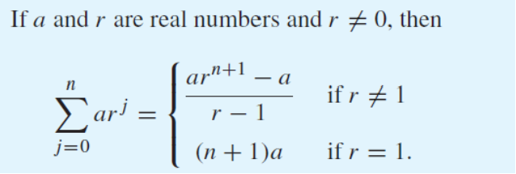

Applying Geometric sequences:
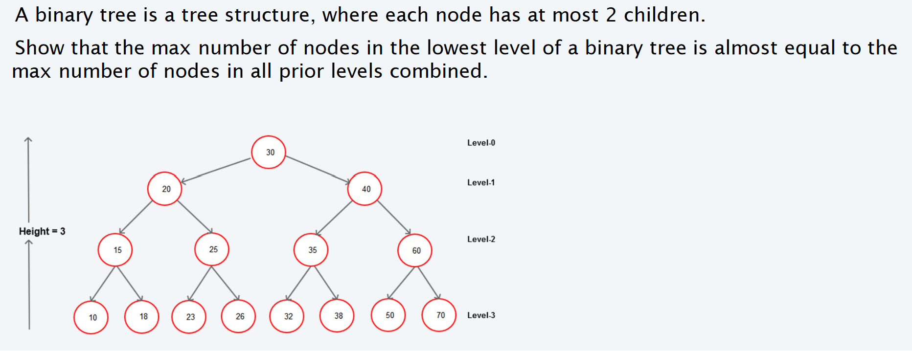

### Reoccurance Relations
- A reoccurance relation for the sequence {aₙ} is an equation that expresses aₙ in terms of one or more of the previous terms of the sequence, namely a₀, a₁, ..., aₙ₋₁ for all integers n with n ≥ n₀, where n₀ is a nonnegative integer.
- A sequence is called a solution of a reoccurance relation if its terms satisfy the reoccurance relation.
- A reoccurance relation is a recursively defined sequence.

**xₙ₊₁ = 0.5(xₙ + a/xₙ)** is a reoccurance relation.

## Sum and Product of Sequences

As it was said previously, a sequence is just some a₁, a₂, a₃, ... aₙ.

Then, if we wanted to add up these numbers, we would have to do something like:

- a₁ + a₂ + a₃ + ... + aₙ, which could go on for infinity.
- However, what if we only wanted to add up the first 10 numbers?
  - a₁ + a₂ + a₃ + ... + a₁₀
- Now what if we wanted to add the first 1 million terms?

**The issue with writing the sequence out is that it is not very efficient.**

### Summation Notation

> Involves going from an aₘ term to an aₙ term.\
> Looks like: aₘ + aₘ₊₁ + ... + aₙ

To make it shorthand:

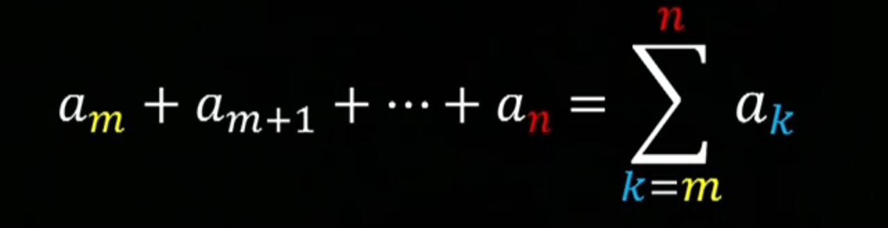
- Notice that the m is the lower bound (*starting point*) and the n is the upper bound (*finishing point*).
- The `k` is the index of summation.
- You are taking the ***Sum*** of the `aₖ`'s. 

### Product Notation
- Same exact concept as summation notation, but instead of adding, you are multiplying.
- Looks like: aₘ * aₘ₊₁ * ... * aₙ

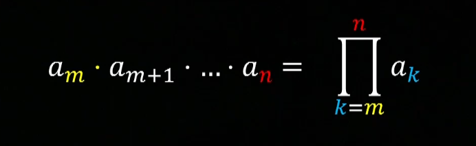

### Factorial Notation
- Factorial notation is a special case of product notation.
- n! = n(n-1)(n-2)...(3)(2)(1)

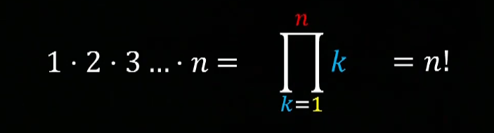 

### Recursive Sequences
- These are sequences that are defined by a previous term in the sequence.
- These recursive formulas are not unique. They can be defined in many different ways but return the exact same sequence.

For example:

	aₖ = aₖ₋₁ + 3, k > 1

	can also be written as:
	aₖ₋₃ = aₖ₋₃₋₁ + 3, k - 3 > 1


#### Finding a Explicit Formula from Recursive Sequence

Example:

	aₖ = aₖ₋₁ + 3, k > 1 and a₁ = 1
	
	Then, you can write out the sequence:
	a₁ = 1
	a₂ = 1 + 3 = 4
	a₃ = 1 + 3 + 3
	a₄ = 1 + 3 + 3 + 3

	So then, aₖ can be written as:
	aₖ = 3(k-1) + 1 >> This is the explicit formula from the recursive.


#### Proof by Induction

Show that n²-1 is divisible by 8 for all positive odd integers n:

	Step 1) Show that it is true for n = 1
	1² - 1 = 0 which is divisible by 8.

	Step 2) Assume it is true for n = k for some odd integer k ∈ ℕ⁺.
	k²-1 is divisible by 8.
	Then, k²-1 = 8m for some m ∈ ℕ.

	Step 3) Find the next occurance, which would be k+2

	(k+2)²-1 = k²+4k+4-1 = (k²-1)+4k+4 = 8m+4k+4 = 4(2m+k+1)
		 k is odd, but k+1 is even.
	Then, (k+2)²-1 is divisible by 8.

Example:

	Prove that 3 is a factor of n³ + 2n whenever n is a positive integer.

	Step 1) Find some base cases
	1³ + 2(1) = 3 which is divisible by 3.
	(2)³ + 2(2) = 12 which is divisible by 3.
	(3)³ + 2(3) = 33 which is divisible by 3.
	Step 2) Proceed with your proof by induction

	Base cases: P(1), P(2), P(3) are all true
	Assume P(k) is true, then k³+2k = 3l

	Then consider P(k+1) = (k+1)³+2(k+1) = k³+3k²+3k+1+2k+2
	(Next, you want to group it in a way that you can use the assumption)
	= (k³+2k)+3k²+3k+3
	(From the previous assumption, you can replace k³+2k with 3l, then call 3k²+3k+3 as 3l₀, with l₀ = k²+k+1)
	= 3l+3l₀ = 3(l+l₀)
	Then, P(k+1) is true.

	Then, by the principle of mathematical induction, P(n) is true for all n ∈ ℕ⁺.

Example 2:

	Prove that 2ⁿ > n² for all n > 4.

	1) Base cases:
		2⁵ > 5², n = 5 is true
		2⁶ > 6², n = 6 is true
		2⁷ > 7², n = 7 is true
	2) Assumption:
		P(n) is true for n > 4 such that P(n) = 2ⁿ > n²
		Then, P(n+1) = 2ⁿ⁺¹ > (n+1)² for n > 4.
	3) Proof:
      	 P(n+1) = 2ⁿ * 2 > n² + 2n + 1
		Next, you can assume that if 2ⁿ > n², then 2(2ⁿ) > 2(n²)
		Then, 2(2ⁿ) > 2(n²) > n² + 2n + 1
		Then, 2n² > n² + 2n + 1
		2n² - n² - 2n - 1 > 0
		n² - 2n - 1 > 0
		(n² - 2n + 1) - 2 > 0
		(n-1)² > 2
		n > √2 + 1
		Then, P(n) is true for all n > 4.
	
### Strong Inductions

#### Ordinary/weak induction
- Rule 1: P(0) (or any other base case)
- Rule 2: P(n) → P(n+1)

#### Strong induction
- Rule 1: P(0) (or any other base case)
- Rule 2: P(1),P(2), P(3),....P(n) → P(n+1)

## Language and Grammar

### Motivations

- What is a computer?
	- A digital device that can compute some general purpose program.
- What can be computed?
- How can we compute it?
- How much memory/time it takes?
- These are fundamental questions that every computer scientist must be able to answer.

#### Programmable?
- Can we write a program to recognize all binary strings that end in `0`?
	- Yes, this is probably very easy to do.
- Can we write a program to see if a given binary file is indeed a Java program?
	- Yes, but a bit harder to do.
- Can we write a program to check if another program gets into a infinite loop?
	- No, that is not possible.

### Turing Machine

> The Turing Machine is a mathematical abstraction of how we can compute things.

It is simple, so we can prove things about what is computable.

### Languages
- All Languages contain syntax, or form of the sentence.
- They all contain semantics or meanings.

Languages are divided into two different types: **natural** and **formal**.
- Formal language is specified by a well-defined set of rules of syntax.

#### Production Rules of Languages
- How can we determine whether a combination of words is a *valid* sentence of a formal language?
- How can we generate the valid sentences of a formal language?

---
#### Vocabulary

A *vocabulary* (or *alphabet*) `V` is a finite, nonempty set of elements called *symbols*. A *word* (or *sentence*) over `V` is a string of finite lengths of elements of `V`. The *empty string* or *null string*, denoted by $\lambda$ is the string containing no symbols. The set of all words over `V` is denoted by `V*`. A *language over V* is a subset of V*.

#### Phase-Structure Grammar

A *phase-structure grammar* `G=(V, T, S, P)` consists of a vocabulary `V`, a subset `T` of `V`, consisting of terminal symbols, a start symbol `S` from `V`, and a finite set of productions, `P`. The set `V-T` is denoted by `N`. Elements of `N` are called *nonterminal symbols*. Every production in `P` must contain at least one nonterminal symbol.

---

#### A Language

Let `G = (V, T, S, P)` be a phrase-structure grammar. The *language generated by G* (or the language of `G`) is denoted by L(G), is the set of all strings of terminals that are derivable from the starting state `S`. In other words, $$ L(G) = \{w \in T* | S \rightarrow w\} $$

Example: Let G be the grammar with vocabulary `V = {S, 0, 1}`, set of terminals `T = {0, 1}`, starting symbols S, and productions P = {S → 11S, S→ 0}. What is L(G) , the language of this grammar?

	L(G) = {0, 110, 11110, 1111110, ...}
	Essentially, this must be thought of as the returns are 1 or 0, as defined by T. And then, the productions is basically applying a recursive function in order to give the language.

---

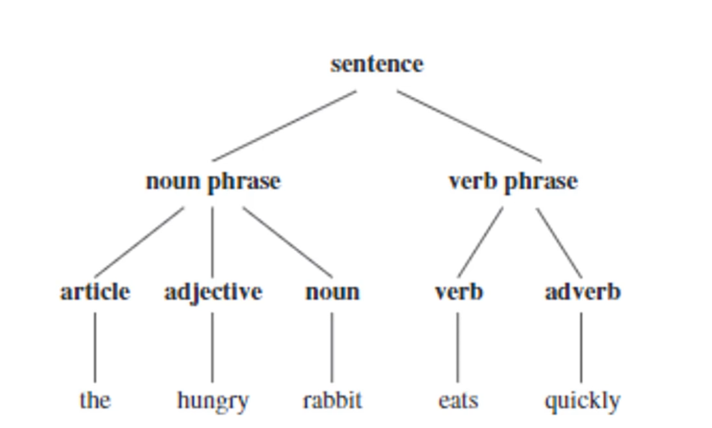

---

#### General Rules of Derivation

- a → b
- a' →* b'
- "→*" is the reflexive transitive closure.

### 4 Types of Grammar
- Type 0 - Unrestricted or Phrase-structure grammar (Turing machines)
	- u → v, u ∈ V* N V*
- Type 1 (Context sensitive grammar)
	- u →, |u| ≤ |v|, length increasing grammar
	- ⍺ N β → ⍺ X β
- Type 2 (Push Down Automata - Context-free grammar)
	- A → ⍺, where A ∈ V*
- Type 3 (FSA)

---

### Grammar and Programming Languages
- Compilers
	- Analysis
		- Lexical analyzer
		- Parser
	- Synthesis

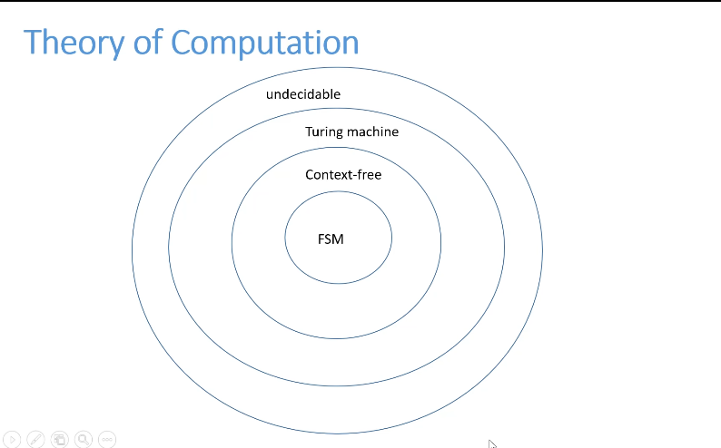
- (FSM- Finite state machines) - are very limited in scope but can still solve many different types of problems.
- Turing Machine - The most widespread, anything that can be computed is a Turing Machine.

---

### Backus-Naur Form (Type 2 Grammar)

(Context Free)

- (*identifier*) ::== <*letter*> | <*identifier*><*letter*> | <*identifier*><*digit*>
- (*letter*) ::== a | b | ... | y | z | (all letters are included)
- <*digit*> ::== 0 | 1 | ... | 9 |

**Workshop**
- What is the Backus-naur form of the grammar for the subset of English described?

The hungry rabbit eats quickly.

	Ans: 
	<sentence> ::== <noun phrase><verb phrase>
	<noun phrase> ::== <article><adjective><noun>
	<verb phrase> ::== <verb><adverb> | <verb>
	<article> ::== the
	<adjective> ::== hungry
	<noun> ::== rabbit
	<verb> ::== eats
	<adverb> ::== quickly

---

### Finite State Machines

---
#### Abbreviations
- FSM = Finite State Machine
- FSA = Finite State Automata
- DFA = Deterministic Finite Automata
- NFA = Non-deterministic Finite Automata

---

#### Vending Machine Simulation
- A vending machine is a great example of a FSA.
- For the input of the vending machine, it can accept `25¢`.
- When it receives `50¢`, it will output a drink.

- We can split this vending machine into 3 states, `S₀`, `S₁`,`S₂`.
	- Start:`S₀` →`S₁`→`S₂`, End
	- At the start, there is 0¢ in the machine. Each change in state is brought on by 25¢.
- You can add more states by increasing the amount it takes to produce a drink.

---

#### Formal Definition

A *finite-state machine* `M = (S, I, O, f, g, s₀)`  consists of a finite set `S` of *states*, a finite *input* *alphabet* `I`, a finite *output function* `g` that assings each state and input pair an output, and an *initial state s₀*.

---

Example:

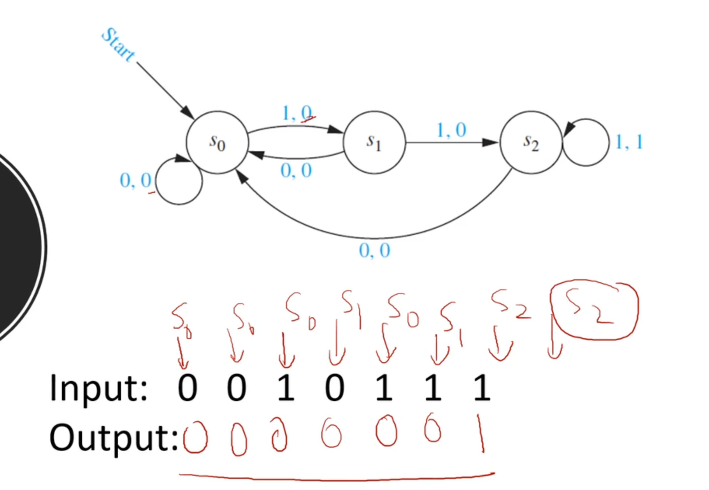

### Turing Machines

[For Indepth Background on Turing Machines](../cog-sci/cog-sci#turing-machine)
- Effective Procedures can be implemented by a Turing Machine

#### Effective Procedure vs Algorithm

**Procedure**:
- A program that executes a set of instructions and this program can halt or not halt.
	- Ex: Given n, is there a perfect number >n?
		- This program can terminate or not terminate.
		- If the answer is NO, the program will not terminate because there are countably infinite numbers greater than n.
		- If the answer is YES, the program WILL terminate.

**Algorithm**:
- A step by step procedure (that is expected to halt) of solving a problem.
	- Ex: Given a number n, is it prime?
		```java
		if(n == 2) return true;
		for(i =3; i < n; i+= 2)
			if(n%i == 0) return false;
		return true;
	 ```


#### Designing Turing Machines

	Assume the input alphabet is {0, 1}. The tape alphabet is {0, 1, X, Y, A}. Given a tape of 0's and 1's, design a Turing Machine that replaces each 0 with X and each 1 with Y.

	The first step to doing this is to draw out this question as a FSM (Finite State Machine)
	Then, in TM state transitions:

	1. f(q0, 0) = (q0, X, R)
		If you are in q0 and you receive a 0, stay in the q0 state, output an X and move the tape to the right.
	2. f(q0, 1) = (q0, Y, R)
		Same thing as 1. except with 1 instead of 0.
	3. f(q0, A) = (halt, A, _)
		If you reach A, you move to the halting state, write an A, and stop.

### NFA - Non-Deterministic Finite Automata

- Machines that can recognize a language or string with a finite number of states is called a DFA (Deterministic Finite automata)
- However, machines that can transition into multiple states from a given state is called  a Nondeterministic Finite automata.
	- These NFAs are widely used in Regular Expressions.

#### Duality Between RE's and DFA's

**Regular Expression** - A concise way to describe a set of strings.

**DFA** - Machines to recognize a string in a given set.

#### Kleene's Theorem
- For any DFA, there exists a RE that describes the same set of strings.
- For any RE, there exists aa DFA that recognizes the same set of strings.

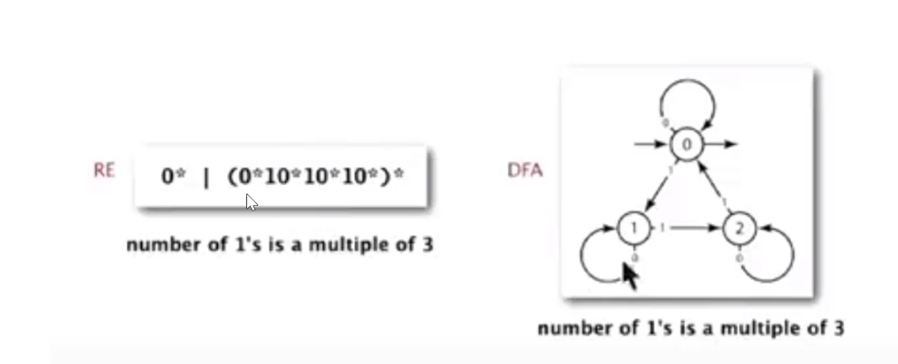

---

A *non-deterministic finite-state automaton* `M = (S, I, f, s₀, F)` consists of a set `S` of states, an input alphabet `I`, a transition `f` that assigns a set of states to each pair of state and input (so that `f : S x I → P(S)`), a starting state s₀, and a subset `F` of `S` consisting of the final states.

- In simpler terms, this means that the NFA is able to map a single input into a state to a set of states.

---

Example: Building NFA (A * B | A)

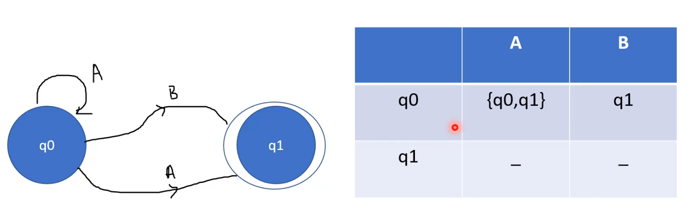

You can change a NFA to a DFA... In this case...

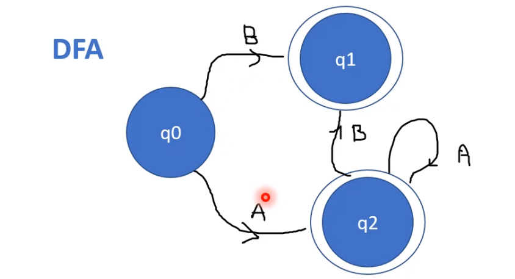

---
#### General Rules for Building NFAs

**Regular-expression-matching NFA**
- RE enclosed in parentheses.
- One state per RE character (start = 0, accept = M)
- Red *ε-transition* (change state, but don't scan text)
- Black match transition (change state and scan to next char)
- Accept if *any* sequence of transitions ends in accept state.

---

## Relations
- Relations are defined on a non-empty set A to no-empty set B such that the relation from A to B is a subset of Cartesian Product of A and B. 

Ex: Let A = {1, 2, 3} and B = {a, b, c}. Then **R** (the relation between A and B) could be...

R = {(1, a), (1, b), (2, b), (2, c), (3, a)}

It is a subset, so it does not have to be **all** the elements of A x B.

#### Matrix Representation of A relation

- We are able to use a "boolean" table (*M*) where the rows are labeled with the elements of the first set (A in our case) and the columns are labeled with the elements of the second set (B). A in position *i, j* of the matrix means that the element *i* ϵ A is related to element *j* ϵ B. In the case of our example...
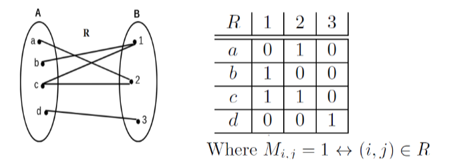
### Binary Relation on a Set
- A binary relation on set A is a subset of **A x A**, or a relation from set A onto itself.

Ex: If A = {1, 2, 3, 4}, then list the ordered pairs in set **R** if R = { a, b) | a divides b}.

R = {1, 1), (1, 2), (1, 3), (1,4), (2, 2), (2, 4), (3, 3), (4, 4)}

This is a *listing* of all elements in the relation.

---

### Properties of Relations

**Reflexive Relations**: A relation *R* on *A* is reflexive ↔ (a, a) ϵ R ∀a ϵ A.
- We can easily determine form the matrix representation of a relation if it is reflexive, since the main diagonal will contain only ones.

**Irreflexive Relations**: A relation *R* on *A* is irreflexive ↔ (a, a) ∉ *R ∀a ∈ A*.
- We can easily determine this from a relation if the main diagonal only contains 0.

**Symmetric Relations**: A relation *R* on *A* is symmetric ↔ (a, b) →  (b, a) ∈ R, ∀a, b ∈ A.
- We can easily determine from the matrix representation of a relation if it is symmetric since the matrix will always be equal to its transpose.... (`Mᵢⱼ = Mⱼᵢ ∀ᵢⱼ`)

**Antisymmetric:** A relation *R* on *A* is antisymmetric ↔ (a, b) ∈ *R* ^ (b, a) ∈ R → a = b.
- Notice that the contrapositive of the definition says that if a ≠ b (i.e. (*a,b*) are not on the main diagonal of the matrix representation of *R*), then (*a, b*) ∉ *R* v (b, a) ∉ *R*.
- Soooo.... we can easily determine from a matrix representation if the relation is antisymmetric when Mᵢⱼ = 1 → Mⱼᵢ = 0.

**Transitive Relations:** A relation *R* on *A* is transitive if (*a, b*) ∈ *R* ^ (*b, c*) ∈ *R* → (*a, c*) ∈ *R*.

### Cardinality of Relations

**Given a set *A*, how many relations on *A* can we have?**
- Since `R ⊆ A x A`, then the total number of possible relations would be the power set of A x A, and since the cardinality of A x A is `|A|²`, we have that...

**Number of relations = `2^(|A|²)`**

---
## Graphs
- A graph(G) consists of set vertices (V) and set of edges (E) that represents a relation on those vertices.
- Two types of graphs, directed and undirected.

### Closures

#### Reflexive Closure
- The *reflexive closure R′* of a relation *R* into a relation *R′* that is reflexive, by including missing pairs in the relation.

**Definition of Reflexive Closure**
- The *reflexive closure R′* of a relation *R* on *A* is a minimal reflexive relation such that *R* ⊆ *R′*
- In other words, *R′* is a relation that:
	- Contains *R*
	- Is reflexive
	- If we remove any pairs from it, it no longer satisfies the previous two conditions.
#### Symmetric Closure
- Given a relation R it is possible to extend R to create a symmetric relation *R′* that contains *R*.

**Definition of Symmetric Closure**
- The *symmetric closure R′* of a relation *R* on *A* is a minimal symmetric relation such that R ⊆ R′.
- In other words, *R′* is a relation that:
	- Contains *R*
	- Is symmetric
	- If we remove any pair from it, it no longer satisfies both 1) and 2).

Example: 

Let `R = {(a, b) | a < b}` be a relation on N.

For it to be symmetric, we have to add the pair (*b, a*) whenever (a, b) ∈ *R*, so we end up with:

*R′ = { (a, b) | a < b v a > b}*

This is the **minimal set** that will result in a symmetrical relation.

### Equivalence Relation

An equivalence relation is a binary relation that satisfies the following three properties:
- **Reflexivity**: For every element *x*, (*x, x*) ∈ R.
- **Symmetry**
- **Transitivity**

Equivalence relations are often used to group together objects that are similar, or "equivalent", in some sense...

### Equivalence Classes

The set of all elements equivalent to an element a of *A* through the equivalence relation *R* is called an equivalence class of a, denoted as [*a*]ᵣ.

### Partitions

A partition of set *S* is a collection of disjoint non-empty subsets that have *S* as their union.
## Boolean Algebra

- Boolean algebra are rules for working with the Boolean numbers{0, 1}.
- The operators on the boolean numbers:
	- Boolean sum (+)
	- Boolean Product (.)
	- Complement (bar ~)

### Boolean Expressions and Functions
- Let `B = {0, 1}. Then, Bⁿ = {(x₁, x₂, x₃, ..., xₙ) | xᵢ ∈ B for 1 ≤ i ≤ n}` is the set of all possible n-tuples of 0s and 1s.

- The variable `x` is called a *boolean variable* if it assumes values only from **B**. That is, if its possible values are 0 and 1. 
	- A function that maps *Bⁿ to B* is called a *Boolean function of degree n*.

---

**Example**: The function `F(x, y) = x` from the set of ordered pairs of Boolean variables to the set {0, 1} is a Boolean function of degree `2`.

---

### Equality of Boolean Functions
- Boolean functions *F* and *G* of *n*-variable (degree *n*) are equal ↔ F(b₁, b₂, ...., bₙ) = G(b₁, b₂, ...., bₙ) whenever (b₁, b₂, ...., bₙ) belong to B.

### Complement of Boolean Function

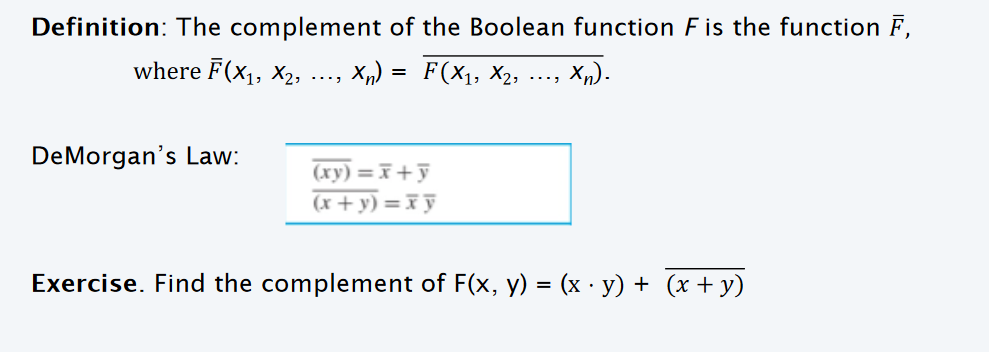

### Boolean Sum and Boolean Product

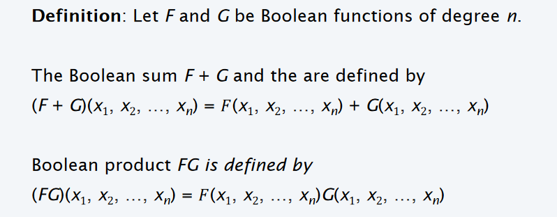

### Duality of Boolean Expressions

The dual of a Boolean expression is obtained by interchanging `+` and `.` and interchanging **0 and 1**.

Duality can be used to derive new theorems and simplify Boolean expressions. For example, De Morgan's Laws are duals of each other, and they allow you to simplify expressions involving **AND** and **OR** operations.

### Function Completeness

**Definition**: Every Boolean function can be represented using the Boolean operators `., +, and ‾`, we say that the set {`., +, ‾`} is *functionally complete.*

---

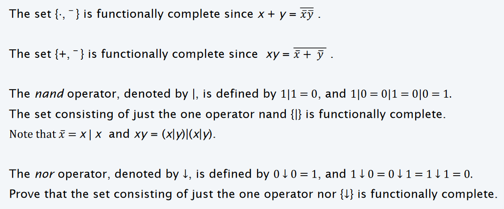

---

### Logic Gates

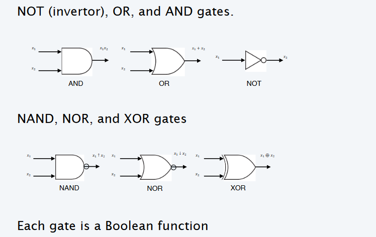

#### Boolean Circuits
- These "circuit gates" act like actual gates, in a sense.
	- There is a trigger that "opens" a gate periodically.
	- The specified operation (AND, OR, NOT,...) then happens

In modern computers, these gates open/close a few trillion times a second, giving us GHz chips.

---

## Orderings

### Partially Ordered Set
- A partially ordered set (poset), is a fundamental concept in mathematics and computer science.
- Let S be a set, and let ≤ be a binary relation on S. The pair (S, ≤) is a partially ordered set (poset) if the relation ≤ satisfies the following properties for all elements a, b, and c in S:
	- **Reflexivity**: For every *a* in *S*, *a ≤ a*.
	- **Antisymmetry**: If *a ≤ b* and *b ≤ a*, then a must equal b.
	- **Transitivity**: If *≤ b* and *b ≤ c*, then *a ≤ c*.

A poset represents a set of elements with a notion of "ordering" or precedence" that need not be total, meaning **not all elements need to be comparable.**

### Totally Ordered Sets

A totally ordered set is a set of elements that can be compared to each other using a binary relation that is reflexive,  antisymmetric, and transitive. The binary relation is typically denoted by ≤, and it is defined as follows: 

- Reflexive: For all elements x in the set, x ≤ x.  
- Antisymmetric: For all elements x and y in the set, if x ≤ y and y ≤ x, then x = y.  
- Transitive: For all elements x, y, and z in the set, if x ≤ y and y ≤ z, then x ≤ z.  

A totally ordered set is a set where every element can be compared to every other element.

A **totally ordered** set is a set
- where every element can be compared to every other element
- The comparison always results in one of three outcomes: = or < or >.

### Well Ordered Set

A well-ordered set
- totally ordered set in which every non-empty subset has a least element.  
- for every non-empty subset S of a well-ordered set, there exists an element x in S such that for all y in S, x ≤ y.  

Well-ordered sets are a generalization of totally ordered sets, which only require that every pair of elements can be compared. Well-ordered sets are also a stricter condition than chains, which only require that every subset has a lower bound.  

Well-ordered sets are often used to define ordinal numbers, which are a way of labeling objects with a unique "order". For example, the natural numbers can be defined as the set of all well-ordered sets with a least element.  
Here are some examples of **well-ordered sets**:  
- The set of natural numbers (1, 2, 3, ...)  
- The set of positive even integers (2, 4, 6, ...)  
- The set of all finite strings of digits (0, 1, 2, ...)  

Here are some examples of sets that are not well-ordered:  
- The set of all integers (positive, negative, and zero)
- The set of all rational numbers (fractions)

---
### Well Ordering Principle

The Well-Ordering Principle is a fundamental concept in set theory and mathematical logic. It states that every non-empty subset of the set of natural numbers (positive integers) has a least element. In other words, for any non-  empty set of natural numbers, there is always a smallest (or least) element in that set.  

Mathematically, the Well-Ordering Principle can be stated as follows:  

"For any non-empty set S of natural numbers, there exists an element x in S such that for all y in S, x is less than or equal to y."  

This principle is a crucial foundation for many mathematical proofs and is often used to establish the existence of  minimum elements or to show that certain mathematical structures are well-behaved.  

The Well-Ordering Principle is closely related to the principle of mathematical induction, which is a powerful proof technique used to establish properties for all natural numbers. In fact, mathematical induction is often used to prove statements that rely on the Well-Ordering Principle.

