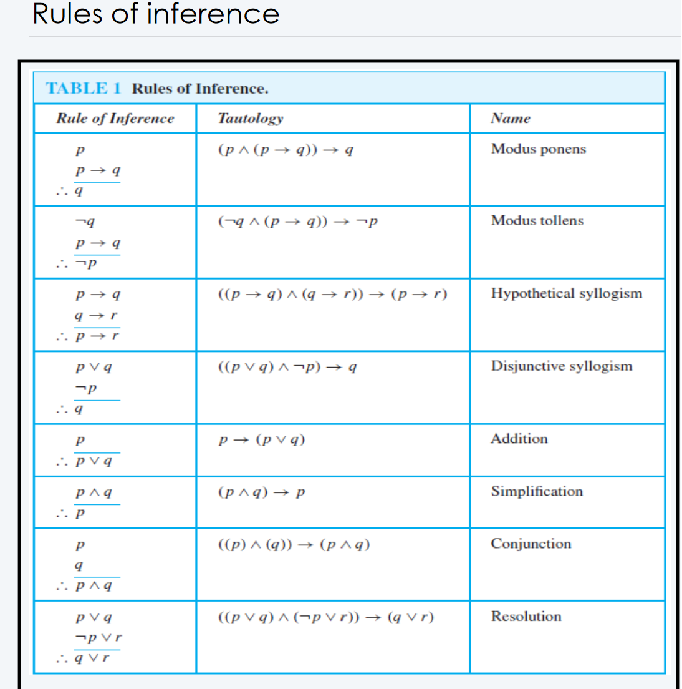

# Discrete 1 Midterm

## Foundations

### Propositional Logic
- **Axioms:** Statements that are assumed to be true.
- **Propositions:** Statements that are either true or false.
  - Propositions are divided into either **atomic** or **compound** propositions.

### Logical Connectives

(In order of precedence)
| Name          | Symbol | Meaning        |
| ------------- | ------ | -------------- |
| Negation      | ¬      | Not            |
| Conjunction   | ∧      | And            |
| Disjunction   | v      | Or             |
| Implication   | →      | Implies        |
| Biconditional | ⟺     | if and only if |

    As a general rule, (∧, v) are associative and commutative, while (→, ⟺) are not.

### Logic Gates

### Consistency and Satisfactiability
- **Consistency:** A set of propositions is consistent if there exists an assignment of truth values to the propositions that makes all of them true.
- **Satisfactiability:** A set of propositions is satisfiable if there exists an assignment of truth values to the propositions that makes at least one of them true.

### Propositional Equivalences
- **Tautology:** A compound proposition that is always true, regardless of the truth values of the propositions it contains.
- **Contradiction:** A compound proposition that is always false.
- **Contingency:** A statement that's neither a contradiction or a tautology.

### Logical Equivalences
- **Logical Equivalence:** Two compound propositions are logically equivalent if they have the same truth values for all possible truth values of their propositional variables.

## Predicates and Quantifiers

### Predicates
- A predicate is a proposition whose truth depends on the value of one or more variables.
  - Example: *Let P(x) denote `x>0` and the domain ℤ.*
    - P(1) is true, P(0) is false.
- You can add multiple variables to a predicate.
  - Example: *Let Q(x,y) denote `x+y=0` and the domain ℤ.*
    - Q(1,-1) is true, Q(1,1) is false.

### Quantifiers
- Quantifiers express the truth of a proposition over a domain.

- **Universal Quantifier: (∀)** For *all* x, P(x) is true in the domain.
- **Existential Quantifier: (∃)** There *exists* an x such that P(x) is true in the domain.

*Side node*: Uniqueness Quantifier (∃!) means there exists exactly one.

    DeMorgan's Law applies to quantifiers as well.

#### Nested Quantifiers
- Nested quantifiers are quantifiers that are nested inside each other.
  - Example: *Let P(x,y) denote `x+y=0` and the domain ℤ.*
    - ∀x∃yP(x,y) basically can be written as ∀x Q(x) where Q(x) is ∃yP(x,y).

#### Quantifiers with Restrictive Domains:
- Using an abbreviated notation, we can still express a condition the variable must satisfy to be included in the quantifier.

#### Quantifiers Precdence:
- Quantifiers have higher logical precedence than logical connectives.

#### Rules of Inference

Example:

Show that the premise "A studnet in this class has not read the book," and "Everyone in this class passed the first exam" imply the conclusion "Someone who passed the first exam has not read the book."

    Let C(x) be that x is in the class.
    Let P(x) be the statement x has read the book.
    Let Q(x) be that x has passed the first exam.

    Premise:
    ∃x(C(x) ^ ¬P(x)), ∀x(C(x) → Q(x))

    Steps                   Reasoning
    1. ∃x(C(x) ^ ¬P(x))     Premise
    2. C(a) ^ ¬P(x)         Existential instantiation from (1)
    3. C(a)                 Simplification
    4. ∀x(C(x)→Q(x))        Premise
    5. C(a) → Q(a)          Universal instantiation

Example:

    Prove that if n is an integer and n² is odd, then n is odd.

    1. Assume the negation of the implication, that is, n is even.
    2. That means n = 2k
    3. Then, (2k)²=4k²= 2(2k²), which is a multiple of 2, which fulfills the negation of p.

Example:

    Prove that √2 is irrational.

    Assume that √2 is rational, that is √2 = a/b where b ≠ 0 and a & b have no common factors.
    This means 2 = a²/b², 2b² = a², which means that a² is even, meaning that a is even.
    This means a = 2k for some k (defn. of even)
    2b² 4k², which also means b is even.
    However, if they are both even, then that means they have another common factor (2).
    This means √2 is irrational.

## Sets, Functions, Sequences

### Set

## Algorithms