

# Intro to Discrete Structures 2

Instructor: Dr. Samaneh G. Hamidi (sg1538@cs.rutgers.edu)
- Office Hours: #266 Hill Center (Monday 11:10-11:40am and Tuesday 11:30-12:30pm)

## Topics
- Set Theory: Symbols and Terminology, Venn Diagrams and subsets, Set operations  
- Counting: Binomial coefficients, Permutations, Combinations, Partitions  
- Recurrence relations and generating functions  
- Discrete probability:  
	- Random experiments, sample spaces, events, probability measures
	- Conditional probability, Bayes' Theorem, Independence
	- Random Variables
	- Expectation, variance, standard deviation
	- Binomial, Bernoulli, Poisson and Geometric distributions; law of large numbers
- Some Topics from Graph Theory: Paths, Components, Connectivity, Euler Paths, Hamiltonian Paths, Planar Graphs, Trees

## Grading
- **Exams** (42%)  *3 exams*
- **Finals** (32%)
- **Quizzes** (20%)
- **Class Participation** (6%)

## Set Theory

### Set

> [Discrete 1 Notes on Sets](../discrete-1/discrete-1#Sets)

A **set** is a collection of items / objects that have at least a property in common.

> Example: Set of all cars made in 2023.

- The notation of a set is a pair of brackets `{}`.
- Typically, we use a uppercase letter to define your set. (e.g. `A = {a, b, c, d}`)
- There are three different ways to describe your set:
	- Statement form: `{I is the set of integers that lies between -1 and 5}`
	- Roster form: `I = {0, 1, 2, 3, 4}`
	- Set-builder form: `I = {x : x ∈ 𝕀, -1 < x < 5}`

#### Review of Sets of Numbers

`ℕ` : Natural Numbers : `{1, 2, 3, 4, 5, ...}`

`𝕎` : Whole Numbers : `{0, 1, 2, 3, ...}`

`ℤ` : Integers : `{..., -2, -1, 0, 1, 2, ...}`

`ℚ` : Rational Numbers : `{x | x = a/b, a,b ∈ ℤ and b ≠ 0}`
	⤷ Irrational numbers **do not** have a set notation, but just means any number that is irrational.

`ℝ` : Real Numbers : `{ x | -∞ < x < +∞}`

---

> Between 2 Integers, is there more rational numbers or irrational numbers?

### Cardinality

The **total number of elements** in a set is called the **cardinal number** or **cardinality** of the set. (*Repetitions of a number DO NOT increase the cardinality of the set*)

This is denoted by `n(A)` or `|A|`

### Empty Set

The **empty set** is the set with *no elements*. (The cardinality of the empty set is 0)

The **empty set is denoted by ϕ** and is always a subset of another set.

### Subset

A set `A` is a subset of a set `B` iff `∀a ∈ A, a ∈ B`.

The symbol for a subset is `⊆` for a subset that is equal to.

### Ordered Pairs

An **ordered pair (a, b)** is a pair of numbers where the order matters.

Ex: (1, 3) ≠ (3, 1)

### Power Set

The **power set** of A, `P(A)`, is the set of all subsets of A.

	A = {-1, 0, 5}
	P(A) = { {-1}, ,{0}, {5}, {-1, 0}, {0, 5}, {-1, 5}, A, ϕ}

#### Cardinality of Power Set

**Theorem**: If `n(A) = i, then `n(P(A)) = 2ⁱ`

> This means that if the cardinality of A is 3, then the cardinality of P(A) is 8.

---

### Venn Diagram

The Venn diagram is how you geometrically represent a set. The outer box represents the universal set, denoted by `U`. The circles inside represent the different sets.

### Set Operations

**Base Sets A and B**:

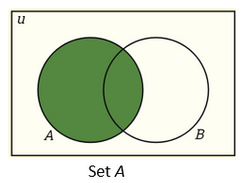

#### Complement set

`A' = A^c = {x | x ∈ U but x ∉ A}`

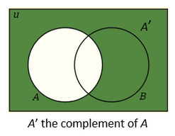
#### Union

`A ∪ B = {x | x ∈ A OR x ∈ B}`

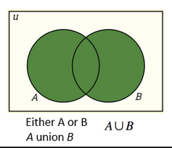
#### Intersection

`A ∩ B = {x | x ∈ A AND x ∈ B}`

#### Difference

`A - B = {x | x ∈ A but x ∉ B}`

#### Cartesian Product

`A x B = {(x, y) | x ∈ A, y ∈ B}`

> **Note:** `A x B` ≠ `B x A`

	A = {-1, 0, 5}, B = {-1,  2} **Find cartesian product**
	AxB = {(-1, -1), (-1, 2), (0, -1), (0, 2), (5, -1), (5, 2)}

**Theorem:** If `n(A)=k` and `n(B)=m`, then the cartesian product will have a cardinality of `k*m`

---

#### Practice

	Let U = {a, b, c, d, e, f, g}, X = {a, c, e, g}, Y = {a, b, c}, Z = {b, c, d, e ,f}
	X' = {b, d, f} Y' = {d, e, f, g}
	X' ∩ Y' = {d, f}

	(Y ∩ X')' ∪ Z' = {a, c, d, e, f, g}

---

#### DeMorgan's Laws For Sets
- For any set `A` and `B` where `A,B ⊆ U,`
	- `(A∪B)' = A' ∩ B'` and `(A ∩ B)' = A' ∪ B'`

---

## Counting

**There are multiple ways of counting:**

1. Counting by listing
2.  Multiplication / Fundamental principle of counting
3. Permutation & Combinations

### To List out Possible Combinations

**Use a tree method:**

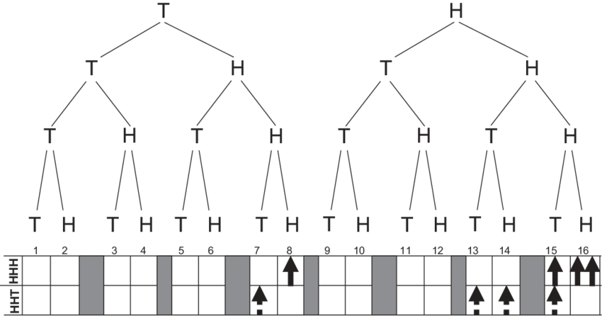

---

### Sample Space

The set of all possible outcomes `S` .

---

### Fundamental Principle of Counting

> When you multiply all the choices for each option together to get your total number of possible outcomes.

**Official Definition:** When a task consists of *k* tasks, each with a possible outcome of nₖ, the total possible outcomes is `n₁ ✕ n₂✕ n₃ ✕ ... ✕ nₖ`

#### Practice

Mathematical Ideas 10.1 pg. 539

	N = {Alan,, Bill, Cathy, David, Evelyn}
	No more than 1 can hold more than 1 office. List and count all ways club could elect each group of officers.
	1. A president and a treasurer
		(5) for president * (4) for treasurer left = 20.
	2. A president and a treasurer if the president must be female.
		(2) for fem. president * (4) for treasurer left = 8

---

	4 digit # --> Possibilities 9 ✕ 10 ✕ 10 ✕ 10 = 9000
	WIthout repeating any --> 9 ✕ 9 ✕ 8 ✕ 7
	Odd number and greater than 4000 --> 6 ✕ 10 ✕ 10 ✕ 5

---

	In how many different ways can you place 5 people in 5 chairs?
	Use FPC, 5 ✕ 4 ✕ 3 ✕ 2 ✕ 1.. This is also...

### Factorials

> **For any counting number *n***, the quantity *n factorial* is defined as follows:
> `n! = n*(n-1)*(n-2)*...*2*1`
> $$n! = n*(n-1)*(n-2)*...*2*1$$

Evaluate the following without a calculator:

$$\frac{5!}{9!} = \frac{5!}{9 * 8 * 7 * 6 * 5!} = \frac{1}{9 * 8 * 7 * 6}$$

> `0!` is going to equal 1. This is the agreement otherwise everything else is going to become 0.

---

#### Practice

MI 10.2

	42. From the same set of people as the president problem... Schedule one member to work in the office each dday for 5 different days, assuming each member may work more than 1 day.
	5⁵

---

	62. Listing phone numbers
	Raj keeps the phone numbers for his seven closest friends (3M, 4F) in his digital phone memory. How many ways can he list them in the following conditions?
	a) men are listed before women
	3 ✕ 2 ✕ 1 ✕ 4 ✕ 3 ✕ 2 ✕ 1 = 3! ✕ 4!
#### Important Practice

	b) all  men are listed together...
	**For these questions, wrap the group together and treat it as just 1 item.**
	So ||| --> 3 men --> | (just 1) + |||| (4 women) --> 5!
	However, we must also consider that the 3 men can also swap with one another. Their swaps have 3! permutations.
	This means, in total, we have 5! ✕ 3!

### Arrangement of `n` objects Containing Lookalikes

- The number of **distinguishable arranements** of *n* objects, where one or more subsets consist of look-alikes (say `n₁` are of one kind, `n₂` are of another kind, ... and `nₖ` are of yet another kind), is given by:

$$\frac{n!}{n₁!*n₂!*...*nₖ!}$$

**Example**

	Determine the number of distinguishable arrangements of the letters in each word.
	ATTRACT (n = 7)
	The problem with this question is:
	- If you swap the First T with the Second T, you still have the same word.
	- Same thing happens if you swap the first A with the second A.
	Solution:
	Put the number of letters that repeat on the bottom using the distinguishable arragenements definiton.
	n = 7 → 2 As, 3 Ts, 1R, 1C
	This means our distinguishable arrangements would be:

$$\frac{7!}{3!*2!*1!*1!}$$

---

### Combination Permutation

The number of **permutations**, or *arrangements*, of *n* distinct things taken *r* at a time, where `r ≤ n`, can be calculated as follows.

$$_nP_r=\frac{n!}{(n-r)!}$$
> Whenever we want to count how many ways we want to pick *r* items out of *n* items.

---

The number of **combinations**, or *subsets*, of *n* distinct things taken r at a time, where `r ≤ n`, can be calculated as follows.

$$_nC_{r}=\frac{_nP_r}{r!}=\frac{n!}{r!(n-r)!}$$

#### When to Use Permutations vs Combinations

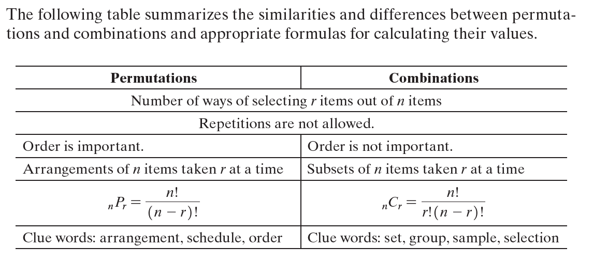

**Example**

- In how many different ways can you choose 5 diamonds?
	- `₁₆C₅`
- In how many ways can you choose 5 black cards?
	- `₂₆C₅`
- In the lottery, you select 5 distinct numbers from 1-47 and one MEGA number from 1-27. How many different sets of 6 numbers can you select. **Lottery numbers are always selection!!!**
	- Multiple task problem, `₄₇C₅ ✕ 27`
- How many of the possible 5-card hands from a standard 52-card deck will consist of the following cards?
	- four clubs and one non-club: `₁₃C₅ ✕ 39`
	- two red cards, two clubs, and a spade: `₂₆C₂ ✕ ₂₆C₂ ✕ 13 (or ₁₃C₁)`

---

### Grouping `n` Elements

To divide *n* elements into *k* groups of *n₁*, *n₂*, *n₃*, ..., *nₖ* (**All Different Sizes**, if an *n₁*): 

$$_{n}C_{n₁}*(_{n-n₁}C_n₂)*...$$

To divide *n* elements into *k* groups at size *r*:

$$\frac{_nC_{r}*(_{n-r}C_r)*...}{k!}$$

---

### Pascal's Triangle

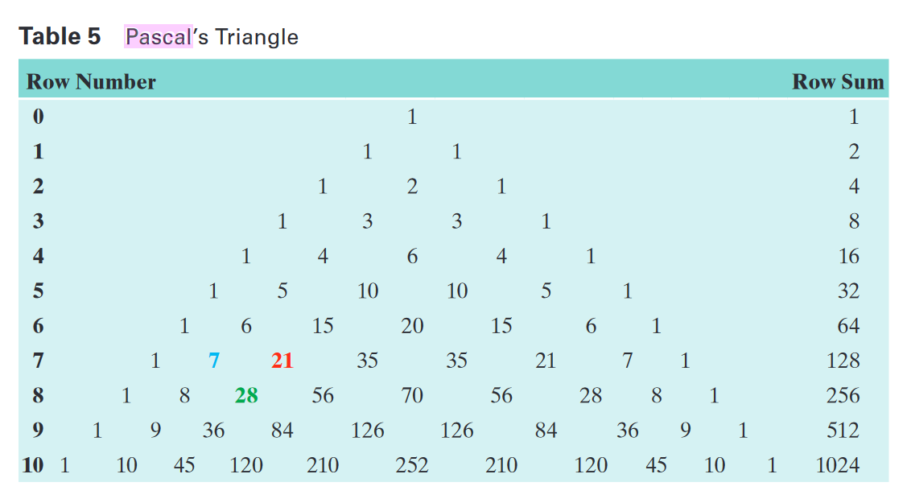

	(a+b) = a + b
	(a+b)² = a²+2ab + b²

So, the for `a¹⁹`:

- `(a+b)¹⁹ = ₁₉C₀a¹⁹ + ₁₉C₁a¹⁸b + ₁₉C₂a¹⁷b² + ... + ₁₉C₀b¹⁹`

---
### Counting Problems Involving "NOT" and "OR"

**Number of Outcomes**: Getting Head **OR** Rolling an even number:

	A = Getting H
	B = Getting even num
	This question can be defined as: n(A ∪ B)
	n(A∪B) = n(A) + n(B) - n(A∩B)
	S = {(H,1), (H,2), (H,3), (H,4),..., (H,6), (T,1), (T, 2), ..., (T,6)}
	A = {(H,1), (H,2), ..., (H,6)}
	B = {(H,2), (H,4), (H,6), (T,2), (T,4), (T,6)}
#### How to Solve

1. Define our set
2. Step 2, draw / list the sample space (so you know the *total* outcomes) **S**
3. List elements in each set and find its cardinality
4. Use the formula to find the value

---

#### Practice for "OR"

- If a single card is drawn from deck, how many different ways can we draw a heart or a ten.
	- A - Heart, B - 10
	- n(A) = 13 (13 hearts in the deck),  n(B) = 4 (there are 4 tens in the deck)
	- n(A∩B) = 1, there is 1 ten that is heart.
	- n(A∪B) = n(A) + n(B) - n(A∩B) = 13 + 4 - 1 = **16**
- An ace or a red card.
	- A - Ace, B - Red card
	- n(A) = 4, n(B) = 26
	- n(A∩B) = 2
	- n(A∪B) = n(A) + n(B) - n(A∩B) = 4 + 26 - 2

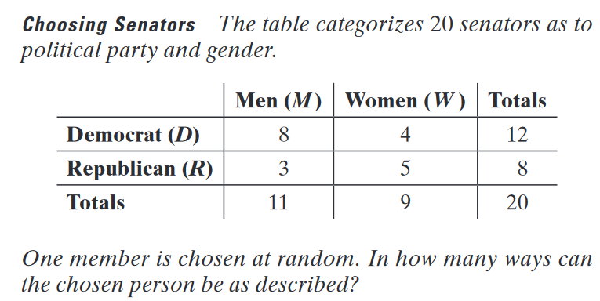

- How many ways can we have a woman or a Democrat man
	- A - Woman, B - Democrat Man
	- n(A) = 9, n(B) = 8
	-  n(A∩B) = 0
	- n(A∪B) = n(A) + n(B) - n(A∩B) = 9 + 8

---

**Number of Outcomes**: Tossing a coin 3 times and getting no heads. (*Same as:* Getting Tails on all 3 tosses)

	Draw out sample space. (I can't draw here rip)
	Let A be Getting Heads.
	A' = Not getting heads.
	n(A') = n(S) - n(A) = 8 - 7 = 1

#### Practice for "NOT"

- If you toss seven fair coins, in how many ways can you obtain at least two head. (**two or more heads**)
	- n(S) = 2⁷
	- Trying to show 2 or more is like n(2H ∪ 3H ∪ 4H ...)
	- **Instead**, go the other route and figure out the outcomes where you get no heads or 1 head.
		- A - No heads, B - 1 head
	- A ∪ B = n(A) + n(B) = 1 + 7 = 8
	- Then, just find the complement of that.
		- 2⁷ - 8

## Probability

### Experiment
- An experiment is a process that results in an outcome that cannot be predicted in advance with uncertainty.

### Sample Space
- The set of all possible outcomes of the experiment are called the *sample space* for the experiment.
- Ex: For tossing a coin, the sample space is `S = { Heads, Tails }`.

### Event
- The subset of a sample space is called an event.
- The probability of some event `A` occurring is the cardinality of `A` over the cardinality of the sample space.

$$P(A) = \frac{n(A)}{n(S)}$$

- The probability of any event occurring must always be between 0 and 1. (As denoted by `0 ≤ P(A) ≤ 1`)
- `P(A) = 1` if `A = S`
- P(A) = 0 if `A = ∅`

### Mutually Exclusive
- The events `A` and `B` are said to be mutually exclusive if they have no outcomes in common.
	- Or in set terms, `∀x,y x∈A, x∉B y∈B, y∉A`
- In mutually exclusive events, the probabilities can be added together in the *addition rule.*

### The Addition Rule

If *A* and *B* are mutually exclusive events, then `P(A∪B) = P(A) + P(B)`. This rule can be generalized to cover the case where *A* and *B* are not mutually exclusive.

### Examples

- Toss a coin 3 times, what are the chances of getting 2 heads.

		First, find cardinality of the sample space. n(S) = 2³ = 8
		Next, define your A. (Let A be getting 2 heads.)
		Next, find the cardinality of A. (A = 3)
		P(A) = n(A)/n(S) = 3/8

- Toss a coin and roll a dice, what's the chance of getting head or an even number?

		First, find the cardinality of the sample space. n(S) = 2 * 6 = 12
		Next, define A. (Let A be a Head) A = {(H,1), (H,2), ... , (H,6)}
		Define B since we have B. (Let B be getting a even number) 
		B = {(H,2), (H,4), (H,6), (T,2), (T,4), (T,6)}
		A = 6, B = 6. Find A ∪ B... A ∪ B = 9.
		P(A ∪ B) = n(A ∪ B)/n(S) = 9/12

---

### The Axiom of Probability

1. Let *S* be the sample space. Then, P(S) = 1.
2. Let any event `A`, `0 ≤ P(A) ≤ 1`
3. If A and B are mutually exclusive events, then P(A ∪ B) = P(A) + P(B).  
More generally, if A1, A2, . . . are mutually exclusive events, then  
P(A1 ∪ A2 ∪ · · ·) = P(A1) + P(A2) + · · *([Addition Rule](../cog-decision/probability#addition-rule))*

### Probability of NOT Problems

- The sample space `S` is just `A ∪ A'`

$$n(S) = \frac{n(A) + n(A')}{n(S)}$$

- So, `1 = P(A) + P(A')`

#### Example

- Toss a coin 8 times, what's the chance to get 5 heads.

		n(S) = 2⁸
		Let A be getting 5 heads. n(A) = ₈C₅
		P(A) = (₈C₅)/2⁸

---

**More practice**

Six hundred paving stones were examined for cracks, and 15 were found to be cracked. The same 600 stones were examined for discoloration and 27 were found to be discolored. A total of 562 stones were neither. One of these 600 stones was selected at random.

	a. Find the prboability that it is cracked, discolored , or both. P(A ∪ B)
	n(A) = 15, n(B) = 27, n(A∪B) = 38
	P(A∪B) = 38/600
	b. Find the probability that it is both cracked and discolored. P(A∩B)
	n(A) + n(B) - n(A∩B) = n(A∩B) = 15 + 27 - 38 = 4
	P(A∩B) = 4/600
	c. Find the probability that it is cracked but not discolored.
	n(A) = 15, n(A∩B) = 4
	P(A∩B') = 15-4/600

### Conditional Probability
- Finding the probability of an event `A`, knowing that the event `B` has already occurred. 

**Formal Definition:** Let `A` and `B` be events with `P(B) ≠ 0`. The conditional probability of `A` *given* `B` is:

$$P(A|B) = \frac{P(A ∩ B)}{P(B)} = \frac{P(A and B)}{P(A)}$$

#### Example
- Toss a coin 3 times, given that we get 2 heads, what is the chance that we got heads on our second toss?
	- P(B) = probability of getting 2 heads. 3
	- P(A|B) = P(A∩B)/P(B) = n(A∩B)/n(B) = 2/3

### Independence
- Two events `A` and `B` are **independent** if the probability of each event remains the same whether or not the pother occurs.
	- *In symbols*: If P(A) ≠ 0 and P(B) ≠ 0, then `A` and `B` are independent if `P(B|A)=P(B)`, or equivalently, `P(A|B)=P(A)`.
- That means, neither event has an impact on the other.

### More Practice
- Of people that bought new vehicle, 12% bought hybrid vehicle, 5% bought hybrid truck. Given that a person bought a hybrid vehicle, what is the probability that it was a truck.
	- 5/12

- A system contains 2 components A and B that need to function for the system to work. The probability that component A fails is 0.08 and that B fails is 0.05. They operate independently. What is the probability that the system will work?
	- A' = 0.92, B' = 0.95
	- P(System functions) = P(A functions and B functions) = P(A'∩B')
	- Since they are independent, 0.92 ✕ 0.95 = **0.874**

## Bayes Theorem

- You know you are using [**Bayes Theorem**](../cog-decision/probability#bayes-theorem), if you are given P(B|A) and are asked to find P(A|B).

Because we are given P(A|B)... $$P(B|A) = \frac{P(A∩B)}{P(A)}, P(A∩B) = P(A|B)*P(A)$$

Then, plug it into P(A|B)... $$P(B|A) = \frac{P(A∩B)}{P(B)}= \frac{P(A|B)*P(A)}{P(B)}$$
**This is the basics of Bayes Theorem**

#todo draw a chart for bayes theorem and try the questions

---

### Practice Problems

47. Find the probability that the first card is a jack and the second card is a face card. (No replacement)

		A - Jack card
		B - Face card
		P(A ∩ B) = P(A) * P(B | A) (Since it is asking "and" it is A∩B)
		P(A) = n(A)/n(S) = 12/52
		P(B | A) = n(B-1)/n(S-1) = 11/51
		4/52 * 11/51

46. No face cards.

		A - No face card on first draw
		B - No face card on second draw
		P(A ∩ B) = P(A) * P(B | A)
		P(A) = n(A)/n(S) = 40/52
		P(B | A) = 39/51
		P(A ∩ B) = 40/52 * 39/51

67. 3 men, 3 women are getting interview. Probability of all women get interview first.

		A = woman go first, B = woman go second, C = Woman go third
		P(A and B and C) = P(A) * P(B | A) * P(C | (A and B)) = 3/6 * 2/5 * 1/4

---

## Odds

- If all outcomes in a sample space are equally likely, `a` of them are favorable to the event `E`, and the remaining outcomes are unfavorable to `E`, then the **odds in favor of `E`** are *a to b*, and the **odds against `E`** are *b to a*.
	- Ex: # of girls to # of boys in the class is 2 to 5. (2+5 is our sample space)
	- `P(Girl) = 2/7`
	- The odds against Girls are going to be 5 to 2.

**More Examples:**

- 30% chance to have rain. (A)
	- This means there's a 70% chance of no rain. (A')
	- So, the odds in favor of A is going to be 30 to 70, or 3 to 7. (*3 is favorable, 7 is not*)
	- Odds against A will be 7 to 3.

---

## Bayes Theorem Cont.

### Bayes' Rule

**Special Case:** Let A and B be events with P(A) ≠ 0, P(¬A) ≠ 0, and P(B) ≠ 0. Then... $$P(A|B) = \frac{P(B|A)*P(A)}{P(B|A)*P(A) + P(B|¬A)*P(¬A)}$$

Example Practice:

	P(D) = 0.005
	P(+ | D) = 0.99
	P(+ | ¬D) = 0.01
	P(D | +) = (P(+|D) * P(D))/(P(+|D) * P(D) + P(+ | ¬D) * P(¬D)) = (0.99 * 0.005)/(0.99 * 0.005 + 0.01 * 0.995)

Another One: 2.25 Math Ideas

	P(S) = 0.45, P(M) = 0.35, P(L) = 0.2
	P(F | S) = 0.1, P(F | M) = 0.12, P(F | L) = 0.15
	P(F) = P(F|S) * P(S) + P(F | M) * P(M) + P(F | L) * P(L) = 0.45 * 0.1 + 0.35 * 0.12 + 0.2 * 0.15

Page 85 (William Navidi)

### Random Variable
- A function that assigns a numerical value to each outcome in a sample space.

> In real life, the probabilities of things that should be set, such as tossing a coin, are actually slightly skewed. (Not exactly 50/50) However, the more you toss, the more that total probability should approach 0.5.

#### Discrete Random Variable
- The domain of these are the discrete set of numbers.
- *Discrete*: There is a gap between every set of numbers.
	- Counting numbers, natural numbers

> **Formal Definition:** A random variable is **discrete** if its possible values form a discrete set. This  means that if the possible values are arranged in order... (William Navidi)

#### Continuous Random Variable
- The domain of these are a continuous set of numbers.
- *Continuous*: There is no gap between the numbers.
	- Real numbers

#### Example
- Toss a coin 10 times. X: # of heads.
	- Your X can get a value from 0-10. ← This is a random variable.

### Probability Mass Function
- The **probability mass function** of a discrete random variable `X` is the function `p(x)=P(X = x)`. The probability mass function is sometimes called the **probability distribution**.

Find the probability mass function of the number of heads when tossing a coin 3 times.

	Let X: # of heads, This means X can take the values of {0, 1, ,2, 3}
	So, to find the probability mass function, calculate the probalities for each of the random variables.
	P(X=0) = 1/8, P(X=1) = 3/8, P(X=2) = 3/8, P(X=3) = 1/8
	Then, draw it into a table.

| x   | P(X=x) |     |
| :-- | :----- | --- |
| 0   | 1/8    |     |
| 1   | 3/8    |     |
| 2   | 3/8    |     |
| 3   | 1/8    |     |

$$\sum_{x=0}^{S}P(X=x_{i})=1$$

---

For questions like "*probability of more than 2 heads...*"

- Using the PMF, P(X ≥ 2) = P(X=2) + P(X=3) + ...

For questions like "*probability of less than 2 heads...*"

- P(X ≤ 2) = P(X=2) + P(X=1) + P(X=0)

---

#### Summary

Let X be a discrete random variable. Then...

- The probability mass function of `X` is the function `p(X) = P(X=x)`
- The cumulative distribution function of X is the function `F(X)=P(X≤x)`
	- The sum of the Probability mass function up to and including the value of x.
- $F(x)=\sum_{t≤x}p(t)=\sum_{t≤x}P(X=t)$
- ??? Navidi book

---

##### Practice

Computer chips often contains surface imperfections. The PMF of the number of defects X is presented in the following table.

| x    | 0   | 1   | 2    | 3   | 4    |     |
| :--- | :-- | :-- | :--- | :-- | :--- | --- |
| p(X) | 0.4 | 0.3 | 0.15 | 0.1 | 0.05 |     |

1. Find P(X≤2)
	- P(X=0) + P(X=1) + P(X=2) = 0.85
2. Find P(X>1)
	- P(X>1) = 1 - P(X≤1) = 1 - 0.7 = 0.3

William Navidi Book 112 #7 #todo try it

## Expected Value

Let `X` be a discrete random variable with probability mass function given by `p(x) = P(X = x)`. The mean of `X` is given by:

$$\mu_{x}= \sum_{x}x*P(X=x)$$
where the sum is over all possible values of X.

- The mean of `X` is sometimes called the expectation, or *expected value* of `X` and may be denoted as `E(X)` or by μ.

> **This can also be referred to:** A long term average of Discrete Random Variable `X`.

- This is typically used in gambling to show that when gambling, when you gamble a lot, you will always lose money.

> **Problem Solving For E(X)**:

- Define the sample space
- Define the Random variable.
- Determine the values of the random variable.
- Find the probability mass function for each.
- Substitute all values in E(x) formula.

##### Example

Find the expected number of boys for a three child family. Assume girls and boys are equally likely.

	n(S) = 2⁸
	Let X = # of boys
	X = 0,1,2,3
	x|P(X)
	0|1/8
	1|3/8
	2|3/8
	3|1/8
	E(X) = 0(1/8) + 1(3/8) + 2(3/8) + 3(1/8) = 1.5

A player pays `$3` to play the following game. he tosses three fair coins and receives back "payoffs" of `$1` if he tosses no heads, `$2` for one head, `$3` for two heads, and `$4` for three heads. Find the player's expected net winnings for this game.

	n(S) = 2⁸
	What I pay: (Loss value) -$3
	What I earn: Whatever I get back from the coin toss.
	Let X = The net winning value
	X = 0, 1, 2, 3
	x|P(X=x)
	-$2|1/8
	-$1|3/8
	+$0|3/8
	+$1|1/8
	E(X) = -2(1/8) + -1(3/8) + 0(3/8) + 1(1/8) = -4/8 = -$0.5

> **Note**: Define your Random variable as whatever the question is asking, in this case, *net earnings*, but use the P(X) from the heads or tails that corresponds.

### Variance

Let X be a discrete random variable with probability mass function `p(x) = P(X=x)`. Then...

- The variance in `X` is given by:
$$\sigma_{x}^{2}=\sum\limits_{x}(x-μ_x)^2P(X=x)$$
- An alternate formula is given by:
$$\sigma_{x}^{2}=\sum\limits_{x}x^{2}P(X=x)-μ_{x}^{2}$$
- Then, you can simplify it even more using expected value...
	- Since, $E(x)= \sum_{x}x*P(X=x)$, then, $E(x^2)= \sum_{x}x^{2}*P(X=x)$...
- So the equation can just become:
$$\sigma_{x}^{2}=E(x^{2})-E(x)^2$$
	- **Note**: When squaring the E(x²), you only need to multiply the probability by the x², as shown by the summation in the alternate formula.

##### Example

Rolling single fair dice. Even number means u receive as much money as there are spots up, odd means you pay that amount.

	Find the epxected net winnings of this game.
	n(S) = 6
	Let x be the net winnings.
	x | P(X=x)

A certain game involves tossing 3 fair coins, and it pays 10¢ for 3 heads, 5¢ for 2 heads, and 3¢ for 1 head. Is 5¢ a fair price to pay to play this game? That is, does the 5¢ cost to play make the game fair?

The probability distribution of random variable X is given as: $P(X =x) = {k(2-x)^{2} ,0}$. Find E(X) and find σ²(x).

| -2  | 16k |     |
| :-- | :-- | --- |
| -1  | 9k  |     |
| 0   | 4k  |     |
| 1   | k   |     |
| 2   | 0   |     |

	16k + 9k + 4k +k= 1
	k = 1/30
	E(X) = -2(16/30) + -1(9/30) + 0(4/30) + 1(1/30)
	σ²(X) = E(x²) - E(x)²

### Properties of E(x) and σ²(x)
- It is like average, expected over a long time.
- The E(c), where c is a constant = c.
- E(cx) = c(E(x)), since the E(c) is constant.
- E(cx+b) = cE(x) + b
- σ²(c) = 0, since there would be *no variance* for a constant.
- σ²(cx) = c²σ²(x)
- σ²(cx+b) = c²σ²(x)

### Standard Deviation
- For any random variable `x`, the Standard deviation of `x` = $\sqrt{\sigma^{2}_{x}}$.

## Commonly Used Distributions
- You can use this method for problems with sample spaces with mutually exclusive outcomes.
- In all of these distributions, we consider **p: Probability of success**, and **q: Probability of failure**, where `q = 1-p`.

### Bernoulli Distribution
- Used when **number of distributions** = 1. (When you go over it once, *repetition = 1*)
- For any Bernoulli trial, we define a random variable `X` as follows:
	- If the experiment results in success, then X = 1, Otherwise X = 0. It follows that X is a discrete random variable, with probability mass function `p(x)` defined by:
		- `p(0) = P(X=0) = 1-p = q`
		- `p(1) = P(X=1) = p`

#### Steps to Solve
1. Make sure you know the sample space.
2. Define the discrete random variable.
3. Determine values for the DRV (x)
4. Calculate the probability mass function of p(X = x)

> `x~Bernoulli(p)` - Where `~` means "follows" and `p` is the probability of success.

##### Example

Roll a dice, find the probability of finding of getting 6, write the distribution.

	# of repetition = 1
	X = # of times getting 6
	0 - Not getting 6,  1 - Got 6
	p(0) = p(X = 0) = 1-p = 1-1/6 = 5/6
	p(1) = p(X = 1) = p = 1/6

> So, you can say that `X~Bernoulli(1/6)`

#### Mean and Variance of a Bernoulli Random Variable

**If X~Bernoulli(p), then**

- `μx = p`
- `σ²(x) = p(1-p)`

### The Binomial Distribution
- The **Binomial Distribution** is the repetition of `n` *independent* Bernoulli Distributions, where probability of success (`p`) and probability of failure (`q`)
- If DRV (X) has a binomial distribution, or follows binomial distribution, we write it as `X~Bin(n,p)` - where `n` is the number of repetitions, and `p` is the probability of success.
- **Note:** Your `x` value in a binomial distribution will be between `0` and `n`.

> $p(X) = P(X=x) = _{n}C_{x}p^{x}q^{n-x}$

##### Examples

Repeating it 55 times, I want the probability of getting 17 heads.

	X~Bin(55, 1/2) -> First, write out that it follows binomial distribution.
	X = number of heads
	X = 17
	p(x=17) = ₅₅C₁₇ * p¹⁷ * p⁵⁵⁻¹⁷ = ₅₅C₁₇ * (1/2)¹⁷ * (1/2)⁵⁵⁻¹⁷

A large industrial firm allows a discount on any invoice that is paid of 30 days. Of all invoices, 10% receive the discount. In a company audit, 12 invoices are sampled at random. What is the probability that fewer than 4 of the 12 sampled invoices receive the discount?

	n = 12 (invoices sampled)
	p = 1/10 (Probability of success)
	X = number of invoices that receive the discount
	X < 4
	X~Bin(12, 1/10)
	They are asking: P(X < 4) = P(X = 0) + P(X = 1) + P(X = 2) + P(X = 3)
	Then, just plug in formula for each of them:
	P(X < 4) = 12C0 * (1/10)^()
	#todo finish this

#### Mean and Variance of Binomial

If `X~Bin(n,p)`, then the mean and variance of `X` are given by:
- $\sigma_x=np$
- $\sigma_{x}^{2}=npq$

### Poisson Distribution

- `n ⤳ ∞` and `p ⤳ 0` such that `n*p < 5` with `n*p=λ`, you use **Poisson Distribution**, if it's 5 or above, use binomial.

> Note: We use binomial for repetitions, however, we use Poisson where there is a given p-value that is small. 

**If X~Poisson(λ)** (X follows a Poisson Distribution), then, the **P(X=x) =** $e^{-λ}\frac{λ^{x}}{x!}$.

Hence, `μₓ=λ` and `σₓ²=λ`.

#### Rate Problems
- If they give you mean or rate, that is just Poisson, because `μₓ=λ`, and there is no way to use Binomial, because you do NOT know the `n` value or `p` values.

##### Summary

**Let λ** denote the mean number of events that occur in one unit of time or space. **Let X** denote the events that are observed to occur in *t* units of time or space.

- Then, if `X~Poisson(λt)`, λ is estimated with λ^ ?? #todo fill in
- This also means that if the unit of time changes, say from 1 to 1.5, you will multiply your old lambda with the new time to get the new lambda.

##### Example

- Particles are suspended din a liquid medium at a concentration of 6 particles per mL. A large volume of the suspension is thoroughly agitated, and then 3 mL are withdrawn. What is the probability that exactly 15 particles are withdrawn?

- 5) A data center contains 1000 computer servers. Each server has probability 0.003 of failing on a given day.

a) What is the probability that exactly two servers fail?

	n = 1000, p = 0.003, X = # of servers failing 
	⤷ n*p = 1000*0.003 = 3 < 5, so we use Poisson with λ=3
	Then, we can say that X~Poisson(3)
	P(X=2) = e⁻³(3²/2!)
	
b) What is the probability that fewer than 998 function?

	P(X > 2) = 1 - P(X <= 2)
	P(X > 2) = 1 - P(X=0) + P(X=1) + P(X=2) =  1- e⁻³(3⁰/0!) + e⁻³(3¹/1!) +  e⁻³(3²/2!)

c) What is the mean number of servers that fail?
d) What is the standard deviation of the number

- The number of hits on a certain website occur with a mean rate of 4 per minute.

a) What is the probability that 5 messages are received in a given minute?

	μₓ= 4 per minute= λ
	X = # of messages received per minute
	X~Poisson(4)
	P(X=5) = e⁻⁴(4⁵/5!)

b) What is the probability that 9 messages are received in 1.5 minutes?

	μₓ= 4 per minute= λ
	Y = # of messages received in 1.5 minutes
	Here, the t-value has changed to 1.5 from 1, meaning my new lambda is λ=1.5*4 = 6
	Y~Poisson(6)
	P(Y=9) = e⁻⁶(6⁹/9!)

c) What is the probability that fewer than 3 messages are received in a period of 30 seconds?

	λ = 4 per minute
	Z = # of messages per 30 seconds
	This means that t=0.5, and my new lambda is λ = 0.5*4 = 2
	Z~Poisson(2)
	P(X<3) = P(X=0) + P(X=1) + P(X=2) = e⁻²(2⁰/0!) + e⁻²(2¹/1!) + e⁻²(2²/2!)

- The number of houses sold by an agent have a mean of 2.5 houses per week. 

a) Find the probability that in the next 4 weeks, the estate agent sells exactly 4 houses. More than 6.

	X = Number of houses sold per week
	X~Poisson(10)
	μₓ = λ = 2.5
	X₁ = number of houses sold per 4 weeks
	4μₓ = λ = 4(2.5) = 10

- P(X=4) = $e^{-λ}\frac{λ^{x}}{x!}$ = $e^{-10}\frac{10^{4}}{4!}$

More than 6:

	P(X>6) = 1-P(X≤6) = 1-P(0,1,2,3,4,5,6)

- P(X>6) = $1-\sum\limits_{x=0}^{6}e^{-10}*\frac{10^x}{x!}$ = A

b) The agent monitors the house sales in periods of 4 weeks. Find the probability that in the next 12 of those 4 weeks periods, there are exactly 7 4 week periods in which more than 6 houses are sold.

	Y = # of 4 weeks with more than 6 houses sold
	X~Binomial(12,A)     # it is binomial because we are finding chance of success v failure.
	P(Y=7) = ₁₂C₇A⁷(1-A)⁵

#todo do every problem of william navidi book

---

### Uncertainty
- We are not going over uncertainty in this class. (No hat symbol)

---

#todo quiz on binomial poisson distribution thursday, quiz next monday on rest of the distributions

### Geometric Distribution
- In previous distributions, we always knew the number of trials.
- However, in *Geometric Distribution*, or negative binomial distribution, you DON'T know your `n`.
- Asking for number of trials up to and *including* first trial that results in success.

Let X be a discrete random variable s.t. X=# of trials up to and including 1st result.

Then, you can write that `X~Geom(p)`, where `p` = probability of success.

You can also write that `P(X=x) = p*q^(x-1)` If you know how many trials till you finally succeed.

> Clue: If the problem asks "*Up to and including blah blah for first blah...*", you **know** that you are using Geometric.

#### Mean and Variance

If X~Geom(p), then:

- $μₓ=\frac{1}{p}$
- $σ_{x}^{2}=\frac{1-p}{p^2}$

### Negative Binomial Distribution
- Just like geometric distribution, you do not know your number of trials.
- However, *negative binomial distribution* calculates how many trials you need to get `r` number of successes.
- If a discrete random variable `X` follows Negative Binomial Distribution, you write that `X~NB(r,p)`. -> p is the chance of success.

If `X~NB(r,p)`, then the probability mass function of `X` is:

$$p(X) = P(X=x) =
\begin{cases} 
      _{x-1}C_{r-1}p^{r}(1-p)^{x-r} & x=r,r+1,... \\
      0 & otherwise
   \end{cases}$$

#### Mean and Variance

If `X~NB(r,p)`, then the mean and variance is:

- μₓ = r/p
- $σ_{x}^{2}=\frac{r(1-p)}{p^2}$

---

##### Example

William Navidi book, pg. ___ q8

- A process that fills packages is stopped whenever a package is detected who's weight falls outside the specification. Assume that each package has a 0.01 probability of failing and that the weights of the packages are independent.

a) Find the mean number of packages that will be filled before the it is stopped.

	X = # of packages filled before it is stopped.
	X~Geom(0.01)
	μₓ = 1/p = 1/0.01

b) Find the variance in the number of packages that will be filled before the process is stopped.

$σ_{x}^{2}=\frac{1-0.01}{0.01^2}$

c) Assume that the process will not be stopped until 4 packages that fail are detected. Find the mean and variance in the number of packages that will be filled before the process is stopped.

	Y = number of packages filled up to and including 4 that fail.
	Y~NB(4, 0.01)
	μₓ = r/p = 4/0.01

---

### We skip Multinomial Distribution

### Hypergeometric Distribution
- Hypergeometric is legit just the two step problems we have already been doing.
- There is formal formula lol.
- **Hypergeometric Distributions do not have repeatable trials**

If `X~H(N, R, n)`, the probability mass function of X is:

$$p(X) = P(X=x) = \begin{cases} 
  \frac{_RC_{x} * _{N-R}C_{n-x}}{_NC_n} & max(0, R+n-N) \leq x \leq min(n, R) \\ \\

 0 & otherwise\\
\end{cases}$$

#### Mean and Variance

- $\mu_{x}=nR/N$
- $\sigma_{x}^{2}=n(R/N)(1-R/N)(N-n/N-1)$

### Examples

9. W.N. pg.241: A lot of parts contains 500 items, 100 of which are defective. Suppose that 20 items are selected at random. Let X be the number of selected items that are defective.

Find P(X=5)

	X~H(500, 100, 20)

13. Ten items are to be sampled from a lot of 60. If more than one is defective, the lot will be rejected. Find the probability that the lot will be rejected in each of the following cases.

a. The number of defective items in the lot is 5.

	X = # of defective items pulled out
	X~H(60, 5, 10)
	P(X>1) = 1 - P(X=0) - P(X=1) = 1 - (5C0*55C5/60C10) - (5C1*55C9/60C10)

b. The number of defective items in the lot is 10.

	X~H(60, 10 , 10)

99. Justin is playing an alien shooter online. It is a game where you battle against randomly drawn opponents where reward of a battle is a game ticket. The probability of Justin winning a battle is thought to be `0.4`.

a. Calculate the probability of Justin winning his first battle on his third attempt.

	X = # of games up to and including first battle
	X~Geo(0.4)
	P(X = 3) = 0.4*0.6^2

b. Winning his first battle after his third attempt.

P(X > 3) = (First 3 games must be losing) $0.6^{3}$ * 1 (After that, it is 100%, since he can keep playing) 

c. In alien shooter, when you collect 7 game tickets, you can upgrade your spaceship. Justin has already collected 2 game tickets from the previous days play. He starts playing today hoping to upgrade his spaceship. Find the probability he will have to have 10 battles by the time he is able to upgrade his spaceship.

	Y = # of battles up to and including his 5th win.
	Y~NB(5, 0.4)
	P(Y=10) = 9C4*0.4^5*0.6^5

## Graphs

- **Graphs** are discrete structures consisting of vertices and edges that connect these vertices.
- There are different kinds of graphs, depending on whether edges have directions, whether multiple edges can connect to the same pair of vertices, and whether loops are allowed.

> Non-empty set of vertices and edges that are *connecting* two vertices. (We call graphs the variable `G`)

- Typically, you call the first graph `G`, and following graphs `H`, `I`,... and so forth.
- We reserve `G₁`, `G₂`, ... for *subgraphs*.

> A graph, `G`, with a set of vertices `V` and edges `E`, denotes as: `G:(V,E)`, where, `V = {V₁, V₂, ..., Vₙ}` and `E = {E₁, E₂, ..., Eₙ}`.

### Graph Terminology

- We have the following terminologies:
	- Two vertices, `V₁` and `V₂` are *end vertices* of edge e₁, **if and only if**, they are connected to an edge.
	- Edges that have the **same end vertices** are called *parallel*.
	- Any edge that connects a vertex to itself is called a *loop*.
	- A graph without **any parallel edges or loops** are called *simple graphs*.
	- A graph with **no vertices** is a *null graph*. (we don't usually use this, and it is contradicting the original definition)
	- A graph with **only one vertex** is a *trivial graph*.
	- Edges are *adjacent* if they share a **common end vertex**.
		- However, edges that are *parallel* can not be *adjacent*.
	- Two vertices, `U` and `V` are called *adjacent* if they are connected by an edge.
	- The *degree* of a vertex, written as `d(V)` is the total number of edges with `V` as an end vertex. (**By convention, we count loops twice.**)
	- A *pendant vertex* is a vertex with `d(V) = 1`.
		- Any *edge* with a *pendent vertex* as a end point is a *pendant edge*.
	- An *isolated* vertex is a vertex whose `d(V) = 0`.

##### Practice

3. Find the number of vertices, the number of edges, and the degree of each vertex in the given undirected graph:

- 9 vertices: 2 *isolated vertices* (*f, d*), no pendant vertices. 12 edges:
	- `d(a) = 3`, `d(b) = 2`, `d(c) = 4`, `d(d) = 0`, `d(e) = 6`, `d(f) = 0`, `d(g) = 4`, `d(h) = 2`, `d(i) = 3`

---

### Terminology Cont.
- The **minimum degree** of the vertices in a graph `G` is denoted as `δ(G)` and the **max degree** is `Δ(G)`.
- A sequence, `d₁, d₂, ...` is considered *graphic* if it is the degree sequence of a simple graph.
	- In a simple graph, the **maximum** degree of a graph with `n` vertices is `n-1`.
	- Ex: `5,4,3,2,1,0`: 6 vertices, 15 edges. (*edges is odd, already failed not graphic*, *The maximum degree is 5, meaning one vertex would be connected to every other vertex, but there is a vertex with degree 0, so it is **not** graphic*)
	- Ex: `2,2,2,2,2,2`: 6 vertices, 12 edges. (*nothing you can use to say it is not graphic*, draw it)
		- It is a graph.
	- Ex: `5,5,4,3,2,1`: (*not graphic because the minimum degree should be 2*)

### The Handshaking Theorem
- Let `G = (V, E)` be an undirected graph with `m` edges.
- Then: $2m=\sum\limits_{v{\in}V}d(V_i)$, where `m` is the number of edges.

> An *undirected graph* containing **must** contain and even number of odd degrees. (*Because otherwise, the entire sequence will be odd...*)

### Complete Graphs
- A **complete graph** on `n` vertices, denoted by `Kₙ`, is a *simple graph* that contains exactly one edge between each pair of distinct vertices. (The maximum number of edges possible for the simple graph)

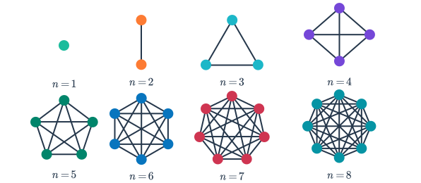

### Complementary Graph
- A **complementary graph** $\bar{G}$ of a simple graph `G` has the same vertices as G. Two vertices are adjacent in $\bar{G}$ if and only if they are not adjacent in G.
- The **combination** of the complementary graph and the simple graph should give you a **complete graph**.

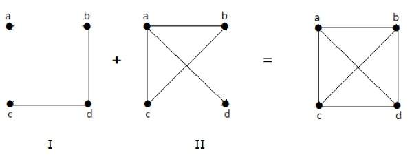

### Cycle Graph
- A **cycle graph** $C_{n}, n>=3$ consists of *n* vertices `v₁, v₂, ...` and edges of *d(vₙ) = 2* for all vertices.

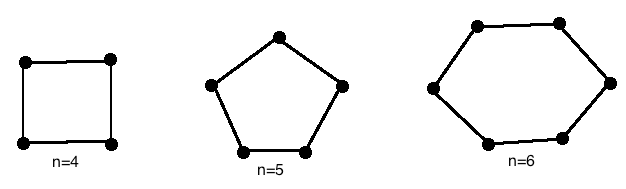

### Wheel Graph
- A wheel graph ($W_{n}$) is created when we add an additional vertex to a cycle graph for `n≽3`, and connect this new vertex to each of the *n* vertices of the cycle graph by new edges.

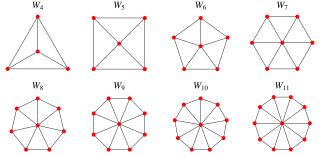

##### Practice

35) how many vertices and how many edges do these graphs have?

b) $C_{n}$ : Edges = n edges, Vertices: n vertices

c) $W_{n}$ : Edges = 2n edges, Vertices: n+1 vertices

59) Describe: $\bar{C_{n}}$, 

### Bipartite Graphs
- A *simple graph* is called **bipartite** if it's vertices set can be divided into two subsets such that every edge in the graph connects a vertex in one subset to a vertex in another.
- Partition it such that:
	- V = V₁ ∪ V₂
	- Every edge "e" connects a vertex from V₁ to V₂.
- A **complete bipartite graph** with $n(V_{1})=n \& n(V_{2})=m$ is denoted as $K_{n,m}$.

#### Simple Bipartite
- A *simple bipartite graph* `G` is called a **complete bipartite** graph if it includes all possible edges between vertices in V₁ and vertices in V₂. (*so that no edge in G connects either two vertices in V₁ or two vertices in V₂*).
- When this condition holds, we call the pair (V₁, V₂) a *bipartition* of the vertex set *V* of *G*.

#### Theorem

- A simple graph is bipartite if and only if it is possible to assign one of two different colors to each vertex of the graph so that no two adjacent vertices are assigned to the same color.

##### Practice

28) Suppose a new company has five employees: Zamora, Agraharam, Smith, Chou, and Macintyre. Each employee will assume one of six responsibilities: planning, publicity, sales, marketing, development.... (Mathematical ideas book, 665)

a) Model the capabilities of these employees using a bipartite graph.

Z -> Pl, S, I, M
A -> Pl, D
S -> Pu, S, I
C -> Pl, S, I
M -> Pl, Pu, S, I

### Subgraphs
- A **subgraph** of $G=(V,E)$ is $G_{i}(V_{i}, E_{i})$ **if and only if** Vᵢ ⊆ V and Eᵢ ⊆ E.
- Each edge in Gᵢ has the same endpoint as in G.

## Graphs 10.4

> **Remark:** There is considerable variation in terminologies concerning the follow concepts: *walks*, *trails*, *paths*, *circuits*. \
> When listing out the *vertex sequence*, for a simple graph, there is no need to list out the edges as there is at maximum 1 edge connecting each vertex to another vertex.

**To illustrate the concepts, we use this example graph.**

### Walks
- Walks are the most fundamental concept for traversal of a graph.

> In a *graph*, `G(V,E)`, a **walk** is a finite sequence of vertices and edges that get from one *initial vertex* to a *terminal vertex*. \
> A **walk** always starts and ends at a vertex.

*Example:* $v_{1}e_{1}v_{2}e_{2}v_{3}e_{3}v_{4}$ is considered a *path*.

#### Closed Walk
- A *closed walk is also known as a cycle*.
- A closed walk is a walk that has the same *initial* and *terminal* vertices.

*Example:* $v_{1}e_{1}v_{2}e_{7}v_{5}e_{9}v_{1}$ would be considered a *closed walk*, as the **endpoints** are the same.

### Trail
- A *walk* with 1 restriction on it is a trail.

> In a *graph*, `G(V,E)`, a **trail** is a *walk* where none of the *edges* are repeated.

*Example:* $v_{1}e_{1}v_{2}e_{7}v_{5}e_{9}v_{1}$ would also be considered a *trail*. **However,** $v_{1}e_{1}v_{2}e_{2}v_{3}e_{2}v_{2}$ would **not** be considered a trail.

### Path
- A *walk* with 2 restrictions on it is a path.

> In a *graph*, `G(V,E)`, a **path** is a *walk* where there are **no repeated vertices or edges**, except for the *initial* and *terminal* vertex.

*Example:* $v_{1}e_{1}v_{2}e_{2}v_{3}e_{3}v_{4}$ would also be considered a *path*.

#### Circuit / Closed Path

- Notice how there is the exception for *initial* and *terminal* vertices...
	- This is because a *path* with a repetition of the *initial* and *terminal* vertices is a *closed* path, a.k.a. a **circuit**.
- *Note:* A graph without any circuits is called **circuit-less**.

*Example:* $v_{1}e_{9}v_{5}e_{8}v_{1}$ would be considered a *circuit*.

### Theorems

**Theorem 1:** A graph is *circuit less* when there is **no loops** and **at most** one *path* between every two vertex.

**Theorem 2:** Any graph that contains a *odd length cycle* is **not** bipartite.

**Theorem 3:** A graph is **connected** if all the vertices are connected.

- This means that there is at *least* one walk between every pair of vertices.

> Disconnected graphs have at least *two components*. Each component by itself is "*connected*."

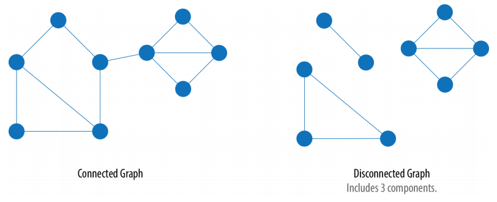

### Cuts

> **Cuts** are used to *disconnect* a connected graph.\
> This involves the removal of a vertex (*cut vertex*) or an edge (*cut edge*).

- A *vertex* or *edge* is called a *cut vertex or edge* of its removal will increase the number of components in the graph `G`.

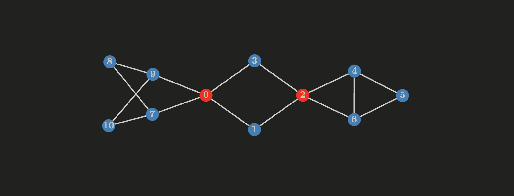

##### Example
- In the above example, vertices `0` and `2` can be considered cut vertex.
- In the example above, there are **no** cut edges.

## Euler and Hamilton

### Euler Walk & Circuit
- A *Euler walk* is one that uses every edge at exactly **once**.
- It was inspired by the famous puzzle with the bridges.

#### Euler Circuit
- A *Euler circuit* is a *closed walk* that uses each edge **exactly once**.

> A *connected graph* is then called a *Euler graph* if it contains a Euler circuit.

#### Theorems

**Theorem 1:** A connected graph `G` contains a *Euler walk* if and only if it has exactly **two** of it's vertices have *odd degrees*. 

- **Ex:** The degree sequence `5,2,2,2,2,1` contains a Euler Walk.

**Theorem 2:** A connected graph `G` has a *Euler circuit* if and only if all vertices have *even degrees*.

- **Ex:** C₅ is a Euler circuit, but not a Euler walk. (*Deg. of each vertices in C₅ is 4.*)

### Hamiltonian Path and Circuit
- A *Hamiltonian path* is a ***path*** which contains every *vertex* exactly *once*.
- A *Hamiltonian circuit* is a ***circuit*** which uses every *vertex* exactly *once*.

> **Note:** The theorems for Hamiltonian paths and circuits are very *unreliable*. If the conditions are satisfied, there *might* be a Hamiltonian circuit. (*might*)

#### Theorems

**Theorem 1:** If `G` is a simple graph of `n` vertices with `n ≥ 5` and `d(u) + d(v) ≥ n`, where `u` and `v` are not adjacent vertices, then `G` has a *Hamiltonian circuit*.

**Theorem 2:** `d(u) + d(v) ≥ n-1` where `u` and `v` are not adjacent, `G` has a *Hamiltonian path*.

