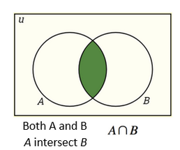

# Intro to Discrete Structures 2

Instructor: Dr. Samaneh G. Hamidi (sg1538@cs.rutgers.edu)
- Office Hours: #266 Hill Center (Monday 11:10-11:40am and Tuesday 11:30-12:30pm)

## Topics
- Set Theory: Symbols and Terminology, Venn Diagrams and subsets, Set operations  
- Counting: Binomial coefficients, Permutations, Combinations, Partitions  
- Recurrence relations and generating functions  
- Discrete probability:  
	- Random experiments, sample spaces, events, probability measures
	- Conditional probability, Bayes' Theorem, Independence
	- Random Variables
	- Expectation, variance, standard deviation
	- Binomial, Bernoulli, Poisson and Geometric distributions; law of large numbers
- Some Topics from Graph Theory: Paths, Components, Connectivity, Euler Paths, Hamiltonian Paths, Planar Graphs, Trees

## Grading
- **Exams** (42%)  *3 exams*
- **Finals** (32%)
- **Quizzes** (20%)
- **Class Participation** (6%)

## Set Theory

### Set

> [Discrete 1 Notes on Sets](../discrete-1/discrete-1#Sets)

A **set** is a collection of items / objects that have at least a property in common.

> Example: Set of all cars made in 2023.

- The notation of a set is a pair of brackets `{}`.
- Typically, we use a uppercase letter to define your set. (e.g. `A = {a, b, c, d}`)
- There are three different ways to describe your set:
	- Statement form: `{I is the set of integers that lies between -1 and 5}`
	- Roster form: `I = {0, 1, 2, 3, 4}`
	- Set-builder form: `I = {x : x ∈ 𝕀, -1 < x < 5}`

#### Review of Sets of Numbers

`ℕ` : Natural Numbers : `{1, 2, 3, 4, 5, ...}`

`𝕎` : Whole Numbers : `{0, 1, 2, 3, ...}`

`ℤ` : Integers : `{..., -2, -1, 0, 1, 2, ...}`

`ℚ` : Rational Numbers : `{x | x = a/b, a,b ∈ ℤ and b ≠ 0}`
	⤷ Irrational numbers **do not** have a set notation, but just means any number that is irrational.

`ℝ` : Real Numbers : `{ x | -∞ < x < +∞}`

---

> Between 2 Integers, is there more rational numbers or irrational numbers?

### Cardinality

The **total number of elements** in a set is called the **cardinal number** or **cardinality** of the set. (*Repetitions of a number DO NOT increase the cardinality of the set*)

This is denoted by `n(A)` or `|A|`

### Empty Set

The **empty set** is the set with *no elements*. (The cardinality of the empty set is 0)

The **empty set is denoted by ϕ** and is always a subset of another set.

### Subset

A set `A` is a subset of a set `B` iff `∀a ∈ A, a ∈ B`.

The symbol for a subset is `⊆` for a subset that is equal to.

### Ordered Pairs

An **ordered pair (a, b)** is a pair of numbers where the order matters.

Ex: (1, 3) ≠ (3, 1)

### Power Set

The **power set** of A, `P(A)`, is the set of all subsets of A.

	A = {-1, 0, 5}
	P(A) = {{-1}, ,{0}, {5}, {-1, 0}, {0, 5}, {-1, 5}, A, ϕ}

#### Cardinality of Power Set

**Theorem**: If `n(A) = i, then `n(P(A)) = 2ⁱ`

> This means that if the cardinality of A is 3, then the cardinality of P(A) is 8.

---

### Venn Diagram

The Venn diagram is how you geometrically represent a set. The outer box represents the universal set, denoted by `U`. The circles inside represent the different sets.

### Set Operations

**Base Sets A and B**:

#### Complement set

`A' = A^c = {x | x ∈ U but x ∉ A}`

#### Union

`A ∪ B = {x | x ∈ A OR x ∈ B}`

#### Intersection

`A ∩ B = {x | x ∈ A AND x ∈ B}`

#### Difference

`A - B = {x | x ∈ A but x ∉ B}`

#### Cartesian Product

`A x B = {(x, y) | x ∈ A, y ∈ B}`

> **Note:** `A x B` ≠ `B x A`

	A = {-1, 0, 5}, B = {-1,  2} **Find cartesian product**
	AxB = {(-1, -1), (-1, 2), (0, -1), (0, 2), (5, -1), (5, 2)}

**Theorem:** If `n(A)=k` and `n(B)=m`, then the cartesian product will have a cardinality of `k*m`

---

#### Practice

	Let U = {a, b, c, d, e, f, g}, X = {a, c, e, g}, Y = {a, b, c}, Z = {b, c, d, e ,f}
	X' = {b, d, f} Y' = {d, e, f, g}
	X' ∩ Y' = {d, f}

	(Y ∩ X')' ∪ Z' = {a, c, d, e, f, g}

---

#### DeMorgan's Laws For Sets
- For any set `A` and `B` where `A,B ⊆ U,`
	- `(A∪B)' = A' U B'` and `(A ∪ B)' = A' ∪ B'`

---

