
# Intro to Communications

### Table of Contents

#### 1) [Definitions of Communication](#1.-definitions-of-communication)
#### 2) [Communication Theories](#communication-theories-%26-models)
#### 3) [Perception and Verbal Code](#perception-and-verbal-code)

**Important:** Check out the Class Recordings!

#### Course Introductions:

**Grade Breakdowns**:
- Term paper (200 Points)
- Participation (285 Points)
	- Small Group Activities (100 Points)
	- iClicker response (185-205 Points)
- Exams (500 Points)
	- First midterm (100 Points)
	- Second midterm (200 Points)
	- Third midterm (200 Points)

- Bonus Points
	- Facebook/Twitter Post and flipgrid (3 Points each post)
	- Write challenge contest (1-5 points per question)
	- Final reflecion

**Important Topics:**
- To take this class, you need a iClicker account as well as the Communications textbook.
- Remember to post on Facebook, Twitter and Flipgrid (Especially Flip!!)

## 1. Definitions of Communication

#### The Difference Between *communication* and *Communications*

**communication** (Little c) **-** Refers to the study or discipline of communication.

- There are **126** definitions of communication (little c).
	- Information passed from one place to another. (Dance & Larsons)
	- Procedures by which one mind affects another.
	- Transmission of information, ideas, emotions and skills via symbols.
	- Transmission of a message from a source to a receiver with ***conscious intent*** to affect latter's opinions.

**Communications** (Big c) **-** The components of communication or the **TOOLS** used for communication.
- Examples of Communications include media, your phone, etc...

Other Definitions:
- Human communication is the process through which individuals in relationships, groups, organizations, and societies create to use information to relate to the environment and one another.

### Communication Branches and Areas List
| Branches           |                             |
|--------------------|-----------------------------|
| - Interpersonal    | - Group                     |
| - Mass             | - Public Address            |
| - Non-verbal       | - Health                    |
| - Family           | - Political                 |
| - Public relations | - Instructional Development |

#### The Frame of Reference:

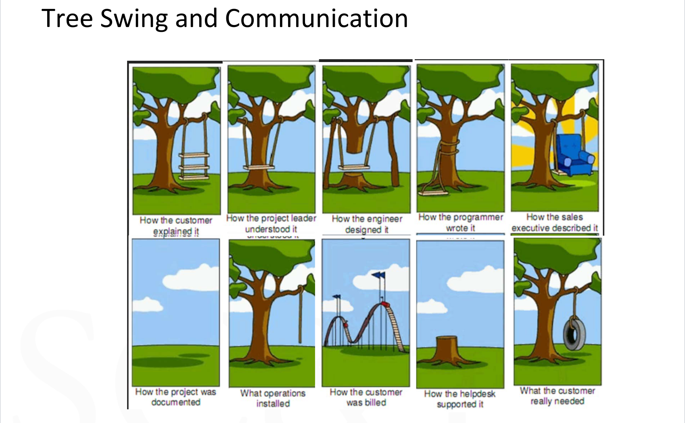

- Two individuals do not have the same frame of reference. (You are your own person)
- Communication fallacy.
	- Idea that the message that's being sent is the message being received. (Fallacy as the same message is interpreted differently based on your frame of referencce)
- Messages can thereby become:
	- Leveled
	- Condensed
	- Assimilated
	- Embellished

#### The Downward Communication Model:
- As the message travels down 5 levels of management.
- By the time it reaches the average worker, 80% of the message is lost.

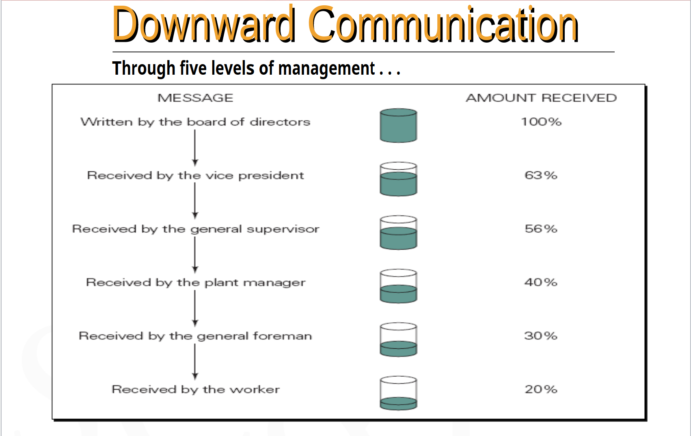

#### Communication Code:
- Language (verbal)
	- Spoken, or verbal code.
- Nonverbal code (visual)
	- Typically to people. visual messsages are very important.
	- eye contact, facial expressions, posture, etc.
- Paralanguage code (vocal)
	- tone, pitch, volume, or what you imply with how you say it.
#### Noise:
- Internal and external noise may affect how the message is received.
- Internal noise would be something like you thinking you want the class to be over interfering with what you hear.
- External noise would be something like construction occuring outside.

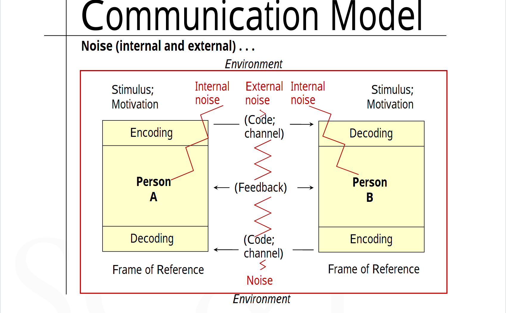

#### Plagiarism:
- New AI Policy:
	- Preponderance of  evidence (51% of paper is flagged)
- Streamlined process for adjudicating violations.
- Three level structure for violations.
- Faculty have more flexibility for level 1 violations.

##### The Violation Levels:
- Level 1 violations may occur as a result of inexperience  or  lack of malicious intent.
- Level 2 is major or essential portion of work done to meet course requirement. The student alleged to have commited the violation may have one or mroe previous violations.
- Level 3 can get you kicked out.

Video Submission 1:

Hi, my name is Ivan, and I am going to explain what communication means to me. To me, communication is a means of relaying information to people I care about. Communication occurs in many different ways. Perhaps the one most people use is through speech. Talking is a form of communication each of us uses on a daily basis. We exchange ideas, we exchange informations, details, and  exchange our lives through conversation. Text is another form of communication, and is also something each of us uses to convey ideas. Whether through social media messaging, or through books, print media, ebooks, and more, a common language unites our society with this form of communication. However, communication is more than what is just spoken or written, but can be visual in many regards. Pictures, a person's posture, facial expressions, artworks, these visual communication forms are just as integral to "communication". Communication is something that separates intelligent beings from those that are unintelligent. When scientists research animal intelligence, ascertaining a certain form of communication in a group of animals is one of the first things they do to establish if an animal is intelligent. In the most primitive sense, that is also what makes humans intelligent animals, which is that we have forms of communication which can range from being so primitive as gestures (universally accepted) to something so abstract as paintings and artworks which may express emotions less easily described through words.

## Communication Theories & Models

***Objectives:***
1) Identify the legacy and contemporary theoretical models of communciation and their evolution over time.
2) Differentiate between personal and scholarly theories.
3) Analyze the symbolic meaning of communication.

### Communication Theories:

#### Personal Theories:
- Everyday experiences
- Taken for granted
- Private
- Stable

(Example: Leaving to go to work at 7:45 latest because you know from experience  that if you leave at 7:50, you'll be stuck in traffic forever. You never did a research study, but you know from personal experience.)
#### Scholarly Theories:
- Based on facts
- Prone to change
- Public knowledge

#### *Theory*:
- "A coherent group of tested general propositions, commonly regarded as correct, that can be used as principles of expplanation and prediction for a class of phenomena."

#### *Models*:
- "A representation, generally in miniature, to show the construction or appearance of something."

### Legacy Models of Comm:

#### Aristotle's Model of Communication:
- Speaker
- Argument
- Speech
- Listeners
- Persuasive Effect
- One-way

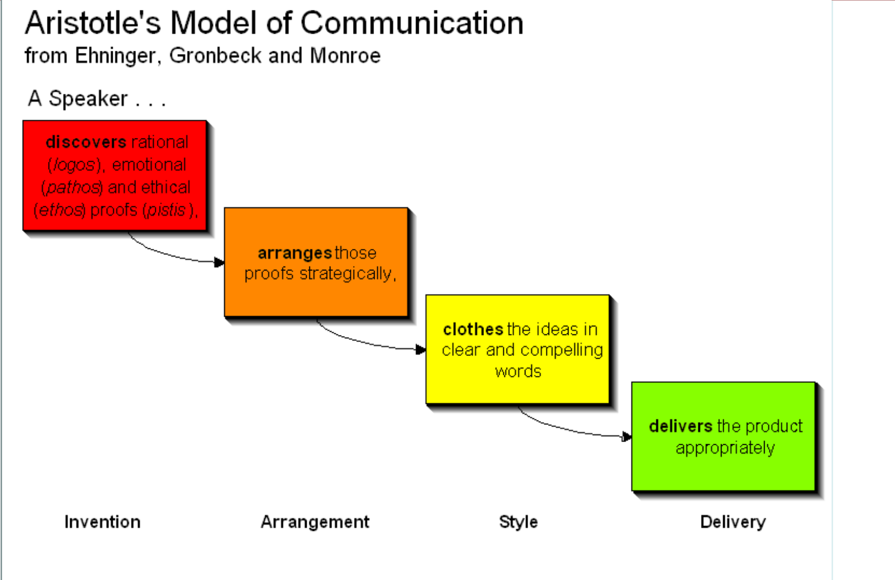

#### Laswell's Model (1948):
- You have the message, sent through a medium to a receiver to have some effect.
- Range of effects
- More options to communicate
- Still one-way.

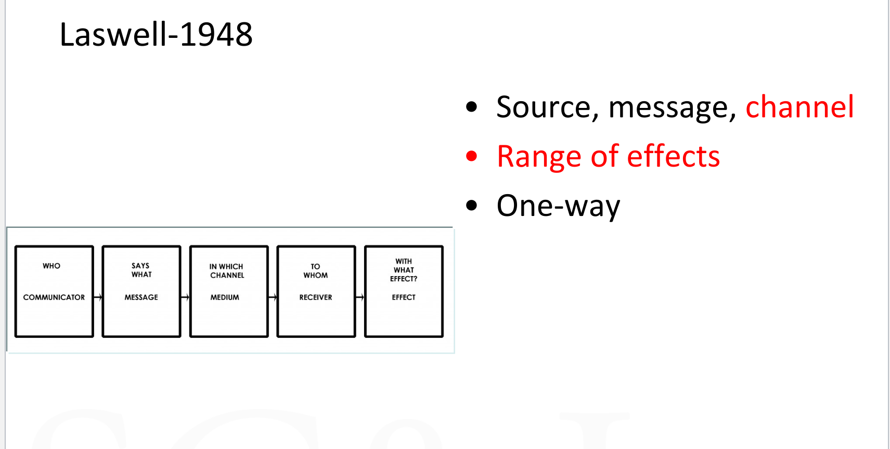

#### Shannon and Weaver Model (1949):
- Introduces the idea of noise
- Feedback
- Source
- Message, receiver
- Mostly one way still.

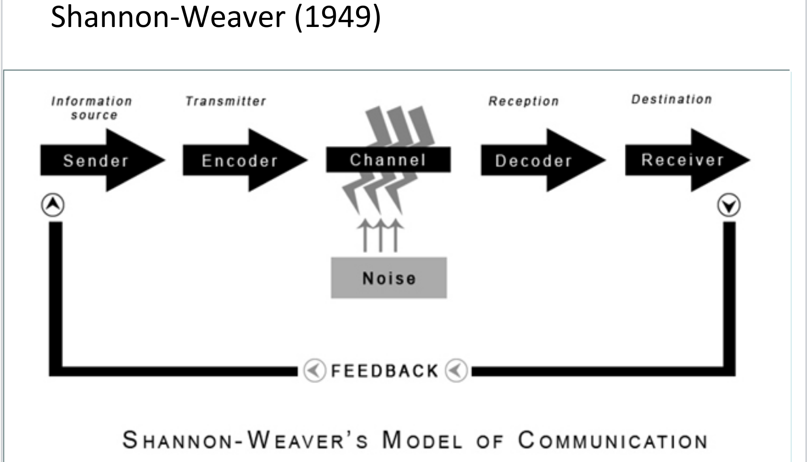

#### Scharamm Model (1954):
- Communication doesn't take place in isolation
- Field of experience (Viewpoint of the receiver)
- Message, receiver
- One-way still

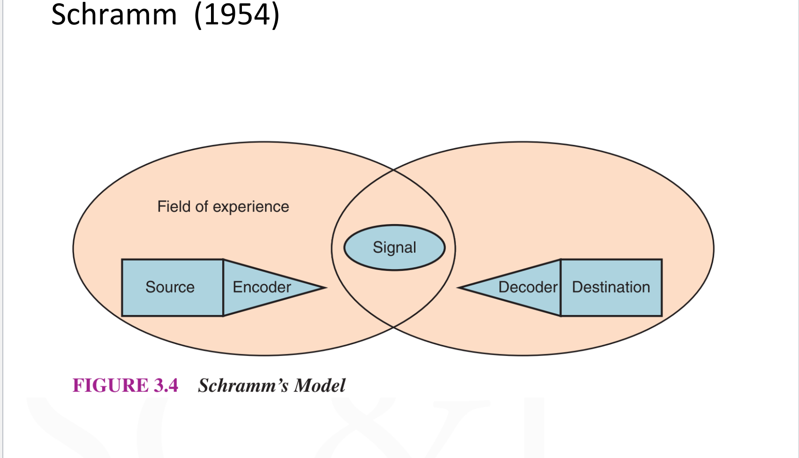

#### Katz & Lazarsfeld (1955):
- Mass media
- Within a group, we have the opinion leaders
- The opinion leaders help us make sense of the communicaiton
- It linked Interpersonal and mass communication
- Channel, message, receiver
- One way (mediated)

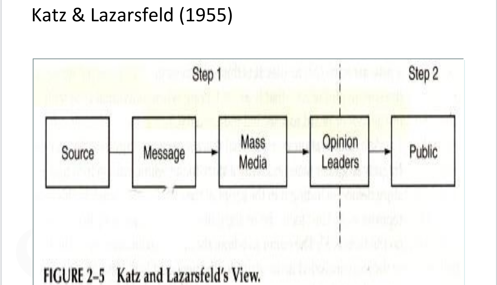

#### Westley & MacLean (1955):
- Communication doesn't start with sending a message, but the receiving of the message.
- Meaning
- Feedback
- Circular nature (Feedback)

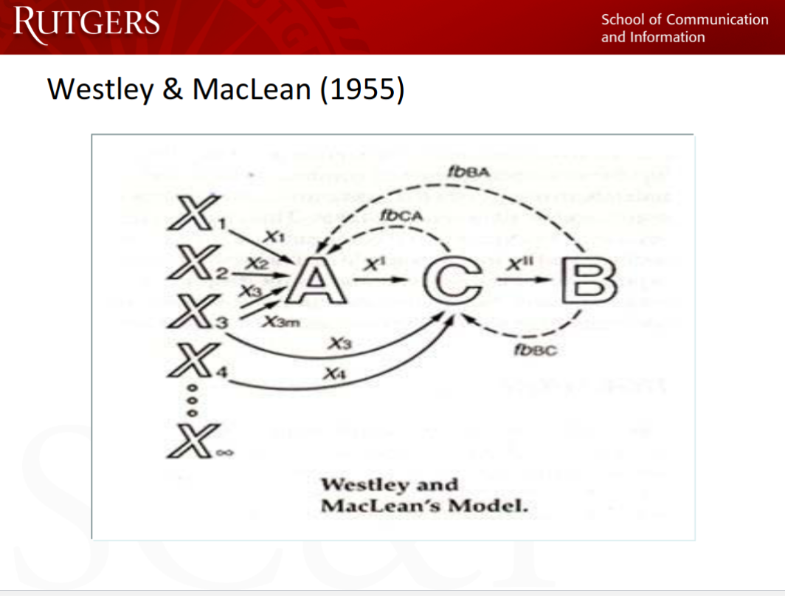

#### Thayer (1968):
- Focus on the dynamic nature of communication.
- Involves information processing and information dissemination.
- It illustrates communication being in a continuous flux until you receive a consistent message.

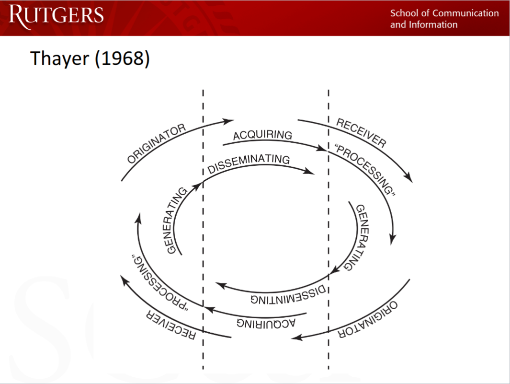

#### Devito Model (2003):
- Sender, receiver
- Bidirectional and interactive
- Distortion
- Feedback

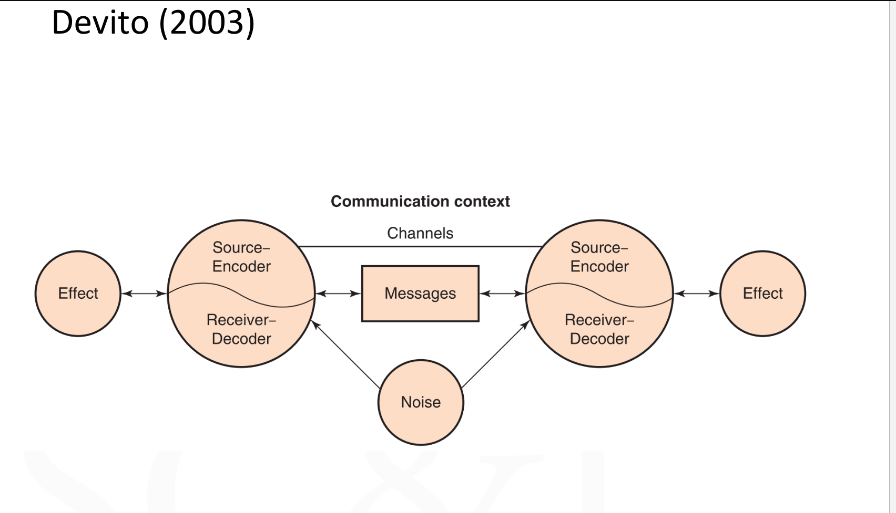

### Communication Paradigm:

Sender -> Message -> Receiver = Effect

### The Systems Perspective (Contemporary Model):
- Communication is part of a system.
- Communication is multidimensional, e.g. classroom, online.
- Multidirectional: Go through different directions, may be received fully intact or misreceived.
- Complex
- Messages can be intentional, but can also be uninitentional.(This is the main contribution)

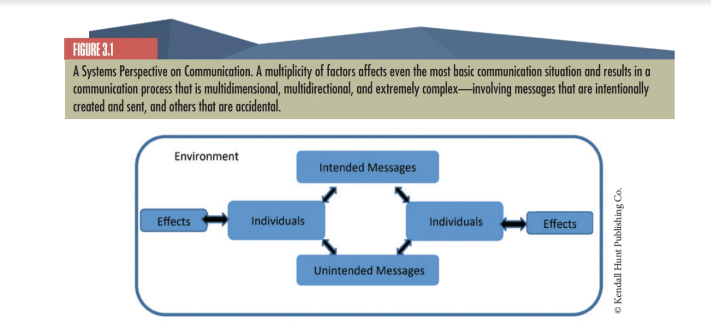

#### Animal Communication and humans:
- Communication to survive, to communicate emotions.
- Reproduction
- Form relationships, bonds, make friends, etc.
- Navigation, making sense of where to go.
- Self-defense
- Territoriality

Animals andhumans are *"open processes"*, meaning that they participate in continual give-and-take transactions with theiir environment.
- They create, gather and use information to interact with and adapt to their environment and its inhabitants through communication.

(Example: CATS VIDEO AWWWWWW)

### Communication as a Symbol System:

(The Communication Iceberg)

#### Communication Process, Visible and Invisible

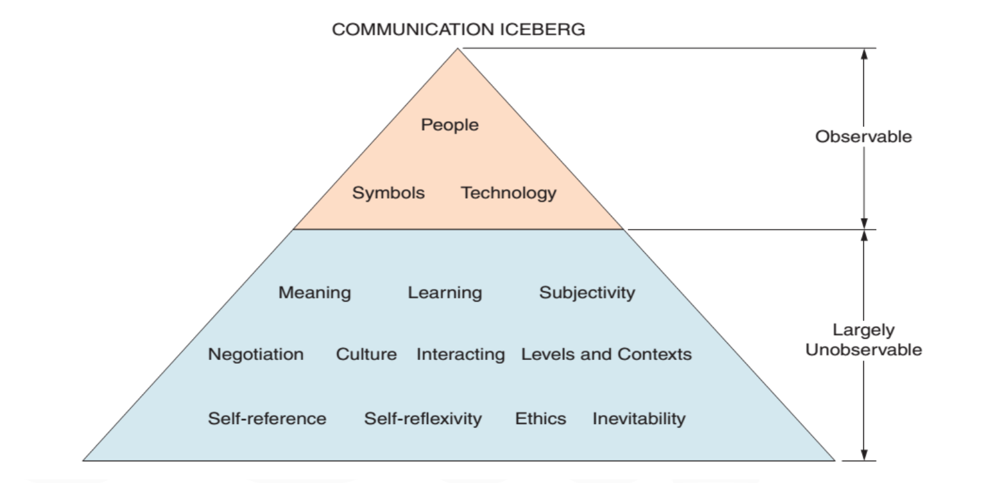

#### Scenes from the Movie

1. Sarcasm +1
2. Disrespect
3. Attitude
4. Mockery
5. The really hard slap on the back
6. The look of derision
7. The memo
8. Rifle sounds

## Perception and Verbal Code

### Functions of Language/Verbal Code
- Cooperation, interaction, persuasion and inoculation.

#### Communication Expectations
- **The perceived self**: The person you really beleive yourself to be.
- **The ideal or possible self**: The person you would like to be or might become
- **The expected self**: The person others expect you to be.

#### Self Fulfilling Prophecy
- We act in response to our expectations, taking steps toward fulfilling that expectation.
- Pygmalion effect
	- Positive
	- Negative

## The Perception Process

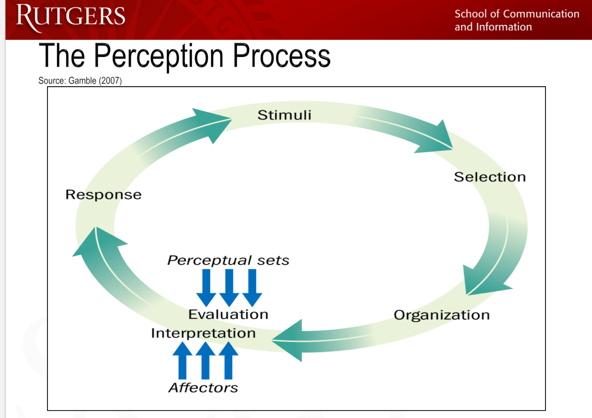

### Selection
- Based on the premise that in any environment there are certain things we pay attention to and disregard.
- Selective exposure: to expose ourselves to familiar situations. (News channels that support our beliefs)
- Selective attention: We can focus on some things and disregard the others.
- Selective perception: we tend to perceive or hear what we want to hear.
- Selective retention: we only retain certain information.

### Organization
- *Figure-ground principle*: we can tell which one we consider the background and foreground. 	
- *Closure*: image of incomplete circle, relates to next principle.
- *Perceptual constancy*: Perceiving new things in the same way.

### Evaluation and Interpretation
- Affectors: anything that can inflluence a response to a specific stimuli (ie. pictures and memories)
- **Memories**:
	- Short-term: basically what everyone does for exams.
	- Long-term: Core memory ong ong.
	- Semantic: Information we know based on generalized experiences. (ie. the sun rises every day)
	- Episodic: Things that are part of a specific event that happened in your life. (ie. biographies are full of episodic memories)

### Response:

**Perceptual Stimata**:
- Physical construct: how someone is built can affect how you respond.
- Interaction construct: if someone looks friendly, that affects how you respond.
- Role construct: if someone is a classmate or colleague, this affects how you interact with them.
- Psychological construct: if someone looks nervous or something. it's based on interpretation.

### Fundamental Attribution Error:
- Tend to overemphasize, as individuals, personal explanations to things that happen to others but deemphasize the personal factors that applied to our situation.
- Tendency to shift the blame.

### Stereotypes:

#### What are Stereotypes?

It is a predetermined opinion or generalization about a specific group of people based on what we've seen or heard.

#### How does stereotypes relate to our preception?

Stereotypes are a shortcut to the perception. Instead of making our evaluations objectively, we use the stereotypes to bolster our evaluations.

#### Connections Between Memory and Communnication
- Memory helps us recall the necessary info to interpret symbols
- Memmory is dynamic,  selective, and complex.

#### The Figure-Ground Principle
- The Figure-Ground Principle is the principle that people instinctively perceive objects a s either being in the foreground or the background.

### The Impact of Words

#### What is the difference between the following two questions?

1. Do you have any questions?
2. What questions do you have?

- The second one **implies** an expectation for questions whereas the first is unsure of whether there are questions.

#### 'To table the discussion'
- To some people it means to end the discussion
- To others, it means to discuss the subject right now, or to put it on the table.

### The Triangle of Meaning

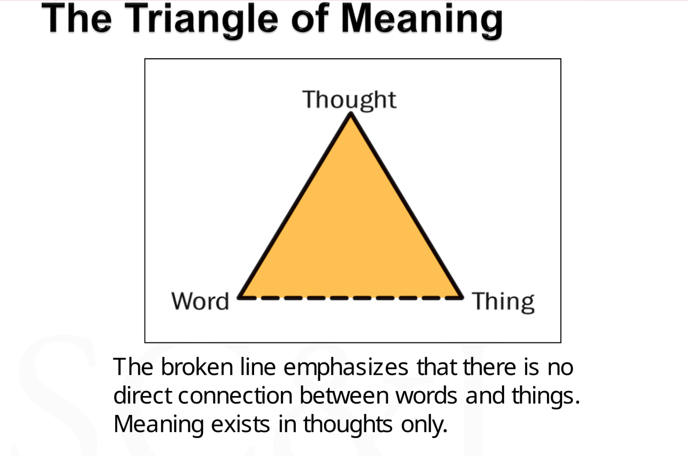

### Denotative vs Connotative Meanings
- Denotative meaning refers to a word's dictionary definition. Words have a limited number of denotative meanings.
- Connotative meanings are subjective. Words can have virtually limitless number of connotative meanings.

#### Language Acquisition & Rationale
- psycholingustic Approach
	- Personalized understanding of world
- Sociolingustic Approach
	- Language learned through social interaction.

The Key To know is: **What do we use language for??**
- Cooperation
- Interaction
- Persuasion
- Inoculation

#### The Sapir-Whorf Hypothesis
- "The real world is to a large extent unconsciously built up on the language habits of the group. NO two languages are ever sufficiently similar to be considered as representing the same reality. The worlds in which different societies live are distinct worlds, not merely the same world with different labels attached."
 - According to this hypothesis, language that we speak determines our reality and our viewpoint.
 - Gold standard for a long time.
	- Example: 'Table the discussion' is different in UK and the US.

The determinist:
- Believes that language determines reality because it conditions us to process experinece in a certain way.

The Relativist:
- Believes that lanugage influences, but does not determine thoughts and meanings.
- Currently what most Communcation experts believe right now.

The Nonbeliever:
- Does not believe language influences thought, citing translatability between languages and universals (such as grammatical structures common to all languages) to support their positions.)

#### Language and Gender

**Men use language to:**
- Achieve something or assert themselves
- Attract and keep an audience.
- Compete

**Women tend to use language to:**
- Relationship building
- Indicate that they are paying attention
- Collaborate

#### Offensive and Inoffensive Language

1. **Euphemisms** are words used in place of terms that some people might find offensive.

	- Passed away vs died
	- Used in order to avoid offending someone
2. **Emotive Language** conveys an oppinion or attitude about a subject.

	- Undocumented immigrant vs illegal immigrant
3. **"Politically correct language"** means different things to different people.

***Bypassing***:
- Bypassing occurs when two individuals miss each other's meaning because they are using equivocal language.

### The Revised Milgram Experiments
- Stanley Milgrim's original experiment explored whether ordinary humans could commit heinous acts.

## Interpersonal Communication

### Communication Styles

- Open communicator
- Closed communicator
- Determining whether a person is a open or closed communicator relies on feedback and self-disclosure.

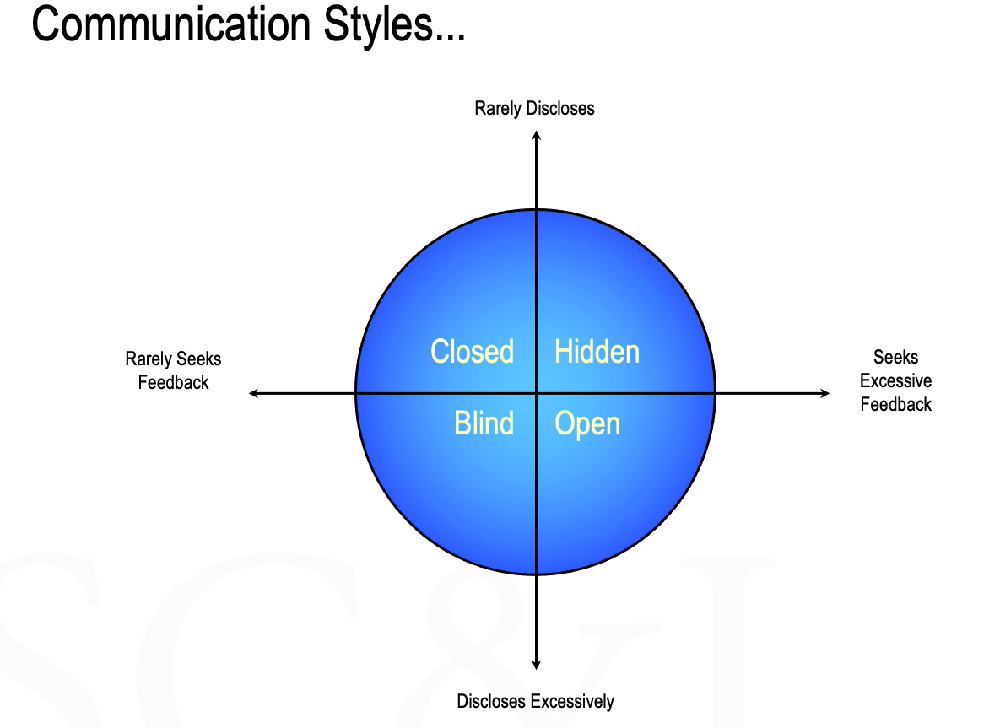

### Relationships

#### Rationale for relationships
- **Inclusion:** The need for a sense of mutual interest with others, for others to acknowledge us and want to know about us. Typically, it is this need that compels us to seek relationships.
- **Control:** The need for influence and power, for being in  charge, for others to respect our abilities.
- **Affection:** The need for a sense of reciprocated love, to know that someone still loves you when you are not at your worst.

***Another model that helps us Define Relationships***:
#### The Onion Model

- Breadth: Refers to the number of topics that you can discuss with someone.
- Depth: The quality of that discussion regarding the topics.

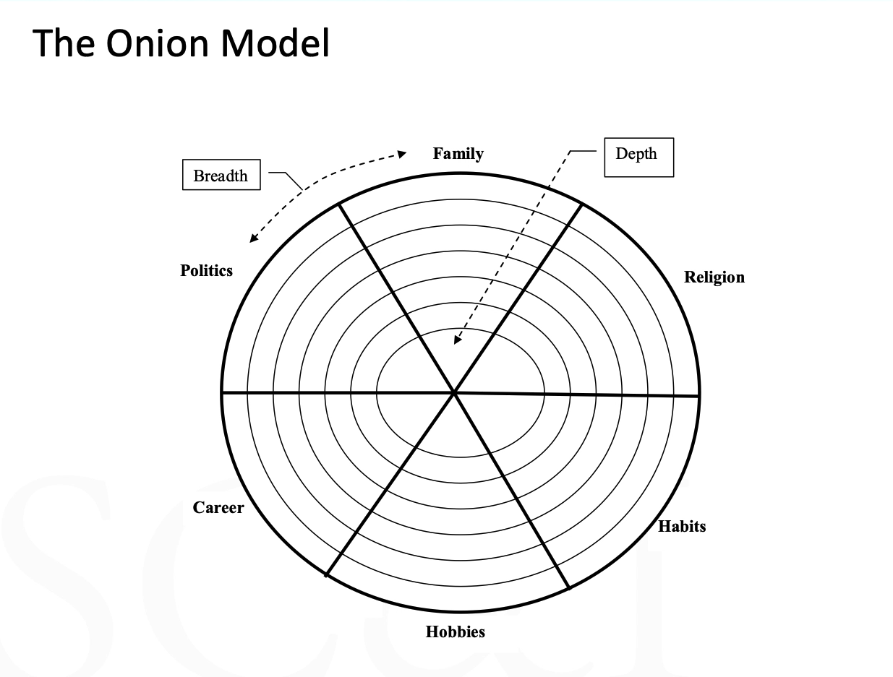

#### The Importance of Reciprocity
- Relationships are always reciprocal.
- The return of openness from one person to another.

The **Cost Benefit Theory**:
- We will work to continue a relationship only as long as the benefits outweigh the costs.

**Perceived relationship reward** - **Perceived relationship costs** = **perceived relationship benefit**

#### Defining Conflict:
- The interpersonal process that occurs whenever the actions of one person interfere with the actions of another.
- You can not avoid conflicts, only learn to manage it.

## Nonverbal Communication

#### Types of Nonverbal communications include:
- Facial expressions and eye contact
- Body movements and gestures - Kinesics/Haptics
- Clothing and appearance
- Distance and personal space - Proxemics
- Physical environment
- Time - Chronemics

### Movements and Gestures
- Emblems: nonverbal movements that translates to a very clear verbal meaning.
- Illustrators: Using gestures to reininforce verbal messages. (Such as pointing in a direction when directing someone to a place.)
- Regulators: Nonverbal cues that affect the conversation. (Such as leaning forward in the meeting)
- Adaptors: Nonverbal cues we use when we're nervous. (Tapping your leg, playing with your pen, etc.)

### Clothing and Appearance
- Determines credibility, persuasiveness, status & hiring decisions
- Affects public perception
- Is problemattic (i.e., Casual Confusion Syndrome)

### Distane and Personal Space

Hall's Distance Categories:
- Intimate distance: contact - 18 inches
- Personal distance: 18 inches - 4 feet
- Social Distance: 4-12 feet
- Public distance: 12 feet or more

### Physical Environment
- Ugly versus attractive
- Color and lightning
- Room size
- odor
- Noise level
- Ergonomics

### Time
- Most business conducted on informal level
- Status determins sequences of lateness
- Time spent signals significance
- Perceptions of time depend on cultural background.

#### Self: The Johari Window
- Tells us how we withhold information from others to give us more power.

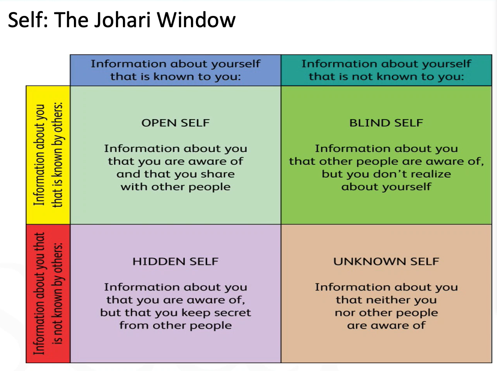

#### Power in Relationships:
- Reward Power (Your boss giving you a raise for doing well)
- Coercive power (Your boss threatening to fire you if you don't do well)
- Legitimate power (Your boss having the authority to fire you)
- Expert power (Your professor having the knowledge to teach you)
- Referent Power (Your professor being a well-known professor)
- Persuasive power (Your professor being able to convince you to do well in the class)

#### The Competencies to determine Emotional Intelligence:
- **Self-awareness:** The ability to recognize your own feelings and emotions.
- **Self-management:** The ability to control your own feelings and emotions.
- **Motivation:** The ability to be self-motivated and to motivate others.
- **Empathy:** The ability to understand the feelings of others.
- **Social skills:** The ability to communicate effectively with others.

#### The Triangle of Love - Robert Sternberg:
- **Passion:** The intense emotional and physical attraction that we feel for another person.
- **Commitment:** The decision to stay in a relationship.
- **Intimacy:** The emotional closeness that we feel for another person.

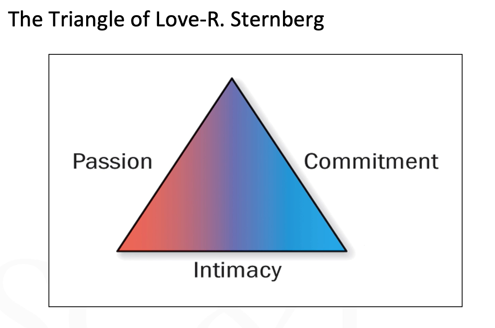

## Intercultural Communication

#### What is Culture in Communication?
- Complex combination of common symbols, knowledge, folklore, customs, language, information processing patterns, rituals, habits, and other behavioral pattern that link and give a common identity to a particular group of people at a particular point in time.

It can be:
- A symbol
- A frame of reference
- National origin
- Heritage
- Set of traditions

Characteristics of Culture:
1) Complexed/ multifaceted
2) Invisible
3) Subjective
4) Subject to change

### Culture, Power and Communication
- Persons from **high-context culture** tend to be more indirect in their communication, so the context of the communication is more important than the actual words used.
- They value politeness.
- Rely on nonverbal, contextual cues.
- Are often concerned with face-saving and are unlikely to publicly criticize others.

Persons from **low-context culture** tend to be more direct in their communication, so the actual words used are more important than the context of the communication.
- Value assertion and directness.
- Asks direct questions in a effort to get to know otheres and do not hesitate to speak out about themselves.
- Are seldom concerned with face-saving.

#### Cultural Adaptation (Shock)
- Phase 1 **Honeymoon:** The initial excitement of being in a new culture.
- Phase 2 **Frustation:** The realization that the new culture is not as easy as it seemed.
- Phase 3 **Readjustment:** The process of adapting to the new culture.
- Phase 4 **Resolution:** There are four outcomes, "full participation", "accommodation", "separation", and "rejection".

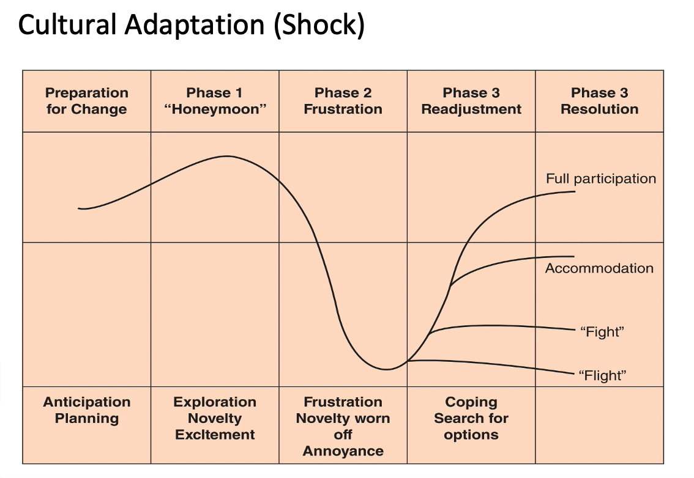

#### McLuhan's Global Village
- We will be using communication tools to unite the world into something like a "village".

We are more like **The `local` village**.

## Group Communication

A-Type Conflict:
- Occurs when relationships/trust are weak
- Sidetracks team from issues
- Creates defensiveness and anger

C-Type Conflict:
- Occurs when relationships/trust are strong
- Members are willing to discuss issues
- Ground rule "Ideas are not personal attacks"
- Creates feeling of satisfaction
- Improves team performance

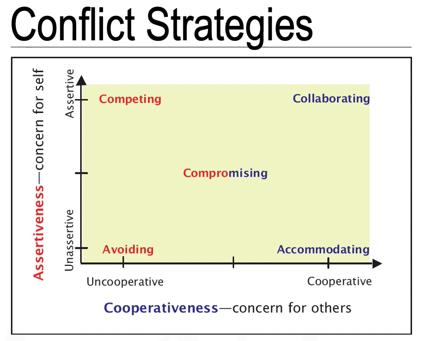

#### Tuckman's Team Development Model
- In a group there are certain tasks and certain behaviors to look for.
- Depending on what each group is able to produce shows what level they are on.
- Very few groups are able to reach the final stage.
- The four stages are:
  - Forming (Getting to know each other)
  - Storming (Dealing with conflict)
  - Norming (Establishing ground rules)
  - Performing (Working together)

#### Trait Theory of Leadership
- Ambitious
- Trustworthy
- Motivated
- Self-confident
- Knowledgeable
- Creative

#### Functional Theory of Leadership
- Any person can be a leader for the duration of a task.

#### Three-Dimensional Theory
- Autocratic leadership: Leader decides, no votes
- Democratic leadership: Leader decides, votes
- Laissé-faire leadership: Leader lets group decide, takes really long to make decisions.

#### Situational Contingency Theory
- The best leadership style depends on the situation.
- Leadership depends on:
  - Leader-member relations
  - Position of power
  - Task structure

#### Transformational Leadership
- Leaders who inspire followers to transcend their own self-interests for the good of the group.
- Articulates a vision
- Provides plan for achieving vision
- Mobilize commitment

### Organizational Communication
- Direction of communication
- Style of communication (Formal vs informal)
etc.

#### Formal Communication
- Communication that is planned and structured.
- Downward communication: From management to employees.
- Upward communication: From employees to management.
- Horizontal communication: Between employees at the same level.

#### Informal Communication (Grapevine)
- Communication that is unplanned and unstructured.
- Indicates the health of the organization.
- Adds to the employee satisfaction and commitment.
- Indicates employee concerns
- Is 75-90% accurate
- Travels fast
- Example: Our Facebook group, because it's informal and takes place outside of the classroom.

#### Obstacles to Organizational Communication:
- Communicator anxiety
- Inadequate preparation
- Vague instructions
- Jumping to conclusions
- Bypassing
- Harrasement
- Communication technology

Human Relations Model:
- Supportive, but mostly downwards
- Employees need to be treated with Trust, Respect, and Fairness
- etc

Human Resources Model:
- Aka "Theory Y"
- Team based model
- Information and feedback flow freely up & down

Systems Contingency Model:
- Aka "Theory Z"
- The best model is the one that works best for the organization
- Communication flexibility is valued
- Requires communication skills at all levels.

Transformational Model (Newest):
- Two types: Virtual and Multiunit.
- Horizontal Communication is essential
- Upward and downward comunication is used
- Awareness of frame-of-reference

Virtual Organization:
- Two or more organizations that are linked by technology.
- Example: Apple collaborating with Samsung to deliver the first iPhone.

---

## PR/ Advertising
- PR functions/ definitions and areas of activity.
- Crisis management.
- Spin control.
- Advertising evolution and trends
- Advertising pros and cons.
- Advertising ethics.
- Advertising regulations.

PR (Public Relations) Defined:
- "... the art and science of analyzing trends and predicting their effects on the organization and its relationship to the public."

Places it's used:

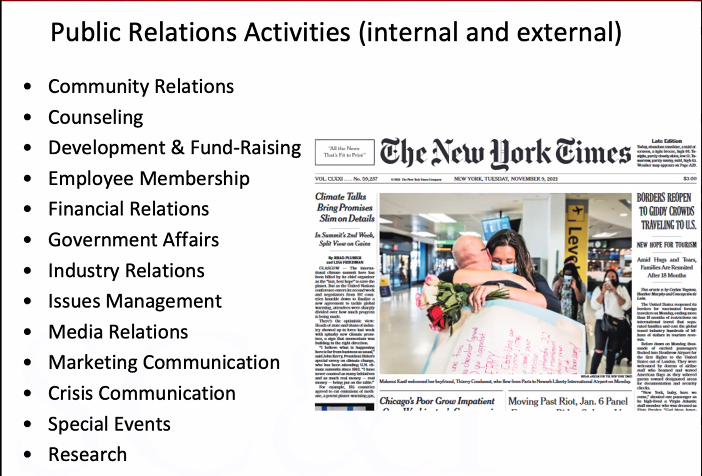

Spin Control:
- The process of managing the flow of information to the public in order to control the public's perception of an organization.

Spin Techniques:
- Selectively leak information in advance of a crisis, hoping reporters will pay more attention to the leak than to the crisis.

Crisis Communication:
- "A reputational threat to operations that can have negative consequences for the organization if not handled properly."
- Three Approaches to Crisis Communication:
- Corporate Apologia:
  - Denial
  - Apology
  - Explanation
- Image Repair/Restoration:
  - Acknowledge the problem
  - Explain the problem
  - Explain the solution
- Situational Crisis Communication (Most contemporary approach):
  - Matching the response to the crisis.

### Crisis Communication Theory:
- The Crisis Communication Theory (CCT) is a model that explains how organizations should respond to a crisis.

#### Why is it important?
- Crises are inevitable and organizations need to handle these crises to survive.
- These companies will provide reasons why the crisis occurred and how they will fix it.
- (ETC.)

### Organizational Crisis Definition:
- A specific, unexpected, and non-routine series of events that create high levels of uncertainty...

#### Discourse of Renewal:
- Discourse of renewal adds to crisis communication by moving beyond image repair to stakeholder engagement.

Four components of the discourse of renewal:
- Organizational Learning
- Ethical Communication
  - Open and transparent communication
- Prospective Vision
  - Future-oriented outlook
- Engaged Organizational Rhetoric
  - Telling a specific interpretation about the crisis and how the organization moves forward.

#### Avertising and Radio:
- 'Free' radio
- Advertising takeover.

#### Advertising and Television:
- Parity Productions
  - **Unique Selling Proposition (USP):** The one thing that makes your product different from all the others.

### Advertising Effects:

**Pros:**
- Advertising supports our economic program.
- People use advertising to gather information.
- Ad revenues make the "free" mass media possible
- Advertising increases national productivity and improves the standard of living.

**Cons:**
- Advertising is intrusive.
- Ads are deceptive.
- Advs exploit children.
- Advertising demeans and corrupts culture.
- **AIDA approach** - Attention, Interest, Desire, Action
- **Cosumer culture** - A culture in which personal worth and identity reside in the products which we surround ourselves.

### Advertising Regulations:
- Ads are regulated by the Federal Trade Commission (FTC).
- The FTC can issue a cease and desist order ordering the creation and distribution of a corrective statement.
- The FTC allows a certain amount of puffery.
- An ad is false if it:
  - Lies outright.
  - Does not tell the whole truth.
  - Lies by implication, words, or meanings.

Determining the Advertising Rate (TV):
- The rating of the TV show.
- The share of households watching a program.

## Final Challenge Contents
- Organizational communication
- Mediated/Mass communication
- Advertising/Public relations
- Public Speaking
- Interviews
- **Videos** are critical.
	- They are all video/ scenario based on the finals.

---

## Public Speaking
- Types of presentations
- Persuasion variables
	- What makes someone persuasive.
- Organizational Patterns
- Devlivery methods and visuals

Public Speaking as a Dynamic Process
- When speaking in person and synchronously, you get audience feedback.

Types of Presentations:
- Informative
	- In order to teach
- Persuasive
- Special Occasion
	- (I.E.) : Commencement, wedding, funeral.

#### Organizational pattern
- Arrangement of main points of the presentation.
- Informative presentations are usually structured as:
	- Chronological
	- Topical
	- Spatial
- Persuasive presentations are usaully:
	- Cause and effect
	- criteria-satisfaction
	- motivated sequence

### Persuasive Factors
- Evidence and logic (Logos)
- Psychological Needs (Pathos)
- Credibility of Speaker (Ethos)
- Opinion of **key** people

### Delivery Methods
- Speaking from memory
- Extemporaneous speaking
	- Speaking from the heart or done without preparation.
- Speaking from visuals (Using slides as a guide)
- Speaking from manuscript (Entire presentation is written out)
- Impromptu speaking  (Related to extemporaneous speaking)

**The importance of visuals**:

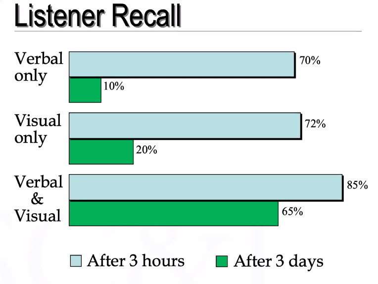

<b style="color: red">nterviews Unit is the most important damn unit!!!i</b>

## Interviews
- Types of interviews
- Types of questions
- Structure and format of the interview
- Lawful and unlawful questions
- **Strategies for succeeding in an interview scenario**

---

### Preparing for Interview
- Have a positive attitude
- Dress for the occassion
	- Create a positive impression and image

### Strategies for Impression Management
- Speaking rapidly and forcefully
- Etc

### Interviewer Responsibilities
- Contact interviewee before interview
- Plan the environment
- Asking questions that are lawful
- Etc

### Lawful Questions
- All questions must be job-related. (Ability to complete the job)
- The same basic questions must be asked of all applicants.

#### Arrest/Conviction
- There is no law against asking for arrest or conviction records in an interview. However, the employee should be given the opportunity to explain their explanation and the interviewer can determine if that is valid.
