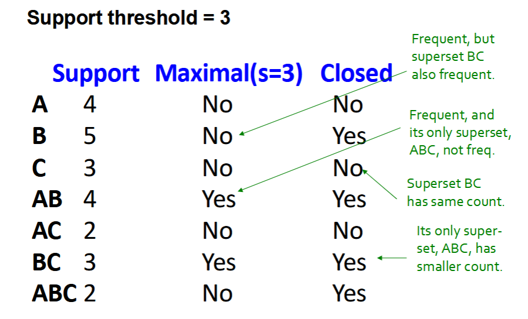
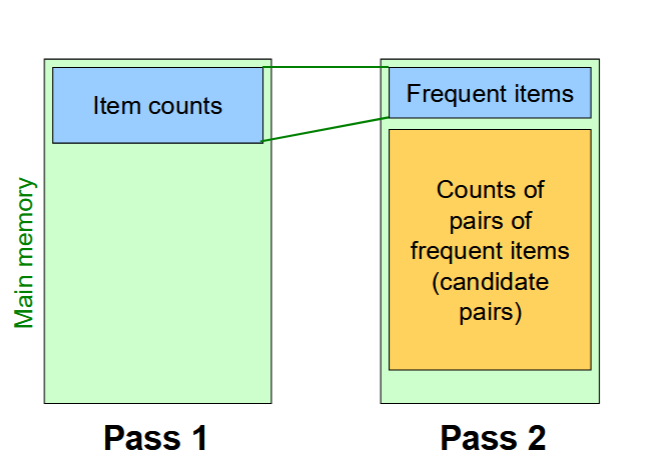
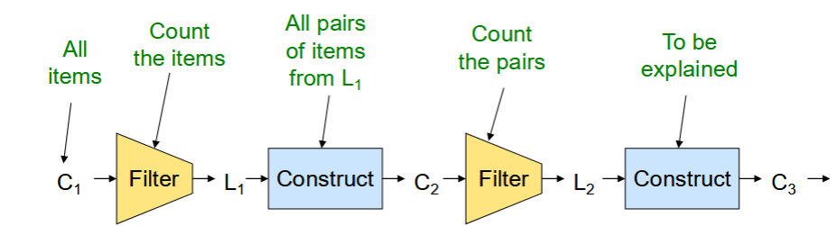

# Frequent Itemsets

## Frequent Itemset Mining & Association Rules

> Understand whole process

### Association Rule Discovery

***Supermarket shelf management example*** - Market-basket model:

- *Goal:* Identify items that are bought together by sufficiently many customers.
- *Approach:* Process the sales data collected with barcode scanners to find dependencies among items.
- *A classic Rule:* If someone buys diaper and milk. then he/she is likely to buy beer.
	- Don't be surprised if you find six-packs next to diapers!

#### The Market-Basket Model
- A large set of *items*
	- e.g. things sold in a supermarket.
- A **large set** of *baskets*
- Each basket is a *small subset of items*
	- e.g. the things one customer buys on one day
- Want to discover ***association rules***...
	- People who bought `{x,y,z}` tend to buy `{v,w}`
	- e.g. Milk -> Coke / Diaper, Milk -> Beer

#### Applications

##### 1
- Baskets = sentences, Items = documents containing those sentences.
	- Items that appear together too often could represent plagiarism.
	- Notice items do not have to be "in" baskets
		- You only need to know each item belongs to which basket(s)

##### 2
- Baskets = patients, Items = drugs and side-effects
	- Has been used to detect combinations of drugs that result in particular side-effects
	- *But requires extension:* Absence of an item needs to be observed as well as presence.

##### 3 - Bipartite Graph
- Finding communities in graphs (e.g. twitter)
- Baskets = nodes, Items = outgoing neighbors
	- Searching for complete bipartite subgraphs $K_12$.

### Frequent Itemsets
- **Simplest question:** Find *sets of items* that appear together "*frequently*" in baskets.
- **Support:** for itemset *I*: Number of baskets containing all items in *I*.
	- Often expressed as a fraction of the total number of baskets.
- Given a *support threshold* `s`, then sets of items that appear in at least `s` baskets are called *frequent itemsets*.

#### Example
- Items = {milk, coke, pepsi, beer, juice}
- **Support threshold** = 3 baskets

#todo find the baskets

- Frequent itemsets: {m}, {c}, {b}, {j}, {m,b}, {b,c}

### Confidence and Interest

#### Example

## Association Rules

- `{m,b} -> c`
- If-then rules about the contents of baskets.
- ${i_{1},i_{2},...,i_{k}} → j$ means: "if a basket contains all of $i_{1}, ...,i_{k}$ then it is *likely* to contain `j`"
- In practice, there are MANY rules. 
- *Confidence of this association rule is the probability of `j` given* $I={i_{1},...,i_{k}}$ 

$$conf(I→j)=\frac{support(I ∪ j)}{support(I)}$$

#### Mining Association Rules

- **Step 1:** Find all frequent itemsets `I`
- **Step 2:** *Rule Generation*
	- For every subset `A` of *I*, generate a rule `A → I \ A`
	- Since `I` is frequent, `A` is also frequent.
	- *Variant 1:* SIngel pass to compute the rule confidence.
		- `confidence(A,B→C,D) = support(A,B,C,D)/support(A,B)`
	- *Variant 2:*
		- **Observation:** If `A,B,C→D` is below confidence, so is `A,B→C,D`
		- Can only generate "bigger" rules from smaller ones!

> Output the rules above the confidence threshold.

#### Compacting the Output
- To reduce the number of rules we can post-process them and only output:

##### Maximum Frequent Itemsets
- No superset is frequent.
	- e.g "{A,B,C} is more frequent" is more informative than "{A,B} is frequent."
		- This is because by saying {A,B,C} is more frequent, you are already saying {A,B} is frequent.
- Gives more pruning.

##### Closed Itemsets
- No superset has the same count.
- e.g. *All supersets are less frequent*
	- But supersets can still be frequent.
- Stores not only frequent information, but exact counts.

##### Example: Maximal/Closed



### Itemsets: Computational Model

- *Back to finding frequent itemsets*
- Typically, data is kept in *flat files* rather than in a database system:
	- Stored on disk
	- Stored *basket-by-basket*
	- Baskets are *small* but we have many baskets and many items.
		- *Exapnd baskets into pairs, triples, etc* as you read baskets.
		- Use `k` nested loops to generate all sets of size `k`.

---

- You are trying to process massive datasets, but are only able to read the data sequentially from a disk as the boundaries are separated by `-1` or something.
- Each location in memory has an address, allowing you to directly access that memory through the use of pointers. (RAM)
- If you want to read data from the disk, you must read it sequentially. (Still the case with SSDs, but SSDs are something called "block random access")

> This is why we need algorithms that can analyze these frequent itemsets in the *least* passes possible.

---

### Naive Algorithm

- *Naive approach to finding frequent pairs*
- Read file once, counting in main memory the occurrences of each pair:
	- From each basket of `n` items, generate its `n(n-1)/2` pairs by two nested loops
	- E.g., Illustrate the process by counting the pairs with two basket `{A,B,C}` and `{A,B,D}`

**Fails if `O(# items²)` exceeds main memory**

- Remember: # of items can be 100k (Walmart) or 10B (Web pages)
- Suppose 10⁵ items, counts are 4-byte integers
- Number of pairs of items: $10^{5}\frac{10^{5}-1}{2}=5*10^{9}$
- Therefore, `2*10⁵` (20 jigabytes) of memory needed.

#### Main-memory Bottleneck
- For many frequent-itemset algorithms, main-memory is the critical resource.
	- As we read baskets, *we need to count something*, e.g., occurrences of pairs of items.
	- The *number of different things we can count* is limited by main memory.
	- *Swapping counts in/out* is a disaster.
		- Randomly reading/writing disk is very time consuming.

> A *naive memory-based* algorithm would not work.


### Counting Pairs in Memory
- **Approach 1:** Count all pairs using a matrix

...

## A-Priori Algorithm

> For generating *frequent **pairs*** of elements.

### Computational Model

- In practice, association-rule algos read the data in *passes* - all baskets read in turn.
- **Algorithms may read the data for multiple passes**
- The true cost of mining massive disk-resident data is usually the *number of disk I/Os*
- We measure the cost by the *number of passes* an algo makes over the data.

---

The *A-Priori Algo* is a *two pass approach* that limits the need for main memory.

### Key Idea
- If a set of items `I` appears at least `s` times, so does every subset of `J` of `I`
- **Contrapositive for pairs**:
	- If item `i` does not appear in `s` baskets, then no pair including `i` can appear in `s` baskets.
- **So, how does A-Priori find frequent pairs???**

---

### Steps

#### Pass 1
- Read baskets and count in main memory the occurrences of each *individual item*.
	- *Requires only memory proportional to # of items*
- Items that appear >= `s` times are the frequent items.

#### Pass 2
- Read baskets again and count in main memory *only* those pairs where both elements are frequent (from pass 1)
	- Requires memory proportional to O(# frequent-items²) only (for counts)
	- Plus a list of the *frequent items* (so you know what must be counted)



### Frequent Triples & More
- For each `k`, we construct two sets of *k-tuples* (sets of size `k`):
	- $C_k$ = *candidate k-tuples* = those that might be frequent k-tuple sets (support >= s)
		- Based on info from the pass for `k-1`
	- $L_k$ = the set of truly frequent *k-tuples*



### Summary
- One pass for each `k` (itemset size)
- Needs room in main memory to count each candidate *k-tuple*
- For typical market-basket data and reasonable support (e.g. 1%) `k=2` requires the most memory.

#### Many Possible Extensions
- Associative rules with constraints:
	- Users over 65 have 2 cars.
- Associative rules when items are in a taxonomy
	- Bread, Butter → Apple jam, strawberry jam
	- Bread, Butter → Fruit jam
- Dynamically lower the support `s` as itemset gets bigger.

## PCY (Park Chen Yu) Algorithm
- **Observation:** In pass 1 of A-Priori, most memory is idle.
	- We store only individual item counts.
	- Can we use the idle memory to reduce the memory required in pass 2?
- *Generate pairs on the fly* and create hash tables.
	- Needs a deterministic hash function.
		- *Deterministic*: Consistent hashing, which means each item will be hashed to the same place every time.


```
FOR (each new basket):
	FOR (each item in the basket):
		add 1 to item's count;
	FOR (each pair of item):
		hash into hash table;
```
### Pass 1 of PCY
- In addition to 

### Between Passes of PCY

How do we reserve memory for pass-2?

- Replace the buckets by a *bit-vector*:
	- `1` means the bucket count exceeded the support threshold `s`, (call it a frequent bucket); `0` if it did not.
- 4-byte integer counts are replaced by bits, so the bit-vector requires 1/32 of memory.
- Also, decide which items are frequent and list them for the second pass.

### Pass 2 of PCY

- Count all pairs that meet the conditions for being a *candidate pair*:
	- Both `i` and `j` are frequent items.
	- The pair of `{i,j}` hashes to a bucket whose bit in the bit vector is `1` (ie. a *frequent bucket*)

**Both conditions are necessary for the pair to have a chance of being frequent.**

## Refinement: Multistage Algorithm

- In the past ones, (PCY), we only used 1 hash table. Each hash table helps us to eliminate some pairs that are not frequent.

#todo get photo from slides
## Refinement: Multihash Algorithm

- Another version is called multihash, using several *independent* hashes.
	- Split memory into two parts and create two independent hash tables with different hash functions.

### Problem
- Due to the smaller size of the multihash algorithm, there would be more colllisions.

## Random Sampling