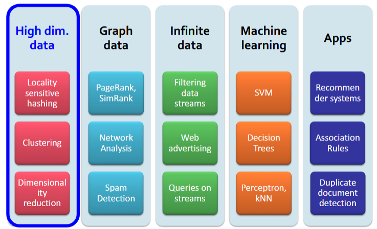
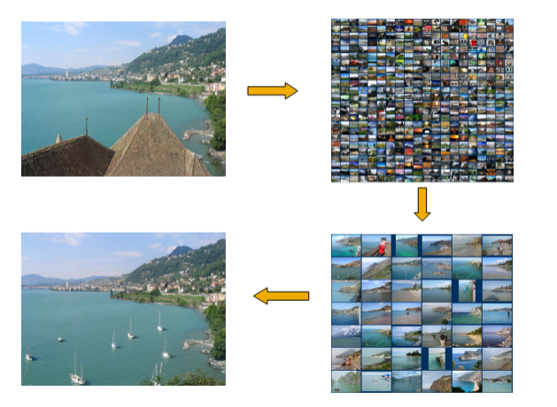
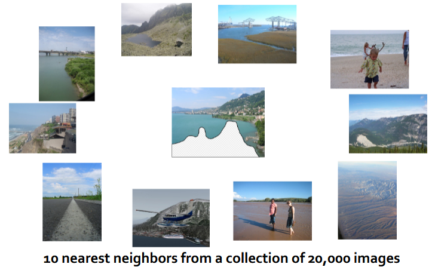
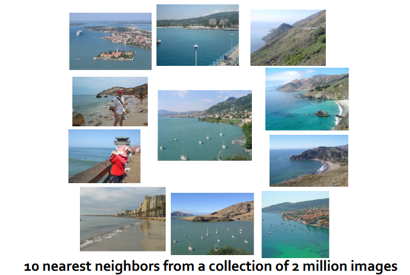
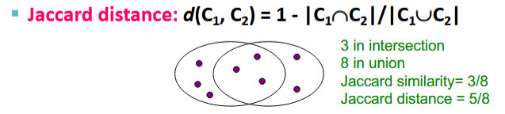
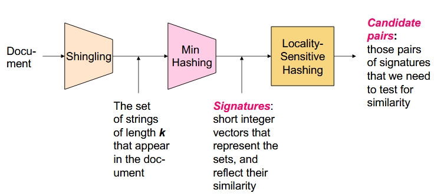
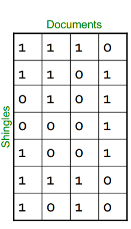
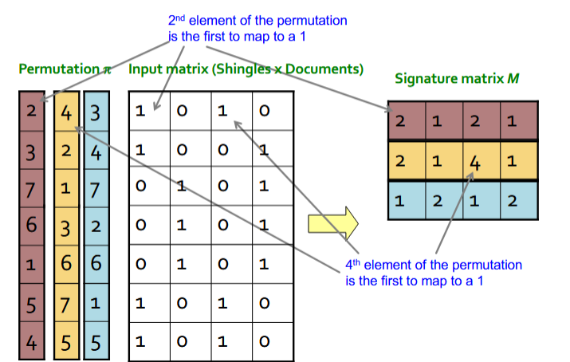
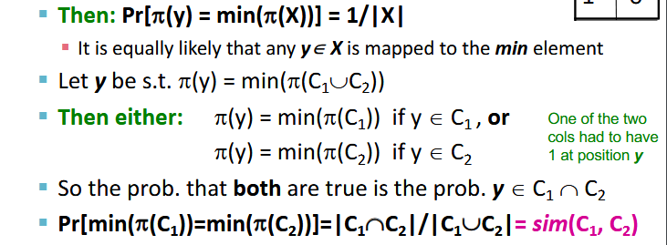
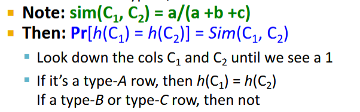

---
tags:
  - data-sci
  - cs
---
# Locality Sensitive Hashing

## Finding Similar Items: Locality Sensitive Hashing

##### New Thread: High Dim. Data

### Scene Completion Problem

- Taking the first image, replace the rooftops...

> With less data points, the nearest neighbors do not match well.

> With more data points, the image is able to be generated.

#### A Common Metaphor
- Many problems can be expressed as finding "similar" sets:
	- Finding near-neighbors in *high-dimensional* space.
- **Examples:**
	- Pages with similar words
		- For duplicate detection, classification by topic.
	- Customers who purchased similar products
		- Products with similar customer sets.
	- Images with similar features
		- Users who visited similar websites.

----

### Problem For Today's Lecture
- **Given**: High dimension data points `x₁, x₂, ...`
	- For example: Image is a long vector of pixel colors

$$\begin{bmatrix} 1 & 2 & 1 \\ 0 & 2 & 1  \\ 0 & 1 & 0 \end{bmatrix} → \begin{bmatrix}1 & 2 & 1 & 0 & 2 & 1 & 0 & 1 & 0 \end{bmatrix}$$

- And some distance function `d(x₁,x₂)`
	- Which quantifies the "distance" between `x₁` and `x₂`
- **Goal:** Find all pairs of data points `(xᵢ,xⱼ)` that are within some distance threshold `d(xᵢ,xⱼ) ≤ s`
- **Note:** Naive solution would take `O(N²)` where N is the number of data points.
- **Magic!** This can be done in `O(N)` time! How??

## Finding Similar Items

##### Distance Measures
- **Goal:** Find near-neighbors in high-dimension space.
	- We formally define "near neighbors" as points that are a "small distance" apart.
- For each application, we first need to define what "distance" means.

##### Jaccard Distance/Similarity
- The **Jaccard similarity** of two *sets* is the size of their intersection divided by the size of their union: `sim(c₁,c₂) = | c₁ ∩ c₂ | / | c₁ ∪ c₂ |`

#### Task: Finding Similar Documents
- Goal: Given a large number (N in the millions or billions) of documents, find "near duplicate" pairs.
- **Applications:**
	- Mirror websites, or approximate mirrors
		- Don't want to show both in search results.
	- Similar news articles at many news sites.
		- Cluster articles by "same story"
- **Problems:**
	- Many *small pieces* of one document can appear *out of order in another*.
	- *Too many documents* to compare all pairs.
	- Documents so large or so many that they cannot fit into *main memory*.

#### 3 Essential Steps for Similar Docs
1. *Shingling:* Convert documents to sets.
2. *Min-Hashing:* Convert large sets to short signatures, while preserving similarity.
3. *Locality-Sensitive Hashing:* Focus on pairs of signatures likely to be from similar documents.
	- Candidate pairs!

##### The Big Picture: Bloom Filter

## Shingling

> Convert documents to sets

- **Simple approaches:**
	- Document = set of words appearing in document
	- Document = set of "important" words
	- Don't work well for this application. Why??
- Need to account for ordering of words!
- A different way: Shingles!

---
##### Define: Shingles
- A `k-shingle` or (`k-gram`) for a document is a sequence of `k` tokens that appears in the doc.
	- Tokens can be *character*, *words* or something else, depending on the application.
	- Assume tokens = characters for examples.
- **Example:** `k=2`; document `D₁` = `abcab`... Set of 2-shingles: `S(D₁) = {ab, bc, ca}`
	- Option: shingles as a bag (multiset), count `ab` twice: `S'{ab, bc, ca, ab}`

---
#### Similarity Metric for Shingles
- Document `D₁` is a set of its `k`-shingles `C₁=S(D₁)`
- Equivalently, each document is a 0/1 vector in the space of `k`-shingles.
	- Each unique shingle is a dimension
	- Vectors are very sparse.
- A natural similarity measure is the [Jaccard similarity](#Jaccard-Distance/Similarity).

#### Working Assumption
- Documents that have lots of shingles in common have similar text.
- **Caveat:** You must pick `k` large enough, or most documents will have most shingles.
	- `k = 5` is OK for short documents
	- `k = 10` is better for long documents.

---

## Minhashing
#### Motivation for Minhash/LSH
- Suppose we need to find near-duplicate documents among `N` = 1 million documents.
- Naively, we would hav to compute **pairwise Jaccard similarities** for every pair of docs.
	- `N(N-1)/2 ≈ 5*10¹¹` comparisons
	- At 10⁵ secs/day, and 10⁶ comparisons/sec, it would take **5 days**.
- For `N = 10 million` it would take more than a year...

---

> **MinHashing:** Convert large sets to short signatures, while preserving similarities.

### Encoding Sets as Bit Vectors
- Many similarity problems can be formalized as *finding subsets that have significant intersection*.
- **Encoding sets using 0/1 (bit, boolean) vectors**
	- One dimension per element in the universal set.
- Interpret *set intersection as bitwise **AND***, and set union as bitwise **OR**
- **Example:** `C₁ = 10111`; `C₂ = 10011`
	- Size of intersection = 3; size of union = 4
	- **Jaccard Similarity** (not distance) = 3/4
	- Distance: `d(C₁,C₂) = 1 - (Jaccard similarity) = 1/4`

#### From Sets to Boolean Matrices
- **Rows** = elements (shingles)
- **Columns** = sets (documents)
	- 1 in row `e` and column `s` if and only if `e` is a member of `s`.
	- Column similarity is the Jaccard similarity of the corresponding sets (rows with value `1`)
	- **Typical matrix is sparse!**
- Each document is a column:
	- Example: `sim(C₁,C₂) = ?`
		- Size of intersection = 3; size of union = 6, Jaccard similarity (not distance) = 3/6
		- `d(C₁,C₂) = 1 - (Jaccard similarity) = 3/6`

### Finding Similar Columns
- **Next Goal:** Find similar columns, Small signatures
- Outline of the approach:
	- Signature of columns: small summary of columns
	- Examine pairs of signatures to find similar columns
		- Essential: Similarities of signatures and columns are related.
	- Optional: Check that columns with similar signatures are really similar.
- **Warnings:**
	- Compare all pairs may take too much time: **Job for LSH**
		- These methods can produce false negatives, and even false positives (if the optional check is not made)

### Hashing Columns (Signatures)
- **Key idea:** "hash" each column `C` to a small *signature* `h(C)` s.t.:
	- `h(C)` is small enough that the signature fits in RAM
	- `sim(c₁, c₂)` is the same as the *similarity* of signatures `h(C₁)` and `h(C₂)`
- Hash docs into buckets. Expect that "most" pairs of near duplicate docs hash into the same bucket!

---

**Goal:** FInd a hash function `h(*)` s.t.:

- if `sim(c₁, c₂)` is high, then with high prob: `h(c₁) = h(c₂)`
- if `sim(c₁, c₂)` is low, then with high prob: `h(c₁) ≠ h(c₂)`

Clearly, the hash function depends on the similarity metric:

- Not all similarity metrics have a suitable has function.

> There is a suitable function for Jaccard similarity; It is called **Min-Hashing**

---

### Min-Hashing
- Imagine the rows of the boolean matrix permuted under **random permutation** `π`
- Define a "**hash**"-function $h_{\pi}(C)$ = index of the **first** (in the permuted order π) row in which column `C` has value 1:
	- $h_{\pi}(C) = min_{\pi}\pi(C)$
- Use several (e.g. 100) independent hash functions (that is, permutations) to create a signature of a column.

##### Example

#### The Min-Hash Property
- Choose a random permutation `π`
- **Claim:** $Pr[h_{\pi}(C_{1)}= h_{\pi}(C_{2})]= sim(C_{1},C_{2})$
- **Why?**
	- Let `X` be a doc (set of shingles), `y ∈ X` is a shingle.

##### Four Types of Rows
- Given cols `C₁` and `C₂`, rows may be classified as:

|     | C₁  | C₂  |
| :-- | :-- | :-- |
| A   | 1   | 1   |
| B   | 1   | 0   |
| C   | 0   | 1   |
| D   | 0   | 0   |

> `a` = # of rows of type A, etc...

#### Similarity for Signatures
- Which know: 