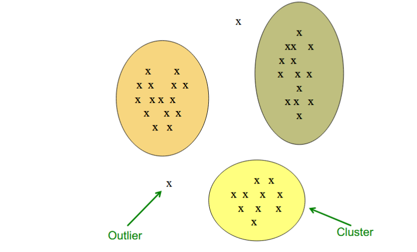
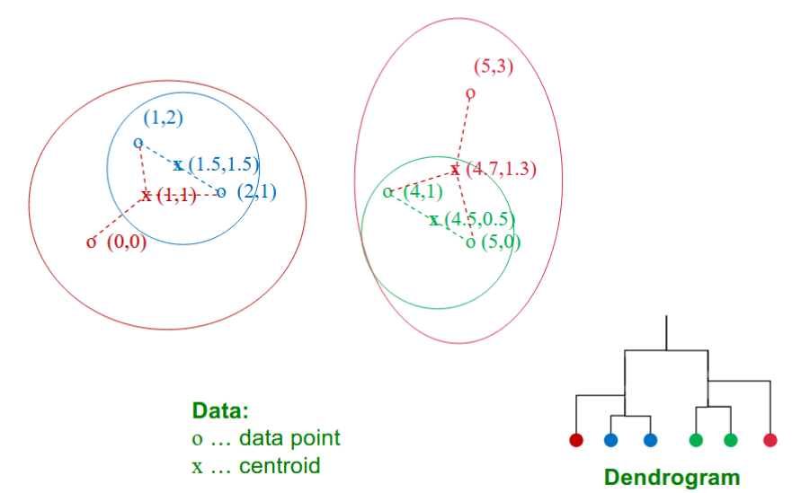
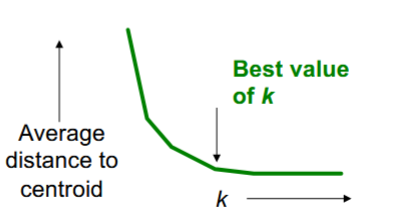
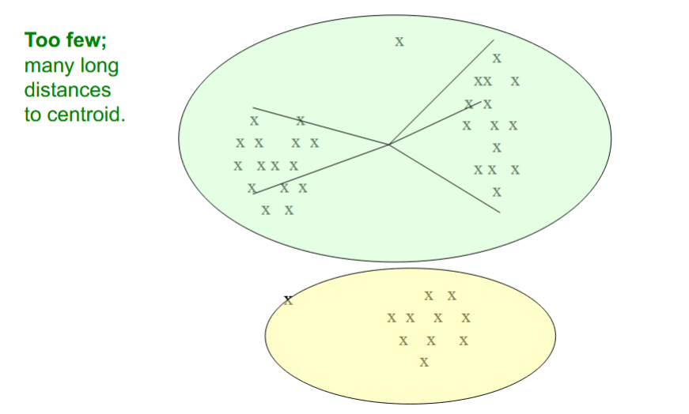
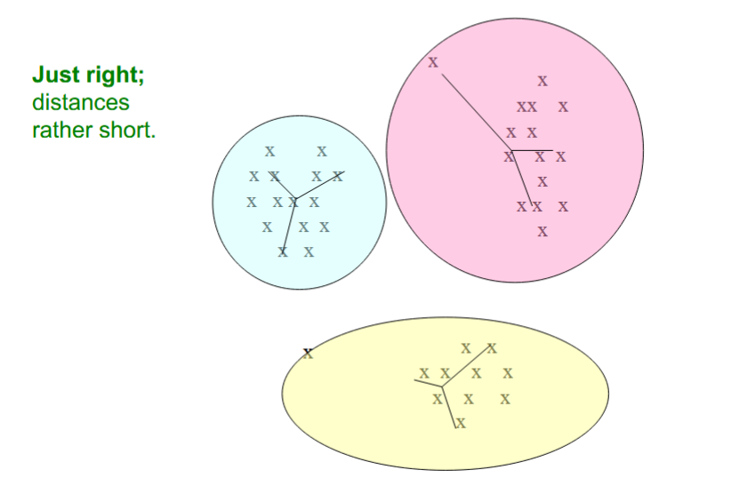
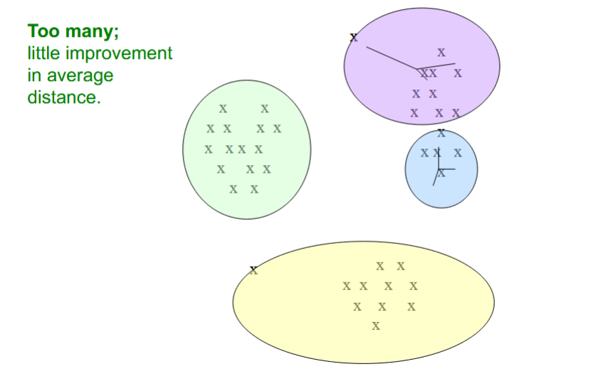
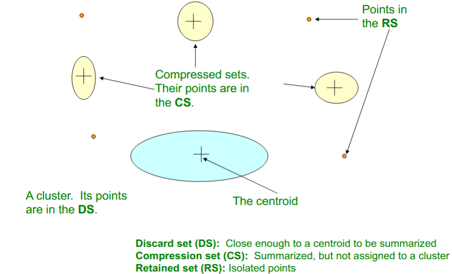

# Clustering

> Given a set of points, with a notion of distance between points, group the points into some number of **clusters**

##### The Problem of Clustering
- Given a **set of points** with a notion of distance between points, **group the points** into some number of *clusters*, so that:
	- Members of a *cluster are close/similar* to each other
	- Members of different clusters are dissimilar.
- Usually:
	- Points are in *high-dimensional* space.
	- Similarity is defined with a *distance measure:*
		- Euclidean, Cosine, Jaccard, edit distance,...

Ex:

#### Why is it hard?
- Clustering in *two dimensions* looks easy.
- Clustering *small amounts of data* looks easy.
- **However:** Many applications involve not 2, but 10 or 10,000 dimensions...

### Cosine, Jaccard, and Euclidean
- **Sets as vectors**: Measure similarity by the *cosine distance*
- **Sets as sets**: Measure similarity by the *Jaccard distance*
- **Sets as points**: Measure similarity by *Euclidean distance*
## Overview: Methods of Clustering

### Hierarchical Clustering
- **Agglomerative** (bottom up):
	- Initially, each point is a cluster.
	- Repeatedly *combine* the two "nearest" clusters into one.
- **Divisive** (top down):
	- Start with one cluster and recursively split it.

##### Point Assignment
- Maintain a set of clusters.
- Assign points to "nearest" cluster repeatedly.
	- E.g. k-means

#### Key Operation
- Repeatedly combine two nearest clusters.

##### Three Important Questions
1. How do you represent a cluster of more than one point?
	- **Key problem:** As we merge clusters, how do we represent the "*location*" of each cluster, to tell *which* pair of clusters is closest?
	- **Euclidean case**: Each cluster has a *centroid* = average of its (data) points.
1. How do you determine the "nearness" of clusters?
	- Measure cluster distances by distances of centroids.
2. When to stop combining clusters?

### Implementation
- **Naive implementation of hierarchical clustering:**
	- At each step, compute pairwise distances between all pairs of clusters, then merge: `O(N²)`
	- Run for `O(N)` steps to merge all points into one cluster.
	- Total complexity `O(N³)`
- **Too expensive** for really big datasets
- Many datasets don't even **fit in memory**.

## `k`-means Clustering

### `k`-means Algorithm
- Assumes Euclidean space/distance
- Start by picking `k`, the number of clusters
- Initialize clusters by picking one point per cluster.
	- **Example:** Pick one point at random, then `k-1` other points, each as far away as possible from the previous points.

### Populating Clusters
1. For each point, place it in the cluster **whose current centroid is nearest**.
2. After all points are assigned, **update the locations of centroids** of the `k` clusters.
3. **Reassign** all points to their closest centroid.
	- Sometimes moves points between clusters.
- Repeat 2 and 3 until convergence.
	- **Convergence**: Points don't move between clusters and centroids stabilize.

#### Getting the `k` Right
- **How to select `k`?**
	- Try different `k`, looking at the change in the *average distance to centroid* as `k` increases.
	- Average falls rapidly until right `k`, then changes little.

##### Example: Picking `k`

## BFR Algorithm

- **BFR** is a variant of `k`-means designed to handle *very large* (disk-resident) data sets.
- **Assumes** that clusters are *normally distributed* around a centroid in a Euclidean space.
	- Standard deviations in different dimensions may vary.
		- Clusters are axis-aligned ecllipses.
- **Efficient way to summarize clusters** (memory required O(Clusters) and not O(data))

---

### BFR Algorithm

- Points are read from disk ne main-memory-full at a time.
- Most points from previous memory loads are summarized by *simple statistics*.
- To begin, from the initial load we select the initial `k` centroids by some sensible approach:
	- Take `k` random points: pick a random point, and then `k-1` more points, each as far from the previously selected points as possible.
	- Take a small random sample and cluster optimally.
	- Now we have the initial `k` centroids and statistics.

### Three Classes of Points
- 3 sets of points which we keep track of:
	- **Discard set (DS):**
		- Points close enough to a centroid to be summarized.
	- **Compression set (CS):**
		- Groups of points that are close together, but not close to any existing centroid.
	- **Retained set (RS):**
		- Isolated points waiting to be assigned to a compression set.

#### Summarizing Sets of Points

For each cluster, the **discard set (DS)** is *summarized* by:

- The number of points, `N`
- The vector `SUM`, whose `i`-th component is the sum of the coordinates of the points in the `i`-th dimension.
- The vector `SUMSQ`: `i`-th component = sum of squares of coordinates in `i`-th dimension.

##### Close Enough?
1. How do we decide if a point is "close enough" to a cluster that we will add the point to that cluster?
2. How do we decide whether two *compressed sets (CS)* deserve to be combined into one?

#### How close is Close Enough?

**BFR suggests two ways:**

- The **Mahalanobis distance** is less than a threshold.
- High *likelihood* of the point belong to currently nearest centroid.

### Mahalanobis Distance
- **normalized Euclidean distance from centroid**
- For point $(x_{1}, ..., x_{d})$ and centroid $c_{1},...,c_{d}$
	- Normalize in each dimension: $y_{i}=(c_{i}-c_{i})/\sigma_{i}$
	- Take sum of the squares of the $y_{i}$
	- Take the square root.

> σᵢ is the standard deviation of points in the cluster in the i-th dimension

$$d(x,c)=\sqrt{\sum_{i=1}^{d}(\frac{x_{i}-c_{i}}{\sigma_i})^2}$$

---

- If clusters are normally distributed in `d` dimensions, then after transformation, for points within one standard deviation, `M-Dis = √d`
- Accept a point for a cluster if its M-Dis is < some threshold... e.g. 2 standard deviations.
	- 95% of points within 2σ.

## CURE Algorithm

##### Problem with BFR/k-means:
- Assumes clusters are normally distributed in each dimension
- Axes are fixed - ellipses at an angle are NOT ok.

### Starting CURE

2 Pass algorithm.

##### Pass 1

0. Pick a random sample of points that fit in main memory.
1. **Initial clusters:**
	1. Cluster these points hierarchically - group nearest points/clusters.
2. **Pick representative points:**
	1. For each cluster, pick a sample of points, *as dispersed as possible*
	2. From the sample, pick representatives by moving them (say) 20% toward the centroid of the cluster.

##### Pass 2
- Now, rescan the whole dataset and visit each point `p` in the data set.
- Place it in the "closest cluster"
	- Normal definition of "*closest*":
		- Find the closest representative to `p` and assign it to representative's cluster.

