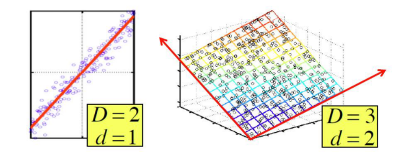
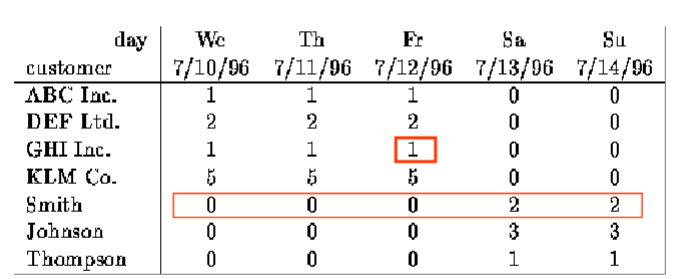
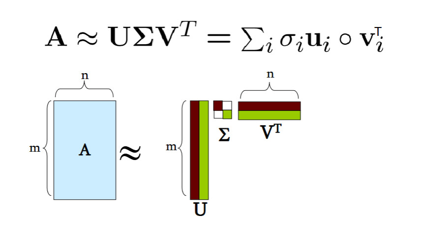
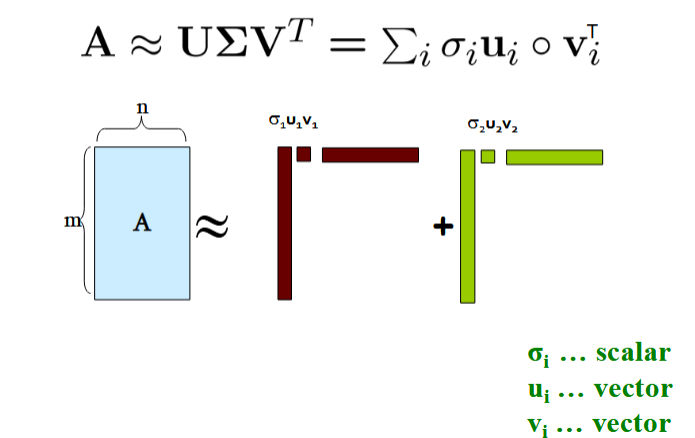

# Dimensionality Reduction: SVD and CUR

- **Assumption:** Data lies on or near a low `d`-dimensional subspace.
- Axes of this subspace are effective representation of the data
	- Line of best fit can *act as a dimension*, a *plate* can *act* as a dimension.
- Think about a 2 dimension subspace as vector form. 
	- A point located at (5,4) is a projection of 5 on the (1,0) axis, and of 4 on the (0,1) axis.

## Dimensionality Reduction
- Compress / Reduce Dimensionality:
	- 10⁶ rows; 10³ columns; no updates.

- The above matrix is really "2-dimensional"... ALl rows can be reconstructed by scaling `[1 1 1 0 0]` or `[0 0 0 1 1]`

##### Example

	KLM Co can be represented as (5,0)
	KLM Co. (5, 0) * (1, 1, 1, 0, 0) = (5, 5, 5, 0, 0)
	Which represents their work....

#### Rank of a Matrix
- The number of linearly independent columns of `A`
- For example:

$$Matrix A= \begin{bmatrix}1 && 2 && 1\\-2 && -3 && 1 \\ 3 && 5 && 0\end{bmatrix}$$

- A has a rank r=2
	- Why? The first two rows are linearly independent, sot he rank is at least two, but all 3 rows are linearly dependent (the third is equal to the first minus the second) so the rank must be less than 3.
- Why do we care about low rank?
	- We can write `A` as two "basis" vectors: `[1 2 1]` `[-2 -3 1]`
	- And new coordinates of: `[1 0]` `[0 1]` `[1 -1]`

> If the **rank** of your matrix is smaller than the dimension of the matrix, *you have a redundant row*, and can **reduce the dimension**

##### Rank is "Dimensionality"
- Cloud of points in 3D space:
	- Think of point positions as a MATRIX.
	- 1 row per point.
- We can rewrite coordinates MORE EFFICIENTLY!!
	- Old basis vectors: `[1 0 0] [0 1 0] [0 0 1]`
	- New basis vectors: `[1 2 1] [-2 -3 1]`
	- Then, `A` has new coordinates: `[1 0]`, B: `[0 1]`, C: `[1 1]`

### Why Reduce Dimensions
- Why reduce dimensions?
- **Discover hidden correlations/topic:**
	- Words that occur commonly together.
- **Remove redundant and noisy features:**
	- Not all words are useful
- **Interpretation and visualization**
- **Easier storage and processing of the data**

## SVD: Singular Value Decomposition

- Decompose the matrix as a multiplication of 3 other matrices with lower dimensions.

$$A_{[m*n]}=U_{[m*r]}\Sigma_{[r*r]}(V_{[n*r]})^T$$

- `A`: Input data matrix
	- `m*n` matrix (e.g. `m` documents, `n` terms)
- `U`: Left singular vectors
	- `m*r` matrix (`m` documents, `r` concepts)
- `Σ`: Singular values
	- `r*r` diagonal matrix (strength of each 'concept') (`r`: rank of the matrix `A`)
- `V`: right singular vectors
	- `n*r` matrix (`n` terms, `r` concepts)

### SVD Properties
- It is **always** possible to decompose a real matrix `A` into `A=UΣV`$^T$, where
	- `U`, `Σ`, `V`: Unique
	- `U`, `V`: Column orthonormal
		- `U`$^T$ `U` = `I`; `V`$^T$ `V` = `I` (`I`: Identity matrix)
		- (Columns are orthogonal unit vectors)
	- `Σ`: **Diagonal**
		- Entries (singular values) are *positive*, and sorted in decreasing order (`σ₁ ≥ σ₂ ≥ ... ≥ 0`)

### Dimensionality Reduction with SVD
- Instead of using *two coordinates* `(x,y)` to describe point locations, let's use only one coordinate (`z`)
- Point's position is its location along vector `v₁`
- **How to choose `v₁`?** - Minimize reconstruction error.

#### Goal
- Minimize the sum of reconstruction errors:

$$\sum\limits_{i=1}^{N}\sum\limits_{j=1}^{D}||x_{ij}-z_{ij}||^{2}$$

- Where `xᵢⱼ` are the "old" and `zᵢⱼ` are the "new" coordinates.
- **SVD gives "best" axis to project on:**
	- "**best**" = minimizing the reconstruction errors.
- In other words, **minimum reconstruction error**