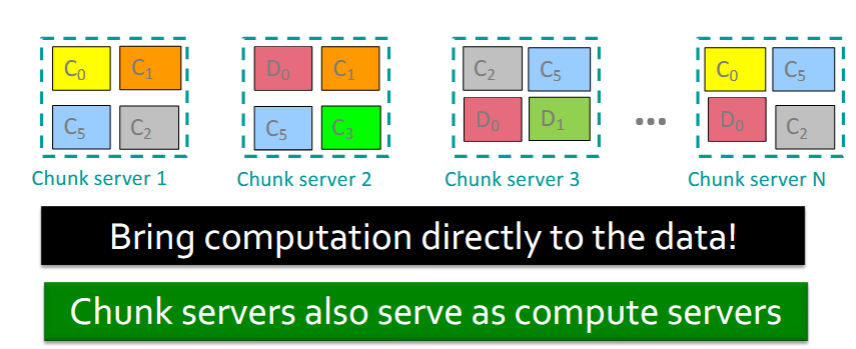
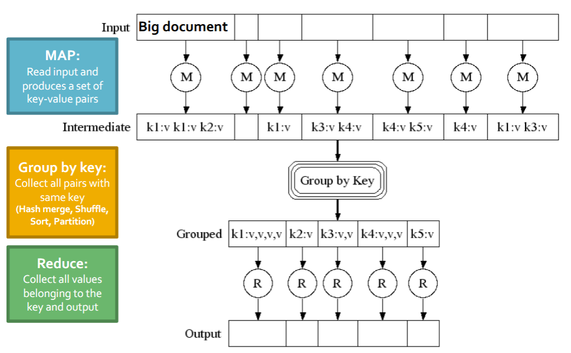
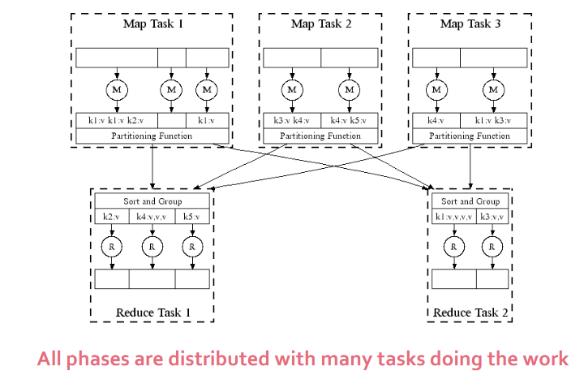
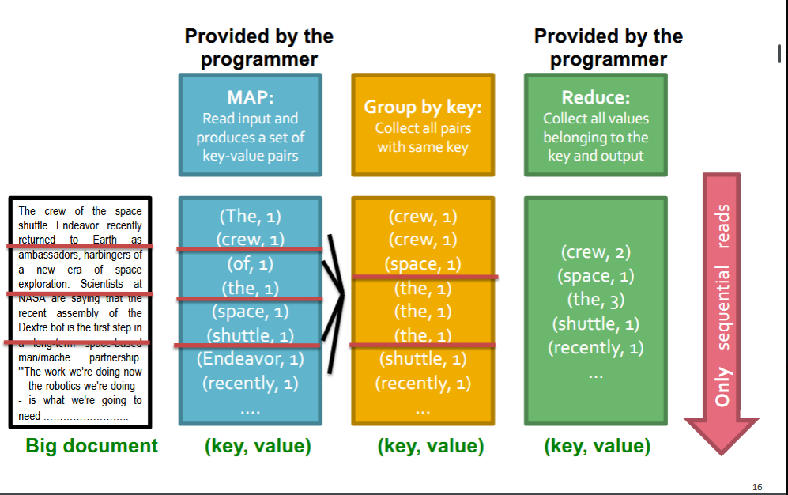
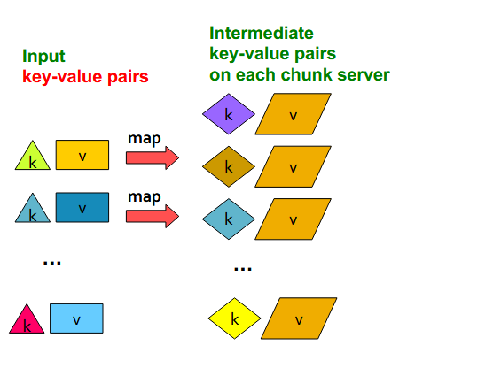
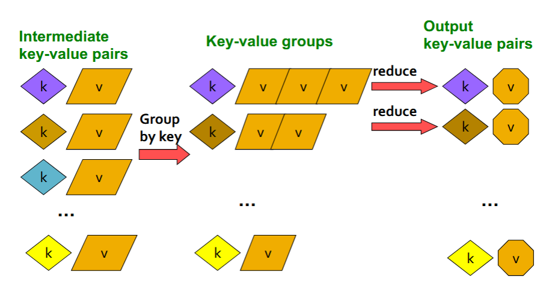
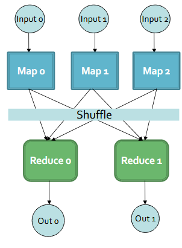

# [MapReduce](intro-ds#MapReduce)

- Much of the course will be devoted to large scale computing for data analytics.
- **Challenges:**
	- How to *distribute computing*?
	- *Distributed/parallel programming* is hard
- **Map-reduce** addresses all of the above.
	- Google's computational/data manipulation model
	- Elegant way to work with big data.
### Motivation: Google Example
- 20+ billion web pages x 20KB = 400+ TB
- 1 Computer reads 30-34 MB/sec from disk
	- ~4 months to read the web
- ~1,000 hard drives to store the web
- Takes even more to *do* something useful with the data!
- **Today, a standard architecture** for such problems is emerging (data center):
	- Cluster of commodity Linux nodes
	- Commodity network (ethernet) to connect them.

### Large-scale Computing
- **Large scale** computing for data mining problems on commodity hardware.
- **Challenges**:
	- *How do you distribute computing*?
	- How can we make it easy to write distributed programs?
	- **Machines Fail**:
		- One server may stay up for 3 years (1,000 days)
		- If you have 1,0000 servers, expect to lose 1/day...
		- People estimate Google had ~2.5M machines in 2016....
			- 2,500 machines fail every day!

##### Idea and Solution
- Issue: Machines may fail due to disk breakdown...
	- Idea: Store files multiple times for reliability.
- Issue: Copying data over a network takes time.
	- Idea: Bring computation close to the data.
- **MapReduce** addresses these problems.
	- Google's computational/data manipulation model
	- Elegant way to work with big data.
	- **Storage Infrastructure - File System**
		- Google: GFS
	- **Programming Model** - MapReduce

> Other open source systems: **Apache Hadoop** and **Spark**

#### Storage Infrastructure
- **Problem**:
	- If nodes fail, how to store data persistently?
- *Answer*:
	- Distributed File System (DFS):
		- Google GFS, Hadoop HDFS
- Typical usage pattern of DFS
	- Huge files (100s of GB to TBs)
	- Data is rarely update in place (e.g. Google, Amazon)
	- Reads and appends are common.


## Distributed File System


##### Chunk Servers
- File is split into contiguous chunks
- Typically each chunk is 16-64MB.
- Each chunk is replicated (usually 2x or 3x)
- Try to keep replicas in different racks.

##### Master Node
- a.k.a Name Node in Hadoop's HDFS
- Stores metadata about where files are stored.
- Might be replicated.

##### Client Library For File Access
- Talks to master to find chunk servers.
- Connects directly to chunk servers to access data.


#### Reliable distributed File system
- Data kept in "Chunks" spread across machines
- Each chunk *replicated* on different machines
	- Seamless recovery from disk or machine failure.



## Programming Model: MapReduce
- Warm-up task:
	- We have a huge text document
- Count the number of times each distinct word appears in the file.
- **Sample application:**
	- Analyze web server logs to find popular URLs.

#### Task: Word Count

- **Assumptions:**
	- File too large for memory, but all `<word, count>` pairs fit into memory.
- **A naive method:**
	- Count occurrences of words:
		- `words(doc.txt) | sort | uniq -c`
			- where `words()` takes a file and outputs the words in it, one per line.
	- The method captures the essence of `MapReduce`
		- Great thing is that it is naturally parallelizable.

#### Overview
- Sequentially read a lot of data.
- **Map:**
	- Extract something you care about
- **Group by key:** Sort and shuffle
- **Reduce:** Aggregate, summarize, filter or transform.
- Write the result

#### Diagram



##### In Parallel

#### Word Counting



##### Word Count Using MapReduce

```python
map(key, value):  
// key: document name; value: text of the document  
	for each word w in value:  
		emit(w, 1)  

reduce(key, values):  
// key: a word; value: an iterator over counts  
	result = 0  
	for each count v in values:  
		result += v  
		emit(key, result)
```

#### Map Step


#### Reduce Step



#### More Specifically
- **Input:** A set of key-value pairs
- Programmer specifies two methods:
	- `Map(k,v)→<k',v'>*`
		- Takes a key-value pair and outputs a set of key-value pairs.
			- E.g. key is the filename, value is a chunk of the file.
		- There is one Map call for every (k,v) pair.
	- **System group by** `k'
	- `Reduce(k', <v'>*)` → `<k', v''>*`
		- All values `v'` with same key `k'` are reduced together and processed in `v'` order.
		- There is one Reduce function call per unique key `k'`

#### Environment
- **Map-Reduce** environment takes care of:
	- *Partitioning* the input data.
	- *Scheduling* the program's execution across a set of machines.
	- Performing the *group by key* step.
	- Handling machine *failures*.
	- Managing required inter-machine *communication*.

---

## Breakdown
- **Programmer specifies:**
	- Map and Reduce and input files
- **Workflow:**
	- Read inputs as a set of `key-value` pairs.
	- Map transforms input kv-pairs into a new set of `k'v'`-pairs.
	- Sorts and shuffles the `k'v'`-pairs to output nodes.
	- All `k'v'`-pairs with given `k'` are sent to the same *reduce*.
	- *Reduce* processes all `k'v'`-pairs grouped by key into new `k''v''`-pairs.
- **All phases are distributed with many tasks doing the work.**



#### Data Flow
- **Input and final output** are stored on a *global* DFS.
- Intermediate results are stored on local FS of Map and Reduce workers.
- Output is often input to another MapReduce task.

#### Coordination: Master
- **Master node** takes care of coordination:
	- Task status: (idle, in-progress, completed)
	- Idle tasks get scheduled as workers become available.
	- When a **map task completes**, it sends the master the location and size of its `R` *intermediate files*, one for each reducer.
	- *Master pushes this info to reducers*
- Master pings workers periodically to detect *failures*
## Dealing with Failures

#### Map Worker Failure
- Map tasks **complete** or **in-progress** at worker are reset to *idle* (because intermediate files are no longer accessible on map workers)
- **Reschedule the task** on another map worker
- Reduce workers are notified when task is rescheduled on another worker.

#### Reduce worker Failure
- Only **in-progress tasks** are reset to *idle* (because reducer outputs are stored in *global file system*)
- Reduce task is restarted.

#### Master Failure
- `MapReduce` task is aborted and client is notified.

## How many Map and Reduce jobs?
- `M` map tasks, `R` reduce tasks
- **Rule of thumb:**
	- Make *M equal to or larger than the number of nodes in the cluster*
	- *One DFS chunk per map is common*
	- Improves dynamic load balancing and speeds up recovery from worker failures.
- **Usually R is smaller than M**
	- Because output is summarization of map tasks.

## Refinements

#### Backup Tasks
- **Problem**
	- *Slow workers* significantly lengthen the job completion time:
		- Other jobs on the machine
		- Bad disks
		- Weird things
- **Solution**
	- *Near end of phase*, produce *multiple backup copies* of tasks
		- Whichever one finishes first "wins"
- **Effect**
	- Save the effort of rerun a task due to machine failure.

#### Combiners
- Often a Map task will produce many pairs of the form (k, v₁), (k,v₂),... for the same key `k`
- **Can save network time** by pre-aggregating values in the mapper.
	- `combine(k, list(v₁)) → v₂`
	- Combiner is usually the same as the reduce function.
- Works **only if reduce function is commutative and associative.**
	- Good example: Calculating sum of values.
	- Bad example: Averaging 1,2,2,4,4 using three mappers.
#### Partition Function
- Want to control how keys get partitioned
	- Inputs to map tasks are created by contiguous splits of input file.
	- Reducer needs to ensure that records with the same intermediate key end up at the same worker.
- System uses a default partition function:
	- `hash(key) mod R`
		- Same key in the same reducer
		- Load balancing
- Sometimes useful to override the hash function:
	- E.g. `hash(hostname(URL)) mod R` ensures URLs from a host end up in the same output file.

## Suitable Problems

#### Host Size
- Suppose we have a large web corpus
- Look at the metadata file
	- Lines of the form: (URL, size, date, ...)
- For each host, find the total number of bytes.
	- That is, the sum of the page sizes for all URLs from that particular host.
- **Other examples**:
	- Link analysis and graph processing.

#### Language Model
- Statistical machine translation:
	- Need to count number of times every 3-word sequence occurs in a large corpus of documents.
- Very easy with MapReduce:
	- Map:
		- Extract (3-word sequence, count) from document.
	- Reduce:
		- Combine the counts.

### MapReduce Join
- Use a hash function `h` from B-values to 1...k
	- Hash a B-value into one of the `k` reduce workers.
- A map process turns:
	- Each input tuple `R(a,b)` into key-value pair `(b,(a,R))`
	- Each input tuple `S(b,c)` into `(b,(c,S))`
- **Map processes** send each key-value pair with key `b` to Reduce process `h(b)`
		- Hadoop does this automatically, just tell it what `k` is.
- Each **Reduce process** matches all the pairs `(b,(a,R))` with all `(b,(c,S))` and outputs `(a,b,c)`

### Cost Measures
- In MapReduce we quantify the cost of an algorithm using:

1. **Communication Cost:** Total I/O of all processes.
2. **Elapsed communication Cost:** Max I/O along any path.
3. **(*Elapsed*) Computational Cost**: Analogous, but count only running time of processes.

#### What It means

- Either I/O (communication) or processing (computation) cost dominates
	- Ignore one or the other
- Elapsed cost is wall-clock time using parallelism.
- Total cost tells what you pay in rent from your friendly neighborhood cloud.