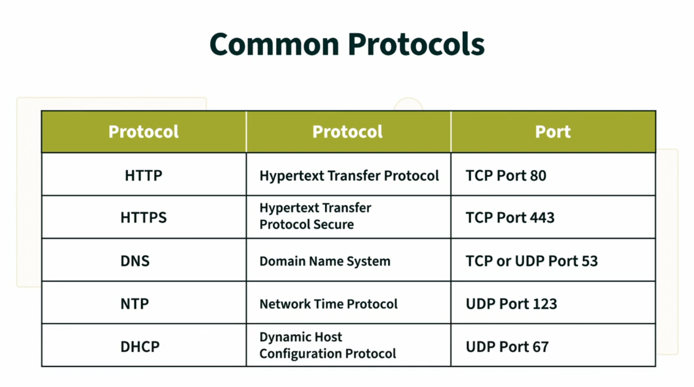

Intro to Information Technology and Informatics
===

## What is technology?

- Typically, people start with the **things** of technology.
- Technology as tools, and machines is a easy and common definition.
- Matches the "bus stop definition".

#### However,
- If a drill drills, and a hammer hammers, without any external force acting on it, it WILL not hammer or drill.

### Technology, is a applied science.
- The person is connected to the machine by the "know how". We ***know how*** to apply the machine to our task.
- By ourselves, we are not able to do anything, but together, with the person and the tool as well as their know how, we form a system, which is the ***know how***.

### What about Autonomous Technologies?
- Even when we talked about autonomous technology, they are still following the idea of an applied science as even for AI tasks, someone still wrote the code for the AI, someone is still telling the AI to do something, etc...

### Information Technology usually has

#### Intended Consequences - Usually Positive
#### Unintentional Consequences - Usually negative

## Future and Retrofuturism

### Futurism:
- The study of social and technological advancement for the purpose of **exploring how people will live and work in the future**.

### Retrofuturism:
- Idea that you would look toward the future from the perspective of the past.
- Inaccurate and incomplete, they were futuristic when they were published.

### Why is Predicting the Future so Difficult?

### Moore's Law:
- Connects what we are learning today to the future.
- Moore's Law states that every two years, the number of transistors in electronics doubled.

### Narrow AI, Weak AI
- Trained to perform a specific task.
- Can only perform one thing (or a specific set of things) very well.
- Narrow scope of expertise.
- Example: A roomba, the recommendation systems

### The In Between:
- Trained to perform a specific set of things.
- Somewhere in between smart and weak AI.
- Example: Spot the robot dog from Boston Dynamics.

### Generalized AI, Strong AI
- Ability to learn  and adapt to new situations.
- Can perform a wide range of tasks at or near a human-like level.
- Can understand and adapt to broad, complex, unanticipated experiences.

Ray Kurzweil: The Coming Singularity
- Futurist
- Technological Singularity: "a hypothetical point in time at which technological growth becomes irreversible, resulting in unforseen changes to human civilization."

## Rules of interaction in Human and Technological Networks

### What is TCP/IP?
- (Transmission Control Protocol / Internet Protocol)
- TCP/IP and OSI model are used interchangeably in ITI
- TCP/IP is a set of rules designed for computers to follow in order to communicate.
- All implementations of the TCP/IP Model rely on something called encapsulation.
	- Encapsulation: Allows any device to transmit data through any physical connection that allows for conduction of electricity or transmit a signal. For more see [Encapsulation](#encapsulation).

### Packets
- Packets are wrapped in something called a header
- The headers contains the source and the destinations for the data packets.
- TCP sequence numbers allow re-assembly in order even if the packets do not all arrive in the same order.
- Packets being small and having many of them allows for the system to not collapse if one of the packets got caught in a slow or broken server.

#### DARPA headquarters started the ARPAnet, which was the first "internet".

### Technical Rules vs Sociotechnical Rules
- TCP/IP is a series of rules governing how computers must communicate on the Internet.
- The architectural rules of the internet can not define how humans interact on the internet.
- Thus, we need rules to regulate how people can talk on the internet...

### Andrew Blum Video

### IoT (Internet of Things) Devices
- IOT devices are devices that typically do not have internet access that was GIVEN internet access. (Ex: A smart toaster. Toasters don't have internet access typically)

## The OSI Model (Open Systems Interconnection)

- **The OSI Model** is just a  reference model, and so is the **TCP/IP** model. 
- It is a conceptual model that provides a common basis for the coordination of standards development for the purpose of systems interconnection.
- The more you adhere to these standards, the easier time you will have  connecting to the internet.
- Remember it by the acronym:
	- **A**ll **P**eople **S**eem **T**o **N**eed **D**ata **P**rocessing.

## The Common Protocols in the Application Layer
- These are all application level protocols.

#### HyperText Transfer Protocol (HTTP)
- Used to manage **HyperLinks**.
- Originally proposed to help solve the information management of Data at CERN.
- What's important aboout hypertext is not just the **Text** but the ***links***.
- We didn't have a technology for hypertext prior to this.

## Does the Web Really Want to be Free?

What do models do?

- Models are used to provide an overview, or set a blueprint for how something **should** look or behave.
- No models actually exist in the world. They are just layouts to be implemented.

### Encapsulation
- Each layer does not care what the other layers do, so if a physical layer does do it's job, none of the other layers care.
- As data comes in from the bottom of the stack and gets passed up to whatever app you're using, the inverse is true.
- This means that you will not have to care about which physical address someone else is on or any of those things.

### Netchoice v. Paxton Video Lesson

#### A Sociotechnical Theory of Regulation

**Regulation**: Factors that constrain and enable behaviors.

1. ***Legal Constraints***: A societies laws that constrain and enable your behavior.
2. ***Social Norms***: The rules and expectations of a society that constrian and enable your behavior. (These laws may not land you in jail, but is frowned upon by society.)
3. ***Market Forces***: Financial factors, costs and pricing rules that constrain and enable your behavior.
4. ***Architecture***: HOw things are designed to constrain and enable your behavior. (Refers to architecture of the physical *and* digital kind)

So, to explain the rules that govern speech online, we typically refer to multiple regulations and how they interact.

We call this:

#### Sociotechnical Complexity
- How technological and non-technological regulators often interact to regulate behavior.
	- In order to describe your internet bill, you would need to describe the laws and taxes and how they interact in order to explain it.
	- Another example is how laws enabled 5G technology and the financial interests that companies had to implement it.

---

NetChoice, LLC v. Paxton is the government's attempt to implement laws that govern how people must communicate.
- It is about how **you** get to decide what can or cannot be said in your online community.
- It's not about whether someone is allowed to spout hate speech online, but about whether companies are allowed to regulate them.

#### Netchoice v. Paxton Case
- A Texas law attempts to tell social media companies that they cannot regulate content on their platforms.
- In theory, any state that is in the 5th Circuit of the United States, can now compel any speech it wants on private property, which also includes your home.
- Allows anyone to sue you if you removed content in your private community. (You can not block any viewpoint)

But...

#### Section 230 of Communication Decency Act
- You are not the author of the comments that your user posts.
- It allows you to clean up your own mess on your platforms.
	- So that no platform is responsible for what their people say.

However...

The 5th Circuit courts have already upheld this law. This means, if the law goes to the Supreme Court, we would need the Justices to go back on their previous opinion.

### Data

- Data, like oil, is extracted from a raw source, and then refined into useful products, like our cars, or applications.

Stored within those massive data centers:

#### Databases
- A database is a logically coherent collection of related data.
- Databases turn data into information.

#### Relational Database Structure
- These are tables of entities
- There is more organization by connecting certain columns to a certain column in a different table.

The **War of the Roses** was fought between the Houses of Lancaster and York.

### Two types of Knowledge

- **Tacit  Knowledge**
	- I know how to ride a bike.
	- I cannot read how to ride a bike
- **Explicit Knowledge**
	- I KNOW that the warring factions of Lanncaster and Yorks from the House of Plantagenet fought in the war of the Roses.
	- I can learn about the War by reading about it.

#### Data Science Workflow
1. Data is collected from different sources
2. Collected data is organziaed and stored in databases for future use.
3. A individual in the future analyzes the information and makes connections between events, names and etc.
4. They then interpret the analysis and explains in a book or lecture what it means.

#### Dangerous Databases

How can databases be dangerous?

- We need a **sociotechnical system** to view how it can be dangerous.

