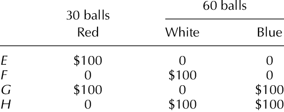

> Taught by Dr. Max Bialek ([Email](mailto:mbialek@rutgers.edu))

**Course Textbook:** Introduction to Decision Theory *2nd Ed.* (Martin Peterson)

### Course Breakdown


## Preferences and Utilities

---

### Some signs
- `A ≻ B` := "A is *preferable* to B"
- `A ~ B` := "A is *indifferent* between A and B"
- `A ≽ B` := "A is *at least* as good as B"

---

- There are properties that our preferences should satisfy:
	- **Completeness**: `x ≻ y` or `x ~ y` or `y ≻ x`
		- It's not that you are indifferent between them, as you can still make a choice between them. (No preference nor indifference)
		- If the preference is not complete, it is literally *impossible* to choose between them.
		- **Incomplete Preference**
	- **Asymmetry:** If `x ≻ y`, then `¬(y ≻ x)`
		- There are situations where you are guaranteed to lose money if you violate asymmetry.
			- Since you prefer apples to bananas, having a apple is worth more to you than having a banana. Etc etc... same story as before.
			- You'd be willing to trade the banana for the apple + some monetary amount... (because otherwise you would be indifferent)
			- **Money pump**
	- **Transitivity:** If `[(x ≻ y) ∧ (y ≻ z)] → x ≻ z`
		- You would also become a money pump if this is not upheld.
	- **Negative Transitivity:** `[¬(x ≻ y) ∧ ¬(y ≻ z)] → ¬(x ≻ z)`
		- It is true that we dont prefer `x` to `y`. 

> The utility for the agent is how valuable the agent finds that item to be.

### Ordinal Constraint

- The `u(x)` (utility) `>` `u(y)` iff. `x ≻ y`.
- `u(x) = u(y)` iff. `x ~ y`.

For the case of our class assignment, there are many different utility values (utils) that you can assign, but all that's important is the *order* of the items.

### Cardinal Constraint

- Suppose that there is a lottery (L), you can win `A` with a probability of `p` and win `B` with a probability of `1-p`.
- The *cardinal constraint* says that the `u(L)` (It is the utility of actually *playing the lottery*) = `p * u(A) + (1-p) + u(B)`
- If you have a cardinal utility function, you can *stretch it* and *shift it*, but certain things will be preserved.
	- `u' = c*u + d`
	- What is preserved is the **relative** distance between two things.

## Sept 11

### Von Neumann Morgenstern Utility Theorem

> [!NOTE] Axiom 1: Completeness
> `A ≻ B` or `A ~ B` or `B ≻ A`

> [!NOTE] Axiom 2: Transitivity
> If `A ≻ B` and `B ≻ C`, then `A ≻ C`

> [!NOTE] Axiom 3: Independence
> `A ≻ B` iff `ApC ≻ BpC`
> (*The `p` is the notation for the probability. So here it is basically symbolizing the lottery of Apples with Coconuts is preferable to the Banana and Coconut lottery.*)

> [!NOTE] Axiom 4: Continuity
> If `A ≻ B ≻ C`, then there exists some `p` and `q` such that `ApC` ≻ `B` ≻ `AqC`
> (*In this case, the probability of the lottery for `p` would have to be some degree larger than for `q`*)
> `u(ApC) = p * u(A) + (1-p) * u(C)`


---

**Theorem 5.2:** The preference relation `≻` satisfies vNM 1-4 iff there exists a function `u` that takes a lottery as its argument and returns a real number bewteen 0 and 1, which ahs the following properties:

- `A ≻ B` iff `u(A) > u(B)` (Ordinal Constraint)
- #todo huh what am i missing here?


---

## Sep 15 - Making Decisions

|     | S₁        | S₂        | ... |
| --- | --------- | --------- | --- |
| A₁  | O(A₁, S₁) | O(A₁, S₂) | ... |
| A₂  | O(A₂, S₁) | ...       | ... |
| ... | ...       | ...       | ... |

- Here, we have a table of *S* (states) and *A* (acts). Within each of these, we have a set of *O* (Outcomes)
- What we care isn't necessarily just the *outcomes* of these states and acts, but the actual **utilities**.

---

#### Example

```
Suppose you flip a coin and could bet on whether it lands on heads or tails.
```

The Decision matrix would like like as follows if you (*columns = coin lands on, rows = bet on*):

|     | H   | T   |
| --- | --- | --- |
| H   | $1  | -$1 |
| T   | -$1 | $1  |

However, if you had a scenario where:


|     | H   | T   |
| --- | --- | --- |
| B₁  | $1  | $1  |
| B₂  | -$1 | $1  |

- You would always choose B₁, as in *every single outcome*, B₁ is superior or equal to B₂.
- **We call this dominance reasoning.**
	- This one is *weak dominance*.

|     | H   | T   |
| --- | --- | --- |
| B₁  | $2  | $2  |
| B₂  | $1  | $1  |

- However, in this scenario, while you would *still* prefer `B₁`, this case is a **strict dominance**, as ***every*** state is superior.

> [!NOTE] Dominance Reasoning
> Act `A` dominates Act `B` iff. for all states `S`, `u(A, S) ` ≥ `u(B, S)`, and there exists a state `T` s.t. `u(A, T)` ≥ `u(B, T)`.\
> \
> The rule is that you would *never choose* a act that was being dominated. (They *ought to rule it out as a possible solution*)


- **Weak dominance**: At least one state where the utilities are equal.
- **Strict dominance**: All states are superior.
- *Intransitive*: There is no preference (indifferent) between two acts.
	- This would occur if there is an equal number of states that have superior utilities.

|     | S₁  | S₂  | S₃  |
| --- | --- | --- | --- |
| A₁  | 0   | 3   | 2   |
| A₂  | 2   | 2   | 3   |
| A₃  | 1   | 1   | 2   |

- Given this scenario, we would be *intransitive* between `A₁` and `A₃`, as `S₃` is equal and `u(A₁, S₁)` <= `u(A₃, S₁)` and `u(A₁, S₂)` >= `u(A₃, S₂)`.


> [!NOTE] Maximin
> **Maximizing** the minimum utility. (Risk averse)\
> \
> It tells you to look at every single act, and choose the act with the highest *minimum* utility.\
> So, *in the previous scenario:*

|     | S₁  | S₂  | S₃  | min(A) |
| --- | --- | --- | --- | ------ |
| A₁  | 0   | 3   | 2   | 0      |
| A₂  | 2   | 2   | 3   | 2      |
| A₃  | 1   | 1   | 2   | 1      |

- In a *lexical maximin* scenario, you will continue to look for the mins in order to break ties.

---

#### Example

|     | S₁  | S₂   |
| --- | --- | ---- |
| A₁  | -1  | 1    |
| A₂  | -2  | 1000 |

- In this scenario, *dominance reasoning* tells us absolutely nothing.
- However, *maximin* would say that `A₁` is better.

> [!NOTE] Minimax
> *Minimize* the maximum **regret**. (It is also pessimistic, like maximin)\
> \
> `regret(A, S) = Max(S) - u(A, S)` (U can build a regret table, *which is entirely positive*, there should also be a 0 in each col.)

- Now, in the case of *minimax*, it would say that `A₂` is better.
	- There isn't really a tie-breaking procedure for minimax though.

#### Ordinal vs Cardinal Utilities

- Cardinal information has a lot more information than ordinal utilities.


---

## Sept 18


#### Example

> However, what is a case where the reasonings *fail to keep in line with our intuitions.*

|     | S₁  | S₂  | S₃  | ... | S₁₀₀ |
| --- | --- | --- | --- | --- | ---- |
| A₁  | 100 | 0   | 0   | ... | 0    |
| A₂  | 0   | 99  | 99  | ... | 99   |

- **Dominance reasoning says:** The two actions are equal, as in *some cases*, A₁ is superior, and A₂ is superior in other cases.
- **Maximin reasoning says:** A₁ is superior, as the *minimums* for both would be zero, but after lexical maximin, A₁ would have a minima of 100 vs A₂ with 99.
- **Minimax reasoning says:** A₁ is superior *again*, as the *minimum* maximum regret is 99 (even though it is possible to be experienced way more often)

> **Now if we knew some things about the probability...**

|     | S₁  | S₁₋₁₀₀ |
| --- | --- | ------ |
| A₁  |     |        |
| A₂  |     |        |

> [!NOTE] Expected Utility
> The expected utility of an Act A:
> $$\sum_{i=1}^{n}{u(A, S_i) * p(S_i|A)}$$

⤷ If we were to use expected utility to calculate the utlities of each act:

- **A₁**: $EU(A_1)=100 * \frac{1}{100}+0*\frac{99}{100} = 1$
- **A₂**: $EU(A_2)=0*\frac{1}{100}+99*\frac{99}{100}= 98.01$

> Keep in mind that this assumes all the states are *equally likely*.


#### HW

18. Relations: A_2 strictly dominates A_1, A_3 weakly dominates A_1, A_2 and A_3 are intransitive
- Dominance: A_2 v A_3 ≻ A_1
- Maximin: A_2 is preferred
- Minimax: A_2 is preferred (Minimum regret of 3)
- MEU: A_3 is preferred, highest EU value (3.5 EU vs 1.6EU(A_2))

19. Relations: They are all intransitive with one another.


## Sept 22

### Paradoxes of Decision Theory

#### The Allais Paradox

|     | T₁   | T₂₋₁₁ | T₁₂₋₁₀₀ |
| --- | ---- | ----- | ------- |
| G₁  | 1mil | 1mil  | 1mil    |
| G₂  | 0    | 5mil  | 1mil    |

- What would you prefer in this case?
	- Me personally, fuck it we ball, G₂ all day.


|     | T₁   | T₂₋₁₁ | T₁₂₋₁₀₀ |
| --- | ---- | ----- | ------- |
| G₃  | 1mil | 1mil  | 0       |
| G₄  | 0    | 5mil  | 0       |

- What about in this case?
	- Still going wit the 5 mil...

> However, despite the utilities still leaning toward G₂ and G₄, many people would prefer G₁ to G₂ still. 

- Because there is a guarantee for a million, there is much more regret for losing a million (even if it is super rare).

#### Ellsberg Paradox

- You set it up with 4 gambles. There is a setup with 2 boxes with balls in them.



- E and F vs G and H have the same value for utilities in the two cases. If you prefer E to F, you should also prefer G to H, but that is not true.
- It seems to make sense to prefer H to G because (sure thing probability axioms)

#todo stuff about how people tend to underestimate low priorities and overestimate high priorities.

#### St Petersberg Game

- You start flipping a coin *until it comes up heads*. (`h` = num. of flips to get heads.)
- **Payout:** `2ⁿ`

| flips | 1   | 2   | 3   | 4   | ... |
| ----- | --- | --- | --- | --- | --- |
| util  | 2   | 4   | 8   | 16  | ... |

**According to EU theory**: You should be willing to pay **as much money as possible** to play this game. (Bc it has infinite utility)

## Sept 25

### Pasadena Paradox

- `n` - number of flips to get a head.
- *If `n` is even*: You pay $\frac{2^n}{n}$
- *If `n` is odd*: You get $\frac{2^n}{n}$

| n    | 1   | 2    | 3    | ... |
| ---- | --- | ---- | ---- | --- |
| pay  | 2   | -2   | 8/3  | ... |
| prob | 1/2 | 1/4  | 1/8  | ... |
| EV   | 1   | -1/2 | +1/3 | ... |

- The EV alternates `+/-`(1/n), which is the following equation:

$$EV=\sum_{n=1}^{\infty}{\frac{-1^{n+1}}{n}}$$

> This is an *alternating* harmonic series and converges on `ln(2)`

However, if you rearrange the numbers of the expected value to have 1 positive value and then 2 negative value...

- $EV=1-\frac{1}{2}-\frac{1}{4}+\frac{1}{3}-\frac{1}{6}-\frac{1}{8}+\frac{1}{5}...$
- Add some of them up... $EV=\frac{1}{2}-\frac{1}{4}+\frac{1}{6}-\frac{1}{8}...$
- Which is $=\frac{1}{2}(1-\frac{1}{2}+\frac{1}{3}-\frac{1}{4}...)$
- And that converges on `1/2ln(2)` Which is a completely different answer.

> The Pasadena Paradox *may feel like a fair game*...


### Two-Envelope Paradox

- Envelope A
- Envelope B
- It will *either be*:
	- `$A` = `2$B`
	- Or `$B` = `2$A`

|     | A+(p=1/2) | B+(1/2) |
| --- | --------- | ------- |
| A   | x         | x       |
| B   | x/2       | 2x      |

- EV[A] = x
- EV[B] = 5/4x


> When you look at it *this way*... you should then choose **B**. BUT, if you switch the order of it, you would be told to pick **A**. According this this expected utility, **you would always be better off choosing the other one**.

- Of course, this is because of *how you are formulating the problem!*

|     | A+(p=1/2) | B+(1/2) |
| --- | --------- | ------- |
| A   | x         | 2x      |
| B   | 2x        | x       |

- In this solution... the EVs are EQUAL!!

### Newcomb's Problem

- There are two boxes...
	- A transparent box with *$1,000*
	- A opaque box with *$1,000,000 or $0*
- You have the choice between either taking only 1 box or taking both boxes.
- *Now to add to this*, there is an angel that peers into your soul and predicts whether you will choose one or two boxes.
	- If the angel thinks you're a **one-boxer**, the angel will put `$1,000,000` into the opaque box.
	- If the angel thinks you're a **two-boxer**, the angel will put `$0` into the opaque box.
	- *However...* this angel has a 99% accuracy in predicting.
- **Once she makes the choice, SHE CAN'T CHANGE IT!**
	- Doesn't that mean after the choice is made, the probabilities are gone... meaning that two-boxing is strictly dominant!

> Once she has looked at you and *put the money in the box*, there is no longer just the same probabilities, as she has already made her own decision!

## Oct 2

### Mathematics of Probability

> Just check out [these notes](../discrete-2/discrete-2#Probability) on probability instead..


> [!NOTE] Axioms
> Fundamental Truths

#### Kolmogorov Axioms

1. $1 \ge p(A) \ge 0$
2. p(S) = 1 (If `E` is a tautology, then `p(E)=1`)
3. If $A \cap B = \emptyset$, then $p(A \cup B) = p(A)+ p(B)$
	- If `A ∩ B` is a contradiction, then `P(A ∪ B) = p(A) + P(B)`

#### Theorems

- **Theorem 6.1**: $p(A) + p(¬A)=1$
- **Theorem 6.2**: If A and B are logically equivalent, `p(A) = p(B)`
- **Theorem 6.3**: $p(A∪B)=p(A) + p(B) - p(A∩B)$


## 10/3

### Philosophy of Probability

- The *classical interpretation* of probability: the probability of an event `E` occuring is the number of *outcomes* where `E` occurs vs the *total number of outcomes*.

However, what if you have a situation where you are *flipping two heads?*

- In this case, the possibility will depend on how you interpret the probability...
- If you see it in the sense of, "its possible to get two heads, 1 head, or no heads..." Doesn't that mean the `P(2 heads) = 1/3`?
- Hm, but then if you draw up a table with all the possibilities, there is only 1 scenario where you get 1 head out of 4 possible, which means is it `P(2 heads) = 1/4`?

> In probability, we must all agree on a view of the possibility space.


#### Hypothetical Infinite Frequentism

- Reference class is a hypothetical infinite series of repetitions of the stochastic process.
- The p(E) is the limiting relative frequencies *in the infinite hypothetical reference class*.

##### Naive Frequentism

- Different reference classes yield different probabilities.
- Bigger reference class to take advantage of law of large numbers but then leading to including irrelevant things.

> [!NOTE] Degree of Belief
> There is some degree of similarity to your own answer where you are *willing* to believe them.

---

However, by structuring and rearranging the occurrences of the reference class... you can still *reconstruct* any probability you want.


#### The Propensity Interpretation

> The *disposition* of a particular event to occur. (Ex: Glass has a disposition to shatter)

- In both classical and frequentist interpretations, probability is something in the world, and does not depend on us at all.
	- *Even if no one existed, people would still be able to talk about probabilities.*
- **Probabilities** are physical magnitudes possessed by systems (similar to charge or mass)

- There is an objection to this interpretation due to a lack of explanation.

#### Humphrey's Paradox

- A challenge to the Propensity Interpretation.
- When you look at the probability axioms, there is a "backwards" or inverse conditional probability.
	- If `p(H | F)` exists, `p(H|F)=p(F|H)P(H)/P(F)` must exist...
- However, with the Propensity Interpretation, it does not make sense to have physical causing dispositions that go backwards.


### Logical Probability

> A confirmation function `c(hypothesis | Evidence)`. \
>> He wanted to know, to what extent does evidence *confirm* a hypothesis.

$$c(hyp|Evidence) = \frac{m(H\wedge E)}{m(E)}$$

- Since `m` depends on a structural description, *if you describe the structure differently*, you can get different probabilities for the same event.
- You can't presume the future will look like the past *just because* the past looked like the past.
	- It's the question of "How do you know the sun will rise tomorrow?"
	- **Cause it always has...**

### Credence

> What's in our heads, the *subjective interpretation*.

#### The Dutch Book Theorem

> Degrees of belief *satisfy* axiom of probability iff you are **not** vulnerable to dutch books.

- If your degrees of belief violate the probability axioms, you will be subjected to the *Dutch Book* (Bets you'd be willing to take where you are guaranteed to lose money.)

---

```
"S" is the stake a player receives if event E occurs.

p is the "betting quotient" i.e. the player's degree of belief in E.

E: S - p * S
¬E: -p * S

EV[bet] = p*(S-p*S) + (1-p)(-p*S)
```

---

##### Violating Axiom 1

- Axiom 1: 0 <= p <= 1

```
let p < 0
set S = -1
E: -1 - p * -1 = -1 + p (which is less than 0), which means with a negative stake, the agent loses money.
¬E: -p * S = -p -1 = p < 0

*If your degree of belief is less than the probability axiom, you are guaranteed to lose money.*
```

##### Violating Axiom 2

- Axiom 2: p(S) = 1, a tautology has a probability of 1.
- Violates easily, set only 1 condition.

```
let p > 1
Set S = 1
E: S - pS = 1 - p, E < 0

let p < 1
set S = -1
E: -1 + p, E < 0
```

##### Violating Axiom 3

- If `E` and `H` are mutually exclusive (ie E ∧ H is impossible), then the p(E ∨ H) = p(E) + p(H)
- To violate this, you have to violate the equality.

```
let p(E ∨ H) > p(E) + p(H)
set S_{E ∨ H} = ? (-1), S_{E} = ? (1), S_{H} = ? (1)

E ∧ ¬H: 
H ∧ ¬E:

```

## 11/13

#### Small Improvement Argument

- To prove: `¬(x > y) ∧ ¬(y > x) ∧ ¬(x ~ y)`
- Step 1: `¬(x > y) ∧ ¬(y > x)`
- Step 2: Let `y+` be some amount, *just slightly* more than the amount `y`, that you would get. (So ofc, in this case, you would prefer `y+` to `y`)
- Step 3: `[(x ~ y) ∧ (y+ > y)] -> (y+ > x)`
- Step 4: But thats not true... `¬(y+ > x)`
- Step 5: Then, it must *not be the case (step 3)* -> Thus, `¬(x ~ y ∧ y+ > y)`
	- This means at least one of them has to be false.
- Step 6: `¬(x ~ y)` has to be the the case then, since we said in step 2 that `y+ > y`
- Step 7: `¬(x > y) ∧ ¬(y ~ x) ∧ ¬(x ~ y)`

### Bayesianism

1. Our degrees of belief must satisfy the probability axioms.
2. You should update your degrees of belief (credences) in proposition `H` in light of new evidence `E` using Bayes Rule.


- Probability
	- Chance
	- Credence
		- Bayesianism
			- Subjective - any prior that you want, you can take (No reason to prefer one prior over the other)
				- You shouldn't assign zero prior probability to anything though. (Since if you were 100% certain something could not happen, then anything that would depend on that would also *never happen*)
			- Objective - All views of trying to pick a prior are a little bit like the classical approach. (Choose a uniform prior)
				- Suppose you have a box that could be 1-2ft. Prob. of the box would then be 1.5
				- Runs into a problem as if you tried to manufacture something for the 1.5 box, and its not exactly 1.5, ur fucked!

P(B|P) = 7/10
P(B| -P) = 1/10
P(P) = 1/20

P(P | B) = 7/26


## Exam Review

1

- he wont ask about violating continuity probably
- He cares about the list of completeness, transitivty, asymmetry, and negative transitivity (if there is an indifference, its negative transitivity being violated, not transitivity).
	- Negative transitivity can be violated with: B > S, B ~ T, S ~ T


2

```
u(Peas) = 2/3 u(Beans) + 1/3 u(Spinach)
u(Beans) = 1/2 u(Broccolli) + 1/2 u(Peas)

u(Broccoli) > u(Beans) > u(Peas) > u(Spinach)

B -> 1 (If it's one) | 1

Beans -> 0 | 1/2

P -> 2/3 (Must be 2/3 from first equation) | 0

S -> 0

However, it asks for B to be 0 and S to be -1, so you would just step it down.

```
8/9

- What does actual frequentism say...?
	- Whats the problem with it, why is it philosophically unsatisfying
- Even though we cant tell the difference between probability of getting 2 heads etc... we see a frequency.

Equally possible possibility space: classical: space of possibilities that are equally possible. point is... thats passing the buck from defining what possibilities are.

Reference class too big vs too small? - It shouldnt be too big (includes irrelevant info), too small and the prob. isnt accurate.

## [Midterm Exam Review](midterm-study-guide)


## Game Theory

### Types of Games

- **Zero-sum Game vs Nonzero-sum Game:** Anything a player gains is matched by a corresponding loss for the other player.
- **Noncooperative Game vs Cooperative Game:** All agents are *rationally self interested*. They will do what is best for themselves.
- **Simultaneous-move Game vs Sequential-move Game:** Decisions are made at the same time. (Rock, paper, scissors vs Chess)
- **Games with perfect info vs imperfect info:** Does you opponent know information that you don't know.

> You can use iterative dominance reasoning to arrive at a dominance reasoning solution to the game.

### Solutions

- Dominance solutions
- Equilibrium solutions
	- Look for the row player's column maximum and the column player's row maximum when the row player chooses their maximum.
	- This is the nash equilibrium
- Can look at them together


##### Example

- Find the equilibrium?

|     | C_1   | C_2   | C_3   |
| --- | ----- | ----- | ----- |
| R_1 | 0, 0  | -4, 4 | 4, -4 |
| R_2 | 4, -4 | 1, -1 | 2, -2 |
| R_3 | 9, -9 | -3, 3 | 3, -3 |

- Column player's best outcome is C_2, which strictly dominates C_1 and C_3 (*look on the right*)
- The Row player would then choose the best outcome out of the C_2 column, which is R_2.


|     | C_1   | C_2   |
| --- | ----- | ----- |
| R_1 | (a) 5 | (d) 2 |
| R_2 | (c) 3 | (b) 4 |

- In this case, there is no *pure equilibrium* solution, as no matter what each person chooses, the other person would want to switch to another choice!
- However, there is a *mixed equilibrium* solution...
	- Use probability.

---

Detective Sikert and Kondwani

|     | C    | ¬C     |     |
| --- | ---- | ------ | --- |
| P   | ,0   | ,3+5-2 |     |
| ¬P  | ,3-1 | ,3-2   |     |

```
u_k(1 year) = -1 (Kondwani has negative utility for a 1 year sentence as jail bad)
u_s(unhappy) = -1 (Is the detective is unhappy)
u_s(happy) = 1
```

|     | C     | ¬C    |
| --- | ----- | ----- |
| P   | -1,0  | 1,-6  |
| ¬P  | -1,-2 | -1,-1 |

- Here is the final game table.
	- Identify all the unique, non dominated *pure strategy* equilibrium.
	- If there isn't one answer, identify a mixed one.
- Planting the drugs weakly dominates, Kondwani's going to choose to confess. NDE -> `{P, C}`

## Voting Notations

- V: Set of voters `1,2,3 ...` / `i,j,k,...`
- X: Set of candidates/alternatives `A,B,C,...`

> Each voter has a *ballot* ranking elements of `X` (ie alternatives)

`B` is the set of possible ballots:

- `X` = `{A, B, C}`
- `B` = `{(A,B,C), (A, C, B), ...}`

> A *ranking* is a relation `P` on `X` that is:

- *Complete*: ∀y,z ∈ X, yPz or zPy.
- *Transitive:* ∀w,y,z ∈ X, (yPw ∧ wPz) -> yPz.
- *Irreflexive:* ∀y ∈ X ¬yPy

#### Plurality Rule

- The *plurality rule* tells us to look at who got the *most* first place votes.

#### Majority Vote

- You need to have more than half of the votes.

#### Condorcet Method

- Look at all the pairings and determine who prefers which pairing.

```
Example:

10 Votes: A B C
10 Votes: B C A
10 Votes: C A B

Plurality: 3 Winners- A, B and C.
Majority: Nobody
Condorcet: Nobody either, since we have a cycle.
A ≻ B   |  A ≺ C  | B ≻ C
20  10  | 10   20 | 20  10
```

#### Borda Counting

- Assign points to each of the ballots in order of preference
- Whoever has the most points wins.

---

Example

```
7: A B C D
5: B C D A
4: D B C A
3: C D B A
```

- Plurality winner: A
- Majority winner: none
- Condorcet: B > C > D > A
- Borda: B > C > D > A

#### The Frenchies Do This

> **Plurality with Runoff**: If There is a majority, that person wins. If not, you run a second election with the top 2 vote-getters, and then determine a winner from there.


### The Hare Rule

> Instead of cutting out *everybody* who didn't get the most votes, you just remove the person who had the least first place votes and run it back.

```
7: A B C D -> A B   D -> A     D
5: B C D A -> B   D A ->     D A
4: D B C A -> D B   A -> D     A
3: C D B A ->   D B A ->   D   A
```

- In the *Hare's Rule*, we would somehow get: `D > A > B > C`

### Coombs Rule

> Instead of cutting out the person with the *least first place* votes, you cut out the person with the *most* last place votes.

```
7: A B C D ->   B C D ->   B C 
5: B C D A -> B C D   -> B C 
4: D B C A -> D B C   ->   B C
3: C D B A -> C D B   -> C   B (B wins!)
```

- In the Coomb's rule: `B > C ~ D > A`

### 74 Fishburn Theorem

> For all `m >= 3`, there is some voting situation with a Condorcet winner such that every scoring rule will have at least `m-2` candidates with a greater score than the Condorcet winner.

## Voting Paradoxes

#### Monotonicity

> A voting procedure is *monotonic* if receiving more support is better for a candidate.

```
6: A B C
5: C A B
4: B C A
2: B A C

Plurality with Runoff: A wins in this case!

6: A B C
5: C A B
4: B C A
2: A B C    <- We swap A and B...

Now it looks as if A has more support...

Plurality with Runoff: C wins!, After removing B, suddenly, C has more votes!

```

This example above just *seems* wrong. *Plurality with Runoff* is a *non-monotonic* voting method.

#### No Show Paradox

```
4: A B C
3: B C A
1: C A B
3: C B A

Pluarity w/Runoff: C wins

However what if a few voters don't show up that support A...

2: A B C
3: B C A
1: C A B
3: C B A

Now, the winner is suddenly B...
```

#### Multiple Districts Paradox

> If you win in *all the districts*, you should still be the winner even if there weren't any districts.

```
District 1:              District 2:
3: A B C                 2: A B C
3: B C A                 3: B A C
3: C A B
1: C B A

Coomb's Rule: District 1: B wins, District 2: B wins

Combined:
5: A B C
3: B C A
3: B A C
3: C A B
1: C B A

Coomb's Rule: Here, A wins instead
```

---

Let `V` be a voting method that is *Condorcet consistent* and is not susceptible to the Multiple Districts Paradox.

- So, if candidate `X` is among the winners in each of 2 districts, then X must be among the winners of the combined district.


```
District 1:              District 2:       Combined:
2: A B C                 1: A B C          3: A B C
2: B C A                 2: B A C          2: B A C
2: C A B                                   2: B C A
_                                          2: C A B

B is condorcet winner in District 2.
Since there is no Condorcet winner in D1, but there is 1 in D2, then the winner of D2 *must be* among the winners of the combined district. (But since there is only 1 winner, B should be the **only** winner.)

Combined Condorcet: 

A > B: 5
B > C: 7
B > A: 4
A > C: 5

A > B > C, somehow... A won.
```

#### Multiple Elections Paradox

> When multiple elections are being run at the exact same time, each which can have a different result, but each having only 2 choices.

```
1: YYY     3: YNN      3: NNY
1: YYN     1: NYY      0: NNN
1: YNY     3: NYN

Despite the fact that *literally no one* wanted no for all 3 questions, majority dictates that all 3 will not pass.
```