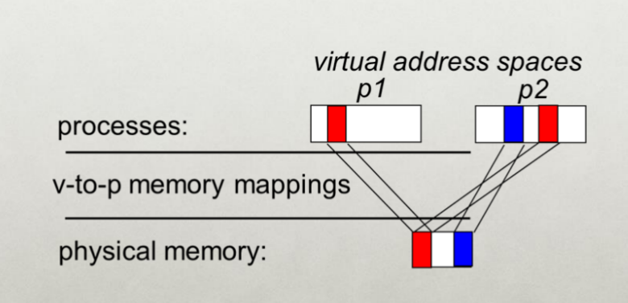

# Introduction To OS Design

- What does OS provide?
- What are the basic functions?

## What to Expect?

### Goals
- Understanding of OS and the OS/architecture interface/interactions
	- Interactions in regards to your RAM, your CPU, etc...

### Breakdown
- We will cover core concepts and issues in lectures.
- In recitations, you and your TA will discuss concepts and programming assignments.
- 4 programming assignments in C/C++, randomly chosen demos.
- 4 short in-class/take-home quizzes on concepts.
- 1 midterm exam and 1 final exam (cumulative)

> Link to [Book](http://pages.cs.wisc.edu/~remzi/OSTEP/)\
> [Course web](https://www.cs.rutgers.edu/~sk2113/cs416/)

*We will discuss topics outside of the book (e.g. Linux kernel). We will provide all required materials (slides, notes, papers).*

## Grading
- Midterm: 25%
- Final: 25%
- Projects: 40%
- Canvas quiz + in-class quiz: 10%
	- This in-class quiz will be 5 or 7 minutes on the lecture with peer discussion.

Programming assignments will be done in groups of two. Group members cannot be changed unless you have a very legitimate reason (e.g. group member dropped the class).

- **Demos might change your grade!**

- Project hand-ins MUST be on time.

- *Late hand-ins will not be accepted.*

### Tentative Grading Scale
- A = 85 and above
- B+ = 80 and above; B = 75 and above
- Etc...

### What is an Operating System?

- The operating system is an interface between your applications and hardware.
- Provides an abstraction to use your hardware.
- Allows users to run their own apps over the hardware.

> Operating System (*OS*): Software that converts hardware into a useful form for applications.

From a ***high-level view***...

- It is a *software layer* between the hardware and the application programs/users that provides a *virtual* interface: **easy** and **safe**.
- A *resource manager* that allows programs/users to share the hardware resource: **fair** and **efficient**.
- Sometimes also considered to include a set of utilities to simplify application development. (*we will not consider these utils to be part of the OS in this course*)
### Why Study OS?
- Before, the goal of OS was to have a high level overseer to manage the resources of the computer.
- Today, instead of hardware oriented computing, we are now in a *data oriented* computing phase.
- Provide easy abstractions and process data as quickly as possible.

- We will learn how to build, modify or administer an operating system.
- Understand system performance.
	- What is the latency for writing data, etc...
	- *Functionality & Performance*
	- Behavior of OS impacts entire machine
	- Tune workload performance
	- Apply knowledge across many layers
	- **Make it run FASTER**
- Fun and challenging to understand large, complex systems

#### In the Age of AI
- Foundation for efficient ML systems
	- How to run AI in resource constrained environments.
- **Critical for optimizing ML workloads**
- Enabling advanced ML infrastructures

### Topics
- I - CPU Virtualization, Scheduling, Multi-threading
	- CPU Virtualization - 
		- Enables efficient use of computing 
- III - Concurrency
- IV - Storage

### What does OS Provide?

#### Role 1: Abstraction

- Provide standard library for resources.
- What is a *resource*?
	- Anything valuable (e.g. CPU, memory, disk)
- What abstraction does modern OS typically provide for each resource?
	- CPU:
		- Process and/or thread
	- Memory:
		- Address space (Everything related to a certain application)
	- Disk:
		- Files
- *Advantages of OS providing abstractions?*
	- Allow applications to reuse common facilities.
	- Make different devices look the same
	- Provide higher-level or more useful functionality.
- *Challenges?*
	- What are the correct abstractions?
	- How much hardware should be exposed?

##### System Calls
- System calls allow users to tell the OS what to do.
- The OS provides some interface (APIs, standard library).
- A typical OS exports a few hundred system calls (545?)
	- However, only around 100 are actually used.
- Run programs - Access memory - Access devices

#### Role 2: Resource Management
- Share resources well
- Advantages of OS providing resource management?
	- Protect applications from one another.
	- Provide efficient access to resources (cost, time, energy)
		- Priority and stuff...
		- If i say something is HIGH priority, it should function efficiently. (Saving the document when a video is running etc...)
		- CFS in Linux?
	- Provide fair access to resources
- Challenges
	- What are the *correct mechanisms*?
	- What are the *correct policies*?
#### Mechanism vs Policy

---

### OS Organization

#### Virtualization

Virtualization is making each application believe that it has each resource to itself.

##### Virtualizing CPU
- The system has a very large number of virtual CPUs.
- Turning a single CPU into a seemingly infinite number of CPUs.
- Allowing many programs to seemingly run at once is the *Virtualization* of the CPU.

**Example:** Having multiple programs that run `for` loops that print out things. All of the programs are able to execute independently of one another despite having only 1 CPU.

**Mechanism:**

- Virtual-to-physical memory mapping, page-fault, etc...



- It is as if each running program has its own private memory.
- Each program has allocated memory at the same address.
- Then, each process will access its own private virtual address space.
- The OS maps address space onto the physical memory.
- A memory reference within one running program **DOES NOT** affect the address space of other processes.
- **Physical memory** is a shared resource, managed by the OS.

#### Concurrency

Event are occurring simultaneously and may interact with each other.

- The OS must be able to handle concurrent events.

**Easier case**: *Hide* concurrency from independent processes.

**Trickier case**: *Managing* concurrency with interacting processes.

- Providing abstractions ([locks, semaphores, condition variables, shared memory, critical sections](../sys-prog/multithreading#locks)) to processes.
- Ensure processes do not [deadlock](../sys-prog/multithreading#Deadlocks).

```C
#include <stdio.h>
#include <stdlib.h>
#include "common.h"

volatile int counter = 0;
int loops;

void *worker(void *arg) {
	int i;
	for (i = 0; i < loops; i++) {
		counter++;
	}
	return NULL;
}

int main(int argc, char *argv[]) {
	if (argc != 2) {
		fprintf(stderr, "usage: threads <value>\n");
		exit(1);
	}
	loops = atoi(argv[1]);
	pthread_t p1, p2;
	printf("Initial value: %d\n", counter);
	pthread_create(&p1, NULL, worker, NULL);
	pthread_create(&p2, NULL, worker, NULL);
	pthread_join(p1, NULL);
	pthread_join(p2, NULL);
	printf("Final value: %d\n", counter);
	return 0;
}
```

- The main program creates two threads.
	- [**Thread**](../sys-prog/multithreading#Threads): a function running within the same memory space.
	- Each thread start running in a routine called `worker()`.
		- `worker()`: increments a counter\

