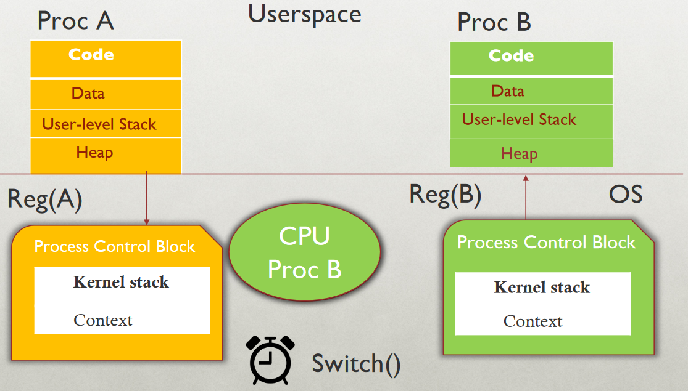

# Virtualization

## CPU Virtualization

 > **Core Idea:** Understand the different approaches for virtualizing the CPU.
 
### Process

> A *process* is an ***execution stream*** in the context of a *process state*. (A unit of scheduling in the CPU)

- What is an execution stream?
	- Stream of executing instructions
	- Running piece of code
	- "Thread of control"
- What is process state?
	- Everything that the running code can affect or be affect by
	- [Registers](../comp-arch/6-assembly#Data-Size-and-x86-64-Registers)
		- General purpose, floating point, status, PC, Stack pointer, etc...
		- Usually takes less than 1 ns, you can appx to 1 ns.
		- Compilers can do a pretty good job at putting variables in registers.
	- Address space
		- Any and **all** state of your program.
		- A small amount of your address space for the program may be in the register, but the rest will be in the cache or the memory.
		- Heap, stack, and code
	- Open Files

#### Processes vs Threads
- A process is different from a thread
- Thread: "Lightweight process" (LWP)
	- An execution stream that shares an address space.
	- Multiple threads within a single process.
- **Example:**
	- Two *processes* examining same memory address `0xffe84264` see *different* values (I.e different contents)
	- Two *threads* examining memory address `0xffe84264` will see the *same* value. (I.e. same contents)

### Process Memory Segments
- The OS allocates memory for each process - ie. a running program -- for data and code
- This memory consists of different segments
- Stack - for local variables -- incl. command line arguments and environment variables
- Heap - for dynamic memory
- Data segment for -- global uninitialized variables (`.bss`) -- global initialized variables (`.data`)
- Code segment typically read-only

## Virtualizing the CPU

> **Goal:** Give each process impression it alone is actively using CPU.

- Resources can be shared in **time** and **space**.
- Assume single uniprocessor
	- Time-sharing (multi-processors: advanced issue)
- Memory?
	- Space-sharing (later)
- Disk?
	- Space-sharing (later)

### How to Provide Good CPU Performance?
- **Direct execution** - Best performance, but no safety checks
	- Allow user process to run directly on hardware.
	- OS creates process and transfers control to starting point (ie main())
- Problems with direct execution?
	- Process could do something restricted
		- Read/write other process data (disk or memory)
	- Process could run forever (slow, buggy, or malicious)
		- OS needs to be able to switch between processes
	- Process could do something slow (like I/O)
		- OS wants to use resources efficiently and switch CPU to other process.

> *Solution* - Limited Direct Execution

## Problems

### 1: Restricted OPS

How can we ensure user process can't harm others?

> Solution - Privelege levels supported by hardware (bit of status)

- User processes run in user mode (restricted mode)
	- Any program running here is generally considered untrusted
	- Ring Levels #todo find pic
- OS runs in kernel mode (not restricted)
	- Instructions for interacting with devices
	- Could have many privelege levels (advanced topic)

- How can process access device? -> System calls and change privilege level through sys calls. (trap)

**System call** -

`read()` --assembly--> `movl $6 %eax;  int $64`

##### System Call

```OS
syscall() {
	sysnum = %eax
	sys_handle= get_fn_table(sysnum) // see below
	sys_handle()
}
```

###### Syscall Table

| Num | Function  |
| --- | --------- |
| 6   | sys_read  |
| 7   | sys_write |
|     |           |
|     |           |

#### What to Limit

- User processes are not allowed to perform:
	- General memory access
	- Disk I/O
	- Special `x86` instructions like `lidt`
- *What if processes try to do something restricted?*

### 2: CPU Away
- OS requirements for **multiprogramming** (or multitasking)
	- Mechanism
		- To switch between processes.
	- Policy
		- To decide which process to schedule when when
- Separation of policy and mechanism
	- *Reoccurring theme in OS*
	- **Policy: Decision-maker to optimize some workload performance metric**
		- Which process when?
		- Process **Scheduler:** Future lecture
	- **Mechanism: Low-level code that implements the decision**
		- How?
		- Process *Dispatcher*: Today's lecture

#### Dispatch Mechanism

OS runs *dispatch loop*

```pseudo
while(1) {
	run process A for some time-slice
	stop process A and save its context \   Context-
	load context of another process B   /    switch
}
```

##### Question 1

**How does dispatcher gain control?**

- Option 1: *Cooperative Multi-tasking*
	- Trust process to relinquish CPU to OS through traps.
		- Examples: System call, page fault (access page not in main memory), or error (illegal instruction or divide by zero)
		- Provide special `yield()` system call
	- **Problem with cooperative approach?**
		- Programs can misbehave:
			- By avoiding all traps and performing no I/O, can take over entire machine.
			- Only solution: REBOOT!
		- Not performed in modern OS
- Option 2: *True Multi-tasking*
	- Guarantee OS can obtain control periodically
	- Enter OS by enabling periodic alarm clock
		- Hardware generates timer interrupt (CPU or separate chip)
	- User must not able able to mask timer interrupt
	- Dispatcher counts interrupts between context switches
		- Example: Waiting 20 timer ticks gives `200` ms time slice.
		- Common time slices range form 10 ms to 200 ms.

##### Question 2

**What execution context must be saved and restored?**

- Dispatcher must track context of process when not running.
	- Save context in *process control block (PCB)* (or, process descriptor)
	- PCB is a structure maintained for each process in the OS
- What information is stored in PCB?
	- Process ID `pid`
	- Process state (I.e. running, ready, or blocked)
	- Execution state (all registers, PC, stack `ptr`) -- context
	- Scheduling priority
	- Accounting information (parent and child processes)
	- Credentials (which resources can be accessed, owner)
	- Pointers to other allocated resources (e.g. open files)
- Requires special hardware support
	- Hardware saves process *PC* and *PSR* on interrupts

##### Question 3

**How is Context saved?**

```C
// The information xv6 tracks about each process
// including its register context and state
struct proc {
	char *mem;                      // start of process memory
	uint sz;                        // size of process memory
	char *kstack;                   // bottom of kernel stack for this process
	enum proc_state state;          // Process state
	int pid;                        // Process id
	struct proc *parent;            // parent process
	int killed;                     // If non-zero, have been killed
	struct file *ofile[NOFILE];     // open files
	struct inode *cwd;              // current directory
	struct context context;         // Switch here to run process
	struct trapframe *tf;           // trap frame for the current interrupt
};
```



##### Question 4

**What context must be saved?**

```C
// the registers will save and restore
// to stop and subsequently restart a process
struct context {
	int eip; // Index pointer register
	int esp; // stack pointer register
	int ebx; // called the base register
	int ecx; // called the counter register
	int edx; // called the data register
	int esi; // source index register
	int edi; // Destination index register
	int ebp; // stack base pointer register
};

// the different states a process can be in
enum proc_state {
	UNUSED, EMBRYO, SLEEPING, RUNNABLE, RUNNING, ZOMBIE
}
```

| Operating System                        | Hardware                           | Program   |
| --------------------------------------- | ---------------------------------- | --------- |
|                                         |                                    | Process A |
|                                         | timer interrupt                    | ...       |
|                                         | save `regs(A)` to `k-stack(A)`     |           |
|                                         | move to kernel mode                |           |
|                                         | jump to trap handler               |           |
| Handle the trap                         |                                    |           |
| Call `switch()` routine                 |                                    |           |
| save `regs(A)` to `proc-struct(A)`      |                                    |           |
| restore `regs(B)` from `proc-struct(B)` |                                    |           |
| switch to `k-stack(B)`                  |                                    |           |
| `return-from-trap` (into B)             |                                    |           |
|                                         | restore `regs(B)`from `k-stack(B)` |           |
|                                         | move to user mode                  |           |
|                                         | jump to B's IP                     |           |
|                                         |                                    | Process B |
|                                         |                                    | ...       |

### 3: Slow Operations
- When running process performs operations that does not use CPU, OS switches to process that needs CPU (policy issues)
- OS must track mode of each process:
	- *Running:*
		- On the CPU (only one on a uniprocessor)
	- *Ready:*
		- Waiting for the CPU
	- *Blocked:*
		- Asleep: Waiting for I/O on synchronization to complete.

---

## Scheduling

### Agenda
- What are different scheduling policies, such as:
	- FCFS, SJF, STCF, RR and MLFQ
- What type of workload performs well with each scheduler?
- What scheduler does Linux currently use?

### Terminology

#### Workload
- Set of **job** descriptions (arrival time, run_time)
	- Job: View as current CPU burst of a process.
	- Process alternates between CPU and I/O process moves between ready and blocked queues.

#### Scheduler
- Logic that decides which ready job to run
- Metric
	- Measurement of ... #todo fill out


### Scheduling Performance Metrics

#### Minimizing Turnaround Time
- Do not want to wait long for job to complete.
- **Completion_time = arrival_time**

#### Minimizing Response Time
- Schedule interactive jobs promptly so users see output quickly.
- **Initial_schedule_time = arrival_time**

#### Minimizing Waiting Time
- Do not want to spend much time in Ready queue.

#### Maximize Throughput
- Want many jobs to complete per unit of time.
#### Maximize Resource Utilization
- Keep expensive devices busy

#### Minimize Overhead
- Reduce number of context switches

#### Maximize Fairness
- All jobs get the same amount of CPU time.

### Workload Assumptions
1. Each job runs for the same amount of time.
2. All jobs arrive at the same time.
3. All jobs only use the CPU (no I/O)
4. Run-time of each job is known

### Scheduling Basics

- **Workload**
	- `arrival_time`
	- `run_time`
- #todo find these


### FIFO
- **aka** First in First Out or **FCFS** (First come first serve)
- Run jobs in `arrival_time` order.

##### FIFO Turnaround

`completion_time - arrival_time`

- You must take the average for Turnaround time as each task will finish at different times.

###### Example

| Job | arrival_time | run_time |
|:----|:-------------|:---------|
| A   | ~0           |       60 |
| B   | ~0           |       10 |
| C   | ~0           |       10 |  

> In this case, the turnaround time would be ~20 seconds.

### SJF
- Shortest Job First Scheduler
- **Choose the task with the shortest time**

##### SJF Turnaround

| Job | arrival_time | run_time |
|:----|:-------------|:---------|
| A   | ~0           |       60 |
| B   | ~0           |       10 |
| C   | ~0           |       10 |  

> In this case, the runtime would be (10s + 20s + 80s) /3 = 36.7s avg.


---

> Past here, we will not assume part 1 and 2 of the workload.


---

### Preemptive Scheduling

- Previous schedulers:
	- FIFO and SJF are non-preemptive
	- Only schedule new jobs when previous job voluntarily relinquishes CPU (Performs I/O or exits)
- New Scheduler:
	- Preemptive: Potentially schedule different jobs at any point by taking CPU away from running job.

**