# [Virtualization](0-os-design)

## CPU Virtualization

 > **Core Idea:** Understand the different approaches for virtualizing the CPU.
 
### Process

---

> For previous info on [*processes*](../sys-prog/the-shell#Processes), and from [compiled](../sys-prog/final-exam#Processes).

---


> A *process* is an ***execution stream*** in the context of a *process state*. (A unit of scheduling in the CPU)

- What is an execution stream?
	- Stream of executing instructions
	- Running piece of code
	- "Thread of control"
- What is process state?
	- Everything that the running code can affect or be affect by
	- [Registers](../comp-arch/6-assembly#Data-Size-and-x86-64-Registers)
		- General purpose, floating point, status, PC, Stack pointer, etc...
		- Usually takes less than 1 ns, you can appx to 1 ns.
		- Compilers can do a pretty good job at putting variables in registers.
	- Address space
		- Any and **all** state of your program.
		- A small amount of your address space for the program may be in the register, but the rest will be in the cache or the memory.
		- Heap, stack, and code
	- Open Files

#### Processes vs Threads
- A process is different from a thread
- Thread: "Lightweight process" (LWP)
	- An execution stream that shares an address space.
	- Multiple threads within a single process.
- **Example:**
	- Two *processes* examining same memory address `0xffe84264` see *different* values (I.e different contents)
	- Two *threads* examining memory address `0xffe84264` will see the *same* value. (I.e. same contents)

### Process Memory Segments
- The OS allocates memory for each process - ie. a running program -- for data and code
- This memory consists of different segments
- Stack - for local variables -- incl. command line arguments and environment variables
- Heap - for dynamic memory
- Data segment for -- global uninitialized variables (`.bss`) -- global initialized variables (`.data`)
- Code segment typically read-only

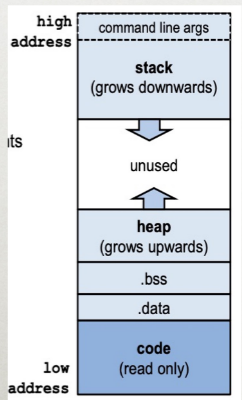

## Virtualizing the CPU

> **Goal:** Give each process impression it alone is actively using CPU.

- Resources can be shared in **time** and **space**.
- Assume single uniprocessor
	- Time-sharing (multi-processors: advanced issue)
- Memory?
	- Space-sharing (later)
- Disk?
	- Space-sharing (later)

### How to Provide Good CPU Performance?
- **Direct execution** - Best performance, but no safety checks
	- Allow user process to run directly on hardware.
	- OS creates process and transfers control to starting point (ie main())
- Problems with direct execution?
	- Process could do something restricted
		- Read/write other process data (disk or memory)
	- Process could run forever (slow, buggy, or malicious)
		- OS needs to be able to switch between processes
	- Process could do something slow (like I/O)
		- OS wants to use resources efficiently and switch CPU to other process.

> *Solution* - Limited Direct Execution

## Problems

### 1: Restricted OPS

How can we ensure user process can't harm others?

> Solution - Privelege levels supported by hardware (bit of status)

- User processes run in user mode (restricted mode)
	- Any program running here is generally considered untrusted
	- Ring Levels #todo find pic
- OS runs in kernel mode (not restricted)
	- Instructions for interacting with devices
	- Could have many privelege levels (advanced topic)

- How can process access device? -> System calls and change privilege level through sys calls. (trap)

**System call** -

`read()` --assembly--> `movl $6 %eax;  int $64`

##### System Call

```OS
syscall() {
	sysnum = %eax
	sys_handle= get_fn_table(sysnum) // see below
	sys_handle()
}
```

###### Syscall Table

| Num | Function  |
| --- | --------- |
| 6   | sys_read  |
| 7   | sys_write |

#### What to Limit

- User processes are not allowed to perform:
	- General memory access
	- Disk I/O
	- Special `x86` instructions like `lidt`
- *What if processes try to do something restricted?*

### 2: CPU Away
- OS requirements for **multiprogramming** (or multitasking)
	- Mechanism
		- To switch between processes.
	- Policy
		- To decide which process to schedule when when
- Separation of policy and mechanism
	- *Reoccurring theme in OS*
	- **Policy: Decision-maker to optimize some workload performance metric**
		- Which process when?
		- Process **Scheduler:** Future lecture
	- **Mechanism: Low-level code that implements the decision**
		- How?
		- Process *Dispatcher*: Today's lecture

#### Dispatch Mechanism

OS runs *dispatch loop*

```pseudo
while(1) {
	run process A for some time-slice
	stop process A and save its context \   Context-
	load context of another process B   /    switch
}
```

##### Question 1

**How does dispatcher gain control?**

- Option 1: *Cooperative Multi-tasking*
	- Trust process to relinquish CPU to OS through traps.
		- Examples: System call, page fault (access page not in main memory), or error (illegal instruction or divide by zero)
		- Provide special `yield()` system call
	- **Problem with cooperative approach?**
		- Programs can misbehave:
			- By avoiding all traps and performing no I/O, can take over entire machine.
			- Only solution: REBOOT!
		- Not performed in modern OS
- Option 2: *True Multi-tasking*
	- Guarantee OS can obtain control periodically
	- Enter OS by enabling periodic alarm clock
		- Hardware generates timer interrupt (CPU or separate chip)
	- User must not able able to mask timer interrupt
	- Dispatcher counts interrupts between context switches
		- Example: Waiting 20 timer ticks gives `200` ms time slice.
		- Common time slices range form 10 ms to 200 ms.

##### Question 2

**What execution context must be saved and restored?**

- Dispatcher must track context of process when not running.
	- Save context in *process control block (PCB)* (or, process descriptor)
	- PCB is a structure maintained for each process in the OS
- What information is stored in PCB?
	- Process ID `pid`
	- Process state (I.e. running, ready, or blocked)
	- Execution state (all registers, PC, stack `ptr`) -- context
	- Scheduling priority
	- Accounting information (parent and child processes)
	- Credentials (which resources can be accessed, owner)
	- Pointers to other allocated resources (e.g. open files)
- Requires special hardware support
	- Hardware saves process *PC* and *PSR* on interrupts

##### Question 3

**How is Context saved?**

```C
// The information xv6 tracks about each process
// including its register context and state
struct proc {
	char *mem;                      // start of process memory
	uint sz;                        // size of process memory
	char *kstack;                   // bottom of kernel stack for this process
	enum proc_state state;          // Process state
	int pid;                        // Process id
	struct proc *parent;            // parent process
	int killed;                     // If non-zero, have been killed
	struct file *ofile[NOFILE];     // open files
	struct inode *cwd;              // current directory
	struct context context;         // Switch here to run process
	struct trapframe *tf;           // trap frame for the current interrupt
};
```

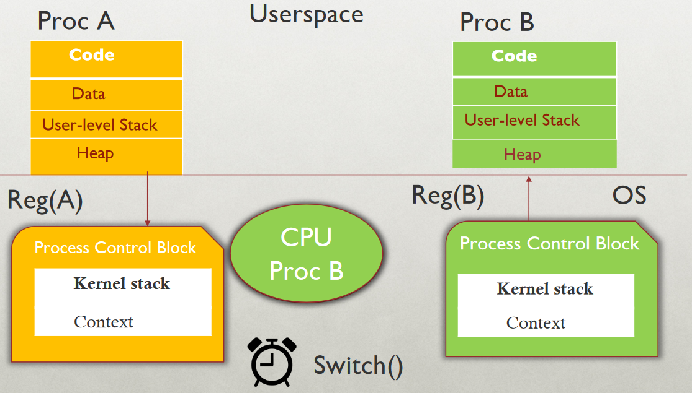

- Process A has moved from user to kernel mode, OS decides it must switch from A to B 
- Save context (PC, registers, kernel stack pointer) of A on kernel stack
- Switch SP to kernel stack of B
- Restore context from B’s kernel stack  
- Who has saved registers on B’s kernel stack?  
	- OS did, when it switched out B in the past
- Now, CPU is running B in kernel mode, return-from-trap to switch to user mode of B

##### Question 4

**What context must be saved?**

```C
// the registers will save and restore
// to stop and subsequently restart a process
struct context {
	int eip; // Index pointer register
	int esp; // stack pointer register
	int ebx; // called the base register
	int ecx; // called the counter register
	int edx; // called the data register
	int esi; // source index register
	int edi; // Destination index register
	int ebp; // stack base pointer register
};

// the different states a process can be in
enum proc_state {
	UNUSED, EMBRYO, SLEEPING, RUNNABLE, RUNNING, ZOMBIE
}
```

| Operating System                        | Hardware                           | Program   |
| --------------------------------------- | ---------------------------------- | --------- |
|                                         |                                    | Process A |
|                                         | timer interrupt                    | ...       |
|                                         | save `regs(A)` to `k-stack(A)`     |           |
|                                         | move to kernel mode                |           |
|                                         | jump to trap handler               |           |
| Handle the trap                         |                                    |           |
| Call `switch()` routine                 |                                    |           |
| save `regs(A)` to `proc-struct(A)`      |                                    |           |
| restore `regs(B)` from `proc-struct(B)` |                                    |           |
| switch to `k-stack(B)`                  |                                    |           |
| `return-from-trap` (into B)             |                                    |           |
|                                         | restore `regs(B)`from `k-stack(B)` |           |
|                                         | move to user mode                  |           |
|                                         | jump to B's IP                     |           |
|                                         |                                    | Process B |
|                                         |                                    | ...       |

### 3: Slow Operations
- When running process performs operations that does not use CPU, OS switches to process that needs CPU (policy issues)
- OS must track mode of each process:
	- *Running:*
		- On the CPU (only one on a uniprocessor)
	- *Ready:*
		- Waiting for the CPU
	- *Blocked:*
		- Asleep: Waiting for I/O on synchronization to complete.


#### State Transitions

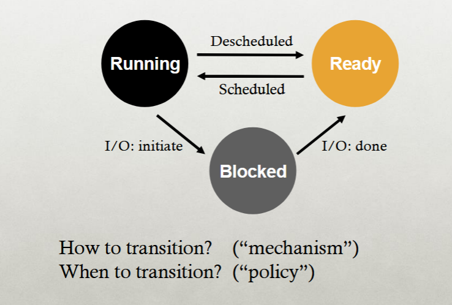

##### OS Tasks
- The OS must track every process in the system.
	- Each process is identified by a unique Process ID (PID)
- OS maintains queues of all processes.
	- Ready Queue: Contains all ready processes.
	- Event Queue: One logical queue per event.
		- e.g. disk I/O and locks.
		- Contains all processes waiting for that event to complete.


### Summary
- **Virtualization**
	- The process of Virtualization and context switching gives each process the impression that it has its own CPU.
- Direct execution makes processes fast.
- Limited execution at key points to ensure OS retains control.
- **Hardware provides a lot of OS Support**
	- User vs kernel mode
	- timer interrupts
	- automatic register saving.


## Process Creation
- **Two ways** to create a process.
	- Build a new empty process from scratch.
	- Copy an existing process and change it appropriately.

### Build New Process

#### Steps
- Load specific code and data into memory and create an empty call stack.
- Create and initialize PCB (make look like context-switch)
- Put process on ready list.

#### Advantages & Disadvantages
- **Advantage:** No wasted work.
- **Disadvantage:** Difficult to setup process correctly and to express all possible options.
	- Process permissions, where to write I/O, environment variables.
	- Example: WindowsNT has call with 10 arguments.

### Clone Existing Process
- Clone an existing process and change it.
- **Example:** Unix `fork()` and `exec()`.
	- `fork()` - Clones calling process.
	- `exec(char *file)` - Overlays file image on calling process.

#### `fork()`
- Stops current process and save its state.
- Make copy of code, data, stack and PCB.
- Add new PCB to ready list.
- Any changes needed to child process?

##### `Exec(char *file)`
- Replace current data and code segments with those in specified file.

#### Advantages & Disadvantages
- **Advantage:** Flexible, clean, simple
- **Disadvantage** Wasteful to perform copy and then overwrite of memory.

---

### Unix Process Creation

- How are Unix shells implemented??

```C

while(1) {
	char *cmd = getcmd();
	int retval = fork();
	if(retval == 0) {
	// This is the child process
	// Set up child process' environment here
	// E.g where is standard I/O, how to handle signals? 
	exec(cmd);
	// Exec does not return if it succeeds.
	printf("Error: Could not execute %s\n", cmd);
	exit(1);
	} else {
	// This is the parent process, wait for tthe child to finish.
	int pid = retval;
	wait(pid);
	}
}
```


## Stack Detour

### IA32/Linux Stack Frame
- **Current Stack Frame** ("Top" to Bottom)
	- "Argument build" area (parameters for function about to be called)
	- Local variables (if can't be kept in registers)
	- Saved register context (when reusing registers)
	- Old frame pointer (for caller)
- **Caller's Stack Frame**
	- Return address
		- Pushed by `call` instruction
	- Arguments for this call

---

- The stack grows downward (*from higher to lower memory addresses*)
- The frame pointer (`%ebp`) points to the old `%ebp` value in the current frame.
- The stack pointer (`%ebp`) points to the top of the stack, which is the argument build area.
- The 'call' instruction pushes the *return address* onto the stack.
- The frame pointer provides a **stable reference point** for accessing local variables and parameters.
- This structure allows for nested function calls and proper return to the calling function.

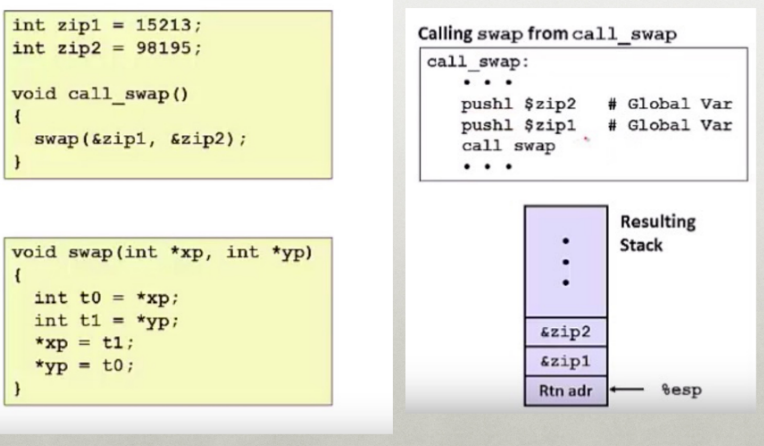

### Swap Setup 1

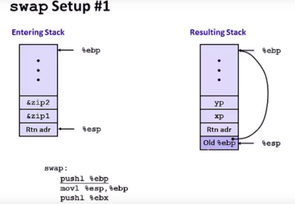

### Swap Setup 2

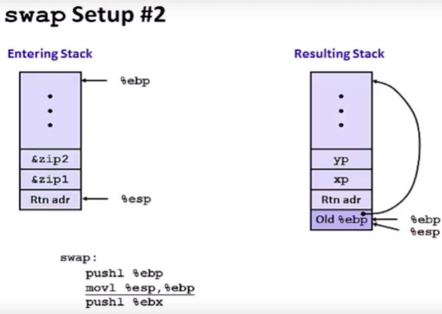

### Swap Setup 3

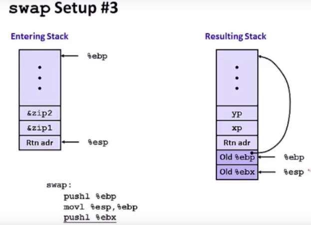

---

## Scheduling

### Agenda
- What are different scheduling policies, such as:
	- FCFS, SJF, STCF, RR and MLFQ
- What type of workload performs well with each scheduler?
- What scheduler does Linux currently use?

### Terminology

#### Workload
- Set of **job** descriptions (arrival time, run_time)
	- Job: View as current CPU burst of a process.
	- Process alternates between CPU and I/O process moves between ready and blocked queues.

#### Scheduler
- Logic that decides which ready job to run
- Metric
	- Measurement of scheduling quality


### Scheduling Performance Metrics

#### Minimizing Turnaround Time
- Do not want to wait long for job to complete.
- **Completion_time = arrival_time**

#### Minimizing Response Time
- Schedule interactive jobs promptly so users see output quickly.
- **Initial_schedule_time = arrival_time**

#### Minimizing Waiting Time
- Do not want to spend much time in Ready queue.

#### Maximize Throughput
- Want many jobs to complete per unit of time.
#### Maximize Resource Utilization
- Keep expensive devices busy

#### Minimize Overhead
- Reduce number of context switches

#### Maximize Fairness
- All jobs get the same amount of CPU time.

### Workload Assumptions
1. Each job runs for the same amount of time.
2. All jobs arrive at the same time.
3. All jobs only use the CPU (no I/O)
4. Run-time of each job is known

### Scheduling Basics

- **Workload**
	- `arrival_time`
	- `run_time`
- **Schedulers**
	- `FIFO`
	- `SJF`
	- `STCF`
	- `RR`
- **Metrics**
	- Turnaround time
	- Response time


### FIFO
- **aka** First in First Out or **FCFS** (First come first serve)
- Run jobs in `arrival_time` order.

##### FIFO Turnaround

> Def: `turnaround_time` = `completion_time - arrival_time`

- You must take the average for Turnaround time as each task will finish at different times.

###### Example

| Job | arrival_time | run_time |
|:----|:-------------|:---------|
| A   | ~0           |       60 |
| B   | ~0           |       10 |
| C   | ~0           |       10 |  

> In this case, the turnaround time would be ~20 seconds.

#### Convoy Affect

- **Passing the Tractor**
	- FIFO: Turnaround time can suffer when short jobs have to wait for long jobs...
- *New Scheduler*

### SJF
- Shortest Job First Scheduler
- **Choose the task with the shortest time**

##### SJF Turnaround

| Job | arrival_time | run_time |
|:----|:-------------|:---------|
| A   | ~0           |       60 |
| B   | ~0           |       10 |
| C   | ~0           |       10 |  

> In this case, the runtime would be (10s + 20s + 80s) /3 = 36.7s avg.


---

> Past here, we will not assume part 1 and 2 of the workload.


---

#### SJF W/(Arrival Time)

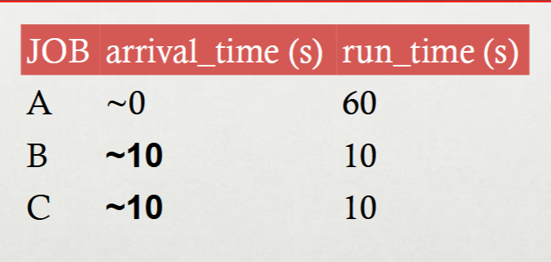

- What is the average turnaround time here?
- **Stuck behind a tractor again**

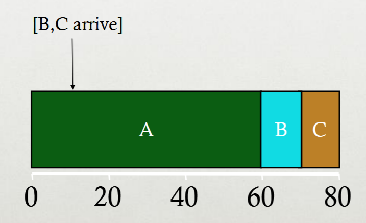

> (60 + (70 – 10) + (80 – 10)) / 3 = 63.3s


### Preemptive Scheduling

- Previous schedulers:
	- FIFO and SJF are non-preemptive
	- Only schedule new jobs when previous job voluntarily relinquishes CPU (Performs I/O or exits)
- New Scheduler:
	- Preemptive: Potentially schedule different jobs at any point by taking CPU away from running job.
	- STCF (Shortest Time-to-Completion first)
	- **Always** run job that will complete the quickest.

### STCF Scheduler

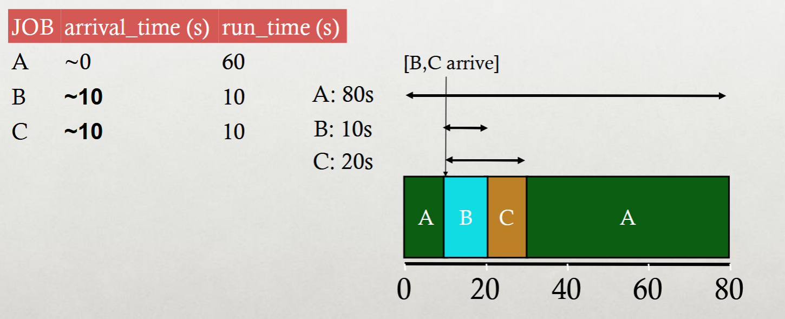

- Avg Turnaround time here: 36.6s...
- With SJF it *was* 63.3s.

## Response Time
- Sometimes we care about when job starts instead of when it finishes...

*New Metric:* `response_time = first_run_time - arrival_time`

##### Response v Turnaround

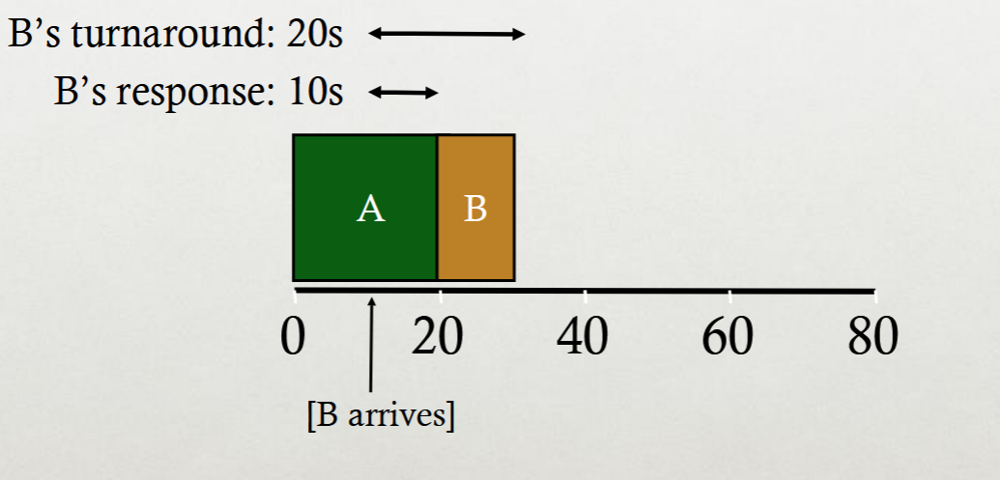

### Round Robin Scheduler

- **Previous schedulers:**
	- FIFO, SJF, STCF can have poor *response times*
- **New Scheduler:** RR (Round Robin)
		- Alternate ready processes every fixed-length time slice.

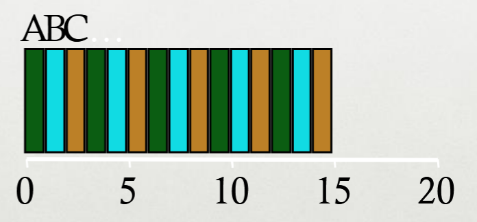

---

- *In what way* is RR worse?
	- Average turnaround time with equal length jobs is **horrible**
- Other reasons why RR could be better?
	- If we don't know the runtime of each job, it gives shorter jobs a chance to run and finish first.

#### Why is Preemption hard in GPUs?

##### Massive Parallelism
- Thousands of threads run simultaneously
- Saving and restoring thread states during context switches is computationally expensive

##### Long-Running Kernels
- GPU tasks can run for extended periods
- High-priority tasks may experience delays waiting for these kernels to finish

##### High Overhead
- Preempting a task requires saving states (registers, memory)
- Restoring these states on resumption is resource-intensive, increasing the overhead.

## MLFQ

- **Multi-level Feedback Queue**
- Goal: General-purpose scheduling
- Must support two job types with distinct goals:
	- "*interactive*" programs care about *response time*
	- "*batch*" programs care about *turnaround time*
- **Approach:** Multiple levels of round-robin
	- Each level has higher priority than lower levels and preempts them.
- MLFQ has a number of distinct queues.
- Each queue is assigned a different priority level.

#### Priorities

- **Rule 1:** If `priority(A) > priority(B)`, A runs
- **Rule 2:** If `priority(A) == priority(B)`, A & B run in RR

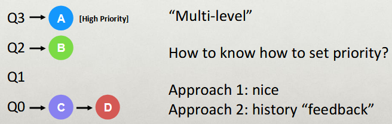

#### History

- Use past behavior of process to predict future behavior
	- Common technique in systems
- Processes alternate between I/O and CPU work
- Guess how CPU burst (job) will behave based on past CPU bursts (jobs) of this process.

#### More MLFQ Rules
- **Rule 3:** Processes start at top priority
- **Rule 4:** If job uses whole slice, demote process (longer time slices at lower priorities)


### Interactive Process (MLFQ)

- Interactive jobs perform quick operations and does I/O.
- As it does not use the entire time slice, the interactive jobs never get demoted...


#### Problems?
- Unforgiving + Starvation
	- Gaming the system
- **Low priority jobs may never get scheduled...**

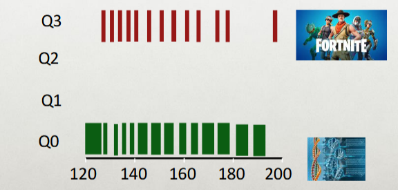

*Answer:* Periodically boost priority of all jobs (or all jobs that haven't been scheduled)

### Lottery Scheduling


**Goal: Proportional share**

- Fair-share scheduler
	- Guarantee that each job obtain *a certain percentage* of CPU time.
	- Not optimized for turnaround or response time.
- Approach
	- Give processes lottery tickets
	- Whoever wins runs
	- Higher priority == MORE TICKETS

> Amazingly simple to implement.

#### Tickets
- Represent the share of a resource that a process should receive
- *percent of tickets* represents its share of the system resource in question

**Example:**

- There are two processes: A and B
	- Process A has 75 tickets (Receive 75% of the CPU)
	- Process B has 25 tickets (Receive 25% of the CPU)

---

- The scheduler picks a *winning ticket*
	- Load the state of that winning process and runs it.

**Example:**

- There are 100 tickets
	- Process A has 64 tickets: 0-74
	- Process B has 25 tickets: 75-99


- Intuition
	- The longer these two jobs compete, the more likely they are to achieve the desired percentages.

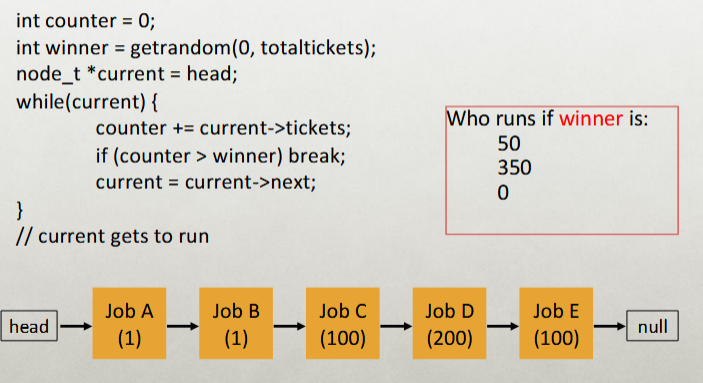

## Multiprocessor Scheduling
- The rise of multicore processor is the source of multiprocessor scheduling proliferation.
	- **Multicore:** Multiple CPU cores are packed onto a single chip.
- Adding more CPUS **DOES NOT** make that single application run faster.
	- Rewrite application to run in parallel, using *threads*

**How to schedule jobs on** ***MULTIPLE CPUs***?

### Caches (Multiprocessor)

> Previous info about [*caches*](../comp-arch/7-memory-hierarchy#Caches).

##### Single CPU with Cache

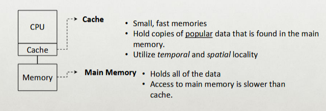

- By keeping data in cache, the system can make slow memory *appear to be a fast* one.

#### Cache Coherence
- Consistency of shared resource data stored in multiple caches.

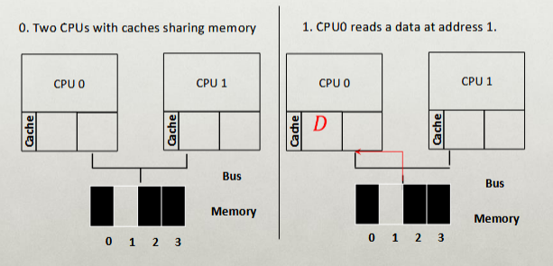

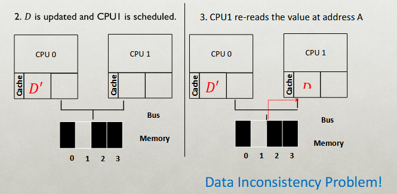

##### Cache Coherence Solution
- Bus snooping
	- Each cache pays attention to memory updates by **observing the bus**.
	- When a CPU sees an update for a data item it holds in its cache, it will notice the change and either *invalidate* its copy or *update* it.
- When accessing shared data across CPUs, mutual exclusion primitives should likely be used to *guarantee correctness.*


###### Don't Forget Synchronization!

> Read about [synchronization](3-concurrency#Synchronization).

```C
typedef struct __Node_t {
	int value;
	struct __Node_t *next;
} Node_t;

int List_Pop() {
	Node_t *tmp = head;       // Remember old head....
	int value = head->value;  // ... and its value
	head = head->next;        // advance head to next pointer
	free(tmp);                // free old head
	return value;
}
```

#### Cache Affinity

- Keep a process on the same CPU if at all possible
	- A process builds up a fair bit of state *in a cache* of a CPU.
	- The next time the process run, it will run faster if some of its state is *already present* in cache on that CPU.
- A **multiprocessor scheduler** should consider *cache affinity* when making its scheduling decision.


##### Cache Affinity Queue
- Put all jobs that need to be scheduled into a single queue.


- Each CPU simply picks the next job from the globally shared queue.
- Cons:
	- Some form of *locking* have to be inserted - **lack of scalability**
	- **Cache affinity**

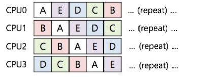

- **Preserving affinity** for most
	- Jobs A through D are not moved across processors.
	- Only job `E` migrates from CPU to CPU.
- Implementing such a scheme can be **complex**.

## MQMS

**Multi-queue Multiprocessor Sceduling**

- MQMS consists of multiple scheduling queues.
	- Each queue will follow a particular scheduling discipline.
	- When a job enters the system, it is placed on **exactly one** scheduling queue.
	- Avoid the problems of *information sharing* and *synchronization*.

- With RR (Round Robin), the system may produce a schedule that looks like this:

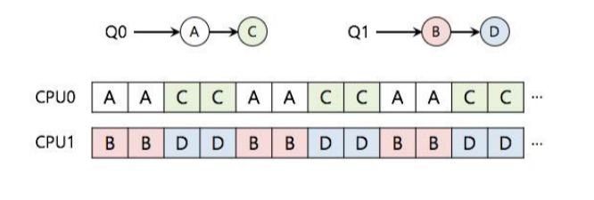

- MQMS provides more *scalability* and *cache affinity*.

## Completely Fair Scheduler
- Replaced the O(1) scheduler
	- In use since 2.6.23 and has O(log n) runtime.
- Moves from MLFQ to Weighted Fair queuing
	- First major OS to use a fair scheduling algorithm
	- Processes ordered by the amount of CPU time they use.
- Gets rid of queues in favor of [red-black tree](../data-structures/cs112#red-black-bsts) of processes.
- CFS isn't actually "*completely fair*"
	- Unfairness is bound `O(N)`

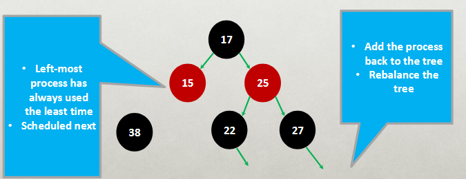

- CFS changes or removes time-slice allotment
	- Do away with time-slices completely.
	- Assign each process a proportion of the processor.
- CFS is based on a simple concept.
- Model scheduling as if the system had an ideal, perfectly multitasking processor.
	- Each process receives `1/n` of the processor's time, where `n` is the number of runnable processes.
	- Would be scheduled for infinitely small durations.
	- In any measurable period, all `n` processes would run for the same amount of time.

**Ideal processor possible?** - Why not?

- Rank processes based on their worth and need for processor time.
- Processes with a higher priority run before those with a lower priority.
- Linux has two priority ranges:
	- *Nice value:* Ranges from -20 to +10 (default is 0)
		- High values of nice means **lower** priority
	- Real-time priority: ranges from 0 to 99
		- Higher values mean **higher** priority
	- Real-time processes always executes before standard (nice) processes.


----

- Assume the targeted latency is 20 milliseconds.
- If there are two runnable tasks at the same priority.
	- Each will run for 10 milliseconds before preempting in favor of the other.
- If we have four tasks at the same priority.
	- Each will run for 5 milliseconds.
- If there are 20 tasks, each wilkl run for 1 millisecond.
- As the number of runnable tasks approaches infinity, the proportion of allotted processor and the assigned time slice approaches zero.
- **Problem???** (Solution: Run any tasks for a minimum of 1 millisecond)

#### Target Latency (TL)

- Minimum amount of time - idealized to an infinitely small duration - required for every runnable task to get at least one turn on the processor.
- Window where every process gets some CPU.

#### Minimum Granularity (MG)
- Imposes a floor on the time-slice assigned to each process
- For example: Run for 1 ms to ensure there is a ceiling on the incurred switching costs.
- Not perfectly fair when the number of processes grows so large.

---

- Given for instance a target latency of 20 ms.
- **Example 1:**
	- Two runnable processes of equal niceness, then both processes will run for 10 ms each before being pre-empted in favor of the other process.
- **Example 2:**
	- If there are 10 processes of equal niceness, each runs for 2 ms each.


### Preventing Gaming

- **Problem:** Higher priority job could trick scheduler and get more CPU by performing I/O right before the time-slice ends.
- **Fix:** Account for job's total run time at priority level (instead of just this time slice); downgrade when exceed threshold.

## Stack Detour

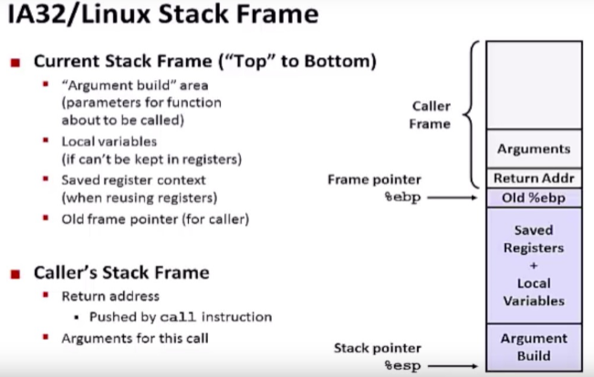

