# [Concurrency](0-os-design)

## Concurrency: Threads

> Previous info about [threads](../sys-prog/multithreading#Threads)

**Questions Answered:**

- Why is concurrency useful?
- What  is a thread and how does it differ from processes?
- What can go wrong if scheduling of critical sections is not atomic?

### Motivation for Concurrency

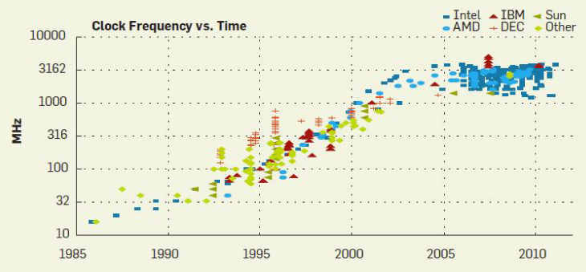

- The speeds of each CPU by itself sort of tapered off, and is no longer growing (individually)
- Needing more and more power
- Smaller and smaller transistors may leak power.
- Improving one CPU is a *General Purpose* approach.

**Goal:**

- Write applications that fully utilize many cores.

#### Option 1
- Build apps from many communicating **processes**.
	- Example: Chrome (process per tab)
	- Communicate via `pipe()` or similar.
- **Pros:** Don't need new abstractions; good for security
- **Cons?**
	- Cumbersome programming
	- High communication overheads
		- Programming becomes a lot harder
	- Expensive context switching (why expensive?)

#### Option 2
- **New abstraction:** ***thread***
- Threads are like processes, except:
	- Multiple threads of the same process share an address space.
- Divide large task across several cooperative threads.

### Common Programming Models

- Multi-threaded programs tend to be structured as:
- **Producer/consumer:**
	- Multiple producer threads create data (or work) that is handled by one of the multiple consumer threads.
	- *Example:* Matrix multiplication, producer thread makes the matrix, allocates the memory, and then gives it to consumer threads to work on.
- **Pipeline:**
	- Task is divided into series of subtasks, each of which is handled in series by a different thread.
	- Each following thread **does not wait** for the previous thread to finish.
	- Once some data is compile, it is passed to the next thread to start.
	- Assembly line for threads, but you don't just wait for the thread to complete, but just finish some intermediate step.
- **Defer work with background thread:**
	- One thread performs non-critical work in the background (when CPU idle)
	- *Only useful* if you want something to run way ahead.

### What do Threads Share?

- Everything in the address space. (PTBR)
- Shares code, but each thread may be executing *different code* at the *same time*
- Do they share Instruction Pointers?
	- **NO!** As they run in different CPUs, they have different IPs.
	- However, they *can* access another thread's IP.
- Do they share a stack pointer?
	- **NO!** Also bad practice to share stack pointers.

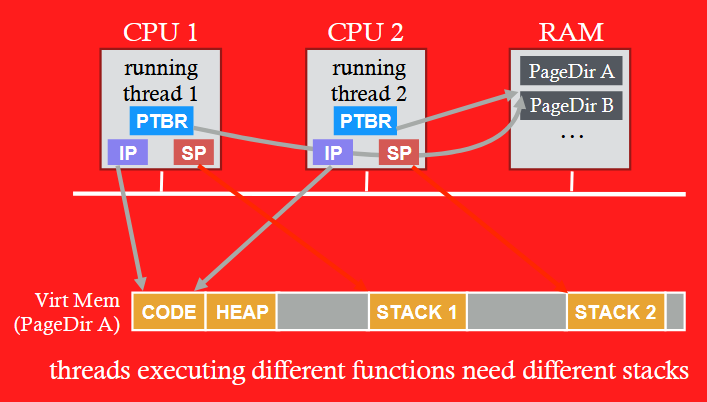

- **Multiple threads within a single process share:**
	- Process ID (PID)
	- Address space
		- Code (Instruction)
		- Most data (heap)
	- Open file descriptors
	- Current working directory
	- User and group id
- **Each thread has its own:**
	- Thread ID (TID)
	- Set of registers, including Program counter and Stack pointer.
	- Stack for local variables and return addresses. (in same address space)

##### Thread API

- Variety of thread systems exists
	- POSIX Pthreads
- Common thread operations.
	- Create
	- Exit
	- Join (Instead of `wait()` for processes)

### OS Support

#### Approach 1

##### User-Level Threads
- **Many-to-one** thread mapping
- Implemented by user-level runtime libraries.
	- Create, schedule, synchronize threads at user-level
- OS is not aware of user-level threads (You can make hundreds and thousands)
	- OS thinks each process contains only a single thread of control.

###### Advantages
- Does not require OS support; Portable
- Can tune scheduling policy to meet application demands
- Lower overhead thread operations since no system call

###### Disadvantages
- Cannot leverage multiprocessors
- Entire process blocks when one thread blocks

#### Approach 2

##### Kernel-level threads: One-to-one thread mapping  
- OS provides each user-level thread with a kernel thread
- Each kernel thread scheduled independently
- Thread operations (creation, scheduling, synchronization) performed by OS  

###### Advantages
- Each kernel-level thread can run in parallel on a multiprocessor  
- When one thread blocks, other threads from process can be scheduled  

###### Disadvantages  
- Higher overhead for thread operations
- OS must scale well with increasing number of thread

## Locks

#### Non-Determinism

> Previous notes on [non-determinism](../sys-prog/multithreading)

- Concurrency leads to non-deterministic results!
- [Race conditions](../sys-prog/multithreading#Race-Condition)

Whether a bug manifests depends on CPU schedule!

- Passing tests means little...
- How to program: Imagine scheduler is malicious.
- Assume scheduler will pick bad ordering at some point...

---

#### Program Verification


---

### What do we want?
- What 3 instructions to execute as an uninterruptable group
- That is, we want them (on the software layer) to execute atomically...

```assembly
mov 0x123, %eax
add %0x1, %eax                      // CRITICAL SECTION
mov %eax, 0x123
```

- I have some piece of code that, where there are multiple threads running at the same time, ONE MUST be serialized.

##### More Generally
- Need mutual exclusion for *critical sections*
	- If process `A` is in critical section `C`, process `B` can't.
	- (Okay if other processes do unrelated work)

### Synchronization
- Build higher-level synchronization primitives in OS
	- Operations that ensure correct ordering of instructions across threads.
- Motivation: Build them once and get them right.

### Mutex
- **Goal:** Provide mutual exclusion (Mutex)
- **Three common operations:**
	- Allocate and Initialize: `Pthred_mutex_t mylock = PTHREAD_MUTEX_INITIALIZER;`
- **Acquire:**
	- Acquire exclusion access to lock.
	- Wait if lock is not available (some other process in critical section)
	- *Spin* or *Block* (relinquish CPU) while waiting.
		- Block says, "I will delay my checking of the lock instead of perpetually checking"
	- `Pthread_mutex_lock(&mylock);`
- **Release:**
	- Release exclusive access to lock; let another process enter critical section.
	- `Pthread_mutex_unlock(&mylock);`

##### Other Examples
- Consider multi-threaded applications that do more than increment shared balance.
- Multi-threaded application with shared linked-list:
	- All **concurrent**:
		- Thread A inserting element a
		- Thread B inserting element b
		- Thread C looking up element c

#### Example: Shared Linked List Issues
1. Functionality is a problem (Visibility)
2. *Linked-list race*

##### Locking Linked Lists: Approach 1
- Consider everything to be in the critical section.

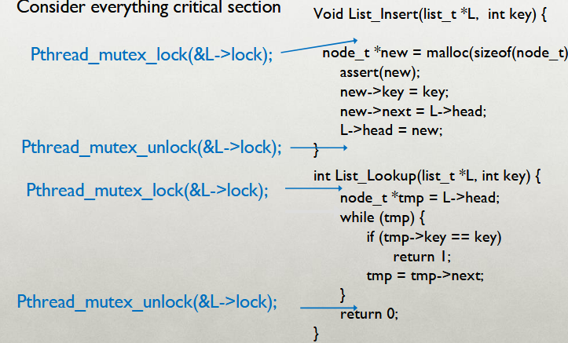

- However, this means other threads have to do a lot of waiting....
- *Can the critical section be smaller?*

##### Locking Linked Lists: Approach 2


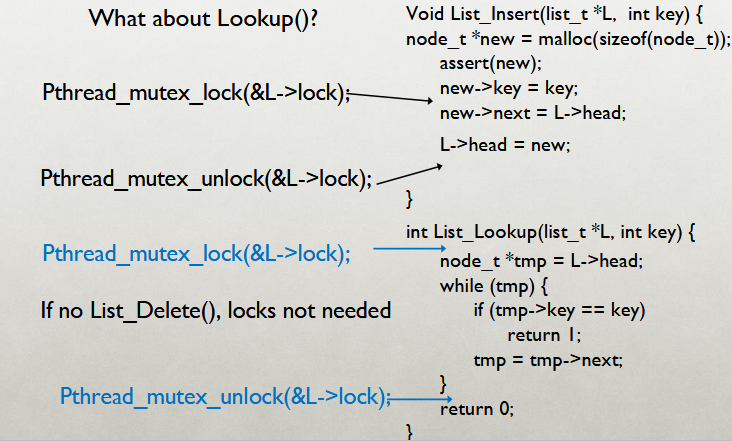

- `lookup()` is unable to be made any smaller due to the need to maintain the linked list in a undisturbed state when traversing through it.

## Implementing Synchronization
- Build Higher-level synchronization primitives in OS.
	- Operations that ensure correct ordering of instructions across threads.
- **Motivation:** Build them once and get them right.

#### Lock Implementation Goals
- **Correctness**
	- *Mutual Exclusion*
		- Only one trhead in critical section at a time.
	- *Progress (deadlock-free)*
		- If several simultaneous requests, must allow one to proceed.
	- *Bounded (starvation-free)*
		- Must eventually allow each waiting thread to enter.
- **Fairness**
	- Each thread waits for same amount of time
- **Performance**
	- CPU is not used unnecessarily (e.g. spinning)

### Implementing Synchronization
- To implement, we need atomic operations
	- **Atomic operation:** NO other instructions may be interleaved.
- *Examples of atomic operations*
	- Code between interrupts on uniprocessors.
		- Disable time interrupts, don't do any I/O
	- Loads and stores of words
		- `load r1, B`
		- `store r1, A`
	- **Special hw instructions**
		- Test & set
		- Compare & swap

#### Implementing Locks w/Interrupts
- **Turn off** interrupts for critical sections.
	- Prevent dispatcher from running another thread.
	- Code between interrupts executes atomically.

```C
void acquire(lockT *l) {
	disableInterrupts();
}
void release(lockT *l) {
	enableInterrupts();
}
```

- **Disadvantages**??
	- Only works on uniprocessors.
	- Process can keep control of CPU for arbitrary length.
	- Cannot perform other necessary work.

#### Implementing Locks w/Load + Store
- Code uses a single **shared** lock variable.

```C
boolean lock = false; // shared variable
void acquire(bool *lock) {
	while(*lock) /* wait */ ;
	*lock = true;
}
void release(bool *lock) {
	*lock = false;
}
```

- Why doesn't this works? Example schedule that fails with 2 threads?

##### Race Condition
- `*lock == 0` initially

| Thread 1             | Thread 2             |
| -------------------- | -------------------- |
| `while(*lock == 1);` |                      |
|                      | `while(*lock == 1);` |
|                      | `*lock = 1`          |
| `*lock = 1`          |                      |

- Both threads grab lock!
- **Problem:** Testing lock and setting locks are not atomic.

#### xchg:atomic exchange, or test-and-set

```C
// xchg(int *addr, int newval)
// return what was point to by addr
// at the same time, store newval into addr

int xchg(int *addr, int newval) {
	int old = *addr;
	*addr = newval;
	return old;
}

static inline uint xchg(volatile unsigned int *addr, unsigned int newval) {
	uint result;
	asm volatile("lock; xchgl %0, %1" : "+m" (*addr), "=a" (result) : "1" (newval): "cc");
	return result; 
}
```


##### Lock Implementation with XCHG

```C
typedef struct __lock_t {
	int flag;
} lock_t;

void init(lock_t *lock) {
	lock->flag = 0;
}

void acquire(lock_t *lock) {
	while(xchg(&lock->flag, 1) == 1);       //  int xchg(int *addr, int newval)
	// spin-wait (do nothing)
}

void release(lock_t *lock) {
	lock->flag = 0;
}
```

### Other Atomic HW Instructions
```C
int CompareAndSwap(int *addr, int expected, int new) {
	int actual = *addr;
	if(actual == expected) *addr = new;
	return actual;
}

void acquire(lock_t *lock) {
	while(CompareAndSwap(&lock->flag, 0, 1) == 1);
	// spin-wait (do nothing)
}
```

##### Basic Spinlocks are Unfair

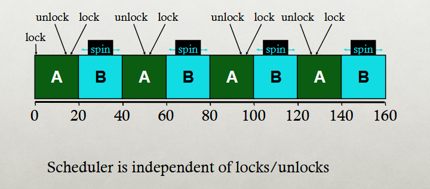

#### Fairness: Ticket Locks
- **Idea:** Reserve each thread's turn to use a lock.
- Each thread spins until their turn.
- Use new atomic primitive, fetch-and-add:

```C
int FetchAndAdd(int *ptr) {
	int old = *ptr;
	*ptr = old +1;
	return old;
}
```

- **Acquire**: Grab ticket;
- Spin while not thread's ticket != turn.
- **Release**: Advance to next turn.

##### Ticket Lock Example

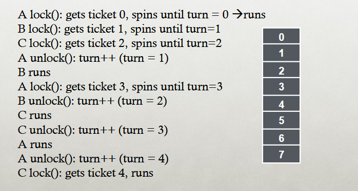

##### Ticket Lock Implementation

```C
typedef struct  __lock_t {
	int ticket;
	int turn;
}

void lock_init(lock_t *lock) {
	lock->ticket = 0;
	lock->turn = 0;
}

void acquire(lock_t *lock) {
	int myturn = FAA(&lock->ticket);
	while(lock->turn != myturn); // spin
}

void release(lock_t *lock) {
	FAA(&lock->turn);
}
```

### Spinlock Performance
- **Fast when...**
	- Many CPUs
	- Locks held a short time
	- Advantage: Avoid context switch
- **Slow when...**
	- one CPU
	- locks held a long time
	- Disadvantage: spinning is wasteful

#### CPU Scheduler is Ignorant

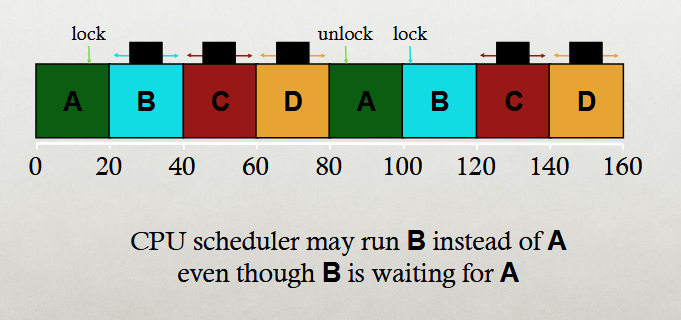

#### Ticket Lock With `Yield()`

```C
void acquire(lock_t *lock) {
	int myturn = FAA(&lock->ticket);
	while(lock->turn!=myturn) yield(); // This is it right here
}
```

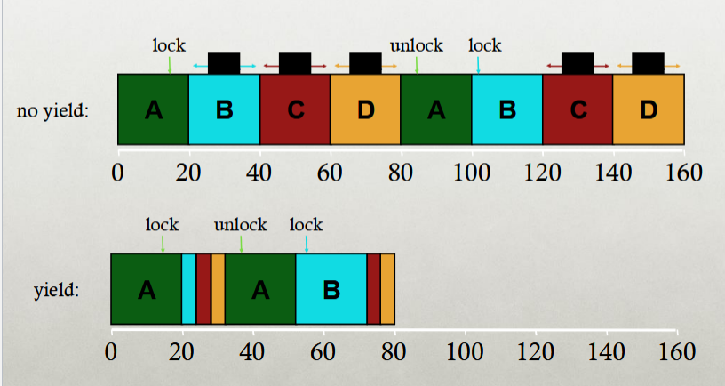

- **Waste:**
	- Without yield: O(thread \* time_slice)
	- With yield: O(threads \* context_switch)
- So, even without yield, spinning is slow with high thread contention.
- **Next improvement**: Block and put thread in waiting queue instead of spinning.

---

**Mutual exclusion:** (e.g. A and B don't run at the same time)

- Solved with *locks*

**Ordering:** (e.g. B runs after A does something)

- Solved with *condition variables* and *semaphores*


---

## Condition Variables

- `wait(cond_t *cv, mutex_t *lock)`
	- Assumes the lock is held when `wait()` is called.
	- Puts caller to sleep + releases the lock (atomically)
	- When awoken, reacquires lock before returning.
- `signal(cond_t *cv)`
	- Wakes a single waiting thread (if `>= 1` thread is waiting)
	- If there is no waiting thread, just return, doing nothing.

### Join Implementation: Correct

**Parent:**

```C
void thread_join() {
	mutex_lock(&m);          // W
	if (done == 0) {         // X
		cond_wait(&c, &m);   // Y
	}
	mutex_unlock(&m);        // Z
}
```


**Child:**

```C
void thread_exit() {
	mutex_lock(&m);         // a
	done = 1;               // b
	cond_signal(&c);        // c
	mutex_unlock(&m);       // d
}
```


> **Note:** `cond_wait` also releases mutex before waiting provided condition is not met yet.

| Parent: | w   | x   | y   |     |     |     |     | z   |
| ------- | --- | --- | --- | --- | --- | --- | --- | --- |
| Child:  |     |     |     | a   | b   | c   | d   |     |

**Use mutex** to ensure no race between interacting with `state` and `wait`/`signal`.

### Producer/Consumer Problem
- **Producers** generate data.
- **Consumers** grab data and process it.

**Use condition variables to:**

- Make producers wait when buffers are full.
- Make consumers wait when there is nothing to consume.

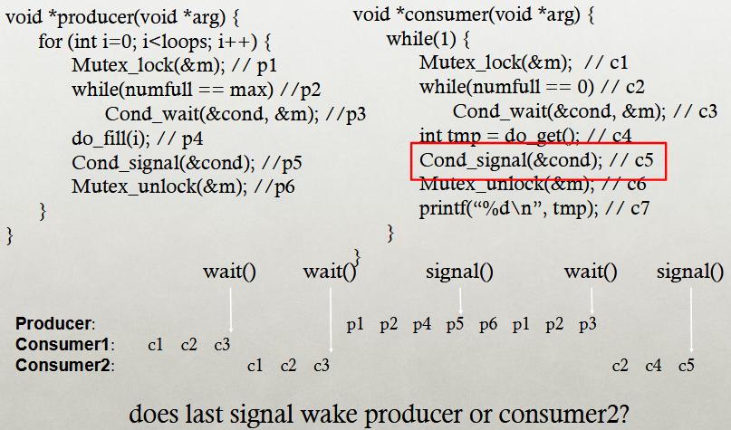

> Confused, why does this work? if the mutex is locked, how tf is the other producer thread running????


### Conditional Variable Rule of Thumbs
- Whenever a lock is acquired, *recheck* assumptions about state!
	- Use `while` instead of `if`
- Possible for another thread to grab lock between signal and wakeup from `wait`
	- `signal()` simply makes a thread **runnable**, does not guarantee the thread run next.
- Note that some libraries also have "*spurious wakeups*"
	- May wake multiple waiting threads at a signal or at any time.

---

- **Keep state** in addition to CV's
- **Always do wait/signal** with lock held.
- Whenever thread wakes from waiting, **recheck state**

---

### Condition Variables vs Semaphores
- **Condition Variables** have no state (other than waiting queue)
	- Programmer must track additional states.
- **Semaphores** have state: track integer value.
	- State cannot be directly accessed by user program, but state determines the behavior of semaphore operations.

## Semaphores

### Semaphore Operations

##### Allocate and Initialize

```C
sem_t sem;
sem_init(sem_t *s, int initval) {
	s->value = initval;
}
```

- User cannot read or write value directly after initialization.

##### Wait or Test
- *Sometimes `P()` for Dutch word*
- Waits until value of **semaphore** is `>` 0, then decrements sem value.

##### Signal or Increment or Post
- *Sometimes `V()` for Dutch*
- Increment sem value, then wake a single waiter.

### Join with CV vs Semaphores

**Conditional Variables:**

```C
void thread_join() {
	mutex_lock(&m);
	if(done == 0)
		cond_wait(&c, &m);
	mutex_unlock(&m);
}

void thread_exit() {
	mutex_lock(&m);
	done = 1;
	cond_signal(&c);
	mutex_unlock(&m);
}
```

**Semaphores:**

```C
sem_wait() // waits until value > 0, then decrement
sem_post() // increment value, then wake a single waiter

sem_t s;
sem_init(&s, ???);         // Init to 0, so sem_wait() must wait.

void thread_join() {
	sem_wait(&s);
}

void thread_exit() {
	sem_post(&s);
}
```

#### Equivalence Claim
- **Semaphores** are *equally powerful* to Locks + CVs.
	- What does this mean?
- One might be more convenient, but that's not relevant.
- Equivalence means each can be built from the other.


### Semaphore Cases

##### Case 1

- Simplest case:
	- Single producer thread, single consumer thread
	- Single shared buffer between producer and consumer.
- **Requirements:**
	- Consumer must wait for producer to fill buffer.
	- Producer must wait for consumer to empty buffer (if filled)
- **Require 2 Semaphores:**
	- `emptyBuffer`: Initialize to ???
		- 1 -> 1 empty buffer; producer can run 1 time first
	- `fullBuffer`: Initialize to ???
		- 0 -> 0 full buffers; consumer can run 0 times first

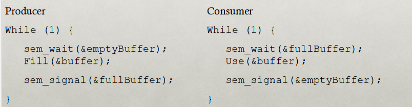

##### Case 2

- Next case: **Circular Buffer**
	- Single producer thread, single consumer thread.
	- Shared buffer with `N` elements between producer and consumer.
- Requires 2 Semaphores:
	- `emptyBuffer`: Initializes to ???
		- N -> N empty buffers; producer can run `N` times fast.
	- `fullBuffer`: Initialize to ???
		- 0 -> 0 full buffers; consumer can run 0 times fast

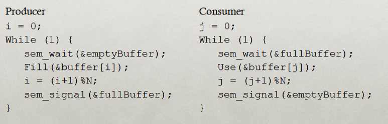

##### Case 3

- **Final case:**
	- Multiple producer threads, multiple consumer threads.
	- Shared buffer with `N` elements between producer and consumer.
- **Requirements:**
	- Each consumer must grab unique filled element.
	- Each producer must grab unique empty element.

