# [Memory Virtualization](0-os-design)

**Questions answered in this lecture:**

- What is in the address space of a process (review)?
- What are the different ways that the OS can virtualize memory?
	- Time sharing, static relocation, dynamic relocation.
		- (base, base + bounds, segmentation)
- What hardware support is needed for dynamic programming?

#### Linux Facts and Trivia
- Name an application that accelerated Linux adoption?
	- Webservers.
		- Linux schedules threads super well, and since loading each webpage requires a thread, it was more efficient to use Linux.
- Name of Google's Linux distribution for internal employee use?
	- Goobuntu (now replaced with *gLinux*)
- What percent of supercomputers use Linux?
	- 100%
- Is malloc a system call or a library call?
	- Library call

### General Virtualization
- In virtualization, you want to give the *illusion* of **private** resources.
- CPU Virtualization is the *illusion* of **private CPU registers**
- Memory Virtualization is the *illusion* of **private memory addresses**

#### Memory Virtualization History

##### Then
- 16 kbs of magnetic-core memory and 1 Processor.
- Developed virtual memory system to handle files on tape that were larger than the available memory on HP 2116 microcomputer.

##### Now
- The astronomer now stands in front of a datacenter system with 40 processor cores, 138 terabytes of storage capacity and 83 gigabytes of RAM.

#### Memory Is Expensive

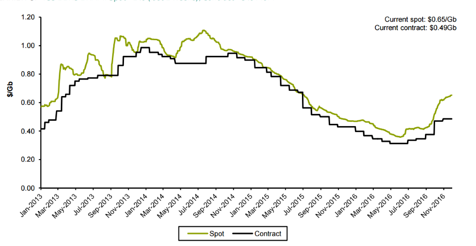

### Motivation for Virtualization
- **Uniprogramming:** One process runs at a time.

#todo get addr space breakdown.

#### Disadvantages
- Only one process runs at a time.

---

Why do processes need dynamic allocation of memory?

- Do not know amount of memory needed at compile time
- Must be pessimistic when allocate memory statically
	- Allocate enough for worst case; Storage is used inefficiently.

##### Recursive Procedures

- **Uniprogramming:** One process runs at a time.

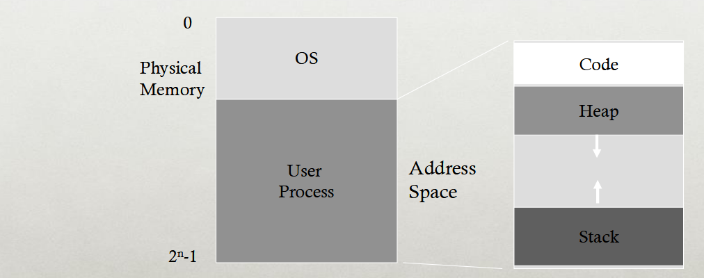

- **Disadvantages:**
	- Only one process runs at a time.
	- Process can destroy OS.

## Multiprogramming Goals

##### Transparency
- Processes are not aware that memory is shared.
- Works regardless of number and/or location of processes.

##### Protection
- Cannot corrupt OS or other processes.
	- Should not be able to change anything internally within the OS memory. `kmalloc()` (kernel malloc)
		- **OS** is trusted, processes are *untrusted*
- Privacy: Cannot read data of other processes.

##### Efficiency
- Do not waste memory resources (minimize fragmentation)

##### Sharing
- Cooperative processes can share portions of address space.
- *Although* you want to keep the processes separate, you should be able to allow sharing *memory* between two processes.


### Abstraction: Address Space

- **Address space:** Each process has set of addresses that map to bytes.
	- Address space has static and dynamic components.
		- *Static:* Code and some global variables.
		- *Dynamic:* Stack and Heap
- **Problem:**
	- How can OS provide illusion of private address space to each process?

### Motivation for Dynamic Memory
- Why do processes need dynamic allocation of memory?
	- Do not know amount of memory needed at compile time.
	- Must be pessimistic when allocate memory statically.
		- Allocate enough for worst possible case; Storage is *not* used efficiently.
- **Recursive procedures:**
	- Do not know how many times procedure will be nested.
- **Complex Data Structures**: Lists and trees.
- **Type types of dynamic allocation:**
	- Stack
	- Heap

#### Where Are Stacks Used?
- The OS uses stacks for procedure call frames (local variable and parameters)

```C
main() {
	int A = 0;
	foo (A);
	printf("A: %d\n", A);
}

void foo (int Z) {
	int A = 2;
	Z = 5;
	printf("A: %d Z: %d\n", A, Z);
}
```


---

## Heap Organization

**Definition:** Allocate from any random location: `malloc()`, `new()`

- Heap memory consists of allocated areas and free areas (holes)
	- **It is not necessarily sequentially done!!!**
- Order of allocation and free is unpredictable.

#### Advantage
- Works for all data structures.

#### Disadvantages
- Allocation can be slow.
- End up with small chunks of free space - fragmentation.
- Where to allocate 12 bytes? 16 bytes?? 24 bytes???

> What is the OS's role in managing heap? \
>> OS gives big chunk of free memory to process; library manages individual allocations.

- Every time you do a `mmap` or `sbreak`, you are doing a system call, which has significantly higher costs.
- This is why you do not go to the OS for every single memory allocation.

#### Quiz: Match that Address Space

```C
int x;
int main(int argc, char *argv[]) {
	int y;
	int *z = malloc(...);
}
```

| Address | Location    |
| ------- | ----------- |
| x       | Static data |
| main    | code        |
| y       | stack       |
| z       | stack       |
| \*z     | heap        |

```Assembly
0x10: movl  0x8(%rbp), %edi
0x13: addl  $0x3, %edi
0x19: movl %edi, 0x8(%rbp)
```

- In the code segment above, we have **two** memory references. (for the actual data being computed)
- **However, the code segments** are *also* in memory, meaning it would be **FIVE** memory references.

---

**Time to access memory:** 60-100 ns


---

## Virtualize Memory

**Problem:** How to run multiple processes simultaneously?

- Addresses are "hardcoded" into process binaries.
- How to avoid collisions??

Possible solutions for Mechanisms:

1. Time sharing
2. Static relocation
3. Base
4. Base+bounds
5. Segmentation

### Time Sharing of Memory
- Try similar approach to how OS virtualizes CPU.
- **Observation:**
	- OS gives illusion of many virtual CPUs by saving *CPU registers* to memory when process isn't running.
- Could give illusion of many virtual memories by saving *memory* to *disk* when process isn't running.

#### Problems with Time Sharing Memory
- **Problem:** Ridiculous poor performance.
	- You need to kick out every other process...
- Better alternative: space sharing
	- At same time, space of memory is divided across processes.
- **Remainder** of solutions all use space sharing.

### Static Relocation
- Idea; OS rewrites each program before loading it as a process in memory.
	- *Take program from disk* (before putting it into memory), use different addresses and different pointers.
- Each rewrite for different process uses different addresses and pointers.
	- So, you can run *two instances* of the program.
	- They each get their own heap, stack segments, etc...
- Change jumps, loads of static data.


> Better techniques out there, this ones old.


##### Layout in Memory

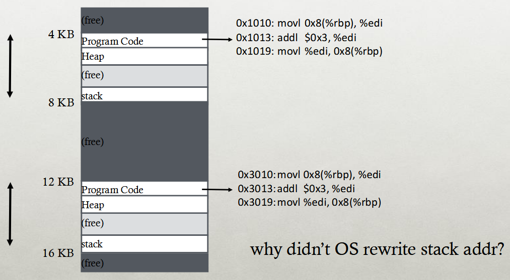

#### Disadvantages
- **No protection**
	- Processes can just go access other processes/ destroy the OS.
	- No privacy.
- Cannot move address space after it has been placed.
	- May not be able to allocate new process...
	- Heap should dynamically grow with the memory.

### Dynamic Relocation
- **Goal:** Protect processes from one another.
- **Requires hardware support**
	- Memory Management Unit (MMU)
		- Works with OS to provide a mechanism for dynamic memory addresses.
- MMU dynamically changes process address at every memory reference.
	- Process generates *logical* or *virtual* addresses (in their address space)
		- *Virtual Address* - some address that is a *proxy* to where the data is stored physically.
		- **Converts** the virtual address back to the physical address.
	- Memory hardware uses *physical* or *real* addresses.

---

**Trivia:**

- Who invented DRAM and when was it invented???
	- Robert Dennard, patent filed in 1968.
- **Why is it dynamic??**
	- DRAM depends on each capacitor-transistor circuit holding onto its charge until the data can be refreshed.

---

#### Hardware Support

- **Two operating modes**
	- *Privileged* (protected, kernel) mode: OS runs.
		- When enter OS (trap, system calls, interrrupts, exceptions)
		- Allows certain instructions to be executed.
			- **Can manipulate contents of MMU**
		- Allows OS to access all of physical memory.
	- *User mode*: User processes run.
		- Perform translation of logical address to physical address.


##### Implementation of Dynamic Relocation BASE REG

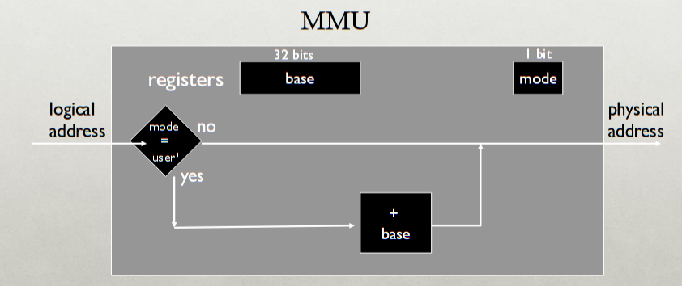

- **Idea:** Translate virtual addresses to physical by adding a fixed offset each time.
- Store offset in base register.
- Each process has different value in base register.

#### Visual Representation

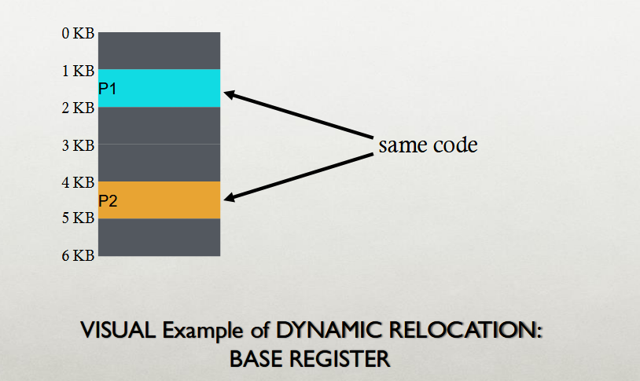

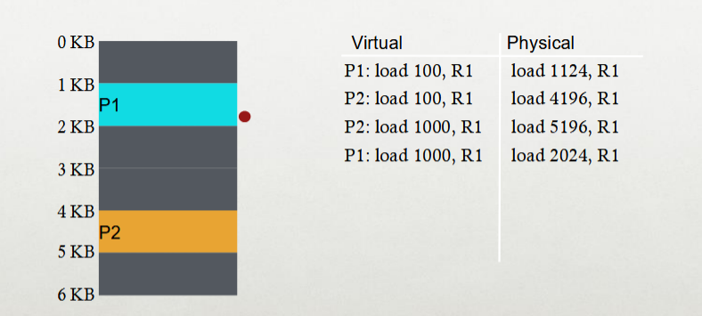

### Dynamic with Base+Bounds
- **Idea:** Limit the address space with a bounds register.
- **Base register:** Smaller physical address (or starting location)
- **Bounds Register:** Size of this process's virtual address space.
	- Sometimes defined as largest physical address (base + size)
- OS kills process if process loads/stores beyond bounds.

#### Implementation of BASE+BOUNDS

- **Translation** on every memory access of user process.
	- MMU compares logical address to bound register.
		- *If logical address is greater, then generate error*
	- MMU adds base register to logical address to form physical address.

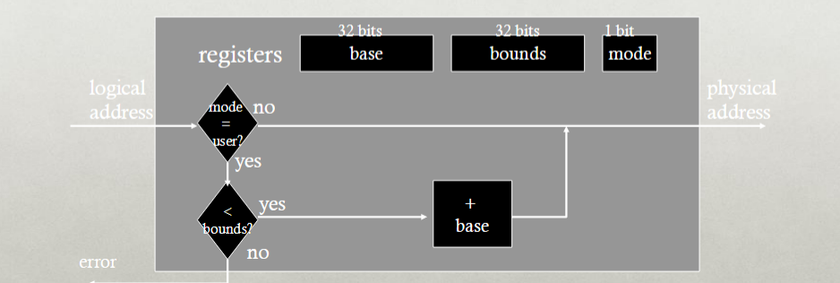

#### Managing Processes with Base+Bounds
- Context-switch
	- Add base+bound registers to PCB.
	- Steps:
		- Change to privileged mode.
		- Save Base+bounds registers of old process.
		- Load Base+bounds registers of new process.
		- Change to user mode and jump to new process.
- **What if don't change** Base+bounds registers when switch?
- Protection requirement
	- User process cannot change Base+bounds registers.
	- User process cannot change to privilege mode.

#### Base+Bounds Advantages
- Provides protection (both read and write) across address spaces.
- Support dynamic relocation.
	- Can place process at different locations initially and also move address spaces.
- Simple, inexpensive implementation.
	- Few registers, little logic in MMU.
- Fast
	- Add and compare in parallel.

#### Base+Bounds Disadvantages
- Each process must be allocated contiguously in physical memory.
	- Must allocate memory that may not be used by process.
- **No partial sharing:** Cannot share limited parts of address space.

### Segmentation
- Divide address space into logical segments.
	- Each segment corresponds to logical entity in address space.
		- Code, stack, heap.
- Each segment can independently:
	- Be placed separately in physical memory.
	- Grow and shrink.
	- Be protected (separate read/write/execute protection bits)

#### Segmented Addressing
- Process now specifies segment and offset within segment.
- How does process designate a particular segment?
	- Use part of logical address.
		- Top bits of logical address select segment.
		- Low bits of logical address select offset within segment.
- What if small address space, not enough bits?
	- Implicitly by type of memory reference.
	- Special registers.

#### Segmentation Implementation
- MMU contains Segment Table (per process)
	- Each segment has own base and bounds, protection bits.
	- Example: 14 bit logical address, 4 segments; how many bits for segment? How many bits for offset?

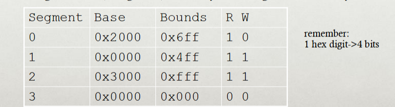

#### Advantages of Segmentation
- Enables sparse allocation of address space.
	- Stack and heap can grow independently.
	- Heap: if no data on free list, dynamic memory allocator requests more from OS (e.g. UNIX: malloc calls `sbrk()`)
	- Stack: OS recognizes reference outside legal segment, extends stack implicitly.
- Different protection for different segments.
	- Read-only status for code.
- Enables sharing of selected segments.
- Supports dynamic relocation of each segment.

#### Disadvantages of Segmentation
- Each segment must be allocated contiguously.
	- May not have sufficient physical memory for large segments.

##### Problem: Fragmentation

**Definition:** Free memory that can't be usefully allocated.

###### Why?
- Free memory (hole) is too small and scattered.
- Rules for allocating memory prohibit using this free space.

###### Types of Fragmentation
- External: Visible to allocator (e.g. OS)
- Internal: Visible to requester (e.g. if must allocate at some granularity)

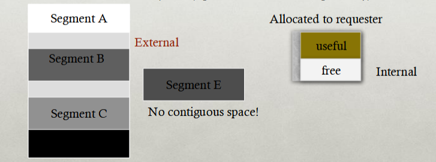

### Paging
- **Goal:** Eliminate requirement that address space is contiguous.
	- Eliminate external fragmentation.
	- Grow segments as needed.
- **Idea:** Divide address spaces and physical memory into fixed-sized pages.
	- Size: 2², Example: 4KB
	- Physical page: page frame.

#### Translation of Page Addresses
- How to translate logical address to physical address?
	- High order bits of address designate page number.
	- Low-order bits of address designate offset within page.
- **How does** format of address space determine number of pages and size of pages?
	- Figure out how many bits you need to locate all the addresses on the page.

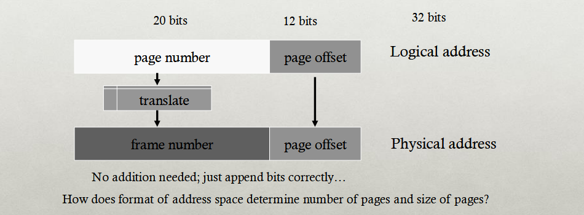

#### Where Are PageTables Stored?

> Short answer: Also in memory.

- How big is a typical page table?
	- Assume 32-bit address space.
	- Assume 4KB pages.
	- Assume 4 byte entries.
- Page table size = num entries ✕ size of each entry.
- Num entries = num virtual pages = 2^(bits for vpn)
- Bits for vpn (virtual page num) = 320 number of bits for page offset = 32 0 Ig(KB) = 32-12 = 20.

#IMPORTANT WILL BE ON EXAM A LOTTTTTT

#### Memory Accesses with Pages

```Assembly
0x0010: movl 0x110, %edi
0x0013: addl $0x3, %edi
0x0019: movl %edi, 0x110
```

- Assume PT is at phys addr 0x5000
- Assume PTE's are 4 bytes.
- Assume 4KB pages.
- How many bits for offset?
	- 12

###### Physical Memory Accesses with Paging?
1. Fetch instruction at logical addr 0x0010; vpn?

- Access page table to get ppn (Physical page number) for vpn 0.
- Memory ref 1: `0x5000`
- Learn vpn is at ppn 2.
- Fetch instruction at `0x2010` (mem ref. 2)

Exec, load from logical addr `0x1100`, vpn??

- Access page table to get ppn for vpn 1.
- Memory ref. 3: `0x5004`
- Learn vpn 1 is at ppn 0.
- `Movl` from `0x0100` into reg (mem ref 4)

> **Pagetable is slow!!!** Doubles memory references


### Multilevel Page Tables

##### Goal

Allow each page table to be allocated non-contiguously.

**Idea:** Page the page tables.

- Creates multiple levels of page tables; outer level "page directory"
- Only allocate page tables for pages in use.
- Used in x86  architectures (hardware can walk known structure)

#todo get the diagram...


> Current systems have 4 levels of page tables. (They only use 48 bits of the page table.)


- The multilevel page table uses a data structure known as a *radix tree*.
	- These radix trees have keys that are combined together with the different nodes in the tree.
- Each thing in the outer page table points to another entry in the *inner page*.
	- The *inner page* will also have entries that point to the actual physical page that contains your data.
	- **How do you know which inner page entries to actually access?**
- **The representation bits** can be *smaller*, but *cannot be bigger* than the 4KB size of each page.

> Think about it like a book. Outer page (page directory) is like a table of contents.


#### Address Format
- How should the logical address be structured?
	- How many bits for each paging level?
- **Goal:**
	- Each page table fits within a page.
	- PTE size \* number PTE (page table entry) = page size.
	- Assume PTE size is 4 bytes.

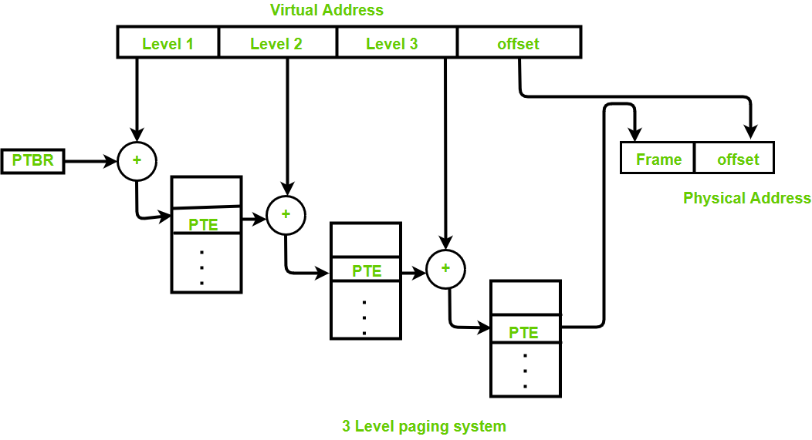

###### Example

- 30-bit address:
	- If you have a 4KB page, and each entry is 4 bytes...
		- You can only have 1024 entries...
	- With 18 bits for the page, `2^18` is a quarter of a million entries...
		- Way too many.
		- You can not use just 1 level, but you need 1 more level.


#### Problems

Problems with 2 levels?

> Page directories (outer level) may not fit in a page.

- Solution
	- Split page directories into pieces.
	- Use another page dir to refer to the page dir pieces.


	How large is virtual address space with 4 KB pages, 4 byte PTEs, each page table fits in pages given 1, 2, 3 levels?
	4 KB / 4 Bytes -> 1 K entries per level.
	1 level: 1 K * 4K = 2^22 ~ 4 MB
	2 levels: 1 K * 1K * 4K = 2^32 ~ 4 GB
	3 levels: 1 K * 1K * 1K * 4K = 2^42 ~ 4 TB

### Paging Pros & Cons

#### Advantage
- No external fragmentation
	- Don't need to find contiguous spaces.
	- Any page can be placed in any frame in physical memory.
- **Fast to allocate and free**
	- Alloc: No searching for suitable free space.
	- Free: Doesn't have to coalesce with adjacent free space.
	- Just use bitmap to show free/allocated page frames.
- **Simple to swap-out** portions of memory to disk
	- Page size matches disk block size.
	- Can run process when some pages are on disk.
	- Add "present" bit to PTE.

#### Disadvantage
- Internal fragmentation
	- Page size may not match size needed by process.
	- Waste memory grows with larger pages.
	- **Tension?**
- Addition memory reference to page table -> Very inefficient.
	- Page tables are also stored in memory.
	- The MMU stores only base address of page table.
	- Solution: [TLBs](#translation-lookaside-buffer).
- Storage for page tables may be substantial
	- Simple page table: Requires PTE for all pages in address space.
		- Entry needed even if page not allocated.
	- Problematic with dynamic stack and heap within address space.
	- Page tables must be allocated contiguously in memory.
	- Solution: Combine paging and segmentation.


##### Avoid Simple Linear Page Table
- Use more complex page tables, instead of just a big array.
- Any data structure is possible with software-managed TLB.
	- Hardware looks for vpn in TLB on every memory access.
	- If TLB does not contain vpn, TLB miss...
		- Trap into OS and let OS find vpn -> vpn translation.
		- OS notifies TLB of vpn -> ppn for future access.

##### Other Approaches
1. Inverted Pagetables
2. Segmented Pagetables
3. Multi-level Pagetables
	- Page the page tables.
	- Page the pagetables of the pagetables etc...


### Translation Steps

1. Extract **VPN** (Virtual page number) from **VA** (virtual address)
2. Calculate addr of **PTE** (page table entry)
3. Read **PTE** from memory (**expensive**)
4. Build **PA** (physical address)
5. Read contents of **PA** from memory into registers (**Expensive**)

### Paging and Segmentation

- Divide the address space into segments (code, heap, stack)
	- Segments can be variable length.
- Divide each segment into fixed-sized pages.
- Logical address divided into three portions.

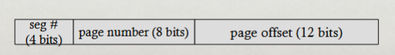

##### Implementation

- Each segment has a page table.
- Each segment track base (physical address) and bounds of **page table** for that segment.

#### Advantages of Paging and Segmentation

- Advantages of Segments
	- Supports sparse address spaces.
	- Decrease size of page tables.
	- If segment not used, not needed for page table.
- Advantages of Pages.
	- No external fragmentation.
	- Segments can grow without any reshuffling.
	- Can run process when some pages are swapped to disk.
- Advantages of Both
	- Increase flexibility of sharing
		- Share either single page or entire segment
		- How???

#### Disadvantages

- Potentially large page tables (for each segment)
	- Must allocate each page table contiguously.
	- More problematic with more address bits.
	- Page table size?
		- Assume 2 bits for segment, 18 bits for page number, 12 bits for offset.

				Each page table is:
				 = Number of entries * size of each entry
				 = Number of pages * 4 bytes
				 = 2^18 * 4 bytes = 2^20 bytes = 1 MB

## Translation Lookaside Buffer

- The translation lookaside buffer is address cache inside the CPU.
- It stores only translation addresses. 
- It's purpose is to mitigate some of the expenses of repeatedly accessing similar pages by keeping that address in this TLB.

### TLB Organization

#### TLB Entry

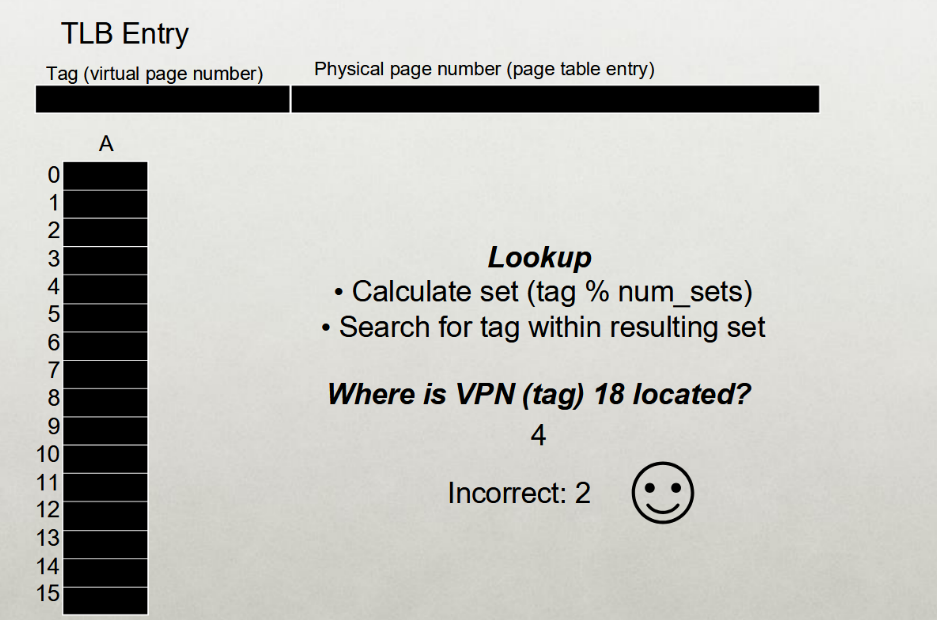


#### Associative vs Direct Mapped

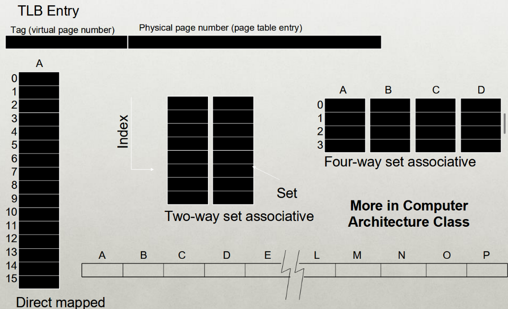

#### Set Associative

- There is a chance of multiple addresses getting mapped to the same location in the cache if you use a directly mapped cache. Each time a conflict happens, you must replace it, removing it from the cache.
- Set Associative TLBs try to mitigate this issue a little.
- Kick out the one that was least recently used (LRU)

##### TLB Associativity Trade-offs

- **Higher Associativity**
	- Better utilization, fewer collisions.
	- *Slower*
	- *More hardware*
- **Lower Associativity**
	- Fast
	- Simple, less hardware
	- *Greater chance of collisions*

> Usually, TLBs are fully associative.

#### TLB Performance

- How can system improve TL performance (Hit rate) given fixed number of TLB entries?
	- **Increase page size:**
		- Fewer unique page translations needed to access same amount of memory.
- **TLB reach:**
	- Number of TLB entries \* Page size

##### With Workloads

- Sequential array accesses almost always hit in the TLB.
	- Very fast!
- What access pattern will be slow?
	- Highly random, with no repeat 

#### Workload Locality

- **Spatial Locality:** Future access will be to nearby addresses.
- **Temporal Locality:** Future access will be repeats to the same data.
- What TLB Characteristics are best for each type?
	- *Spatial:*
		- Access same page repeatedly; need same vpn -> ppn translation
		- Same TLB entry re-used.
	- *Temporal:*
		- Access same address in near future...
		- Same TLB entry re-used in near future.
		- How near in future? How many TLB entries are there?


### Better Page Tables

> Problem: Simple linear page tables require too much contiguous memory.

- Many options for efficiently organizing page tables.
- If OS traps on TLB miss, OS can use any data structure.
	- Inverted page tables (hashing)
- If Hardware handles TLB miss, page tables must follow specific format.
	- Multi-level page tables used in x86 architecture.
	- Each page table fits within a page.

### Motivation

**OS Goal**: Support processes when not enough physical memory.

- Single process with very large address space.
- Multiple processes with combined address space.

User code should be independent of amount of physical memory.

- Correctness, if not performance.

> Virtual memory: OS provides illusion of more physical memory.

- **Why does this work?**
	- Relies on key properties of user processes (workload) and machine architecture (hardware)


#todo find what i missed? (probably 11/12)

### Locality of Reference

- Leverage *locality of reference* within processes.
	- *Spatial:* Reference memory addresses **near** previously referenced addresses.
		- Example of this would be accessing array entries.
	- *Temporal:* Reference memory addresses that have referenced in the past.
		- LRU and Clock LRU.
	- Processes spend majority of time in a small portion of the code...
		- *Estimate:* 90% of time in 10% of code.
- **Implication**
	- Process only uses small amount of address space at any moment.
	- Only small amount of address space must be resident in physical memory.

> Watermark threshold.


#### Virtual Memory Intuition

- Idea: OS keeps... #todo what????

#### Virtual Address Space Mechanisms

- Each page in virtual address space maps to one of three locations:
	- Physical main memory: Small, fast, expensive.
	- Disk (Backing store): Large, slow, cheap
	- Nothing (Error): Free
- Extend page tables with extra bit: `present`
	- `permissions (r/w), valid, present`
	- Page in memory: present bit `set` in PTE.
	- Page on disk: `present` bit cleared.
		- PTE points to block on disk.
		- Causes trap into OS when page is referenced.
		- **Trap: page fault**

> The OS is responsible for kicking out addresses from the TLB. So, it is also responsible for changing the bit.

