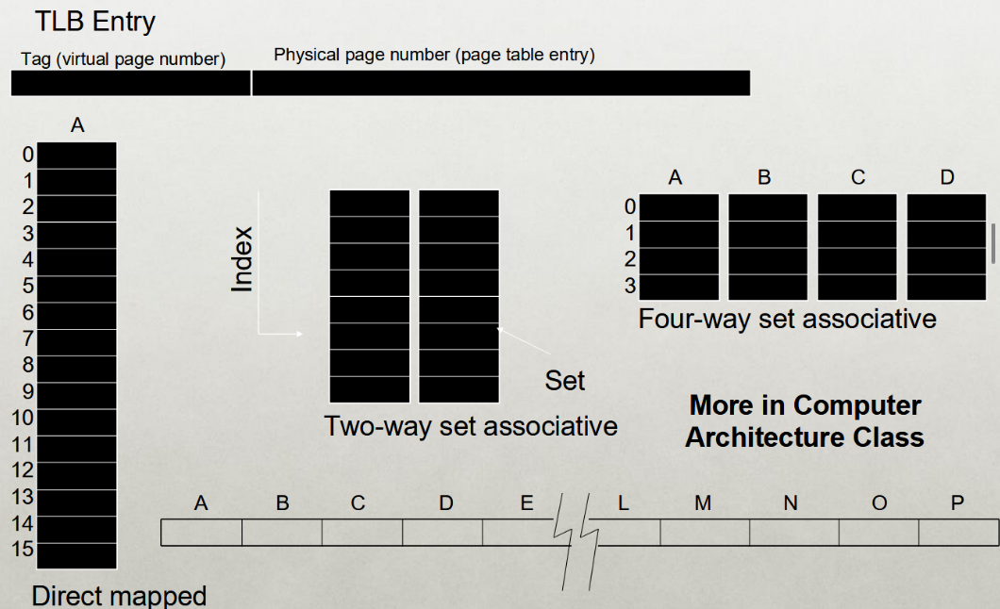

# Finals Review

- Format: 75% on material after the midterm, 25% on stuff before the midterm.
- **Virtual memory is a big portion**

## Memory Virtualization

> The overall goal of memory virtualization is to give each process the *illusion* of private memory space.

Whereas CPU Virtualization's goal is the *illusion* of private **CPU registers**, the goal of Memory Virtualization is the *illusion* of **private memory addresses.**

	Think about it as such:
	Process A: movq %rax %rdx
	Process B: movq %rdx %rcx
	This DOESN'T mean the contents of the %rax register is now in %rcx!!! (They are different processes, so each one's %rdx would contain different information)

	Same applies to memory:
	0xff1 in Process A != 0xff1 in Process B!!!

---

### Goals

#### Transparency
- Processes should not be aware that memory is being shared. (Goes back to the goal)
- There should be support for any number of processes, and regardless of where they are.

##### Protection

> Always, always, wear a -

- The process should not be able to corrupt the OS or any of the other processes.
- **Privacy:** Can not read the memory of another process.

##### Efficiency
- No waste of memory resources. (This means minimizing the amount of fragmentation)

##### Sharing
- Cooperating with other processes and sharing a portion of the address space. (If necessary)

### Memory Space Abstraction

> **Address Space:** Each process has a set of addresses that map to bytes.

- This address space has both *static* and *dynamic* components.
	- **Static**: Code and some global variables.
	- Dynamic: Stack and heap!


### Dynamic Memory Motivations

> *Variable amount of memory*

- *Why do processes need dynamic allocation of memory?*
	- Easy: You don't know the amount of memory needed at compile time.
		- So, if you allocate statically at runtime, you run into an issue where you MUST allocate for the worst case, meaning **storage is horribly inefficiently used!!!**
	- What else? **Recursive Operations!!!**
		- We love recursion ;-;
		- You don't know how many times the procedure will be nested within a recursive call.
	- **Complexed data structures:**
		- Lists and trees, they could be massive and can change in size.

> There are *two* types of dynamic allocations: **Stack and Heap**

- Stacks are used for procedure call frames such as *local variables and parameters*.

```C
main() {
	int A = 0; // Stored in stack!
	foo (A);
	printf("A: %d\n", A);
}

void foo (int Z) {
	int A = 2; // Stored in stack!!
	Z = 5;
	printf("A: %d Z: %d\n", A, Z);
}
```

#### Heaps

> Heap: Allocate from any random location using *library calls* like `malloc()` and `new()`

- Heap memory will usually consist of *allocated spaces* and *free spaces* (Damn holes)
- The order of allocation and free is unpredictable.

###### Advantage
- Heaps work for *all data structures!*

##### Disadvantages
- Allocation can be slow. 
- End with small chunks of free space. -> This is fragmentation!
	- Where would you allocate 12 bytes? 16 bytes? 24 bytes????

##### OS Role
- The OS is only in charge of giving a large chunk of free memory to processes, the libraries manage the *individual allocations*.
	- Like a rich dad giving his children money to start a business, but they decide what to do with it.

### Memory Time Sharing

> What if we try a similar approach to how the OS virtualizes the CPU?

- The OS gives the illusion of many virtual CPUs by saving CPU registers to *memory* when the process isn't running...
- Could we give the illusion of many virtual memories by saving **memory** to the **disk** when the process isn't running?


#### Problem
- This solution has a ridiculously poor performance.
- What happens if you have a massive system which has 83 gigabytes of RAM?
	- You can't write all that to the disk, that's insane.

> The better alternative to this solution would be *space sharing*

-  At the same time, space of memory is divided across the processes.

### Static Relocation

> The OS will rewrite each program *before* loading it as a process in memory.

- Each rewrite for the different process will use different addresses and pointers!
- Change jumps, loads of static data, etc...


#### Layout


#### Disadvantages
- There is no **protection!!!!**
	- Processes can just go and destroy the OS or any other processes as they wish.
	- There is no privacy. (Failed multiple of the goals of memory virtualization)
- It can not be moved after the address space has been placed....
	- What happens if you need to allocate a new process?
	- Heap should also dynamically grow with the memory...

### Dynamic Relocation

> Dynamic relocation aims to protect each process from one another. (*Requires hardware support*)

- Dynamic Relocation uses a MMU (Memory Management Unit) to *dynamically* change the process address at every memory reference.
	- Each process will generate a *logical / virtual* address within their address space.
	- The MMU will take this *logical / virtual* address and translate it.
	- The actual memory hardware will use *real / physical* addresses.


#### Hardware Support

- There are two operating modes for dynamic relocation:
	- *Privileged (Protected, kernel) mode* (White mode)
		- The OS will run in this mode. (Entering the OS through *traps, system calls, interrupts, exceptions*)
		- Allows for certain instructions to be executed.
			- Here, the contents of the MMU can be manipulated.
		- Allows OS to access all of the physical memory.
	- *User mode* (Minority mode)
		- Perform translation of logical addresses to physical address.
		- (*Important note*) The translation is performed in *user mode*, not privileged mode.


Minimal MMU contains **base register** for translations.

- This `base` is the start location for the address space.

#### Dynamic Relocation BASE REG

> This is the translation on every memory access of the user process.

- The MMU adds base register value to the logical address in order to form the physical address.
- Super simple calculation.


The idea is simply to translate the virtual address into a physical address by adding a fixed offset each time.

- This offset will be stored in the base register, and will be different for each process.
 


##### Problems
- **PROTECTIONNNNNNN**
	- THERE IS. NO. PROTECTION????
	- DAWG U CAN TOUCH OTHER PROCESSES WITHOUT ASKING.

#### Dynamic Relocation BASE+BOUNDS

> Limit the address space by adding a *bounds register*

- The base register will contain the smallest physical address (The starting location)
- The bounds register will contain the size of the process's virtual address space.
	- Sometimes can be defined as the largest physical address. (Base + size)
- The OS will kill the process if it loads/stores beyond the boundary.


- Pretty simple to understand.
- It's just an extra step added where another register stores the bounds information as compared to base.


##### Managing Processes w/BASE+BOUNDS
- Context-switch
	- Add base+bound registers to PCB.
	- Steps:
		- Change to privileged mode.
		- Save Base+bounds registers of old process.
		- Load Base+bounds registers of new process.
		- Change to user mode and jump to new process.
- **What if don't change** Base+bounds registers when switch?
- Protection requirement
	- User process cannot change Base+bounds registers.
	- User process cannot change to privilege mode.


##### Advantages

- Provides protection (both reading and writing) across the address spaces.
- Supports dynamic relocation!
	- Can place process at different locations than initially and also move the address space.
- It's also simple and inexpensive to implement.
	- Only takes a few registers and a little logic in the MMU.
- FAST
	- Add and compare in parallel.

##### Disadvantages

- Each process must be allocated contiguously in the physical memory...
	- Must allocate memory that may not be used by the process. (In order to remain within bounds.)
- This means there is also no partial sharing: You can not share limited parts of the address space. (OS will kill you.)

### Segmentation

> Divide up the address space into its own logical segments.

- Each segment will correspond to a logical entity in address space.
		- So, the *code*, the *stack* and the *heap* will all be **separate segments**.
- Each segment will be able to independently:
	- Be placed separately in physical memory.
	- Grow and shrink!
	- Be protected (Separate read/write/execute protection bits)

#### Segmented Addressing

> The process will now specify the segment and offset within the segment.

- How does the process designate a particular segment?
	- The process will use part of the logical address.
		- Top bits of the logical address select the segment.
		- Low bits will select the offset within the segment.
- What happens if it's a small address space, and there are not enough bits?
	- Implicitly by type of memory reference.
	- Special registers.

#### Segmentation Implementation

- The MMU will contain a Segment Table for each process.
	- Each segment will have it's own BASE+BOUNDS and protection bits.


##### Segmentation Example


#### Advantages of Segmentation
- Enables sparse allocation of address space.
	- Stack and heap can grow independently.
	- Heap: if no data on free list, dynamic memory allocator requests more from OS (e.g. UNIX: malloc calls `sbrk()`)
	- Stack: OS recognizes reference outside legal segment, extends stack implicitly.
- Different protection for different segments.
	- Read-only status for code.
- Enables sharing of selected segments.
- Supports dynamic relocation of each segment.

#### Disadvantages of Segmentation
- Each segment must be allocated contiguously.
	- May not have sufficient physical memory for large segments.

### Fragmentation

> Fragmentation is when free memory can't be usefully allocated.

- Why does this happen?
	- Free memory (holes) are too small and scattered about.
	- Rules for allocating memory prohibit using this free space.
- Types of Fragmentation: (**IMPORTANT**)
	- External: Visible to the allocator (e.g. OS)
	- Internal: Visible to requesters (e.g. if must allocate at some granularity)


---

> Note: As Paging is such an important portion, it will have it's own dedicated section

---

## Paging

> Dividing up the address space and physical memory into fixed-sized *pages*.

- **Goal**: Eliminate the requirement for contiguous address space.
	- This will eliminate any external fragmentation.
	- Allow the segments to grow as needed.


### Translation

- How to translate logical address to physical address?
	- High order bits of address designate page number.
	- Low-order bits of address designate offset within page.
- **How does** format of address space determine number of pages and size of pages?
	- Figure out how many bits you need to locate all the addresses on the page.


#### Virtual to Physical Page Mapping

- How should the OS translate the VPN (Virtual Page Number) to the PPN (Physical page number)?
- For segmentation, a formula was used. (`BASE`)
- For paging, OS needs a more general mapping mechanism...


### Page Tables

> Basically a big array containing the locations of the different page mappings.

##### Page Table Size

	Pages are typically 4KB
	Entries are 4 bytes

- The page table size is the *number of entries* \* the *size of each entry*.
- The Number of entries would be the number of virtual pages, which is decided by the amount of bits for the VPN. (2^VPN bits)
- Bits for VPN are decided as Address space (Ex: 32-bit address spaces would be 32...) - the page offset bits
	- The number of page entries would then be 2^(32-12) (assuming 4 KB pages)
	- Page Table size would then be: # of entries (2^20) \* size of each entry (4 bytes) = 4MB.

#### Storing Page Tables

> Also stored in the memory.

- The hardware will find the page table base with a register.
- When context-switching, change the contents of the page table base register to newly scheduled process.
- Save the old page table base register in the *Process control block* of descheduled process.

---

> NOTE: Page Tables are *slooooooow*, they double the number of memory references you need.

To get the physical address of a virtual address like `Oxfff000`, you need to first access the page table, find the translation to the PPN, and *then* you can add the offset on to find the address.

---
##### Advantages of Paging

- There is no external fragmentation.
	- As the pages are divided up into explicit sizes, the pages can be placed in any frame in physical memory.
- Fast to allocate and free.
	- *Alloc*: There is no need to search for suitable free space.
	- *Free*: Doesn't have to coalesce adjacent free spaces since it's all pages.
	- **Use bitmap** to show the freed or allocated page frames. (*This is what makes it fast!!!*)
- It is simple to swap-out portions of memory to the disk.
	- As the page size matches the disk block size...
	- You can run processes when some pages for the process are on disk.
		- *Adding a "present" bit to the PTE*


##### Disadvantages of Paging

- Internal fragmentation
	- Page sizes may not match the size needed by the process. (You waste memory, especially with larger page sizes)
- Additional memory reference to page table.
	- The page table is also stored in memory....
		- The MMU only stores the base address of the page table, meaning you need to find the translation and access the data there.
	- As mentioned earlier, *you double* the memory references.
- The storage for page tables may be substantial.
	- Simple page table: Requires PTE for all pages in the address space.
		- Entry is still needed even if the page is not allocated.
	- Problematic with dynamic stack and heap within address space.
	- Page tables also must be allocated contiguously in memory.

### Multilevel Page Tables

> Multilevel page tables split up page tables into *different levels.*

- **Goal:** Allowing each page table to be allocated non-contiguously.
- **Idea:** Page the page tables.
	- Create multiple levels of page tables, with the outermost level being called the "**Page directory**"
	- Only allocate page tables for pages in use.


- The multilevel page table uses a *radix tree* data structure.
	- Keys combine together from the different nodes in the tree.
- Each entry in the outer page tables point toward another entry in a *inner page*.
	- The *inner page* will have entries that point toward the actual physical page location of the data.
	- This is why the virtual address is now further divided.
- **Representation bits** for the page tables can be *smaller* but can NOT be *bigger* than the size of each table.

#### Address Format for Multilevel Paging

	Given a 30-bit address, 4KB page size, 4 byte entries.

- How should the logical address be structured?
	- How many bits for each paging level?
- **The goal is to fit each page table within a single page!!**
	- `4KB page size = 12 bits for offset.`
	- `4KB page size / 4 byte entry = 1024 entries`
	- `1024 entries is 1KB or 2^10`, we need 10 bits for the inner page.
	- `30 - 10 - 12 = 8`, we have 8 bytes left for the outer page directory.

##### Problems with 2 Levels

	What happens if you have a 64-bit address? 
	Maintaining 4KB page size and 4 byte entries.
	
- `4KB page size = 2^12 bit offset`
- `4KB / 4 bytes per entry means 1024 entries for inner page`
- `64 - 10 - 12 = 42 bits for outer directory?`
- `2^42 is 4.3980465e+12 PAGE TABLES!!!!`

Solution:

- Split the page directory into more pieces!
- Use another page directory to refer to the page directory pieces.


	How large is virtual address space with 4 KB pages, 4 byte PTEs, each page table fits in pages given 1, 2, 3 levels?
	4 KB / 4 Bytes -> 1 K entries per level.
	1 level: 1 K * 4K = 2^22 ~ 4 MB
	2 levels: 1 K * 1K * 4K = 2^32 ~ 4 GB
	3 levels: 1 K * 1K * 1K * 4K = 2^42 ~ 4 TB

> *Side Note:* Current systems have 4 levels of page tables, but they only use 48 bits of the page table.

### Paging and Segmentation

> Segmented memory, then take the portions and divvy them into pages.

- Divide the address space into different segments (code, heap, stack)
	- These segments can be of variable length.
- Then, divide each segment into fixed size pages.
- Logical address will now be divided into three portions!


#### Implementation

- Each segment has a page table.
- Each segment track will track the base (physical address)  and bounds of the *page table* for that segment.

##### Implementation Practice


#### Advantages of Paging and Segmentation

> Combines the advantages of both Segments and Pages

- Advantages of Segments
	- Supports sparse address spaces.
	- Decreases the size of page tables.
	- If the segment is not being used, there's no need for a page table.
- Advantages of pages
	- No external fragmentation.
	- Segments are allowed to grow without reshuffling
	- Can run process when some pages are swapped to disk.
- Advantages of Both
	- Increases flexibility of sharing.
	- You can either share one single page or entire segment.

#### Disadvantages

- Potentially large page tables (for each segment)
	- Must allocate each page table contiguously.
	- More problematic with more address bits.
- Page table size?
	- Assume 2 bits for segment, 18 bits for page number, 12 bits for offset.

---

	Each page table is:
	 = Number of entries * size of each entry
	 = Number of pages * 4 bytes
	 = 2^18 * 4 bytes = 2^20 bytes = 1 MB

---

### Translation Lookaside Buffer

> A caching system for storing page translations.


- The TLB (Translation lookaside buffer) is an address cache inside the CPU.
- It *only stores translation addresses*
- It's purpose is to mitigate some of the expenses of repeatedly accessing similar pages by keeping that address in the TLB.

#### TLB Organization


##### Associative cs Direct Mapped



##### Set Associative Cache

- There are multiple addresses that may be mapped to the same cache when using a *directly mapped cache.*
- Set associative TLBs try to mitigate this issue a little.
- Ex: Kick out the one that was *least recently used*.

##### Associativity Tradeoffs

- *Higher associativity*
	- Less of a chance of collisions for mapping to the same location in the cache.
	- However: *Slower in implementation* and *needs more hardware*
- *Lower associativity*
	- Fast and simple, *less hardware needed*
	- However: Greater chance of collisions.

> **Note:** Typically, TLBs are fully associative.

###### Sequential TLB Accessing Example


#### TLB Performance

> Calculating the miss rate of TLB for data is simple: `# of TLB misses / # TLB lookups`

Example:

```c
int sum = 0;
fopr(int i = 0; i < 2048; i++) {
	sum += a[i];
}
```

	In this example...
	Total TLB lookups will be: 2048
	Total Misses: 2 (Once when i = 0, and another time when i = 1024)
		Or, think about it as the number of unique pages accessed:
		2048 / (elements of 'a' per 4K page)
		= 2K / (4K / sizeof(int)) = 2K / 1K
		= 2
	This means:
		Miss rate: 2/2048 = 0.1%
		Hit Rate: (1 - miss rate) 2046/2048 = 99.9%

> **Note:** Hit rates will get **WORSE** will smaller pages. (You need to check more unique pages)

---

- How can system improve TL performance (Hit rate) given fixed number of TLB entries?
	- **Increase page size:**
		- Fewer unique page translations needed to access same amount of memory.
- **TLB reach:** `Number of TLB entries \* Page size`

---

##### TLB Performance with Workloads

- Sequential array access will *almost always* hit in the TLB, making it fast af.
- A slower access pattern would involve highly random accesses, with **no repeated accesses**.
	- This gives the cache no purpose.


##### Workload Locality

- **Spatial Locality:** Future access will be to a nearby address.
- **Temporal Locality:** Future access will repeat to the same exact data.
- What TLB characteristics are best for each type?
	- *Spatial:*
		- Since the same page is used repeatedly, we need the same VPN to PPN translation.
		- The same exact TLB entry is used.
	- *Temporal:*
		- Accessing the same address in the near future.
		- The same TLB entry will be used in the near future again.
			- How near is this "future"? (Not the rapper)
			- How many TLB entries are there???

### Memory Policy

